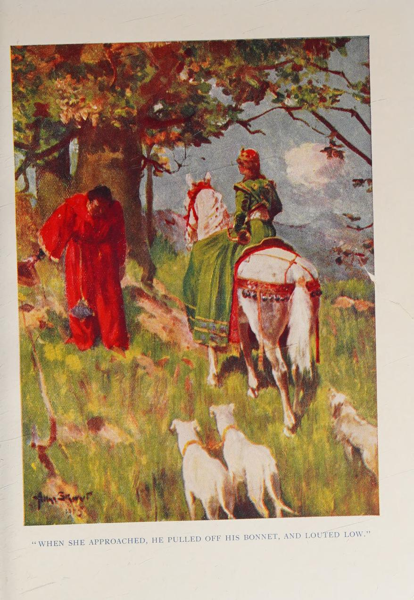

# Thomas the Rhymer

Duncan Williamson
https://www.tobarandualchais.co.uk/track/91094?l=en

See also:
Put another log in the fire, Songs and tunes from a Scots Traveller, Veteran Tapes VT128 (cassette)

Story:
https://en.wikipedia.org/wiki/Thomas_the_Rhymer

O true Thomas he lay on a Huntly bank  
Beneath an Eilton tree  
O when he saw a lady fair  
Comin ridin oer the lea

O her mantle it was of the forest green  
And her tresses they were so fair  
And from every tass of her horse's mane  
Hung twenty siller bells and mair

O Thomas he doffed off his hat  
He got down upon his knee  
He said - Lady you're the greatest queen  
That ever I did see

O no O no O Thomas - she said  
That name does not belong to me  
For I have come from Elfinland  
I have come to visit thee

And you maun come O Thomas - she said  
You maun come along wi me  
For I am bound for Elfinland  
It is very far away

So they rode and they rode and they merrily merrily rode  
O merrily they rode away  
Until they came to a crystal river  
That lay across their way

What river is this? O Thomas he said  
O please to me do say  
This is a river of tears - she said  
That is spilled on this earth in one day

So they rode and they rode and they merrily merrily rode  
They rode for a night and a day  
Until they came to a red river  
That lay across their way

What river is this? O Thomas he said  
O please to me do say  
This is a river of blood - she said  
That is spilled on this earth in one day

So they rode and they rode and they merrily merrily rode  
O merrily they rode away  
Until they came to a thorny road  
That lay across their way

What road is that? O Thomas he said  
O please to me do tell  
That is a road you must never lead  
For that road it leads to hell

So they rode and they rode and they merrily merrily rode  
Merrily they rode away  
Until they came to a great orchard  
That lay across their way

Lie down, lie down O Thomas - he cried  
O it's hungry that I maun be  
Lie down, lie down O Thomas he cried  
Some fine apples I do see

O touch them not - the Elfin queen said  
Please touch them not I say  
For they are made from the curses  
That fall on this earth in one day

Then reachin up into a tree  
Into a tree so high  
She plucked an apple from a tree  
As they went riding by

O eat you this O Thomas - she said  
As we go riding by  
And it will give to you a tongue  
You shall never tell a lie

So they rode and they rode and they merrily merrily rode  
O they rode for a year and a day  
Until they came to a great valley  
That lay across their way

What place is this? O Thomas he said  
O please to me do say  
O this is Elfinland - she said  
And it's here that you maun stay

So Thomas got a coat of lovely brown  
And some shoes of elfin green  
And for seven long years and a day  
On earth he was never seen

----

https://archive.org/details/talesfromscottis0000eliz/page/194/mode/2up
Tales from Scottish Ballads
by Elizabeth W. Grierson

Publication date 1930

pp195-213 with illustration / plate opp. p198

THOMAS THE RHYMER

"True Thomas lay on Huntly bank;  
A ferlie he spied with his e'e;  
And there he saw a ladye bright,  
Came riding down by the Eildon tree."

More than six hundred years ago, there lived in the south of Scotland a very wonderful man named Thomas of Ercildoune, or Thomas the Rhymer.

He lived in an old tower which stood on the banks of a little river called the Leader, which runs into the Tweed, and he had the marvellous gift, not only of writing beautiful verses, but of forecasting the future:— that is, he could tell of events long before they happened.

People also gave him the name of True Thomas, for they said that he was not able to tell a lie, no matter how much he wished to do so, and this gift he had received, along with his gift of prophecy, from the Queen of the Fairies, who stole him away when he was young, and kept him in fairyland for seven years and then let him come back to this world for a time, and at last took him away to live with her in fairyland altogether.

I do not say that this is true; I can only say again that Thomas the Rhymer was a very wonderful man; and this is the story which the old country folk in Scotland tell about him.

One St Andrew's Day, as he was lying on a bank by a stream called the Huntly Burn, he heard the tinkling of little bells, just like fairy music, and he turned his head quickly to see where it was coming from.

A short distance away, riding over the moor, was the most beautiful lady he had ever seen. She was mounted on a dapple-gray palfrey, and there was a halo of light shining all around her. Her saddle was made of pure ivory, set with precious stones, and padded with crimson satin. Her saddle girths were of silk, and on each buckle was a beryl stone. Her stirrups were cut out of clear crystal, and they were all set with pearls. Her crupper was made of fine embroidery, and for her bridle she used a gold chain.

She wore a riding-skirt of grass-green silk, and a mantle of green velvet, and from each little tress of hair in her horse's mane hung nine and fifty tiny silver bells. No wonder that, as the spirited animal tossed its dainty head, and fretted against its golden rein, the music of these bells sounded far and near.

She appeared to be riding to the chase, for she led seven greyhounds in a leash, and seven otter hounds ran along the path beside her, while round her neck was slung a hunting-horn, and from her girdle hung a sheaf of arrows.

As she rode along she sang snatches of songs to herself, or blew her horn gaily to call her dogs together.

"By my faith," thought Thomas to himself, "it is not every day that I have the chance of meeting such a beauteous being. Methinks she must be the Virgin Mother herself, for she is too fair to belong to this poor earth of ours. Now will I hasten over the hill, and meet her under the Eildon Tree; perchance she may give me her blessing."

So Thomas hasted, and ran, and came to the Eildon Tree, which grew on the slope of the Eildon Hills, under which, 'tis said, King Arthur and his Knights lie sleeping, and there he waited for the lovely lady.

When she approached he pulled off his bonnet and louted `[Bowed]` low, so that his face well-nigh touched the ground, for, as I have said, he thought she was the Blessed Virgin, and he hoped to hear some words of benison.

But the lady quickly undeceived him. "Do not do homage to me," she said, "for I am not she whom thou takest me for, and cannot claim such reverence. I am but the Queen of Fairyland, and I ride to the chase with my horn and my hounds."

Then Thomas, fascinated by her loveliness, and loth to lose sight of her, began to make love to her; but she warned him that, if he did so, her beauty would vanish in a moment, and, worse still, she would have the power to throw a spell over him, and to carry him away to her own country. But I wot that her spell had fallen on Thomas already, for it seemed to him that there was nothing on earth to be compared to her favour.

"Here pledge I my troth with thee," he cried recklessly, "and little care I where I am carried, so long as thou art beside me," and as he said this, he gave her a kiss.

What was his horror, as soon as he had done so, to see an awful change come over the lady. Her beautiful clothes crumbled away, and she was left standing in a long ash-coloured gown. All the brightness round her vanished; her face grew pale and colourless; her eyes turned dim, and sank in her head; and, most terrible of all, one-half of her beautiful black hair went gray before his eyes, so that she looked worn and old.

A cruel smile came on her haggard face as she cried triumphantly, "Ah, Thomas, now thou must go with me, and thou must serve me, come weal, come woe, for seven long years."

Then she signed to him to get up behind her on her gray palfrey, and poor Thomas had no power to refuse. He glanced round in despair, taking a last look at the pleasant country-side he loved so well, and the next moment it vanished from his eyes, for the Eildon Hills opened beneath them, and they sank in gloomy caverns, leaving no trace behind.

For three days Thomas and the lady travelled on, in the dreadful gloom. It was like riding through the darkness of the darkest midnight. He could feel the palfrey moving beneath him; he could hear, close at hand, the roaring of the sea; and, ever as they rode, it seemed to him that they crossed many rivers, for, as the palfrey struggled through them, he could feel the cold rushing water creeping up to his knees, but never a ray of light came to cheer him.

He grew sick and faint with hunger and terror, and at last he could bear it no longer.

"Woe is me," he cried feebly, "for methinks I die for lack of food."

As he spoke these words, the lady turned her horse's head in the darkness, and, little by little, it began to grow lighter, until at last they emerged in open daylight, and found themselves in a beautiful garden.

It was full of fruit trees, and Thomas feasted his eyes on their cool green leaves and luscious burden; for, after the terrible darkness he had passed through, this garden seemed to him like the Garden of Paradise.

There were pear trees in it, covered with pears, and apple trees laden with great juicy apples; there were dates, and damsons, and figs, and grapes. Brightly coloured parrots were flitting about among the branches, and everywhere the thrushes were singing.

The lady drew rein under an apple tree, and, reaching up her hand, she plucked an apple, and handed it to him. "Take this for thine arles," `[Money paid at the engagement of a servant.]` she said ; "it will confer a great gift on thee, for it will give thee a tongue that cannot lie, and from henceforth men shall call thee 'True Thomas.'"

Now, I am sorry to say that Thomas was not very particular about always being truthful, and this did not seem to him to be a very enviable gift. He wondered to himself what he would do if ever he got back to earth, and was always obliged to tell the truth, whether it were convenient or not.

"A bonnie gift, forsooth!" he said scornfully. "My tongue is my own, and I would prefer that no one meddled with it. If I am obliged always to tell the truth, how shall I fare when I once more go back to the wicked world? When I take a cow to market, have I always to point out the horn it hath lost, or the piece of skin that is torn? And when I talk to my betters, and would crave a boon of them, must I always tell them my real thoughts, instead of giving them the flattery which, let me tell you, Madam, goes a long way in obtaining a favour?"

"Now hold thy peace," said the lady sharply, "and think thyself favoured to see food at all. Many miles of our journey lie yet before us, and already thou criest out for hunger. Certs, if thou wilt not eat when thou canst, thou shalt have no more opportunity."

Poor Thomas was so hungry, and the apple looked so tempting, that at last he took it and ate it, and the Grace of Truth settled down on his lips for ever: that is why men called him "True Thomas," when in after years he returned to earth.

Then the lady shook her bridle rein, and the palfrey darted forward so quickly that it appeared to be almost flying. On and on they flew, until they came to the World's End, and a great desert stretched before them. Here the lady bade Thomas dismount and lean his head against her knee. "I have three wonders to show thee, Thomas," she said, "and it is thus that thou canst see them best."

Thomas did as he was bid, and when he laid his head against the Fairy Queen's knee, he saw three roads stretching away before him through the sand.

One of them was a rough and narrow road, with thick hedges of thorn on either side, and branches of tangled briar hanging down from them, and lying across the path. Any traveller who travelled by that road would find it beset with many difficulties.

The next road was smooth and broad, and it ran straight and level across the plain. It looked so easy a way that Thomas wondered that anyone ever wanted to go along the narrow path at all.

The third road wound along a hillside, and the banks above it and below it were covered with beautiful brackens, and their delicate fronds rose high on either side, so high, indeed, that they would shelter the wayfarer from the burning heat of the noonday sun.

"That is the best road of all," thought Thomas to himself; "it looks so fresh and cool, I should like to travel along it."

Then the lady's voice sounded in his ears. "Seest thou that narrow path," she asked, "all set about with thorns and briars? That is the Path of Righteousness, and there be but few, oh, so few! who ever ask where it leads to, or who try to travel by it. And seest thou that broad, broad road, that runs so smoothly across the desert? That is the Path of Wickedness, and I trow it is a pleasant way, and easy to travel by. Men think it so, at least, and, poor fools, they do not trouble to ask where it leads to. Some would fain persuade themselves that it leads to Heaven, but Heaven was never reached by an easy road. 'Tis the narrow road through the briars and thorns that leads us thither, and wise are the men who follow it. And seest thou that bonnie, bonnie road, that winds up round the ferny brae? That is the way to Fairyland, and that is the road which lies before us."

Here Thomas was about to speak, and to remonstrate with her for carrying him away, but she interrupted him.

"Hush," she said, "thou must be silent now, Thomas; the time for speech is past. Thou art on the borders of Elfland, and if ever mortal man speak a word in Elfland, he can nevermore go back to his own country."

So Thomas held his peace, and climbed sadly on the palfrey's back, and once more they started on their awful journey. On and on they went. The beautiful road through the ferns was soon left behind, and great mountains had to be crossed, and steep, narrow valleys, until at last, far away in the distance, a splendid castle appeared, standing on the top of a high hill. .

It was built of pure white marble, with massive towers, and lovely gardens stretched in front of it.

"That castle is mine," said the lady proudly. "It belongs to me, and to my husband, who is the King of this country. He is a jealous man, and one greatly to be feared, and, if he knew how friendly thou and I have been, he would kill thee in his rage. Remember, therefore, what I told thee about keeping silence. Thou canst talk to me, as thou wilt, if an opportunity offers, but see to it that thou answerest no one else. There are knights and squires in abundance at my husband's court, and doubtless they would fain question thee about the country from whence thou art come, but thou must pay no heed to them, and I shall pretend that thou talkest in an unknown tongue, and that I learned to understand it in thine own country."

While she was speaking, Thomas was amazed to see that a great change had passed over her again. Her face grew bright, and her gray gown vanished, and the green mantle took its place, and once more she became the beauteous being who had charmed his eyes at the Huntly Burn. And he was still more amazed when, on looking down, he found that his own raiment was changed too, and that he was now dressed in a suit of soft, fine cloth, and that on his feet he wore velvet shoon.

The lady lifted the golden horn which hung from a cord round her neck, and blew a loud blast. At the sound of it all the squires, and knights, and great court ladies came hurrying out to meet their Queen, and Thomas slid from the palfrey's back, and walked humbly at her elbow.

As she had foretold, the pages and squires crowded round him, and would fain have learned his name, and the name of the country to which he belonged, but he pretended not to understand what they said, and so they all came into the great hall of the castle.

At the end of this hall there was a dais, and on it were two thrones. The King of Fairyland was sitting on one, and when he saw the Queen, he rose, and stretched out his hand, and led her to the other, and then a rich banquet was served by thirty knights, who offered the dishes on their bended knees. After that all the court ladies went up and did homage to their Royal Mistress, while Thomas stood, and gazed, and wondered at all the strange things which he saw.

At one side of the hall there was a group of minstrels, playing on all manner of strange instruments. There were harps, and fiddles, and gitterns, and psalteries, and lutes and rebecks, and many more that he could not name. And when these minstrels played, the knights and the gay court ladies danced or played games, or made merry jokes amongst themselves; while at the other side of the hall a very different scene went on. There were thirty dead harts lying on the stone floor, and stable varlets carried in dead deer until there were thirty of them stretched beside the harts, and the dogs lay and licked their blood, and the cooks came in with their long knives and cut up the animals, in the sight of all the court.

It was all so weird and horrible that Thomas wondered what manner of folk he had come to dwell among, and if he would ever get back to his own country.

For three days things went on in the same manner, and still he looked and wondered, and still he spoke to no one, not even to the Queen.

At last she spoke to him. "Dress thee, and get thee gone, Thomas," she said, "for thou mayest not linger here any longer. Myself will convey thee on thy journey, and take thee back safe and sound to thine own country again."

Thomas looked at her in amazement. "I have only been here three days," he said, "and methought thou spakest of seven years."

The lady smiled.

"Time passes quickly in this country, Thomas," she replied. "It may not appear so long to thee, but it is seven long years and more, since thou camest into Fairyland. I would fain have kept thee longer; but it may not be, and I will show to thee the reason. Every seven years an evil spirit comes, and chooses someone out of our court, and carries him away to unknown regions, and, as thou art a stranger, and a goodly fellow withal, I fear me his choice would fall on thee; and although I brought thee here, and have kept thee here for seven years, twill never be said that I betrayed thee to an evil spirit. Therefore this very night we must be gone."

So once more the gray palfrey was brought, and Thomas and the lady mounted it, and they went back by the road by which they had come, and once more they came to the Eildon Tree.

The sun was shining when they arrived, and the birds singing, and the Huntly Burn tinkling just as it had always done, and it seemed to Thomas more impossible than ever that he had been away from it all for more than seven years.

He felt strangely sorry to say farewell to the beautiful lady, and he asked her to give him some token that would prove to people that he had really been in Fairyland.

"Thou hast already the Gift of Truth," she replied, "and I will add to that the Gift of Prophecy, and of writing wondrous verses; and here is a harp that was fashioned in Fairyland. With its music, set to thine own words, no minstrel on earth shall be to thee a rival. So shall all the world know for certain that thou learnedst the art from no earthly teacher; and some day, perchance, I will return."

Then the lady vanished, and Thomas was left all alone.

After this, he lived at his Castle of Ercildoune for many a long year, and well he deserved the names of Thomas the Rhymer, and True Thomas, which the country people gave him; for the verses which he wrote were the sweetest that they had ever heard, while all the things which he prophesied came most surely to pass.

It is remembered still how he met Cospatrick, Earl of March, one sunny day, and foretold that, ere the next noon passed, a terrible tempest would devastate Scotland. The stout Earl laughed, but his laughter was short, for by next day at noon the tidings came that Alexander III., that much loved King, was lying stiff and stark on the sands of Kinghorn. He also foretold the battles of Flodden and Pinkie, and the dule and woe which would follow the defeat of the Scottish arms; but he also foretold Bannockburn, where

"The burn of breid  
Shall run fow reid,"

and the English be repulsed with great loss. He spoke of the Union of the Crowns of England and Scotland, under a prince who was the son of a French Queen, and who yet had the blood of Bruce in his veins. Which thing came true in 1603, when King James, son of the ill-fated Mary, who had been Queen of France as well as Queen of Scots, began to rule over both countries.

In view of these things, it was no wonder that the fame of Thomas of Ercildoune spread through the length and breadth of Scotland, or that men came from far and near to listen to his wonderful words.

Twice seven years came and went, and Scotland was plunged in war. The English King, Edward I., after defeating John Baliol at Dunbar, had taken possession of the country, and the doughty William Wallace had arisen to try to wrest it from his hand. The tide of war ebbed and flowed, now on this side of the Border, now on that, and it chanced that one day the Scottish army rested not far from the Tower of Ercildoune.

Beacons blazed red on Ruberslaw, tents were pitched at Coldingknowe, and the Tweed, as it rolled down to the sea, carried with it the echoes of the neighing of steeds, and of trumpet calls.

Then True Thomas determined to give a feast to the gallant squires and knights who were camped in the neighbourhood—— such a feast as had never been held before in the old Tower of Ercildoune. It was spread in the great hall, and nobles were there in their coats of mail, and high-born ladies in robes of shimmering silk. There was wine in abundance, and wooden cups filled with homebrewed ale.

There were musicians who played sweet music, and wonderful stories of war and adventure went round.

And, best of all, when the feast was over, True Thomas, the host, called for the magic harp which he had received from the hands of the Elfin Queen. When it was brought to him a great silence fell on all the company, and everyone sat listening breathlessly while he sang to them song after song of long ago.

He sang of King Arthur and his Table, and his Knights, and told how they lay sleeping under the Eildon Hills, waiting to be awakened at the Crack of Doom. He sang of Gawaine, and Merlin, Tristrem and Isolde; and those who listened to the wondrous story felt somehow that they would never hear such minstrelsy again.

Nor did they. For that very night, when all the guests had departed, and the evening mists had settled down over the river, a soldier, in the camp on the hillside, was awakened by a strange pattering of little feet on the dry bent `[Withered grass.]` of the moorland.

Looking out of his tent, he saw a strange sight.

There, in the bright August moonlight, a snow-white hart and hind were pacing along side by side. They moved in slow and stately measure, paying little heed to the ever-increasing crowd who gathered round their path.

"Let us send for Thomas of Ercildoune," said someone at last; "mayhap he can tell us what this strange sight bodes."

"Yea, verily, let us send for True Thomas," cried everyone at once, and a little page was hastily despatched to the old tower.

Its master started from his bed when he heard the message, and dressed himself in haste. His face was pale, and his hands shook.

"This sign concerns me," he said to the wondering lad. "It shows me that I have spun my thread of life, and finished my race here."

So saying, he slung his magic harp on his shoulder, and went forth in the moonlight. The men who were waiting for him saw him at a distance, and 'twas noted how often he turned and looked back at his old tower, whose gray stones were touched by the soft autumn moonbeams, as though he were bidding it a long farewell.

He walked along the moor until he met the snow-white hart and hind; then, to everyone's terror and amazement, he turned with them, and all three went down the steep bank, which at that place borders the Leader, and plunged into the river, which was running at high flood.

"He is bewitched! To the rescue! To the rescue, ere it be too late!" cried the crowd with one voice.

But although a knight leaped on his horse in haste, and spurred him at once through the raging torrent, he could see nothing of the Rhymer or his strange companions. They had vanished, leaving neither sign nor trace behind them; and to this day it is believed that the hart and the hind were messengers from the Queen of the Fairies, and that True Thomas went back with them to dwell in her country for ever.

---

The following includes the Fiddlers of Tomnahurich (Inverness)

https://archive.org/details/wondertalesfroms00mack/page/146/mode/2up
Wonder tales from Scottish myth & legend
by Mackenzie, Donald Alexander, 1873-1936; Duncan, John, ill

Publication date 1917

pp. 147-60

CHAPTER XII Story of Thomas the Rhymer

At the beginning of each summer, when the milk-white hawthorn is in bloom, anointing the air with its sweet odour, and miles and miles of golden whin adorn the glens and hill-slopes, the fairies come forth in grand procession, headed by the Fairy Queen. They are mounted on little white horses, and when on a night of clear soft moonlight the people hear the clatter of many hoofs, the jingling of bridles, and the sound of laughter and sweet music coming sweetly down the wind, they whisper one to another: "'Tis the Fairy Folks' Raid", or "Here come the Riders of the Shee".

The Fairy Queen, who rides in front, is gowned in grass-green silk, and wears over her shoulders a mantle of green velvet adorned with silver spangles. She is of great beauty. Her eyes are like wood violets, her teeth like pearls, her brow and neck are swan-white, and her cheeks bloom like ripe apples. Her long clustering hair of rich auburn gold which falls over her shoulders and down her back, is bound round about with a snood that glints with star-like gems, and there is one great flashing jewel above her brow. On each lock of her horse's mane hang sweet-toned silver bells that tinkle merrily as she rides on.

The riders who follow her in couples are likewise clad in green, and wear little red caps bright as the flaming poppies in waving fields of yellow barley. Their horses' manes are hung with silver whistles upon which the soft winds play. Some fairies twang harps of gold, some make sweet music on oaten pipes, and some sing with birdlike voices in the moonlight. When song and music cease, they chat and laugh merrily as they ride on their way. Over hills and down glens they go, but no hoof-mark is left by their horses. So lightly do the little white creatures trot that not a grass blade is broken by their tread, nor is the honey-dew spilled from blue harebells and yellow buttercups. Sometimes the fairies ride over tree-tops or through the air on eddies of western wind. The Riders of the Shee always come from the west.

When the Summer Fairy Raid is coming, the people hang branches of rowan over their doors and round their rooms, and when the Winter Raid is coming they hang up holly and mistletoe as protection from attack; for sometimes the fairies steal pretty children while they lie fast asleep, and carry them off to Fairyland, and sometimes they lure away pipers and bards, and women who have sweet singing voices.

Once there was a great bard who was called Thomas the Rhymer. He lived at Ercildoune (Earlston), in Berwickshire, during the thirteenth century. It is told that he vanished for seven years, and that when he reappeared he had the gift of prophecy. Because he was able to foretell events, he was given the name of True Thomas.

All through Scotland, from the Cheviot Hills to the Pentland Firth, the story of Thomas the Rhymer has long been known.

During his seven years' absence from home he is said to have dwelt in fairyland. One evening, so runs the tale, he was walking alone on the banks of Leader Water when he saw riding towards him the Fairy Queen on her milk-white steed, the silver bells tinkling on its mane, and the silver bridle jingling sweet and clear. He was amazed at her beauty, and thinking she was the Queen of Heaven, bared his head and knelt before her as she dismounted, saying: "All hail, mighty Queen of Heaven! I have never before seen your equal."

Said the green-clad lady: "Ah! Thomas, you have named me wrongly. I am the Queen of Fairyland, and have come to visit you."

"What seek you with me?" Thomas asked.

Said the Fairy Queen: "You must hasten at once to Fairyland, and serve me there for seven years."

Then she laid a spell upon him, and he had to obey her will. She mounted her milk-white steed and Thomas mounted behind her, and they rode off together. They crossed the Leader Water, and the horse went swifter than the wind over hill and dale until a great wide desert was reached. No house nor human being could be seen anywhere. East and west, north and south, the level desert stretched as far as eye could see. They rode on and on until at length the Fairy Queen spoke, and said: "Dismount, O Thomas, and I shall show you three wonders."

Thomas dismounted and the Fairy Queen dismounted also. Said she: "Look, yonder is a narrow road full of thorns and briers. That is the path to Heaven. Yonder is a broad highway which runs across a lily lea. That is the path of wickedness. Yonder is another road. It twines round the hill-side towards the west. That is the way to Fairyland, and you and I must ride thither."

Again she mounted her milk-white steed and Thomas mounted behind. They rode on and on, crossing many rivers. Nor sun or moon could be seen nor any stars, and in the silence and thick darkness they heard the deep voice of the roaring sea.

At length a light appeared in front of them, which grew larger and brighter as they rode on.

Then Thomas saw a beautiful country. The horse halted and he found himself in the midst of a green garden. When they had dismounted, the Fairy Queen plucked an apple and gave it to Thomas, saying: "This is your reward for coming with me. After you have eaten of it you will have power to speak truly of coming events, and men will know you as 'True Thomas'."

Thomas ate the apple and then followed the queen to her palace. He was given clothing of green silk and shoes of green velvet, and he dwelt among the fairies for seven years. The time passed so quickly that the seven years seemed no longer than seven hours.

After his return to Ercildoune, where he lived in a castle, Thomas made many songs and ballads and pronounced in rhyme many prophecies. He travelled up and down the country, and wherever he went he foretold events, some of which took place while yet he lived among men, but others did not happen until long years afterwards. There are still some prophecies which are as yet unfulfilled.

It is said that when Thomas was an old man the Fairy Queen returned for him. One day, as
he stood chatting with knights and ladies, she rode from the river-side and called: "True Thomas, your time has come."

Thomas cried to his friends: "Farewell, all of you, I shall return no more." Then he mounted the milk-white steed behind the Fairy Queen, and galloped across the ford. Several knights leapt into their saddles and followed the Rider of the Shee, but when they reached the opposite bank of the river they could see naught of Thomas and the Fairy Queen.

It is said that Thomas still dwells in Fairyland, and that he goes about among the Riders of the Shee when they come forth at the beginning of each summer. Those who have seen him ride past tell that he looks very old, and that his hair and long beard are white as driven snow. At other times he goes about invisible, except when he attends a market to buy horses for a fairy army which is to take part in a great battle. He drives the horses to Fairyland and keeps them there. When he has collected a sufficient number, it is told, he will return again to wage war against the invaders of his country, whom he will defeat on the banks of the Clyde.

Thomas wanders far and wide through Scotland. He has been seen, folks have told, riding out of a fairy dwelling below Eildon Hills, from another fairy dwelling below Dumbuck Hill, near Dumbarton, and from a third fairy dwelling below the boat-shaped mound of Tom-na-hurich at Inverness.

Once a man who climbed Dumbuck Hill came to an open door and entered through it. In a dim chamber he saw a little old man resting on his elbow, who spoke to him and said: "Has the time come?"

The man was stricken with fear and fled away. When he pressed through the doorway, the door shut behind him, and turf closed over it.

Another story about Thomas is told at Inverness. Two fiddlers, named Farquhar Grant and Thomas Gumming, natives of Strathspey, who lived over three hundred years ago, once visited Inverness during the Christmas season. They hoped to earn money by their music, and as soon as they arrived in the town began to show their skill in the streets. Although they had great fame as fiddlers in Strathspey, they found that the townspeople took little notice of them. When night fell, they had not collected enough money to buy food for supper and to pay for a night's lodging. They stopped playing and went, with their fiddles under their right arms, towards the wooden bridge that then crossed the River Ness.

Just as they were about to walk over the bridge they saw a little old man coming towards them in the dusk. His beard was very long and very white, but although his back was bent his step was easy and light. He stopped in front of the fiddlers, and, much to their surprise, hailed them by their names saying: "How fares it with you, my merry fiddlers?"

"Badly, badly!" answered Grant.

"Very badly indeed!" Gumming said.

"Come with me," said the old man. "I have need of fiddlers to-night, and will reward you well. A great ball is to be held in my castle, and there are no musicians."

Grant and Gumming were glad to get the chance of earning money by playing their fiddles and said they would go. "Then follow me and make haste," said the old man. The fiddlers followed him across the wooden bridge and across the darkening moor beyond. He walked with rapid strides, and sometimes the fiddlers had to break into a run to keep up with him. Now and again that strange, nimble old man would turn round and cry: "Are you coming, my merry fiddlers?"

"We are doing our best," Grant would answer, while Gumming muttered: "By my faith, old man, but you walk quickly!"

"Make haste, Grant; make haste, Gumming," the old man would then exclaim; "my guests will be growing impatient."

In time they reached the big boat-shaped mound called Tom-na-hurich, and the old man began to climb it. The fiddlers followed at a short distance. Then he stopped suddenly and stamped the ground three times with his right foot. A door opened and a bright light streamed forth.

"Here is my castle, Gumming; here is my castle, Grant," exclaimed the old man, who was no other than Thomas the Rhymer. "Come within and make merry."

The fiddlers paused for a moment at the open door, but Thomas the Rhymer drew from his belt a purse of gold and made it jingle. " his purse holds your wages," he told them. "First you will get your share of the feast, then you will give us fine music."

As the fiddlers were as hungry as they were poor, they could not resist the offer made to them, and entered the fairy castle. As soon as they entered, the door was shut behind them.

They found themselves in a great hall, which was filled with brilliant light. Tables were spread with all kinds of food, and guests sat round them eating and chatting and laughing merrily.

Thomas led the fiddlers to a side table, and two graceful maidens clad in green came forward with dishes of food and bottles of wine, and said: "Eat and drink to your hearts' content, Farquhar Grant and Thomas Gumming — Farquhar o' Feshie and Thomas o' Tom-an-Torran. You are welcome here to-night."

The fiddlers wondered greatly that the maidens knew not only their personal names but even the names of their homes. They began to eat, and, no matter how much they ate, the food on the table did not seem to grow less. They poured out wine, but they could not empty the bottles.

Said Gumming: "This is a feast indeed."

Said Grant: "There was never such a feast in Strathspey."

When the feast was ended the fiddlers were led to the ballroom, and there they began to play merry music for the gayest and brightest and happiest dancers they ever saw before. They played reels and jigs and strathspeys, and yet never grew weary. The dancers praised their music, and fair girls brought them fruit and wine at the end of each dance. If the guests were happy, the musicians were happier still, and they were sorry to find at length that the ball was coming to an end. How long it had lasted they could not tell. When the dancers began to go away they were still unwearied and willing to go on playing.

Thomas the Rhymer entered the ballroom, and spoke to the fiddlers, saying: "You have done well, my merry men. I will lead you to the door, and pay you for your fine music."

The fiddlers were sorry to go away. At the door Thomas the Rhymer divided the purse of gold between them, and asked: "Are you satisfied?"

"Satisfied!" Gumming repeated. "Oh, yes, for you and your guests have been very kind!"

"We should gladly come back again," Grant said.

When they had left the castle the fiddlers found that it was bright day. The sun shone from an unclouded sky, and the air was warm. As they walked on they were surprised to see fields of ripe corn, which was a strange sight at the Christmas season. Then they came to the riverside, and found instead of a wooden bridge a new stone bridge with seven arches.

"This stone bridge was not here last night," Gumming said.

"Not that I saw," said Grant.

When they crossed the bridge they found that the town of Inverness had changed greatly. Many new houses had been built; there were even new streets. The people they saw moving about wore strange clothing. One spoke to the fiddlers, and asked: "Who are you, and whence come you?"

They told him their names, and said that on the previous night they had played their fiddles at a great ball in a castle near the town.

The man smiled. Then Farquhar said: "The bridge we crossed over last evening was made of wood. Now you have a bridge of stone. Have the fairies built it for you?"

The man laughed, and exclaimed, as he turned away: "You are mad. The stone bridge was built before I was born."

Boys began to collect round the fiddlers. They jeered at their clothing, and cried: "Go back to the madhouse you have escaped from."

The fiddlers hastened out of the town, and took the road which leads to Strathspey. Men who passed them stopped and looked back, but they spoke to no one, and scarcely spoke, indeed, to one another.

Darkness came on, and they crept into an empty, half- ruined house by the wayside and slept there. How long they slept they knew not, but when they came out again they saw that the harvesting had begun. Fields were partly cut, but no workers could be seen in them, although the sun was already high in the heavens. They drank water from a well, and went on their way, until at length they reached their native village. They entered it joyfully, but were unable to find their homes. There, too, new houses had been built, and strange faces were seen. They heard a bell ringing, and then knew it was Sabbath day, and they walked towards the church. A man spoke to them near the gate of the churchyard and said: "You are strangers here."

"No, indeed, we are not strangers," Grant assured him. "This is our native village."

"You must have left it long ago," said the man, "for I have lived here all my life, and I do not know you."

Then Grant told his name and that of his companion, and the names of their fathers and mothers. "We are fine fiddlers," he added; "our equal is not to be found north of the Grampians."

Said the man: "Ah! you are the two men my grandfather used to speak of. He never saw you, but he heard his father tell that you had been decoyed by Thomas the Rhymer, who took you to Tom-na-hurich. Your friends mourned for you greatly, but now you are quite forgotten, for it is fully a hundred years since you went away from here."

The fiddlers thought that the man was mocking them, and turned their backs upon him. They went into the churchyard, and began to read the names on the gravestones. They saw stones erected to their wives and children, and to their children's children, and gazed on them with amazement, taking no notice of the people who passed by to the church door.

At length they entered the church hand in hand, with their fiddles under their arms. They stood for a brief space at the doorway, gazing at the congregation, but were unable to recognize a single face among the people who looked round at them.

The minister was in the pulpit. He had been told who the strangers were, and, after gazing for a moment in silence, he began to pray. No sooner did he do so than the two fiddlers crumbled into dust.

Such is the story of the two fiddlers who spent a hundred years in a fairy dwelling, thinking they had played music there for but a single night.

https://archive.org/details/minstrelsyof02scotiala/page/244/mode/2up?q=%22thomas+the+rhymer%22
Minstrelsy of the Scottish border; consisting of historical and romantic ballads
by Scott, Walter, Sir, 1771-1832

Publication date 1802

p244-255

TO DO

244
THOMAS THE RHYMER.
IN THREE PARTS.

Few personages are so renowned in tradition as Thomas of Erceldoune, known by the appellation of The Rhymer. Uniting, or supposed to unite, in his person, the powers of poetical composition, and of vaticination, his memory, even after the lapse of five hundred years, is regarded with veneration by his countrymen. To give any thing like a certain history of this remarkable man, would be indeed difficult; but the curious may derive some satisfaction from the particulars here brought together.

It is agreed, on all hands, that the residence, and probably the birth place, of this ancient bard, Wjas Erceldoune, a village situated upon the Leader, two miles above its junction with the Tweed. The ruins of an ancient tower are still pointed out as the Rhymer's castle. The uniform tradition bears, that his surname was Lermont, or

liteAilMoNT; and that the appellation of The Rhymer as conferred on him in consequence of his poetical compositions. There remains, nevertheless, some doubt upon this subject. In a charter, which is subjoined at length *, the son of our poet designs himself "Thomas of Ercildoun, son and heir of Thomas Rymoun?? of Ercildoun," which seems to imply, that the father did not bear the hereditary name of Learmont; or, at least, was better known and distinguished by the epithet which he had acquired by his personal accomplishments. I must however remark, that, down to a very late period, the practice of distinguishing the parties, even in formal writings, by the epithets which had been bestowed on thena from personal circumstances, instead of the proper sir-
* From the Chartulary of the Trinity House of' So/lrOf Advocaten' Library, W. 4. 14'.
ERSYLTON".
Omnibus has litems visuris vel auditurls Thomas de Eicilduiin filiii? et lucres Thoniae Rymour de Ercildoun salutcm in Domino. Noveiitis mc i)er fustem et bacukun in pleno jiidicio iesir;na3se ac, jjcr |)rescntcs |Liietcm clamasse jiro me et heicdibus mcisMagistio domus Saiictt Trinitatis de Soltre et fiatiibus ejusdem domus totam tcrram meam cum omnibus pertinentibus suis quam' in tenemcnto de Ercildoun licre.litaric tcnui renunciando de toto pro me et heredibus mcis omiii jurt- ( t clumio que ego seu antecessores mei in cadem terra alioquc tempore tt:- perpetuo habuimus sivc (ie tuturo habere ])0S3umus. In cujus rci tcstimonlo pie- sentibus his sigiilum meum apposui data apud Ercil.'.oun die Martii proximo post fesUim Sanctorum Apostolorum Synionii ct Jwie Ann* Domini MilJessimo cc. Nonagesimo Nono.

246
names of their families, was common, and indeed necessary, among the border clans. So early as the end of the thirteenth century, when surnames were hardly introduced in Scotland, this custom must have been universal. There is, therefore, nothing inconsistent in supposing our poet's name to have been actually Learmont, although, in this charter, he is distinguished by the popular appellation of The Rhymer.

Wc are better able to ascertain the period at which Thomas of Erceldoune lived; being the latter end of the thirteenth century. I am inclined to place his death a little farther back than Mr PiNKERTON, who supposes that he was alive in 1300 (hist of Scottish Poets J; which is hardly, I think, consistent with the charter already quoted, by which his son, in 1299??, for himself and his heirs, conveys to the convent of the Trinity of Soltre, the tenement which he possessed by inheritance (hereditarie) in Ercildoun, with all claim which he, or his predecessors, could pretend thereto. From this we may infer that the Rhymer was now dead; since we find his son disposing of the family property. Still, however, the argument of the learned historian will remain unimpeached, as to the time of the poet's birth. For if, as we learn from Barbour, his prophecies were held in reputation * as early as
* The lines alliidcci to are these:
I hope that Tomas's prophesies, Of Eiceldoun, shall truly be in him, &c.

247
1306, when Bruce slew the Red Cummin, the sanctity, ami (let me add to Mr Pinkerton's words) the uncertainty, of antiquity, must have already involved his character and writings. In a charter of Peter de Haga de Bemersyde, which unfortunately wants a date, the Rhymer, a near neighbour, and, if we may trust tradition, a friend of the family, appears as a witness. Cartulary of Melrose.

It cannot be doubted, that Thomas of Erceldoune was a remarkable and important person in his own time, since, very shortly after his death, we find him celebrated as a prophet, and as a poet. Whether he himself made any pretensions to the first of these characters, or whether it was gratuitously conferred upon him by the credulity of posterity, it seems difficult to decide. If we may believe Mackenzie, Lea kmont only versified the prophecies delivered by Eliza, an inspired nun, of a convent at Haddington. But of this there seems not to be the most distant proof. On the contrary, all ancient authors, who quote the Rhymer's prophecies, uniformly suppose them to have been emitted by himself. Thus, in Wintown's Chronicle.,
Of this fycht quiluni spak Thomas
Of Eisyldoune, that suyd in Dernc,
Thure suki mt-it stalwaitly, starke, and sterne.
He sayd it in his prophecy j
But how he wyst it was fer/y.
Book eight, chap. 32.

There could have been noferly (marvel), in Wintowk's eyes at least, how Thomas came by his knowledge of future events, had he ever heard of the inspired nun of Haddington; which, it cannot be doubted, would have been a solution of the mystery, much to the taste of the Prior of Lochlevin.

Whatever doubts, however, the learned might have, as to the source of the Rhymer's prophetic skill, the vulgar had no hesitation to ascribe the whole to the intercourse between the bard and the Queen of Fairy. The popular tale bears, that Thomas was carried off, at an early age, to the Fairy Land, where he acquired all the knowledge which made him afterwards so famous. After seven years residence he was permitted to return to the earth, to enlighten and astonish his countrymen by his prophetic powers; still, however, remaining bound to return to his Henry, the minstrel, who introduces Thomas into the history of Wallace, expresses the same doubt as to the source of his prophetic knowledge.

Thomas Rhymer into the Faile was than  
With the minister, which was a worthy man.
He used oft to that religious place;
The people deemed of wit he nieikle ran,
And so he told, though that they bless or ban.
Which happened sooth in in any divers case
I cannot say by wrong or righteousness.
In rule of war whether they tint or wan:
It may be deemed by division of grace, &c.
History of IValhiie, Book second.

249
royal mistress, when she should intimate her pleasure. Accordingly, while Thomas was making merry with his friends in the tower of Erceldoune, a person came running in, and told, with marks of fear and astonishment, that a hart and hind had left the neighbouring forest, and were, composedly and slowly, parading the street of the village. The prophet instantly arose, left his habitation, and followed the wonderful animals to the forest, whence he was never seen to return. According to the popular belief, he still "drees his weird" in Fairy Land, and is one day expected to revisit earth. In the mean while, his memory is held in the most profound respect. The Eildon Tree, from beneath the shade of which he delivered his prophecies, now no longer exists; but the spot is marked by a large stone, called Eildon Tree Stone. A neighbouring rivulet takes the name of the Bogle Burn, (Goblin Brook) from the Rhymer's supernatural visitants. The veneration, paid to his dwelling place, even attached itself in some degree to a person, who, within the memory of man, chose to set up his residence in the ruins of Learmont's tower. The name of this man was Murray; a kind of herbalist, who, by dint of some knowledge in simples, the possession of a musical clock, an electrical machine, and a stuffed alligator, added to a supposed communication with Thomas the Rhymer -, lived for many years in very good credit as a wi//;ard.
* See the dissertation on fairies, prefixed to Tamlan:, p. zj<).

It seemed to the editor unpardonable to dismiss a person so important in border tradition as the Rhymer, without some farther notice than a simple commentary upon the following ballad. It is given from a copy obtained from a lady, residing not far from Ercddoune, corrected and enlarged by one in Mrs Brown's MS. The former copy, however, as might be expected, is far more minute as to local description. To this old tale the editor has ventured to add a second part, consisting of a kind of Cento, from the printed prophecies vulgarly ascribed to the Rhymer; and a third part, entirely modern, founded upon the tradition of his having returned, with the hart and hind, to the Land of Faery. To make his peace with the more severe antiquaries, the editor has prefixed to the second part some remarks on Learmont's prophecies.

TO DO

251
THOMAS THE RHYMER.
PART FIRST.
ANCIENT NEVER BEFORE PUBLISHED.

True Thomas lay on Huntlie bank:  
A ferlie he spied wi' his ee;  
And there he saw a lady bright,  
Come riding down by the Eildon Tree.

Her shirt was o' the grass green silk,  
Her mantle o' the velvet tyne;  
At ilka tett of her horse's mane,  
Hang fifty siller bells and nine.

True Thomas, he pull'd aff his cap,  
And louted low down to his knee —  
"All hail, thou mighty Queen of Heav'n?  
For thy peer on earth I never did see."

— "O no, O no, Thomas," she said;  
"That name does not belang to me;  
I am but the Queen of fair Elfland,  
That am hither come to visit thee.

"Harp and carp, Thomas," she said;  
"Harp and carp along wi' me:  
And if ye dare to kiss my lips,  
Sure of your bodie I will be."

"Betide me weal, betide me woe,  
That weird shall never danton me." `[That destiny shall never frighten mi;]`  
Syne he has kissed her rosy lips,  
All underneath the Eildon Tree.

"Now, ye maun go wi' me," she said;  
"True Thomas, ye maun go wi' me:  
And ye maun serve me seven years,  
Thro' weal or woe as may chance to be."

She mounted on her milk-white steed;  
She's ta'en true Thomas up behind;  
And aye, whene'er her bridle rung,  
The steed flew swifter than the wind.

O they rade on, and further on;  
The steed gaed swifter than the wind;  
Untill they reached a desart wide,  
And livina: land was left behind.

— "Light down, light down, now, true Thomas,  
And lean your head upon my knee:  
Abide and rest a little space,  
And I will shew you ferlies three.

"O see ye not yon narrow road,  
So thick beset wi' thorns and briers?  
That is the path of righteousness,  
Tho' after it but few enquires.

"And see not ye that braid braid road,  
That lies across that lily leven?  
That is the path of wickedness,  
Tho' some call it the road to heaven.

"And see not ye that bonny road,  
That winds about the fernie brae?  
That is the road to fair Elfland,  
Where thou and I this night maun gae.

"But, Thomas, ye maun hold your tongue.  
Whatever ye may hear or see;  
For, if you speak word in Elflyn land,  
Ye'll ne'er get back to your ain countrie."—

O they rade on, and farther on,  
And they waded thro' rivers aboon the knee;  
And they saw neither sun nor moon,  
But they heard the roaring of the sea.

It was mirk mirk night, and there was nae stern light,  
And they waded thro' red blude to the knee;  
For a' the blude that's shed on earth,  
Rins thro' the springs o' that countrie.

Syne they came on to a garden green,  
And she pu'd an apple frae a tree  
"Take this for thy wages, true Thomas;  
It will give the tongue that can never lie."

—"My tongue is mine ain," true Thomas said;  
"A gudely gift ye wad gie to me!  
I neither dought to buy nor sell.  
At fair or tryst where I may be.

"I dought neither speak to prince or peer,  
Nor ask of grace from fair ladye."—  
"Now hold thy peace!" the lady said,  
"For, as I say, so must it be."

He has gotten a cloth of the even cloth,  
And a pair of shoes of velvet green;  
And, till seven years were gane and past,  
True Thomas on earth was never seen.

NOTE

THOMAS THE RHYMER.
PART FIRST.
She pu'd an apple frae a tree. P. 254, Verse 5.
The traditional commentary upon this ballad informs us, that the apple was the produce of the fatal Tree of Knowledge, and that the garden was the terrestrial paradise. The repugnance of Thomas to be debarred the use of falsehood, when he should find it convenient, has a comic effect.

[TH: two more parts follow relating to prophecies and return to Elfinland]

THOMAS THE RHYMER.

PART SECOND.

NEVEE BEFORE PUBLISHED— ALTERED TROM ANCIENT PROPHECIES.

The prophecies ascribed to Thomas of Erceldoune have been the principal means of securing to him remembrance "amongst the sons of his people." The author of *Sir Tristrem* would long ago have joined, in the vale of oblivion, "Clerk of Tranent, who wrote the adventures of *Schir Gawaine*," if, by good hap, the same current of ideas respecting antiquity, which causes Virgil to be regarded as a magician by tlie Lazaroni of Naples, had not exalted the bard of Erceldoune to the prophetic character. Perhaps, indeed, he himself affected it during his life. We know at least for certain, that a belief in his supernatural knowledge was current soon after his death. His prophecies are alluded to by Barbour, by WINTOUN, and by Henry, the minstrel; or *Blind Harry*, as he is usually termed. None of these authors, however, give the words of any of the Rhymer's vaticinations, but merely narrate historically his having predicted the events of which they speak. The earliest of the prophecies ascribed to him, which is now extant, is quoted by Mr Pinkerton from a MS. It is supposed to be a response from Thomas of Erceldoune, to a question from the heroic Countess of March, renowned for the defence of the castle of Dunbar against the English, and termed, in the familiar dialect of her time. Black Agnes of Dunbar. This prophecy is remarkable, in so far as it bears very little resemblance to any verses published in the printed copy of the Rhymer's supposed prophecies.

The verses are as follows: ...

---

https://archive.org/details/fisherchapbook520/page/n1/mode/2up?q=%22thomas+the+rhymer%22

Prophecies of Thomas the Rhymer; and the comical story of Thrummy Cap & the ghaist [by John Burness]
by Thomas, of Ercildoune, called the Rhymer

Publication date 1769

Chapbook

The following version has elements of one of the Tam Lin versions, where a sacrifice is made every seven years, and also of the sleeping knights.

https://archive.org/details/boysyearlybook01tillgoog/page/n203/mode/2up
The Boy's Yearly Book, being THE TWELVE NUMBEBS OF THE "BOY'S PENNY MAGAZINE" from January to December, 1863
by John Tillotson

Publication date 1863

p192

THOMAS THE RHYMER.

NORTH of the Tweed, on the banks of the Leader Water, and hard by the village of Earlston, in the county of Berwick, the ruins of an ancient tower may be seen. Tourists generally regard this relic of the past with some degree of interest; in fact, this tower, when it stood in all its pride, was the residence of that knight and minstrel of the thirteenth century popularly known as "Thomas the Rhymer."

The name of "Thomas the Rhymer" is associated with a wild and legendary story of no slight interest. One summer's day, when the sun was shining and the birds singing, he walked forth from his tower to indulge in poetic musings on the Eilden hills, which rise above the abbey of Melrose, and had just reached a hawthorn, afterwards celebrated as the "Eilden-tree" when he observed a lady, mounted on a white palfrey, leading three greyhounds in a leash, and followed by three sleuthhounds. riding towards him.

When the lady approached, Thomas took off hia hat, dropped on his knee, and, fascinated by her surpassing beauty, lost no time in expressing his admiration. The lady at first treated the knightly minstrel with some scorn, but gradually, as he became bolder, she entered into conversation, and ere long informed Thomas that she was the fairy queen; moreover, she told him that he must atone for his rashness in addressing her by accompanying her to Elfland.

Being a man of courage and gallantry, Thomas offered no particular objection, but mounted behind his fair acquaintance, and for three days travelled onward with the speed of the wind.

At the end of that time, however, Thomas became so hungry that he could not refrain from expressing his wish for food. The fairy queen thereupon halted, and, conducting the Rhymer into a garden, presented him with an apple.

"This," said the lady, "is Paradise: that is the tree of knowledge; and if thou eatest the apple, it will give thee the tongue that can never lie."

"Madam," said Thomas, "this will be most inconvenient; it will unfit me for church or market, for king's court or lady's bower."

However, the Rhymer devoured the apple; and the fairy queen, continuing the journey, conducted him safely to Elfland, where she was received with royal honours, and he was introduced to a splendid palace. Everything had a gay and joyous aspect, there was music and all manner of minstrelsy, and knights and ladies danced till midnight.

Elfland, in fact, appears to have been a very pleasant place, and Thomas would have been delighted to remain; but, unluckily, an awkward privilege wws enjoyed by the "foul fiend" of paying a visit every seven years and claiming a tenth of the inhabitants, and this custom was rendered all the more disagreeable to the fairy queen by the fact that he always selected those who looked best and were in the best condition.

Thomas happened to be a tall, portly man, with fair hair and a handsome face; and the idea of his escaping on such an occasion was not to be entertained. The fairy queen, therefore, frankly informed him that she was sorry to lose his company, but that he had better consult his safety by returning home. Accordingly she conveyed him to the Eilden hills, deposited him beneath the tree where they had met, and, giving him a magic harp he had won in Elfland, took her departure, with an intimation that she should send for him in due time.

Thomas now returned to his tower, and what with the magic harp and his tongue that could speak nothing but the truth, won a mysterious reputation. One day, however, when he was entertaining Patrick, Earl of Dunbar, his patron and the friend and councillor of King Edward, in his ancient hall, a hart and hind suddenly left the forest which then covered the ground to the east of Earlstone, and pacing through the village, approached the Rhymer's tower. On being informed of this circumstance, Thomas grew somewhat pale, and said to his guest —

"My sand is run; my thread is spun; this sign regardeth me."

With these words, he rose from table, put his magic harp around his neck, and leaving his tower, accompanied the hart and hind towards the forest.

Earl Patrick and the other guests were utterly surprised. Recovering themselves, they rushed out and attempted to follow, but in vain; no trace of Thomas could be discovered:—

"Some said to hill, and some to glen.  
Their wondrous course had been;  
Sut ne'er in haunts of living man  
Again was Thomas seen."

At times, since that date, Thomas has been supposed to be levying forces to take the field in some crisis of his country's fate. It is related that a horse-dealer having sold a black steed to a man of venerable appearance, was asked to come to a certain part of the Eilden hills to receive payment. Going thither, he received the money and an invitation to visit the purchaser's residence. Accepting the invitation, the horse-dealer was conducted into a cavern and through several long ranges of stalls, in each of which a charger stood ready saddled and bridled, and by the side of each charger an armed warrior lay asleep.

"All these warriors," said the venerable man, "will awake at the battle of Sheriff-moor."

"Sheriff-moor!" exclaimed the horse-dealer, in confusion.

"Yes," said the venerable man, pointing to a sword and horn that hung at the extremity of the cavern. "I am Thomas the Rhymer, and behold the means by which the spell is te be dissolved."

The horse-dealer boldly stepped forward, took the horn, and wound it. No sooner did it sound in the cavern than each charger stamped in its stall, and each warrior sprang up with a clatter of armour. The horse-dealer, terrified at the effect he had produced, dropped the horn, and as he did so a whirlwind swept him from the cavern, while a voice, rising like thunder above the stamping of steeds and the clash of steel, pronounced the words—

"Woe to the coward that ever he was born,  
Who did not draw the sword before he blew the horn."

TO DO SEE ALSO Tam Lin

---

https://archive.org/details/harpersnew67various/page/618/mode/2up?q=%22Tom-na-hurich%22
Harper's New Monthly Magazine Volume 67 June to November 1883, pp619-20

In an article on "The Genesis of the Rip van Winkle Legend", 

But let us return to Washington Irving. Inheriting a competence, he early made the tour of Europe, and enjoyed himself as only a man of such tastes can do. After that he became a silent partner in a mercantile firm in New York, but devoted himself to literature. Before the war of 1812, if he had not yet acquired fame, he had deserved it by writing Knickerbocker's History of New York.

After the war he made his second visit to Great Britain. He took up his residence in London, but lived very much as he had done in New York, making excursions not only throughout England, but also into Wales and Scotland. He himself has described his visit to Walter Scott in 1817. From him he heard the story of Thomas of Ercildoune, the ruins of whose tower at Earlstoun the antiquarian who visits Abbotsford still turns aside to see.

"We are now," said Scott, "treading classic, or rather fairy ground. This is the haunted glen of Thomas the Rhymer, where he met with the Queen of Fairyland, and this is the bogle burn, or goblin brook, along which she rode on her dapple-gray palfrey, with silver bells ringing at the bridle. Here," said he, pausing, "is Huntley Bank, on which Thomas the Rhymer lay musing and sleeping when he saw, or dreamed he saw, the Queen of Elf-land:

"'True Thomas lay on Huntlie Bank;  
A ferlie he spied wi' his e'e;  
And there he saw a ladye bright,  
Come riding down by the Eildon Tree.  
Her skirt was o' the grass-green silk,  
Her mantle o' the velvet fyne;  
At ilka tett of her horse's mane  
Hung fifty silver bells and nine.'"

Here Scott repeated several more of the stanzas, and recounted the circumstances of Thomas the Rhymer's interview with the fairy, and his being transported by her to fairy-land:

"And till seven years were gone and past  
True Thomas on earth was never seen."

Leaving Abbotsford, Irving extended his excursion into the Highlands. At Inverness, the radiating point of Highland tourists, he must have noticed, what no traveller can pass unnoticed, the most conspicuous object of the landscape there, the immense knoll of rock just out of the city, so strangely like the hull of a ship, keel uppermost. Every one who sees it asks its name, and every one who hears its name asks its story. Irving, who had spent his life in such investigation, could not have failed to learn both the name and the story. Its name is Tom-na-Hurich — the Hill of the Fairies. Its story is the story of two fiddlers of Strathspey.

> One Christmas season about three hundred years ago they resolved to go to try their fortunes at Inverness. On arriving in town they took lodgings, and, as was the custom, hired the bellman to go around announcing their arrival, their qualifications, their fame, and their terms. Soon after, they were visited by a venerablelooking gray-haired old man, who not only found no fault with their terms, but actually offered more than they asked if they would go with him a little way out of the town. To this they agreed, and he led them to a strange-looking building, which seemed more like a shed than a house, and they began to demur. However, he offered them double their price, and they went in through a long hall, not noticing that it led into the hill. Their musical talents were instantly put into requisition, and the dancing was such as in their lives they had never witnessed, though it is common enough in these days even above-ground. However, they fixed their eyes on their instruments, and in the morning received not only twice but even three times their usual fee, and took their leave, highly gratified with the liberal treatment they had received. It surprised them to find that it was out of a hill, and not a house, that they issued; and when they came to the town they could not recognize any place or person. While they and the towns-people were in equal amazement there came up a very old man, who, on hearing their story, said: "You are the two men who lodged with my grandfather, and whom Thomas the Rhymer, it was supposed, decoyed into Tom-na-Hurich. Your friends were greatly grieved on your account; but it is a hundred years ago, and your names are now no longer known." It was the Sabbath-day, and the bells were ringing. The fiddlers entered the church, and sat still while the bells sounded. But when the service began, and the first words of Holy Scripture fell upon their ears, they dwindled to dust.
