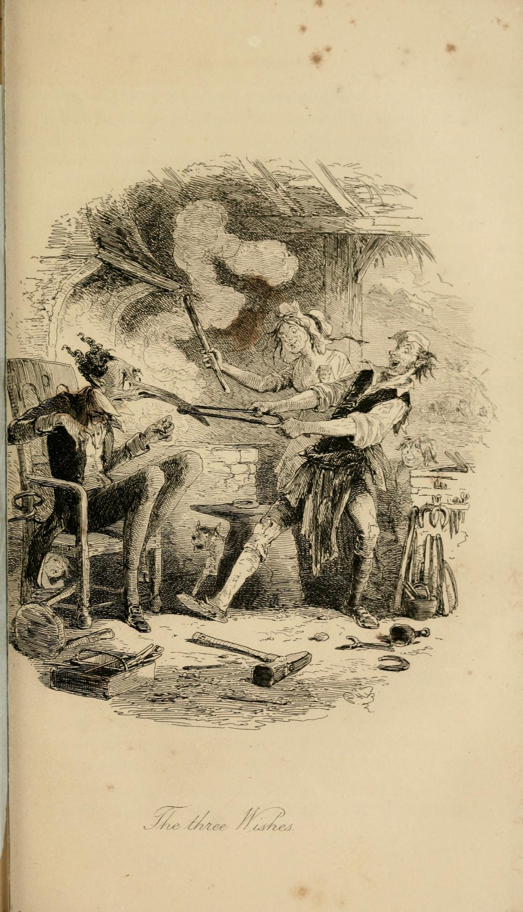

# Blacksmith and the Devil / Willy the Wisp

What is the origin of the *will o' the wisp*, that strange marshlight that can lead an unwary traveller to a sticky end, or perhaps even the land of fairy?

## The Tale in the Irish Tradition

One humorous explanation is given in the story of *Will O' the Wisp*, first collected into the published Irish tradition in *The Royal Hibernian Tales*, a chapbook published prior to 1825.

```{seealso}
*The Royal Hibernian Tales also includes the tale of `Hudden and Dudden and Donald O'Leary`, as describd in a separate storynote.*
```

The tale is also known as *Willy the Wisp*, or, variously, *The Blacksmith and the Devil*, *Billy Duffy and the Devil*, &c., and it tells of a blacksmith who makes a deal with the devil, who is granted three unusual wishes from a generous benefactor, and who then... well, let's find out:

```{admonition} *Will o' the Wisp*, The Royal Hibernian Tales
:class: dropdown

*In [The Royal Hibernian Tales: Being a Collection of the Most Entertaining Stories Now Extant](https://books.google.co.uk/books?id=FpiUmAEACAAJ&printsec=frontcover&source=gbs_ge_summary_r&cad=0#v=onepage&q&f=false), p20-27.*

WILL O' THE WISP.

In old times there was one Will Cooper, a blacksmith who lived in the parish of Loughile; he was a great lover of the bottle, and all that he could make by his trade went to that use, so that his family was often in a starving condition. One day as he was musing in his shop alone after a fit of drunkenness, there came to him a little old man almost naked, and trembling with cold. My good fellow, said he to Will, put on some coals and make a fire, that I may get m warmed. Will, pitying the poor creature did eo, and like- wise brought him something to eat, and told him, if he thought proper, he was welcome to stay all night. The old man thanked him kindly, and said he had farther to go: but says he, as you have been so kind to me, it is in my power to make you a recompence; make three wishes, sa he, for any thing you desire most, and let it what it will you shall obtain it immediately — Well, says Will, since that is the case, I wish that any person who takes my sledge into their hand, may never get free of it till I please to take it from them. Secondly, I have au armed chair, and I wish that any person sitting down on the same, may never have power to rise until I please to take them off it. I likewise wish for the last, says Will, that whatever money or gold I happen to put into my purse no person may have power to take it out again but myself.— Ah! unfortunate Will! cries the old man, why did not you wish for heaven? With that he went away from the shop, as Will thought, very pensive and melancholy, and never was heard of more. The old man's words opened Will's eyes, he saw it was in his power to do well, had he made a good use of the opportunity, and when he considered that the wishes were not of the least use to him, he became worse every day, both in soul and body, and in a short time he was reduced to great poverty and distress.

One idle day as he was walking along through the fields, he met the devil in the appearance of a gentleman, who told him if he would go along with him at the end of seven years, he should have any thing he desired during that time. Will inking that it was as bad with him as it could be, although he suspected it was the devil, for the love of rising in the world, made bargain to go with him at the end of the seven years, and requested that he would supply him with plenty of money for the present. Accordingly Will had his desire, and dreading to be observed by his neighbours to get rich on a sudden, he removed to a distance from where he was then living.— However, there was nobody in distress or in want  of money, but Will was ready to relieve, insomuch that in a short time he became noted, and went in that country by the name of Bill Money, in regard of the great sums he could always command; he then began to build houses and before the seven years were expired he had built a town, which in imitation of the name he then had, was called Ballymoney, and is to this day. However, ta disguise the business, end that nobody might suspect him having any dealings with Satan, he still did something now and then at his trade: the seven years being expired, he was making some article for a friend, when the devil came into the shop in his former appearance. Well, Will, he says, are you ready to go with me now? I am, says Will, if I had the job finished; take that sledge says he and give me a blow or two, for it is a friend what is to get it, and then I will go with you, I will go with you where you please. The devil took the sledge and they soon finished the job. Now, says Will, stay you here till I run to my friend with this, and I will not stay a minute— Will then went out and the devil stopped in the shop till it was near night, but there was no sign of Will coming near him, nor could he by any means get the sledge out of his hands; he thought if he was once in his old abode, perhaps there might be some of the smith trade in it, who would disengage him of the sledge, but all that Were in hell could not get it out of his hand, so he had to retain the shape he was then in, as long as the iron remained in his hand. The devil seeing he could get nobody to do anything for him went in search of Will once more, but some how or other he could not get near him for a month, at length he met him coming out of a tavern pretty drunk. Well, Will, says he, that, was a pretty trick you put on me: faith no, says Will, it was you that tricked me, for when I came back to the shop you were away, and stole my sledge with you, so that I could not get a job done ever since. Well, Will, says Satan, I could not help taking the sledge; for I cannot get it out of my hand; but if you take it from me, I will give you seven years more before I ask you with me. Will readily took the sledge, and the devil parted from him well pleased that he had got rid of it. Will having now seven years to play upon, roved about through the town of Ballymoney, drinking, and sporting, and sometimes doing a little at his trade to blindfold the people, yet there was many suspected he had dealings with Satan, or he could not do half of what he had done.

At length the seven years were expired, and the devil came for him and found him sitting at the fire smoking, in his own house, where he kept his wonderful chair. Come Will, says he, are you ready to go with me now? I am, says Will, if you sit down a little till I make my will and settle every thing among my family, and then I will go with you, wherever you please. So setting the arm chair to Satan, he sat down, and Will went into the chamber as if to settle his affairs; after a little he came up again and went aut, bidding the devil to come along for he had all things completed to his mind, and would ask to stay no longer. When Will went out, the devil made an attempt to rise, but in vain, he could not stir from the chair, nor even make the least motion one way or other, so that he was much confounded to think what was the matter, as when he was first cast into utter darkness. Will, knowing what would occur to Satan, stayed away a month, during which time he never became visible in the chair, to any of the family, nor do we hear that any one else ever observed nim at any time, but Will himself, However, at the month's end, Will returning, pretended to be very much surprised that the devil did net follow him, What, says Will, kept you here all this time? I believe you are making & fool of me; but if you do not come immediately, I will have the bargain broken, and never go with you again, I cannot help it, says Satan, for all I can do I cannot stir from my seat, but if you could liberate me, I will give you seven years more, before I call on you again. Well, says Will, I will do what I can; he then went to Satan and took him by the arm, and with the greatest ease lifted him out of the chair, and set him at liberty once more. No sooner was Satan gone, than Wi was ready for his old trade again: he sported and played, and drank of the best, his purse never failing, although he sunk all the property and income he had in and about Ballymoney, long before; but he did not care, for he knew he could have recourse to the purse that never would fail, as I told you before. However, an accident happened the same purse, that a penny would never stay in it afterwards, and Will became one of the poorest men to be found. This was at the end of the seven years of his last bargain: when Satan came in quest of him again, but was so fearful of a new trick put upon him by Will, that he durst not come near the house. At length he met him in the fields, and would not give him time to bid as much as farewell to his wife and children, he was so much afraid of being imposed upon. Will had at last to go, and travelling along the road he came to an inn, where many a good glass he had taken in his time. Here's a set of the best rogues, says Will, in Ireland, they cheated me many a time, and I will give all I possess, could I put a trick upon them; besides if we were to call, I know I could get the landlady to sin with me before I come out. Well, says Satan, I do not care if we stop. But, says Will, I have no money, and I cannot manage my scheme without it; but I will tell you what you can do, you can change yourself into a piece of gold, I will put you in my purse, and then you will see what a hand I wi make for you and me both, before we are at our journey's end. Satan ever willing to promote evil, consented to change himself into gold, and when he had done so, Will put the piece into his purse, and returned home. Satan understanding that Will did not as he pretended, strove to deliver himself from confinement, but by the power of the purse, he could never change himself from gold, as long as Will pleased to keep him in it, and no other person, as I have told you before, had power to take any thing out of it but himself. Will would go to drink from one alehouse to another, and would pretend to be drunk when he was not, where he would lay down his purse and bid the waiters take what they please for the reckoning, every person saw he money plenty, yet all they could do they could never get one penny out of the purse, and he could get so drunk when they would give it back to him, that he would not seem to understand any thing, and so would sneak away. In this manner he cheated both town and country round, until Satan weary of confinement, had recourse to a stratagem of his own, and changed himself from pieces of gold into a solid bar or ingot of the same metal, but could not get out of the purse.

This, however, put a great damp upon Will's trade, for when he had no coin to show, he could not get anything from any body, and how to behave he did not know; he took a notion that he would perhaps force him into coin again, and accordingly brought him to an iron forge, where he had the ingot battered for the length of an hour, at a fearful rate, but all they could do, they never changed it in the least, neither could they injure the purse, for the quality of it became miraculous, after his wish, and the people swore the devil was surely in the purse, for they never saw any thing like it. They were come at last to give over, and Will returned home, and went to bed, putting the purse under his head; his wife was asleep, and the devil kept such a hissing, puffing, and blowing under the bolster, that he soon awakened her, and she almost frightened out of her wits, awakened Will, telling him, that the devil was under his head. Well, if he be, says Will, I will take him to the forge, where I assure you he will get a sound battering. Oh no, says Satan, I would rather be in hell, than stay here confined in this manner, and if you let me go, I will never trouble you again. With all my heart, says Will, on that head you shall have your freedom, and opening the purse gave Satan his liberty.

Will was now free from all dread or fear of any thing, and cared not what he did. But I forgot to mention, that at the time that Will wished nobody might take any thing out of the purse, he wished he might never put hia hand in it himself but he would find money: but after Satan being in it he found it empty ever after. By this unlucky accident he that had seen so much of the world for such a length of time, was reduced to the most indigent state, and at length forced to beg his bread. In this miserable condition he spent many years until his glass was run, and he had to pay that debt to nature what all creatures have since the fall of Adam. However, his life was so ill-spent and his actions so bad, that it is recorded he could get no entrance to any place of good after his decease, so that he was destined to follow his own master. Coming to the gates of hell, he made a horrible noise to get in; then Satan bid the porter ask who it was that made such a din, and not to admit him till he would let him know: the porter did so, and he bade him tell his master that he was his old friend, Will Cooper, wanting to come to him once more. When Satan had heard who it was, he ordered the gates to be strongly guarded, for if that villain gets in, says he, we are all undone. Will pleaded the distress he was in, that he could not get backward nor forward with the darkness he was surrounded with; and having lost his guide, if Satan would not let him in, and being loth to listen to the - noise and confusion he was making at the gate sent one of his servants to conduct him back to again, and particularly not to quit him until he left him in Ireland. Now, says Satan to Will, when he was going away, you were a trusty servant to me a long time: now you are going to earth again, let me see you be busy, and gain all to me that you can; but remember how you served me when in the purse, and you shall never be out of darkness, yet I will give you a light in your hand, to allure and deceive the weary traveller, so that he may become a prey to us; so lighting a wisp he gave it to Will, and he was conducted to earth, where he wanders from that day to this under the title of Will o' the Wisp.

```

A much more elaborate version of the tale appears in William Carelton's _"Tales and sketches...of the Irish peasantry"_, 1845. This version starts of with the granting of the wishes, the blacksmith's repeated misuse of them, before he makes his deal with the devil.

The tale includes a couple of nice touches: the devil is too busy on Earth to go down to hell because the Whigs are in power, so there's obviously lots of sin to be collected on and uch time to be spent in Downing Street; having summoned the Devil, the blacksmith was keen for the Devil to open the bargaining "because he had often heard, that in that case, with proper care on his own part, he might defeat him in the long run"; and when the evil chastises the blacksmith for the way he treats his wife, she immediately turns on the Devil, and "at every word she gave him a remembrance, hot and heavy."

````{admonition} The Three Wishes, 1845
:class: dropdown

*In [Tales and sketches, illustrating the character, usages, traditions, sports and pastimes of the Irish peasantry](https://archive.org/details/talessketchesill00carlrich/page/n359/mode/2up), William Carleton, 1845, pp.330-357.*


THE THREE WISHES.

AN IRISH LEGEND.

In ancient times there lived a man called Billy Duffy, and he was known to be a great rogue. They say he was descended from the family of the Duffys, which was the reason, I suppose, of his carrying their name upon him.

Billy, in his youthful days, was the best hand at doing nothing in all Europe ; devil a mortal could come next or near him at idleness; and, in consequence of his great practice that way, you may be sure that if any man could make a fortune by it he would have done it.

Billy was the only son of his father, barring two daughters ; but they have nothing to do with the story I'm telling you. Indeed it was kind father and grandfather for Billy to be handy at the knavery as well as at the idleness ; for it was well known that not one of their blood ever did an honest act, except with a roguish intention. In short, they were altogether a dacent connexion, and a credit to the name. As for Billy, all the villany of the family, both plain and ornamental, came down to him by way of legacy ; for it so happened that the father, in spite of all his cleverness, had nothing but his roguery to lave him.

Billy, to do him justice, improved the fortune he got : every day advanced him farther into dishonesty and poverty, until, at the long run, he was acknowledged on all hands to be the complatest swindler and the poorest vagabond in the whole parish.

Billy's father, in his young days, had often been forced to acknowledge the inconvenience of not having a trade, in consequence of some nice point in law, called the " Vagrant Act," that sometimes troubled him. On this account he made up bis mind to give Bill an occupation, and he accordingly bound him to a blacksmith ; but whether Bill was to live or die by forgery was a puzzle to his father, — though the neighbours said that both was most likely. At all events, he was put apprentice to a smith for seven years, and a hard card his master had to play in managing him. He took the proper method, however ; for Bill was so lazy and roguish that it would vex a saint to keep him in order.

" Bill," says his master to him one day that he had been sunning himself about the ditches, instead of minding his business, " Bill, my boy, I'm vexed to the heart to see you in such a bad state of health. You're very ill with that complaint called an All-overness ; however," says he, " I think I can cure you. Nothing will bring you about but three or four sound doses, every day, of a medicine called 'the oil o' the hazel.' Take the first dose now" says he ; and he immediately banged him with a hazel cudgel until Bill's bones ached for a week afterwards.

" If you were my son," said his master, " I tell you, that, as long as I could get a piece of advice growing convenient in the hedges, I'd have you a different youth from what you are. If working was a sin, Bill, devil an innocenter boy ever broke bread than you would be. Good people's scarce you think ; but however that may be, I throw it out as a hint, that you must take your medicine till you're cured, whenever you happen to get unwell in the same way."

From this out he kept Bill's nose to the grinding-stone, and whenever his complaint returned, he never failed to give him a hearty dose for his improvement.

In the course of time, however, Bill was his own man and his own master ; but it would puzzle a saint to know whether the master or the man was the more precious youth in the eyes of the world.

He immediately married a wife, and devil a doubt of it, but if he kept her in whiskey and sugar, she kept him in hot water. Bill drank and she drank ; Bill fought and she fought; Bill was idle and she was idle ; Bill whacked her and she whacked Bill. If Bill gave her one black eye, she gave him another ; just to keep herself in countenance. Never was there a blessed pair so well met ; and a beautiful sight it was to see them both at breakfast-time blinking at each other across the potato-basket, Bill with his right eye black, and she with her left.

In short, they were the talk of the whole town : and to see Bill of a morning staggering home drunk, his shirt-sleeves rolled up on his smutted arms, his breast open, and an old tattered leather apron, with one corner tucked up under his belt, singing one minute, and fighting with his wife the next ; — she, reeling beside him, with a discoloured eye, as aforesaid, a dirty ragged cap on one side of her head, a pair of Bill's old slippers on her feet, a squalling brat on her arm, — now cuffing and dragging Bill, and again kissing and hugging him ! yes, it was a pleasant picture to see this loving pair in such a state !

This might do for a while, but it could not last. They were idle, drunken, and ill-conducted ; and it was not to be supposed that they would get a farthing candle on their words. They were of course *dhruv* to great straits ; and faith, they soon found that their fighting, and drinking, and idleness made them the laughing-sport of the neighbours ; but neither brought food to their *childhre*, put a coat upon their backs, nor satisfied their landlord when he came to look for his own. Still the never a one of Bill but was a funny fellow with strangers, though, as we said, the greatest rogue unhanged.

One day he was standing against his own anvil, completely in a brown study, — being brought to his wit's end how to make out a breakfast for the family. The wife was scolding and cursing in the house, and the naked creatures of childhre squalling about her knees for food. Bill was fairly at an amplush, and knew not where or how to turn himself, when a poor withered old beggar came into the forge, tottering on his staff. A long white beard fell from his chin, and he looked so thin and hungry that you might blow him, one would think, over the house. Bill at this moment had been brought to his senses by distress, and his heart had a touch of pity towards the old man ; for, on looking at him a second time, he clearly saw starvation and sorrow in his face.

" God save you, honest man !" said Bill.

The old man gave a sigh, and raising himself, with great pain, on his staff, he looked at Bill in a very beseeching way.

" Musha, God save you kindly!" says he; "maybe you could give a poor, hungry, helpless ould man a mouthful of something to ait ? You see yourself I'm not able to work ; if I was, I'd scorn to be behoulding to any one."

"Faith, honest man," said Bill, "if you knew who you're speaking to, you'd as soon ask a monkey for a churn-staff as me for either mate or money. There's not a blackguard in the three kingdoms so fairly on the *shaughran* as I am for both the one and the other. The wife within is sending the curses thick and heavy on me, and the children's playing the cat's melody to keep her in comfort. Take my word for it, poor man, if I had either mate or money I'd help you, for I know particularly well what it is to want them at the present spaking ; an empty sack won't stand, neighbour."

So far Bill told him truth. The good thought was in his heart, because he found himself on a footing with the beggar ; and nothing brings down pride, or softens the heart, like feeling what it is to want.

" Why you are in a worse state than I am," said the old man ; " you have a family to provide for, and I have only myself to support."

" You may kiss the book on that, my old worthy," replied Bill ; " but come, what I can do for you I will ; plant yourself up here beside the fire, and I'll give it a blast or two of my bellows that will warm the old blood in your body. It's a cold, miserable, snowy day, and a good heat will be of service."

" Thank you kindly," said the old man ; I am cold, and a warming at your fire will do me good, sure enough. Oh, it is a bitter, bitter day, God bless it I"

He then sat down, and Bill blew a rousing blast that soon made the stranger edge back from the heat. In a short time he felt quite comfortable, and when the numbness was taken out of his joints, he buttoned himself up and prepared to depart.

" Now," says he to Bill, " you hadn't the food to give me, but *what you could you did*. Ask any three wishes you choose, and be they what they may, take my word for it, they shall be granted."

Now, the truth is, that Bill, though he believed himself a great man in point of 'cuteness, wanted, after all, a full quarter of being square ; for there is always a great difference between a wise man and a knave. Bill was so much of a rogue that he could not, for the blood of him, ask an honest wish, but stood scratching his head in a puzzle.

" Three wishes !" said he. " Why, let me see — did you say *three* ?"

" Ay," replied the stranger, " three wishes — that was what I said."

"Well," said Bill, "here goes, — aha! — let me alone, my old worthy ! — faith I'll over-reach the parish, if what you say is true. I'll cheat them in dozens, rich and poor, old and young; let me alone, man, — I have it here;" and he tapped his forehead with great glee. " Faith, you're the sort to meet of a frosty morning, when a man wants his breakfast ; and I'm sorry that I have neither money nor credit to get a bottle of whiskey, that we might take our *morning* together."

" Well, but let us hear the wishes," said the old man ; " my time is short, and I cannot stay much longer."

" Do you see this sledge hammer ?" said Bill ; " I wish, in the first place, that whoever takes it up in their hands may never be able to lay it down till I give them lave ; and that whoever begins to sledge with it may never stop sledging till it's my pleasure to release him."

" Secondly — I have an arm-chair, and I wish that whoever sits down in it may never rise out of it till they have my consent."

" And thirdly — that whatever money I put into my purse nobody may have power to take it out of it but myself!"

" You devil's rip !" says the old man in a passion, shaking his staff across Bill's nose, " why did you not ask something that would sarve you both here and hereafter ? Sure it's as common as the market-cross, that there's not a vagabone in his Majesty's dominions stands more in need of both."

" Oh ! by the elevens," said Bill, " I forgot that altogether ! Maybe you'd be civil enough to let me change one of them ? The sorra a purtier wish ever was made than I'll make, if you'll give me another chance.

" Get out, you reprobate," said the old fellow, still in a passion. " Your day of grace is past. Little you knew who was speaking to you all this time. I'm St. Moroky, you blackguard, and I gave you an opportunity of doing something for yourself and your family ; but you neglected it, and now your fate is cast, you dirty, bog-trotting profligate. Sure it's well known what you are ! Aren't you a byword in every body's mouth, you and your scold of a wife ? By this and by that, if ever you happen to come across me again, I'll send you to where you won't freeze, you villain !"

He then gave Bill a rap of his cudgel over the head, and laid him at his length beside the bellows, kicked a broken coal-scuttle out of his way, and left the forge in a fury.

When Billy recovered himself from the effects of the blow, and began to think on what had happened, he could have quartered himself with vexation for not asking great wealth as one of the wishes at least ; but now the die was cast on him, and he could only make the most of the three he pitched upon.

He now bethought him how he might turn them to the best account, and here his cunning came to his aid. He began by sending for his wealthiest neighbours on pretence of business ; and when he got them under his roof, he offered them the armchair to sit down in. He now had them safe, nor could all the art of man relieve them except worthy Bill was willing. Bill's plan was to make the best bargain he could before he released his prisoners ; and let him alone for knowing how to make their purses bleed. There wasn't a wealthy man in the country he did not fleece. The parson of the parish bled heavily ; so did the lawyer ; and a rich attorney, who had retired from practice, swore that the court of Chancery itself was paradise compared to Bill's chair.

This was all very good for a time. The fame of his chair, however, soon spread ; so did that of his sledge. In a short time neither man, woman, nor child, would darken his door ; all avoided him and his fixtures as they would a spring-gun or man-trap. Bill, so long as he fleeced his neighbours, never wrought a hand's turn ; so that when his money was out, he found himself as badly off as ever. In addition to all this, his character was fifty times worse than before ; for it was the general belief that he had dealings with the devil. Nothing now could exceed his misery, distress, and ill temper. The wife and he and their children all fought among one another like devils ; every body hated them, cursed them, and avoided them. The people thought they were acquainted with more than Christian people ought to know; for the family, they said, was very like one that the devil drove. All this, of course, came to Bill's ears, and it vexed him very much.

One day he was walking about the fields, thinking of how he could raise the wind once more ; the day was dark, and he found himself, before he stopped, in the bottom of a lonely glen covered by great bushes that grew on each side. " Well," thought he, when every other means of raising money failed him, " it's reported that I'm in league with the devil, and as it's a folly to have the name of the connexion without the profit, I'm ready to make a bargain with him any day ; — so," said he, raising his voice, " Nick, you sinner, if you be conv*a*nient and willing, why stand out here; show your best leg, — here's your man."

The words were hardly out of his mouth, when a dark sober-looking old gentleman, not unlike a lawyer, walked up to him. Bill looked at the foot and saw the hoof.

" Morrow, Nick," says Bill,

" Morrow, Bill," says Nick. " Well, Bill, what's the news ?"

" Devil a much myself hears of late," says Bill, " is there anything *fresh* below ?"

" I can't exactly say. Bill ; I spend little of my time down now ; the Whigs are in office, and my hands are consequently too full of business here to pay much attention to any thing else."

" A fine place this, sir," says Bill, " to take a constitutional walk in ; when I want an appetite I often come this way myself, — hem ! High feeding is very bad without exercise."

" High feeding ! Come, come. Bill, you know you didn't taste a morsel these four-and-twenty hours."

" You know that's a bounce, Nick. I eat a breakfast this morning that would put a stone of flesh on you, if you only smelt at it."

" No matter ; this is not to the purpose. What's that you were muttering to yourself awhile ago ? If you want to come to the brunt, here I'm for you."

" Nick," said Bill, " you're complate ; you want nothing barring a pair of Brian O'Lynn's breeches."

Bill, in fact, was bent on making his companion open the bargain, because he had often heard, that in that case, with proper care on his own part, he might defeat him in the long run. The other, however, was his match.

" What was the nature of Brian's garment," inquired Nick.

" Why, you know the song," said Bill —

> " Brian O'Lynn had no breeches to wear,  
> So he got a sheep's skin for to make him a pair ;  
> With the flesliy side out, and the woolly side in,  
> They'll be pleasant and *cool*, says Brian O'Lynn.

A cool pare would sarve you, Nick."

" You're mighty waggish to-day, misther Duffy." " And good right I have," said Bill ; " I'm a man snug and well to do in the world ; have lots of money, plenty of good eating and drinking, and what more need a man wish for ?"

" True," said the other ; " in the meantime it's rather odd that so respectable a man should not have six inches of unbroken cloth in his apparel. You are as naked a tatter-demallion as I ever laid my eyes on ; in full dress for a party of scare-crows, William."

" That's my own fancy, Nick ; I don't work at my trade like a gentleman. This is my forge dress, you know."

" Well, but what did you summon me here for ?" said the other ; "you may as well speak out I tell you ; for, my good friend, unless *you* do *I* shan't. Smell that."

" I smell more than that," said Bill ; " and by the way, I'll thank you to give me the windy side of you — curse all sulphur I say. There, that's what I call an improvement in my condition. But as you *are* so stiff," says Bill, " why, the short and the long of it is — that — hem — you see I'm — tut — sure you know I have a thriving trade of my own, and that if I like I needn't be at a loss ; but in the manetime I'm rather in a kind of a so — so — don't you *take* ?"

And Bill winked knowingly, hoping to trick him into the first proposal.

" You must speak above-board, my friend," says the other ; " I'm a man of few words, blunt and honest. If you have any thing to say, be plain. Don't think I can be losing my time with such a pitiful rascal as you are."

" Well," says Bill, " I want money, then, and am ready to come into terms. What have you to say to that, Nick ?"

" Let me see — let me look at you," says his companion, turning him about. " Now, Bill, in the first place, are you not as finished a scare-crow as ever stood upon two legs ?"

" I play second fiddle to you there again," says Bill.

" There you stand with the blackguard's coat of arms quartered under your eye, and — "

"Don't make little of *blackguards*," said Bill," nor spake disparagingly of *your own* crest."

" Why, what would you bring, you brazen rascal, if you were fau'ly put up at auction '?"

" Faith, I'd bring more bidders that you would," said Bill, " if you were to go off at auction to-morrow. I tell you they should bid *downwards* to come to your value, Nicholas. We have no coin *small* enough to purchase you."

" Well, no matter," said Nick, " if you are willing to be mine at the expiration of seven years, I will give you more money than ever the rascally breed of you was worth."

"Done!" said Bill; "but no disparagement to my family, in the meantime ; so down with the hard cash, and don't be a *nager*."

The money was accordingly paid down ; but as nobody was present, except the giver and receiver, the amount of what Bill got was never known.

" Won't you give me a luck-penny ?" said the old gentleman.

"Tut," said Billy, "so prosperous an old fellow as you cannot want it ; however the devil's luck to you, with all my heart ! and it's rubbing grease to a fat pig to say so. Be off now, or I'll commit suicide on you. Your absence is a cordial to most people, you infernal old profligate. You have injured my morals even for the short time you have been with me ; for I don't find myself so virtuous as I was."

" Is that your gratitude, Billy ?"

" Is it gratitude *you* speak of, man ? I wonder you don't blush when you name it. However, when you come again, if you bring a third eye in your head, you will see what I mane, Nicholas, ahagur."

The old gentleman, as Bill spoke, hopped across the ditch, on his way to *Downing*-street, where of late 'tis thought he possesses much influence.

Bill now began by degrees to show off ; but still wrought a little at his trade to blindfold the neighbours. In a very short time, however, he became a great man. So long indeed as he was a *poor* rascal, no decent person would speak to him ; even the proud serving-men at the " Big House" would turn up their noses at him. And he well deserved to be made little of by others, because he was mean enough to make little of himself. But when it was seen and known that he had oceans of money, it was wonderful to think, although he was *now* a greater blackguard than ever, how those who despised him before, began to come round him and court his company. Bill, however, had neither sense nor spirit to make those sunshiny friends know their distance ; not he — instead of that he was proud to be seen in decent company, and so long as the money lasted, it was, "hail fellow well met," between himself and every fair-faced *spunger* who had a horse under him, a decent coat to his back, and a good appetite to eat his dinners. With riches and all. Bill was the same man still ; but, somehow or other, there is a great difference between a rich profligate and a poor one, and Bill found it so to his cost in *both* cases.

Before half the seven years was passed. Bill had his carriage, and his equipages ; was hand and glove with my Lord This, and my Lord That ; kept hounds and hunters ; was the first sportsman at the Curragh ; patronized every boxing ruffian he could pick up ; and betted night and day on cards, dice, and horses. Bill, in short, *should* be a blood, and except he did all this, he could not presume to mingle with the fashionable bloods of his time.

It's an old proverb, however, that " what is got over the devil's back is sure to go off under it ;" and in Bill's case this proved true. In short, the devil himself could not supply him with money so fast as he made it fly ; it was " come easy, go easy," with Bill, and so sign was on it, before he came within two years of his time he found his purse empty.

And now came the value of his summer friends to be known. When it was discovered that the cash was no longer flush with him — that stud, and carriage, and hounds were going to the hammer — whish ! off they went, friends, relations, pot-companions, dinner-eaters, black-legs and all, like a flock of crows that had smelt gunpowder. Down Bill soon went, week after week, and day after day, until at last, he was obliged to put on the leather apron, and take to the hammer again ; and not only that, for as no experience could make him wise, he once more began his tap-room brawls, his quarrels with Judy, and took to his "high feeding" at the dry potatoes and salt. Now, too, came the cutting tongues of all who knew him, like razors upon him. Those that he scorned because they were poor and himself rich, now paid him back his own with interest ; and those that he measured himself with, because they were rich, and who only countenanced him in consequence of his wealth, gave him the hardest word in their cheeks. The devil mend him ! He deserved it all, and more if he had got it.

Bill, however, who was a hardened sinner, never fretted himself down an ounce of flesh by what was said to him, or of him. Not he ; he cursed, and fought, and swore, and schemed away as usual, taking in every one he could ; and surely none could match him at villany of all sorts and sizes.

At last the seven years became expired, and Bill was one morning sitting in his forge, sober and hungry, the wife cursing him, and the childhre squalling, as before ; he was thinking how he might defraud some honest neighbour out of a breakfast to stop their mouths and his own too, when who walks in to him but old Nick, to demand his bargain.

" Morrow, Bill ! " says he with a sneer.

"The devil welcome you!" says Bill; "but you have a fresh memory."

" A bargain's a bargain between two *honest* men, any day," says Satan ; " when I speak of *honest* men, I mean *yourself* and *me*, Bill ; " and he put his tongue in his cheek to make game of the unfortunate rogue he had come for.

" Nick, my worthy fellow," said Bill, " have bowels ; you wouldn't do a shabby thing ; you wouldn't disgrace your own character by putting more weight upon a falling man. You know what it is to get a *come down* yourself, my worthy ; so just keep your toe in your pump, and walk off with yourself somewhere else. A *cool* walk will sarve you better than my company, Nicholas."

" Bill, it's no use in shirking ; " said his friend, " your swindling tricks may enable you to cheat others, but you won't cheat *me*, I guess. You want nothing to make you perfect in your way but to travel ; and travel you shall under my guidance, Billy. No, no — *I'm* not to be swindled, my good felloAV. I have rather a — a — better opinion of myself, Mr. D. than to think that you could outwit one Nicholas Clutie, Esq. — ehem!"

" You may sneer, you sinner," replied Bill ; " but I tell you for your comfort, that I have outwitted men who could buy and sell you to your face. Despair, you villain, when I tell you that *no attorney* could stand before me."

Satan's countenance got blank when he heard this ; he wriggled and fidgetted about, and appeared to be not quite comfortable.

" In that case, then," says he, "the sooner I deceive you the better ; so turn out for the *Low Countries*."

" Is it come to that in earnest ?" said Bill, " and are you going to act the rascal at the long run ?"

" 'Pon honour, Bill."

" Have patience, then, you sinner, till I finish this horse-shoe — it's the last of a set I'm finishing for one of your friend the attorney's horses. And here, Nick, I hate idleness, you know it's the mother of mischief, take this sledge-hammer, and give a dozen strokes or so, till I get it out of hands, and then here's with you, since it must be so."

He then gave the bellows a puff that blew half a peck of dust in Club-foot's face, whipped out the red-hot iron, and set Satan sledging away for the bare life.

" Faith," says Bill to him, when the shoe was finished, " it's a thousand pities ever the sledge should be out of your hand ; the great *Parra Gow* was a child to you at sledging, you're such an able tyke. Now just exercise yourself till I bid the wife and childhre good-bye, and then I'm off."

Out went Bill, of course without the shghtest notion of coming back ; no more than Nick had that he could not give up the sledging, and indeed neither could he, but was forced to work away as if he was sledging for a wager. This was just what Bill wanted. He was now compelled to sledge on until it was Bill's pleasure to release him ; and so we leave him very industriously employed, while we look after the worthy who outwitted him.

In the meantime. Bill broke cover, and took to the country at large ; wrought a little journey-work wherever he could get it, and in this way went from one place to another, till in the course of a month, he walked back very coolly into his own forge, to see how things went on in his absence. There he found Satan in a rage, the perspiration pouring from him in torrents, hammering with might and main upon the naked anvil. Bill calmly leaned his back against the wall, placed his hat upon the side of his head, put his hands into his breeches pockets, and began to whistle *Shaun Gow's* hornpipe. At length he says in a very quiet and good-humoured way —

"Morrow, Nick!"

"Oh!" says Nick, still hammering away — "Oh! you double-distilled villain (hech ! ), may the most refined, ornamental (hech ! ), double-rectified, super-extra, and original (hech ! ) collection of curses that ever was gathered (hech ! ) into a single nosegay of ill fortune (hech ! ), shine in the button-hole of your conscience (hech ! ) while your name is Bill Duffy ! I denounce you (hech ! ) as a double-milled villain, a finished, hot-pressed knave (hech ! ), in comparison of whom all the other knaves I ever knew (hech !), attorneys included, are honest men. I brand you (hech ! ) as the pearl of cheats, a tip-top take-in (hech ! ) I denounce you, I say again, for the villanous treatment (hech ! ) I have received at your hands in this most untoward [(hech ! ) and unfortunate transaction between us ; for (hech ! ) unfortunate, in every sense, is he that has any thing to do with (hech ! ) such a prime and finished impostor."

" You're very warm, Nicky," says Bill ; " what puts you into a passion, you old sinner ? Sure if it's your own will and pleasure to take exercise at my anvil, I'm not to be abused for it. Upon my credit, Nicky, you ought to blush for using such blackguard language, so unbecoming your grave character. You cannot say that it was I set you a hammering at the empty anvil, you profligate. However, as you are so industrious, I simply say it would be a thousand pities to take you from it. Nick, I love industry in my heart, and I always encourage it; so, work away; it's not often you spend your time so creditably. I'm afraid if you weren't at that you'd be worse employed."

" Bill, have bowels," said the operative ;  " you wouldn't go to lay more weight on a falling man, you know ; you wouldn't disgrace your character by such a piece of iniquity as keeping an inoffensive gentleman, advanced in years, at such an unbecoming and rascally job as this. Generosity's your top virtue, Bill ; not but that you have many other excellent ones, as well as that, among which, as you say yourself, I reckon industry ; but still it is in generosity you *shine*. Come, Bill, honour bright, and release me."

" Name the terms, you profligate."

" You're above terms, William ; a generous fellow like you never thinks of terms."

"Goodbye, old gentleman!" said Bill, very coolly; "I'll drop in to see you once a month."

"No, no. Bill, you infern — a — a — you excellent, worthy, dehghtful fellow, not so fast ; not so fast. Come, name your terms, you sland — my dear Bill, name your terms."

" Seven years more."

" I agree ; but "

" And the same supply of cash as before, down on the nail here."

" Very good ; very good. You're rather simple, Bill ; rather soft, I must confess. Well, no matter. I shall yet turn the tab — a — hem? You are an exceedingly simple fellow, Bill; still there will come a day, my *dear* Bill — there will come "

" Do you grumble, you vagrant ? Another word, and I double the terms."

"Mum, William — mum; *tace* is Latin for a candle."

" Seven years more of grace, and the same measure of the needful that I got before. Ay or no ?"

" Of grace, Bill ! Ay ! ay ! ay ! There's the cash. I accept the terms. Oh blood ! the rascal — of grace ! ! Bill !"

" Well, now drop the hammer, and vanish," says Billy ; "but what would you think to take this sledge, while you stay, and give me a —— eh ! why in such a hurry ?" he added, seeing that Satan withdrew in double quick time.

" Hollo ! Nicholas !" he shouted, " come back ; you forgot something !" and when the old gentleman looked behind him, Billy shook the hammer at him, on which he vanished altogether.

Billy now got into his old courses ; and what shows the kind of people the world is made of, he also took up with his old company. When they saw that he had the money once more, and was sowing it about him in all directions, they immediately began to find excuses for his former extravagance.

" Say what you will," said one, " Bill Duffy's a spirited fellow, and bleeds like a prince."

" He's as hospitable a man in his own house, or out of it, as ever lived," said another.

" His only fault is," observed a third, " that he is, if any thing, too generous, and doesn't know the value of money ; his fault's on the right side, however."

" He has the spunk in him," said a fourth ; " keeps a capital table, prime wines, and a standing welcome for his friends."

" Why," said a fifth, " if he doesn't enjoy his money while he lives, he won't when he's dead; so more power to him, and a wider throat to his purse."

Indeed, the very persons who were cramming themselves at his expense despised him at heart. They knew very well, however, how to take him on the weak side. Praise his generosity, and he would do any thing ; call him a man of spirit, and you might fleece him to his face. Sometimes he would toss a purse of guineas to this knave, another to that flatterer, a third to a bully, and a fourth to some broken down rake — and all to convince them that *he* was a sterling friend — a man of mettle and liberality. But never was he known to help a virtuous and struggling family — to assist the widow or the fatherless, or to do any other act that was *truly* useful. It is to be supposed the reason of this was, that as he spent it, as most of the world do, in the service of the devil, by whose aid he got it, he was prevented from turning it to a good account. Between you and me, dear reader, there are more persons acting after Bill's fashion in the same world than you dream about.

When his money was out again, his friends played him the same rascally game once more, no sooner did his poverty become plain, than the knaves began to be troubled with small fits of modesty, such as an unwillingness to come to his place when there was no longer any thing to be got there. A kind of virgin bashfulness prevented them from speaking to him when they saw him getting out on the wrong side of his clothes. Many of them would turn away from him in the prettiest and most delicate manner when they thought he wanted to borrow money from them — all for fear of putting him to the blush by asking it. Others again, when they saw him coming towards their houses about dinner hour, would become so confused, from mere gratitude, as to think themselves in another place ; and their servants, seized as it were, with the same feeling, would tell Bill that their masters were " not at home."

At length, after travelling the same villanous round as before, Bill was compelled to betake himself, as the last remedy, to the forge ; in other words, he found that there is, after all, nothing in this world that a man can rely on so firmly and surely as his own industry. Bill, however, wanted the organ of common sense ; for his experience — and it was sharp enough to leave an impression — run off him like water off a duck.

He took to his employment sorely against his grain ; but he had now no choice. He must either work or starve, and starvation is like a great doctor, nobody tries it till every other remedy fails them. Bill had been twice rich ; twice a gentleman among blackguards, but always a blackguard among gentlemen ; `[It is almost unnecessary for us to acknowledge the little theft manifest in the above travestic.]` for no wealth or acquaintance with decent society could rub the rust of his native vulgarity off him. He was now a common blinking sot in his forge ; a drunken bully in the tap-room, cursing and brow-beating every one as well as his wife ; boasting of how much money he had spent in his day ; swaggering about the high doings he carried on; telling stories about himself and Lord This at the Curragh ; the dinners he gave — how much they cost him, and attempting to extort credit upon the strength of his former wealth. He was too ignorant, however, to know that he was publishing his own disgrace, and that it was a mean-spirited thing to be proud of what ought to make him blush through a deal board nine inches thick.

He was one morning industriously engaged in a quarrel with his wife, who, with a three-legged stool in her hand, appeared to mistake his head for his own anvil ; he, in the meantime, paid his addresses to her with his leather apron, when who steps in to jog his memory about the little agreement that was between them, but old Nick. The wife, it seems, in spite of all her exertions to the contrary, was getting the worst of it ; and Sir Nicholas, willing to appear a gentleman of great gallantry, thought he could not do less than take up the lady's quarrel, particularly as Bill had laid her in a sleeping posture. Now Satan thought this too bad ; and as he felt himself under many obligations to the sex, he determined to defend one of them on the present occasion ; so as Judy rose, he turned upon the husband, and floored him by a clever facer.

" You unmanly villain," said he, " is this the way you treat you wife ? 'Pon honour, Bill, I'll chastise you on the spot. I could not stand by a spectator of such ungentlemanly conduct without giving up all claim to gallant—— "

Whack ! the word was divided in his mouth by the blow of a churn-staff from Judy, who no sooner saw Bill struck, than she nailed Satan, who "fell" once more.

"What, you villain! that's for striking my husband hke a murderer behind his back," said Judy, and she suited the action to the word, " that's for interfering between man and wife. Would you murder the poor man before my face ? eh ? If *he* bates me, you shabby dog you, who has a better right ? I'm sure its nothing out of your pocket. Must you have your finger in every pie ?"

This was any thing but *idle* talk ; for at every word she gave him a remembrance, hot and heavy. Nicholas backed, danced, and hopped ; she advanced, still drubbing him with great perseverance, till at length he fell into the redoubtable arm chair, which stood exactly behind him. Bill, who had been putting in two blows for Judy's one, seeing that his enemy was safe, now got between the devil and his wife, *a situation that few will he disposed to envy him*.

" Tenderness, Judy," said the husband, '' I hate cruelty. Go put the tongs in the fire, and make them red hot. Nicholas, you have a nose," said he.

Satan began to rise, but was rather surprised to find that he could not budge.

" Nicholas," says Bill, " how is your pulse ? you don't look well ; that is to say, you look worse than usual."

The other attempted to rise, but found it a mistake.

" I'll thank you to come along," said Bill, " I have a fancy to travel under your guidance, and we'll take the *Low Countries* in our way, won't we ? Get to your legs, you sinner ; you know a bargain's a bargain between two *honest* men, Nicholas ; meaning *yourself* and *me*. Judy, are the tongs hot ?"

Satan's face was worth looking at, as he turned his eyes from the husband to the wife, and then fastened them on the tongs, now nearly at a furnace heat in the fire, conscious at the same time that he could not move out of the chair.

" Billy," said he, " you won't forget that I rewarded your generosity the last time I saw you, in the way of business."

" Faith, Nicholas, it fails me to remember any generosity I ever. showed you. Don't be womanish. I simply want to see what kind of stuff your nose is made of, and whether it will stretch like a rogue's conscience. If it does, we will flatter it up the *chimly* with the red hot tongs, and when this old hat is fixed on the top of it, let us alone for a weather-cock."

" Have a *fellow-feeling*, Mr. Duffy ; you know *we* ought not to dispute. Drop the matter, and I give you the next seven years."

" We know all that," says Billy opening the red hot tongs very coolly."

" Mr. Duffy," said Satan, " if you cannot remember my friendship to yourself, don't forget how often I stood your father's friend, your grandfather's friend, and the friend of all your relations up to the tenth generation. I intended, also, to stand by your children after you, so long as the name of Duffy, and a respectable one it is, might last."

" Don't be blushing, Nick," says Bill, " you are too modest ; that was ever your faihng ; hould up your head, there's money bid for you, I'll give you such a nose, my good friend, that you will have to keep an outrider before you, to carry the end of it on his shoulder."

"Mr. Duffy, I pledge my honour to raise your children in the world as high as they can go ; no matter whether they desire it or not."

" That's very kind of you," says the other, " and I'll do as much for your nose."


```{admonition} The Three Wishes, Illustration

*In [Tales and sketches, illustrating the character, usages, traditions, sports and pastimes of the Irish peasantry](https://archive.org/details/talessketchesill00carlrich/page/n360/mode/1up?q=wishes), William Carleton, 1845, pp.331.*



```

He gripped it as he spoke, and the old boy immediately sung out ; Bill pulled, and the nose went with him like a piece of warm wax. He then transferred the tongs to Judy, got a ladder, resumed the tongs, ascended the chimney, and tugged stoutly at the nose until he got it five feet above the roof. — He then fixed the hat upon the top of it, and came down.

" There's a weather-cock," said Billy ; " I defy Ireland to show such a beauty. Faith, Nick, it would make the purtiest steeple for a church, in all Europe, and the old hat fits it to a shaving."

In this state, with his nose twisted up the chimney, Satan sat for some time, experiencing the novelty of what might be termed a peculiar sensation. At last the worthy husband and wife began to relent :

" I think," said Bill, " that we have made the most of the nose, as well as the joke ; I believe, Judy, it's long enough."

" What is ?" says Judy.

" Why, the joke," said the husband.

" Faith, and I think so is the nose," said Judy.

" What do you say yourself, Satan ?" said Bill.

" Nothing at all, William," said the other ; " but that — ha ! ha! — it's a good joke — an excellent joke, and a goodly nose, too, as it *stands*. You were always a gentlemanly man, Bill, and did things with a grace ; still, if I might give an opinion on such a trifle — "

" It's no trifle at all," says Bill, " if you spake of the nose."

" Very well, it is not," says the other ; " still, I am decidedly of opinion, that if you could shorten both the joke and the nose without further violence, you would lay me under very heavy obligations, which I shall be ready to acknowledge and *repay* as I ought."

" Come," said Bill, " shell out once more, and be off for seven years. As much as you came down with the last time, and vanish."

The words were scarcely spoken, when the money was at his feet, and Satan invisible. Nothing could surpass the mirth of Bill and his wife, at the result of this adventure. They laughed till they fell down on the floor.

It is useless to go over the same ground again. Bill was still incorrigible. The money went as the devil's money always goes. Bill caroused and squandered, but could never turn a penny of it to a good purpose. In this way, year after year went, till the seventh was closed, and Bill's hour come. He was now, and had been for some time past, as miserable a knave as ever. Not a shilling had he, nor a shilling's worth, with the exception of his forge, his cabin, and a few articles of crazy furniture. In this state he was standing in his forge as before, straining his ingenuity how to make out a breakfast, when Satan came to look after him.

The old gentleman was sorely puzzled how to get at him. He kept skulking and sneaking about the forge for some time, till he saw that Bill hadn't a cross to bless himself with. He immediately changed himself into a guinea, and lay in an open place where he knew Bill would see him.

" If," said he, " I get once into his possession, I can manage him."

The honest smith took the bait, for it was well gilded, he clutched the guinea, put it into his purse, and closed it up.

" Ho ! ho ! " shouted the devil out of the purse, " you're caught. Bill ; I've secured you at last, you knave you. Why don't you despair, you villain, when you think of what's before you."

" Why you unlucky ould dog," said Bill, " is it there you are ? will you always drive your head into every loop-hole that's set for you ? Faith, Nick achora, I never had you bagged till now."

Satan then began to swell and tug and struggle with a view of getting out of the purse, but in vain. He found himself fast, and perceived that he was once more in Bill's power.

" Mr. Duffy," said he, " we understand each other. I'll give the seven years additional, and the cash on the nail."

" Be aisey, Nicholas. You know the weight of the hammer, that's enough. It's not a whipping with feathers you're going to get, anyhow. Just be aisey."

" Mr. Duffy, I grant I'm not your match. Release me, and I double the cash. I was merely trying your temper when I took the shape of a guinea."

" Faith and I'll try your's before you lave it, I've a notion."

He immediately commenced with the sledge, and Satan sang out with a considerable want of firmness.

" Am I heavy enough ?" said Bill.

" Lighter, lighter, William, if you love me. I haven't been well, latterly, Mr. Duffy — I have been delicate — my health, in short, is in a very precarious state, Mr. Duffy."

" I can believe *that*," said Bill, "and it will be more so before I have done with you. Am I doing it right ?"

" Beautifully, William ; but a little of the heaviest ; strike mee light. Bill, my head's tender. — Oh !"

" Heads or tails, my old boy," exclaimed the other ; " I don't care which ; it's all the same to me what side of you is up — but here goes to help the impression — hach !"

" Bill," said Nicholas, " is this gentlemanly treatment in your own respectable shop ? Do you think, if you dropped into my little place, that I'd act this rascally part towards you? Have you no compunction ?"

"I know," replied Bill, sledging away with vehemence, "that you're notorious for giving your friends a *warm* welcome. Divil an ould youth more so ; but you must be daling in bad coin, must you ? However, good or bad, you're in for a sweat now, you sinner. Am I doin' it purty ?"

" Lovely, William — but, if possible, a little more delicate."

" Oh, how delicate you are ! Maybe a cup o' tay would sarve you, or a little small gruel to compose your stomach."

" Mr. Duffy," said the gentleman in the purse, " hold your hand, and let us understand one another. I have a proposal to make."

" Hear the sinner, anyhow," said the wife.

" Name your own sum," said Satan, " only set me free."

" No, the sorra may take the toe you'll budge till you let Bill off," said the wife ; " hould him hard, Bill, barrin' he sets you clear of your engagement."

" There it is, my posey," said Bill ; " that's the condition. If you don't give me up, here's at you once more — and you must double the cash you gave the last time, too. So, if you're of that opinion, say *ay* — leave the cash, and be off."

" Oh, murder ;" groaned the old one, " am I to be done by an Irish spalpeen ! I who was never done before."

" Keep a mannerly tongue in your head, Nick," said Bill ; " if you're not *done* by this time you must be the divil's *tough* morsel, for I'm sure you're long enough *at the fire*, you villain. Do you agree to the terms ?"

" Ay, ay," replied the other, " let me out — and I hope I have done with you."

The money again immediately appeared in a glittering heap before Bill, upon which he exclaimed —

" The *ay* has it, you dog. Take to your pumps now, and fair weather after you, you vagrant ; but Nicholas — Nick — here — here — "

The other looked back, and saw Bill, with a broad grin upon him, shaking the purse at him — " Nicholas, come back," said he, " I'm short a guinea."

The other shook his fist in return, and shouted out, looking over his shoulder as he spoke, but not stopping —

" Oh, you superlative villain, keep from me — I wish to have done with you — and all I hope is, that I'll never meet you either here or hereafter." So saying, he disappeared.

It would be useless to stop now, merely to inform our readers that Bill was beyond improvement. In short, he once more took to his old habits, and lived on exactly in the same manner as before. He had two sons — one as great a blackguard as himself, and who was also named after him ; the other was a well-conducted, virtuous young man, called James, who left his father, and having relied upon his own industry and honest perseverance in life, arrived afterwards to great wealth, and built the town called Bally James Duff, which is so called from its founder until this day.

Bill, at length, in spite of all his wealth, was obliged, as he himself said, " to travel," — in other words, he fell asleep one day, and forgot to awaken ; or, in still plainer terms, he died.

Now, it is usual, when a man dies, to close the history of his life and adventures at once ; but with our hero this cannot be the case. The moment Bill departed, he very naturally bent his steps towards the residence of St. Moroky, as being, in his opinion, likely to lead him towards the snuggest berth he could readily make out. On arriving he gave a very humble kind of a knock, and St. Moroky appeared.

" God save your Reverence !" said Bill, very submissively.

"Be off: there's no admittance here for so pure a youth as you are," said St. Moroky.

He was now so cold and fatigued that he cared little where he went, provided only, as he said himself, " he could rest his bones, and get an air of the fire." Accordingly, after arriving at a large black gate, he knocked, as before, and was told he would get instant admittance the moment he gave his name, in order that they might find out his berth from the registry, taking it for granted that he had been booked for them, as is usual in such cases.

" I think your master is acquainted with me," said Billy.

"If he were not, you'd not come here," said the porter; " there are no friendly visits made to us. What's your name?"

" Billy Duffy," he replied.

The porter and several of his companions gave a yell of terror, such as Bill had never heard before, and immediately every bolt was bolted, every chain drawn tight across the gate, and every available weight and bar placed against it, as if those who were inside dreaded a siege.

" Off, instantly," said the porter, " and let his Majesty know that the rascal he dreads so much is here at the gate."

In fact, such a racket and tumult were never heard as the very mention of Billy Duffy created among them.

" Oh," said Bill, with his eye to the bars of the gate, " I doubt I have got a bad name," and he shook his head like an innocent man who did not deserve it.

In the meantime, his old acquaintance came running towards the gate with such haste and consternation, that his tail was several times nearly tripping up his heels.

" Don't admit that rascal," he shouted ; " bar the gate — make every chain, and lock, and bolt, fast — I won't be safe — none of us will be safe — and I won't stay here, nor none of us need stay here, if he gets in — my bones are sore yet after him. No, no — begone you villain — you'll get no entrance here — I know you too well."

Bill could not help giving a broad, malicious grin at Satan, and, putting his nose through the bars, he exclaimed —

" Ha ! you ould dog, I have you afraid of me at last, have I?"

He had scarcely uttered the words, when his foe, who stood inside, instantly tweaked him by the nose, and Bill felt as if he had been gripped by the same red-hot tongs with which he himself had formerly tweaked the nose of Nicholas.

" Well," said he, " that's not the way *I* treated *you* once upon a time. Throth you're ondecent — but you know what it is to get tinker's reckoning — to be paid in advance— so I owe you nothing for *that*, Nicholas."

Bill then departed, but soon found that in consequence of the inflammable materials which strong drink had thrown into his nose, that organ immediately took fire, and, indeed, to tell the truth, kept burning night and day, winter and summer, without ever once going out, from that hour to this.

Such was the sad fate of Billy Duffy, who has been walking without stop or stay, from place to place ever since ; and in consequence of the flame on his nose, and his beard being tangled like a wisp of hay, he has been christened by the country folk Will-o'-the-Wisp, while, as it were, to show the mischief of his disposition, the circulating knave, knowing that he must seek the coldest bogs and quagmires in order to cool his nose, seizes upon that opportunity of misleading the unthinking and tipsy night travellers from their way, just that he may have the satisfaction of still taking in as many as possible.

````

```{admonition} Reprinted elsewhere...
:class: seealso

The same tale is also republished in W. B. Yeats' [*Fairy and folk tales of the Irish peasantry*](https://archive.org/details/fairyfolktalesof00yeat/page/234/mode/2up), 1890,
p235-259, although the blacksmith is given the name Billy *Dawson* rather than Billy *Duffy*.
```

## A Telling From the Welsh Tradition

There is also a telling collected from the Welsh tradition "whilst living in Anglesea during the winter 1891-2" by Peter Emerson, in *Welsh fairy-tales and other stories* of 1894.

According to Emerson, this particular tale was "[t]old me by the old man [an old seaman] who told me of the origin of the Welsh." He also has a further note: "Vague."

```{admonition} Billy Duffy and the Devil
:class: dropdown

*In [Welsh fairy-tales and other stories](https://archive.org/details/welshfairytaleso00emeriala/page/54/mode/2up), Peter Emerson, 1894, pp. 54-58.*

BILLY DUFFY AND THE DEVIL.

BILLY DUFFY was an Irishman, a blacksmith, and a drunkard. He had the Keltic aversion from steady work, and stuck to his forge only long enough to get money for drink ; when that was spent, he returned to work.

Billy was coming home one day after one of these drinking-bouts, soberer than usual, when he exclaimed to himself, for the thirst was upon him, " By God ! I would sell myself to the devil if I could get some more drink."

At that moment a tall gentleman in black stepped up to him, and said, " What did you say ?"

" I said I would sell myself to the devil if I could get a drink."

" Well, how much do you want for seven years, and the devil to get you then ?"

"Well, I can't tell exactly, when it comes to the push."

"Will £700 do you?"

"Yes ; I'd take £700."

" And the devil to get you then ?"

" Oh, yes ; I don't care about that."

When Billy got home he found the money in his smithy. He at once shut the smithy, and began squandering the money, keeping open house.

Amongst the people who flocked to get what they could out of Billy came an old hermit, who said, " I am very hungry, and nearly starved. Will you give me something to eat and drink ?"

" Oh, yes ; come in and get what you like."

The hermit disappeared, after eating and drinking, and did not reappear for several months, when he received the same kindly welcome, again disappearing. A few months afterwards he again appeared.

" Come in, come in !" said Billy.

After he had eaten and drunk his full, the hermit said to Billy : " Well, three times have you been good and kind to me. I'll give you three wishes, and whatever you wish will be sure to come true."

" I must have time to consider," said Billy.

"Oh, you shall have plenty of time to consider, and mind they are good wishes."

Next morning Billy told the hermit he was ready.

"Well, go on; be sure they're good wishes," said the hermit.

"Well, I've got a big sledge-hammer in the smithy, and I wish whoever gets hold of that hammer shall go on striking the anvil, and never break it, till I tell him to stop."

" Oh, that 's a bad wish, Billy."

" Oh, no ; you 'll see it 's good. Next thing I wish for is a purse so that no one can take out whatever I put into it."

" Oh, Billy, Billy ! that 's a bad wish. Be careful now about the third wish," said the hermit.

" Well, I have got an armchair upstairs, and I wish that whoever may sit in that armchair will never be able to get up till I let them."

" Well, well, indeed ; they are not very good wishes."

" Oh, yes ; I've got my senses about me. I think I'll make them good wishes, after all."

The seven years, all but three days, had passed, and Billy was back working at his forge, for all his money was gone, when the dark gentleman stepped in and said :

" Now, Billy, during these last three days you may have as much money as you like," and he disappeared.

On the last day of his seven years Billy was penniless, and he went to the taproom of his favourite inn, which was full.

"Well, boys," said Billy, "we must have some money to-night. I'll treat you, and give you a pound each," and rising, he placed his tumbler in the middle of the table, and wished for twenty pounds. No sooner had he wished than a ball of fire came through the ceiling, and the twenty sovereigns fell into the tumbler. Everyone was taken aback, and there was a noise as if a bomb had burst, and the fireball disappeared, and rolled down the garden path, the landlord following it. After this they each drank what they liked, and Billy gave them a sovereign apiece before he went home.

The next morning he was in his smithy making Billy Duffy and the Devil, a pair of horseshoes, when the devil came in and /said :

" Well, Billy, I'll want you this morning."

" Yes; all right. Take hold of this sledge-hammer, and give me a few hammers till I finish this job before I go."

So the devil seized the hammer and began striking the anvil, but he couldn't stop.

So Billy laughed, and locked him in, and was away three days. During this time the people collected round the smithy, and peeped through the cracks in the shutter, for they could hear the hammer going night and day.

At the end of three days Billy returned and opened the door, and the devil said, " Oh, Billy, you've played a fine trick to me ; let me go."

" What are you going to give me if I let you go ?"

" Seven years more, twice the money, and two days' grace for wishing for what you like."

The devil paid his money and disappeared, and Billy shut the smithy and took to gambling and drink- ing, so that at the end of seven years he was without a penny, and working again in his smithy.

On the last night of the seven years he went to his favourite public-house again, and wished for five pounds.

After he wished, a little man entered and spat the sovereigns into the tumbler, and they all drank all night.

Next morning Billy went back to his smithy. The devil, who had grown suspicious, turned himself into a sovereign and appeared on the floor. Billy seized the sovereign and clapped it into his purse. Then he took his purse and lay it upon the anvil, and began to beat it with his sledge-hammer, when the devil began to call out, " Spare my poor limbs, spare my poor limbs ! "

" How much now if I let you go ?" asked Billy. " Seven more years, three times the money, and one day in which to wish for what you like."

Billy took the sovereign out of his purse and threw it away, when he found his money in the smithy.

Billy carried on worse than ever; gambled and drank and raced, squandering it all before his seven years was gone. On the last day of his term he went to his favourite inn as usual and wished for a tumbler- full of sovereigns. A little man with a big head, a big nose, and big mouth, a little body, and little legs, with clubbed feet and a forked tail, brought them in and put them in the tumbler. The drunkards in the room got scared when they saw the little man, for he looked all glowing with fire as he danced on the table. When he finished, he said, " Billy, to-morrow morning our compact is up."

" I know it, old boy, I know it, old boy ! " said Billy. Then the devil ran out and disappeared, and the people began to question Billy :

"What is that? I think it is you, Mister Duffy, he is after."

" Oh, it is nothing at all," said Billy.

" I should think there was something," said the man.

" I am afraid my house will get a bad name," croaked the landlord.

" Not in the least ! You are only a coward," said Billy.

"But in the name of God, what is it all about?" asked an old man.

" Oh, you'll see by-and-bye," said Billy ; " it is nothing at all."

Next morning Billy went to his smithy, but the devil would not come near it.

So he went to his house, and began to quarrel with his wife, and whilst he was quarrelling the devil walked in and said :

"Well, Mr. Duffy, I am ready for you."

" Ah, yes ; just sit down and wait a minute or two. I have some papers I want to put to rights before I go."

So the devil sat down in the arm-chair, and Billy went to the smithy and heated a pair of tongs red-hot, and coming back, he got the devil by the nose, and pulled it out as though it had been soft iron. And the devil began yelling, but he could not move, and Billy kept drawing the nose out till it was long enough to reach over the window, when he put an old bell- topper on the end of it. And the devil yelled, and snorted fire from his nose.

The whole of the village crowded round Billy's house at a safe distance calling out, "Billy and the devil ! The devil and Billy Duffy !"

The devil got awful savage, and blackguarded Billy Duffy terribly ; but it was useless. Billy kept him there for days, till he got civil and said :

" Mr. Duffy, what will you let me go for ?"

"Only one thing : I am to live the rest of my life without you, and have as much gold as I like."

The devil agreed, so Billy let him go ; and immediately he grew rich. He lived to a good old age, squandering money all the time, but at last he died, and when he got to the gates of hell the clerk said, "Who are you?" "Billy Duffy," said he. And when the devil, who was standing near, heard, he said :

"Good God ! bar the gates and double-lock them, for if this Billy Duffy the blacksmith gets in he will ruin us all."

Old Billy saw a pair of red-hot tongs, which he picked up, and seized the devil by the nose. When the devil pulled back his head he left a red-hot bit of his nose in the tongs.

Then Billy Duffy went up to the gates of heaven, and St. Peter asked him who he was.

" Billy Duffy the blacksmith," he answered.

" No admittance ! You are a bold, bad man," said -St. Peter.

" Good God ! what will I do ?" said Billy, and he went back to the earth, where he and the piece of the devil's nose melted into a ball of fire, and he roves the earth till this day as a will-o'-the-wisp.

```

Emerson also includes another blacksmith related tale (p. 10-11), which he had "heard from four different persons".

```{admontion} The Craig-y-Don Blacksmith
:class: dropdown seealso

THE CRAIG-Y-DON BLACKSMITH.

ONCE upon a time an old blacksmith lived in an old forge at Craig-y-don, and he used to drink a great deal too much beer.
One night he was coming home from an alehouse very tipsy, and as he got near a small stream a lot of little men suddenly sprang up from the rocks, and one of them, who seemed to be older than the rest, came up to him, and said :

" If you don't alter your ways of living you'll die soon ; but if you behave better and become a better man you '11 find it will be to your benefit," and they all disappeared as quickly as they had come.

The old blacksmith thought a good deal about what the fairies had told him, and he left off drinking, and became a sober, steady man.

One day, a few months after meeting the little people, a strange man brought a horse to be shod. Nobody knew either the horse or the man.

The old blacksmith tied the horse to a hole in the lip of a cauldron (used for the purpose of cooling his hot iron) that he had built in some masonry.

When he had tied the horse up he went to shoe the

````

## A Complementary Take From the Russian Tradition...

A complementary story, in which the Devil tricks the blacksmith into committing an unfortunate act, is told by Aleksandr Afanasev in *Russian folk-tales*, 1916

```{admonition} *The Smih and the Devil*, Afanasev, 1916
:class: dropdown

*in [*Russian folk-tales*](https://archive.org/details/russianfolktales00afanuoft/page/128/mode/2up  ), A. N. Afanasev, 1916, pp. 128-132.*

THE SMITH AND THE DEVIL

ONCE upon a time there was a smith who had a son six years old a sturdy and sensible lad. One day the old man was going into the church, and stood in front of a picture of the Last Judgment. And he saw there was a devil painted there so terrible, so black, with horns and tail ! " What a fine devil ! " he thought. " I will go and paint such a devil for myself in the smithy." So he sent for a painter and told him to paint on the doors of the smithy a devil who should be exactly the same as the one he had seen in the church. This was done.

From this time forward, the old man, whenever he went into the smithy, always looked at the devil and said, " Hail, fellow-countryman ! " And soon after he would go up to the forge, light the fire, and set to work. So he went on living for some ten years on most excellent terms with the devil. Then he fell ill and died. His son succeeded him and took over the smithy. But he had no such respect for the devil as his father had had. Whether he went early to the smithy or not, nothing prospered ; and, instead of greeting the devil kindly, he went and took his very biggest hammer and knocked the devil three times on his forehead, and then set to work. When a holy feast-day came by, he went into the church and lit a taper in front of the saints ; but, as he approached the devil he spat on him. For three whole years this went on ; and every day he greeted the unclean spirit with a hammer and spat on him.

The devil was very patient, and endured all this maltreatment. At last it became beyond bearing, and he would stand it no longer. " Time is up ! " he thought. " I must put an end to such contemptuous treatment." So the devil turned himself into a fine lad and came into the smithy.

" How do you do, uncle ? " he said.

" Very well, thank you ! "

" Will you take me into the smithy as an apprentice ? I will heat your coals and will blow the bellows."

Well, the smith was very glad. " I certainly will ! " he said. " Two heads are better than one."

So the devil turned apprentice, and he lived a month with him, and soon got to know all of the smith's work better than the master himself ; and, whatever the master could not do, he instantly carried out. Oh, it was a fine sight, and the smith so grew to love him, and was so content with him I cannot tell you how much !

One day he did not come into the smithy, and left his underling to do the work ; and it was all done.

Once when the master was not at home, and only the workman was left in the smithy, he saw an old rich lady passing by. He bobbed out his head, and cried : " Hail there ? There is new work to be done old folks to be turned into young ! "

Out skipped the old lady from her barouche and into the smithy. " What are you saying you can do ? Is that really true ? Do you mean it ? Are you mad ? " she asked the boy.

" No reason to start lecturing me," the Evil Spirit answered. " If I didn't know how I should not have summoned you."

" What would it cost ? " the rich woman asked.

" It would cost five hundred roubles."

" Well, there is the money. Turn me into a young woman ! "

The Evil Spirit took the money, and sent the coachman into the village to get two buckets of milk. And he seized the lady by the legs with the pinchers, threw her into the forge, and burned her all up. Nothing but her bones were left. When the two tubs of milk came, he emptied them into a pail, collected all the bones, and threw them into the milk. Lo and behold ! in three minutes out the lady came, young yes, alive and young, and so beautiful !

She went and sat down in the barouche and drove home, went up to her husband, and he fixed his eyes on her, and didn't know his wife. " What's the matter ? Have you lost your eyesight ? " the lady asked. " Don't you see it is I, young and stately ; I don't want to have an old husband. Go at once to the smith and ask him to forge you young, and you won't know yourself ! "

What could the husband do ? Husbands must obey, and so off he drove.

In the meantime, the smith had returned home and went to the smithy. He went, and there was no sign of his man. He looked for him everywhere, asked everybody, questioned them, but it was no good, and all trace had vanished. So he set to work by himself and began hammering.

Then the husband drove up and said straight out to the smith : " Make a young man of me, please ! "

" Are you in your senses, master ? How can I make a young man of you ? "

" Oh ! you know how to ! "

" I really have not any idea ! "

" Liar ! fool ! swindler ! Why, you turned my old woman into a young one. Do the same by me, otherwise life with her won't be worth living."

" But I have not seen your wife ! "

" Never mind ! your young man saw her, and if he understood how to manage the work, surely you, as the craftsman, understand ! Set to work quickly, unless you want to taste worse of me and be birched."

So the smith had no choice but to transform the master. So he quietly asked the coachman what his man had done with the lady, and thought : " Well, I don't mind ! I will do the same ; it may come out to the same tune, or it may not. I must look out for myself."

So he stripped the lord to his skin, clutched his legs up with nippers, threw him into the forge, began to blow up the bellows, and burned him to ashes. Afterwards he threw the bones hurled them all into the milk, and began watching would a young master emerge from the bath. And he waited one hour, and another hour, and nothing happened, looked at the little tub all the little bones were floating about all burned to pieces.

And what was the lady doing ? She sent messengers to the smithy. " When was the master to be turned out ?" And the poor smith answered that the master had wished her a long life. And you may imagine what they thought of this. Soon she learned that all the smith had done had been to burn her husband to bits and not to make him young, and she was very angry indeed, sent her body-servants, and ordered them to take the smith to the gallows. The order was given, and the thing was done. The attendants ran to the smith, laid hold of him, and took him to the gallows.

Then the same young man who had acted as a hand to the smith came and asked : " Where are they taking you, master ? "

" They are going to hang me ! " the smith said. And he explained what had happened.

" Well, never mind, uncle ! " said the Unholy Spirit. " Swear that you will never strike me with your hammer, and I will secure you such honour as your father had. The lady's husband shall arise young and in full health."

The smith swore and made oath that he would never raise the hammer on the devil and would give him every honour.

Then the workman ran to the smithy, and soon returned with the husband, crying out to the servants to stop and not to hang the smith, for there the master was ! He then untied the ropes and set the smith free.

And the youth thereafter never more spat on the devil and beat him with a hammer. But his workman vanished and was never seen again. The master and mistress lived on and experienced good in their life, and they are still alive, if they are not dead.

```

A similar variant can be found collected as the *Boy and Blacksmith* in Duncan and Linda Williamson's *A Thorn in the King's Foot*, 1987, pp.78-85. A recording of Duncam Williamson telling the tale can be found on the [*Tobar An Dualchais*](https://www.tobarandualchais.co.uk) oral archive website: [A Blacksmith tries unsuccessfully to copy the cutting off of...](https://www.tobarandualchais.co.uk/track/44830?l=en)

## A Czechoslovak Variant, Featuring Death Rather than the Devil

Another twist on the original tale can be found in the P. H. Fillmore's 1920 collection, [*The shoemaker's apron; a second book of Czechoslovak fairy tales and folk tales*](https://archive.org/details/shoemakersaprons00fill). In this variant, a similar trick is played by the blacksmith, bit this time on Death, (a female character, which seems to be typical in Eastern storytelling traditions) rather then the Devil. Insofar as the consequences of imprisoning Death go, the parallels with tales such as Duncan Williamson's *Death in a Nut* are clear.

```{admonition} The Blacksmith's Stool
:class: dropdown

*In [The shoemaker's apron; a second book of Czechoslovak fairy tales and folk tales](https://archive.org/details/shoemakersaprons00fill/page/178/mode/2up), 1920, p179-185.*

THE BLACKSMITH'S STOOL

A LONG time ago when Lord Jesus and the blessed St. Peter walked about together on earth, it happened one evening that they stopped at a blacksmith's cottage and asked for a night's lodging. 

"You are welcome," the blacksmith said. " I am a poor man but whatever I have I will gladly share with you."

He threw down his hammer and led his guests into the kitchen. There he entertained them with a good supper and after they had eaten he said to them:

" I see that you are tired from your day's journey. There is my bed. Lie down on it and sleep until morning."

"And where will you sleep?' St. Peter asked.

" I? Don't think of me," the blacksmith said. " I'll go out to the barn and sleep on the straw."

The next morning he gave his guests a fine breakfast, and then sent them on their way with good wishes for their journey.

As they were leaving, St. Peter plucked Lord Jesus by the sleeve and whispered:

" Master, aren't you going to reward this man? He is poor but yet has treated us most hospitably."

Lord Jesus answered Peter:

" The reward of this world is an empty reward. I was thinking to prepare him a place in heaven. However, I will grant him something now."

Then he turned to the blacksmith and said:

" Ask what you will. Make three wishes and they will be fulfilled."

The blacksmith was overjoyed. For his first wish he said:

" I should like to live for a hundred years and always be as strong and healthy as I am this moment."
Lord Jesus said:

" Very well, that will be granted you. What is your second wish ? "

The blacksmith thought for a moment. Then he said:

" I wish that I may prosper in this world and always have as much as I need. May work in my shop always be as plentiful as it is today."

" This, too, will be granted you," Lord Jesus said. ' Now for your third wish."

Our blacksmith thought and thought, unable at first to decide on a third wish. At last he said:

" Grant that whoever sits on the stool where you sat last night at supper may be unable to get up until I release him."

St. Peter laughed at this, but Lord Jesus nodded and said:

"This wish, too, will be fulfilled."

So they parted, Lord Jesus and blessed St. Peter going on their way, and the blacksmith returning home to his forge.

Things came to pass as Lord Jesus had promised they should. Work in plenty flowed into the blacksmith's shop. The years went by but they made no im- pression on the blacksmith. He was as young as ever and as vigorous. His friends grew old and one by one died. His children grew up, married, and had children of their own. These in turn grew up. The years brought youth and maturity and old age to them all. The blacksmith alone remained unchanged.
A hundred years is a long time but at last even it runs out.
One night as the blacksmith was putting away his tools, there came a knock at the door. The blacksmith stopped his singing to call out:

"Who's there?"

" It is I, Death," a voice answered. " Open the door, blacksmith. Your time has come."

The blacksmith threw open the door.

" Welcome," he said to the woman standing there. "I'll be ready in a moment when I put away my tools." He smiled a little to himself. " Won't you sit down on this stool, dear lady, and rest you for a moment? You must be weary going to and fro over the earth."

Death, suspecting nothing, seated herself on the stool.

The blacksmith burst into a loud laugh.

"Now I have you, my lady! Stay where you are until I release you!'
Death tried to stand up but could not. She squirmed this way and that. She rattled her hollow bones. She gnashed her teeth. But do what she would she could not arise from the stool.

Chuckling and singing, the blacksmith left her there and went about his business.

But soon he found that chaining up Death had unexpected results. To begin with, he wanted at once to celebrate his escape with a feast. He had a hog which had been fattening for some time. He would slaughter this hog and chop it up into fine spicy sausages which his neighbors and friends would help him eat. The hams he would hang in the chimney to smoke.

But when he tried to slaughter the animal, the blow of his axe had no effect. He struck the hog on the head and, to be sure, it rolled over on the ground. But when he stopped to cut the throat, the creature jumped up and with a grunt went scampering off. Before the blacksmith could recover from his surprise, the hog had disappeared.

Next he tried to kill a goose. He had a fat one which he had been stuffing for the village fair.

" Since those sausages have escaped me," he said, " I'll have to be satisfied with roast goose."

But when he tried to cut the goose's throat, the knife drew no blood. In his surprise he loosened his hold and the goose slipped from his hands and went cackling off after the hog.

"What's come over things today?" the blacksmith asked himself. " It seems I'm not to have sausage or roast goose. I suppose I'll have to be satisfied with a pair of pigeons."

He went out to the pigeon-house and caught two pigeons. He put them on the chopping-block and with one mighty blow of his ax cut off both their heads.

" There! " he cried in triumph. " I've got you! '

But even as he spoke the little severed heads returned to their bodies, the heads and bodies grew together as if nothing had happened, and cooing happily the two pigeons flew away.

Then at last the truth flashed upon the blacksmith's mind. So long as he kept Death fastened to that stool, nothing could die! Of course not! So no more spicy sausages, no more smoked hams, no more roast goose not even a broiled pigeon! The prospect was not a pleasing one, for the blacksmith loved good things to eat. But what could he do? Release Death? Never that! He would be her first victim! Well then, if he could have no fresh meat, he would have to be content to live on peas and porridge and wheaten cakes.

This actually was what he had to do and what every one else had to do when their old provisions were exhausted.

Slimmer passed and winter followed. Then spring came bringing new and unforeseen miseries. With the first breath of warm weather all the pests and insects of the summer before revived, for not one of them had been killed by the winter cold. And the eggs they had laid all hatched out until the earth and the air and the water swarmed with living creatures. Birds and rats and grasshoppers, insects and bugs and vermin of every kind, covered the fields and ate up every green thing. The meadows looked as if a tire had swept them clean. The orchards were stripped bare of every leaf and blossom.

Such hords of fish and frogs and water creatures filled the lakes and the rivers that the water was polluted and it was impossible for man to drink it.

Water and land alike were swarming with living creatures not one of which could be killed. Even the air was thick with clouds of mosquitoes and gnats and flies.

Men and women walked about looking like tor- mented ghosts. They had no desire to live on but they had to live on for they could not die.

The blacksmith came at last to a realization of all the misery which his foolish wish was bringing upon the world.

" I see now," he said, " that God Almighty did well when He sent Death to the world. She has her work to do and I am wrong to hold her prisoner."

So he released Death from the stool and made no outcry when she put her bony fingers to his throat.

```

```{seealso}
:class: dropdown

The same collection also includes various other tales relating to Death, and the Devil, including:

- THE CANDLES OF LIFE: The Story of a Child for Whom Death Stood
Godmother 197
- THE DEVIL'S GIFTS: The Story of a Man Whom the Devil Befriended . 207 GENTLE DORA: The Story of a Devil Who Married a Scold . . .225
- THE DEVIL'S MATCH: The Story of a Farmer Who Remembered What
His Grandmother Told Him 239
- THE DEVIL'S LITTLE BROTHER-IN-LAW: The Story of a Youth Who
Couldn't Find Work 251

A version of *THE TWELVE MONTHS (The Story of Marushka and the Wicked Holena)* opens the collection.

```
