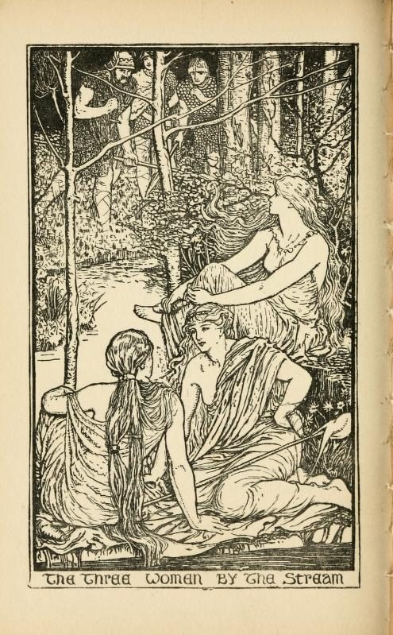
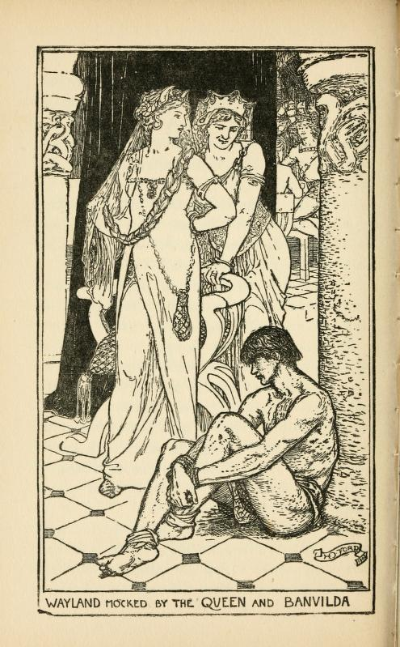
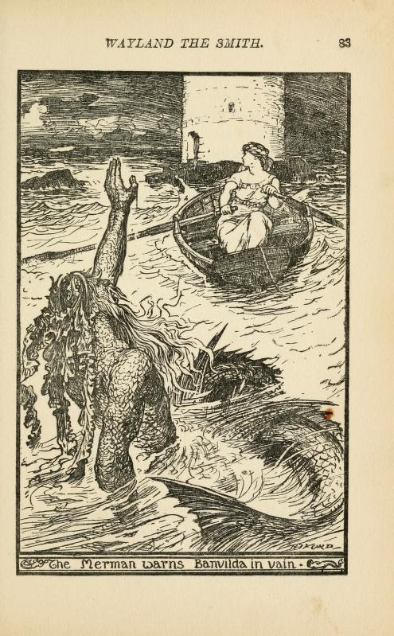
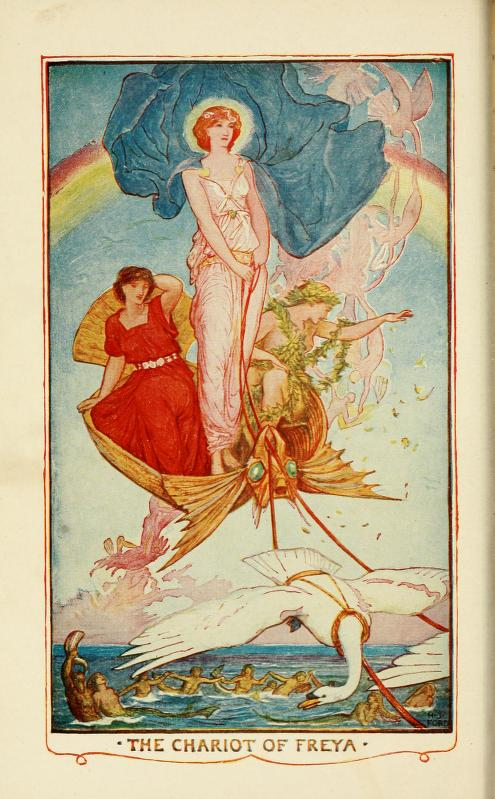

# Blacksmith Tales

- Devil and the Blacksmith / Smith and the Blacksmith, ATY0330A https://www.duchas.ie/en/cbes/stories?AaThTypeID=0330A eg https://www.duchas.ie/en/cbes/4605930/4603376
- Christ and Smith (horse legs into fire, old woman into fire etc) AT0753 https://www.duchas.ie/en/cbes/stories?AaThTypeID=0753&Page=1&PerPage=20
- blacksmith and St Dunstan (via Tony folk night)

https://archive.org/details/notesandqueries39haylgoog/page/148/mode/2up?q=devil+Dunstan+folktale+Osbern
St. Dunstan.— Was it at Glastonbury or at Mayfield that this saint "pulled the Devil by the nose".

https://archive.org/details/notesandqueries39haylgoog/page/216/mode/2up?q=devil+Dunstan+folktale+Osbern

St. Dunstan (10^'' S. i. U9).-Walter Gale, the Sussex schoolmaster, records that in 1740 "there was at Mayfield a pair of tongs, which the inhabitants affirmed, and many believed, to be that with which St. Dunstan, Archbishop of Canterbury, who had his residence at a tine ancient dome in this town, pinched the devil by the nose when, in the form of a handsome maid, he tempted him." See Chambers's 'Book of Days' (1864), vol. i. P- 331. A. R. Baylky.

It was at Mayfield that the devil is supposed to ha vo had his nose pulled by St. Dunstan. Eadmer, in his 'Life of St. Dunstan,' who died in 988, seems to imply that the palace of the Archbishops of Canterbury at Mayfield was built by that prelate, who, ho says, erected a wooden church. The life of this saint, as related by Osbern, Eadmer, and other monkish writers, is filled with accounts of miracles wrought by him, and also of bickerings and conflicts with the devil, in all which Satan met with more than his match. We are told that the archbishop, performing in person the ceremony of dedicating Mayfield Church, and, according to the accustomed form, going in procession round the building, observed that it was out of the line of sanctity, or, in other words, that it did not stand due east or west; on which he gently touched the edifice with his shoulder, and moved it into its proper bearings, to the great amazement and edification of ail tho spectators.

In connexion with Glastonbury there wag a hundred years ago at the west end of tho Tor, or tho Tower of St. Michael, a carved figure of the archangel, holding in tiis IimmMs a pair of scales, in one of which v, f,

and in the other a devil, who was n ! ly

another bearing upon the scales; both were represented, however, as much too light to poise against the holy volume.

CiiAS, F. FoRSHAW, LL.D., F.R.Hist.S.

Baltimore House, ISr&dfurd.

The story of St. Dunstan seizing the devil bv the nose occurs for the first time in Osbern's 'Life' of the "father of monks," where it is, I think, mentioned in connexion with his life in his cell at Glastonbury. The story is not quite so ridiculous as it appears at first sight. Dustan's dreams and "fairy tales" were generally turned to proJituhfe account for the edification of children, rather than of "grown-ups," and it is thought possible that the saint actually did t^ke some ribald intruder into his coll 03' the nose with some implement like the tongs, See the Rev. Wra. Stubljs's 'Memorials of Saint Dunstan,' Inlrod., p. Ixv and note.

J. HoLKRji MacMichakl.

The tongs are at Mayfield, and that should suffice, C. S. Waud.

St. Augustine's at Canterbury, I have always heard, claims the site of the tug.

HAttOLO Malkt, Colonel.

https://archive.org/details/in.ernet.dli.2015.109283/page/n335/mode/2up
The Book Of Days A Miscellany Of Popular Antiquities Vol 1
by R Chambers

Publication date 1863

p331

*St Dunstan.* — Walter Gale, the Sussex schoolmaster, records that in 1749, 'there was at Mayfield a pair of tongs, which the inhabitants affirmed, and many believed, to be that with which St Dunstan, Archbishop of Canterbury, who had its residence at a fine ancient dome in this town, pinched the devil by the nose when, in the form of a handsome maid, he tempted him.' What made it more terrible to this sightly tempter was, that the tongs happened to be red-hot, the pair being one that St Dunstan made use of at his forge, for it seems that the Archbishop was a blacksmith as well as a saint.

--

## Wayland Smith

Poetic edda

https://archive.org/details/waylandsmithadi00kinngoog/page/n20/mode/2up?q=english

Wayland Smith. A dissertation on a tradition of the middle ages
by Depping, Georg Bernhard, 1784-1853. [from old catalog]; Michel, Francisque Xavier, 1809-1887. [from old catalog]; Singer, Samuel Weller, 1783-1858. [from old catalog]; Oehlenschläger, Adam Gottlob, 1779-1850. Vaulundurs saga. [from old catalog]; Kinnear, Elizabeth, [from old catalog] tr

Publication date 1847

pp. viii-xii

`[TH: As told in Poetic Edda]`

There was a king in Sweden named Niduth; he had two sons, and a daughter named Baudvilde. At the same time existed three brothers, sons of an Alf-king,® that is to say, of supernatural race. They were named Slagfid, Egill, and Voelund. Pursuing the chase, and skating, they arrived in the Valley of Ulfdal, or the Valley of Bears, and constructed themselves a habitation on the borders of a lake.

There, one morning, they found three Valkyries, `[The Valkyries, in the Scandinavian mythology, have almost the same attributes as the parcae in the mythology of Greece. They also spin the thread of destiny, and besides, they assist at combats, by which, among a barbarous people, destinies are regulated. Although three are generally admitted, it appears, nevertheless, that others were also supposed to exist; and it is singular that daughters of earth might be Valkyries. We have here an example. Their fathers are named, who, a thing sufficiently odd, have frankish names; one is called Loedver, i. e., Lonis, and the other Kiare, probably Charles, of whom they make a king of Valland, a term under which was solely understood the country of the Walloons, France and Italy. See Depping Hist, des Expéditions maritime des Normands. Paris, 1826. 8vo. tom. ii. p. 388. The Valkyries appeared in the day in the form of swans; they could put off this form, which, according to the rude notions of the Scandinavians, was but a robe with which they covered themselves, and then they appeared in the human form. It is, therefore, here said, they had near them their swan robes. One of them was named Swan-hvite, or white as a swan.]` who, having put off their swan robes, were spinning flax: it was Alvite, [Allwite], or all-knowing; Svanhvite, or white as a swan; both of them daughters of King Loedver; and Alrune, daughter of Kiar, King of Valland. The brothers carried them to their dwelling, and were united to them; Slagfid took Swanwhite, Egill Alrune, and Voelund took Allwite.

After having lived with their husbands seven winters, the Valkyries flew away to visit the battles; two of the brothers, Egill and Slagfid, took their skates and went in search of their wives; but Voelund remained in his dwelling in the expectation of his wife's return, and applied himself to goldsmith's work.

The king Niduth, having heard mention of the beautiful works in gold that he fabricated, was desirous of possessing himself of them. He one night surreptitiously visits the dwelling of Voelund, accompanied by his warriors; they find there seven hundred rings strung on a strip of bark, and carry off one in the absence of the owner. At length he returns from the chase, lights a fire, and prepares for his repast some of the flesh of a bear he had killed, lays himself down on another bear's skin, and counts leisurely over his rings; he perceives with affright that one is missing. Nevertheless he falls asleep: during his slumber, the marauders bind him; Niduth presents himself when Voelund awakes, and carries him off to his dwelling after having seized upon the beautiful sword that the Smith had forged for himself. He gives the ring which he had purloined to his daughter. The queen, seeing the captive, does not like his look, is afraid of him, and orders him to be hamstrung, and retained as a prisoner. In consequence, Voelund, after being thus maimed, is shut up in a small island, and forced to fabricate all sorts of jewels for the king.

Voelund seeks an opportunity to revenge himself. Notwithstanding, he does not cease to work for his master. The two sons of Niduth sometimes come to see him, and ask for the keys of the coffer in which he has deposited his jewels. There they see the superb collars of gold of his workmanship. The king having interdicted every one from having access to the artisan, Voelund desires the two princes not to reveal to any one that they have been in his workshop, and he promises to give them some of his beautiful works if they will come to him again clandestinely on the morrow.

They take care not to fail. When they arrive, Voelund cuts off their heads, and buries their bodies in a swamp before his dwelling. He fashions their skulls into cups, mounts them in silver, and sends them to the king. Their eye-balls he enchases in the same precious metal, as breast ornaments, and sends them to the queen; turns their teeth into the form of pearls, and makes a necklace of them, which he sends to their sister Baudvilde. She had broken the ring which the king had carried off from Voelund, and which the goldsmith had intended for his wife, and she now sends a messenger to the artisan requesting him to repair the jewel unknown to her father. Voelund insists upon her bringing it herself under pretext of the king's injunction that he should work for no one but himself. She comes; Voelund gives her a soporific potion, and afterwards ravishes her. Then triumphing that he had achieved his revenge, he thinks of escaping. In fact, he flies, leaving Baudvilde in tears on account of his departure, and in dread of her father's anger. Voelund seats himself upon the fence which encloses the king's habitation. The queen incites the king to speak to him. Niduth deplores the loss of his sons, and repents having followed the counsels of the queen in maiming Voelund, who addresses himself to the king, and makes him swear that he will not punish his daughter for being pregnant. He reveals to him how he will find in his workshop the forge-bellows stained with the blood of his sons, and coldly recounts to him that their skulls, fashioned into vases, ornament the royal table.

Niduth is in desperation at what he hears; and desolate at not being able to reach the author of these misdeeds. Voelund flies away laughing, leaving the king plunged in grief. Having called his daughter, Niduth receives confirmation of the truth of that which the terrible smith had revealed to him. Baudvilde, in tears, confesses her shame, and it is by her lamentations that the chant of the Edda closes.

In this chant no mention is made of the son of Baudvilde by Voelund, nor of the sword Mimung, which his father forged for him, as we shall presently see. Nevertheless, the Edda of Snorro makes mention of this word which the old skalds had used to designate a sword, and which proves that the rest of the romance was current in the most antient times in the north.

`[TH: Wilkina Saga has a parallel tale with bits we might co-opt (and which Story Crow seems to have adopted in his telling)]`

pp. xxii-xxv

In the meanwhile, Egil, Voelund's brother, came to the king's court; he was the most skilful archer of his time. The king commanded Egil to shoot at, and pierce with an arrow, an apple placed on the head of EgiFs own child. He took two arrows struck the apple with one of them, and said that with the other he would have pierced the king if he had had the misfortune to kill his child.

Some time afterward it happened that the king's daughter broke a precious ring; she sent to Voeland requesting him to repair it without the knowledge of her father. Voelund replied that he could not do any work without the king's permission. He insisted that she should come herself. The princess repaired to the forge, and when she had entered, Voelund fastened the door, and violated her person. In the course of time she gave birth to a son.

A short time after this two sons of the king addressed themselves to Voelund in order that he might make them some arrows. He repeated to them that he could work for no one but the king, but he induced them to come again to him, walking backwards, which they did. When they had entered, he again fastened the door of the forge, killed the two princes, and buried their bodies. When, on the morrow, enquiry was made whether the two princes had not been at his dwelling, he answered, that they had come, but that they had gone away to hunt in the forest, and he shewed the print of their footsteps in the snow. He then took their skulls, made drinking cups of them, fashioned their bones into salt-cellars and other vases, mounting them artistically in gold and silver, and gave the whole to the king, who, not having any suspicion, was proud of such beautiful ornaments for his table at his feasts.

Voelund, the smith, had thus revenged himself of the despite with which he had been treated; he had deprived the king of his sons, he had caused him to drink out of their sculls, and, besides, the daughter of Nidung was pregnant by him.

He could not doubt that the king would put him to death if he became acquainted with these facts. He requested his brother, therefore, to furnish him with feathers of all sizes. Egil went into the woods, killed all sorts of birds, and brought the feathers to Voelund. With them Voelund made himself wings resembling those of a great bird of prey. The brothers met together in the forge, Voelund gave the wings to Egil, and requested him to take them with him to the mountain, to attach them to himself, and to try to fly. Egil enquired how he must proceed to raise himself in the air, and to re-descend to the earth when he desired to do so. Voelund replied, that he must spread the wings, and direct himself against the wind, and that then he would fly like the swiftest bird. When Egil essayed to do so, he fell, and narrowly escaped breaking hb neck; he returned to his brother, and when he was asked whether the wings were good, he answered: "If it was as easy to descend with your wings as to fly with them, I should have passed into another country, and yoa would have never seen them again."

Voelund said he would correct this defect; he then requested Egil to tell the king's daughter to come to him, which his brother accordingly did. When she came to the forge they conversed together a long time. Voelund communicated to her the resolution he had taken, he predicted that she would give birth to a son; he exhorted her to bring him up with care, and when he was old enough to bear arms, to tell him to go in quest of the arms which his father had prepared for him.

Before they separated, they mutually promised each other upon oath not to have any other husband or wife. It is related that Voelund then ascended to the roof of his house, took the wings, prepared himself, and at last ascended into the air. He said to his brother: "If you are called upon to shoot at me, you will aim at this bladder which I have filled with the blood of the sons of King Nidung, and which I have fastened under my left arm. When flying away he confessed to his brother that he had misdirected him in the mode of managing the wings, because he was suspicious of him.

Voelund flew up on the highest tower, and cried out with all his might for the king to come and speak with him. On hearing his voice the king came out, and said, "Voelund, have you become a bird? What is your project?" — "My lord," replied the smith, "I am at present bird and man at once; I depart, and you will never see me again in your life. Nevertheless, before I go, I will reveal to you some secrets. You cut my ham-strings to prevent me from going, and I revenged myself upon your daughter, who is with child by me. You would have deprived me of the use of my feet, and, in my turn, I have deprived you of your sons, whose throats I cut with my own hand; but you will find their bones in the vases garnished with gold and silver with which I have ornamented your table." Having said these words Voelund disappeared in the air. Then the king said to Egil: "Take your bow, and shoot ai him, the villain must not escape alive; if you miss him your head shall pay the forfeit." Egil took his bow, shot, and the arrow struck Voelund under the left arm, so that the blood descended upon the earth. "It is good," said the king, "Voelund cannot go far." Nevertheless he flew into Seeland, descended in a wood, where he constructed himself a dwelling.

`[TH:  in English tradition]`

pp. xxxv-xxxvi

In a vale in Berkshire, at the foot of White Horse Hill, and in the midst of a heap of rude stones fixed in the earth, according to tradition, formerly dwelt a person called Wayland Smith; no one ever saw him, but when his services were required to shoe a horse, it sufficed to leave the horse among the stones, and to place on one of the stones a piece of money. When a reasonable time had elapsed the horse was found to be shod and the piece of money gone. The reader need not be reminded of the use Sir Walter Scott has made of the tradition in the Wayland Smith of his Kenilworth.

The rude stones which were scattered over the Vale of White Horse, had been erected by the hand of man. They were such Druidic monuments as were found in many places of Great Britain and France, and which disappear gradually as agriculture advances. Documents are wanting which might inform us how the Scandinavian legend of Weland came to be attached to this locality.

---
https://archive.org/details/talesofromanceba00lang/page/48/mode/2up?q=%22wayland+the+smith%22
Tales of romance; based on tales in the Book of romance
by Lang, Andrew, 1844-1912

Publication date 1906

pp. 49-87

WAYLAND THE SMITH. PART I.

RIGHT up to the north of Norway and Sweden, looking straight at the Pole, lies the country of Finmark. It is very cold and very bare, and for half the year very dark; but inside its stony mountains are rich stores of metals, and the strong, ugly men of the country spent their lives in digging out the ore and in working it.

Like many people who dwell in mountains, they saw and heard strange things, which were unknown to the inhabitants of the lands to the south.

Now in Finmark there were three brothers whose names were Slagfid, Eigil, and Wayland, all much handsomer and cleverer than their neighbours. They had some money of their own, but this did not prevent them working as hard as anyone else; and as they were either very clever or very lucky, they were soon in a fair way to grow rich.

One day they went to a new part of the mountains which was yet untouched, and began to throw up the earth with their pick-axes; but instead of the iron they expected to see, they found they had lighted upon a mine of gold.

This discovery pleased them greatly and their blows became stronger and harder, for the gold was deep in the rock and it was not easy to get it out.

At last a huge lump rolled out at their feet, and when they picked it up they saw three stones shining in it, one red and one blue and one green. They took it home to their mother, who began to weep bitterly at the sight of it. "What is the matter?' asked her sons anxiously, for they knew things lay open to her which were hidden from others.

"Ah, my sons," she said as soon as she could speak, "you will have much happiness, but I shall be forced to part with you. Therefore I shed tears, for I hoped that only death would divide us ! Green is the grass, blue is the sky, red are the roses, golden is the maiden. The Noras (for so in that country they called the Fates) "beckon you to a land where green fields lie under a blue sky, fields where golden-haired maidens lie among the flowers."

Great was the joy of the three brothers when they heard the words of their mother; for they hated the looks of the women who dwelt about them, and longed to see the maidens of the south. Next morning they rose early and buckled on their swords and coats of mail, and fastened on their heads helmets that they had made the day before from the lump of gold. In the centre of Slagfid's helmet was the green stone, and in the centre of Eigil's was the blue stone, and in the centre of Wayland's was the red stone; and when they were ready they put their reindeers into their sledges, and set out over the snow.

WAYLAND THE SMITH. PART II.

WHEN they reached the mountains where only yesterday they had been digging, they saw by the light of the moon a host of little men running to meet them. They were dressed all in grey, except for their caps, which were red; they had red eyes, too, and black tongues, which never ceased chattering.

These were the mountain elves, and when they came near they formed themselves into a fairy ring, and sang while they danced round:

Will you leave us? Will you leave us?  
Slagfid, Eigil, and Wayland, sons of a King.  
Is not the emerald better than grass?  
Is not the ruby better than roses?  
Is not the sapphire better than the sky?  
Why do you leave the mountains of Finmark?

But Eigil was impatient and struck his reindeer, that willing beast which flies like the wind and needs not the touch of a whip. It bounded forward in surprise, and knocked down one of the elves that stood in its path. But the hands of his brothers laid hold of the reins, and stopped the reindeer, and sang again:-

The Finlander's world, the Finlander's joy  
Lies under the earth;  
Seek not without what we offer within,  
Despise not the elves small and dark though they be.

The best is within, do not seek it without.  
The Finlander's world, the Finlander's joy,  
Lies under the earth.

Slagfid struck his reindeer. It bounded forward and struck down an elf who stood in its road. Then his brothers stood in its path, and stopped the reindeer, and sang:-

Because Slagfid struck his reindeer,  
Because Eigil struck his reindeer,  
Our hatred shall follow you.  
A time of weal, a time of woe, a time of grief, a time of joy.  
Because Wayland also forsook us,  
Though he struck not the reindeer,

A time of weal, a time of woe, a time of grief, a time of joy.  
Farewell, O Finlanders, sons of a King.

Their voices died away as they crossed a bright strip of moonlight, which lay between them and the mountains and so they were seen no more.

The brothers thought no more about them or their words, but went swiftly on their way south, sleeping at night in their reindeer skins.

After many days they came to a lake full of fish, in a place which was called the Valley of Wolves, because of the number of wolves which hid there. But the Finlanders did not mind the wolves, and built a house close to the lake, and hunted bears, and caught fish through holes in the ice, till winter had passed away and spring had come. Then one day they noticed that the sky was blue and the earth covered with flowers.

By-and-by they noticed something more, and that was that three maidens were sitting on the grass, spinning flax on the bank of a stream. Their eyes were blue, and their skins were white as the snow on the mountains, while instead of the mantles of swansdown they generally wore, golden hair covered their shoulders.

The hearts of the brothers beat as they looked on the maidens, who were such as they had often dreamed of, but had never seen; and as they drew near they found to their surprise that the maidens were dressed each in red, green, and blue garments, and the meadow was so thickly dotted with yellow flowers that it seemed as if it were a mass of solid gold.

"Hail, noble princes ! Hail, Slagfid, Eigil, and Way land," sang the maidens.

"Swanvite, Alvilda, and Alruna are sent by the Noras, To bring joy to the princes of Finmark."

Then the tongues of the young men were unloosed, and Slagfid married Swanvite, Eigil Alruna, and Wayland Alvilda.

WAYLAND THE SMITH. PART III.

FOR nine years they all lived on the shores of the lake, and no people in the world were as happy as these six, till one morning the three wives stood before their husbands and said with weeping eyes:—

"Dear lords, the time has now come when we must bid you farewell, for we are not allowed

to stay with you any longer. We are Norns — or, as some call us, Valkyrie. Nine years of joy are granted to us, but these are paid for by nine years during which we hover round the combatants on every field of battle. But bear your souls in patience, for on earth all things have an end, and in nine years we will return to be your wives as before.'1

"But we shall be getting old then," answered the brothers, "and you will have forgotten us. Stay now, we pray you, for we love you well."

"We are not mortals to grow old," said the Norns, "and true love does not grow old either. Still, we do not wish you to fall sick with grieving, so we leave you these three keys, with which you may open the mountain, and busy yourselves by digging out the treasures it contains. By the time the nine years are over you will have become rich and men of renown." So they laid down the keys and vanished.

For a long while the young men only left their houses to seek for food, so dreary had the Valley of Wolves become. At last Slagfid and Eigil could bear it no longer, and declared they would travel through the whole world till they found their wives; but Wayland, the youngest, determined to stay at home.

"You would do much better to remain where you are," said he. "You do not know in which direction to look for them, and it is useless to seek on earth for those who fly through the air. You will only lose yourselves, and starve, and when the nine years are ended who can tell where you may be?"

But his words fell on deaf ears; for Slagfid and Eigil merely filled their wallets with food and their horns with drink, and prepared to take leave of their brother. Wayland embraced them weeping, for he feared that he should never more see them, and once again he implored them to give up their quest. Slagfid and Eigil only shook their heads. "We have no rest, night or day, without them," they said, and they begged him to look after their property till they came back again.

Wayland saw that more words would be wasted, so he walked with them to the edge of the forest, where their ways would part. Then Slagfid said: "Our fathers, when they went a journey, left behind them a token by which it might be known whether they were dead or alive,

and I will do so also." So he stamped heavily on the soft ground, and added, "As long as this footmark remains sharp and clear, I shall be safe. If it is filled with water I shall be drowned; if with blood, I shall have fallen in battle. But if it is filled with earth an illness will have killed me, and I shall lie under the ground." Thus he did, and Eigil did likewise. Then they cut stout sticks to aid their journeys, and went their ways. Wayland stood gazing after them as long as they were in sight, and then he went sadly home.

WAYLAND THE SMITH. PART IV.

SLAGFID and Eigil walked steadily on through the day, and when evening came they reached a stream bordered with trees, where they took off their golden helmets and sat down to rest and eat. They had gone far that day and were tired, and drank somewhat heavily, so that they knew not what they did. "If I lose my Swanvite," said Slagfid, "I am undone. She is the fairest woman that sun ever looked on, or that man ever loved."

"It is a lie," answered Eigil. "I know one lovelier still, and her name is Alruna. Odin does not love Freya so fondly as Eigil adores her."

"It is no lie," cried Slagfid, "and may shame fall on him who slanders me."

"And I," answered Eigil, "stand to what I have said, and declare that you are the liar." At this they both drew their swords and fell fighting, till Slagfid struck Eigil's helmet so hard that the jewel flew into a thousand pieces, while Eigil himself fell backwards into the river.

Slagfid stood still, leaning on his sword and looking at the river into which his brother had fallen. Suddenly the trees behind him rustled, and a voice came out of them, saying, "A time of weal, a time of woe, a time of tears, a time of death "; and though he could see nothing he remembered the mountain elves, and thought how true their prophecy had been. "I have slain my brother," he said to himself, "my wife has forsaken me; I am miserable and alone. What shall I do? Go back to Wayland, or follow Eigil into the river? No. After all I may find my wife. The Noras do not always bring misfortune."

As he spoke a light gleamed in the darkness of the night, and. looking up, Slagfid saw it was

shed by a bright star which seemed to be drawing nearer, and the nearer it drew its shape seemed to change into a human figure. Then Slagfid knew that it was his wife, Swanvite, floating just over his head and encircled by a rim of clear green light.

He could not speak for joy, but held out his arms to her. She beckoned to him to follow her, and Slagfid, flinging away his sword and coat of mail, began to climb the mountain.

Half way up it seemed to him as if a hand from behind was pulling him back, and turning he fancied he beheld his mother and heard her say: "My son, seek not after vain shadows, which yet may be your ruin."

The words caused Slagfid to pause for a moment. Then the figure of Swanvite danced before him and beckoned to him again, and his mother was forgotten. There were rivers to swim, precipices to climb, chasms to leap, but he passed them all gladly, till at last he noticed that the higher he got the less the figure seemed like Swanvite.

He felt frightened and tried to turn back, but he could not. On he had to go, till just as he reached the top of the mountain the first rays of the sun appeared above the horizon, and he saw that, instead of Swanvite, he had followed a black elf.

He paused and looked over the green plain that lay thousands of feet below him, cool and inviting after the stony mountain up which he had come. "A time of death," whispered the black elf in his ear, and Slagfid flung himself over the precipice.

WAYLAND THE SMITH, PART V.

AFTER his brothers had forsaken him Wayland went to bed lonely and sad; but the next morning he got up and looked at the three keys that the Norns had left behind them. One was of copper, one was of iron, and one was of gold.

Taking up the copper one, he walked to the mountain till he reached a flat wall of rock. He laid his key against it, and immediately the mountain flew open and showed a cave where everything was green. Green emeralds studded the rocks, green crystals hung from the ceiling or formed rows of pillars, even the copper which made the walls of the cave had a coating of green. Wayland broke off a huge projecting lump and left the cave, which instantly closed up so that not a crack remained to tell where the opening had been.

He carried the lump home, and put it into the fire till all the earth and stones which clung to it were burned away; and then he fashioned the pure copper into a helmet, and in the front of the helmet he set three of his largest emeralds

This occupied some days, and when it was done he took the iron key, and went to another mountain, and laid the key against the rock, which flew open like the other one. But now the walls were of iron, which shone like blue steel, while sapphires glittered in the midst.

Wayland gazed with wonder at all these things; then he broke off a piece of the iron, and carried it home with him.

For many days after he busied himself in forging a sword that was so supple he could wind it round his body, and so sharp it could cut through a rock as if it had been a stick. In the handle and in the sheath he set some of the finest sapphires that he had brought away with him.

When all was finished he laid the sword aside, and returned to the mountain, with the golden key. This time the mountain parted, and he saw before him an archway, with a glimpse of the sea in the distance.

Before the entrance roses were lying, and inside the golden walls sparkled with rubies, while branches of red coral filled every crevice. Vines climbed around the pillars, and bore large bunches of red grapes.

Wayland stood long, looking at these marvels; then he plucked some of the grapes, broke off a lump of gold, and set out home again.

Next day he began to make himself a golden breastplate, and in it he placed the jewels, and it was so bright that you could have seen the glitter a mile off.

After he had tried all the three keys, and found out the secrets of the mountain, "Wayland felt dull. So his mind went back to his brothers, and he wondered how they had fared all this time.

The first thing he did was to go to the edge of the forest, and see if he could find the two footprints they had left.

He soon arrived at the spot where they had taken farewell of each other, but a blue pool of water covered the trace of Eigil's foot. He turned to look at the impression made by Slagfid, but on that fresh green grass had sprung up over it, and on a birch-tree near it a bird had perched, which sang a mournful song.

Then Wayland knew that his brothers were dead, and he returned to his hut, grieving sore.

WAYLAND THE SMITH. PART VI.

IT was a long time before Wayland could bring himself to go out, so great was his sorrow; but at last he roused himself from his misery, and went to the mountain for more gold, meaning to work hard till the nine years should be over and he should get his wife back again.

All day long he stood in his forge, smelting and hammering, till he had made hundreds of suits of armour and thousands of swords, and his fame travelled far, so that all men spoke of his industry.

At last he grew tired of making armour, and hammered a number of gold rings, which he strung on strips of bark, and as he hammered he thought of Alvilda his wife, and how the rings would gleam on her arms when once she came back again.

Now at this time Nidud the Little reigned over Sweden, and was hated by his people, for he was vain and cowardly and had many other bad qualities. It came to his ears that away in the forests lived a man who was very rich, and worked all day long in pure gold.

The King was one of those people who could not bear to see anyone with things which he did not himself possess, and he began to make plans how to get hold of Wayland's wealth.

At length he called together his chief counsellors, and said to them : "I hear a man has come to my kingdom who is called Wayland, famous in many lands for his skill in sword-making. I have set men to inquire after him, and I have found that when first he came here he was poor and of no account, so he must have grown rich either by magic or else by violence. I command, therefore, that my stoutest men-at-arms should buckle on their iron breastplates and ride in the dead of night to Wayland's house, and seize his goods and his person."

"King Nidud," answered one of the courtiers, "that you should take himself and his goods is well, but why send a troop of soldiers against one man? If he is no sorcerer, then a single one of your soldiers could take him captive; but if, on the other hand, he is a magician, then a whole army could do nothing with him against his will."

At this reply the King flew in a rage, and, snatching up a sword, ran it through his counsellor's body; then, turning to the rest, told them that they would suffer the same fate if they refused to submit to his will.

So the men-at-arms put on all their armour, and, mounting their horses, set forth at sunset to Wayland's house, King Nidud riding at their head. The door stood wide open, and they entered quietly, in deadly fear lest Wayland should attack them.

But no one was inside, and they looked about, their eyes dazzled by the gold on the walls. The King gazed with wonder and delight at the long string of golden rings, and, slipping the finest off a strip of bark, placed it on his finger.

At that moment steps were heard in the outer court, and the King hastily desired his followers to hide themselves, and not to stir till he signed to them to do so.

Ju another moment Wayland stood in the doorway, carrying on his shoulders a bear which he had killed with his spear and was bringing home for supper.

He was both tired and hungry, for he had been hunting all day; but he had first to skin the animal, and make a bright fire, before he could cut off some steaks and cook them at the end of the spear. Then he poured some mead into a cup and drank, as he always did, to the memory of his brothers. After that he spread out his bear's skin to dry in the wind, and this done he stretched himself out on his bed and went to sleep.

WAYLAND THE SMITH. PART VII.

KING NIDUD waited till he thought all was safe, then crept forth with his men, who held heavy chains in their hands wherewith to chain the sleeping Wayland. But the task was harder than they expected, for he started up in wrath, asking why he should be treated so. "If you want my gold, take it and release me. It is useless fighting against such odds."

"I am no robber," said Nidud, "but I am your King."

"You do me much honour," replied Wayland, "but what have I done to be loaded with chains like this?"

"Wayland, I know you well," said Nidud. "Poor enough you were when you came from Finmark, and now your jewels are finer and your drinking cups heavier than mine."

"If I am indeed a thief," answered Wayland, "then you do well to load me with chains and lead me bound into your dungeons; but if not, I ask again, Why do you misuse me?"

"Riches do not come of themselves," said Nidud, "and if you are not a thief, then you must be a magician and must be watched."

"If I were a magician," answered Wayland, "it would be easy for me to burst these bonds. I know not that I have ever wronged any man, but if he can prove it, I will restore it to him tenfold. As to the gifts that may come from the gods, no man should grudge them to his fellow. Therefore release me, O King, and I will pay whatever ransom you may fix."

But Nidud only bade his guards take him away, and Wayland, seeing that resistance availed nothing, went with them quietly.

By the King's orders he was thrown into a

WAY LAND THE SMITH. 69

dark hole fifteen fathoms under ground, and the soldiers then came and robbed the house of all its treasures, which they took to the Palace. The ring which Wayland had made for Alvilda, Nidud gave to his daughter, Banvilda.

One day the Queen was in her own room, when the King came in to ask her advice as to how best to deal with Wayland, as he did not think it wise to put him to death, for he hoped to make some profit out of his skill. "His heart will beat high," said the Queen, "when he sees his good sword, and beholds his ring on Banvilda's finger. But cut asunder the sinews of his strength, so that he can never more escape from us, and keep him a prisoner."

The King was pleased with the Queen's words, and sent soldiers to carry Wayland to a tower on an island. The sinews of his legs were cut so that he could not swim way; but they gave him his boots, and the chests of gold they had found in his house. Here he was left, with nothing to do from morning till night, but to make helmets and drinking cups and splendid armour for the King.

WAYLAND THE SMITH. PART VIII.

ON this island Wayland remained for a whole year, chained to a stone and visited by no one but the King, who came from time to time to see how his prisoner was getting on with a suit of golden armour he had been ordered to make.

The shield was also of gold, and on it Wayland had beaten out a history of the gods and their great deeds. He was very miserable, for the hope of revenge which had kept him alive seemed as far off as ever in its fulfilment, and finding a sword he had lately forged lying close to his hand, he seized it, with the intent of putting an end to his wretched life.

He had hardly stretched out his hand, when a bird began to sing at the iron bars of his window, while the evening sun shone into his prison. "I should like to see the world once more," thought he, and, raising himself on the stone to which his chain was fastened, he was able to look at what lay beneath him.

The sea washed the base of the rock on which the tower was built, and on a neck of land a little way off some children were playing before the door of a hut. Everything was bathed in red light from the glow of the setting sun.

Wayland stood quite still on top of the stone, gazing at the scene with all his eyes, yet thinking of the land of his birth, which was so different. Then he looked again at the sea, which was already turning to steel, and in the distance he saw something moving on the waves.

As it came nearer he discovered it was a water sprite, singing a song which blended with the murmur of the waves and the notes of the bird. And the song put new life and courage into his heart, for it told him that if he would endure and await the pleasure of the gods, joy would be his one day.

The sprite finished her song, and smiled up at Wayland at the window before turning and swimming over the waves till she dived beneath them. That same instant the bird flew away, and the moon was covered by a cloud. But Wayland's heart was cheered, and when he lay down to rest he slept quietly.

Some days later the King paid another visit, and suddenly espied the three keys which had been hidden in a corner with some of Wayland's tools.

He at once asked Wayland what they were, and when he would not tell him the King grew so angry that, seizing an axe, he declared that he would put his prisoner to death unless he confessed all he knew. There was no help for it, and Wayland had to say how he came by them and what wonders they wrought. The King heard him with delight and went away, taking the keys with him.

WAYLAND THE SMITH. PART IX.

No time was lost in preparing for a journey to the mountains, and when the King reached the spot described by Wayland he divided his followers into three parties, sending two to await him some distance off, and keeping the third to enter the mountain with himself, if the copper key did the wonders it had done before.

So he gave it to one of the bravest of his men, and told him to lay it against the side of the mountain. The man obeyed, and instantly the mountain split from top to bottom.

The King bade them enter, never doubting that rich spoils awaited him; but instead, the men sank into a green marsh, which swallowed up many of them, while the rest were stung to death by the green serpents hanging from the roof. Those who, like the King, were near the entrance alone escaped.

As soon as he had recovered from the terror into which this adventure had thrown him, he commanded that it should be kept very secret from the other two parties, and desired Storbiorn his Chamberlain, to take the key of iron and the key of gold and deliver them to the leaders of the divisions he had left behind, with orders to try their fortune in different parts of the mountain.

"Give the keys to me, my lord King," answered Storbiorn, "and I shall know what to do with them. These magicians may do their worst, my heart will not beat one whit the faster; and I shall see all that happens."

So he went and gave his message to the two divisions, and one stayed behind while Storbiorn went to the mountain with the other.

When they arrived, the man who held the key laid it against the rock, which burst asunder, and half the men entered at Storbiorn's command.

Suddenly an icy blue stream poured upon them from the depths of the cavern, and drowned most of them before they had time to fly. Only those behind escaped, and Storbiorn bade them go instantly to the King and tell him what had happened.

Then he went to the third troop and marched with them to the rock, where he gave the golden key to one of the men, and ordered him to try it.

The rock flew open at once, and Storbiorn told the men to enter, taking care, however, to keep behind himself. They obeyed and found themselves in a lovely golden cave, whose walls were lit up by thousands of precious stones of every hue.

There was neither sight nor sound to frighten them, and even Storbiorn, when he saw the gold, forgot his prudence and his fears, and followed them in.

In a moment a red fire burst out with a terrific noise, and clouds of .smoke poured over them, so that they fell down choked into the flames. Only one man escaped, and he ran back as fast as he could to the King to tell him of the fate of his army.

WAYLAND THE SMITH. PART X.

ALL this time Way land was working quietly in his island prison, waiting for the day of his revenge. The suit of golden armour which the King had commanded kept him busy day and night, and, besides the wonderful shield with figures of the gods, he had wrought a coat of mail, a helmet, and armour for the thighs, such as never had been seen before.

The King had invited all his great nobles to meet him at the Palace, when he returned from the mountain, so that they might see his wonderful armour and all the precious things he should bring with him from the caverns.

When Nidud reached his Palace the Queen and Banvilda, their daughter, came forth to meet him, and told him that the great hall was already full of guests, expecting to see the wonders he had brought.

The King said little about his adventures, but went into the armoury to put on his armour in order to appear before his nobles. Piece by piece he fastened it, but he found the helmet so heavy that he could hardly bear it on his head.

However, he did not look properly dressed without it, so he had to wear it, though it felt as if a whole mountain was pressing on his forehead. Then, buckling on the sword which Wayland had forged, he entered the hall, and seated himself on the throne.

The Earls were struck dumb by his splendour, and thought at first that it was a god, till they looked under the helmet and saw the ugly little man with the pale cowardly face. So they turned their eyes gladly on the Queen and Princess, both tall and beautiful and glittering with jewels, though inwardly they were not much better than the King.

A magnificent dinner made the nobles feel more at ease, and they begged the King to tell them what man was so skilled in smith's work. Now Nidud had drunk deeply, and longed to revenge himself on Wayland, whom he held to have caused the loss of his army; so he gave the key of the tower to one of his Earls, and bade him take two men and bring forth Wayland, adding that if the next time he visited the tower he should find a grain of gold missing, they should pay for it with their lives.

The three men got a boat, and rowed towards the tower, but on the way one who, like the King, had drunk too much fell into the sea and was drowned. The other two reached the tower in safety, and finding Wayland, blackened with dust, busy at his forge, bade him come just as he was to the boat.

With his hands bound they led him before the King, and said, "We have done your desire, Sir King, and must now hasten back to look for Gullorm, who fell into the sea ".

"Leave him where he is," replied Nidud; "and in token of your obedience to my orders I will give you each these golden chains."

The guests had not thought to see the man who had made such wonderful armour helpless and a cripple, and said so to the King. "He was once handsome and stately enough," answered Nidud, "but I have bowed his stubborn head." And the Queen and her daughter laughed and said, "The maidens of Finmark will hardly fancy a lover who cannot stand upright ".

But Wayland stood as if he heard nothing, till the King's son snatched a bone from the table and threw it at his head. Then his patience gave way, and, seizing the bone, he beat Nidud about the head with it till the helmet itself fell off.

The guests all took his side, and said that, though a cripple, he was braver than many men whose legs were straight, and begged the King to allow him to go back to his prison without being teased further.

But the King cried that Way land had done mischief enough, and must now be punished, and told them the story of his visit to the mountain and the loss of his followers. "It would be a small punishment to put him to death," he said, "for to so wretched a cripple death would be welcome. He may use the gold that is left, but henceforth he shall only have one eye to work with," and the Princess came forward and carried out the cruel sentence herself. Wayland bore it all, saying nothing, but praying the gods to grant him vengeance.

WAYLAND THE SMITH. PART XI.

ONE night Wayland sat filled with grief and despair, looking out over the sea, when he caught

sight of two red lights, bobbing in his direction.

He watched them curiously till they vanished beneath the tower.

Soon the key of the door turned, and two men, whom he knew to be the King's sons, talked softly together. He kept very still, and heard one say: "Let us first get as much from the chest as we can carry, then we will put him to death, lest he should betray us to our father."

Then Wayland took a large sword which lay by his side and hid it behind him, and he had scarcely done so when the princes entered the prison. "Greeting to you," said they. "Nidud our father has gone into the country, and as he is so greedy of wealth that he will give us none, we have come here to get it for ourselves. Hand us the key and swear not to tell our father, or you shall die."

"My good lords," answered Wayland, "your request is reasonable, and I am not so foolish as to refuse it. Here is the key, and I will swear not to betray you."

The brothers took the key, and opened the chest, which was still half full of gold. It dazzled their eyes, and they both stooped down so as to see it better. This was what Wayland had waited for, and, seizing his sword, he cut off their heads, which fell into the chest. He then dug a grave for the bodies in the floor of his dungeon. Afterwards he dried the skulls, and made them into two drinking cups wrought with gold. The eyes he set with precious stones, while the teeth he filed till they were shaped like pearls, and strung like a necklace.

As soon as the King came back from his journey he paid a visit to Wayland, who produced the drinking cups which he said were made of some curious shells washed up in a gale-

After some days had passed, some sailors found the princes' boat, which had drifted into the open sea. Their bodies, of course, were not to be found, and the King ordered a splendid funeral feast to be prepared.

On this occasion the new drinking cups were filled with mead, and, besides her necklace, Banvilda wore the ring which her father had taken long ago from Way land's house.

As was the custom, the feast lasted long, and the guests drank deeply and grew merry. But at midnight their gaiety suddenly came to an end. The King was drinking from the cup of mead, when he felt a violent pain in his head and let the vessel fall. The hues of the armlets th

the Queen wore became so strange and dreadful that her eyes suffered agony from looking at them, and she tore them from her arms; while Banvilda was seized with such severe toothache that she could sit at table no longer. The guests at once took leave, but it was not till the sun rose that the pains of their hosts went away.

WAYLAND THE SMITH. PART XII.

IN the torture of toothache which she had endured during the night, Banvilda had dashed her arm against the wall, and had broken some of the ornaments off the ring.

She feared to tell her father, who would be sure to punish her, and was in despair how to get the ring mended, when she caught sight of tHe island on which Wayland's tower stood. "If I had not mocked at him he might have helped me now," thought she.

No other way seemed to offer itself, and in the evening she loosened a boat and began to row to the tower. On the way she met an old merman with a long beard, floating on the waves, who warned her not to go on; but she paid no heed, and only rowed the faster.

She entered the tower by a false key, and, holding the ring out to Wayland, begged him to mend it as fast as possible, so that she might return before she was missed. Wayland answered her with courtesy, and promised to do his best, but said that she would have to blow the bellows to keep the forge fire alight. "How comes it that these bellows are sprinkled with blood?" asked Banvilda.

"It is the blood of two young sea dogs," answered Wayland; "they troubled me for long, but I caught them when they least expected it. But blow the bellows harder, I pray you, or I shall never be finished."

Banvilda did as she was told, but soon grew tired and thirsty, and begged Wayland to give her something to drink. He mixed something strife t in a cup, which she swallowed hastily, and soon fell fast asleep on a bench. Then Wayland bound her hands, and placed her in the boat, after which he cut the rope that held it and let it drift out to sea.

This done, he shut the door of the tower, and, taking a piece of gold, he engraved on it the history of all that had happened, and put it where it must meet the King's eye when next he came. "Now is my hour come," he cried with joy, snatching his spear from the wall, but before he could throw himself on it he heard a distant song and the notes of a lute.

By this time the sun was high in the heavens, yet its brightness did not hinder Wayland from seeing a large star, which was floating towards him, and a brilliant rainbow spanned the sky. The flowers on the island unfolded themselves as the star drew near, and he could smell the smell of the roses on the shore.

And now Wayland saw it was no star, but the golden chariot of Freya the goddess, whose blue mantle floated behind her till it was lost in the blue of the sky. On her left was a maiden dressed in garlands of fresh green leaves, and on her right was one clad in a garment of red.

At the sight Wayland's heart beat high, for he thought of the lump of gold set with jewels, which he and his brothers had found in the mountain so long ago. Fairies fluttered round them, mermaids rose from the depths of the sea to welcome them, and as Freya and her maidens entered the prison Wayland saw that she who wore the red garment was indeed Alvilda. "Wayland," said the goddess, "your time of woe is past. You have suffered much and have avenged your wrongs, and now Odin has granted my prayer that AlviJda shall stay by you for the rest of your life, and when you die she shall carry you in her arms to the country of Walhalla, where you shall forge golden armour and fashion drinking horns for the gods."

When Freya had spoken, she beckoned to the green maiden, who held in her hand a root and a knife. She cut pieces off the root and laid them on Wayland's feet, and on his eye, then, placing some leaves from her garland over the whole, she breathed gently on it. "Eyr the physician has healed me," cried Wayland, and the fairies took him in their arms and bore him across the waves to a bower in the forest, where he dreamed that Alvilda and Slagfid and Eigil were all bending over him.

When he woke Alvilda was indeed there, and he seemed to catch glimpses of his brothers amid the leaves of the trees. "Arise, my husband," said Alvilda, "and go straight to the Court of Nidud. He still sleeps, and knows nothing. Throw this mantle on your shoulders, and they will take you for his servant."

So Wayland went, and reached the royal chamber, and in his sleep the King trembled, though he knew not that Wayland was near. "Awake," cried Wayland, and the King awoke, and asked who had dared to disturb him thus.

"Be not angry," answered Wayland; "had you slain Wayland long ago, this misfortune that I have to tell you of would never have happened."

"Do not name his name," said the King, "since he sent me those drinking cups a burning fever has laid hold upon me."

"They were not shells, as he told you," answered Wayland, "but the skulls of your two sons, Sir King. Their bodies you will find in Wayland's tower. As for your daughter, she is tossing, bound, on the wild waves of the sea. But now I, Wayland, have come to give you your deathblow— But before he could draw

his sword fear had slain the King yet more quickly.

So Wayland went back to Alvilda, and they went into another country, where he became a famous smith, and he lived to a good old age; and when he died he was carried to Walhalla, as Freya had promised.

---

https://www.hantsfieldclub.org.uk/publications/hampshirestudies/digital/1910s/Vol_8/Hills.pdf
NOTES ON SOME BLACKSMITHS'
LEGENDS AND THE OBSERVANCE
OF ST. CLEMENT'S DAY.
BY GORDON P. G. HILLS.

Hampshire Field Club

includes:

"And it came to pass when Solomon, the son of David, had finished the temple of Jerusalem, that he called unto him the
chief architects, the head architects, the head artificers, and cunning workers in silver and gold, in wood and ivory, and in stone, yea, all who had aided in rearing the temple of the Lord and he said unto them: 'Sit ye down at my table. I have prepared a feast for all chief workers and cunning artificers; stretch forth your hands, therefore, and eat, and drink, and be merry. Is not the labourer worthy of his hire? Is not the skilful artificer worthy of his honour? Muzzle not the ox that treadeth out the corn.' And when Solomon and the chief workers were seated, and the fatness of the land, and the wine and the oil thereof, were set upon the table, there came one who knocked loudly at the door and thrust himself into the festal chamber. Then Solomon the King was wroth. And the stranger said: 'When men wish to honour me they call me the Son of the Forge, but when they desire to mock me they call me the blacksmith, and, seeing that the toil of working in the fire covers me with sweat and smut, the latter name, O King, is not inapt, and in that thy servant desires no better.' 'But,' said Solomon, 'why come you thus rudely and unbidden to the feast where none but the chief workers of the temple are invited?' 'Please you, my Lord, I came rudely,' replied the man, 'because your servants obliged me to force my
way; but I came not unbidden. Was it not proclaimed that the chief workmen of the temple were invited to dine with the King
of Israel?' Then he who carved the cherubim said: 'This fellow is no sculptor,' and he who inlaid the roof with pure gold said: 'Neither is he a worker in fine metals,' and he who raised walls said: 'He is no cutter in stone,' and he who made the roof cried out: 'He is not cunning in cedar wood, neither knoweth he the mystery of knitting strange pieces of timber together.' Then said Solomon: 'What hast thou to say, Son of the Forge, why I should not order thee to be plucked by the beard, scourged with the scourge, and stoned to death with stones?' . And when the Son of the Forge heard this he was in no sort dismayed, but, advancing to the table, snatched up and swallowed a glass of wine, and said: 'O King, live for ever. The chief men of the workers in wood and gold and stone have said that I am not of them, and they said truly. I am their superior. Before they lived I was created. I am their master, and they are all my servants.' And he turned him round and said to the chief carver in stone: 'Who made the tools with which you carve?' And he said: 'The blacksmith.' And he said to the chief mason: 'Who made the chisel with which the stones of the temple were squared?' "And he said: 'The blacksmith.' And he said to the chief worker in wood: 'Who made the tools with which you felled the trees of Lebanon and made into the pillars and roof of the temple?' And he answered: 'The blacksmith;' 'Enough, enough, good fellow,' said Solomon; 'Thou hast proved that I invited thee, and thou art all men's father. Go and wash the smut of the forge from thy face, and come and sit at my right hand. The chief of workmen are but men; thou art more.' So it happened that the feast of Solomon and the blacksmith has been honoured ever since."

--

Seumas Macmanus in The Cosmopolitan, 1903-04: Vol 34 Iss 6
Publication date 1903-04 pp673-8

TO DO

THE Tinker of Tamlacht

SEUMAS MACMANUS

THE Tinker of Tamlacht was a lad, long, long ago, who used to make and fix stills. And there was one day he was going across a soft bog to a place where he had to fix a still, and he was sinking over his head in it every other step he took, and the temper got the better of the poor man, and at last says he: "May the Devil take me if I come this way again." iTowsemever??, he got out of the bog all right at length, and he fixed his still, and he got three shillings for the job.

On his way back, he met a poor man, who told him he was in great distress and asked him for help; and the Tinker put his hand in his pocket and reached him one of the three shillings. He hadn't gone half a mile farther on when another poor man appears before him, and had another great story of distress entirely for him, and asked the Tinker for help. Now the Tinker, for he was a good-natured soul, put his hand in his pocket and reached him another of the shillings, and then he trudged on again; and what would you have of it but afor he covered another half mile of the ground a third poor man appears before him, with a tale of distress, too, and a pitiful face, and begged for help.

"Well," says the Tinker, says he, "I have just one shillin' in my pocket, and I have a wife and children in want at home, and I'll divide the shillin' with you."

But says the poor man, says he: "Don't break on it, for God's sake, for anything less than a shillin' would be of little use to me."

Without any more ado, into his pocket the Tinker quickly thrusts his hand, and reaches out his third and last shilling and the last ha'penny he bad in the world to the poor man, and the minute he did this says the poor man till him, says he: "I am an angel from heaven who just came to try you, and appeared before you as three, different, poor men; and now, in reward for the kindly heart you have toward the poor, I will grant you any three requests you like to ask."

The Tinker, he thanked him right heartily; and then he thought what three requests he should ask of him. Wherever he went it was always a trouble to him that people were stealing things out of his budget, so he thought it would be a grand thing, entirely, if he could remedy it once and for all. And, as a first request, he asked that anything he would put into his pudget might never came out again till he would take it out himself.

The Angel said that was granted, and asked him what was his second request. And, after he had thought over in his mind for a while, says the Tinker, says he: "I have one apple-bush growin' in my garden, and I never can get any good of it, for the blackguards of Tamlacht always steal every apple off it, and I would ask it as a request that any one who leaves a hand on them apples may stick to the apple and to the bush till I release them myself."

"That's granted, too," said the Angel. "What is your third request?"

"Well, as we're both poor and bothered at home," says the Tinker, "and our mealchest's low, I ask, as a request, that it may be filled and will be never empty more."

"That's granted, too," says the Angel, "and it's sorry I am for you that you didn't ask, as your first and greatest request, to have God's blessing."

Says the Tinker, says he: "True enough, God's blessin' would be a fine request to ask; but, if I had it itself, would it thicken our stirabout for us? Would it break the bones of Tamlacht blackguards for me when they'd go stealin' off my wee apple-tree and puttin' their hands in my budget?"

The Angel, he shook his head; and he went away.

Now, in ten days' time, he was going to fix another still, and he was going over the selfsame road and through the same bog, sinking over his head every step he took; and, when he was right in the middle of it, the Devil come to him and reminded him of his prayer that he might take him if he ever went that way again.

"And now," says the Devil, "I have come for my due."

There was no way out of it, but to start away with the Devil, and the two of them started off on their journey. And, when they were coming near a town, says the Tinker to the Devil: "I'll be all ashamed, passin' through this town where everybody knows me, and them seein' you with me."

"Well," says the Devil, says he, "if you can contrive any way of hidin' me, I am willin' to be obligin'."

"T can that," says the Tinker, says he. "TIf you only put yourself into the smallest bulk; and, I suppose," says he, "a bit of lead is the smallest you can put yourself into. And then I will put you in my budget, and, as I go through the town, no one will be any the wiser."

The Devil (for, to give him his dues, he was obliging) turned himself into a bit of lead at once, and the Tinker put him in his budget, and then he hoisted the budget on his back and started off.

In the middle of the town there was a blacksmith's forge, and into the blacksmith's forge the Tinker went, and left down the budget on the anvil.

There were six, big, strong fellows standing around, and the Tinker asked every one of them to take a sledge. "For," says he, "as I came along the road I found somethin' movin' in my budget, and I believe it's nothin' good. So the six of ye hammer at this budget for dear life till ye's kill it, whatever it is."

Every one of the six took a sledge, and the Devil he began to roar inside the budget, but out he couldn't get without the Tinker's liberty.

The six fellows began to lay on the budget with all the nerves of their heart; and, every time the sledge-hammer came down on him, the Devil gave a yell. And the louder he yelled the louder they hammered.

The whole town was alarmed by the Devil's screeching; and, at length and at last, when there was nothing else for it, up the Devil flies, budget and all, and carried away the roof with him in a flame of fire and disappeared.

It was not long till the Tinker's wife had a young son, and she told him to go out and look for a sponsor for it.

The first man he met was the landlord, and he asked the Tinker where he was going.

"Lookin' for a sponsor for my child," says the Tinker.

"Will you take me as a sponsor?" says the landlord.

"I will not," says the Tinker 'for you are a sorry man. You've smiles for them that are rich, and nothin' but growls for them that are poor." And he passed on.

And the next he met was God, and he asked the Tinker to take him as a sponsor.

"Tll not have you," says the Tinker, "because you let stingy Bodach MacPartlan grow richer every day, while the poor Widow Managhan, who is helpless, is let grow poorer every day."

And then he went on, and the next he met was Death, and Death asked him: "*Will*you take me as sponsor?"

"Yes," says the Tinker, says he, "I'll take you; for you're the only fair and just man, and have no more respect for the rich than you have for the poor."

And he took Death home with him. And Death stood sponsor for his child.

**And now," says Death to the Tinker, "since you favored me as you have done, and since you don't seem to have a very good way on you, I would like to put you in a good way to rear up my godson. So," says he, "here's a little bottle that will never be empty. Take it; and wherever you find any one sick, high or low, this bottle will cure them, provided," says he, "that it isn't their last sickness."

"And how," says the Tinker, says he, 'tam I to know?"

'"I'll tell you that," says Death. "When you're brought into a sick-room you will always see me standing either at the head or the foot of the bed. If Iam standing at the bed-foot, you are at liberty to use the bottle and cure the patient, but if you see me standing at the bed-head, then you are not to interfere at your peril; for I have come for that sick man."

The Tinker agreed to this, and thanked him right heartily. And then, all at once, he set up for a doctor.

Wherever there was any one sick, the Tinker of Tamlacht went; and three drop from his bottle cured them, if they were to be cured.

The fame of him spread far and near very fast, and he was soon known and sent for all over Ireland, England, Scotland and France.

Now the King of Spain, he took bad; and, when all his doctors tried their hand on him, and gave him up, he heard tell of the Tinker of Tamlacht, that cured all men that he ever gave drink out of his bottle to, and he sent his ship to Ireland for him, and brought him over.

And, when the Tinker went into the King's bedroom, there he saw Death standing at the bed-head.

He made a pretense, of course, of feeling the King's pulse and looking at his tongue, and then says he: "My good man, you may make your will. for you."

When the King heard this he-commanded that the Tinker should give him three drops out of the bottle that cured all men, but the Tinker refused to do it.

The King ordered his soldiers to take hold of him, and threatened to have him shot through the heart there and then if he didn't give him the drink out of the bottle and cure him.

The Tinker was in a quandary.

Then says he: "Let every one else be cleared out of the room except myself and the King and four strong men."

This was done, and then the Tinker ordered the four strong men to take hold of the bed, every one by a post, and to lift it right round, the foot where the head should be and the head where the foot should be. Then Death was standing at the King's feet. And the Tinker gave him the drink out of his bottle, and the King jumped up, alive and well again.

He loaded the Tinker down with gold, and the Tinker set out for home. But he hadn't gone far when he found a hand on his shoulder, and who do you think it was but Death; and, as you may suppose, Death was in a towering rage, entirely.

Says Death, says he: "Didn't I warn you, on your peril, not to try to cure any man that you saw me waiting for? You have broken your bargain, so come with me yourself, now."

"Very well and good," says the Tinker. "I'll do that. The only request I ask is hat we may go through Ireland, and I may take one look at my own wee cabin again."

Death, he granted him this; and, when they were going past his own cabin, says the Tinker, says he: "There's bonny apples on that bush of mine in my garden, and they're waterin' my teeth. If you would only pull me one of them, I'd be happy, and I'd never forget you for it."

Bad ag Death was, he was not disobliging; so into the garden to pull him an apple he goes. And, when he put his hand on the apple, his hand stuck to the apple, and the apple stuck to the tree, and, if he was pulling and tugging from that day to this day, free from it he couldn't get himself.

The Tinker, he never minded him; but he went in home, and he went about his business as usual.

He left Death sticking to the tree for forty years, and during all that time he had a free hand and cured everybody, and there was no one in the whole world dying.

And, after forty years, the Tinker was passing by the tree one day, and he looks at Death sticking to the tree, and says he to Death: "Is it there you are yet?"

"If you let me down," says Death, says he, "I will give you sparings for forty years."

The Tinker, he agreed; and he let Death go, and there was plenty dying after that.

At the end of the forty years, Death come to the Tinker and told him his time was up.

"Very well and good," says the Tinker, "I'm ready to go with you. Only, we'll go home till I bid good-by to my wife and children first."

Death agreed to this; and, when they got into the Tinker's house, Death told him to hurry up and not be long.

'Dll not be long," says the Tinker. There was a bit of a candle burning on the Tinker's table, and it was nearly burned out.

Says the Tinker: "I'll only ask till that candle burns out, and then I'll go with you."

Death said that was reasonable, and he would grant it.

And, when he said this, the Tinker blew out the candle, and says he: "You will have more than a week to wait.'

And he took the bit of candle away, and he buried it nineteen feet deep in a bog.

And then Death watched that bog for forty years more till the bog wore down to where the bit of candle was; and, when he got it, he burned it out and then set off for the Tinker, and said he would have to come with him now.

"I'm dct: ready and willin' to come now," says the Tinker, "but," says he, "as I'm only too afeard I haven't given much attention to my soul for the last hundred years or so, I would wish, if it's not too unreasonable, that you give me time to say three Pater and Aves to try and make my peace before I go with you."

'Well, it isn't unreasonable," says Death, "and I grant it with a heart and a half."

"Then," says the Tinker, "I'll never say a Pater and Ave more."

And Death, he went away in a rage; and no wonder! .

Then, for near a hundred of years, the Tinker of Tamlacht was going about doctoring and curing, and piling up houses and houses full of wealth. And there was one night he was driving home from curing a man, and, passing over a bridge, he heard a great moaning and groaning underneath.

"What's wrong with you, my poor man?" calls the Tinker. "I'm the Tinker of Tamlacht, and I'll soon cure you."

"But you can't cure me," says he, "for I died three hundred years ago. There was a penance laid on me, when I was alive, to say three Pater and Aves for my sins, and I died without doing my penance; and I never got rest, and I never will, till a kind Christian does my penance for me."

"Then I'll soon release you, poor soul," says the Tinker.

And down on his knees he got, there and then, and said them; and that minute Death jumped up, for it was Death was in it , and says he: "I have you at last!'!

And with him the poor Tinker had to go this time, sure enough. He brought him first up to heaven, and, when they came to the gates, St. Peter asked: "Who have you here?"

"The Tinker of Tamlacht," says Death, "and a long time I was waiting for him."

"He's the man," says Peter, "that wouldn't have God as sponsor for his child, so he will not come in here."

"Well and good," says Death. try elsewhere."

And the pair of them started off down to hell, and, as they knocked at the gates there, the Devil inquired who he had.

"The Tinker of Tamlacht," says Death.

"Take him away, take him away out of this!" says the Devil, says he, "for he'll not get in here. I got enough of that lad," says he, "and I'm sure I don't want any more of him; he'd make hell too hot."

"There you are," says Death, says he; "vou see your character's everywhere afore you. What am I to do with you?"

"Well," says the Tinker, "you took me away without me wishin' for it, and now you must provide for me."

Says Death: "I can't provide for you, and, since no one will take you off my hands, T can't be bothered with you any longer. What would you like yourself? I'll do what I can for you."

The Tinker thought, and says he: "I believe I'd like to be a young fellow again of eighteen, and back in the world roamin' it."

Death agreed. He made him a strapping, young fellow of eighteen and left him back in Ireland again. And, from that day to this, the Tinker of Tamlacht hasn't grown a day older than eighteen. And he's wandering Ireland 'round from end to wynd and from post to pillar wherever there is fun to be found.

He's at weddings and wakes and jolly christenings; and, if there's a fight in the fair, he's in the heart of it.

There's many's the man has met and chatted with the gay, young stranger in one end of Ireland or the other, and thought him brave company, and jolly; but it's seldom they suspect till long after that they have been chatting and drinking with the Tinker of Tamlacht.
