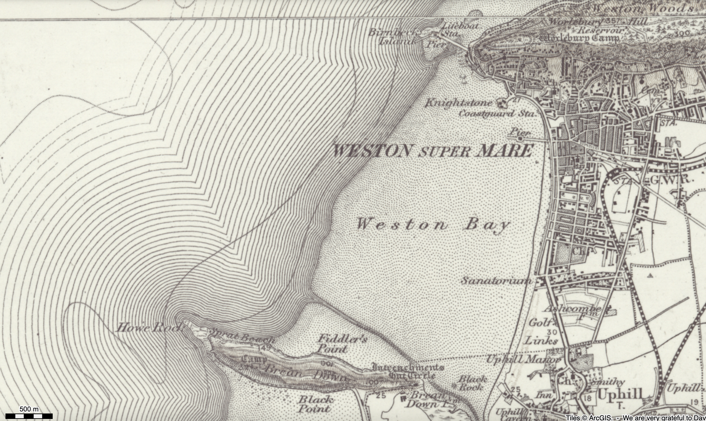

# Gunner Haines and the Brean Down Battery Explosion

I first came across this tale from a song by Gaz Brookfield — "The Tale of Gunner Haines" ([buy it on Bandcamp](https://gazbrookfieldmusic.bandcamp.com/track/the-tale-of-gunner-haines)) — and which he in turn found from an interpretation board on the down whilst out walking the dog one day.

The song provides a great summary of the story...

```{admonition} Gaz Brookfield, "The Tale of Gunner Haines"
:class: dropdown

On the western edge of the Mendip Hills  
There stands a lonely peak,  
Surrounded on three sides by sea  
A peninisular so bleak.  

Sixty feet above the waves,  
Brean Down Fort now stands  
In 1864 was built,  
To guard the western lands  

With seven guns, the fort was armed,  
Each weighing seven tonnes,  
Manned day and night, by fifty men,  
Fathers, brothers, sons.

For nearly forty years it stood,  
No shot in action fired,  
But in nineteen hundred, July the sixth,  
5 a.m., it was retired.

*The blast was heard for miles around,*  
*The flames lit up the sky,*  
*No decent explanation found,*  
*Or ever given why*

*Suicide or accident,*  
*It was tragic either way,*  
*The mystery of Brean Down Fort*  
*The tale..... of Gunner Haines.*

Now Gunner Haines was a normal lad,  
A soldier thirteen years,  
Described as conscientious, and  
Reliable, by his peers,

But he spent the night in Burnham,   
Maybe had a drink or two,  
But a flat tyre on his bike would mean  
He would miss the fort's curfew.

For this minor indiscretion,  
Haines was placed on charge,  
The punishment for lateness,  
Unlikely to be harsh

But its said this made him lose his mind,  
And want to lose his life,  
By blowing up the magazine,  
With the gunpowder inside.

*The blast was heard for miles around,*  
*The flames lit up the sky,*  
*No decent explanation found,*  
*Or ever given why.*

*Suicide or accident,*  
*It was tragic either way,*  
*The mystery of Brean Down Fort*  
*The tale..... of Gunner Haines.*

Well the magazine ignited,  
In a single burst of flames,  
The blame for which lay firmly  
At the feet of Gunner Haines.

The explosion's only victim,  
Will never get day in court,  
So we'll never know what happened,  
That night at Brean Down Fort.

*The blast was heard for miles around,*  
*The flames lit up the sky,*  
*No decent explanation found,*  
*Or ever given why*

*Suicide or accident,*  
*It was tragic either way,*  
*The mystery of Brean Down Fort*  
*The tale..... of Gunner Haines.*

```

```{youtube} DmaYI8d1_l8
```

*[My telling is still a WIP, though it will start "On the Western edge of the Medip Hills...", and I will then hear the song in my head throughout the telling.]*

```{admonition} A telling...
:class: dropdown

TO DO

```

## The Reported History

By tracing reports of the incident, and its immediate aftermath, through the newspaper reports of the time, we can get a sense of what stories were being told about it *at the time*; what was known, and what was being imagined; and what facts were being reported that might end up being misremembered, or forgotten, as the story made its way into local folklore, and legend...

The earliest reports describe an incident occurring at the fort at 5am, Wednesday, July 4th, 1900, that incurred a single death and several injuries, but few other details.

```{admonition} Disaster at Brean Down, *South Wales Echo*, July 4th, 1900
:class: dropdown
South Wales Echo - [Wednesday 04 July 1900](https://www.britishnewspaperarchive.co.uk/viewer/bl/0000902/19000704/044/0003)

Disaster at Brean Down.  
EXPLOSION OF A MAGAZINE.  
A Gunner Killed.  
OTHER MEN REPORTED INJURED.

This morning about 5 o'clock a loud explosion occurred at Brean Down fort. At a later hour medical assistance was requisitioned from Weston-super-Mare, and it was reported that the magazine had exploded, killing one gunner and injuring others. There are only five men regularly stationed at the fort, the sergeant being the only married one. The Down is not very accessible from Weston, but fuller particulars are expected shortly.
```

```{admonition} EXPLOSION AT BREAN DOWN, *Bath Chronicle and Weekly Gazette*, July 5th, 1900
:class: dropdown

Bath Chronicle and Weekly Gazette - [Thursday 05 July 1900](https://www.britishnewspaperarchive.co.uk/viewer/bl/0000221/19000705/059/0005)

EXPLOSION AT BREAN DOWN. A serious explosion occurred in the magazine on Wednesday at Brean Down Fort, south of Weston-super-Mare Bay. One man was killed, and three severely injured.

```

The first eyewitness reports from reporters described the scene of destruction, and identified the dead soldier as Gunner Haines, of Bridgwater. Partial remains of his body, identified from a ring he was wearing, were found in the explosion crater, his legs, and one of his arms being found some distance away from the rest of his body, and his head still undiscovered.

```{admonition} EXPLOSION AT BREAN DOWN, *Bristol Mercury*, July 5th, 1900
:class: dropdown
Bristol Mercury - [Thursday 05 July 1900](https://www.britishnewspaperarchive.co.uk/viewer/bl/0000035/19000705/043/0007)

EXPLOSION AT BREAN DOWN.  
A SOLDIER KILLED.  
THE FORT WRECKED.

Yesterday morning, about five o'clock, the magazine at Brean Down Fort exploded, with the result that one soldier was killed and another severely injured. The contents of the magazine was estimated to include no less than 5000lbs. of powder in case, and considering the terrific force of the explosion—the greater portion of the fort being wrecked—it is astonishing that the whole garrison, some 17 men, were not killed.

Our Weston-super-Mare representative visited Brean Down soon after the explosion, and found that that portion of the down adjacent to the fort was simply covered with wreckage, huge coping stones, weighing upwards of 1 cwt., being found quite 200 yards from the scene of the disaster, whilst at intervals were scattered iron girders twisted into every conceivable shape, and the débris of the zinc powder cases were freely scattered around. Upon approaching nearer the fort a faint idea of the damage could be gleaned, the first intimation being the fact that the wall separating the fort from the moat in the south-west corner was demolished, and upon a nearer approach it was seen that with the force of the explosion a large number of the windows were damaged. Upon ascending to the top of the hill the interior of the fort could to some extent be seen. Here an awful scene of wreckage met the eye, and the only thought that passed through the mind was as to how so very few were injured. Two of the 7-in. guns were dismantled and lay amidst heaps of debris, the working portions being twisted and broken about almost beyond recognitIon, whilst masses of concrete and ironwork were scattered in all directions. Fortunately the only fatality is that to Gunner Haines—whose wife lives of 236 *(sic)*, Bristol road, Bridgwater, and who has only been at the fort for the past week or so— although another gunner named Reed, who also has only been at the fort for a short time, received a dangerous wound, the artery in the left arm being cut by the falling debris. Other men were also more or less injured by a like cause, but their injuries are not such as to incapacitate them from duty. It seems that the deceased, accompanied by a comrade named Johnson, proceeded to Burnham on Monday evening for the purpose of fetching home bicycles they had previously left there. At 8 40 both left Burnham for the fort, but on the way Haines had the misfortune to puncture the tyre of his bicycle. Johnson, after a time, left him and reached camp at 10 40 some 40 minutes late, and at about midnight he let Haines, who was perfectly sober, into the fort. At about one o'clock Haines was seen in bed by one of his comrades and after this all seemed wrapped in mystery. At about five o'clock those in the fort and also those for miles around, were awakened by a tremendous explosion, the chaos being such that, to use the words of one of the men, "it appeared as if the end of the world had come." Upon investigation it was found that the magazine in the south-west portion of the fort had exploded, and further search revealed the fact that the deceased Haines was in the pit caused by the explosion. The deceased was quite unrecognisable, his head, legs, and one of his arms being entirely severed from the body and blown a considerable distance away; in fact, his head has not yet been found. His body, however, was identified by a ring he was wearing. The cause the explosion is at present more or less a mystery, but it is certain that Haines had no business where he was found. It Is stated that for some days past the deceased had been particularly quiet and morose.
```



*[OS one inch, 1885-1903](https://maps.nls.uk/geo/explore/print/#zoom=13.7&lat=51.34412&lon=-2.99743&layers=161&b=ESRIWorld&o=100); the fort is on the western most point of the Brean Down promontory. I also note the wonderfully named "Fiddler's Point: there is surely a story about that, too.*

The Bristol Times' report gives a sense of how awareness of the event spread across the bay to Weston-super-Mare.

```{admonition} MAGAZINE EXPLOSION AT BREAN DOWN, *Bristol Times and Mirror*, July 7th, 1900
:class: dropdown

Bristol Times and Mirror - [Saturday 07 July 1900](https://www.britishnewspaperarchive.co.uk/viewer/bl/0000984/19000707/216/0012)

MAGAZINE EXPLOSION AT BREAN DOWN.  
SOLDIER BLOWN TO ATOMS.  
GREATER PORTION OF FORT WRECKED

On Wednesday a profound sensation was created in Weston-super-Mare on its becoming known that the magazine at Brean Down Fort had exploded. Shortly after five o'clock, several townsfolk — principally resident on the beach— were awakened by a heavy report from the direction of the fort, but although the incident excited some curiosity, no suspicion was entertained of its possessing any sinister significance. Shortly after eight o'clock, however, the news arrived in town of a catastrophe, involving the destruction of a considerable portion of the fort and barracks, as well as the loss of one life, and severe injury in another instance. How the magazine was exploded appears to be a mystery, but rumour has not been slow to attribute the disaster to deliberate intent on the part of someone. That the list of injured should be limited to one killed and one injured appears to be little short of marvellous having regard to the terrible force of the explosion— for terrible it must indeed have been considering that the contents of the exploded magazine were estimated to include no less than 5,000lb. of powder in case. Had the whole garrison— which was temporarily augmented by the presence of a number of men intended to participate in heavy gun practice— been annihalated, once could not have been surprised.

Our Weston correspondent visited Brean Down during the morning, and found that that portion of the Down adjacent to the fort was simply covered with wreckage, ... `[continues as in *Bristol Mercury* of report of July 5th, 1900, above.]`

```

The *Western Daily Press* were keen for a full inquiry to be called and the findings reported:

```{admonition} "An occurrence that demands the most thorough investigation", *Western Daily Press*, July 5th, 1900
:class: dropdown
Western Daily Press - [Thursday 05 July 1900](https://www.britishnewspaperarchive.co.uk/viewer/bl/0000264/19000705/016/0005)

That the magazine at Brean Down fort should have suddenly exploded at an early hour yesterday morning is an occurrence that demands the most thorough investigation. The mystery may be merely personal, but even so it is as well that the public mind should be speedily as possible disabused of any germ of suspicion that might have found lodgment there. It is alleged that the deceased had no business to be in the magazine at all; and if this allegation be borne out by reference to the regulations it will be essential that some plausible reason should be advanced for his presence there. Moreover, the chain of circumstances leading up to the ignition of the ammunition will have to be made perfectly clear as a matter of public policy. In addition to the coroner's inquest, a Government inquiry will be held. The latter may probably be private, but through the medium of the coroner's court the public should be fully instructed in the details of the accident that is of interest far beyond the confines of Weston-super-Mare. 

```

The cause of the tragedy appears to have been the actions of Gunner Haines, who had spen the evening in Burnham. A quick look at a map suggests that it was a fare old trek.


*[OS one inch, 1885-1903](https://maps.nls.uk/geo/explore/print/#zoom=12.5&lat=51.28964&lon=-2.94475&layers=161&b=ESRIWorld&o=100)*

```{admonition} MAGAZINE EXPLOSION BREAN DOWN, *Western Daily Press*, July 5th, 1900
:class: dropdown

Western Daily Press - [Thursday 05 July 1900](https://www.britishnewspaperarchive.co.uk/viewer/bl/0000264/19000705/001/0003)

MAGAZINE EXPLOSION BREAN DOWN. ONE GUNNER KILLED, ANOTHER INJURED.

An inexplicable and serious explosion, which caused the death of a gunner and wrecked the fort, occurred at Brean Down at 5 a.m. yesterday. The officers in charge of the fort are naturally very reticent regarding the affair, but from inquiries on the spot it was ascertained that ordinarily there are four men on the Down in charge of Sergeant-Major Withers. A few days ago, however, the strength of the garrison was augmented by the arrival of about 14 men from the Flat and Steep Holmes for preliminary gun practice to fit them for their annual firing. Among these new arrivals were Gunner Haines — the soldier who was killed by the explosion — and Gunner Johnson, who left the Down on Tuesday soon after 5 o'clock and proceeded to Burnham to fetch their bicycles, which they left there on a previous visit. They left Burnham 8.30, but parted company on tho road in consequence of a mishap to Haines's machine, Johnson reaching the fort between 10 and 11. The deceased gunner reached his quarters close upon midnight, and both he and his comrade should have reported themselves by 10 p.m. Haines is said have been perfectly sober, and on his arrival at the fort went to bed and was seen by a comrade in the same room at 1 a.m. yesterday. Nothing unusual occarred until some four hours later, when the whole of those in the barracks were aroused by an alarming explosion, which shook the buildings. The report was heard at Cardiff, Weston, and Burnham. The whole of the garrison immediately turned out, and it was ascertained that the magazine in the south-west corner of the fort had exploded. The absence of Gunner Haines was also noticed, and a search being instituted his body was found in a pit, caused by the explosion, in the magazine. The wreckage caused by explosion was very considerable. Only one of the other men suffered any serious injury, and this was Gunner Reed, the artery of one of his arms being badly cut by some of the falling *débris*. The force of the explosion was visible some hundred yards before reaching the fort, huge stones, iron girders, and other wreckage being strewn about the Down. Inside the fort, however, the scene was remarkable. There are seven 7-inch guns in the fort, and the two in the south-west corner were thrown off their mountings, which were damaged beyond further service, and turned over. The barracks were much damaged, all the windows being broken and the roofs and walls shattered. Immediately after the explosion Sergt.-Major Withers proceeded to Weston, and notified Dr. Phelps of the affair. The doctor at once went to the Down, and the injured gunner was ordered to be brought to the Weston Hospital, where he was detained. The magazine was reported to have been duly locked and secured on Tuesday, and how the gunner who lost his life came to be where his body was found — or how he effected entrance into the magazine — are points that remain to be cleared up. The deceased was a soldier of some 13 years' service, and had a record for good service, albeit described as somewhat sullen. The magazine contained several thousand pounds of explosives. No civilian is allowed to inspect the fort, which was viewed at 12 o'clock yesterday morning Captain Wilkins. R.A., Lieut. Beardsley, R.A., and Captain Paske, R.E., who came across by steam lannch from Cardiff. Gunner Haines was a married man, and his widow resides at 136 *(sic)*, Bristol Road, Bridgwater.

```

To investigate the explosion, a court of inquiry was assembled that include representatives of the Royal Field Artillery (R.F.A.), ROyal Garrison Artillery (R.G.A) Royal Engineers (R.E.).

```{admonition} THE DOWN EXPLOSION, *Western Daily Press*, July 6th, 1900
:class: dropdown

Western Daily Press - [Friday 06 July 1900](https://www.britishnewspaperarchive.co.uk/viewer/bl/0000264/19000706/021/0005)

THE DOWN EXPLOSION. Our Plymouth correspondent telegraphs:— In reference serious explosion at Brean Down, attended with fatal results. Lieut.-General Sir W. Butler, K.C.B., commanding the western district, has ordered court of inquiry to assemble at Brean Down to-day, at noon. The explosion took place at No. 3 cartridge score. Major A. W. B. Gordon, R.F.A, Bristol, will be president, and the other members of the court will be Captain G. P. Paske, R.E., Cardiff, and Captain P. G. Wilkins, R.G.A. The minutes of the court are to be sent to Colonel Walford, commanding Royal Artillery, western district, at Devonport.

```

The inquest was held a couple of days after the explosion, on Friday, July 7th, 1900, at the Wellington Hotel in Berrow *(the specific locastion is confirmed by another report)*.

The report in the *Western Daily Press* focussed on the testimony of the witnesses at the fort and the questions asked of them by members of the jury.


```{admonition} THE MAGAZINE EXPLOSION BREAN DOWN — INQUEST, *Western Daily Press*, July 7th, 1900
:class: dropdown

Western Daily Press - [Saturday 07 July 1900](https://www.britishnewspaperarchive.co.uk/viewer/bl/0000264/19000707/032/0007)

THE MAGAZINE EXPLOSION BREAN DOWN.

INQUEST.

Dr. Craddock held an inquest at Berrow Hotel, yesterday, on Gunner Haines, who was killed in the explosion of a magazine at Brean Down fort on Wednesday.

Sergt. Bartlett, having stated that the deceased was 31 years of age, the following evidence taken:—

Sergt. James Withers said: I am a Sergeant in the Royal Artillery and stationed at Brean Down fort. William Haines was a gunner. I last saw him alive at 5 p.m. om the 3rd. inst. He was then in company with Gunner Johnstone going for a walk. He was perfectly sober at that time. On the following morning, about ten minutes to five o'clock, I heard a violent explosion. We went out to see what had happened and found that No. 3 cartridge store had exploded. We at once called the roll and found the deceased absent. The Master-Gunner called the roll. We inspected the store in company with Master-Gunner Brett, and there found the remains of a human being. The remains were in the centre of the floor of the cartridge store. The door of the magazine was locked at two pm., when witness was there. When witness next saw the door it was blown to pieces. There were nine or ten steps to get to the door. The only means of identification were by a ring which the deceased wore. A carbine was foond by Gunner Gibbs in the magazine yesterday morning. The Coroner: What means are adopted to prevent anyone getting into the store?—Witness: I don't see how anyone could get in. It is 10 or 12 feet underground, and is approached by two flights of steps. Between the two sets of steps there is the entrance door. The door is secured by brass lock. I have charge of the store, and it was reported to me as being locked at 2 p.m. on the 3rd inst. by Gunner Unsted, who is responsible for locking it. The magazine is opened daily, weather permitting, from 9 a.m. to 2 p.m. Gunner Kehoe reported to the Master Gunner that his carbine was missing. I have since the remains of the carbine, it was bent, and the woodwork was gone, but the number was still to be seen. The Coroner: Hava you any duplicate keys to the magazine?— Witness: Yes, one to each door. The keys are kept in the office. Q.: Do you know if Gunner Unsted brought the key into the office? —A.: Yes, he handed it to me at two o'clock on the 3rd inst. Q.: How long had deceased been at Brean Down?—A.: He came there a week ago from Steep Holm. Q.- Has he been steady?—A.: Yes. Did he drink? —A: He had not drunk much, and the men told me he did not have much whilst on the Holmes. A Juror: Had he been stationed at the Down previously A.: Yes, about 12 months ago. Deceased should have returned to the fort at 10 p.m., on the 3rd inst., but he did not return until some hours later. A man staying out late without permission is put under arrest.

Gunner George Johnstone stated: I am a gunner in the Royal Artillery stationed at Brean Down. On the evening of the 3rd., about five o'clock, I went out with the deceased. We walked to the Commercial Hotel at Burnham. We did not return together. We left Burnham at twenty minutes to nine o'clock on bicycles. Gunner Haines's machine broke down about halfway between here and Burnham. I came to this house `[TH: i.e. the house in which the inquest was being held, which is to say, the Wellington Hotel, Berrow]` and had a glass of ale, and left here at nine o'clock and proceeded to Brean, and I arrived at the fort at 10.40. The deceased did not arrive with me. He reached the fort an hour and a half afterwards. He had to walk. I let him in. He was apparently sober. We had three glasses of ale each whilst in Burnham. I was stationed with deceased five weeks on the Steep Holm. A day or two before deceased's death I noticed a change in his manner. He became very quiet, but he did not complain of being ill. When deceased went to Burnham he was in his usual state. To knowledge deceased had not been drinking hard lately, and I have not heard from anyone that he had. When deceased came home on Tuesday night he told me he had brought his bicycle and asked what time I arrived. Deceased seemed quite right then. I have seen the deceased's remains since the explosion. I identified deceased by a ring on the right hand. I also identified him by a truss he has always worn. On Wednesday morning, after the explosion, I saw all the deceased's clothing by his bedside, even his shirt.

A Juryman: Did you ever hear the deceased make use of any threat that he would do anything of this kind ?—No.

Do know if had any disturbance with anybody?—No.

John Prowse Shillabeer said: I am a bombardier at Brean Down. I remember the deceased going to bed at 12.45 on the morning of the explosion. I spoke to the deceased and asked him what time it was. He said he did not know exactly. I wished deceased "Good night," and went to bed. We slept opposite other. I heard the explosion, which woke me up. It must have been ten minutes to five o'clock. I noticed that the deceased was not then in his bed, and I also noticed that his clothes were in the room. I have only known deceased about a week, whilst at Brean. I have not during that time noticad anything strange about him.

The Coroner: During the week he was at Brean was there anything about him to lead you to suppose that he was not quite right in his head?— Not the slightest.

A Juror: Was the carbine taken from your room?—Yes.

William Charles Kehoe said: I am a gunner at Brean. Since the explosion—an hour afterwards— I missed my rifle. I identify the stock produced as belonging to my carbine. The number is attached to the stock.

A Juror: Was the rifle loaded when you left it? No, we have no ammunition in our possession.

Another Juror: Your rifle was more easy for him to get at? Yes, it was near the door.

A Juror: Could the deceased get a cartridge?—I can't say.

Master Gunner Brett produced the barrel of the gun, which was very much bent, and stated that it showed that the gun had been fired.

Gunner Frederick Gibbs proved finding the barrel produced on Thursday morning about six feet from where the deceased's remains were discovered. The barrel was farther outside the magazine than the body. Witness added had known deceased since October, 1896, and the man, so far as he had known him, had always been quiet.

John Brett was next called. He said— I am master gunner, stationed temporarily at Brean Down. I am head of the establishment whilst there. have known the deceased almost three years. I have not noticed anything strange about him except that he had a violent temper. Deceased was on parade with me the day before the occurrence, and I didn't notice anything particular about him.

The Coroner—Can you account for his getting into this magazine store?—I can't; he had no business there whatever.

The Coroner— There is one point I want to ask yon. Can you account for a man being able to get hold of a ball cartridge? He could not in the fort of Brean Down. No man at the fort is served out with ammunition. It is all kept in the fort box, which is locked.

By a Juror: There was no loose powder in the magazine.

Sergeant Withers, recalled, stated that the ball cartridges were kept in the fort box in the office, and they were intact after the explosion. No ball cartridges had been served out. The witness stated that he could not tell whether the rifle was discharged unless the breech were opened.

A suggestion was adopted that the breach should be opened, and Sergeant Withers proceeded to a blacksmiths for purpose of doing so. On returning he produced a discharged cartridge, which was found in the breech, which satisfied him that the rifle had been fired.

The Coroner: Would it be possible for a person to fire down the ventilator and explode the magazine?— Weil, not unless the bullet struck the cylinders. There were no cylinders immediately underneath the ventilators. I examined deceased's clothing in company with P.S. Bartlett. All his clothes were in the room, so that deceased must have gone to the magazine in a naked state.

The jury returned the following verdict:— "Killed by No. 3 magazine Brean Down exploding, which explosion was caused by deceased firing a carbine loaded with ball cartridge down the shaft of the ventilator to the magazine whilst in a state of temporary insanity."

```

The report in the *South Wales Echo* was considerably more succint.

```{admonition} BREAN DOWN EXPLOSION — INQUEST AND VERDICT, *South Wales Echo*, July 7th, 1900
:class: dropdown
South Wales Echo - [Saturday 07 July 1900](https://www.britishnewspaperarchive.co.uk/viewer/bl/0000902/19000707/075/0004)

BREAN DOWN EXPLOSION.  
INQUEST AND VERDICT.  
Deceased Gunner Declared Insane.

The inquest on Haines, the gunner killed on Wednesday in the explosion at Brean Down, was held yesterday afternoon at Barrow before Dr. Craddock. One juryman insisted on viewing the fort, but the others objected. After the juryman had started to walk to the down—six miles distant—the other jurymen followed in a brake, and after riding several miles met the first juryman coming back. He told them that he had seen Captain Wilkins, who said a Government inquiry was being held, and the jury would put the officials to great inconvenience if they insisted on going over the fort. The jnry accordingly retired, and the Coroner said he hoped the persistent juryman was satisfied.

Sergeant Withers, stationed at the down, said that Haines's body was found in the centre of the cartridge store. The magazine door was locked at 2 on the previous afternoon, and after the explosion the keys were still hanging in the office. A carbine belonging to another gunner was found in the magazine. The carbine was bent and the woodwork gone, but the number was still visible. Duplicate keys of the magazine were kept in his office. Deceased was steady, and had been to the down previously. For staying out late men were put under arrest, and deceased would have been reported next morning. Witness could not say how deceased's body got inside the store. Witness added that his office could have been entered by a window and the keys could have been taken and returned.

Other witnesses showed that the explosion could only have been caused from outside by firing a shot down the ventilator, and if deceased had been in the magazine at the time of the explosion no remains of him would have been found. The jury returned a verdict "That the explosion was caused by deceased firing a carbine down the ventilator, and that at the time he was temporarily insane."

```

In the *Weston-super-Mare Gazette, and General Advertiser*, we learn that a photographer attempting to capture the scene was ordered off the site "under penalty of losing his camera". The report also reveals that the undertaker from Burnham who took care of Gunner Haines' remains had spoken to him on the night of Wednesday, July 4th, as well as that Gunner Haines had been an occasional visitor at least to the Wellington Hotel in Berrow.

```{admonition} A CURIOUS COINCIDENCE, *Weston-super-Mare Gazette, and General Advertiser*, July 7th, 1900
:class: dropdown

Weston-super-Mare Gazette, and General Advertiser - [Saturday 07 July 1900](https://www.britishnewspaperarchive.co.uk/viewer/bl/0001444/19000707/124/0008)

MAGAZINE EXPLOSION AT BREAN DOWN.

FORT WRECKED.

ONE GUNNER KILLED, ANOTHER INJURED.

An inexplicable and serious explosion, which caused the death of a gunner and wrecked the fort, occurred at Brean Down at 5 a.m. on Wednesday. The origin of the explosion is at present shrouded in mystery, and probably the only individual who could have afforded information on the subject has lost his life, so that it can only be surmised. The officers in charge of the fort are naturally very reticent regarding the affair, but from enquiries on the spot our reporter learned that ordinarily there are four men on the Down in charge of Sergt.-Major Withers. A few days ago, however, the strength of the garrison was augmented by the arrival of about 14 men from the Flat and Steep Holmes for preliminary gun practice to fit them for their annual firing. Among these new arrivals were Gunner Haines—the soldier who was killed by the explosion—and Gunner Johnson, who left the Down on Tuesday soon after 5 o'clock and proceeded to Burnham to fetch their bicycles, which they had left there on a previous visit. They left Burnham at 8.30, but parted company on the road in consequence of a mishap to Haines' machine, Johnson reaching the fort between 10 and 11. The deceased gunner reached his quarters close upon midnight, and both he and his comrade should have reported themselves by 10 p.m. Haines is said to have been perfectly sober, and on his arrival at the fort he went to bed and was seen by a comrade in the same room at 1 a.m. on Wednesday morning. Nothing unusual occurred until some four hours later, when the whole of those in the barracks were aroused by an alarming explosion, which shook the buildings. The report, we may add, was heard at Cardiff, Weston, and Burnham. The whole of the garrison immediately turned out, and it was speedily ascertained that the magazine in the south-west corner of the fort had exploded. The absence of Gunner Haines was also noticed, and on a search being instituted his body was found in a pit caused by the explosion, in the magazine. The body was minus the head, legs and one arm and was in a state of nudity. The sight was a ghastly one in the extreme, the headless trunk being terribly mutilated—the only means of recognising the deceased being by a ring which he wore on one of his fingers. The wreckage caused by the explosion was very considerable, and the marvel is that the loss of life was not appalling, as the garrison were sleeping in close proximity to the magazine which exploded. Providentially, however, beyond the fatality recorded only one of the men suffered any serious injury, and this was Gunner Reed, the artery of one of his arms being badly cut by some of the falling debris. The force of the explosion was visible some hundred yards before reaching the fort, huge stones, iron girders, and other wreckage being strewn about the Down. Inside the fort, however, the scene was remarkable. There are seven 7-inch guns in the fort, and the two in the south-west corner were thrown off their mountings, which were damaged beyond further service—and turned over. The barracks were much damaged, all the windows being broken, and the roofs and walls shattered. Immediately after the explosion Sergt. Withers proceeded to Weston and notified Dr. Phelps of the affair. The doctor at once went to the Down and the injured gunner was ordered to be brought to the Weston Hospital, where he was detained. As we have said, the origin of the explosion is a matter of conjecture. The magazine is reported to have been duly locked and secured on Tuesday, and how the gunner who lost his life came to be where his body was found — or how he effected an entrance into the magazine— are points that remain to be cleared up. The idea that is most favoured, however, is that deceased went to the magazine, and by some means caused the explosion—possibly by attempting his own life. He was a soldier of some thirteen years' service, and had a record for good conduct, albeit described as somewhat sullen. The magazine contained several thousand pounds of explosives, and the garrison marvel at their escape from injury. No civilian is allowed to inspect the fort, which was viewed at noon on Wednesday by Captain Wilkins, R.A., Lieut Beardsley, R.A., and Captain Peake, R.E., who came across by steam launch from Cardiff. A photographer who desired to take views of the ruins, was peremptorily ordered off, under penalty of losing his camera, and every precaution is taken to prevent any particulars of the explosion leaking out. Sergt. Kellaway and P.C. Doble of Weston, and Sergt. Bartlett, of Burnham, visited the fort and arrangements were made for the removal of the deceased gunner's remains to Berrow, to await the inquest.

Gunner Haines is a married man and his wife resides at 136, Bristol-road, Bridgwater.

Gunner Reed remains an inmate of the hospital but is making favourable progress considering the quantity of blood he lost.

A CURIOUS COINCIDENCE

It is somewhat of a conincidence that deceased was introduced to the Burnham tradesman, who acted as undertaker, only the night preceding the fatality. The two conversed together for several minutes and the undertaker formed the opinion that deceased was a smart and genial soldier — in fact, "one of the nicest fellow's he had met". The landlord of the Wellington Hotel — which the deceased sometimes visited— also confirmed this impression.

```

The most complete report of the whole affair appears in the *Weston Mercury* of Satruday, July 7th, 1900. It begins with a report of the incident:

```{admonition} Report of the incident, July 1900
:class: dropdown
Weston Mercury - [Saturday 07 July 1900](https://www.britishnewspaperarchive.co.uk/viewer/bl/0001334/19000707/098/0005)

MAGAZINE EXPLOSION AT BREAN DOWN

SOLDIER BLOWN TO ATOMS

ANOTHER SEVERELY WOUNDED  
GREATER PORTION OF THE FORT WRECKED
TWO GUNS DISMANTLED  

Never has this district been the centre of a more appalling catastrophe than that which occurred in the early hours of Wednesday morning, when a terrific explosion of the powder magazine situated at Brean Down Fort took place. To say that the announcement of the affair occasioned great excitement throughout the district is to convey but a feeble impression of the state of the public mind, but this excitement was doubly intensifed when, ia a special edition of the *Western Mercury*—published during the afternoon—sensational circumstances were reported, throwing light upon the possible cause of the catastrophe. A singular feature of the occurrence is that comparatively little was heard in Weston of the explosion, which—considering its magnitude—must have been of a most deafening character: in fact, the report appears to have been heard more distinctly at Burnham and Cardiff than in this town. Very few people, save those resident on the Beach, were awakened, and these, shortly before 5 a.m., heard a heavy rumbling report apparently proceeding from the direction of the fort, but although the incident excited some curiosity, no suspicion was entertained of its possessing any sinister significance. Shortly after eight o'clock, however, the news arrived in town of a momentous catastrophe, involving the destruction of a considerable portion of the fort and barracks as well as the loss of one life, and severe injury in another instance. How the magazine was exploded appears to be a mystery, but rumour was not slow to attribute the disaster to deliberate intent on the part of some person—in in fact, circumstances, so far as they could be ascertained, certainly favoured such an assumption. That the list of casualties should be limited to one killed and one injured appears to be little short of of marvellous having regards to the terrible force of the explosion— for terrible it must indeed have been considering that the comtents of the exploded magazine were estimated to include no less than 5,000lbs. of powder in case. Ha the whole garrison — which was temporarily considerably augmented by the presence of a number of men intended to participate in heavy gun practice—been annihilated, one could not have been surprised. It appears that immediately after the explosion Sergt.-Major Withers, who is in charge of the garrison, attempted to telephone from the Fort to Weston-super-Mare for assistance, but the force of the explosion had destroyed the communication with the result that a messenger had to be despatched per cycle *via* Berrow, Brent Knoll, and Bleadon, in order to communicate with the Governmental officer (Surgeon-Col. Phelps, of Weston-super-Mare) and the local Police. Surgeon-Co. Phelps at once proceeded to the scene, whilst P.S. Kelloway and P.C. Doble also proceeded to the Fort and conducted the removal of the remains of the deceased gunner. Dunring Wednesday morning, a *Mercury* representative visited Brean Down, and found that that portion of the Down adjacent to the fort was simply covered with wreckage, huge coping stones, weighing upwards of 2cwt., being found quite 200 yds. from the scene of the disaster: whilst at intervals were scattered iron girders at twisted into every conceivable shape, and the *débris* of the zinc powder cases were freely scattered around. Upon approaching nearer the fort a faint idea of the damage could be gleaned, the first indication being the fact that the wall separating the fort form the moat in the south-west corner was found to have been demolished, and upon a nearer approach it was seen that with the force of the explosion a consideration *(sic)* portion of the barracks had been destroyed. Upom ascending to the top of the hill the interior of the fort could, to some extent, be seen. Here an awful scene of wreckage met the eye, and the only thought that passed through the mind was as to how so very few were injured. Two of the 7-inch guns were dismantled and lay amidst heaps of debris,the working portions being twisted and broken about almost beyond recognition, whilst masses of concrete and ironwork were scattered in all directions. Our representative endeavoured to obtain admittance to the fort, but this was refused by the sergeant-in-charge, and later in the day the request was repeated to the officers who visited the scene of destruction, viz. Captain Beardsley, R.A., who was in command of this portion of the channel defences; Capt. Wilkin, R.A., and Capt. Paske, R.E., but although these gentlemen were inclined to give any particulars, they stated they could not grant permission for the press to inspect the interior of the fort. As far as could be gathered, fortunately the only fatality was that to Gunner Haines— whose wife lives at 236, Bristol-road, Bridgwater, and who has only been at the fort for the past week or so—although another gunner named Reed, who also has only been at the fort for a short time, received a dangerous wound, the artery in the left arm being cut the falling *debris*. Other men were also more of less injured by a like cause, but we are pleased to state that their injuries were not such as to incapacitate them from duty. It seems that the deceased, accompanied by a comrade named Johnson, proceeded to Burnham over-night for the purpose of fetching home bicycles they had previously left there. At 8.40 both left Burnham for the fort, but on the way Haines had the misfortune to puncture the tyre of his bicycle. Johnson, after a time, left him and reached camp at 10.40—some forty minutes late—and at about midniught he let Haines, who was perfectly sober, into the fort. At about one o'clock Haines was seen in bed by one of his comrades and after this all seems wrapped in mystery. At about five o'clock those in the fort and also those for miles around, were awakened by a tremendous explosion, the uproar being such that to use the words one of the men, "it as if the end of the world had come." Upon investigation it was found that the magazine in the south-west portion of the fort had exploded, and further search revealed the fact that the deceased, Haines, was in the pit caused by the explosion. The deceased was quite unrecognisable, his head, legs, and one of his arms being entirely severed from the body and blown a considerable distance away—in fact, his head has not yet been found. His body, which was entirely nude, however, was identified by a ring he was wearing. The cause of the explosion is at present more or less a mystery, but it is certain that Haines had no business where his body was found: how he obtained ingress to the magazine—which is reported to have been duly locked on the previous night—cannot be conjectured. It is started that for some days' previous the deceased had been particularly quiet and morose, and the idea is entertained that he was responsble for creating the explosion, probably with suicidal motive.
```

The *Weston Mercury* then provided some further detail, as well as several interviews:

```{admonition} Particulars and interviews, July 1900
:class: dropdown
Weston Mercury - [Saturday 07 July 1900](https://www.britishnewspaperarchive.co.uk/viewer/bl/0001334/19000707/098/0005)

LATER PARTICULARS.

We have subsequently had the opportunity of interviewing a townsman who succeeded in gaining ingress to Fort shortly after the explosion and prior to admission being refused civilians by the military authorities: whilst he also saw the the mutilated remains of Gunner Haines. THe bodym he states, formed a most ghastly spectacle: in fact, practically only the mutilated trunk remains. The head and shoulders are blow completely away, and below the thighs little or nothing remains of the legs but strips of skin, whilst the flesh is blackened and charred by the explosion in a most sickening manner. The theory that the deceased exploded the magazine with premeditated intent is strengthened by the fact that his uniform and general apparel were found carefully laid out on the floor around his bed, and not in such order as might reasonably have disposed of them on retiring to rest. He is also of opinion that the injury received by Gunner Head must have been of a particulalry serious character, seeing that quantities of blood were observable at the spot where he was lying. Of the havoc wrought in the Fort he gives a graphic description, the chief features of which however, are produced in the report which we publish above; whilst in addition, as instancing the narrow escape which the remmainder of the garrison experienced, he mentions that a mass of stone apparently weighing nearly two hundredweight was precipitated within a yard of the window of the main sleeping apartment.
 
WHAT AN URBAN DISTRICT COUNCIL EMPLOYEE SAW.
 
Mr H. Lewis, of New-street, a sweeper, in the employ of the Urban District Council, informed our representative that whilst engaged in his work on Beach-road, shortly before five o'clock on Wednesday morning, he heard a terrible explosion in the direction of Brean Down Fort, and noticed a mighty column of smoke shoot high into the air, afterwards to be driven by the breeze back across the Down. Although, in his own words, "the report was a terrible one," Lewis states he had not the faintest idea it betokened the explosion of the magazine, his impres-sion then being that for some reason or another the guns of the fort had been fired in salute. 

INTERVIEW WITH INJURED GUNNER.

On Thursday evening our reporter, by the courtesy ot the House Surgeon (Dr. Marmaduke Alford), was given an opportunity to visit the injured gunner, Reed, who is lying in one of the wards at the local Hospital, and obtain a five mioutes' conversation with him as to his experiences in connection with the terrible catastrophe. Gunner Reed—who is a burly Irishman of presumably middle age— although naturally weak through sustaining the loss of a considerable quantity of blood, appeared in good spiritis and not at all disinclined to converse upon the subject of the explosion. In reply to questions, he said: "I went to bed with my comrades at the barracks at the usual hour and slept soundly until 5 o'clock the next morning, when I heard a terrible rumbling report, accompanied by a shock, and at the same moment the room was filled with flying glass from the windows, and general rubbish. I was sleeping next to the window, and felt something 'sting' my arm. For a few seconds we were so dazed with the shock that we could not form the slightest idea as to what had happened, and on opening the door we saw that everything was in confusion — a great cloud of heavy smoke and dust hung over us, and in all directions there was such disorder as I can't describe, rocks and girders lying about on every hand. I had hardly got two steps beyond the doorway when I felt something warm and wet running down me, and I then found that a big stream blood was pouring from my arm — in fact, I was so badly hurt that I could not go any farther, and in a short time some of my comrades came to me, rendered "First Aid," and did their best to stop the flow of blood." Proceeding, Gunner Reed said: "There were pretty well three tons of powder in the magazine which blew up and as there was almost as much in each of the three other magazines— the nearest being only a few yards from the one which exploded—we we went back some distance along the Down as we thought there was a possibility of some of the others exploding and we did not return until some time later." Our representative next questioned Gunner Reed as to hiow he accounted for his ill-fated comrade Haines, having proceeded to the magazine and as to how he obtained ingress to the same, but upon this point he not unnaturally hesitated to give an opinion, for the subject will not be threshed out until the Governmental investigation has been initiated. He added however that he had not seen Haines after 5 o'clock on Wednesday evening, he being asleep when Haines returned from Berrow. He had, he said, always looked on him as a steady and respectable man. Gunner Reed —who, by the way, had been connected with the Brean Down Garrison or with the forts on the Holmes—concluded his narration with the following acknowledgement of the providential escape which he and his comrades experienced. "The rest of us out there had a marvellous escape: the wonder of it is that we were not all blown into Eternity"— a sentiment with which all our readers will agree.

When admitted to the Hospital on Wednesday, Reed was in a very collapsed condition owing to the enormous quantity of blood which he had lost. The House Surgeon (Dr. H. T. M. Alford) applied anaesthetics, and Dr. Crouch (hon. surgeon) performed an operation, an incision being made from the wrist and the two severed arteries were then tied. His progress is regarded as satisfactory, and the hopes of his recovery are most favourable. 

SURGEON-COL PHELPS INTERVIEWED

On Wednesday afternoon, a *Mercury* representative succeeded in obtaining an interview with Surgeon-Col. Phelps, the Government Medical Officer, of Beach-house, Knightstone-road, such interview, however, being necessarily of a brief character on account of the gentleman named being engaged in formulating his report of the occurrence for dispatch to the War Office. As a Government official, however, he naturally declined to make any statement, or hazard the slightest suggestion, as to the cause of the catastrophe—to quote his own words, the probable cause of the affair was veiled in mystery, and until the official investigation was held not the slightest light could be thrown upon it. He stated that at 8a.m., he received a summons to proceed to the fort at Brean Down, and thereupon proceeded in all haste to the *locus in quo*, to find that one man was dead, having been blown to atoms by the explosion, whilst the second was severely injured. The latter case he took charge of, and eveutaally conveyed the patient to Weston-super-Mare by boat, the man being then sent to the Hospital, where he at present lies. As to the effects of the explosion upon the fort, Surgeon-Col. Phelps was also reticent, but our representative inferred that a very considerable portion of the fort and barrracks was wrecked by the terrible concussion, whilst some of the guns are dismantled. How the remaining members of the garrison escaped destruction, Surgeon-Colonel Phelps added, was little short of marvellous. As to the quantity of ammunition, heavy and light, stored in the magazine he could say nothing. Our representative mentioned the rumour prevailing in the town to the effect that, but for the explosopn, it had been the intention for the garrison to carry out heavy gun practice during the day, but Surgeon-Col. Phelps replied that such practice had been fixed for later in the month.

```

Finally, the *Weston Mercury* notes the membership of the official enquiry board, and provides a detailed review of the inquest, including the rather recalcitrant demands of one of the jurors who had a particular desire to see the scene of the accident.

```{admonition} The Enquiry, and the Inquest, July, 1900
:class: dropdown
Weston Mercury - [Saturday 07 July 1900](https://www.britishnewspaperarchive.co.uk/viewer/bl/0001334/19000707/098/0005)

OFFICIAL ENQUIRY

A Plymouth correspondent telegraphs: In reference to the serious explosion at Brean Down, attended with fatal results, Lieut.-General Sir W. Butler K.C.B., commanding the western district, has ordered a court of inquiry to assemble at Brean Down on Friday. The explosion took place at No. 3 cartridge store. Major A. W. B Gordon, R.F.A., Bristol, will be present, and the other members of the court will be Captain G. P. Paske, R.E., Cardiff, and Captain P G. Wilkins, R.G.A. The minutes of the court are to be sent to Colonel Walford, commanding the Royal Artillery, western district, at Devonport.

THE INQUEST

A RECALCITRANT JURYMAN

Tue Inquest was held yesterday (Friday), before Dr.Craddock, coroner, at the Wellington Hotel, Berrow. The jury comprised Messrs J Churchill, J. A. Dare, G. H. Pruen, F. Hardwick, F. Roberts, W. F. Hawkings, A. Richards, W. G. Short, W J.Coome, F. Bacon, J Willing and L. Marsh. Mr W. F. Hawkinogs was elected foreman of the jury.

The jury then proceeded to view the body, which presented such a shocking spectacle that we prefer to give no details upon the beyond the statement that the remains were scarcely recognisable as a corpse.— The Coroner said he had it suggested that certain of the jury wished to examine the locality of the explosion. Mr J. A. Dare: That is my opinion. —The Coroeer, you must decide that for yourself. I can neither order nor refuse in regard to the matter.— Mr hawkings: As foreman, can I take the vote of the jury? —The Coroner: Yes —Mr Dare: How will the jury be sent down ?—The Coroner: That is a discretionary matter with me afterwards.— A vote of the jury was then taken, whereupon only two voted in support of the visit being paid, 10 voting against. —Mr. Dare: I am on the jury, and I shan't give my verdict without visiting the fort. —The Coroner: As you please.—Mr. Dare: I am going.—The Coroner: Go if you like: I shall limit you as to time. —Mr Dare: Can you give me a permit to enter the fort? —The Coroner: The Master Gunner may—Mr. Dare: I shall go! —The Coroner: For goodness sake, my man, go then!—After Dare's departure the Coroner remarked: This is like the story of the juryman who complained to the judge, "The rest of the jury canlt agree with me—I never saw eleven such stubborn men in my life! (laughter). Subsequently Dr. Craddock remarked: Let Dare go on.— I will arrange for the jury to visit the spot in a brake: it is just as well for him to have a little trouble.

After some discussion, the jury eventually decided to visit the Fort, with the result that an expedition was thereupon commenced to the Down. After some two miles had been traversed, however, a vehicle was met proceeding from the direction of Brean Down and containing an Artillery officer and the recalcitrant juryman Dare. The offcier explained that the Governmental Committee of investigation were simultaneously conducting their deliberations at the Fort, and would be glad if the Coroner's witnesses could speedily be relieved in order to attend there. He expressed a strong hope that the jurors would not persist in wasting two hours of valuable time by visiting the fort—as there would be nothing of importance for them to inspect there—and in the end his wishes were respected, the jury and coroner thereupon abandoing the visit to the fort, and on returning to the Wellington Hotel where the proceedings were contiunued, the Coroner remarked that Dare had completely fooled the jury. He also sarcastically expressed the hope that Dare's wishes had been gratified, and that he had obtained valuable information.

Segt. James Withers, R.A., said: I am stationed at Brean Down Fort where the deceased was a gunner. I last saw him alive at 5 p.m. on Tuesday evening: he was then in company with Gunner Johnson going for a walk. He was then perfectly sober. On the following morning about 10 minutes to 5 o'clock I heard a violent explosion: I and the men went out to see what had occurred and found that No.3 cartridge store had exploded. We called the roll and found Gunner Haines was missing, and on making an inspection we found the remains of a human being. It seemed to be lying on the floor of the cartridge store. [A diagram was here produced and explained to the Coroner]. The door of the store was locked on the previous evening. The body was lying on the centre of the floor of the cartridge store. A carbine was found on the floor on Thursday maorning. The Coroner: What means were adopted to prevent a man getting into the store? Withers: A man could not get in. The store was approached by two flights of steps and the doorway was in the entrance. I have charge of the store, it was reported to be locked at 2 o'clock p.m. on the 3rd inst., and the keys were brought to me by Gunner Unsteed, who was responsible for the locking of it. The store, weather permitting, was usually opened from 9 a.m. until 2 p.m. for the purpose of ventilating the ammunition, After the explosion, Gunner Keboe reported to me that his carbine was missing. 1 have since seen the remains of the carbine; Keboe's number was upon it. It was bent about a good deal, and the wood-work portion was missing. There are duplicate keys to the store—one to each door—and théy are kept in the office. The deceased came to Brean Down from Steep Holmes a week today. He has been steady whilst at Brean Down: he drank a little, but I have not seen him the worse for drink. On Tuesday night, deceased should have been in at 10 p.m. but did not arrive, and this was reported to the Master Gunner. If a man stops out beyond the allotted time, withiout permission, he is put under arrest. Haines was absent without permission. The report would not be made until the following morning.—A Juror: Was the body found inside the magazine? Witness: He was found in the pit caused by the explosion, just where the floor of the magazine would have been.—Q: Was the rifle inside? A: It was found 2 or 3 yards from the body.—Q: were the duplicate keys intact? A: Yes —Q: Then how did he get in? A: I can't say. —Q: Would it be possible to fire from the outside into the store and explode the contents? A: It would if it struck any of the cartridges. —Q; Was the door opposite any of the cartridges? A: No —Q: Could he fire through any of the ventilators? A: I cannot say— there is one at the top and one or two at the side. —The Coroner: Of course if he fired from the outside he could not get inside after the explosion? Witness replied that if the man had got inside in his opinion the remains would never have been found after the explosoin.—Q: Where were the keys? A: Over the fireplace in the barracks. —Q: Could anyone reach them? A: Yes, if they got through the window.—Q:Is there a sentry on duty at night? A: No.

Gunner George Johnson, R.A., said: On the evening of the 3rd I went out with Haines about 5 o'clock, and we walked to the Commercial Hotel, Burnham. We started from Burnham at 20 minutes to 9, both being on bicycles. Haines' machine broke down with a puncture after we had got about a mile on the journey. I came on to this house (the Wellington Arms) had a glass of beer, left at nine o'clock, and arrived at Brean Down Fort at 10.40. Apparently deceased had to walk his machine back. Shortly before midnight he arrived at the fort and I let him in. He was apparently sober. We had three glasses of ale each at Burnham — nothing more. I was stationed with deceased for five weeks on the Holmes. I did not notice anything strange in him then, but for four or five days before the explosion I noticed a change in him—he appeared to be very quiet. He did not complain of being ill. To my knowledge he had not been drinking hard of late: he had only been at the fort very recently. When I let him in to the fort he said he had had to walk his bicycle back, and asked me what time I had arrived at the fort. I have seen his remains since the explosion—I identified him by a ring on the third finger of the right hand, and also by a truss which he wore. I afterwards saw all his clothing by his bedside.±A Juror: Have you ever known him to threaten himself? —A: No. Q: Had he had any disturbance with anyone to your knowledge? —A: No.

Bombardier John Prouse Shillabeer, R.A., deposed: Deceased slept in my room. He came to bed at 12. 45 a.m. on the morning of the explosion. I said, "What is the time?" and he replied that he did not know. I wished him "Good night!" and went to my bed on the opposite side of the room. Shortly before five o'clock the explosion awoke me, and I noticed that deceased was not then in his bed; but his clothes were there. I knew deceased in 1894 at Plymouth, but had only seen him of late for the week preceding the explosion. I never had the slightest suspicion that anything was wrong with his mind.

Gunner William Charles Kehoe testified as follows: About an hour after the explosion I missed my carbine. I identify the portion of the stock produced as having formed part of my carbine. I slept in the same room as deceased, but did not hear him moving about.—A Juror: Was the rifle loaded when you left it?—A: No, we had no ammunition in our possession. Each carbine is kept in a rack at the end of the owner's bed. It was easier for him to take mine than his.

At this juncture Master Gunner Brett produced the barrel of the carbine— which was twisted into a most fantastical shape— and mentioned that the indicator showed that it had been fired.

Gunner Frederick Gibbs prived finding the barrel of the carbine on the previous morning at a spot about 6 feet distant from where the body was found —it was farther outside the store than the body. He had known deceased since October 1896, and had always found him quiet.

Master Gunner Jno. Brett, temporarily stationed at Brean Down, said: I have known deceased for almost three years. I have found nothing strange in him beyond the fact that he had a violent temper.—The Coroner: Can you account for his having got into this store-room. —A. I can't in any way—he had no business there whatever. In conclusion, Withers stated that it was not possible to obtain ball cartridge at the fort.

By the jury: The amount of powder in the magazine was 5,275lbs.

Sergt. Withers, re-called, deposed that the ball cartridge was kept in the fort book-box. There were 100 rounds in the box after the explosion, which was the number usually kept in the box. He had not served out ball cartridge since he had been on the Down. The poweder in No. 3 chamber was kept in zinc cylinders. He was not aware whether the carbine produced had been fired, but he could ascertain by opening the breach.—[At this point it was decided by the wish of the jury that the breech which had been twisted by the explosion should be forced open to ascertain whether any poirtion of a cartridge remained.]—Upon this being done the Sergeant said he had no hesitation in saying that the carbine had been fired, a discharged cartridge being found in the breach. It would be possible for a person to fire down the ventilator and discharge the magazine if the shot came in contact with the cylinders. Neither of the cylinders were under the ventilator, but the shot would probably glance off the floor. He had examined the clothing of the deceased which was found at the head of the bed. It consisted of a patrol jacket and trousers, also drawers, shirt, boots and socks, so that the probability was that deceased had left the bedroom naked.

The coroner, in summing up, remarked that from the evideace by the witnesses there could be no doubt that the deceased met his death from the explosion of No. 3 store, and the only question for the jury to decide was how when and by what means the explosion occurred. Whether it was that the deceased was the worse for drink they could not say but he had had four glasses of beer at Burnham, and he had also taken four hours to get home, and therefore the probability was that he might have had some more. They also had to consider the fact that the deceased might, being a violent tempered man, as they had heard, have become excited and deranged through knowing that he would be put under arrest for being late in arriving at the fort. Putting two and two together there could be no doubt that at the time deceased left his bed he must have been more of less deranged to leave in a nude condition, but whether or not he had been the cause of the explosion was a question for the jury to decide. Another matter for the Jury would be as to how the magazine had been exploded. If they came to the conclusion that the deceased had nothing to do with the explosion then they would have to return an open verdict, but the manner in which the Magazine had been exploded, if exploded by the deceased, must remain a mystery.

THE VERDICT

The jury returned a verdict to the following effect "Killed by No. 3 magazine on Brean Down exploding, which explosion was caused by the deceased firing a caribne loaded with ball cartridgedown the shaft of the ventilator to the magazine whilst in a state of temporary insanity."

```

At a national level, news of the explosion at Brean Down was picked up by correspondents citing the incident as justification for the need to establish an Army League dedicated to the defence of such establishments.

```{admonition} WORK FOR THE ARMY LEAGUE, *Morning Post*, July 11th, 1900
:class: dropdown seealso
Morning Post - [Wednesday 11 July 1900](https://www.britishnewspaperarchive.co.uk/viewer/bl/0000174/19000711/052/0008)

WORK FOR THE ARMY LEAGUE  
TO THE EDITOR OF THE MORNING POST.

Sir, — Permit me to call the attention of the above much needed and recently-established league to the serious explosion of a powder magazine containing 5,2751b. of powder in Brean Down Fort at the entrance of the Bristol Channel, the particulars of which became known on the 6th before a coroner's inquest on the body of the supposed incendiary soldier. "Keys of magazine kept in an accessible office, no sentry at night, and an accessible ventilator leading into the magazine direct," seems to have rendered possible what should have been impossible, viz., a wrecked fort. There seems also to be no resident commissioned officer R.A. to take charge of these three great forts, which bar the entrance or should bar the entrance of the Bristol Channel, so on the outbreak of war an officer R.A. will arrive who knows nothing of the locality, a stranger to the channels and tides and shipping, which he is supposed to protect— Yours, &c., F. A. CLOSE, Admiral. Bristol, July 10.

```

In the *Bristol Magpie*, some more context was provided about Gunner Haines personal situation: it appears his wife had given birth only a few days before. An informer was also reported as speculating about the possible premediated nature of Haines' actions.

```{admonition} The Brean Down Disaster, *Bristol Magpie*, July 10th, 1900
:class: dropdown

Bristol Magpie - [Thursday 12 July 1900](https://www.britishnewspaperarchive.co.uk/viewer/bl/0002146/19000712/077/0017)

The Brean Down Disaster  
STATEMENTS HITHERTO UN-PUBLISHED

The explosion of a magazine on Brean Down, near Weston, a few days ago, which was attended with the loss of one life and the injury of another, has formed the subject of an inquiry, but all the facts are not yet in the possession of the public. Gunner Haines, whose picture we give, was blown to atoms, and his head has not yet bet n recovered, only some portions of his body and limbs, which enabled identification. He was a married man, the deceased's wife lives at Bridgewater and works in a factory there. As her husband only had 9s. a week pay, he could not keep her so she had to keep herself. It is reported that she gave birth to a baby several days before her husband met with such a horrible end. The man who was badly injured, and whose picture we also reproduce is Gunner Reed. One who knows every inch of the fort and magazine says that it would be an impossibility for any man to discharge the contents of a rifle into the magazine, as it is so constructed that there are two very thick walls with passages between, and that Haines must have got possession of the keys in some way, and opened the doors and then returned them, accomplishing his diabolical crime at an hour (five o'clock in the morning) when he found it possible to do so. It is firmly believed by my informant that the terrible crime was premeditated, and carried out in a manner that had been well thought over. The fort has been practically wrecked, and five thousand pounds of powder blown up. My informant is of opinion that Haines went into one of the stores of the magazine and stood over one of the barrels of powder with his rifle, and fired into it, as certain parts of his body show that he had received the full force of the explosion, being perfectly black. The damage is estimated at about £4,000. It is not thought that the fort will be rebuilt for some time as it is said that the military authorities contemplate making other arrangements.

```


```{admonition} BREAN DOWN EXPLOSION, *Wells Journal*, July 12th, 1900
:class: dropdown
Wells Journal - [Thursday 12 July 1900](https://www.britishnewspaperarchive.co.uk/viewer/bl/0000308/19000712/017/0002)

BREAN DOWN EXPLOSION  
The Inquest.

The inquest on Gunner Haines was held on Friday, before Dr. Craddock, coroner, at the Wellington hotel, Berrow. After the jury had viewed the body, one of their number, Mr. J. A. Dare, insisted, against the wishes of the majority, on going to see the fort. The jury then went see the spot in a break, but met Mr. Dare, who had gone on in advance, returning in company with an artillery officer, who explained that a Government inquiry was going on, and hoped that the Coroner's witnesses might speedily be released. The party then returned to Berrow, where the inquiry was resumed. The evidence of Sergeant James Withers, Gunner George Johnson, Bombr. J. P. Shillabeer, Gunner W. C. Kehoe, Gunner F. Gibbs, and Master Gunner Brett was taken, and after the Coroner had summed up, the jury returned the following verdict: "Killed by No. magazine on Brean Bown exploding, which explosion was caused by the deceased firing a carbine loaded with ball cartridge down the shaft of the ventilator to the magazine whilst in a state of temporary insanity."
```

With weekly newspapers, it was not unusual to see what was by now rather "old" news in the columns prepared at the start of the week, as with this report in the *Monmouthshore Beacon*.

```{admonition} MAGAZINE EXPLOSION NEAR WESTON, *Monmouthshire Beacon, July 13th, 1900
:class: dropdown
Monmouthshire Beacon - [Friday 13 July 1900](https://www.britishnewspaperarchive.co.uk/viewer/bl/0001272/19000713/167/0006)

MAGAZINE EXPLOSION NEAR WESTON.

A serious explosion occurred in a magazine containing 5,000 lb. of powder at Brean Down Fort, near Weston-super-Mare on Wednesday, a gunner named Haines being killed, and several men injured. The cause is unexplained, but it is stated that Haines returned to the fort at midnight from Burnham, returning to his quarters immediately. Just before five in the morning the explosion occurred, and Haines's body was found near the magazine smashed to atoms. He had no business near the spot at that hour. One injured man was removed to hospital, and others less seriously hurt were attended to at the fort.

```

But it was also the case that a more recent take on the same story could also appear in the same edition:

```{admonition} AN INSANE GUNNER, *Monmouthshire Beacon*, July 13th, 1900
:class: dropdown
Monmouthshire Beacon - [Friday 13 July 1900](https://www.britishnewspaperarchive.co.uk/viewer/bl/0001272/19000713/085/0003)

AN INSANE GUNNER.

An inquest was held at Borrow *(sic)*, near Brean, on Friday into tho death of Gunner Haines, of Bridgwater, who was killed by the explosion at Brean fort on Tuesday. The following verdict was returned: "Gunner Haines was killed by No. 3 magazine, near Brean Down Fort, exploding, which explosion was caused by the deceased firing a carbine down the shaft of the ventilator to the magazine whilst in a state of temporary inanity." A government inquiry is proceeding.

```

Elsewhere, rreports of the inquest followed suit with their headlines that quickly cut to the chase in annoucing the verdict from the Coroner's court.:

```{admonition} THE BREAN DOWN EXPLOSION: MAD GUNNER, *West Somerset Free Press*, July 14th, 1900
:class: dropdown

West Somerset Free Press - [Saturday 14 July 1900](https://www.britishnewspaperarchive.co.uk/viewer/bl/0001432/19000714/130/0007)

THE BREAN DOWN EXPLOSION.  
A MAD GUNNER.

An inquest was held at Berrow, near Brean, Friday, into the death of Gunner Haines, of Bridgwater, who was killed by the explosio at Brean Fort on Tuesday. The following verdict was returned: "Gunner Haines was killed by No. 3. magazine, near Brean Down Fort, exploding, which explosion was caused by the deceased firing a carbine down the shaft of the ventilator to the magazine, whilst in a state of temporary insanity".— A Government enqiry is proceeding.

```

```{admonition} MADMAN BLOWS UP A FORT, *Lloyd's Weekly Newspaper*, July 8th, 1900
:class: dropdown
Lloyd's Weekly Newspaper - [Sunday 08 July 1900](https://www.britishnewspaperarchive.co.uk/viewer/bl/0000079/19000708/068/0013)

MADMAN BLOWS UP A FORT.

Brean Down fort, to the south of Weston-super-Mare bay, was the scene of a serious explosion on Wednesday morning, when a magazine containing 5,OOOlb. of powder blew up, killing one man named Haines and injuring sevaral others. The south western portion of the fort was demolished, and two guns were dismantled. A gunner named Reed was so much injured that he had to be removed to the Weston-super-Mare hospital. On Friday an inquests was hold on Gunner Haines, who was blown to pieces by the explosion, and a verdict was returned that "Deceased was killed by the magazine exploding, the explosion being caused by deceased firing a carbine loaded with ball cartridges down the shaft of a ventilator whilst in a state of temporary insanity."

```

```{admonition} POWDER MAGAZINE BLOWN UP, *Weymouth Telegram*, July 10th, 1900
:class: dropdown
Weymouth Telegram - [Tuesday 10 July 1900](https://www.britishnewspaperarchive.co.uk/viewer/bl/0002982/19000710/170/0008)

POWDER MAGAZINE BLOWN UP.

Brean Down Fort, to the south of Weston-super-Mare Bay, was the scene of a serious explosion on Wednesday morning, a magazine containing 5,000 pounds of powder blowing up, killing one man and injuring several others. The southwestern portion of the fort was demolished, and two guns were dismantled. The cause of the explosion remains undexplained. It is stated, however, that Gunner Haines, who had seen 13 years service, had been to Burnham, and returned to the fort, at midnight retiring to his quarters. Just before five on Wednesday morning a loud detonation was heard, and Haines' body was subsequently found among the *débris* of the magazine. Surgeon-Colonel Phelps, of Weston-super-Mare, was promptly summoned, and found Gunner Reed with the arteries of one of his arms severed. He was removed to the hospital in the town. Others whose injuries were not so serious were attended to at the fort.

```

## The Demolition of Brean Down Fort

The demolition of the devastated fortress was announced a few months later, in October 1900:

```{admonition} BREAN DOWN FORTRESS, *West Somerset Free Press*, October 27th, 1900
:class: dropdown
West Somerset Free Press - [Saturday 27 October 1900](https://www.britishnewspaperarchive.co.uk/viewer/bl/0001432/19001027/146/0006)

BREAN DOWN FORTRESS.

It is reported that the officer in command at Brean Down Fortress has received intimation that her Majesty's Government intends to demolish the buildings there so that it shall cease be a fortified rook. It was at this fort that a disastrous explosion recurred some time ago. Of late. since the "Bristol Channel Defence" question cropped up, and the neighbourhood was visited by a man-of-war, great alterations and improvements have been in course of completion there; but now, after a great expenditure of money, the Government, it is reported, do not see the importance of fortifications at this point.
```

In a review of the major event of the previous year, the *Weston Mercury* of Saturday, 5th January, 1901, [p2](https://www.britishnewspaperarchive.co.uk/viewer/bl/0001334/19010105/042/0002) reported:

> The most sensational event of the year, however, was the terrific explosion at Brean Down Fort in the early morning July 4th, occasioned by an artilleryman named Haines discharging his carbine into the powder magazine. As a result of the explosion Haines was blown fragments, a comrade was severely injured, the cannon were thrown from the carriages, and the major portion of the fort wrecked.

The first anniversary of the event was also noted by the *Gloucestershire Echo* of Thursday, 4th July, 1901, [p3](https://www.britishnewspaperarchive.co.uk/viewer/bl/0000320/19010704/064/0003):

> BREAN DOWN FORT.
>
> About year ago it will be remembered that an explosion took place at Brean Down Fort, when a powder magazine was blown out and a gunner killed. The authorities having decided to remove all the guns, this laborious task has now been practically completed, the carriages and other parts, regarded worthless for the purpose of war, passed through Burnham Tuesday, drawn by a traction engine. Some weeks have been spent in making a road for the engine to ascend from the shore to the summit of Brean Down and thence to the fort. Brean Down Fort is now a thing of the past.

## The Journey from Brean Down Fort to Burnham

Considering the journey undertaken by Johnson and Haines, it seems that they set off from Brean Down camp "at about 5 o'clock", covering the seven and a half mile trip, through Brean and Berrow, to the Commercial Hotel, Burnham, in time to have three pints before setting off back at 20 minutes to 9.

 https://www.captureburnham.co.uk/landmarks/public-houses-hotels/the-commercial-inn

According to the [*Capture Burnham* website](https://www.captureburnham.co.uk/landmarks/public-houses-hotels/the-commercial-inn), the Commercial Hotel itself was built on Albert Street (now *High Street*) in the 1850s and was originally named Lott's Commercial Hotel, and then Berryman's Commercial Hotel. The building is now the home of *Berryman's Estate Agents*, and the address: *Commercial House*.


Google Maps estimates the walking time to Burnham from Brean Down fort be a good two and a half hour walk. Which is of the right order. By bike, the estimate is three quarters of an hour. Which again, would fit, if the men had intended to be back by 10.


A brief review of the local papers and court reports of the time suggests that disorderly behaviour was uncommon in the area and was as likely as not to be the result of "excursionists" visiting the area having rather too much of a good time.

```{admonition} "A drunken person is the worst enemy of the publican", September, 1898
:class: dropdown seealso
https://britishnewspaperarchive.co.uk/viewer/bl/0001444/18980910/117/0005
Weston-super-Mare Gazette, and General Advertiser - Saturday 10 September 1898

The report presented the Magistrates sitting at the Brewster Sessions Friday, last week was an encouraging one, and it is gratifying to find that in a place like Weston-super-Mare, with resident population 18,000, only 28 residents were last year convicted of drunkenness, a decrease as compared with the previous year. There was an increase in the total number of convictions for the year, but this was due the active measures which have been adopted the police to check drunkenness amongst the excursionists, who visit the town in large numbers on Bank Holidays. The tabulated form furnished by the Superintendent of the Police was an interesting document and gave the figures for the last seven years. There is about one license in Weston-super-Mare to every 300 of the population.

The compliment paid the Licensed Victuallers for the orderly and respectable manner in which they had conducted their houses was gratifying, and if all holders of licenses would only realize the truth of Mr. Brice's statement, that a drunken person is the worst enemy of the publican and refuse to serve those who have previously had enough, there would no doubt be a marked diminution the amount of drunkenness. The fact that only one licensed person was proceeded against last year for permitting drunkenness, speaks well for the licensed victuallers as body, and it is to be hoped that they will endeavour to maintain their present good character. That the licensed victuallers of Weston endeavour to keep pace with the growing requirements of the town is apparent from the numerous structural, and other improvements which have been carried out in some of the chief hotels, as well as in many of the smaller houses.

```

Reports of other forms of unseemly behaviour are also few and far between, with the following report providing something of an exception.

```{admonition} A unreasonable period for obtaining refreshments? September 1889
:class: dropdown seealso
https://britishnewspaperarchive.co.uk/viewer/bl/0000406/18890920/072/0007
Western Gazette - Friday 20 September 1889

HIGHBRIDGE. Petty Sessions, Sept. 16.— *Mr. John Hallett*, landlord of the Railway Hotel, Burnham, was charged with unlawfully and knowingly permitting his licensed house to be meeting place of reputed prostitutes on the 23rd and 24th August, and unlawfully allowing them to remain thereon longer than was necessary for the purpose obtaining reasonable refreshments, and also on the 23rd August with allowing his premises be kept open during prohibited hours. — Mr. R. Brice, solicitor, Burnham, represented the defendant, who did not appear, and admitted the charges. He explained that, acting under his (Mr. Brice's) advice, defendant had disposed of the property, and would retire from public business. He trusted the Bench would thus take lenient view of the matter.—Defendant was fined and costs, and 10s, including costs, respectively. ...
```

```{admonition} Serious Charge Against a Burnham Landlord, September 1889
:class: dropdown seealso
https://britishnewspaperarchive.co.uk/viewer/bl/0001444/18890918/026/0003
Weston-super-Mare Gazette, and General Advertiser - Wednesday 18 September 1889

HIGHBRIDGE PETTY SESSIONS.

Monday.— Before Mr. Mullins (in the chair) and Capt. Whitting.

Serious Charge Against a Burnham Landlord.

Mr. John Hallett, landlord of the Railway Hotel, Burnham, was charged with unlawfully and knowingly permitting his licensed premises to be a meeting-place of reputed prostitutes on the 23rd and 24th August, and unlawfully allowing them to remain thereon longer than was necessary for the purpose of obtaining reasonable refreshment: and also, the 23rd August, with allowing his premises to be kept open during prohibited hours. Mr. R. Brice, solicitor, of Burnham, appeared for the defendant, who did not appear. Mr. Brice said behalf of his client he had to admit the charges. He regretted that he was placed in the painful position to plead guilty to such serious charges against a man who had held a respectable position in the town of Burnham as a licensed victualler for over twenty years. The fact was that Mr. Hallett had for some time past been suffering from illness. He had also somewhat given away to indulgence in drink, and this, combined with his state of health, had really incapacitated him from properly and conveniently carrying the business any longer, and acting under his (Mr. Brice's) advice he had disposed of the property, and would now retire from public business. Mr. Hallett was known personally to himself, and to the inhabitants of Burnham for a great number of years, and had always been most highly respected. He had held the license of the house in question for nearly five and twenty years, and during the whole of that long period there had not been one single complaint against him. He was overcome with little drink on the days question, and was unable thoroughly manage his house. In reply to the Bench, Supt. Gillbanks spoke to the previous good character of the defendant and the house in question, and added that he had doubt if the defendant had not given way to drink, there would have been no occasion to come before the Bench. He did not ask that the license of the house should endorsed. The Chairman said that in consequence the statements of Mr. Brice and Supt. Gillbanks, the Bench were disposed to deal leniently with the cases, and defendant would be fined 20s. and costs and 10s. including costs respectively.

```

That said, in March, 1892, we do find one report of drunken behaviour that references the Commercial Hotel, albeit in passing:

```{admonition} All the defendants appeared to be sober, March 1892
:class: dropdown seealso
https://britishnewspaperarchive.co.uk/viewer/bl/0001444/18920323/024/0003
Weston-super-Mare Gazette, and General Advertiser - Wednesday 23 March 1892

Drunk and Disorderly.

Geo. Allen, of Burnham, was summoned for being drunk and disorderly at Burnham on the 25th February. Sergt. Collard proved the case, and defendant, who pleaded guilty, was fined 10s., including costs. Hy. Sweet, Walter Worgan and Geo. Russell, of Burnham, were summoned for being drunk and disorderly in Alfred-street, Burnham, on the 27th February. Mr. R. Brice, of Burnham, appeared on behalf of defendants, who pleaded not guilty. Sergt. Collard stated that about half-past nine o'clock on the night in question he was on duty at Burnham in company with P.C. Weeks, when he saw defendants coming from the railway station, and going in the direction Alfred street. All defendants were staggering drunk, but they made disturbance. About 10 30 witness was in Alfred-street, where he saw defendants drunk and making use of very bad language. Defendants went into the Commercial Hotel, and witness followed, and told the landlady not supply them with any drink. She promised not to do so, and witness then left. About quarter to eleven, defendants came out of the Commercial and went up Alfred-street, making use of bad language. In answer to witness defendants denied being drunk and Worgan said he was a teetotaller and had been drinking gingerbeer. Defendants then went into the Victoria Vaults and came out making use of bad language. On witness telling defendants he should lock them up if they continued to make a disturbance they went away. By Mr Brice— Defendants made remarks about whiskers (laughter). They had been to Bath the day in question ringing. P.C. Weeks corroborated the evidence of Sergt. Collard. Mr Brice, for the defence, said that the day in question the defendants accompanied the Burnham ringers to Bath, and he (Mr Brice) would call evidence to show that defendants were sober.As a matter of fact Russell and Worgan had been staunch teetotallers since the end of last year, and on the day in question they had no intoxicating drink at all, and when they left the Burnham station in the evening they were perfectly sober. In the Victoria Vaults defendants did have some gingerale, and they declared that there was not one word of truth in the statement that they were staggering drunk. Having spoken of the respectability of the defendants, Mr Brice called a man named Lovell, a painter, of Burnham, who stated that he was one of the Burnham ringers, and on the day in question accompanied them to Bath. They arrived back at Burnham about quarter to ten. The defendant Sweet was not quite sober. Worgan and Russell had been teetotallers, and on the night in question were quite sober. Whilst in the train coming from Bristol witness had "pocket pistol"—( laughter)— and asked Worgan and Russell to drink, but they would not. A man named Crandon, a tile-maker, of Burnham, swore that Russell and Worgan were both sober on the night in question, but said that the defendant Sweet had had a drop, but was not drunk. Mr Gradon, proprietor of the Victoria Vaults, stated that he knew defendants, and on the night in question they visited his house. All the defendants appeared to be sober, and Worgan and Russell had some gingerale. The Bench considered the case had not been proved and dismissed it.

```

A report from the Highbridge Petty Sessions of Monday, February 20th, 1899, also describes several cases that might provide some colour we could add to describe life in Burham around about the same period of time.

For example, a case of drunk driving:

> William Brown, farmer, Burnham, for being drunk in charge of a horse and cart on February 4th at Burnham was fined 10s. and costs.

And a report of an unwanted traveller camping between Brent and Burnham, an event that might add colour to our tale of Gunner Haines, perhaps as something he might have passed on an earlier trip to Burnham:

> Henry Orchard, gipsy, was charged with encamping on the highway between Brent and Burnham on December 29th, 1898. —P.C. Butt proved that defendant was with his van in the road on the date in question, and his horses were unharnessed some distance away.—The defence was that stopping the van was not an encampment, and he did not light a fire on the roadside, but went on directly when asked to do so. Fined 2s. 6d. and costs.

But there is also a rather strange tale report of a "Skimmerton Riding", an old form of public humiliation against someone whose behaviour was unbecoming:

```{admonition} A sequel to the Skimmerton Riding, February, 1899
:class: dropdown seealso
https://britishnewspaperarchive.co.uk/viewer/bl/0002470/18990225/049/0005
Central Somerset Gazette - Saturday 25 February 1899

HIGHBRIDGE.

A SEQUEL TO THE SKIMMERTON RIDING.

At the Highbridge petty sessions, on Monday, Alice Ellis and Susan Mears, married women, and Blanch Lane, spinster, were charged with an assault upon Jane Pitman, married woman, at Highbridge. on February 6th. Mr F. W. Bishop appeared for the defendants. The evidence of the complainant, corroborated by her daughter, showed that she was pitched upon by the defendants at the Lamb Inn, Highbridge, and bound with a rope round the shoulders and waist. In this state they dragged her through the streets of Highbridge, thence to Burnham, and to her house there, where she was released, and the women finally awaited her with their fists. The bench imposed a fine of 10s. upon each defendant; in default seven days imprisonmient.— Susan Mears, one of the defendants in the last case, was further charged with using obscene language in the public highway. P.S. Thomas Bartlett proved the offence, and the defendant wan fined 2s 6d and costs.

```

*See my [forthcoming] storynote on [Skimmerton Riding](skimmerton-riding.md)*

## The Army League

The letter in the *Morning Post* of July 11th, that attempted to raise the issue of the explosion at brean Down Fot to the attention of the newly formed Army League relates to an organisation lobbied for by the reactionary correspondents to that publication earlier in the year.

```{admonition} A Home Defence League, February 1900
:class: dropdown
http://archive.spectator.co.uk/article/17th-february-1900/14/a-home-defence-league
17 FEBRUARY 1900, Page 14
A HOME DEFENCE LEAGUE.
[TO THE EDITOR OF THE "SPECTATOR"}

SIR,—Like your correspondent, "H. H. K.," I have been "watching your columns every week," and, I may add, the columns of the Times every day, "to find some keen outward response" to the suggestions that "a society should be formed to concern itself with the organisation and development of our military resources." It will never be well with this great Empire and its peoples until a system of "thorough" has been established in every department of the State. We as a nation make a profession of two things, both of which are in their essence "thorough." We profess the religion of Christ, and we claim to be scientific. In this one principle of "thoroughness" the religion of Christ and modern science are absolutely at one. Christ says, "If thine eye be single thy whole body shall be full of light." Science says, "Gather your facts, and exclude all else; comprehend your facts; base your conclusions and your conduct on the facts alone." That is, "Fix your eye solely on the facts, and then you shall know the truth." In like manner, Christ says, "If thy hand offend thee, rut it off: If thine eye offend thee. pluck it out." So science, us in medicine and surgery, in dealing with an evil of any kind, says always,—," First find out the cause of the evil; then remove it." When this is done your cure is on the way to being complete. Without this there can be no care at all. In other words, true religion and true science are thoroughly absolute and absolutely thorough. In the affairs of the State this very principle of thoroughness, and no other, must be adopted; and now, more than ever, when the Empire is so infinitely complex in its interests and so vast in its magnitude. Honesty we have in our public depart. ments; honesty, that is to say, so that nobody steals, lies are not encouraged, and jobbery is so rare as to be a factor of little importance. But "thoroughness," most assuredly not. And whilst we have not thoroughness we cannot have real honesty in any high and wide sense; much less can we have efficiency. Are we the least likely to have thoroughness, with its corresponding efficiency, in the "organisation and development of our military resources," if things are left in the hands of party politicians and of the permanent officials of the War Department? All past experience says "No." If things be so left, what we shall have in the future will be what we have had in the past. A new organisation is needed: rather, an "Army League," perhaps, than a mere "Home Defence League." It should consist of persons, being voters, who have no private axes to grind, and who will have the conscience, the deliberateness, and the force of character to gather all the facts necessary for the formation of right judgments; and then to insist and persist until those facts have told their tale and produced their fruit in the right quarter. In this country every voter is a legally and constitutionally established factor in the State. He is a son of the house, and it is not only his right, but his duty, to do everything which is in his power for the safety, the prosperity, and the honour of the house. He should refuse to be ground down by any person whatever. On a memorable occasion the great leader and statesman, Moses, said to some sycophants: "Would that all the Lord's people were prophets." In like manner, every modern statesman who is worth the name will say: "Would that every voter were an intelligent politician, and insisted upon contributing of the very best that is in him to the purifying and strengthening of the State in every department." I hope many of your readers will join with me in asking you, Sir, to use your influence in the most strenuous way towards the speedy establishment of a right "Army League."—I am, Sir, &c.,  
*London* Geo. W. Potter M.D.

[It seems to us that the best thing to begin with is for men who feel with our correspondent to form small committees each in his own district or parish, and then to affiliate with other committees throughout the Kingdom till a central organisation is built up.—ED. *Spectator.*]

```


```{admonition} Come lobby for us, March 1900
:class: dropdown
http://archive.spectator.co.uk/article/3rd-march-1900/13/letters-to-the-editor
3 MARCH 1900, Page 13
LETTERS TO THE EDITOR.
THE ARMY LEAGUE.

[TO THE EDITOR OF THE "SPECTATOR."]

Sir,—It was high time for some one to set on foot an active movement in this urgent matter of Home, or rather Imperial, Defence, and we, therefore, after watching in vain for signs from "the lights that (should) guide us," have ventured to step in. Readers of your recent numbers will be cognisant of the general scope of the above-named League, and an attempt at this juncture to give specific details would obviously be premature. However, I beg to enclose a copy of the notice which the members of a small provisional committee are distributing among friends. One friend has patriotically offered to the League, for such period as may be necessary, the free use of offices situated at 8 King Street, Cheapside, whither all communications should be addressed. We appeal to all good citizens to send in their names, and, in reason, their suggestions. We make a particular appeal to those men to do likewise whose names will lend influence and whose special knowledge will give weight to our counsels. We would wish our permanent committee to be formed mainly from among such men. The provisional members will, once the organisation is set upon a firm basis, hand it over willingly to abler hands. The present need is for the accession to our ranks of large numbers of earnest recruits.—I am, Sir, &C., H. HARCOURT KENT. Grafton Cottage, Sandgate.

"THE ARMY LEAGUE.—Dear Sir,—If you are interested In the formation, under proper auspices, of a Society to concern itself with the organisation and development of the military resources of the Empire at this crisis in its history—in much the same way that the Navy League concerns itself with our naval resources—will you be good enough to forward your name and address, without delay, to the Secretary (pro tem), Army League, 8 King Street, Cheapside, E.C. No pledge is given by sending in one's name now. Full details as to the aims and constitution of the League will be furnished before a final decision as to joining it is required. Immediate steps of a practical kind are contemplated. If every person who agrees in the main with the scheme will do his share, both by sending in his own name at once and by obtaining those of others, an efficient working organisation will be speedily established. The offices in King Street have been freely lent to the League, and there are at present no material expenses. The cooperation of gentlemen who can assist in the way of formation of affiliated local committees will be welcomed. A most encouraging amount of support has already been met with during the short time the organisation has been in existence. The ultimate details of our programme must largely depend upon the resolutions arrived at in the conclave of experts which we hope to assemble; meanwhile the following indications may be given as to its general outlines. In the first place, the Army League will be entirely non-political. Acting on behalf of, and as representing, the man in the street, it will aim at bringing to bear on the Government that support and pressure for which governments nowadays seem to wait and, indeed, to ask. While this League is in full sympathy with the objects of the Navy League, the British Empire League, and with all that tends towards Imperial Federation, its special work will lie in the direction of pressing, by all legitimate and constitutional means, for:—

(1) A thorough organisation and development of our military system, including,

(2) The creation of an Army sufficient and efficient for tha needs of the Empire.

(3) A comprehensive scheme of Imperial defence; and

(4) Included in the above, but the urgent question of the moment, immediate and adequate provision for home defence.

Important questions connected with the development of our Volunteer Forces, with the institution of military drill both at schools and for lads after leaving school, and with the provision of increased facilities for rifle practice will necessarily claim attention.

That the British people at last begins to realise the gravity of the general situation is evident from the widespread display of feeling, both public and private, and the Army League offers itself as a convenient channel for the concrete, and therefore effective, expression of this strong national sentiment. What was done a few years since for the Navy, thanks mainly to orderly agitation in the Press and by the Navy League, may surely be by similar methods accomplished at the present juncture for the Army. It must be steadfastly borne in mind that a speedy and successful conclusion of the Boer War will not affect in any material degree the ever-present necessity for the reorganisation and development a our military resourees.—THE PROVISIONAL COMMITTEE."

[The Army League has our warmest good wishes in the work it has undertaken.—ED. *Spectator.*]

```


```{admonition} A well-organised, strong, and thoroughly efficient Militia Force, March, 1900
:class: dropdown
http://archive.spectator.co.uk/article/10th-march-1900/13/the-army-league
10 MARCH 1900, Page 13

THE ARMY LEAGUE.  
[To THE EDITOR OF THE "SPECTATOR.']

SIR,— I feel sure that all good citizens will hail with satisfaction the establishment of an Army League with the aims and objects set forth in the letter of Mr. H. H. Kent in the *Spectator* of March 3rd, and I have in expression of my sympathy with the movement sent in my name to the Provisional Committee as requested in his appeal. I have ventured, however, to suggest for the consideration of that Committee that the mention in their circular of "our Volunteer Forces" and the omission of the Militia Forces might lead to a misunderstanding, and to the preventing many from joining who, like myself, are of opinion that a well-organised, strong, and thoroughly efficient Militia Force should form the backbone of our home defence army. I think it should be understood that this force, being of a more permanent character, and therefore more certain to be available, should be the first to be thoroughly brought up to the requirements of the day, equipped with transport, &c., and organised with field artillery and Yeomanry, so as to admit of its being mobilised for home defence at the shortest notice. Then (or at the same time if possible) our splendid Volunteer Forces should be in like manner equipped and organised with mounted infantry, &c. Thus would the immediate and adequate provision for home defence be, in my opinion, best fulfilled, and this should, I think, stand first in the list of the four chief needs which, as the circular of the Committee truly states, are essential to the maintenance of our Empire.—I am,

Sir, &c., INFANTRY LIEUTENANT-COLONEL.

```

```{admonition} The inauguration of the Army League, July, 1900
:class: dropdown
http://archive.spectator.co.uk/article/7th-july-1900/22/the-army-league
7 JULY 1900, Page 22

THE ARMY LEAGUE.

[To THE EDITOR OF THE "SPECTATOR."] Sir,—You will have seen from the reports in the daily papers that the Army League, in which you have taken such a kindly interest, was formally (and, I think, very successfully) inaugurated on Tuesday at the United Service Institution. Many of your readers are, I know, interested in the movement, and I should like to be allowed to state in your paper the result of the meeting. There was some slight disagreement as to the order in which the resolutions should be put to the meeting, but on the following points there was, so far as I could judge, complete unanimity of opinion:— 

(1)) That our existing military organisation is dangerously deficient.

(2) That no Government will deal adequately with the subject unless forced to do so by the pressure of public opinion.

(3) That the public generally is ignorant of the real state of affairs.

(4) That when it understands the military position of the country the public will express its opinion in a way that cannot be ignored by Government. That it will, in fact, issue that "mandate" which we are told the Government desires to receive before taking action.

(5) That it is therefore necessary to lose no time in enlightening the public as to the facts,—and (6) That this is to be the principal business of the "Army League." —I am, Sir, &c.,

19, Hyde Pak Gate, S.W. Arthur Clay

```

```{admonition} The Marconi Connection
:class: seealso

In May 1897, [legend has it](https://b-i-a-s.org.uk/wp-content/uploads/2021/01/BIAS_Journal_26_MARCONI_AND_WESTON.pdf) that radio pioneer Guglielmo Marconi moved his equipment to Brean Down to perform one of the first demonstrations of a wireless radio communication over open water. Later that year, in November, Marconi and his team of engineers moved to the Isle of Wight, and shortly thereafter provided wireless communication demonstrations to Queen Victoria.

```
