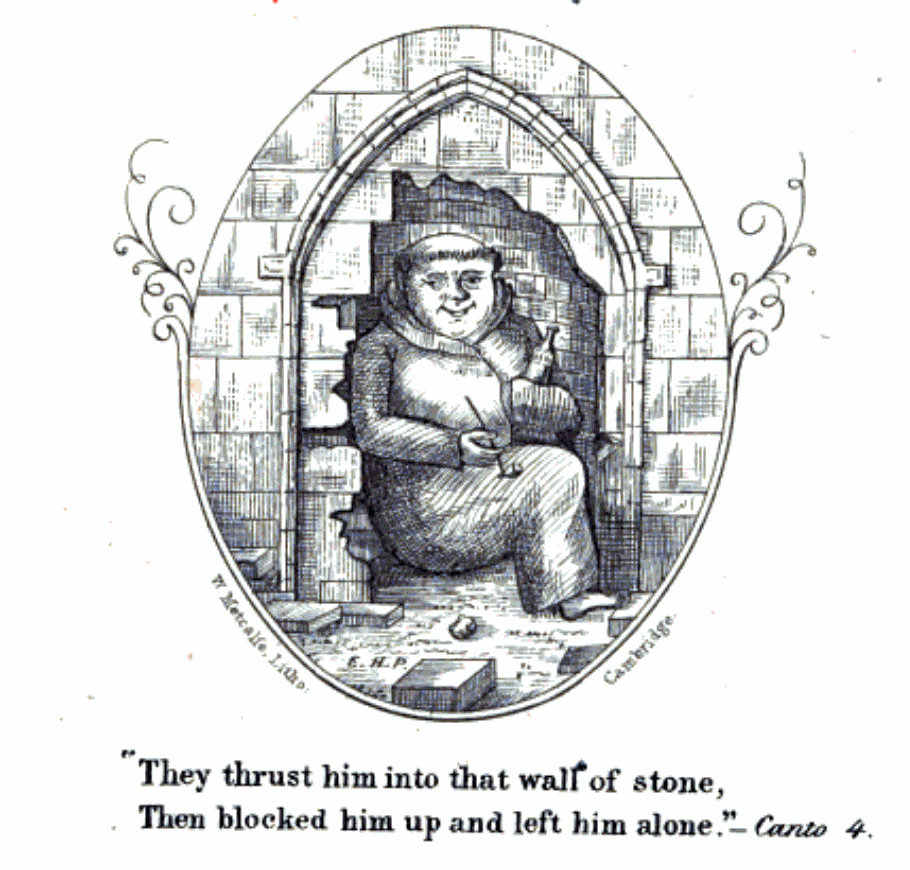
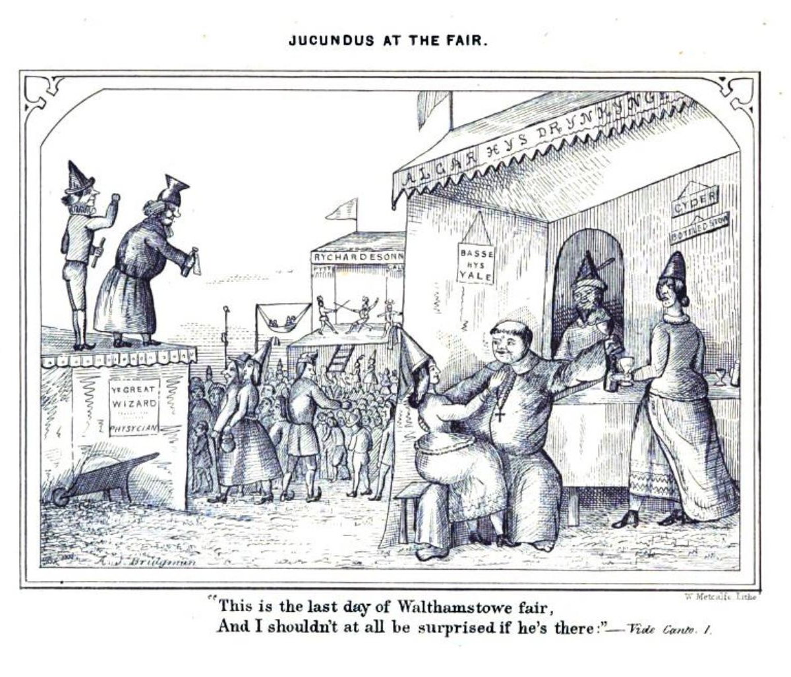
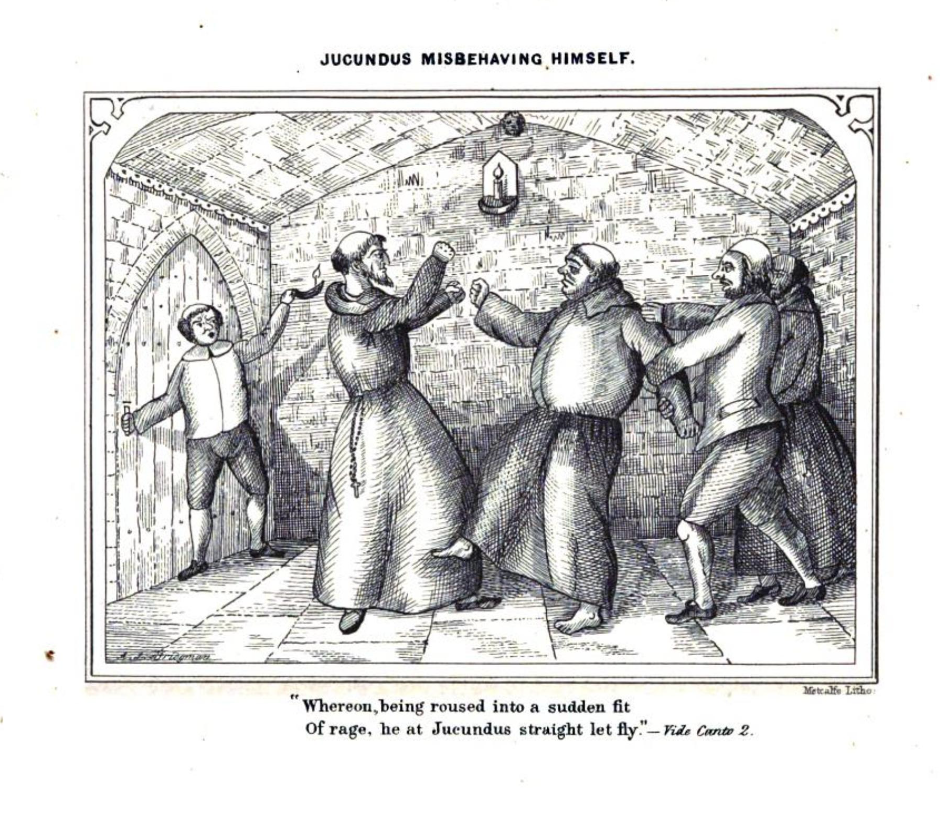
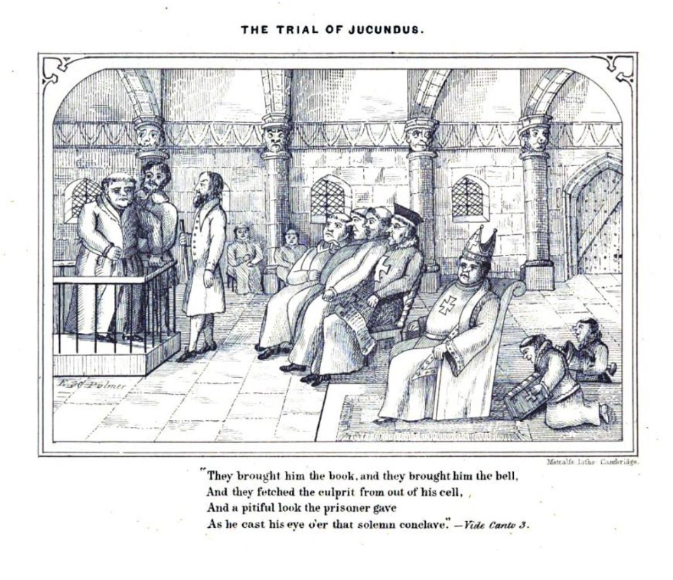
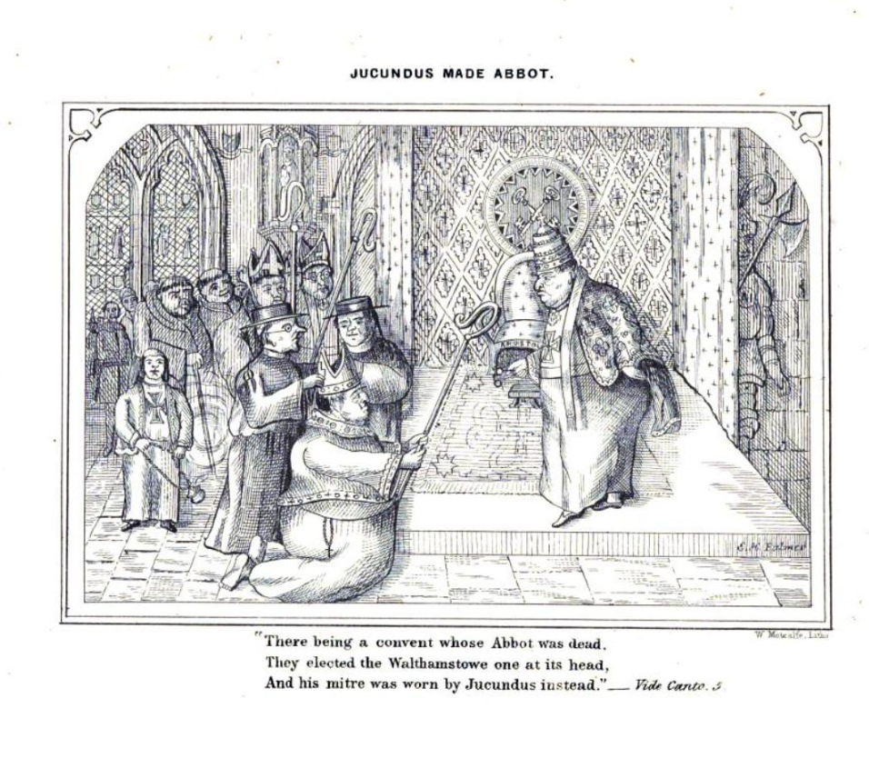

# Brother Jucundus

A tale that one of my fellow *'Tis Tales* tellers, Holly (Medland), tells — *Brother Jucundus*. I probably won't tell this anywhere Holly might tell it, but the extent to which it was a *legend* intrigued me (I lived in York for several years, may years ago), so I did a little digging around it.

The first place I found it, and I think this was also Holly's original source, was in Sabine Baring-Gould's  *Yorkshire oddities, incidents and strange events*. In previous years, Baring-Gould had been keen to debunk claims of a historical basis for many folk tales (for example, "WIlliam Tell", or "Llewellyn and Gelert", in [*Curious myths of the Middle ages*](https://archive.org/details/curiousmythsmid02barigoog/page/n154/mode/2up), 1867), so for him to present a "made up" story with no historical basis as a historical tale might itself appear to be a little bit odd. Unless that was part of the joke of the book, perhaps?!

```{admonition} In *Yorkishire Oddities*, 1880
:class: dropdown
Sabine Baring-Gould, *Yorkshire oddities, incidents and strange events*, [vol. I & II](https://archive.org/details/yorkshireodditie00bari/page/220/mode/2up), 1880, Vol. II, pp. 220-8.

In York were two religious houses — S. Mary's Abbey and S. Leonard's Priory — so close together that their walls abutted. The magnificent ruins of S. Mary's Abbey Church, the heavy fragments of the Priory Church of S. Leonard's, now stand in the gardens of the Botanical Society, and resound no longer to the sound of psalmody, but to the strains of the band playing marches, waltzes, and overtures.

At the close of the fifteenth century, before the Dissolution was thought of, there lived, and fasted, and prayed in S. Leonard's Priory a fat monk named Brother Jucundus. He had not been long in the house. He had joined the order in a fit of headache and remorse, after heavy pota- tions on the occasion of the installation of a new Lord Mayor, and it is possible — probable, I suspect — that he somewhat regretted his precipitancy. Yet there was no escape. The irrevocable vows were on him; for life he was bound to eat only vegetables and bread, drink very small beer, and sleep only six hours in the night.

Convivial songs floated through his mind when he ought to have been chanting the Psalms of David, and the flavour of old sack rose upon his palate when he looked dolefully down at dinner-time into his mug of " swipes."

A year passed. The full paunch of Brother Jucundus began to subside ; his fat cheeks to fall flabby, like the dew-laps of a cow ; a dispirited expression took the place of the watery twinkle which had once animated his eye.

Come what might, Brother Jucundus felt he must have a fling. He should die without it. Just one jollification in the twelvemonth, and then he would put up for the rest of the year with beans and cabbage, small beer and matins before dawn.

York fair approached. York fair ! of all that is ravish- ing ! The shows of dancing dogs, the whirli-go-rounds, the giantesses and dwarfs, the " spice " stalls, the drinking- booths ! To York fair he must, he would go, if condemned to a bean and a thimbleful of water for fasting dinner ever after.
And go he did. He managed it in this way : — After dinner the whole community took an hour's sleep. As they rose at midnight and dined at mid-day, this was very necessary, and the Priory was silent, save for snores, from one o'clock to two. At half-past one Brother Jucundus stole to the porter's lodge, found the porter asleep in his chair — so took possession of his keys ; went to the Prior's apartment ; the Prior was asleep ; pocketed a crown from his money-box, and left the Priory.

At two o'clock the community awoke. The porter missed his keys. The Prior missed the crown. All the monks were summoned into the chapter-house, and all missed Brother Jucundus.

After long deliberation it was decided that two sedate and trusty brothers should be sent out in quest of him.

It was a bright, sunny afternoon. Jucundus had enjoyed himself amazingly.   The amount of gingerbread horses and men he had consumed was prodigious. He had seen " The Spotted Boy " and " The Bearded Woman " ; he had gone round in the whirligig on the back of a wooden horse ; he had shot for nuts at a mark, and won his pocket full, which he cracked every now and then, and washed down with a draft of really good ale. And now, just now, he was going up in the boat of a great see-saw, with a foaming tankard in his hand, his jolly red face illumined with glee, and his ample throat thundering forth —

"In dulce jubilo-o-o, Up, up, up we go-o-o " ;

when his sweet jubilee was cut short by the sight of two monks from his Priory, with grim faces, making their way towards the see-saw.

Brother Jucundus tried to scramble out, and in so doing tumbled down. He was picked up. Either his libations, or the fall, or disinclination to return to S. Leonard's weakened his legs, and he tottered so much that the reverend fathers were obliged to put him in a wheelbarrow and roll him to the Priory gate. At the entrance stood the Prior with a brow of thunder.

Brother Jucundus looked pleasantly up in his face from out of his conveyance, smiled benignantly, and piped —

" In dulce jubilo-o-o, Up, up, up we go-o-o."

The chapter was still sitting, stern and threatening.

The helpless monk was trundled in his barrow into the midst of the assembled fathers, to be tried and sentenced.

He had been caught, flagrante delicto, in a see-saw, drunk, riotous, and incapable. Nevertheless, Brother Jucundus was not disposed to view his case unfavourably.

He looked round  on  the  chapter  with  an affectionate glance from out of his watery eye, and the kindest, most winsome smile on his ruddy cheeks.

He was asked at once for his defence.   He murmured with a hiccup —

" In dulce jubilo-o-o."

The sentence was unanimous, and unfalteringly given. He was to be walled alive into a niche in the Priory cellar. The execution was to be carried into effect immediately.

As he was helped down the cellar stairs, some glimmer of his situation came in on the mind of Jucundus, and he sadly trolled out —

" Down, down, down we go-o-o."

A convenient niche was soon found. A cruse of water and a loaf of bread, with cruel mockery, were placed in the recess. The ready hands of zealous monks mixed the mortar, brought the bricks, and in a quarter of an hour Brother Jucundus was firmly walled in to his living grave.

Now for the first time did the extreme inconvenience ol his position break upon the unfortunate monk. In the wheelbarrow he had been able to sit ; here he was walled upright. It was cramping, intolerable. He kicked, he pressed backwards with all his might ; and suddenly, with a crash, the wall behind him gave way, and he rolled back- wards over a heap of fallen bricks into a cellar.

The shock brought him completely to his senses. Where was he? Now he saw the gravity of his offence — the terrible fate that had been prepared for him. Escape was fortunately open to him. He ran up the cellar stairs, and found himself in the Abbey of S. Mary's. The cellars of the two monasteries had adjoined ; a wall alone had divided them. He had tumbled out of S. Leonard's into S. Mary's.

S. Mary's Abbey belonged to the severe Cistercian Order. Complete silence was one of the rules of the society. Except on Easter-day, no monk might speak; on Easter-day every one talked, and nobody listened. When Brother Jucundus accordingly appeared in the cloisters, no monk turned to look at him, or asked him u how the saints he had come there ? " but swept by him like a ghost. Jucundus made himself as much at home as was possible. He took his place at table, ate and drank what was set before him, occupied a pallet in the common dormitory, lifted his voice in concert with the others in the Abbey choir, and nobody meddled with him. The monks, if they thought about him at all — and it was against their rules to think of anything but their own spiritual affairs — thought he was a new monk just joined in the usual accepted manner.

A twelvemonth passed. It had been dull in S. Leonard's ; it was duller in S. Mary's. The day came round on which York fair was held, the day, that happy day, which had ended so dolorously.

Now the day before York fair the office of cellarer fell vacant in S. Mary's Abbey by the death of the monk who had presided over the wine and beer. The Abbot by a happy inspiration committed the keys to Brother Jucundus. Here was an opportunity ! If York fair might not be enjoyed in the market-place and the Pavement, he would at least commemorate it in the Abbey cellar.

On York fair-day, accordingly, Brother Jucundus, after having seen all his fellow-monks safe in bed, stole down  the  stone  steps  into  the  vault  where were  the "barrels,  with a tankard in  his one hand and a lantern in the other.

S. Mary's Abbey was often called upon to receive noble, even royal guests, and entertain them nobly and royally. It therefore contained barrels of very prime wine and very strong audit ale. Brother Jucundus went along the range of barrels trying one tipple after another. There is nothing so dangerous as mixing your drink, and this the reverend brother discovered at last, for he sat down, unable to proceed further, by the best cask of Malmsey, and turning the tap, filled his tankard.

Next day at noon the Cistercians assembled in the refectory for their frugal repast, dinner and breakfast in one ; and as they had been up since midnight, and had eaten and drunk nothing for twelve hours, were tolerably hungry and dry. But the mugs were empty. At the Abbot's table even was neither wine nor beer. The silent fraternity bore with this some time, but at last even the rules of the Order could not keep them perfectly silent. They shuffled with their feet, growled and grunted discontentedly. At last the Abbot, in a voice of thunder, shouted —

" I want my beer ! " and the example of the head becoming infectious, " Beer, beer, beer ! we all want our beer ! " resounded from every part of the refectory.

" Where was the cellarer ? " Nobody knew. At last two brothers were commissioned to go to the cellar and fetch ale. They presently returned with awe-struck coun- tenances, beckoned to the Abbot to follow them, and led the way along the cloisters down the cellar stairs. Curiosity, though against the rule, was infectious, and all the monks crept en queue after the Abbot. When they reached the vault a shocking sight presented itself to their eyes. Brother Jucundus lay with his head against the butt of Malmsey, flourishing his tankard over his head, and feebly, incoherently, trolling forth —

" In dulce jubilo-o-o, Up, up, up we go-o-o."

It was too flagrant an offence to be passed over. A chapter of the Order was at once constituted in the cellar itself. All the monks were present. Unanimously it was decided that after solemn excommunication with bell, book, and candle, the guilty brother should be walled up alive on the scene of his crime in that very cellar.

The awful scene of excommunication was proceeded with. It took some time, and during the ceremony Brother Jucundus gradually resumed consciousness — the fumes of Malmsey slowly evaporated. A convenient recess was found, where a heap of crumbling bricks lay prostrate. It was the identical nook out of which a year and a day before Brother Jucundus had escaped into the Cistercian Order and Abbey of S. Mary.
Into this niche therefore he was built. His terrible position had  not, however, as  yet  forced itself on  the monk's  brain ; he still tasted Malmsey, still was his heart buoyant, and with swelling lungs he roared forth his song —

" In dulce jubilo-o-o  
Up, up, up we go-o-o."

Now, it happened that the clocks in S. Leonard's and S. Mary's differed by a quarter of an hour. That of S. Leonard's was slower than that of S. Mary's. Consequently it was only just dinner-time in S. Leonard's Priory, and the cellarer, pitcher in hand, had just descended the stairs, and was filling his vessel with small beer, when he heard close to his ear, from behind the wall, a stentorian voice thunder forth —

" In dulce jubilo-o-o,  
Up, up, up we go-o-o."

The voice, the strain, the words were those of Brother Jucundus, who a year and a day before had been immured at that very spot.

Down went the pitcher, and away fled the monk — amazement, admiration in his countenance, " A miracle ! a miracle !" in his mouth — to the monks, just issuing from the church and the recitation of Sext and the office for the dead around the body of their Prior, lately deceased, and that day to be buried.

The whole community rolled like a tidal wave down the cellar-stairs, and stood with breathless awe in a circle about the spot where twelve months and a day before they had walled in Brother Jucundus.

It was a miracle — there could be no doubt of it. Eager hands tore down the wall, and revealed the reverend brother, hale and rosy as of yore, and at his side a loaf as fresh as when put in, and a pitcher still full to the brim.

There could be no doubt but that this was a special interposition to establish the innocence of the monk, and to indicate to the community who was to be their future Prior.

With one voice they shouted, "Jucundus our Prior! Saint Jucundus our head and father ! "

On the shoulders of the enthusiastic brethren the miraculous monk was carried up-stairs and installed in the Prior's seat in the chapterhouse.

Under him S. Leonard's jogged along very pleasantly, and he did much in his long rule of the monastery for its discipline and good order, if not to justify, at least to excuse, the dissolution which fell on it immediately after his death.
```

```{seealso}
One way of telling this tale might is to imagine a monastery that has a shared wall with a convent, and then follow through on the comedic potential of that.

I note that also contrsasts with a *Gilbertine order*, where monks and nuns have shared facilities.
```


Baring-Gould's authority, however, seems to have led to the tale being accepted as legend, with William Andrews' *Yorkshire in olden times* of 1890 citing baring-Gould directly, for example.

```{admonition} In *Yorkshire in olden times*, 1890
:class: dropdown
[Yorkshire in olden times](https://archive.org/details/yorkshireinolden00andr/page/152/mode/2up), 1890, p153.

York fair also dates from very remote antiquity, the city itself being one of the most ancient in the county, or even in England. Mr. S. Baring-Gould tells a good story of this fair in the second volume of his " Yorkshire Oddities, Incidents, and Strange Events." Everyone who knows York knows that the fine ruins of the Abbey of St. Mary and the hoary remains of the Priory of St. Leonard are so near each other, in the grounds of the Yorkshire Philosophical Society, that when perfect their walls must have abutted. Those who do not know this require to be acquainted with the fact in order to understand the story. Towards the close of the fifteenth century, the brethren of St. Leonard's numbered among them an unworthy brother who had taken the vows in haste — in a fit of head-ache and remorse, after "potations pottle-deep" on an occasion of civic rejoicing — and repented at leisure. The head-ache was bad, but the monastic fare of bread and herbs was worse. He longed for beef and strong ale, and in less than a year felt that he must have a jolification, if he died for it.

```

And again, in a memoir of one of the most notable figures of 19th century York, Baring-Gould is cited:

```{admonition} *If we may rely on what the Rev. S. Baring-Gould says...*, 1908
:class: dropdown

Phebe Doncaster, *John Stephenson Rowntree: his life and work : memoir*, 1908, [pp.370-1](https://archive.org/details/cu31924006039980/page/n389/mode/2up)

And now, for a moment, let us note the contiguity of the two ecclesiastical buildings of St. Mary's and St. Leonard's ; for though the Multangular Tower and the Museum now divide the two groups of ruins, the buildings of the Abbey and the Hospital must have been so near to each other that some intercourse between the two institutions may have been not infrequent, and the escapades of Brother Jucundus may at least have been possible. If we may rely on what the Rev. S. Baring-Gould says, `[In *Yorkshire Oddities*.]` Brother Jucundus was a monk in the Priory of St. Leonard's about the time when Christopher Columbus was discovering the New World. On the recurrence of a York fair, the temptation was irresistible to steal out, in the siesta hour after dinner, and to see again the dancing dogs, the whirli-go-rounds, the giantesses and dwarfs, the spice stalls and the drinkingbooths. When the brother's departure was perceived, the Prior despatched two monks to see after him, who, alas ! had to wheel back their friend on a barrow, in a state in which too many, both before and since, have been found at fair times. Ecclesiastical judgment, prompt and stem, consigned him to be walled up alive in the Priory cellar. Soon after the builders of this living grave may have sung their requiem, " Sinful brother, part in peace," the seasonable fall of the wall behind Jucundus released him from his uncomfortable position, and enabled him — now sobered — to run up a passage leading into St. Mary's Abbey, where he took his place, no questions being asked, amongst the Benedictine monks. For a year he conducted himself decorously in his new home, but the recurrence of the York fair again led Jucundus into alcoholic excess, for which he suffered in St. Mary's the same penalty he had undergone in St. Leonard's. In nearly the same way he a second time escaped, falling this time out of St. Mary's into St. Leonard's, and timing the event so opportunely that his arrival there, a year and a day after his departure, occurred at the very crisis when a new Prior was needed. It is hardly needful to finish the story. Jucundus, restored to his brethren as by a miracle, was hailed by them as Prior. He ruled many years in that capacity, and it cannot be surprising that the moral state of St. Leonard's Priory at his decease justified its suppression. Its history had then extended over six centuries. According to the ordinary accounts, the kingdom of England had only emerged out of the Heptarchy about a century when King Athelstan granted to certain rehgious persons connected with the Cathedral Church of York, called Colidei or Culdees, a piece of ground on which to erect a hospital. A reference to Mr. Wellbeloved's excellent handbook to the antiquities in the Museum and grounds will inform the reader how successive kings, William the Conqueror, his sons Rufus and Beauclerc, and others, enlarged the possessions of the Hospital, till in the time of Henry VIII., his minister, Thomas Cromwell, found them worth ;f5,ooo per annum reckoned in the currency of to-day. The ruins now standing are the Ambulatory, probably built by John Romanus, treasurer to the Minster, about the time when the Commons representatives were first summoned to Parliament.
```

And so it goes, the story then starts to pass into historical guides...

```{admonition} A miracle was wrought, 1908
:class: dropdown

George Benson, *York*, 1911, [p51-3](https://archive.org/details/yorkbens00bensuoft/page/50/mode/2up).

A story tells how once a miracle was wrought in St. Leonard's Hospital. The hero of the tale, so far from being a saint was very much a sinner. After a not too reputable secular career, he was persuaded to become a religious. The change in his life was more apparent than real, for, it seems, when fair-time came round, he made up his mind to join, as on many a previous occasion, in the festivities of the season. Taking advantage of the after-dinner sleepiness of the porter, and seizing the latter worthy's keys, Brother Jucundus, for that is the hero's name, made his exit, contemptuous of discipline.

Whether it was the unusually severe life he had lately been leading, is not known, but it appears that by the evening the brother's ideas were, as a result of his unwisely frequent potations, in quite a nebulous state.

Meanwhile, attention having been directed to the absence of Jucundus from the monastery, two brothers were deputed with orders to discover his whereabouts and to rescue him. Eventually they conveyed their erring comrade home in a wheelbarrow.

Such a breach of discipline was a most serious offence; indeed, Jucundus was sentenced to be walled up alive. This unpleasant process was actually carried out, and our friend thought that he had looked his last upon the sun.

Mured up thus unkindly, he was soon sobered, and beginning to kick against the walls, was surprised that the stones gave way under the pressure he applied to them. He soon had worked a big enough hole (not, of course, in the wall which Justice had just built in order to immure him) to allow his passage.

He now found himself in the adjoining Abbey of St. Mary, and his only hope of safety lay in his passing as one of the regular inmates of that establishment. He, too, therefore subjected himself to the Rule of Silence, and acquiring in a remarkably short space the esteem of his new brothers, was appointed cellarer.

Alas! after a year, temptation was too much for him. He made an unworthy use of his office and underwent a second sentence for riotous misconduct. He was carried by the unsuspecting monks to the place where he had been before immured and was left to his fate. He was still under his drunken delusion singing merrily, to be heard by the reverend brothers of St. Leonard's. The news of Jucundus's continued existence was carried to his superior, who, recognizing his former subject's voice, ordered the cell to be opened and knelt in awe before the revivified but still merry Jucundus.

```

Benson's take on the tale was also noted in a review his book in the Athenaeum a few years later.


```{admonition} More the character of a guide-book, 1912
:class: dropdown

The Athenaeum  April 20th, 1912, Iss 4408, [p437](https://archive.org/details/sim_athenaeum-uk_1912-04-20_4408/page/436/mode/2up).

Geography and Travel.

Beautiful Ireland: Connaught and Munster, by Stephen Gwynn.— Beautiful England: York, by George Benson ; Chester, by Charles Edwardes. 2/ net each.

To Mr. Gwynn belongs an almost passionate love for the districts he describes—a love which radiates through every page of his two new books, and is especially noticeable in the stories and legends he repeats. The tragedy of Finn and Grania, the history of Daniel O'Connell, the story of St. Brendan's pilgrimage into the west—all these, as told by Mr. Gwynn, are not merely good reading, but also breathe the very spirit of Ireland. His two books will do what few guide-books can—awaken a strong desire to see the country they depict. The illustrations by Mr. Alexander Williams are uniformly excellent.

Mr. Benson's book on York has more the character of a guide-book than Mr. Gwynn's. He gives a good deal of attention to the craft guilds, but says nothing to show wherein they differ from those of other cities. We regret we have not the space to repeat the pleasing medieval story of Brother Jucundus, whose weakness for strong drink all but placed him amongst the saints. There is a strange contrast between this and Mr. Seebohm Rowntree's book on York as it confronts the social reformer. It is difficult to believe that they deal with the same city.

Mr. Charles Edwardes has written a book about Chester and its environs which is worth reading for its own sake, although it is distinctly the most guide-bookish of the four. Mr. Ernest Haslehust has successfully illustrated the works on York and Chester.
```

For the "truth" of the tale, however, the [*Tales of Britain and Ireland* podcast](https://talesofbritainandireland.com/episode-27-brother-jucundus/) suggests we should look to Walthamstowe Abbey, and a metrical romance originally produced purely as a personal amusement — *Ye Hoel in Ye Walle, A Legende of Walthamstowe Abbey*.

> THE following was written some two years ago , without any view to publication , but merely to beguile a few leisure moments. having shown the manuscript to some friends, I was so strongly urged by them, that I have at last ventured to lay it before a discriminating Public, trusting they will not be too severe  upon the defects of a young author.
>  
> With this short apology, I leave my little book (my first literary bantling) to its trial; and should the verdict be favourable,  you and I, my "gentle Public", will perhaps meet again
>  
> E. H. PALMER , March , 1860. Hoop Hotel, Cambridge

```{admonition} Ye hole in ye Walle, 1860
:class: dropdown

E. H. PALMER, [Ye hole in ye Walle, A Legende of Walthamstowe Abbey ; A Merrie Metrical and Monastical Romaunce*](https://play.google.com/books/reader?id=1VACAAAAQAAJ&pg=GBS.PP10&printsec=frontcover), 1860.

Illustrated by the Author and Arthur J. Bridgman



THe Hole in the Wall

The Iron tongue,  
Of the bell has rung  
At the hour when evening Mass is sung,  
And all in the Abbey of Walthamstowe  
Tell over their beads  
As onward each speeds  
To say hes "*ave*" and "*ora pro*;"  
For the rules of the convent have ordered it so
That all must go  
To the chapel each night, if they like it or no.

Mass is begun,  
The Abbot has run  
His eye over all of the stalls, and one  
Thought the Abbot, is brother Jucundus. I swear  
This is the last day of Walthamstowe fair,  
And I shouldn't at all be surprised if he's there."



Oh grim then grew the Abbots phiz,  
And an angry flush to his features "riz,"  
Which boded the cuplrit no good, if detected  
In passing his time as the Abbot expected.

When they finish'd the Mass, and done all that's habitual  
To monks who are strict in observing the ritual,  
They had supper, and turned their attention from matters  
Of spiritual import, to empty their platters

And then, as many a wanfering stare  
Turned on Jucundus' empty chair,  
They all began to ask each other,  
"Why! where on earth's our worthy brother?"  
Then darker grew the Abbot's brow,  
And every one could see a row  
Was pending, as he sternly asked,  
"When had they seen Jucundus last?"  
Said one, "At noon, not feeling well,  
"I sought my lonely, quiet cell,  
"There to tell over my beads, and pray  
"That the head-ache I'd got might go away:  
"I heard some footsteps pass my cell,  
"And some one rang the porter's bell;  
"Then I heard a voice to the porter say,  
Open the portals—Hugh, good day.'  
"It might have been brother Jucundus went out:  
"If you call up the porter, he'll settle the doubt."

Two lay brothers stood at the Abbot's back,  
To wait on him at table and hand him the sack, `[Nota Bene.-Not sack cloth but sack wine is here meant, A liquor regarded by him with endearment.]`  
And he bade one be off and return in a crack,  
With Hugh the porter, so that he might  
Ascertain if the brother had spoken aright.

Off like a shot  
Flew the servitor, not  
Once stopping, till into the kitchen he got,  
Where Hugh was regaling himself with a pot  
Of hot ale with spice, like our modern *egg-hot*.  
But as I've just stated,  
The lay brother waited  
For nothing, and so Hugh's hot tipple was fated  
To cool, while he answered the summons, and went  
To see for what purpose the Abbot had sent.
With a very low bow  
And a "tug at his pow,"  
In the manner that ostlers salute people now,  
Hugh entered, and t'other announced him with "Here is  
"The porter, Lord Abbot, to answer all queries."  
"Porter Hugh,  
"Now tell me true,  
"Who was the brother, let out by you  
"To-day? and where was he going to?"  
Hugh replied, with a bow more profound than before,  
"To the brother Jucundus I open'd the door,  
"And he said he was going to visit the poor."  
"That's all I require,  
"You may straightway retire,"  
Said the Abbot, his wrath waxing higher and higher,  
"Jucundus I strongly suspect is a liar;  
"But I'll wait for the issue,  
"And meanwhile, I wish you  
"Good night, *pax vobiscum fratres*, I dismiss you."

Canto II.

WAS MIDNIGHT, and the moonbeams shone  
O'er Walthamstowe's now lonely aisles;  
A silv'ry radiance fell upon  
The niche and pedestal, whereon  
Our Lady's image smiles.  
What is that unaccustom'd sound  
That wakens Hugh from his sleep profound?  
The clock of the abbey is striking four,  
And some one knocks at the abbey door,—  
A thing that Hugh  
Never yet knew  
(And he'd been the porter for many years, too.)  
In the course of his life before.  
Out of his bed  
Hugh tumbled, and said  
With a growl, like a bear with a scalded head,  
"There's that rascally Monk,  
"I'll wager he's drunk:  
"If I were the Abbot, I'd make him bunk  
"To the Hole in the Wall, and lie there till he stunk.".

While he was grumbling  
About the room, stumbling  
Over the chairs and etceteras, fumbling  
To get at a light, there continued a knocking  
At the door, in a way that was perfectly shocking:  
Rat, tat, like the roll of a drum that's played  
To a posse of riflemen out on parade.  
Never, I ween, was heard before  
Such a noise as that at an abbey door.

Soundly, oh soundly, the Abbot sleeps!  
And the tip of his nose,  
From under the clothes,  
Like a rubicund bottle, peeps.  
Loudly he snores like one oppress'd  
By something he's eaten and can't digest;  
But to look at his face as he sleepeth there,  
You might almost swear,  
That in spite of nightmare,  
No sound that the midnight air could bear,  
Could break the Abbot's rest.

If you did, you'd be out  
Tho', there is not a doubt,  
For the knocker kick'd up such a deuce of a riot,  
That when all the others were waken'd up by it,  
The Abbot himself couldn't sleep on in quiet.  
Up he arose,  
Startled out of his doze,  
Rat, tat,— "What's that?  
"There's that da— cursed cat,—  
"By the Mass—no! it's something much louder than that!  
"What on earth can it be?  
"I'll go down stairs and see:  
"Oh, *Maria beatissima, ora pro me*."

The Abbot lit a candle; quickly drew  
His breeches on, and softly down stairs went,  
But there no midnight ruffians met his view,  
As he had fear'd they would, on plunder bent;  
But 'gainst the door-post, struggling with Hugh,  
Jucundus, drunk as any fiddler, leant.  
Hugh could not move him from his post a bit, and he  
Sang "Old King Cole" and extracts from the Litany!

Amazed at such a scene, with low'ring brow,  
The Abbot came up frowning to the spot,  
And asked Jucundus very sternly, "How  
"He dared behave so;" Ju said, "Go to pot!  
"Old boy, it's no use kicking up a row,  
"But if you're game, come on, I'll take the lot!"
With this address he doubled up his fist,  
Aim'd at the Abbot's head a blow, and— missed.

But though the Abbot 'scaped the blow, it lit  
Upon a brother who was standing by,  
And being a rather hard though random hit,  
Almost knock'd out, and quite bung'd up his eye:  
Whereon, being roused into a sudden fit  
Of rage, he at Jucundus straight let fly;  
They fell together, and began to pound  
Each other, like two bull dogs, on the ground.

Jucundus being, as I have just observed,  
Extremely drunk, got worsted in the fight;  
He caught a thrashing which he well deserved,  
And lay upon the ground in dismal plight.  
Hugh, having to the task his sinews nerved,  
Lifted him up, altho' not very light;  
Then to a cell his senseless body bore,  
There laid him down, went out, and lock'd the door.



Oh drink! fell demon that thou art,  
In what dread crimes and deadly sins  
Have men been brought to take a part  
When by thee weaken'd on the pins?  
My present lay  
Proves what I say,  
It's excessively wrong for a man to give way  
To intemperate habits; but hold, not so fast!  
In a story the moral should always go last.

Canto III.

The ABBOT of Walthamstowe sat in his chair,  
And his face wore a stern and unpitying air,  
Such as priests of the gospel ought not to wear:  
Prior and Friars, they all were there  
A reverend conclave I ween they were.

The Abbot of Walthamstowe turn'd his head  
Behind his chair  
For waiting there,  
Were the two lay brothers—and thus he said:  
"Now one of you haste to the culprit's cell,  
“Bring him before us, and guard him well;  
"The other, run quickly and bring me a bell,  
Bring me also the book which in chapel is read,  
"With a mark at the *Mass for the Souls of the Dead!*"



They brought him the book, and they brought him the bell,  
And they fetch'd the culprit from out of his cell,  
And a pitiful look that prisoner gave,  
As he cast his eye o'er the solemn conclave.

All was ready, you might have heard  
A pin as it fell, not a brother stirred,  
As the Prior, at a nod from the Abbot, began  
To read the indictment—and thus it ran:—

*Ye Endyctemente.*

"You, Jucundus, a priest of the church, and a monk  
"Of our order, stand charged with getting drunk;  
"By holy Church; and, moreover, committing  
"A breach of our laws:  
"You must, therefore, show cause  
"Why you should not be dealt with as may be thought fitting  
"By the Lord Abbot, now *'In Judicio'* sitting!

"*Secundo*,—you're charged with unlawfully making  
"A noise, riot, hubbub, and din, thereby waking  
"Us all in the small hours,-to wit, four o'clock in  
"The morning, said noise being principally knocking."  
Here all of the brethren exclaim'd, "Oh, how shocking!"

Then a worthy old Friar,  
Who acted as crier,  
Being very intent on the words of the Prior,  
Felt this interruption quite rousing his ire,  
And cried, "Silence!" which, like adding fuel to fire,  
Rais'd the tumult and clamour still higher and higher,  
For every one trying  
To put down his neighbour, at once began crying,  
"Turn him out!" "Hold your tongue!" It was quite edifying  
To observe the vast trouble the brothers were taking  
To quell the disturbance themselves were all making.  
But the Abbot, at last  
Esteeming it past  
All bearing, said, "If they wern't quiet, he quite meant  
"To clear the court first, and then read the indictment."  
This keeping them silent, the Prior proceeded,—  
I'll give the third count in the same words as he did.

"*Tertio et ultimo*,—you are accused  
"Of having unlawfully mocked and abused  
"The Lord Abbot, and likewise most shamefully used,  
"Assaulted, maltreated, beat, battered, and bruised "Brother Cuthbert, whereby  
"You have blackened his eye."  
Here Jucundus' dander, as Yankees say, "riz,"  
And he answered, "Twas he that first damaged my phiz."  
But Cuthbert replied, "That's a lie! for I'm blessed if I  
"Wasn't struck first, that the Abbot can testify."  
But the rest of the trial I need not report,  
Suffice it to say, 'ere they broke up the court  
A verdict of guilty was found, and the prisoner  
Offer'd the choice of a cord round his wizen, or  
"*Dum vivit intrare sepulchrum in muro,*" `[To those who no knowledge of Latin have pick'd up, This means put in a hole in the wall and then brick'd up.]`  
A fate worse than the Austrian *"in carcere duro."*  
Poor Jucundus replied, "Since I've got to decide  
"In which of these ways my existence I'll yield up,  
"I think, holy Father, of the two I had rather  
"Be put in the wall and hermetically `[Be so kind, for the sake of my rhyme, as to run 
The two latter syllables here into one.]` sealed up."


Canto IV.

Solemnly rolled  
Through those cloisters old  
The sound of the "passing bell," that tolled  
For him whose spirit should soon be free  
From the trammels of mortality.

Solemn and slow,  
Onward they go,  
Through the long drawn aisles of Walthamstowe;  
Abbot and Monks, a goodly throng,  
Leading along  
The brother Jucundus, who'd come it so strong  
In drinking, and fighting, and that was wrong;  
And in that train  
Were masons twain,  
Two sturdy men and strong.  
What are the words so impressively read  
By the Abbot, who's marching along at their head?  
He's reading the *Mass for the Souls of the Dead*.

But see, a little Acolyte is running on before,  
And in his hand he bears a key to open yonder door,  
A massive door, all studded o'er with iron nails: you know,  
Such doors as these were all the cheese in abbeys long ago.

That Acolyte with all his might tugs at it; and when thrown  
Wide open there's a flight of stairs, I should say steps of stone,—  
They lead down to the crypt, a kind of cellar underground,  
Towards which it's plain to see that train of solemn Monks are bound.

Ah me! it was a fearful sight:  
In that ancient crypt, where the tapers light  
Could scarce pierce thro' the gloom,  
They thrust him into that wall of stone;  
Then block'd him up, and left him alone  
To meet a fearful doom.

Now it should have been stated some stanzas ago,  
That as well as the Abbey of Walthamstowe,  
Was another establishment, used by a set  
Of religious recluses,-whose name I forget;  
At least I can't bring back to my recollection  
The name of the saint 'neath whose special protection  
The order was founded: but I've understood  
They were called the St. *Somebody's* Dumb Brotherhood;  
But though I say "dumb," it must not be supposed  
T'was an order of natural dummies composed,—  
They were only fanatics; who, wishing to reach  
Heaven, imagined that once at the wicket,  
Having taken a vow of abstaining from speech,  
Would be held by St. Peter sufficient pass ticket.  
Their monastry wasn't more than a stone's throw  
From the scene of Jucundus's freaks, which you know  
Was called merely the Abbey of Walthamstowe.

Let us now take a peep, at that cellar so deep,  
Where Jucundus was blocked up to sleep his last sleep.  
When he found they had all gone and left him alone,  
Tightly fixed in a wall which he *fancied* was stone,  
He at once began praying  
To all the saints, saying,  
"*Mea culpa — peccavi*," with lots of "*ora*"-ing;  
*Nota bene*, don't take the above for "huzza"-ing.  
He didn't sufficiently like his position,
To give vent to that species of ebullition;  
He cried "*miserere*,"  
Until he grew weary,  
And finding the "Hole in the Wall" rather dreary,  
He indulged in a very profane exclamation,  
Which we'll give in its mollified form of "tarnation."

Well, "tarnation!" he cries,  
And likewise applies  
A polite epithet to the limbs and the eyes  
Of the Abbot, for placing him in such a fix;  
At the same time against the wall viciously kicks,  
Till he finds to his wonder he's loosen'd some bricks;  
For the wall by good luck, although 'twas a thick one,  
And coated on one side with stone, was a brick one.

How his spirits arose,  
When, redoubling his blows,  
The mortar gives way, and an aperture shows;  
His work he ne'er ceases  
Until it increases,  
And is two or three feet wide,-then through it he goes.

Oh! 'tis a glorious thing to stand  
On the shore, and gaze on the deep blue sea,  
And feel the innermost soul expand  
With the joyous sense of liberty.

But those who never yet have known  
The oppression of a tyrant's sway,  
Ne'er been in gloomy dungeons thrown,  
Debar'd from e'en the light of day,  
Can't paint the wild ecstatic glee  
A prisoner feels when he's set free.

'Twas just this "wild ecstatic glee"  
Jucundus felt when he was free,-  
When through the aperture he crept,  
And on the ground in freedom stept,  
He whistled, caper'd,—almost wept.

He stood within a crypt that seemed  
Like that he'd left in all save gloom,  
For the moonlight through a grating stream'd,  
And shone upon his quondam tomb.

By its light he espied  
A door at the side  
Of the vault, which he ran to directly and tried;  
It yielded at once to the kick he applied,  
For whoever it was, that had enter'd it last,  
Had forgotton to lock it and make it all fast.

He passed through the door  
And ran up a score  
Of stone steps, I won't say that there weren't a few more;  
At the top of the flight,  
He then saw a strange sight—  
A chapel, with altar and tapers a-light,—  
Incense and crucifix, everything quite  
En regle for duly performing each rite  
Of the Catholic Church, in the dead of the night,  
And kneeling before it some Monks all in white;  
But never a word  
Of the service was heard,  
They pray'd on in silence not one of 'em stirred.

Jucundus look'd up, and Jucundus look'd down,  
And he saw hanging up on a peg an old gown.  
As soon as he twigged it,  
He sneak'd up and prigged it:  
I know that slang's vulgar, though common in town.

Off with his prize  
Towards the crypt he then flies,  
Creeping stealthily down stairs for fear of surprize,  
There he took off his own gown, and having consigned it  
To the "Hole in the Wall," that he might again find it,  
He put on the other, which, though rather shabby,  
Made him look like the rest of the Monks in that abbey;  
And on going again up the flight of stone stairs,  
He saw that the Monks had all finished their prayers.

So making his mind up what course to pursue,  
He went stealthily over and joined the last few  
Who were leaving the chapel, and none of them knew  
That a stranger had joined them, because he was dressed,  
As I've just now informed you, the same as the rest;  
Or if any one saw him no questions were pressed:
For the convent in which  
He had happened to pitch,  
Was the "Dumb Brotherhood's," as no doubt you have guessed.

He mixed with the throng, who went slowly along  
The passage, not dreaming of anything wrong,  
Till they came to a lot of stone cells in a row,  
Into one of which having seen each of them go;  
Jucundus perceiving that yet three or four  
Were left empty, turned in for the night, and before  
He'd been lying down in it  
The space of a minute,  
Was soundly asleep and beginning to snore.

When the next morning broke,  
Jucundus awoke,  
The clock of the convent was just on the stroke  
Of seven, which here by the bye, I'll observe is  
The hour when most convents begin morning service.

He opened the door,  
And saw three or four more,  
Going to Mass,-these he joined as before:  
Attended the service, and when 'twas all o'er,  
And he'd gone in to breakfast along with the rest,  
They first seem'd to notice their unbidden guest.

Every one's eyes  
Were turned in surprise  
On him then, though not one of them all could surmise  
How he got there,-if he dropp'd from the skies,  
Or whether he came like those gentry who rise  
Through trap doors in plays, or jump down from the flies;  
But as they didn't ask him, he didn't enlighten 'em,  
Though very considerately lest he should frighten 'em:  
To show he was real flesh and blood, he demolished  
The viands before him, and when he had polished  
Quite clean the platter of one of the brothers,  
He turned round and helped himself out of another's.

They were rather astonished at such a "cool cheek,"  
And some of them actually got up to speak,  
But remembered their vow just in time, and instead  
Of doing so, gave him a large piece of bread,  
And a plate to himself full of fine collared head:  
For though I can't praise  
The Monks of those days,  
Charity always was one of their *traits*.

They soon got accustomed to seeing him there,  
And he being a punctual attendant at prayer,  
And ready, in any work they had to do,  
Always to lend a hand, very soon grew  
To be thought quite one of them—a favorite too.  

Things went on in this way  
For some time, till one day,  
Nearly two years from his sudden entrée,  
On its striking him strong,  
That living so long  
Without any amusement was certainly wrong,  
He resolved upon having a bit of a spree,  
As he called it, just to prevent *ennui*.

Oh how nice it would be,  
On a fine night, thought he,  
To get over the wall when nobody could see,  
And roam through the village so merry and free:  
Then he though, of the tavern, the glasses of gin,  
He would have if he got there, but, ah! he'd no tin;  
And if minus the needful he had better stop in.

Amongst other old proverbs I've heard people say,  
"Where there's a will there is always a way;"  
So it proved in this case, for when he got thinking  
On gin (the fact was, he'd a weakness for drinking),  
The will being strong,  
It was not very long  
Before the way darted across him "like winking."

He had happened to notice the Abbot one day,  
When he had some of the tradesmen to pay,  
Go into the room where the strong box was kept,  
And deposit the key in the room where he slept.

The temptation was great, and he couldn't resist,  
So he borrowed the key, and before it was missed  
(As he thought), having helped himself out of the strong box,  
Went back to replace it, but got in the wrong box:  
For the Abbot came in as he opened the drawer,  
And, just peeping over his shoulder, soon saw  
What he was after; then grasping him tight  
By the arms, in such way that he couldn't show fight  
Or offer resistance,  
Then knock'd for assistance,  
And when it arrived the whole thing came to light;  
For on searching his pockets they found all the cash,  
A discovery that settled Jucundus's hash.

They took him down stairs to the great dining hall,  
Where several tablets were hung on the wall,  
On which all the orders and rules were indited,  
At one of which Ju. felt extremely affrighted:  
For there was a clause, in great letters revealing  
The fact, "If a Brother's caught picking or stealing,  
"The best way of dealing  
"With him, is by sealing  
"Him up tight, as good bricks and mortar can make him,  
"In a hole in the wall, then the devil may take him!"

They took him down stairs to the crypt, and then brought a  
Pickaxe and shovel, some bricks and some mortar,  
But seeing a hole in the wall ready shaped,  
From which two years back he'd so strangely escaped,  
They thrust him inside it, and very soon knocked up  
A strong wall behind it, and there he was blocked up.

Canto V.

IN Walthamstowe Abbey that evening they sat  
At supper, the Abbot (now grown very fat)  
Spoke of Jucundus, whom two years ago  
They'd immured in the wall of the cellar below,  
And said that he rather regretted the sentence  
Then passed, as it left him no time for repentance;  
And dying without being shrived or confessed,  
Would be rather adverse, he feared, to their late brother's rest.

But as what had been done could not now be undone, he  
Recommended them all to contribute some money  
Towards purchasing candles to burn there at night,  
Which plan he'd no doubt would set matters all right.

At this proposition none of 'em demurred,  
And when they'd assented a strange noise was heard,  
As of somebody singing "*Te Deum*" below!  
They listen'd and found that it really was so.  
"But that voice,-my good gracious! it cannot be—no!  
"It's all fancy!—hark there!—by the Mass it's not though!!!"

With this exclamation,  
In great consternation,  
The Abbot fell back in his chair; while, with fright,  
The rest began bawling,  
And some of them falling  
Under the table, quite vanish'd from sight.

On recov'ring, the Abbot,  
By making a grab at  
The Prior, succeeded in standing upright;  
And addressing the others,  
Said, "Come, rev'rend brothers,  
"Get up, I'm asham'd at your cowardice quite."

When their presence of mind was restored once again,  
On discussing the matter, they all said 'twas plain  
The intention of purchasing lights they'd expressed,  
Had procur'd the lamented Jucundus his rest;  
And no doubt they had just heard the ghost of deceased  
Rejoice that his pangs purgatorial had ceased;  
And then they declared 'twould be treating him very ill,  
Not to accord him an honorable burial.

Proverbs say, to delay  
Is dangerous, so they  
Determin'd not even to wait till next day,  
But that evening to break  
The vault open, and take  
Out his "canonised bones," and hold what's called a "wake."
That is, watch 'em all night  
By the bright taper's light  
(In Ireland they usually end with a fight).

So down stairs they hied,  
Taking care to provide  
Pickaxes and crowbars; they took down beside  
The bier that was used when the last Abbot died.

At the very first stroke  
Of the pickaxe, which broke  
Away part of the wall, Jucundus awoke  
(For he'd fallen asleep), and conjecturing shrewdly  
They were letting him out, thought, that if he spoke rudely  
And gave vent to his joy in a strong exclamation,  
It might perhaps gain him a bad reputation,  
And be likely to cause him a third immolation;  
He therefore sang out in his very best psalm tone,  
The entire "De profundis," then said in a calm tone,  
"So you have come at last: well, St. Mary be blest,  
"I've had these last two years *a pretty good rest*!"

Just picture their wonder at hearing this said  
By a man they had long since imagin'd was dead;  
When they open'd the wall, too, conceive their surprise,  
At first they could scarcely believe their own eyes  
On seeing him stand there alive, not at all  
The worse looking for being two years in a wall.

He stepped from the niche and exclaimed "*benedicite*,"  
Turn'd up his eyes and played saint to a nicety.  
The Abbot with rev'rence, surprise, and alarm,  
Was greatly confused, but he offer'd his arm  
To Jucundus, and said, as he begged to escort him  
Up-stairs to the supper room, had he have thought him  
So holy a man, as 'twas clear he must be,  
He'd have never passed any such sentence; but he  
Expressed great contrition, hoped Ju. wouldn't doubt it,  
And when they got up-stairs would tell all about it.

They arrived in the room, and Jucundus prepared  
To tell them a story, of how he had fared,  
Which he did in the following words, his veracity  
Being certainly less than his love of loquacity:

"I committed a sin, brothers, two years ago,  
"For which I was punished as all of you know,  
"But my penitence being both great and sincere  
"I resign'd myself to it without any fear,
"And while counting my beads felt a drowsiness creep  
"Over me, so that I soon fell asleep.

"Then St. Mary appear'd in a vision, and said  
"'Fear not, for 'ere two years have pass'd o'er your head,  
"'You'll be abbot of this in the present one's stead,'  
"She pointed this way, and the sweet vision fled.  
"Since then I have felt neither hunger nor pain,  
"And some hours back I saw the same vision again,—  
"'Jucundus,' it said, 'the two years have expired,  
"'Prepare for your presence will soon be required:'  
"Then I sang the "*Te Deum*,"-you know what transpired."

When the Abbot heard this, he got quite in a fright,  
But thought the best thing he could do was to write  
To the Pope, and request his advice how to act:  
This he did, and explain'd in detail every fact.

When the Pope got the letter, all duly attested  
By the Monks of the Abbey, he thought as the rest did,  
They should act as the saint had already suggested.  
So, there being a convent whose abbot was dead,  
They elected the Walthamstowe one at its head,  
And his mitre was worn by Jucundus instead.



Now the Pope, on considering this wonderful history  
(He never got at the real clue to the mystery),  
Laid the whole matter before the consistory;  
They, deeming a man who could live in a wall  
For two years without eating or drinking at all,  
And who never felt hungry, or weary, or faint,  
Must be very holy,-soon made him a saint.
If you wish to know more of his life, you must look  
In the "*Vita Sanctorum*,"—I haven't the book.

You won't be offended  
If now my tale's ended,  
A few lines are by way of a

__Moral appended:__

Don't too often indulge in the sociable bowl,  
Till you don't know a psalm from such songs as "King Cole;"  
Or some day you'll get yourself into a *hole*.

Don't strike Abbots, and always remember, a thief  
Is certain some fine day of coming to grief;  
If you're very hard up, why,-get parish relief.

And lastly, my readers, I'd have you fight shy  
Of all sorts of Saints, be they Low Church or High:  
There's a proverb may well to this class be applied  
"Often under a cassocke ye Devyllę doth hide."

*FINIS.*
```

The author, Edward Henry Palmer, republished the poem in 1877 in [*The song of the reed, and other pieces*](https://archive.org/details/songreedandothe00palmgoog/page/n128/mode/2up), p117, prefaced with the following statement:

> TO THE READER.
>  
> On pseudo-saints, Ignatian divines, The following verses may appear hard Lynes ; Such thin-skinned gentlefolk will hardly fail To vote such railing quite " beyond the pale," Even in this " reading for the road and rail." If any take offence, not mine the sin, it Was his amusement that my muse meant in it. But long preambles damn a work j one looks For curtailed prefaces in dogs-eared books. With this excuse, then, if your views it meets, I'll cut the preface, you can cut the sheets.

A comprehensive biography of Edward Henry Palmer can be found in *Littell's Living Age*, Fifth Series, Vol. XLIV, No. 2056, -November 17, 1883, [p.390](https://archive.org/details/livingage33littgoog/page/392/mode/2up), which has the following to say about the *Hole in the Wall*:

> The illness which compelled Palmer to give up London had evidently been very serious, and his convalescence was tedious. Nor, when supposed to be well, did he feel any inclination to resume work as a clerk. So he stayed in Cambridge at his aunt's house, with no definite aim in life, but taking up now one thing, now another, after the manner of clever boys when they are at home for the holidays. He did a little literature in the way of burlesques, one of which, '*Ye Hole in ye Walle,*' a legend told after the manner of Ingoldsby, was afterwards published by Messrs. Macmillan; ...
