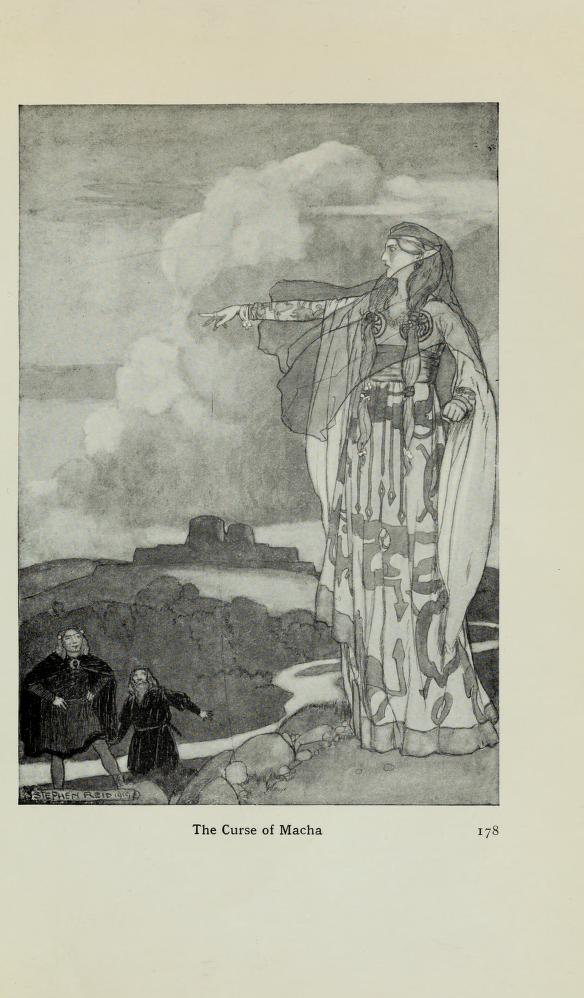

# Macha's Curse

The tales of Tuatha Dé Danann (the Mythological Cycle) and Cú Chulainn (the Ulster Cycle, (Ulaid Cycle, or Ultonian Cycle) also known as Red Branch Cycle) are both still on my to do list, and my progress on the tales of the Fenian cycle seem to have stalled somewhat. But a couple of tales do keep crossing my path, and Macha's Curse, or the Curse of Macha, is one of those.

In one sense, it provides an origin story for the why the men of Ulster were debilitated in their times of greatest need. In another, it provides a lesson the consequence of not taking an opportunity to back down when perhaps you should.

In short, the tale is this:

> One day, the widowed farmer, a commoner, Crundchu, or Cruinniuc, a farmer, returns home to find the beautiful Macha making house. She does — everything. Later, Crundchu is invited to the King's court; the King is showing off his horses; the men are drinking, and boasting; "do NOT talk of me", the heavily pregnant Macha had said; but when the King said there was nothing faster in all Ireland than his horses, Crundchu let slip his wife was; she was called forth, to prove her speed; she glared at her husband, gestured her state to the rest: "please, you see what state I am in, can't the race wait". But the King would not back down; the race was run, Macha won, and on crossing the finish line her waters broke; two children were born, but both were dead. "A curse on the men of Ulster — may you suffer as if in the pains of childbirth, for five days and four nights whenever Ulster is in greatest need of you; and this to last for none generations." And so it was.

Tellings:

[The Curse of Macha - Candlelit Tales Podcast - Ep 04](https://www.youtube.com/watch?v=Fic_mCLHlIY)

[The Embers Collective Podcast, Episode 15 — The Curse of Macha](https://open.spotify.com/episode/2M6fmu996H3eHpXRec6uj2)

```{admonition} In *Myths and Legends: The Celtic Race*, T. W. Rolleston, 1910
:class: dropdown
https://archive.org/details/mythslegendscelt00roll/page/178/mode/2up

Myths and legends: the Celtic race
by Rolleston, T. W. (Thomas William), 1857-1920

Publication date 1910

pp. 178-180

CHAPTER V: TALES OF THE ULTONIAN CYCLE

The Curse of Macha

THE centre of interest in Irish legend now shifts from Tara to Ulster, and a multitude of heroic tales gather round the Ulster king Conor mac Nessa, round Cuchulain, `[Pronounced "Koohoo'lin."]` his great vassal, and the Red Branch Order of chivalry, which had its seat in Emain Macha.

The legend of the foundation of Emain Macha has already been told `[See p. 150.]`. But Macha, who was no mere woman, but a supernatural being, appears again in connexion with the history of Ulster in a very curious tale which was supposed to account for the strange debility or helplessness that at critical moments sometimes fell, it was believed, upon the warriors of the province.



The legend tells that a wealthy Ulster farmer named Crundchu, son of Agnoman, dwelling in a solitary place among the hills, found one day in his dun a young woman of great beauty and in splendid array, whom he had never seen before. Crundchu, we are told, was a widower, his wife having died after bearing him four sons. The strange woman, without a word, set herself to do the household tasks, prepared dinner, milked the cow, and took on herself all the duties of the mistress of the household. At night she lay down at Crundchu's side, and thereafter dwelt with him as his wife; and they loved each other dearly. Her name was Macha.

One day Crundchu prepared himself to go to a great fair or assembly of the Ultonians, where there would be feasting and horse-racing, tournaments and music, and merrymaking of all kinds. Macha begged her husband not to go. He persisted. "Then," she said, "at least do not speak of me in the assembly, for I may dwell with you only so long as I am not spoken of."

It has been observed that we have here the earliest appearance in post-classical European literature of the well-known motive of the fairy bride who can stay with her mortal lover only so long as certain conditions are observed, such as that he shall not spy upon her, ill-treat her, or ask of her origin.

Crundchu promised to obey the injunction, and went to the festival. Here the two horses of the king carried off prize after prize in the racing, and the people cried: "There is not in Ireland a swifter than the King's pair of horses."

"I have a wife at home," said Crundchu, in a moment of forgetfulness, "who can run quicker than these horses."

"Seize that man," said the angry king, "and hold him till his wife be brought to the contest."

So messengers went for Macha, and she was brought before the assembly; and she was with child. The king bade her prepare for the race. She pleaded her condition. "I am close upon my hour," she said. "Then hew her man in pieces," said the king to his guards. Macha turned to the bystanders. "Help me," she cried, "for a mother hath borne each of you! Give me but a short delay till I am delivered." But the king and all the crowd in their savage lust for sport would hear of no delay. "Then bring up the horses," said Macha, "and because you have no pity a heavier infamy shall fall upon you." So she raced against the horses, and outran them, but as she came to the goal she gave a great cry, and her travail seized her, and she gave birth to twin children. As she uttered that cry, however, all the spectators felt themselves seized with pangs like her own and had no more strength than a woman in her travail. And Macha prophesied: "From this hour the shame you have wrought on me will fall upon each man of Ulster. In the hours of your greatest need ye shall be weak and helpless as women in childbirth, and this shall endure for five days and four nights — to the ninth generation the curse shall be upon you." And so it came to pass; and this is the cause of the Debility of the Ultonians that was wont to afflict the warriors of the province.

```

```{admonition} In *The Hound of Cullan*, F. A. M. Cullan, 1918
:class: dropdown
https://archive.org/details/houndofcullan00websiala/page/30/mode/2up

The Hound of Cullan
by Webster, F. A. M. (Frederick Annesley Michael), b. 1886

Publication date 1918

pp.31-34

THE FARMER'S STORY.

"When I was a hale man, young Sirs, taking a pride in my youth and strength I served the King in many wars and saw a great many things, some good but many bad, and the worst I ever saw was that which the King did to Macha, the wife of Crundchu, my old companion in arms.

"After the long war Crundchu took to himself a wife out of the captives we had taken and settled down on a farmsteading of his own, but for me, I was never a marrying man, kisses never came to me as easily as blows, so I stayed on in the service.

"Still I did not altogether lose sight of Crundchu, as might well have been expected, for he was a famous hand at the roth-cleas, `[Wheel feat = hammer throwing.]` and used always to come in to the games at the festivals and holidays.

"For many years my old friend lived happily with his captive bride; indeed they were almost too happy, and the Fates took their revenge as is ever the way, and she died suddenly of an unknown sickness; for many months he was inconsolable in his grief until one day a strange and beautiful woman came to his steading and took upon herself the duties of the housewife, and that night she accompanied him to the bed-place and lay by his side within his arms until the dawning.

"For many months they lived thus as true man and wife; until one day she told him that in course of time he would be a father. This greatly delighted Crundchu, for he had no children by his first wife, and as you all know the soldier ever hopes to have a son to follow in his steps, though the battle parting must weigh heavy on his soul some day. Months went by and Macha's time of coming to the joy and sorrow of woman drew near.

"Now about this time we returned from a great foray and the King declared the games to celebrate our success. Crundchu of course was asked, but Macha begged hard of him not to leave her and when she found that he was fain to go she besought him to say nothing of her as she might only stay with him so long as he did not talk of her in a public assembly.

"That morning Crundchu put on his best apparel and started off for the games; the morning was devoted to the soldiers' sports, and as usual Crundchu won the roth cleas. At midday we fed heartily and drank much, Crundchu more than moat of us; alter the feast w« all betook ourselves to the sports ground again to see the horse racing to which great chieftains came from all over the country to match their steeds against one another.

In the racing the King's steeds won race after race until His Majesty arose and said, 'Let us cease this folly, for in all Ireland there is not a single horse or mortal who can match my horses, nor in all the world do I think there will be found anything to match them in pace.'

'Pooh!' said Crundchu, who was full of strong ale, 'at home I have a wife who can outrun them with the greatest ease.'

'Take that man,' said the King in a rage, 'and keep him safe till this wife of whom he boasts so readily be brought here, and if she cannot beat my horses then strike off his head.'

"At this saying we were very sad, for Crundchu had been a good companion in camp and on the battlefield in his fighting days.

"Then messengers were dispatched to bring Macha to the Court, but that night there was no merriment at the feasting, for we were all sorry for the fate of Crundchu, whom we thought was doomed.

"Next morning the messengers returned with Macha and we saw that she was great with child, and then we murmured loudly, for it seemed unfair to us that any woman should be asked to run a race so close to her time, and very eloquently Macha pleaded with the King for the race to be postponed until her child was born, but he was as adamant, and curtly bade her prepare for the contest.

"Thereat Macha appealed to us to help her, but there were many strangers from far parts of Ulster at the meeting who only mocked her, and against so many and the King's own guards we could do naught.

"Macha seeing that there was no pity to be had from the savage onlookers girt up her gravied loins and bade bring forth the horses, but before she ran she put her curse upon us. 'Oh men of Ulster! this day you have put a great shame upon me, but a greater shame shall fall upon you; from this hour the strength shall go from you as from a woman in her travail, in the hour of your greatest need, and this shall be upon you for five days and four nights. This curse shall hold until the ninth generation, yet this I also prophesy, that a youth shall save your honour at the last.'

"Then she raced and outran the horses, but after she had passed the winning post she gave a heart-rending cry and falling down gave birth to twin children, and thereafter she disappeared and so Crundchu lost his wife and went back to his lonely home.

"And now, young Sirs, my story is finished, and we must go to rest, for you will wish to be early on your way to-morrow, but it was the most shameful sight I ever saw among many shameful sights in a lone life of fighting; and now at last I have come to my rest in this quiet farmstead."

Over this strange story Cuchulain pondered long, wondering who might be the youth who should save the honour of Ulster when the Ultonian Debility should be upon the men.

```

https://www.dib.ie/biography/macha-a9257
'Noínden Ulad' ('Debility of the Ulstermen'), has been dated to the ninth century and was integrated into the narrative complex surrounding the epic 'Táin Bó Cuailnge'


https://archive.org/details/ulsterjournalofa04ulstiala/page/98/mode/2up?q=%22Debility+of+the+Ulstermen%22
 tale entitled Ceasuaidhean Uladk, or the "Childbirth debility of the Ulstermen."


https://archive.org/details/traceselderfait01martgoog/page/n64/mode/2up?q=%22Debility+of+the+Ulstermen%22

Traces of the elder faiths of Ireland; a folklore sketch; a handbook of Irish pre-Christian traditions
by Wood-Martin, W. G. (William Gregory), 1847-1917

Publication date 1902

p40

The Rev. F. A. Potter, in his description of the parish of Rathconrath, in the county Westmeath, in the year 1819, mentions the fact of all the married women calling themselves by their maiden names, and this is still common in Ulster. To the present day, in many places, women, although married, retain their maiden names, and in times not very remote often followed their mother's rather than their father's kindred. The study of this habit may, in time to come, unravel the tangled skein of this folk custom; but apparently the Couvade was prevalent in Ulster at a very remote period, for in one of the early centuries of the Christian Era, when the Northern Province was invaded by Maev, Queen of Connacht or the Western Province, she found all the adults confined to bed, so that no one, save the champion Cuchullin (Coolin) and his father, were able to defend the country against the invaders. This inactivity and inertia of the Northerns was interpreted by the light of a custom which seemed to render it intelligible. This singular inaction is accounted for in a tale entitled *Ceasnaidhean Uladh*, or the "Childbirth debility of the Ulstermen."

In the *Book of Leinster* it is recounted that Macha, wife of Crunniuc, was compelled to run in a chariot race with the horses of Conor, notwithstanding her earnest entreaty for a postponement of the contest on the plea that she was soon to become a mother. Her prayers were unavailing. After she had passed the goal she gave birth to twins, upon which she cursed the Ulstermen, and inflicted them yearly, at a certain season, with labour pains for five day 9 and four nights (or four days and five nights). This was styled the *Noinden Uladh*, This incident is recited to account for the debility of the Ulstermen, when the Province was invaded by the celebrated Connacian Queen.


---

https://storyarchaeology.com/noinden-ulad-the-story-of-macha/

https://storyarchaeology.wordpress.com/2012/07/05/noinden-ulad/


https://iso.ucc.ie/Noinden-ulad/Noinden-ulad-text.pdf


---

https://archive.org/details/leabharnangleann00hend/page/304/mode/2up?q=macha

Leabhar Nan Gleann = The Book of the Glens: with Zimmer on Pictish matriarchy
by Henderson, George, d. 1912; Zimmer, Heinrich, 1851-1910. Matriarchy among the Picts

Publication date 1898

pp. 304-7

TRANSLATION.

"Noinden Ulad," whence is it? Not difficult. Crunniuc, son of Agnoman, was a rich farmer. He lived in solitude and on the mountains, and many sons were by him. His wife, however, died. One day, as he was in his house alone, he saw a woman coming towards him into his house. The appearance of the woman seemed to him magnificent. She began at once as soon as she had sat down, to make preparations for eating, as if she ever had been wont to be in the house. When night came on she gave directions to the household without asking any questions. She slept with Crunniuc at night. Thereupon she was a long time with him, and, thanks to her, they had no scarcity of amy product, whether of food or drink or good things. Not long thereafter a fair was to be holden by the Ultonians, and they were wont to go to the fair with man, wife son (and) daughter. Crunniuc also betook himself with the others to the fair; he was well got-up and well-looking. "It behoves thee," said his wife to him," not to be [so] unguarded" (puffed-up) [as] "to say an. imprudent thing." "Impossible," said he. The fair comes off, and at the day's end the King's chariot comes [first] to the terminus. His chariot and horses scored a victory. The people said, 'There is nothing to match these horses for swiftness." "My wife is swifter," said Crunniuc. He was forthwith seized by the King. This was told to Crunniuc's wife. "It is a real affliction for me that I should have to go to set him free," said she, "and me heavy." "What affliction!" exclaimed the messenger; "he will be killed if thou comest not. Thereupon she went to the race-course (fair), and the pains of child-birth gat hold of her. "Help me," said she to the people; "for of a mother has each of you been born. Wait for me till I am delivered." She could not obtain that [request] of them. "Good, then," she answered; "thence will come the greatest of ills, and long will it endure for all the Ultonians." "What is thy name?" said the king. "My name," she made answer, and the name of my progeny will for ever be associated with the fair (race-course). Macha, daughter of Sainreth, son of Imbath, is my name." Thereupon off she went with the chariot; and as the chariot arrived at the terminus, her delivery forestalled its arrival, for she gave birth to twins — a boy and a girl. From that comes Emuin Macha (lit., twins of Macha). At her delivery she gave such a cry that it set every one who heard it into a condition of debility for five days and four nights. All the men of the Ultonians who had been there, they all fell into the same condition unto the ninth generation (fri saegul nónbair ocan fhiur ro bai ann). Five days and four nights, or five nights and four days, that was the [duration of (?)] Noinden Ulad. The strength of a woman in travail, that was the strength each man of the Ultonians had in the XNinden until the ninth generation. Three classes there were on which the Noinden Ulad did not lie, viz., the youths and the women of the Ultonians and Cuchulainn (Treide for na bid noenden di Ultaib i maic 7 mnaa Ulad 7 Cuchlaind). The period during which it weighed on the Ultonians was from the time of Cruincon, eon of Agnoman, son of Curirulad, son of Fiatach, sou of Urmi, until the time of Forco, son of Dallan maic Mainich, maic Lugdach, &c. Curir Ulad, it is from him the Ultonians are named. Thence then comes Noinden Ulad and Emuin Macha.

There are versions of the above in the Yellow Book of Lecan, also in the Book of Fermoy, and in the Harleian MS., 5280, fol. 53 b (British Mnsenm, fifteenth century). The latter, though verbally differing from the Book of Leinster, tells the story much to the same effect, but gives the man's name as Cruind, and says Macha was the name of that woman, as the learned say (Macha dana ainm na mna sin, ut periti dicunt). Mention is likewise made of the taboo laid on the man. "You are not to go to the racecourse," said the woman, "that you may not fall into the danger of speaking concerning us, for our continuing together lasts only so long as thou dost not speak of me in the assembly (race-course, fair.") The son and daughter are given the names of Fir and Fial. "Then, from dire necessity and sickness, she broke out into a cry. God forthwith granted her relief, and she bare at one birth a son and a daughter. Fir and Fial. When all the folks heard the cry of the woman, it so overcame them that they all had but the same degree of strength as the woman in her state of debility had. 'From this hour henceforth the affront you have given me will turn out to your dishonour. For in your greatest straits each one of you in this province will have but the strength of a woman on her delivery, and for the space of time that a woman is in child-bed, for the same time will (this debility) last, viz., five days and four nights, and it will weigh upon you unto the ninth man, i.e., until the time of nine men (ninth generation.") That also was true; for it clave to them from the time of Cruncon until the time of Fergus, son of Donald. But this debility lay not on tho women, nor on the youths, nor on Cuchulainn, for he was not of Ultonian lineage, nor on any one who was then outside of Ultonian territory. Hence comes it that the debility lay on the Ultonians.

"La sodhain atracht a scret n-ese ar tiachra an galair Rogle Dia di fo cetuair 7 beiridmac7 ingin a n-oentairbirt i. Fir ocus Fial. Amail ro colutar an sluag uili a scrit inna banscalai fos-ceird foo co m-boi hinann nert doib uili 7 an banscal boi isan galur. Bidh aithis tra daib ond uair si ind ainecraca forurmidsie onn-sa. An tan bus ansam duib ni cor bia acht neurt mna seula lib do neuch taircella a coicet sa7 an eret bLs ben a seolai issi eret nom-biaid si i. co cend coic laa 7 cetheora aidchi 7 biaid forib dana co nomadh náo i. co haimsir nonbair. Ba fir son dana. Fordarulil o aimsir Cruneon co haimsir Fergusa meic Domnaill. Ni biid tra an ces sa for mnaib 7 macnaib 7 for Coinculaind ar nar bó do Ulltaib do nach for cach oen no biidh frisan crich anechtair. Is do sein tra ro boi au ces for Ulltaib et reliqiua."

Thus far of a Gaelic story invented to explain the Couvade practice.

---

https://archive.org/details/3762905/page/n21/mode/2up?q=Crunnchu+macha

A descriptive catalogue of the contents of the Irish manuscript commonly called "The Book of Fermoy" [microform]
by Todd, James Henthorn, 1805-1869; Royal Irish Academy

Publication date 1868

pp.17-19

Fol. 33. a. col. 1. (Five lines from bottom) is a tale with this title ...  "This was how the debility came on the Ultonians," beginning ... "Whence [proceeded] the debility that was on the Ultonians ? not difficult to tell".

The story is this: Crunnchu, son of Agnoman, was a rich farmer `[Farmer. The word so translated is ... in the original; the very same word which occurs in the disputed compound ..., "the farmer or tribute-paying tribes," of which we have have already spoken.]` of Ulster, whose wife had died. Not long afterwards, as he was sitting in his house alone, a strange woman, well clad, and of good appearance, entered, and seated herself in a chair by the fire. She remained so until the evening without uttering a word, when she arose, took down a #
#ding trough, went to a chest, as if she was thoroughly at home, took out some meal, #
#ded it, baked an excellent cake, and laid it on the table for the family. At night Crunnchu, perceiving her excellent qualities, proposed to her to become his wife; to this she consented, and they lived together in great happiness and prosperity, until she became pregnant.

At this time the great annual fair of the Ultonians was proclaimed, and Crunnchu pressed his wife to accompany him thither. This, however, she refused on the ground of her approaching accouchement; so Crunnchu went alone. The sports consisted of sham fights, wrestling, spear-throwing, horse or chariot racing, and other athletic games. In the race, the horses or chariots of the King of Ulster (the celebrated Conchobhair Mac Nessa `[Conchobhair Mac Nessa. O'Flaherty dates the beginning of his reign B. C. 13,and his death, A. D. 47]`), carried off the palm from all competitors. The bards and flatterers of the Court extolled the royal horses to the skies; they were the swiftest in the world — nothing could compete with them. In the excitement of the moment, Crunnchu publicly denied this statement, and declared that his own wife could excel in fleetness the royal steeds. He was immediately seized, and detained in custody until his words could be put to the proof. Messengers were sent for his wife; she urged her condition and the near approach of the pains of childbirth; but no excuse, no entreaty, was suffered to prevail; she was carried by the messengers to the race course, and forced to run against the king's fleet horses. To the surprise of all, she outran the horses, and reached the goal before them; but in the very moment of her triumph she fell in the pains of labour. Her agonies were increased by the cruel circumstances which had prematurely caused them; but she brought forth twins — a son and a daughter. In the irritation of the moment she cursed the Ultonians, and prayed that they might be periodically seized with pains and debility equal to that which they had compelled her to undergo. And this was the *Ces* [debility or suffering], or as it was also called, *Ces naoidhean* [infant or childbirth suffering] `[Childbirth suffering. It is added that this plague continued to afflict the Ultonians for nine generations. The Book of Lecan says during the reign of nine kings, to the reign of Mal Mac Rocraidbe, A. D. 130. But there were but seven reigns from Conchobhar Mac Nessa to Mal, inclusive. See the list given O'Conor, Stowe Catalogue, pp. 101,102.]`, of the Ultonians.

A tale called `Cochmapc mna Crunin`, "Courtship of the wife of Crunn," or Crunnchu, is mentioned in the ancient list `[List. It is also in the corresponding list in Trin. Coll. MS. H. 3. 17, under the title of Tochmarc mna Cruinn mc Agnomain. O'Donovan's Catalogue, p. 319.]` of Tales, published by Mr. O'Curry, from the Book of Leinster (*Lectures*, p. 586). The story is also given in the *Dinnseanchus* where Crunnchu's wife is named Macha, and she is mentioned as one of three ladies so called, from whom Ard-Macha, or Armagh, may have had its name. `[Name. Book of Lecan, fol 266. b. b. [pagination of lower margin]. The original, with a translation, and a curious poetical version of the story, are published by Dr. Reeves in his "Ancient Churches of Armagh," p. 41, sq. See also Dr. S. Ferguson's agreeable volume, "Lays of the Western Gael," pp. 23 and 233.]`

Mr. O'Curry states (*ibid.* note), that the whole of this tale is preserved in the Harleian MS. 5280, in the British Museum.

---

https://www.ancienttexts.org/library/celtic/ctexts/debility.html

?via https://celt.ucc.ie/published/G301025/ 
]
See also: https://iso.ucc.ie/Noinden-ulad/Noinden-ulad-background.html

The Debility of the Ulstermen

There lived on the heights and in the solitudes of the hills a rich cow-lord of the Ulstermen, Crunnchu mac Agnoman by name. In his solitude great wealth accumulated to him. He had four sons around him. His wife, the mother of his children, died. For a long time he lived without a wife. As he was one day alone on the couch in his house, he saw coming into the mansion a young stately woman, distinguished in her appearance, clothing, and demeanor. Macha was the woman's name, as scholars say. She sat herself down on a chair near the hearth, and stirred the fire. She passed the whole day there, without exchanging a word with any one. She fetched a kneading-trough and a sieve and began to prepare food. As the day drew to an end she took a vessel and milked the cow, still without speaking.

When she returned to the house, she turned right about, went into his kitchen and gave directions to his servants; then she took a seat next to Crunnchu. Each one went to his couch; she remained to the last and put out the fire, turned right about again and laid herself down beside him, laying her hand on his side. For a long time they dwelt together. Through his union with her, he increased yet more in wealth. His handsome appearance was delightful to her.

Now the Ulstermen frequently held great assemblies and meet­ings. All, as many as could go, both of men and women, went to the gathering. "I, too," said Crunnchu, "will go like every one else to the assembly."

"Go not," said his wife, "lest thou run into danger by speaking of us; for our union will continue only if thou dost not speak of me in the assembly."

"I will not utter a word," said Crunnchu.

The Ulstermen gathered to the festival, Crunnchu also going pith the rest. It was a brilliant festival, not alone in regard to the people, but as to horses and costumes also. There took place races and combats, tournaments, games, and processions.

At the ninth hour the royal chariot was brought upon the ground, and the king's horses carried the day in the contests. Then bards appeared to praise the king and the queen, the poets and the druids, his household, the people and the whole assembly. The people cried: "Never before have two such horses been seen at the festival as these two horses of the king: in all Ireland there is not a swifter pair!"

"My wife runs quicker than these two horses," said Crunnchu. "Seize the man," said the king, "and hold him until his wife can be brought to the race-contest!"

He was made fast, and messengers were despatched from the king to the woman. She bade the messengers welcome, and asked them what had brought them there. "We have come for you that you may release your husband, kept prisoner by the king's command, because he boasted that you were swifter of foot than the king's horses."

"My husband has spoken unwisely," said she; "it was not fitting that he should say so. As for me, I am ill, and about to be delivered of a child."

"Alas for that," said the messengers, "for thy husband will be put to death if thou dost not come."

"Then I must needs go," she said.

Forthwith she went to the assembly. Every one crowded round to see her. "it is not becoming," said she, "that I should be gazed at in this condition. Wherefore am I brought hither?"

"To run in contest with the two horses of the king," shouted the multitude.

"Alas!" she cried, "for I am close upon my hour."

"Unsheath your swords and hew yonder man to death," said the king.

"Help me," she cried to the bystanders, "for a mother hath borne each one of you. Give me, O King, but a short delay, until I am delivered."

"It shall not be so," replied the king.

"Then shame upon you who have shown so little respect for me," she cried. "Because you take no pity upon me, a heaviei. infamy will fall upon you."

"What is thy name?" asked the king.

"My name," said she, "and the name of that which I shall bear, will for ever cleave to the place of this assembly. I am Macha, daughter of Sainreth mac Imbaith (Strange son of Ocean). Bring up the horses beside me!" It was done, and she outran the horses and arrived first at the end of the course. Then she gave vent to a cry in her pain, but God helped her, and she bore twins, a son and a daughter, before the horses reached the goal. Therefore is the place called Emain Macha, the "Twins of Macha."

All who heard that cry were suddenly seized with weakness, so that they had no more strength than the woman in her pain. And she said, "From this hour the ignominy that you have inflicted upon me will redound to the shame of each one of you. When a time of oppression falls upon you, each one of you who dwells in this province will be overcome with weakness, as the weakness of a woman in childbirth, and this will remain upon you for five days and four nights; to the ninth generation it shall be so."

Thus it was. It continued from the days of Crunnchu to the days of Fergus mac Donnell, or till the time of Forc, son of Dallan, son of Mainech, son of Lugaid. Three classes there were upon whom the debility had no power, namely, the children and the women of Ulster, and Cu Chulainn, because he was not descended from Ulster; none, also, of those who were outside the province were afflicted by it.

This is the cause of the Noinden Ulad, or the Debility of the Ulstermen.


---


https://archive.org/details/folklore04folkuoft/page/480/mode/2up


Folklore
by Folklore Society (Great Britain)

Vol VI, December 1893 No. IV

The Edinburgh Dinnshenchas.

Whitley Stokes

p. 471-497

...

`[p481]`

*Aliter.* Macha, now, wife of Crunn, son of Agnoman, came there to run against the horses of King Conor. For her husband had declared that his wife was swifter than the horses. Thus then was that woman pregnant: so she asked a respite till her womb had fallen, and this was not granted to her. So then she ran the race, and she was the swiftest. And when she reached the end of the green she brings forth a boy and a girl — Fir and Fial were their names — and she said that the Ulaid would abide under debility of childbed whensoever need should befall them. So thence was the debility on the Ulaid for the space of five days and four nights (at a time) from the era of Conor to the reign of Mál, son of Rochraide (A.D. 107). And 'tis said that she was Grian Banchure, "the Sun of Womanfolk," daughter of Midir of Bri Léith. And after this she died, and her tomb was raised on Ard Macha, and her lamentation was made, and her pillar-stone was planted. Whence is *Ard Macha*, "Macha's Height."

...

--


https://celt.ucc.ie/published/T301021.html

Cuchulaind then repeated the conversation from the beginning to his charioteer, explaining it to him, to beguile the length of their way.'By Intide Emna which I said when she asked me 'whence hast thou come?' I meant from Emain Macha. It is called Emain Macha from this, Macha the daughter of Sainreth Mac in Botha, wife of Crundchu, son of Agnomon, ran a race against two steeds of the king, after she had been forced to it by a strong injunction. She beat them, and bare a boy and a girl at one birth. And from those twins (emuin) is called, and from that Macha is named the plain of Macha.'

'Or again, it is from this that Emain Macha is, as it is in the following tale. Three kings were reigning together over Erinn. They were from Ulster, viz. Dithorba, son of Diman, from Uisnech of Meath, Aed the Red, son of Badurn, son of Aircet the Bald, in the land of Aed, Cimbaeth, son of Findairget, from Finnabair of Mag Inis. It is he who brought up Ugaine the Great, son of Eochu the Victorious. Then the men made an agreement, that each of them was to reign seven years. Three times seven sureties were pledged between them, seven druids to revile them forever; or seven poets to lampoon, and satirise, and upbraid them; seven chiefs to wound them and burn them; unless each man gave up his reign at the end of seven years, having preserved true government, viz. the produce of each year, without decay of any kind, and without the death of a woman from concubinage. Each of them reigned three times in his turn, during sixty-six years. Aed the Red was the first of them to die, or rather he was drowned in Ess Ruaid, and his body was taken into the sid there, whence Sid Aeda, and Ess Ruaid. He left no children, except one daughter, whose name was Macha the Red-haired. She demanded the kingship in its due time. Cimbaeth and Dithorba said they would not give kingship to a woman. A battle was fought between them. Macha routed them. She was sovereign for seven years. Meanwhile Dithorba had fallen. He left five noble sons behind, Baeth and Brass and Betach, Uallach and Borbchass. These now demanded

p.152

the kingship Macha said she would not give it to them, 'for not by favour did I obtain it,' said she, 'but by force in the battlefield.' A battle was fought between them. Macha routed the sons of Dithorba, who left a slaughter of heads before her, and went into exile in the wilds of Connaught. Macha then took Cimbaeth to her as her husband, and leader of her troops. When now Macha and Cimbaeth were united, Macha went to seek the sons of Dithorba in the shape of a leper, viz. she smeared herself with rye-dough and
[...]
. She found them in Buirend Connacht, cooking a wild boar. The men asked tidings of her, and she gave them. And they let her have food by the fire. Said one of them: 'Lovely is the eye of the girl, let us lie with her.' He took her with him into the wood. She bound that man by dint of her strength, and left him in the wood. She came back to the fire. 'Where is the man who went with thee?' they asked. 'He is ashamed to come to you,' she replied, 'after having lain with a leper.' 'There is no shame,' said they, 'for we shall all do the same.' Each man took her into the wood. She bound every one of them, one after the other and brought them all in one chain to Ulster. The men of Ulster wanted to kill them. 'No,' said she, 'for that would be the ruin of my true government. But they shall be thralls, and shall dig a rath round me, and that shall be the eternal seat of Ulster for ever.' Then she marked out the dun for them with her brooch, viz., a golden pin on her neck, i.e., a brooch on the neck of Macha (eo imma muin Macha). Hence is Emain Macha in truth.'


---

Emain Macha  - Fort navan

Four Machas - another of them gives name to Armagh 


https://archive.org/details/cuchullinsagain00cuchgoog/page/n10/mode/2up

The Cuchullin Saga in Irish Literature: being a collection of stories relating to the Hero Cuchullin
by Eleanor HULL , Cuchulain

Publication date 1898


pp. 95-

THE DEBILITY OF THE ULTONIAN WARRIORS

This fine story of a wife's self-sacrifice has evidently either been constricted or altered to explain in a popular manner the extraordinary helplessness that, at critical moments in the history of their province, fell upon the Ultonian warriors. (See Additional Note.)

It is, as Mr. Nutt points out, the earliest occurrence in post-classic European literature of the widely spread theme of the supernatural wife and the mortal husband, with whom she agrees to stay only so long as he observes certain conditions — not to mention her origin, not to ill-treat her, not to spy upon her — which she imposes.

Our version is taken from the German renderings of Dr. Windisch, published by him with two texts, one from LL. p. 125/B (facsimile), the other from MS. Harl., 5280, fol. 53 B, in *Berichte der K. Sächs Gesellschaft der Wissemchaften Philologisch-Hisiorische Classe* 18S4. Dr. Windisch has there published two translations, which in our English rendering we have combined, using the second, which is fuller and longer, as the foundation, and notifying important additions from the LL. version by square brackets.

VII

THE DEBILITY OF THE ULTONIAN WARRIORS

There lived on the heights and in the solitudes of the hills a rich farmer of the Ultonians, Crundchu mac Agnoman by name. In his solitude great wealth accumulated to him. He had four sons around him. His wife, the mother of his children, died. For a long time he lived without a wife. As he was one day alone on the couch in his house, he saw coming into the mansion a young stately woman, distinguished in her appearance, clothing and demeanour. Macha was the woman's name, *ut periti dicunt*. She sat herself down on a chair near the hearth, and stirred the fire. She passed the whole day there, without exchanging a word with any one. She fetched a kneading-trough and a sieve and began to prepare the food. As the day drew to an end she took a vessel and milked the cow, still without speaking.

When she returned to the house, she turned right about, went into his kitchen and gave directions to his servants; then she took a seat next to Crundchu. Each one went to his couch; she remained to the last and put out the fire, turned right about again and laid herself down beside him, laying her hand on his side. For a long time they dwelt together. Through his union with her, he increased yet more in wealth. His blooming appearance was delightful to her.

Now the Ultonians frequently held great assemblies and meetings. All, as many as could go, both of men and women, went to the gathering. 'I, too,' said Crundchu, 'will go like every one else to the assembly.'

'Go not,' said his wife, 'lest you run into danger by speaking of us; for our union will continue only if you do not speak of me in the assembly.'

'Then, indeed, I will not utter a word,' said Crundchu.

The Ultonians gathered to the festival, Crundchu also going with the rest. It was a brilliant festival, not alone in regard to the people, but as to horses and costumes also. There took place races and combats, tournaments, games, and processions.

At the ninth hour the royal chariot was brought upon the ground, and the king's horses carried the day in the contests. Then bards appeared to praise , ithe king and the queen, the poets and the Druids, his household, the people and the whole assembly. (The people cried), 'Never before have two such horses been seen at the festival as these two horses of the king: in all Ireland there is not a swifter pair!'

'My wife runs quicker than these two horses,' said Crundchu.

'Seize the man,' said the king, 'and hold him until his wife can be brought to the race-contest!'

He was made fast, and messengers were despatched from the king to the woman. She bade the messengers welcome, and asked them what had brought them there. 'We have come for you that you may release your husband, kept prisoner by the king's command, because he boasted that you were swifter of foot than the king's horses.'

'My husband has spoken unwisely,' said she; 'it was not fitting that he should say so. As for me, I am ill, and about to be delivered of a child.'

'Alas for that,' said the messenger, 'for your husband will be put to death if you do not come.'

'Then I must needs go,' she said.

Forthwith she went to the assembly. Every one crowded round to see her. 'It is not becoming,' said she, 'that I should be gazed at in this condition. Wherefore am I brought hither?' 'To run in contest with the two horses of the king,' shouted the multitude.

'Alas!' she cried, 'for I am close upon my hour.'

'Unsheath your swords and hew yonder man to death,' said the king.

'Help me,' she cried to the bystanders, 'for a mother hath borne each one of you. Give me, (O King), but a short delay, until I am delivered.'

'It shall not be so,' replied the king.

'Then shame upon you who have shown so little respect for me,' she cried. 'Because you take no pity upon me, a heavier infamy will fall upon you.' 'What is your name?' asked the king. 'My name,' said she, 'and the name of that which I shall bear, will for ever cleave to the place of this assembly. I am Macha, daughter of Sainreth mac in Botha.] Bring up the horses beside me!' It was done, and she outran the horses and arrived first at the end of the course. Then she gave vent to a cry in her pain, but God helped her, and she bare twins, a son and a daughter, before the horses reached the goal. [Therefore is the place called Emain Macha,' `[Lat., Emania. Now Navan Fort, two miles west of Annagh. For other supposed origins of the name see Ann. Four Masters, A. M. 4532, and notes; Cormac's Glossary, ed. Dr. W. Stokes, p. 63; O'Curry MS. Mat., Appendix No. xxxviii. pp. 526-528.]` or 'the twins of Macha.']

All who heard that cry were suddenly seized with weakness, so that they had no more strength than the woman in her pain. And she said, 'From this hour the ignominy that you have inflicted upon me will redound to the shame of each one of you. When a time of oppression falls upon you, each one of you who dwells in this province will be overcome with weakness, as the weakness of a woman in child-birth, and this will remain upon you for five days and four nights; to the ninth generation it shall be so.' `[ The Cessnóiden Ukad seems, however, to have lasted for a much longer time than this. See Táin bó Cuailgne (Prol. and sec. 94, 96, etc. ), and Additional Note.]`

Thus it was. It continued from the days of Crundchu to the days of Fergus mac Donnell [or till the time of Fore, son of Dalian, son of Mainech, son of Lugaid.] Three classes there were upon whom the debility of the Ultonians had no power, namely, the children and the women of Ulster, and Cuchulin, `[This statement is contradicted by the stories of his birth in so far as they make him a son either of Sualtam or of Conchobar, and tends to prove that the story, which makes him a son of Lugh, is the oldest form.]` because he was not descended from Ulster; none, also, of those who were outside the province were afflicted by it.

This is the cause of the Noinden Ulad or the Debility of the Ultonians.


TH: the story of the cattle raid is then given.


--

https://www.jstor.org/stable/pdf/29740592.pdf?casa_token=ec_dcA0GBo8AAAAA:dpJiNizGpmPGkqNfRKJnrLLId0eE_Jmy2hqag_2mX98d6VZU8kinMIuErdxLJTz69YB3UBPIkbZrvBblWDKBypC0mEyAaIcNa9AvFvw8wFdJxIzpOAGB

FROM 1 History of Ireland, ed. Dinneen, II, pp. 153-7;

Macha Mongruadh, a daughter of Aodh Ruadh, son of Badharn, son of Air gedmhar, son of Siorlamh, son of Fionn, son of Bratha, son of Labraidh, son of Cairbre, son of Ollamh Fodla, held the sovereignty of Ireland seven years, till Reachtaidh slew her. And it was in her time that Eamhain Macha was built. Now the reason why it is called Eamhain Macha is this: three kings of Ulster held the sovereignty of Ireland, namely, Aodh Ruadh, son of Badharn, from whom is named Eas Ruaidh, `[1 The falls on the river Erne at Ballyshannon, now merged in the hydro-electric scheme.]` and Diothorba, son of Deaman of Uisneach in Meath, and Ciombaoth, son of Fionntan from Fionnabhair; and it was with this Ciombaoth that Ughaine Mor, son of Eochaidh Buadhach, was brought up. And each of these kings reigned seven years in succession, until each had held the sovereignty of Ireland thrice. And the first of them to die was Aodh Ruadh, and he left no issue but one daughter named Macha. Macha demanded the sovereignty in her turn after her father's death; and Diothorba and his children said that they would not cede sovereignty to a woman; and a battle was fought between themselves and Macha, and Macha triumphed over them in that battle, and held the sovereignty of Ireland seven years; and Diothorba died and left five sons, namely Baoth, Bedach, Bras, Uallach and Borbchas. These demanded the sovereignty of Ireland for themselves, as it was held by their ancestors before them. Macha said she would only give them battle for the sovereignty. A battle was fought between them, and Macha defeated them. The children of Diothorba fled for safety to dark and intricate woods; and Macha took Ciombaoth, son of Fionntan, for husband, and made him leader of her warriors, and went herself in pursuit of the sons of Diothorba in the guise of a leper, having rubbed her body with the dough of rye, and found them in an intricate forest in Burenn `[Burenn, Burren, Boireann, a rocky place (Joyce). There is a Burren at Warrenpoint, and another near Newcastle, Co. Down.]` cooking a wild boar. The sons of Diothorba asked news of her, and gave her a portion of the meat. She told them all the news she had.

And one of the men said she had a beautiful eye, and that he desired to lie with her. Thereupon he and Macha retired into the recesses of the wood, and Macha bound this man and left him there, and returned to the rest. And they questioned her: 'Where didst thou leave the man that went with thee?' said they. 'I know not,' said she; 'but I think he feels shamed to come into your presence after em? bracing a leper.' 'It is not a shame,' said they, 'since we will do the same thing.' Thus she went into the wood with each of them in turn; and she bound them all, and so she took them bound together before the men of Ulster at Eamhain; and she asked the Ulster nobles what she should do with them. They all said, with one accord, that they should be put to death. 'That is not just' said Macha, 'for that would be contrary to the law; but let us make slaves of them, and let the task be imposed on them of building a fort for me which shall be the capital of the province for ever.' Thereupon Macha undid the gold bodkin that was in the mantle on her breast, and with it measured the site of the fort, which the sons of Diothorba were obliged to build. Now the fort is called Eamhain, eo being a word for bodkin, while muin means the neck, and hence the fort is called Eamhain, that is *eo mhuin*.

Or, it is called Eamhain from Eamhain Macha, that is the wife of Cronn, son of Adhnaman. Now this woman was forced against her will to run with the horses of Conchubhar, King of Ulster; and she, though pregnant, outran them; and at the end of the race she gave birth to a son and daughter; and she cursed the men of Ulster, whence they were visited with the pangs of labour, and these pangs continued to afflict them during nine reigns, that is, from Conchubhar to the reign of Mai, son of Rochruidhe. Eamhain accordingly is the same as amhaon, amh denying that it was but one, it being two, Macha gave birth to on that occasion. And hence it was called Eamhain Macha, according


---

https://babel.hathitrust.org/cgi/pt?id=mdp.39015037375659&seq=62&q1=macha

Revue Celtique Vol 16 1895, pp. 31-83

The Rennes Dindsenchas

Whitley Stokes

...

p45-6

Otherwise Macha wife of Crund son of Agnoman went thither to race against king Conchobar's horses, for her husband had said that his wife was swifter (than they). Thus then was the wife , big with child `[P. O'C . explains ionbhadhach by "timely, seasonable, in due time", as if it were derived from inbaid.]`: so she asked a respite till her womb should have fallen and this was not granted to her. So then the race was run, and she was the swiftest. And — and she said that the Ulaid would abide under feebleness of childbed whensoever need should befall them. Wherefore the Ulaid suffered feebleness for the space of a *nomad* from the reign of Conchobar to the reign of Mál son of Rochraide "Great heart". And men say that she was Grían Banchure "the Sun of Womanfolk" , daughter of Mider of Brí Léith. And after this she died, and her tomb was raised on Ard Macha, and her lamentation was made, and her gravestone was planted. Whence Ard Machae "Macha's Height".


---


two tales

https://www.jstor.org/stable/pdf/41417580.pdf?casa_token=eKuB296jgyoAAAAA:x7pxfhqUUkEAUpPEziiryfx7zefoJ5jykSHok3IR6jISbvOB9lrTi1OFYtVxQcP_yDvho2BDb5mQe0wIXsgk8gwr_rC5E6RNp7SoX8fIWNJRfapkU2ur

TO DO

t male host), but it is also a clash fertility figure and warriors. As we have seen, the prosperity to the widower, Crunnchu, and is the m As for the Ulstermen, the horse racing at the fair is combat- a means by which warrior-nobles can ?? status. Thus, Crunnchu's boast is a direct threat to t and when his wife actually outruns the king's horses hallowed warrior status. The warrior caste is overth just by any woman but by one who is about to give b of fecundity thus defeats the king's symbol of marti the warriors' punishment, therefore, is most apt. T their being- their martial prowess- and become women in childbirth whenever they are most in nee It is frequently assumed that the pangs suf

ebility, arguing t the act of giving birth would be sacrilege of the hi sally appears to have been the social domain of w of NU to have been forced to give birth publicly in been a cause of humiliation to her.21 According to Dindshenchas, she 'bared herself

humiliation, although the text is silent on this.
 Thus, we cannot rule out the possibility that the woman of NU was seen
 naked, perhaps even in the throes of childbirth, and that this may somehow
 be related to the debility inflicted on the Ulstermen. However, in the text
 as we have it, it is the woman's words, and more particularly her screams in
 labour, that induce the debility in the Ulstermen:

  The cause of the woman's demand that she undertake a g text repeatedly lays emphasi being brought before the peop the horses. It is not fitting, upon her shape (' Nochon fiu and after the race she declares on her (1. 59). And as we ha threatens to bring an even significance of the public natu Edwards, who argues that sh As shame deprives high sta man's whole social persona Public shame destroys th 130)
 Thus, the dishonoured person is without social status, and in NU the woman
 is almost literally reduced to the status of an animal when she is forced to
 adopt the role of a horse in a race.
 Status is an important theme in the tale


 ---

## Cattle Raid of Cooley

The curse strikes during the Cattle raid of Cooley

---


