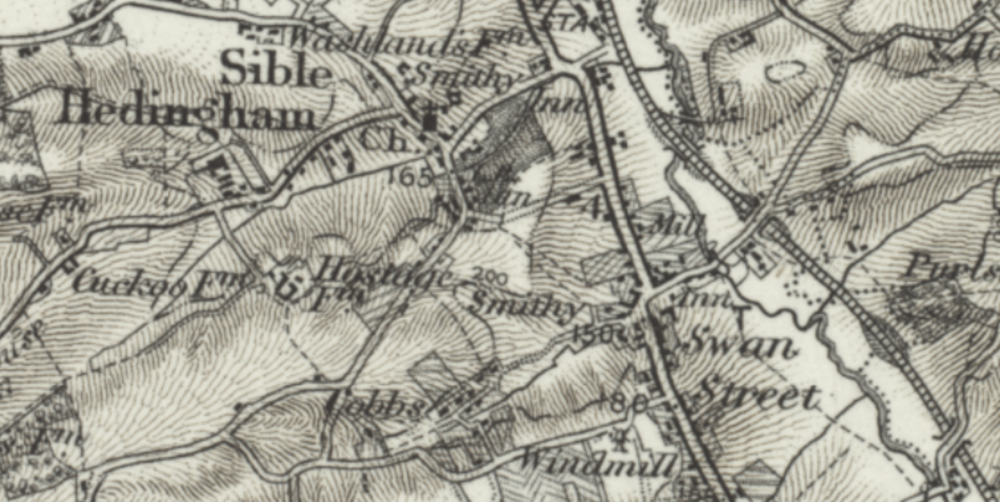

# Hedingham Witchcraft Case

I came to this story by way of a report in the *Glasgow Herald* of Saturday, 17 September, 1864, in a report on the Carrick witch case, lameting that "[s]carcely a week passes over our heads that we do not hear of fortune-tellers and other professors of the supernatural art being sent to prison for deceiving a credulous public":

> Only a few months ago a wretched old man lost his life in the heart of England, because the wife of a publican considered herself bewitched through his cantrips. Her faith in the supernatural, and in the "evil eye" of the old man, was shared by the populace, and the result was a riot, a ducking of the supposed wizard, and ultimately a death.

The tale is set at the Swan Inn, in Sible Hedingham, Essex, which closed as a pub in the early 2000s.

https://britishnewspaperarchive.co.uk/viewer/bl/0000225/18630828/019/0003
Chelmsford Chronicle - Friday 28 August 1863

Hedingham Special Session, August 25.

Before A. Majendie Esq., C. B. Sperling. L. J. Way, Eaqrs.; and Revds. W. K. Burton, and J. Foster.
...

Alleged witchcraft.—Extraordinary case.

*Emma Smith*, a married woman, of Ridgwell, *Samuel Stammers*, builder, and *George Gibson*, bricklayer, of Hedingham, were charged with the following extraordinary and cruel assault upon an old deaf and dumb Frenchman, whose name is unknown, his sobriquet being "Dummy." —Mr Cardinall prosecuted; Mr. Jones defended the male prisoners.—Mr. Cardinall, in his opening address, stated that prisoner Emma Smith alleged that she was bewitched, and believed that the old man had practised the evil art upon her, and this had led to the assault upon a defenceless old man of seventy.—John Pettit, a shoemaker, of Sible Hedingham, deposed: On Monday evening, August 3rd, I was at the Vivan public-house, at Sible Hedingham; there were about 20 people in the tap-room, among them were the prisoners and old Dummy; Gibson and he danced about the room, and Gibson wanted him to kiss Mrs. Smith, but he did not; Mrs. Smith said she would give Dummy three sovereigns to go home with her; I afterwards saw him outside the house, sitting on the ground: Mrs. Smith caught hold of him and dragged him on the ground towards the brook, and I thought both went into the water; I saw the old man in the brook, and Mrs. Smith was gone away; he went to the opposite side, but Mrs. Smith pushed him back; she did this several times, but at length he got out and sat down on a heap stones; the woman struck him several times with a stick on the head and shoulders; I told her not to do so, and she then kicked him; there was a crowd of peopie standing by; George Jenkinson offered to see the old man home, and Dummy went off down the lane, along which the brook runs; presently I heard a splash, and on going up the lane I saw the old man in the water again; Mrs. Smith was by the side of the brook, and the prisoner Stammers was helping the old man out; Gibson was not there; I heard a woman's voice call out, "Swim him in the mill-head." —Henrietta Garrod, ten years of age, stated: I saw Gibson and Dummy dancing in the Swan; they fell down once; he tried to make Dummy kiss Mrs. Smith; Mrs. Smith slapped Dummy's face; Gibson gave him some beer about a quarter past eleven o'clock; I heard a noise and went down to the Swan again; I saw Dummy sitting on a stone-heap, and Mrs. Smith shoved him into the brook; I saw Stammers shove him into the water once; Mrs. Smith pushed the old man in the water several times; she asked for his stick, and presently I saw her with it; she struck Dummy on the head twice, and repeatedly across the shoulders; she called him a devil, and said the would serve him out as he had served her out; then somehow he got near the water, and Mrs. Smith shoved him in; he tried to call out "murder;" Smith took hold of his shoulders and Stammers took his feet, and they rolled him into the brook; I saw Stammers jump in and get him out; I am sure he put him in first; they got him out and laid him on the grass; Mrs. Bruty and others then got him home.—George Jenkinson stated: I was in the tap-room and saw Gibson and Dummy dancing; Gibson said to Mrs. Smith, "You had better make it up," and wanted her to kiss Dummy; they drank together; I saw Dummy come outside and sit down by the window; Mrs. Smith declared he should go home with her; she threw his hat into the brook, dragged him to the water and pushed him in; she shoved him back when he attempted to get out; he got to a heap of stones and laid there some time; he laughed once, but it might be a defiant laugh; he was then lifted up, and Stammers and he went towards home; I afterwards saw Mrs. Smith try put him into the brook again; I saw no one else try; Mrs. Smith called for some one to help her shove him in; there was about a foot of water there; I called out that he would be drowned; Stammers was close by, and jumped in to get the old man out; no one interfered to prevent this treatment.—Sarah Ann Bruty proved that she saw Mrs. Smith strike Dummy on the head, and drag him towards the water; she (witness) then went indoors, but afterwards came out, helped him out of the water, and went home with him to his hut.—W. V. Fowke, Esq., guardian of Sible Hedingham (at whose instance the prosecution was instituted), described the old man's condition on the following morning, when was in a state of collapse, and greatly bruised upon the head and shoulders; his clothes, in which he had slept, were wet and muddy, and he screamed when he was undressed; he was removed to the Halsted workhouse on the following day.—Mr. A. Megget, assistant to D. Sinclair, Esq., medical officer of Halsted union, stated that he examined the old man on the 5th instant at the workhouse, and found him suffering from bruises upon the arms, head, and shoulders, and from bronchitis recently contracted; he was now confined to his bed, and in very great danger, although not absolutely in dying circumstances.—After retiring to consult, the bench discharged the prisoner Gibson, and acceded to Mr. Cardinall's application for adjournment of the case to the next bench-day.—The Chairman directed Mrs. Smith be retained in custody, and Stammers to find two sureties of £50 each and himself in £50, or to remain custody.—The inquiry lasted more than three hours.

https://britishnewspaperarchive.co.uk/viewer/bl/0001325/18630829/125/0005
Suffolk Chronicle - Saturday 29 August 1863

Alleged Witchcraft.—At Castle Hedingham Petty Sessions, on Tuesday, Emma Smith, a married woman, of Ridgwell, Samuel Stammers, builder, and Oeorge Gibson, bricklayer, of Sible Hedingham, were charged with the following extraordinary and cruel assault upon an old deaf and dumb Frenchman, whose name is unknown, his sobriquet being "Dummy."— Mr. Cardinall prosecuted, and in his opening address stated that the prisoner Emma Smith alleged that she believed that the old man bad practised the evil art upon her, and this had led to the assault upon a defenceless old man of 70.—On Monday evening, August 3rd, the prisoners and "Dummy," with a number of other people, were in the tap-room at the Vivian public-house at Sible Hedingbam. Gibson and "Dummy" danced about the room, and the former wanted him to kiss the woman Smith, but he would not. The prisoner Smith wanted "Dummy" to go home with her, and afterwards as the old man was sitting on a heap of stones outside, Mrs. Smith shoved him back, dragged him to a brook, and pushed him in, and also struck him with a stick. Stammers also shoved the old man into the water. "Dummy" was helped home to his but, and the next morning was examined by Mr. Megget, assistant to the medical officer of the Union, who found him suffering from bruises on the arms, head, and shoulders, and bronchitis recently contracted. He is now confined to his bed, and in very great danger, though not in dying circumstances.—Gibson was discharged, and Smith and Stammers remanded, the latter being admitted to bail.

https://britishnewspaperarchive.co.uk/viewer/bl/0004236/18630904/030/0002
Essex Weekly News - Friday 04 September 1863

Extraordinary Case of Withcraft

At a special session held at Castle Hedingham on the 25th ult. the following singular case was heard:—

*Emma Smith*, a married woman, of Ridgewell, *Samuel Stammers*, builder, and *George Gibson*, bricklayer, of Sible Hedingham, were charged with the following extraordinary and cruel assault upon an old deaf and dumb Frenchman, whose name is unknown, his sobriquet being "Dummy."

Mr. Cardinall prosecuted; Mr. Jones defended the male prisoners.

Mr. Cardinall, in his opening address, stated that the prisoner Emma Smith alleged that she was bewitched, and believed that the old man had practiced the evil art upon her, and this had led to the assault upon a defenceless old man of seventy.

John Pettit, a shoemaker, of Sible Hedingham, deposed: On Monday evening, August 3rd, I was at the Vivian public-house, at Sible Hedingham; there were about 20 people in the tap-room, among whom were the prisoners and old Dummy; Gibson and he danced about the room, and Gibson wanted him to kiss Mrs. Smith, but he did not; Mrs. Smith said she would give Dummy 3 sovereigns to go home with her; I afterwards saw him outside the house, sitting on the ground; Mrs. Smith caught hold of him, and dragged him on the ground towards the brook, and I thought both went into the water; I saw the old man in the brook, and Mrs. Smith was gone away; he went to the opposite side, but Mrs. Smith pushed him back; she did this several times, but at length he got out and sat down on a heap of stones; the woman struck him several times with a stick on the head and shoulders; I told her not to do so, and she then kicked him; there was a crowd of 40 or 50 people standing by; George Jenkinson offered to see the old man home, and Dummy went off down the lane, along which the brook runs; presently I heard a splash, and on going up the lane I saw the old man in the water again; Mrs. Smith was by the side of the brook, and the prisoner Stammers was helping the old man out; Gibson was not there; I heard a woman's voice call out, "Swim him in the mill-head."

Henrietta Garrod, ten years of age, stated: I saw Gibson and Dummy dancing in the Swan; they fell down once; Gibson tried to make Dummy kiss Mrs. Smith; Mrs. Smith slapped Dummy's face; Gibson gave him some beer; about a quarter past eleven o'clock I heard a noise and went down to the Swan again; I saw Dummy sitting on a stone-heap, and Mrs. Smith shoved him into the brook; I saw Stammers shove him into the water once; Mrs. Smith pushed the old man in the water several times; she asked for his stick, and presently I saw her with it; she struck Dummy on the head twice, and repeatedly across the shoulders; she called him a devil, and said she would serve him out as he had served her out; then somehow he got near the water, and Mrs. Smith shoved him in again; he tried to call out "murder," when Mrs. Smith took hold of his shoulders and Stammers his feet, and they rolled him into the brook; I saw Stammers jump in and get him out; I am sure he put him in first; they got him out and laid him on the grass; Mrs. Bruty and others then got him home.

George Jenkinson stated: I was in the tap-room, and saw Gibson and Dummy dancing; Gibson said to Mrs. Smith, "You had better make it up," and wanted her to kiss Dummy; they drank together; I saw Dummy come outside and sit down by the window; Mrs. Smith declared he should go home with her; she threw his hat into the brook, dragged him to the water, and pushed him in; she shoved him back when he attempted to get out; he got to a heap of stones and laid there some time; he laughed once, and it might be a defiant laugh; he was lifted up, and Stammers and he went towards home; I afterwards saw Mrs. Smith try to push him into the brook again; I saw no one else try; Mrs. Smith called for some one to help her shove him in; there was about a foot of water there; I called out that he would be drowned; Stammers was close by, and he jumped in to get the old man out; no one interfered to prevent this treatment.

Sarah Ann Bruty proved that she saw Mrs. Smith strike Dummy on the head, and drag him towards the water; she (witness) then went indoors, but afterwards came out, helped him out of the water, and went home with him to his hut.

W. V. Fowke, Esq., guardian, of Sible Hedingham (at whose instance the prosecution was instituted), described the old man's condition on the following morning, when he was in a state of collapse, and greatly bruised upon the head and shoulders; his clothes, in which he had slept, were wet and muddy, and he screamed when he was undressed; he was removed to the Halsted workhouse on the following day.

Mr. A. Megget, assistant to D. Sinclair, Esq., medical officer of Halsted union, stated that he examined the old man on the 5th inst. at the workhouse, and found him suffering from bruises upon the arms, head, and shoulders, and from bronchitis recently contracted; he was now confined to his bed, and in very great danger, although not absolutely in dying circumstances.

After retiring to consult, the Bench discharged the prisoner Gibson, and acceded to Mr. Cardinall's application for an adjournment of the case to the next bench-day.

The Chairman directed Mrs. Smith to be retained in custody; and Stammers to find two sureties of £50 each, and himself in £50, or to remain in custody.

The inquiry lasted more than three hours.

https://britishnewspaperarchive.co.uk/viewer/bl/0004236/18630904/030/0002
Essex Weekly News - Friday 04 September 1863

CAN SUCH THINGS BE IN ESSEX?

Most readers of newspaper literature have occasionally seen paragraphs headed "Witchcraft in the Nineteenth Century," and the intelligent and reflecting portion have doubtless been pained upon perusing the acoounts of superstitious proceedings and revolting barbarities inflicted upon inoffensive persons by brutalised men or women, under the belief that the victims of their enmity were in possession of some secret power which enabled them to inflict injuries or cause calamities to overtake them.

Most of us can recollect the impression made upon our youthful minds, in our school-days, while endeavouring to master the "rudiments of English history," by the facts recorded respecting witches and sorcerers, and the tests applied to prove, as it was supposed they would, the guilt or innocence of the poor souls who had acquired this unenviable and dangerous reputation—such tests, for instance, as compelling them to walk upon hot irons, and throwing them, bound hand and foot, into rivers and dreams. If they floated, their innocence was regarded as satisfactorily proved, while, on the other hand, if they sank, as they of course must under such circumstances, they were left to die unpitied sod unassisted, and condemned not only by their self-elected judges, but by the voice of the people, as guilty of witchcraft. In a somewhat modified form, thse superstitious outrages were continued upon persons suspected of possessing the "evil power" until within the last hundred years; but it seems almost incredible that only ten days ago, at Hedingham, in this county, a woman should be found so far destitute of the soft and gentle qualities which characterise her sex as to practise a series of assaults upon a poor old man of seventy years of age, and plunge him, not once, but repeatedly, to the danger of his life, into a stream, because—so the report informs us— "she alleged that she was bewitched, and believed that the old man had practised the evil art upon her!" The details of the case will be found in another column, and the evidence seems most clearly to establish the charge laid against a Mrs. Smith and one of two working men who appear to have aided her in her savage task. This woman Smith, acting upon the supposition above-named, dragged the defenceless old man — who, by-the-bye, is a Frenchman, bearing the sobriquet of "Dummy,"—to the side of a brook, and pushed him into the water; the old fellow managed to crawl out, but was again and again thrust back by his feminine tormentor, who repeated the cowardly and unfeminine amault "several times," and even went so far as to suggest that they should "swim" the old man "in the mill-head." Fortunately, however, for her, further outrage was nut perpetrated, and the woman —if we may so far mis-use the term — assisted by one if not both of the men, contented herself with ill-treating her grey-haired victim until he was completely exhausted. Fortunately, we say; for had her assistants responded to her call, and put the old man in "the mill-head," both they and herself would without doubt have been at this moment awaiting their trials upon a much more serious charge—manslaughter at least —murder in all human probability. According to the medical evidence, the aged sufferer was confined to bed and in a dangerous condition forty-eight hours after he had been released from the inhuman grasp of the woman and her brutal assistant or assistants, as the case may he. Whether two or three were engaged in the cowardly deed matters but little: those who joined in it knocked out nearly, though not quite all, the little remaining vitality the old man possessed, and left him in a most pitiable state of exhaustion.

The facts of this sad case disclose a low state of morality on the part of the old man, equalled in the woman by an absence of all human feeling and compassion. The atrocity of the circumstances was so glaring, that Mr. Fowke, one of the guardians of the parish of Sible Hedingham, thought it his duty to submit the matter to magisterial investigation; and after a hearing of three hours the Bench adjourned the case to a future day. At the time we write the result of the second hearing has not reached us, but we trust, in the name of humanity, that the guilty parties will receive such punishment as will not only deter them from repeating such dangerous and cruel practices, but act as a public example. Further comment is almost superfluous. We are here shown that we have yet much to do in the work of education and enlightenment ere our own advanced county is freed from the superstitious and cruel usages of the past —though for its credit we may say we believe the parties guilty of this fiendish onslaught upon a poor old man represent but an infinitesimally small portion even of the most degraded and uneducated to be found within its borders. Pity rather than indignation should be the feeling aroused in our minds upon perusing these painful particulars, combined with a vigorous earnestness of purpose on the part of each and all of us to do our share in disseminating knowledge and education throughout the length and breadth of the land.

https://britishnewspaperarchive.co.uk/viewer/bl/0000165/18630909/010/0002
Essex Standard - Wednesday 09 September 1863

The Recent Assault at Hedingham.— On Friday last the old man "Dummy," who was assaulted in an extraordinary manner at Sible Hedingham about a month since, expired at the Union Workhouse. The case, it will be remembered, was adjourned at the last bench, in consequence of the serious condition of the old man; and it is intended to hold an inquest on his remains.

https://britishnewspaperarchive.co.uk/viewer/bl/0000225/18630911/019/0003
Chelmsford Chronicle - Friday 11 September 1863

HALSTED.

THE WITCHCRAFT CASE AT HEDINGHAM.

DEATH THE VICTIM.

The case af the old Frenchman, known the name of Dummy, who was assaulted by Emma Smith (assisted by two men named Stammers and Gibson) under the belief that he had bewitched her, has assumed a much more serious aspect by the death of the victim of their superstition and brutality. The old man died in the union-house on Friday laat. This made an inquiry before the coroner necessary, and the inquest was held at the union-honse on Monday last.

John Pettit, ahoomaker. Hedingham, deposed— On Monday, August 3rd, I saw deceased sitting on the road outside the Swan at Hedingham; there was crowd outside; a woman named Emma Smith stood by his side; she wanted him to go home with her and she wonld give him three sovereigns; a man named Samuel Stammers also stood by; after deceased refused to go home with Mrs. Smith she began to drag him towards the brook; he got on his feet after a while when near the brook, and I thought both went in; I saw deceased lying in the brook; I saw Mrs. Smith push him back again, and he fell back into the water; she pushed him back again, when he tried to get out; he afterwards got out, and Mrs. Smith then beat him with his stick upon the shoulders; I told her not to do so; she kicked him; they went down the lane and soon after I heard s splash; I went, and saw deceased in water; Stammers was lifting him up in the water; Mrs. Smith was close by; they got him out and laid him on the grass; he made a noise as of water in his throat; he tried to get in at Ames' and the Swan, but afterwards was led home to his hut; I wished him to change his clothing; I then left; he had a cough upon him before this happened.

Henrietta Garrad (10 years) repeated the evidence she formerly gave, to the effect that Mrs. Smith beat deceased across the head and shoulders with a stick, called him an "Old devil," and said she would serve him out as he had served her out; he tried to bite her, but she dragged him to the brook, and shoved him into the middle; after he got out they put him in again.

W. V. Fowke, Esq., deacribed deceased's state on the following morning, when he found him wet and cold, having lain in his wet clothes, which were covered with mud and slime; witness had him undressed and looked after; he appeared to be in great pain when his clothes were being removed; on the 6th he was removed to Halsted union workhouse.

Mr. A. Megget, assistant to D. Sinclair, Esq., stated—I attended Dummy on hia arrival at the workhouae; he was much exhausted and had bruises upon his arm and shoulder; he died on Friday last; he labored under affection of the lungs; I have to-day assisted at a *post-mortem* examination; there was extensive disease of long standing; the lungs were inflamed and there was adhesion of the pericardium to the heart of long standing; the kidneys were diseased; the proximate cause of death waa pneumonia, caused by immersion; there were symptoms of long-standing bronchitis.

George Jenkins, barber, Hedingham, spoke to the treatment deceased received at the hands of the parties.

D. Sinclair, Esq., stated—I attended Dummy at the workhouse; he had bruises on the right shoulder, and pointed to his left side, as if suffering there; his breathing was quiet, and he was without fever; in a day two fever and coughing came on; I examined him with stethescope and found the usual symptoms of bronchitis in front, and posterior inflammation of the lungs; I have made a *post mortem* examination, and found both lungs thoroughly disorganised: the kidneys were diseased; the heart was adhering to the pericardium; the cause of death was disease of the lungs and kidneys, resulting from immersion and sleeping in wet clothes.

The inquiry was here adjourned.

https://britishnewspaperarchive.co.uk/viewer/bl/0000225/18630918/028/0003
Chelmsford Chronicle - Friday 18 September 1863

HALSTED. Petty Session, Sept. 15. Before R. Hills, Esq., chairman; E. Brett, Esq., B. Hirvey, Esq., and Capt. Brett. 

THE CASE OF WITCHCRAFT AT HEDINGHAM.

On Friday this inquiry was resumed, and several additional witnesses were examined, who, however, threw no further light upon the case. —Edward Heckford stated: I saw Dummy inside the Swan, sitting upon heap of stones; I saw Mrs. Smith throw his hat into the brook; she then dragged him towards the water and shoved him in; Stammers went round to the other side and shoved Dummy back into the water, they kept him muddling about in the water for quarter of an hour or 20 minutes; when he got out Mrs. Smith offered him £3 to go to Ridgwell with her; they went down Water-mill-lane; I followed with the crowd, and when a little way down the lane I heard a splash in the water; I went up to the spot and saw Dummy in the water, I believe with his face downwards; the water was about one and a half feet deep there; I called out, "For God's sake, the poor old gentleman will be drowned;" Mrs. Smith was standing there, and Stammers instantly jumped in and got Dummy out; I don't know where he came from: I was about four rods off when I heard the splash; Dummy groaned and appeared to be choked in the throat; I swear I never told two persons that I had seen the whole affair, only that I saw him taken out—James Drury, innkeeper, Sible Hedingham, subsequently called, stated: On Tuesday last Hickford told me that he saw Mrs. Smith and Stammers get the old man in; he said Smith had him by the shoulders and Stammers by the heels, and they threw him in; he repeated this statement yesterday.—Heckford was then re-called, and again positively denied that he had made any such statement, but the police intimated that they were prepared to produce two other persons to whom he had made a similar statement.— It was stated by Mr. Cardinall (who watched the case for the prosecution) that Heckford would be prosecuted for perjury.—Two young women, named Parmenter and Brown, swore positively that they did not see any one shove the old man into the water, although at the time they were but two or three yards from the spot.—At four o'clock (after five hours' sitting) the Coroner summed up. He expressed his entire belief in the evidence of the girl, Henrietta Garood, who had deposed that Stammers assisted Mrs. Smith in throwing Dummy into the brook, and pointed out that the jury, by returning a verdict against both parties, would not decide the case, but only refer it to a petty jury.—The room was then cleared; but the jury, after nearly two hours' warm discussion, were unable to come to a unanimous decision. It was understood that all were unanimous to return a verdict of manslaughter against Mrs. Smith, but two jurymen refused to do so with respect to Stammers. A lengthened conference took place with the coroner, who ultimately discharged the jury, and the entire case will soon come before the bench of magistrates.

https://britishnewspaperarchive.co.uk/viewer/bl/0001120/18630922/031/0003
Tiverton Gazette (Mid-Devon Gazette) - Tuesday 22 September 1863

THE HEDINGHAM WITCHCRAFT CASE.— The adjourned inquest on the body of the poor old Frenchman, who went by the name of Dummy, has led to no definite result. It will be remembered that he met his death in consequence of a ducking he had been subjected to by a Mrs. Smith, aided by two men, one of whom was named Stammers, because Mrs. Smith believed the feeble old man had bewitched her, and because he would not accept £3 from her, and go to her house and annul the charm. They pushed him two or three times into the brook, and when he escaped to his hut he slept all night in his wet and slimy clothes. He died in consequence, notwithstanding subsequent careful tending at the workhouse. The jury, after nearly two hours' warm discussion, were dismissed, not being able to agree. It was understood that all were unanimous for a verdict of manslaughter against Mrs. Smith, but two jurymen would not consent to a similar verdict against Stammers. The entire case will soon come before the Hedingham bench of magistrates.

https://britishnewspaperarchive.co.uk/viewer/bl/0000225/18630925/009/0002
Chelmsford Chronicle - Friday 25 September 1863

THE HEDINGHAM WITCHCRAFT CASE.

The jury, at the inquest on "Dummy," being unable to agree, the case, as before stated, was left to the magistrates of the Hedingham bench. Accordingly on Tuesday, *Emma Smith*, 36, and *Samuel Stammers*, 28, were placed at the bar, before N. C. Barnardiston, A. Majendie, L. J.Way, L. A. Majendie, and C. B. Sperling, Esqrs., and Revds. C. J. Goocn. W. K. Borton, and J. Foster, charged by Superintendent Elsey with having unlawfully assaulted an old Frenchman, called Dummy, on the night of the 3rd August, having thereby caused his death on the 4th inst.

From the extraordinary circumstances connected with the case the greatest interest was manifested in the proceedings, and the court was crowded. The female prisoner is the wife of a beershop-keeper in the village of Ridgewell, about six miles from Hedingham, and Stammers is a master carpenter in a small way of business. It is a somewhat singular fact that nearly all of the sixty or seventy persons concerned in the outrage which resulted in the death of the deceased man were of the small tradesmen class, and that none of the agricultural laborers were mixed up in the affair. It is also stated that none of those engaged were in any way under the influence of liquor.

The victim of this superstition was a deaf and dumb Frenchman, whose age was about 80—some persons suppose about 86. Being unable to express himself, and being of a somewhat vivacious disposition, he was accustomed to make use of energetic and somewhat grotesque gestures, and was regarded for some time past with considerable awe. He lived alone in a wretched hut. Who the unfortunate Frenchman was or whence he came cannot now be ascertained. For the last seven or eight years he resided in Sible Hedingham, and previous to that he lived in Braintree. There was little doubt that he gained his living to a great extent by telling fortunes, if not by pretences to witchcraft. Some hundreds of scraps of paper were found by the police in his hut after his death, and upon most of them were written questions, which neither in their style nor sübject-mattar say much for the enlightenment of the district. The following are fair samples:— "Her husband have left her many years, and she want to know weather he is dead or alive." "What was the reesen, my sun do not right i meen that solger." "Do you charge any more?" The answer to this query was doubtless satisfactory, for the momentous question was then put, "Shall I ever marry?" letters from girls to their sweethearts were also found, with "Shall I marry?" and "How many children shall I have?" written in pencil on them. The most business like of all the notes was the curt one, "Did you say we kild your Dog. If you did I will send for policeman." Nor were his patrons altogether confined to the lower orders. One letter states that the lady was "cumen herself on Mondy to see yoo, and gave yore oll them things and the shillen."

In the hovel were found, besides between 400 and 500 walking-sticks, a quantity umbrellas, some French books, a number of tin boxes, a bag of foreign coins, chiefly of the French Empire, and about a ton of rubbish which it was found impossible to classify in the inventory that was taken. The most definite ideas about the man have been suggested by the following questions which have been found written *seriatim* on a scrap of paper:— "Were you born at Paris?" "The name of the town where you were born." "Where was your tongue cut out? "Le nom de votre ville." The answers were, no doubt, made by signs.

Mr. Cardinall appeared to conduct the prosecution against the prisoners; and Mr. Jones defended Stammers. Mrs. Smith was undefended. Stammers is a very respectable-looking man; and the female prisoner appeared quite faint, and was accommodated with a chair.

Mr. Cardinall, in opening the case, said, the circumttances of the acts which led to the death of the deceased man appeared to him to constitute the crime of murder. Most of the witnesses were singularly unwilling to give evidence, yet he thought that he would be able to show that the crime was one in the highest category; but it would be for the bench to decide upon what charge the prisoners should be committed for trial.

John Petitt, the little girl Garrod, and the other witnesses repeated the evidence which has been more than once reported as to what passed at the public-house, and the putting of the old man in the river.

Mr. Sinclair, surgeon to the Halsted union, said that on Thursday, the 5th of August, the deceased was brought in; there were bruises on the shoulders; he pointed to indicate that he was hurt on the back of the head, the shoulder, and the left side; in a day or two afterwards indications of chest affection showed themselves; there was inflammation of the lungs and bronchitis; death took place on the 4th September; the *post mortem* examination showed that there was total disorganisation ofthe lungs, that the kidneys were diseased, and that there had been recent inflammation of the brain; death was attributable to those causes combined, but more especially in the disease in the lungs and kidneys; having heard the whole of the evidence just given, he was of opinion that the treatment deceased had received gave rise to a great shock to the system, producing fever, which set up the causes which resulted in death; the immersion in water, and sleeping in wet clothes, would produce fever; the blows described had not, in his opinion, caused death; he had no doubt whatever that death resulted from the treatment deceased received.

Mr. Jones addressed the bench on behalf of his client Stammers, contending that the only material evidence against him was given by the girl Garrod, who had prevaricated, he asserted, in several important particulars. He proposed to call witnesses to prove the discrepancies in her evidence; but the bench said that would not alter their decision.

The Chairman said that the bench had resolved to send both prisoners for trial at the next assizes.

The prisoner Emma Smith was then formally asked what she had to say why she should not be committed for trial. She replied in a peculiar voice, and evidently under the influence of some superatitious fear, that she would tell the truth. That man came to her house first; spat upon her, and told her that after time she should be ill, and she was ill. a doctor came to her twice in one night, but could not cure her; the man (Dummy) came to her shop ten months ago and asked leave to sleep in her shed; she let him, but in a few days, when she wanted him to leave, he made signs and wrote upon the door that she should be ill in ten days; he made her ill and bewitched her, and she went everywhere, but no one could set her right again she was afraid, for no medical man could do her any good.

The Chairman. Are you aware of the nature the charge against you; that you caused the death of deceased by your conduct on the 3rd August?

The prisoner. That night! I will tell the truth. That night I went to the Swan very bad; I went up to the old gentleman and asked him to go home with me, to do me good; he said he would not go; Gibson took him up and put him in my face, as said to kiss me, bnt I did not want to do that, as I had a husband of my own. A number of plaiters (of straw for bonnets) came in and said. "How bad this woman is." There were forty or fifty people there, few of them men; they got him out; some shoved him, some ttoned him, and did more to him than I did; I begged and prayed that he would go home with me, but he declared he would not unless he liked; I do not deny that I put my hand to his head, but I was so bad I could not lift a dog; and this man here (Stammers) took him by the heels and thighs and threw him in the water, and then he (Stammers) jumped in and got him out. I may die any moment. There was one there who did not touch him, and that was Mrs. Bruty, who said she was afraid of him. That is the truth.

Stammers simply said he was not guilty.

The Chairman committed the prisoners Chelmsford Gaol for trial at the March assizes.

Bail was accepted afterwards for Stammers, himself in £50 and two sureties of £50 each. Similar bail would have been taken for the female prisoner, but as it could not be procured she was conveyed to prison.

https://britishnewspaperarchive.co.uk/viewer/bl/0000348/18630930/037/0007
Taunton Courier and Western Advertiser - Wednesday 30 September 1863

THE HEDINGHAM WITCHCRAFT CASE.

On Tuesday, Emma Smith and Samuel Stammers were charged, at Castle Hedingham, with having caused the death of a poor old Frenchman, who was called Dummy, by putting him into a brook, when already suffering from a severe illness. The female prisoner was the wife of a beershop-keeper in the village of Ridgwell, about six miles from Hedingham, and Stammers a master carpenter, in a small way of business. It was a somewhat singular fact that nearly all of the 60 or 70 persons concerned in the outrage which resulted in the death of the deceased man were of the small tradesmen class, and that none of the agricultural labourers were mixed up in the affair. It is also stated that none of those engaged were in any way under the influence of liquor. The victim of this superstation was deaf and dumb, and his age was supposed have been about 86 years. Being unable express himself, being of a somewhat vivacious disposition, he was accustomed to make use eaergetis and somewhat grotesque gestures, which caused him to be regarded with considerable awe. He lived alone, in a wretched hut. Who he was, or whence he came, could not be ascertained. For the last seven or eight years he had resided in Hedingham. There is little doubt that gained his living to a great extant by telling fortunes, if not by pretence to witchcraft. Some hundreds of scraps of paper were found by the police in his hut after his death, and upon most of them were written questions. The following are fair samples:—"Her husband have left her manny years and she wants to hnow whether he is dead or alive." "What was the reason my sun does not right i that solger." "Do you charge any more?" The answer to this query was doubtless satisfactory, for this momentous question was then put, "Shall I ever marry?" Love letters from girls to their sweethearts were also found, with "Shall I marry?" and "How many children shall I have?" written in pencil on them. The most business-like of all the notes was the curt one, "Did you say we Kild your Dog. If you did I will send for the policeman." Nor were his patrons altogether confined to the lower orders. One letter states that the lady was "comen herself on Monday to see yoo, and she gave you oll them things and the shillen." In the hovel were found, besides, between 400 and 500 walking sticks, a quantity of umbrellas, some French books, a number of tin boxes, a bag of foreign coins, chiefly of the French empire, and about a ton of rubbish which it was found impossible to classify in the inventory that was taken. The evidence on Tuesday was substantially a repetition of that already given before the Coroner's inquest. At its close, the Chairman, said that the Bench had resolved to send both prisoners for trial at the next assizes. The prisoner, Emma Smith, was then formally asked what she had to say. She replied, in a peculiar voice, that she would tell the truth. The man had come to her house first. He spat upon her, and told her that after a time she should be ill, and she was ill. A doctor came to her twice in one night, but could not cure her. The man Dummy came to her shop ten months ago and asked leave to sleep in her shed. She let him, but in a few days, when she wanted him to leave, he made signs, and wrote on a door that she would be ill in ten days. He made her ill, and bewitched her, and she went everywhere, but no one could set her right again. She was afraid no medicine could do her any good.—The Chairman: Are you aware of the nature of the charge against you, that you caused the death of the old man by your conduct on the 3rd of August?— The prisoner: That night I went to the Swan very bad, I went up to the old gentleman and asked him to go home with to me do me good. He said he would not go. Gibson took him up and put him in my face, and told him to kiss me, but I did not want to do that as I had a husband of my own. A number of plaiters of straw for bonnets came in and said, "How bad this woman is." There were forty or fifty people there few of them men. They got him out. Some shoved him, some pelted him with mud, and did more to him than I did. I begged and prayed that he would go home with me, but he shouted he would not unless he liked. I do not deny that I put my hand to his head, but I was so bad I could not lift a dog, and this man here (Stammers) took him by the heels and thighs and threw him in the water, and then he (Stammers) jumped in and got him out—Bail was accepted for Stammers. Bail would also have been taken for the female prisoner, but as it could not be procured she was conveyed to prison.

https://britishnewspaperarchive.co.uk/viewer/bl/0000225/18640311/007/0002
Chelmsford Chronicle - Friday 11 March 1864

CROWN COURT. TUESDAY.

(BEFORE CHIEF JUSTICE ERLE.)

The criminal business commenced in this court on Tuesday morning with a calendar of 20 prisoners. The following gentlemen wore sworn on the Grand Jury:—

Hon. Arthur Petre, Foreman. Sir R. Digby Neave, Bart. Sir B. P. Henniker, Bart. T. Sutton Western, Esq. M.P. P. O. Papillon, Esq., M.P. C. Gray Round, Esq. N. C. Barnardiston, Esq. T. C. C. Marsh, Esq. R. B. Wingfield Baker, Esq. Lieut.-Col. Palmer. T. B. Western, Esq. J. Gurdon Rebow, Esq. Capel Cure, Esq. J. F. Wright, Esq. J. S. Lescher, Esq.  Onley Savill Onley, Esq.  Lieut.-Col. Brise.  A. Pryor, Esq.  Edgar Disney, jun., Esq. it.  T. Kemble, Esq. J. J. Tufnell, jun., Esq. Major Skinner, R.A. G. Alan Lowndes, Esq.

The following magistrates also answered to their names:—

P. J. Budworth, Esq., J. Gurney Fry, Esq., W. W. Hawkins, Esq., W. M. Tufnell, Esq., Capt. Travers, J. C. Whiteman, Esq., R. Woodhouse, Esq. 

Chief Justice Erie, in charging the grand jury, said—Gentlemen of the grand jury, I satisfaction in giving into your charge the duties you are about to enter on. I believe that you will find the number of offences is small, and the quality is in a degree moderate. The calendar appears to me to be light for this county, warranting I trust the hope that the reign of law prevails in healthy activity throughout your population. The ordinary offences against property in the calendar admit of no useful observation. They are of the common description, and the evidence, I believe, is so well arranged as to leave no difficulty on your part in disposing of the bills brought before you. ...  There is one charge of particularly singular description, which perhaps has attracted your attention—a charge of manslaughter, the injuries being inflicted from a belief that the prisoner had suffered from the powers of witchcraft vested in the deceased, and a large number of persons in the parish seem to have firmly believed, so far as I can discover in the remedies against these powers of darkness, which were thought to be remedies hundreds of years ago—namely by considerable torment inflicted on the person supposed to possess those powers, and then seeking to clear off those powers by the application of water. First of all they plunged the man into a running brook, and that failing of effect plunged him into the millpond to test, as in olden times, whether he had the aid of the powers of darkness or not. However, he was brought out and laid on land, and I must tell you that the finding of the bill for felony will depend on this question—did the unlawful acts the prisoners shorten the life of the deceased, or in other words cause his death, and it certainly would at first seem that the injuries he received, namely, the beating, and afterwards putting into the water, brought on febrile action which, in the opinion of the medical man, shortened his life. But he appears to have been afflicted with old age and a complication of internal diseases, and it may strongly contended hereafter that these would of themselves have causod his death, which was not accelerated by the conduct of the prisoners. You will be so good as to find a bill for the felony if you are satisfied that that conduct did accelerate death. Probably you may have a little doubt on the subject, but I believe it is intendod also to prefer a bill against the prisonors for assault; and in case you may be of opinion there is not sufficient proof of the felony, you may return a true bill for the assault.

...

THE CHARGE OF MANSLAUGHTER AT SIBLE HEDINGHAM.

*Emma Smith*, 35, wife of George, and *James Stammers* (on bail), were indicted for the manslaughter of a certain person, known by the anme of "Dummy," at Hedingham, on the 3rd of August, 1863.

Mr. Pearce prosecuted; Mr. Codd defended Smith, and Mr. Philbrick Stammers.

The female prisoner, who appeared in a very debilitated state of health, was accommodated with a seat in the dock during the trial.

John Pettitt. I am a shoemaker at Sible Hedingham; I knew the deceased Dummy, who lived in a mud hut there; he was supposed to be deaf and dumb, and about 80 years of ago; on the night of the 3rd August I saw him at the Swan Inn, about ten o'clock, with a number of others, including the prisoners at the bar; the female said Dummy had bewitched her, and where he was she would be; she also said would give him three guineas to go home with her; she said had bewitched her, and had produced such an effect on her system that she could not wear any clothes; she said she would give Dummy three sovereigns to go with her, but he made signs that he would not go, and drew his hand across his throat as though to intimate he would have his throat cut first; a man named Gibson was there, and he and Dummy jumped about together, something in the way of dancing, and it seemed to that they did it to please the woman, as though they meant to cure her; Gibson said if she gave them pint beer it would be made all right; I saw them leave the house, and saw Dummy sitting on the ground outside the Swan, with the female beside him, making signs for him to go home with her; I think he got up and went off down the lane; I saw him come back and saw the woman with him again; the woman pulled him towards the brook; that time there were 40 or 50 people, chiefly women, around him; the woman pullud Dummy into the brook, and I thought she went in after him, but was not sure; I saw her turn from the brook and go round to the other side; as he was getting up a small embankment on the other side the woman put out her hand and pushed him in again; he tried to get out a second time, and she pushed him again; by means of a stick he got out, walked across the foot-bridge, and sat down on a stone; the woman took his stick from him and struck him several times on the shoulder and head; he took the stick from her and told her not to hit him on the head, as she would be responsible; she said she would not hurt him for the world, she would not hurt a hair of his head; she then began to kick him, and I told her not to do so, and she said again she would not hurt him for the world; all this time she seemed in a very strange way; I then saw Dummy go down Watermill-lane, but cannot say whether he was dragged or whether he walked; I followed him some distance and thought I heard the female call out "Fling him in the mill-head;" directly after I heard a splash in the water and went down the lane, and found the old man in the water; two people cried out "Take him out or he'll be drowned;" Stammers, with the help of a woman, lifted him out and laid him on the grass; the female prisoner was present; I asked what they had been doing, and the female prisoner replied a drunken man had fallen into the ditch; it was a moonlight night; the brook is dammed up, and the depth was about a foot and half; while lying on the grass the old man seemed to be trying to clear the water out of his throat; his clothes were wet and dirty; he laid there about 10 minutes; I took him back to the Swan; he walked part of the way himself; I afterwards went with him to his hut, two females helping him part of the way; he had a chain across the door with a padlock on, and we made signs to him for the key, but he fumbled about and could not find it; he then let himself in by moving part of the door and then came out again, when I made signs to him to shift his wet clothes, and wrap himself up as well as he could, and he made signs that he would, and kissed my hand as though he would say "Good-bye;" I then left him.

Cross-examined. There were a number of persons near the mill-head and I cannot say who pushed him; I saw a little girl named Garrad kick the old man and told her to leave off; I did not know the female prisoner before that night; while Gibson and Dummy were jumping about the tap-room I heard a noise and understood they stood fell down.

Cross-examined by Mr. Philbrick. Have known Stammers all my life and never heard anything against him; I saw Stammers crossing the brook while Dummy was in the water; the first thing I saw at the mill-head was Stammers in the water lifting the old man out; Dummy was about five feet three or four inches high.

Henrietta Garrad. I live with my mother at Sible Hedingham; we live about a quarter of an hour's walk from the Swan; on the night of the 4th August I went alone to the Swan; I went to the little bar for half a pint of beer for my mother; saw a lot of people coming out of the tap-room, Dummy among them; I saw George Dixon take Dummy round the waist and dance him round; they fell down and Dixon picked him up, set him in the corner, and offered him some beer; he then took him up and jumped him round and they fell down again; I stood in a fever to see all this; saw the woman and Stammers there; afterwards saw Dummy and Mrs Smith coming out of the Swan; she had hold of his shoulders; Dummy had a stick in his hand; Dummy sat down near the window, and Mrs. Smith made signs for him to come home with her; he made signs that he would not, and drew his finger across his throat; she said she would give him three sovereigns if he would go with her; he sat with his back to the window and laid his stick beside him; I saw Mrs. Smith take two books out of his hat; she threw the hat under the arch; she put one of the books in her pocket and the other she "plucked" all to pieces and threw in the brook, and said, "That's the book he's done me by;" I did not see anything done with the stick then; afterwards, when he was sitting stone, I saw Mrs. Smith with the stick in her hand; she drew it across his head twice, and three or four times across his shoulders and hands and arms; she said, "You old d———, you've served me out, and I'll serve you out;" I then saw her roll him down beside the bank and shove him in; she went round the other side; Stammers went through the brook, and when he was getting up the other side shoved him back; the woman had crossed over and stood just beside Stammers; did not hear Stammers say anything when he pushed him in; when Dummy got to the stone heap I again saw Stammers take him by the waist and carry him into the road; I saw a lot carry him down towards the mill-head, and somehow he got on the ground beside the water; I saw Mrs. Smith take him by the shoulders and the man by the legs and throw him into the middle of the water; I was about a yard off; saw Pettitt there, but cannot whether was looking or whether he wasn't; I saw Dummy splash about in the water, and heard somebody say, "If some one don't take him out directly the poor old man will be dead;" Stammers then lifted him out and laid him on the bank; I saw Stammers take him by his waist and lay him on the grass; while he was there I heard him make a noise with his throat as though he was trying get the "nasty stuff" out; his clothes were wet, dirty, and torn; I saw Stammers taken towards the Swan gate; he could not get in, and he left the old man there and said he would go in and have half a pint of beer; he went to the door but could not get in, and I saw no more of him; I saw the old man go to George Aimes' door, which is a yard or two off; Aimes came out and heard him say, "Poor old man, it's a shame to use him so;" I afterwards saw Mrs. Ellison and Mrs. Bruty take him by the shoulders and lead him home.

Cross-examined. I did not kick Dummy that day "as I knows on;" Pettitt did not tell me not to kick him; I saw Stammers and Mrs. Smith deliberately throw him into the water; I saw two girls named Parmenter and Brown at the mill-head.
  
Cross-examined by Mr. Philbrick. brook is not very deep; it is over shoes; he had not been in the water above two minutes before Stammers got him out.
  
George Jenkinson. I am a hair-dresser Sible Hedingham; I was at the Swan, and saw Dummy and the prisoners there; heard the female say Dummy had bewitched her, or something of that kind; I afterwards saw the old man sitting under the window and Stammers standing near him; Dummy put his hat under his legs if wished to keop him from taking it; I saw her take his hat and throw it across to the bank; the woman offered him three sovereigns go home with her, but shook his head; saw the woman lead him towards the brook; saw him the brook trying to tot out; saw Mrs. Smith cross the foot-bridge and push him back; I saw Stammers there walking about among the other people; previous to this Mrs. Smith seemed to be laboring under some mental delusion, and told a long story about her husband turning him from out-building, whon spit her and struck her with his stick, and she had been ill ever since; while was the mill-head I called out that would drowned unless was taken out directly; I saw the woman with the stick, and heard Dummy laugh dotiantly, as much to say, "You can't hurt me with that."
  
Cross-examiuod by Mr. Codd. I did not see him till he got into the mill-head; did not see Pettitt there; heard Mrs. Smith offer him three sovereigns if he would go home with ker; Mrs. Smith was in an excited incoherent state; while in the Swan I saw Dummy and Gibson dancing.
  
Cross-examined by Mr. Philbrick. I only saw Dummy standing in a leaning position in the brook; directly I said if he was not taken out of the mill-head he would be drowned, Stammers jumped in and got him out; he was not in the water more than half a minute; I have known Stammers all my life, and never knew anything against him.
  
Re-examined. I live about a quarter of a mile from Dummy's house; have known him ten years, but did not on this night observe that he was in worse than his ordinary state of health; did not see any difference in Dummy's manner after he fell with Gibson.
  
Geo. Aimos. I am a butcher at Hedingham; my shop is close to the Swan; on the night in question I saw Dummy being danced about inside the Swan; when he came home I started him off home with Hickford; I saw Stammers then, but not near Dummy; Dummy went away out of sight, but afterwards came and knocked at my door; he was dripping with water and slud, and, with others, I took, him home.
  
Cross-examined by Mr. Codd. I saw Gibson jumping Dummy about in the Swan; I got between them, and told Gibson he would hurt the old man, and they then left off and I went out; I saw Dummy fall on to Gibson once; I went to his house the next morning, and held his dog for him; he was then lying down with his wet clothes, on, but when I touched him he knew me directly and got up; he was lying on his bed with his face underneath; he got up and walked down the yard, touching his shoulder as though in pain; I saw the woman in the Swan, but did not see her interfere with him.
  
Re-examined. I did not see Stammers interfere with him at all.
  
Wm Villiers Fowke. I live at Sible Hedingham; I live upon my property; I have known Dummy six or seven years and have occasionally assisted him; in consequence of something I heard I went on the morning of the 5th August to his hut; he was lying partly on the bed and partly on the floor; his clothes were saturated with wet and mud; I helped to undress him, and when I took his shirt off he screamed out; I then saw that his shoulders and arms were bruised, as though he had been beaten with a stick; he made signs that he had been put into the water; I had a clean shirt put on him and had him put to bed; I gave means to supply him with what he wanted, and then left; I went in the evening, about seven o'clock, and he was then lying quietly in his bed, and warm; next morning I saw him again, and then went to the inspector of police and told him the case; I advised his removal to the union, but engaged no one to remove him; I suggested the propriety of his being removed, provided the medical man gave his consent.

Cross examined by Mr. Codd. I did not know that he had been ailing; I believe he had an attack of bronchitis a year ago.

Edward Hickford, who appeared to be under the influence of liquor, said—On the night in question I was at the Swan when the house was cleared; I saw the prisoners and Dummy there; I took Dummy towards his house, which was close to my home; Mrs. Smith came up and took hold of his arm, and said she would give him three sovereigns to go home with her; she led him back to the door of the Swan, and there hit him with the stick, and I saw him laugh; she then "copped" his hat in the water; I afterwards saw Dummy trying to get out of the water, and "this ere young man" (Stammers) throw him back; I saw Stammers take Dummy out of the mill-dam, but where he (Stammers) sprang from I don't know.

Cross-examinedby Mr. Codd. I had three half-pints of beer in the Swan; Gibson was dancing Dummy about, and I believe that caused his death more than putting him in the water; Gibson danced him about an hour or an hour and a half; Dummy had between seven or eight pints of beer while I was there; I saw them roll down once or twice.

Mr. Codd. Where was Gibson then?

Witness. Why along with him certainly. [Laughter.j They were rolling about altogether; Mrs. Smith was very quiet all this time; Gibson made her drink with the old gentleman.

Francis Wiseman. I am a greengrocer at Sible Hedingham; I have known Dummy three years; he would never meddle with anybody unless they meddled with him, but he was a nasty-tempered sulky man when put out; on the morning of the 5th I took him to the union in my spring cart; while going along he called out at the "jog of the cart" and appeared very sore.

Cross-examined by Mr. Philbriok. He did not fall out of the cart; when the porter took him out of the cart at the union he overswayed himself and the old man fell on the ground.

Mr. Duncan Sinclair, surgeon at Halsted. I remember seeing this old man at the union on the 6th of August; I found several bruises on the shoulders; while I was examining his shoulders he pointed to his left side and head to signify pain; he had not much fever, but his breath seemed somewhat oppressed; on the next morning he was in a much worse state; I continued attending him for five or six days when I found him laboring from difficult breathing and a considerable amount fever; I examined him and found indications of congestion of his lungs; I attended him until his death on the 4th Sept., assisted by Mr Meggitt anil Mr. Thorpe; the lungs were totally disorganised, the result of disease; the kidneys diseased; I should say these were the result of congestion and inflammation; I found in the head indications of recent inflammatory action; I have heard the evidence to-day, and I should say the appearance the lungs and kidneys was just what I should expect from immersion in the water and lying all night in his wet clothes.

Cross-examined. I had never seen the man before; he was a very old man; I examined him with the stethoscope, and found inflammation of the lungs, I should say, not of long standing; I ordered stimulants for him; I should think sleeping in the clothes would be sufficient to cause bronchitis; I cannot say that simple immersion would do so.

Cross-examined by Mr. Philbrick. He died of disease of the kidneys; I should say that disease was subsequent to immersion; there were no traces of violence at the *post mortem* examination; the bruises he had when I first saw him were only slight; the lungs were diseased, and there was an affection of the heart of long standing.

Mr. Archibald Meggitt, assistant to last witness. I first saw the old man the evening of the 5th, when brought to the union; I agree with last witness as to the symptoms shown, the cause of death, and the probability of death being caused by the treatment he spoke to.

Mr. Pearce. Mr. Thorpe is also here, but I don't purpose to call him; it is the same thing over and over again.

Mr. Philbrick. One of the witnesses spoke to two girls named Brown and Parmenter being present while the man was in the water; those names are on the back of the bill, and I should like them to be called.

Mr. Pearce. Certainly. have taken necessary steps to have them here.

Ellen Parmenter, examined by Mr. Philbrick. I was close by when Dummy was in the mill-head; I did not see him put in or taken out; I saw Stammers near the Swan just before Dummy was put into the water; I cannot say whether Stammers put him in or not.

Mr. Pearce. You may stand down.

Ellen Brown, examined by Mr. Philbrick. I did not see anything done against the mill-head; I saw Stammers in the water taking the old man out, but did not see him put in; I heard a splash, and about a minute or two after saw Stammers getting him out.

By Mr. Pearce. I did not see the girl Garrad there.

This was the case for the prosecution.

Mr. Codd, in addressing the jury on behalf of the female prisoner, said the charge against her was that on this 3rd of August she caused this man to be immersed in the water, and thereby accelerated his death, which took place on the 4th September, and unless they were satisfied not only that this woman took part in the immersion, but that such usage as he then received accelerated his death they could not convict her. Before commenting on the evidence which had been laid before them on behalf the prosecution, let him call their attention to one most singular feature in this singular ease, for it was a very singular case, and probably they could scarcely believe it credible that in this 19th century such a thing could take place within only a short distance from the metropolis of the country. The most remarkable feature in the case was that this girl Garrad, this child between six and seven years of age, was the only person who spoke to seeing the female prisoner put this poor man into the water, though if it did take place numbers upon numbers of persons must have seen it who might have been called there to-day. He pointed out what he considered discrepancies in the girl's statement compared with the evidence of the other witnesses, and said, after all, the great question for them to decide was whether by the immersion in the water the death was accelerated which took place on the 4th Sept. The first medical gentleman called attributed death to immersion in the water, but when he (Mr. Codd) asked him, "Do you mean that the simple immersion would have been sufficient to cause death, supposing he had not afterwards slept in his wet clothes?" he would not undertake to say that it would. He then asked him, "Supposing a man of his age slept in his wet clothes would not that be more likely to cause death than simple immersion?" and his reply was "Yes."

His Lordship said he felt bound to interrupt the learned counsel. If a prisoner inflicted injury on another person, and that person intended to take care and have good advice but consulted an unskilful man whose treatment of the injuries caused death, still the prisoner would be answerable for murder if he maliciously inflicted the injuries. he could not shift his responsibility by reason of the surgeon's want of skill supposing the surgeon to have done his best. If the prisoner inflicted an injury on this poor man bythrowing him into the water, and the man went towards home, thinking perhaps to do the best he could for himself, but lay down in his clothes and so caused his death, the prisoner would still be responsible. He knew a case of a wounded man who was taken to hospital being put into a bed which had been occupied by a patient with the erysipelas, and being taken with the erysipelas it killed him, but still the man who gave the wound was held responsible for the death.

Mr. Codd said he would bow to his lordship's decision, and proceeded to argue that though according to the medical testimony death resulted from disease of the lungs and kidneys, yet there was nothing in the evidence of the medical men to show that that disease had not been of some months' standing. All must feel that there had been a good deal of inhuman treatment towards this poor man, but it was not a question of feeling, but of evidence and of evidence alone; and taking into consideration the unsatisfactory character of the medical evidence, the treatment which this poor old man of 80 years had received from Gibson, who danced about with him for an hour and half, one tumbling over the other, and the fact that the only witness who spoke to the female prisoner helping to put deceased into water was the girl Garrad, though scores of other witnesses might be called if it were really true, he argued that upon a calm and dispassionate consideration they could not safely come to the conclusion to convict his client.

Mr. Philbrick, on behalf of Stammers, adopted the same line of defence, dwelling especially on the fact that the only real witness against him was the girl Garrad, who had been contradicted in one point by the evidence of Pettitt, who swore that he saw her kick deceased, and also by the statement of the two girls who she said were present, but who had denied her testimony in that particular. He earnestly urged them to bring a calm and dispassionate judgment to bear upon the evidence, and the evidence alone, and not to allow their judgment to be warped or their minds to be prejudiced by anything they had heard or read of this unhappy case, prior to the prisoners being placed in that dock to-day.

His Lordship very briefly summed up the evidence, pointing out to the jury that the two questions they had to consider were, first, whether the crime had been committed at all, and if so, whether the prisoners were the persons who committed it. If they were satisfied that death was occaioned by reason of his having been thrown into the water, then it would be clear that somebody was guilty of the offence, and he reminded them that the medical testimony was pretty clear as to that point; but still it did not follow hat the jury were to adopt that opinion as a matter of course if they could find any other reason to account for death. The jumping about of deceased by Gibson was worth consideration; but he must confess did not himself see anything to which he could attribute the disease which caused death except the immersion. Now, it was worthy of remark that the only witness who spoke to seeing the female prisoner throw deceased into the water was thai girl Garrad, and, looking at the woman now, it seemed almost impossible that she could do such thing; but they must judge also by what took place beforehand, and if it were true that this woman had a terrible imagination, leading her to believe that by this course some great evil put upon her by this poor man would be removed, then that would account for it. No doubt the chief, if not the only, testimony bearing against the man also was that of the girl Garrad, the other witnesses speaking to acts of kindness on his part, in helping deceased out the water, and though evidently fifty persons might have been brought there to confirm her statement, none were brought forward excepting the witness Hickford, who appeared to have to-day been anticipating the advantages he should derive from the repeal of the malt-tax— [laughter]—and who, though by no means a hostile witness, said he saw Stammers on the first occasion push deceased back into the brook. Although he regarded in the first instance the evidence of the girl with a considerable amount of doubt, yet he must say, after hearing that evidence given to-day, his opinion had been changed. It was quite clear that the girl possessed intellectual powers of a very high order. Never were ideas better conceived, nor clearer language used to express them, and he saw nothing that could induce him to distrust her in any way. She must be very bad indeed if she could imagine such a story against a fellow creature, and come into that court to tell it. He had been disposed to regard her evidence with the most scrupulous doubt because no one else had come forward to support it, but after the way in which she gave her evidence he saw no reason to doubt her story.

After a few minutes' consultation the jury found both prisoners *Guilty*.

Chief Justice Erle in passing sentence said—Prisoners at the bar, you have been convicted this felony. You used violence which caused the death of a fellow creature, helpless in his old age, helpless in his infirmity, and upon the evidence nobody can doubt that that violence hastened his end. I don't make these observations with the view of aggravating your present position. The motives which led you to act as you did may have been conceived in ignorance, and in some parts may yet be shared in by others, but although there is no punishment for ignorance, I am bound to pass such a sentence as may show to others that when these superstitious prejudices are entertained they must not be carried out to such an extent as to endanger the lives of their fellow creatures. I take into consideration the state of health of the woman, and also the fact that you, Stammers, endeavoured to get him out the moment your attention was drawn to his danger, but I am bound pass a sentence which I hope will act as an example, which is that you severally be *imprisoned with hard labor for six calender months*.

The prisoners were then removed, the female apparently being in an almost fainting state.

https://britishnewspaperarchive.co.uk/viewer/bl/0000225/18640318/024/0003
Chelmsford Chronicle - Friday 18 March 1864

THE SIBLE HEDINGHAM WITCHCRAFT CASE.

The following appeared in the *Times* of yesterday—

Sir,—I hope that in justice to myself and other residents within the parish of Sible Hedingham, you will kindly insert a few remarks with reference to the case of manslaughter tried on the 9th inst. at the Chelmsford Assizes, and reported in the columns of your widely circulated journal. Too much commendation cannot possibly be bestowed on Mr. Fowke for the pains which he has taken in bringing to punishment the perpetrators of so wanton an attack upon a poor and afflicted old man, but, at the same time, it would be most unfair that an impression (certainly erroneous) should get abroad that there were not many other persons in the parish who regarded with horror and detestation the gross outrage committod on the night of the 3rd of August. I therefore feel called upon to assure the public, through the columns of your newspaper, that a subscription will be entered into among the parishioners whereby the expenses of this trial will be defrayed. Furthermore, perhaps I shall be only justified in adding that as soon as I had learnt of the treatment which the poor old man had received I hastened to the spot, that I spent the greater part of the aftornoon in administering to him consolation, that I went myself to the surgeon to see whether I should be justified in having the sufferer removed to the union, that I then procured the cart for him, and saw him placed in it, and, moreover, that with the assistance of the superintendent of police, went to every house in the village where I thought that I might gain sufficient information to lead to a warrant being issued against the aggressors in this most disgraceful affair. As Mr. Fowke had heard of the attack early in the morning, and had been with the poor old man previously to my arrival, and like a good Samaritan, administered comfort to him, and as he had moreover, in the capacity of guardian, sent for the superintendent of police, thought it advisable, after due consideration, that the summons should be issued in his name, but at the same time there is scarcely a man in the parish who will not, I believe, readily come forward to prevent the burden of the expense falling on his shoulders. May I add a word more in spite of the stigma which has been cast on the parish of Sible Hedingham from the publication of so unfortunate a catastrophe. I fearlessly challenge any person unprejudiced and capable of judging to visit the poor in their cottages, to inspect the schools within the place, and to obsorve the tone of the parish, and I do not hesitate for a moment to pronounce an opinion that such a person will arrive at the conclusion that, in regard to intelligence, civility, and general good conduct, the much-maligned inhabitants of Sible Hedingham are considerably above, rather then below, the average. During the eight years that poor old "Dummy" resided in this place he was treated with the greatest kindness, both by the rich and the poor, and nothing ever occurred to cause the slightest apprehension that his end would have been tragical.

I am, Sir, yours obediently.

THE RECTOR OF SIBLE HEDINGHAM.
