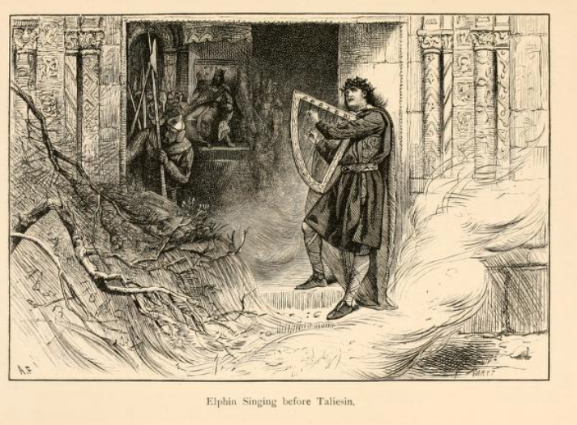

# Ceridwen, Gwion Bach and Taliesin

The tale of Gwion Bach, his encounter with the sorceress Ceridwen, his rebirth as Taliesin, greatest of the bards, and his adventures with the luckless Prince Elphin, is one of my favourite tales. The transformations are fantastic, and as with many Welsh tales, the pace is frenetic. Here is the briefest of summaries:

> Ceridwen, the sorceress has two children: her daughter, Creirwy, is perfect in every way; her son, Avagddu, is everything his sister is not. Ceridwen vows to make a potion of Awen, inspiration: it will take a year and a day; and old man and a young boy, Gwion Bach, are brought in to stir the pot and feed the fire; ingredients are collected at auspicious times. The day of reckoning: three bubbles, rise, pop, and burn Gwion Bach on the hand. Hand to mouth, he sees everything that was, is and shall be. He flees, Ceridwen chasing: they change to hare and hunting dog, fish and she-otter, little bird and hawk, grain of wheat and hen. Ceridwen pecks, and eats Gwion Bach. A child is born, she cannot kill it, pushes it onto the lake. Prince Elphin, the luckless, fails to get salmon on the day they leap freely; sees the child — "radiant brow". It talks, it has grown to a young child by the time they get to Elphin's father's court. Taliesin promises a great future for Elphin, with his help, and the young bard is adopted.

```{admonition} Ceridwen's Foul Son
:class: seealso

In some tellings, Ceridwen's foul son appears to be Morvran, in others, Morvran is an older brother of Avagddu?

In the tale *Kilhwch and Olwen*, we have the following description of Morvran, [p261](https://archive.org/details/mabinogionfroml02mabigoog/page/n377/mode/2up):

> Morvran the son of Tegid, (no one struck him in the battle of Camlan by reason of his ugliness; all thought he was an auxiliary devil. Hair had he upon him like the hair of a stag.)

```

```{youtube} Pyy8N2e8y34
:url_parameters: ?start=0
```

The tale is often paired with a second part in which Taliesin gets Prince Elphin out of a spot of bother with the King, and also repays him for having looked after him as he grew up.

> Elphin has a drink too many at the High King's feast, claims his wife is as virtuous as the Kings, his bard better, his horse fleeter of foot. He is thrown into jail until his wife's virtue is proven. Taliesin hears the disreputable King's son say he will demonstrate her lack of virtue. A kitchen maid is disguised as Elphin's wife, a ring forced onto her little finger. The Kings son arrives, gets the kitchen maid/not-wife drunk, seduces her, cuts off her little finger. Not my wife's: ring would hardly stay on her thumb, her nails are not pared, hr fingers not grained with flour from kneading bread. Elphin in silver chains; there is a bardic competition, Taliesin blurbs as bards pass, they blurb: are you all drunk? Taliesin recites, and the elements are at his command. There is a horse race, twenty four of the king's horses, twenty four holly rods charred black at the end; as each of the High King's horses is tapped on the flank, it falters; cap dropped where the last horse fell, and there, buried gold, a thank you to Elphin from Taliesin.

I first came across the tale in a second copy of Lady Charlotte Guest's *Mabinogion*, where the tale was included as an additional item to the "official" Mabinogion tales.

```{admonition} From *The Mabinogion* Volume III, Lady Charlotte Guest, 1849
:class: dropdown

In *The Mabinogion: From the Llyfr Coch O Hergest, and Other Ancient Welsh Manuscripts*, Charlotte Guest, Volume III, 1849, [p346-389](https://archive.org/details/mabinogionfroml01mabigoog/page/n366/mode/2up):

IN times past there lived in Penllyn a man of gentle lineage, named Tegid Voel, and his dwelling was in the midst of the lake Tegid, and his wife was called Caridwen. And there was born to him of his wife a son named Morvran ab Tegid, and also a daughter named Creirwy, the fairest maiden in the world was she; and they had a brother, the most ill-favoured man in the world, Avagddu. Now Caridwen his mother thought that he was not likely to be admitted among men of noble birth, by reason of his ugliness, unless he had some exalted merits or knowledge. For it was in the beginning of Arthur's time and of the Round Table.

So she resolved according to the arts of the books of the Fferyllt, to boil a cauldron of Inspiration and Science for her son, that his reception might be honourable because of his knowledge of the mysteries of the future state of the world.

Then she began to boil the cauldron, which from the beginning of its boiling might not cease to boil for a year and a day, until three blessed drops were obtained of the grace of inspiration.

And she put Gwion Bach the son of Gwreang of Llanfair in Caereinion, in Powys, to stir the cauldron, and a blind man named Morda to kindle the fire beneath it, and she charged them that they should not suffer it to cease boiling for the space of a year and a day. And she herself, according to the books of the astronomers, and in planetary hours, gathered every day of all charm-bearing herbs. And one day, towards the end of the year, as Caridwen was culling plants and making incantations, it chanced that three drops of the charmed liquor flew out of the cauldron and fell upon the finger of Gwion Bach. And by reason of their great heat he put his finger to his mouth, and the instant he put those marvel-working drops into his mouth, he foresaw every thing that was to come, and perceived that his chief care must be to guard against the wiles of Caridwen, for vast was her skill. And in very great fear he fled towards his own land. And the cauldron burst in two, because all the liquor vrithin it except the three charm-bearing drops was poisonous, so that the horses of Gwyddno Garanhir were poisoned by the water of the stream into which the liquor of the cauldron ran, and the confluence of that stream was called the Poison of the Horses of Gwyddno from that time forth.

Thereupon came in Caridwen and saw all the toil of the whole year lost And she seized a billet of wood and struck the blind Morda on the head until one of his eyes fell out upon his cheek. And he said, "Wrongfully hast thou disfigured me, for I am innocent. Thy loss was not because of me." "Thou speakest truth," said Caridwen, "it was Gwion Bach who robbed me."

And she went forth after him, running. And be saw her, and changed himself into a hare and fled. But she changed herself into a greyhound and turned him. And he ran towards a river, and became a fish. And she in the form of an otter-bitch chased him under the water, until he was fain to turn himself into a bird of the air. Then she, as a hawk, followed him and gave him no rest in the sky. And just as she was about to stoop upon him, and he was in fear of death, he espied a heap of winnowed wheat on the floor of a barn, and he dropped amongst the wheat, and turned himself into one of the grains. Then she transformed herself into a high-crested black hen, and went to the wheat and scratched it with her feet, and found him out and swallowed him. And, as the story says, she bore him nine months, and when she was delivered of him, she could not find it in her heart to kill him, by reason of his beauty. So she wrapped him in a leathern bag, and cast him into the sea to the mercy of God, on the twenty-ninth day of April.

And at that time the weir of Gwyddno was on the strand between Dyvi and Aberystwyth, near to his own castle, and the value of an hundred pounds was taken in that weir every May eve. And in those days Gwyddno had an only son named Elphin, the most hapless of youths, and the most needy. And it grieved his father sore, for he thought that he was born in an evil hour. And by the advice of his council, his father had granted him the drawing of the weir that year, to see if good luck would ever befal him, and to giye him something wherewith to begin the world.

And the next day, when Elphin went to look, there was nothing in the weir. But as he turned back he perceived the leathern bag upon a pole of the weir. Then said one of the weir-ward unto Elphin, "Thou wast never unlucky until to-night, and now thou hast destroyed the virtues of the weir, which always yielded the value of an hundred pounds every May eve, and to-night there is nothing but this leathern skin within it." "How now," said Elphin, "there may be therein the value of an hundred pounds." Well! they took up the leathern bag, and he who opened it saw the forehead of the boy, and said to Elphin, "Behold a radiant brow!" "Taliesin be he called," said Elphin. And he lifted the boy in his arms, and lamenting his mischance, he placed him sorrowfully behind him. And he made his horse amble gently, that before had been trotting, and he carried him as softly as if he had been sitting in the easiest chair in the world. And presently the boy made a Consolation and praise to Elphin, and foretold honour to Elphin; and the Consolation was as you may see,


"Fair Elphin cease to lament!  
Let no one be dissatisfied with his own.  
To despair will bring no advantage.  
No man sees what supports him;  
The prayer of Clynllo will not be in vain;  
God will not violate his promise.  
Never in Gwyddno's weir  
Was there such good luck as this night  
Fair Elphin, dry thy cheeks!  
Being too sad will not avail,  
Although thou thinkest thou hast no gain  
Too much grief will bring thee no good;  
Nor doubt the miracles of the Almighty:  
Although I am but little, I am highly gifted.  
From seas, and from mountains.  
And from the depths of rivers,  
God brings wealth to the fortunate man.  
Elphin of lively qualities.  
Thy resolution is unmanly;  
Thou must not be over sorrowful:  
Better to trust in God than to forbode ill.  
Weak and small as I am.  
On the foaming beach of the ocean.  
In the day of trouble, I shall be  
Of more service to thee than 900 salmon.  
Elphin of notable qualities.  
Be not displeased at thy misfortune;  
Although reclined thus weak in my bag.  
There lies a virtue in my tongue.  
While I continue thy protector  
Thou hast not much to fear;  
Remembering the names of the Trinity,  
None shall be able to harm thee."

And this was the first poem that Taliesin ever sang, being to console Elphin in his grief for that the produce of the weir was lost, and, what was worst that all the world would consider that it was through his fault and ill-luck. And then Gwyddno Garanhir `[This should be Elphin son of Gwyddno, see page 326.]` asked him what he was, whether man or spirit. Whereupon he sang this tale, and said,

"First, I have been formed a comely person,  
In the court of Caridwen I have done penance;  
Though little I was seen, placidly received,  
I was great on the floor of the place to where I was led;  
I have been a prized defence, the sweet muse the cause,  
And by law without speech I have been liberated  
By a smiling black old hag, when irritated  
Dreadful her claim when pursued:  
I have fled with vigour, I have fled as a frog,  
I have fled in the semblance of a crow, scarcely finding rest;  
I have fled vehemently, I have fled as a chain,  
I have fled as a roe into an entangled thicket;  
I have fled as a wolf cub, I have fled as a wolf in a wilderness,  
I have fled as a thrush of portending language;  
I have fled as a fox, used to concurrent bounds of quirks;  
I have fled as a martin, which did not avail:  
I have fled as a squirrel, that vainly hides,  
I have fled as a stages antler, of ruddy course,  
I have fled as iron in a glowing fire,  
I have fled as a spear-head, of woe to such as has a wish for it;  
I have fled as a fierce bull bitterly fighting,  
I have fled as a bristly boar soon in a ravine,  
I have fled as a white grain of pure wheat,  
On the skirt of a hempen sheet entangled,  
That seemed of the size of a mare's foal,  
That is filling like a ship on the waters;  
Into a dark leathern bag I was thrown,  
And on a boundless sea I was sent adrift;  
Which was to me an omen of being tenderly nursed.  
And the Lord God then set me at liberty."

Then came Elphin to the house or court of Gwyddno his father, and Taliesin with him. And Gwyddno asked him if he had had a good haul at the weir, and he told him that he had got that which was better than fish. "What was that?" said Gwyddno. "A Bard," answered Elphin. Then said Gwyddno, "Alas, what will he profit thee!" And Taliesin himself replied and said, "He will profit him more than the weir ever profited thee." Asked Gwyddno, "Art thou able to speak, and thou so little?" And Taliesin answered him, "I am better able to speak than thou to question me." "Let me hear what thou canst say," quoth Gwyddno. Then Taliesin sang, —

"In water there is a quality endowed with a blessing;  
On God it is most just to meditate aright;  
To God it is proper to supplicate with seriousness,  
Since no obstacle can there be to obtain a reward from him.  
Three times have I been born, I know by meditation;  
It were miserable for a person not to come and obtain  
All the sciences of the world, collected together in my breast,  
For I know what has been, what in future will occur.  
I will supplicate my Lord that I got refuge in him,  
A regard I may obtain in his grace;  
The Son of Mary is my trust, great in him is my delight,  
For in him is the world continually upholden.  
God has been to instruct me and to raise my expectation,  
The true Creator of heaven, who affords me protection;  
It is rightly intended that the saints should daily pray,  
For God, the renovator, will bring them to him."

And forthwith Elphin gave his haul to his wife, and she nursed him tenderly and lovingly. Thenceforward Elphin encreased in riches more and more day after day, and in love and favour with the king, and there abode Taliesin until he was thirteen years old, when Elphin son of Gwyddno went by a Christmas invitation to his uncle, Maelgwn Gwynedd, who sometime after this held open court at Christmas-tide in the castle of Dyganwy, for all the number of his lords of both degrees, both spiritual and temporal, with a vast and thronged host of knights and squires. And amongst them there arose a discourse and discussion. And thus was it said.

"Is there in the whole world a king so great as Maelgwn, or one on whom Heaven has bestowed so many spiritual gifts as upon him? First, form, and beauty, and meekness, and strength, besides all the powers of the soul?" And together with these they said that Heaven had given one gift that exceeded all the others, which was the beauty, and comeliness, and grace, and wisdom, and modesty of his queen; whose virtues surpassed those of all the ladies and noble maidens throughout the whole kingdom. And with this they put questions one to another amongst themselves. Who had braver men? Who had fairer or swifter horses or greyhounds? Who had more skilful or wiser bards — than Maelgwn?

Now at that time the bards were in great favour with the exalted of the kingdom; and then none performed the office of those who are now called heralds, unless they were learned men, not only expert in the service of kings and princes, but studious and well versed in the lineage, and arms, and exploits of princes and kings, and in discussions concerning foreign kingdoms, and the ancient things of this kingdom, and chiefly in the annals of the first nobles; and also were prepared always with their answers in various languages, Latin, French, Welsh, and English. And together with this they were great chroniclers, and recorders, and skilful in framing verses, and ready in making englyns in every one of these languages. Now of these there were at that feast within the palace of Mae gwn as many as four and twenty, and chief of them all, was one named Heinin Vardd.

When they had all made an end of thus praising the king and his gifts, it befel that Elphin spoke on this wise. "Of a truth none but a king may vie with a king; but were he not a king, I would say that my wife was as virtuous as any lady in the kingdom, and also that I have a bard who is more skilful than all the king's bards." In a short space some of his fellows shewed the king all the boastings of Elphin; and the king ordered him to be thrown into a strong prison, until be might know the truth as to the virtues of his wife, and the wisdom of his bard.

Now when Elphin had been put in a tower of the castle, with a thick chain about his feet, (it is said that it was a silver chain, because he was of royal blood;) the king, as the story relates, sent his son Rhun to enquire into the demeanour of Elphin's wife. Now Rhun was the most graceless man in the world, and there was neither wife nor maiden with whom he had held converse, but was evil spoken of. While Rhun went in haste towards Elphin's dwelling, being fully minded to bring disgrace upon his wife, Taliesin told his mistress how that the king had placed his master in durance in prison, and how that Rhun was coming in haste ta strive to bring disgrace upon her. Wherefore he caused his mistress to array one of the maids of her kitchen in her apparel; which the noble lady gladly did; and she loaded her hands with the best rings that she and her husband possessed.

In this guise Taliesin caused his mistress to put the maiden to sit at the board in her room at supper, and he made her to seem as her mistress, and the mistress to seem as the maid. And when they were in due time seated at their supper in the manner that has been said, Rhun suddenly arrived at Elphin's dwelling, and was received with joy, for all the servants knew him plainly; and they brought him in haste to the room of their mistress, in the semblance of whom the maid rose up from supper and welcomed him gladly. And afterwards she sat down to supper again the second time, and Rhun with her. Then Rhun began jesting with the maid, who still kept the semblance of her mistress. And verily this story shews that the maiden became so intoxicated, that she fell asleep; and the story relates that it was a powder that Rhun put into the drink, that made her sleep so soundly that she never felt it when he cut from off her hand her little finger, whereon was the signet ring of Elphin, which he had sent to his wife as a token, a short time before. And Rhun returned to the king with the finger and the ring as a proof to shew that he had cut it from off her hand, without her awaking from her sleep of intemperance.

The king rejoiced greatly at these tidings, and he sent for his councillors, to whom he told the whole story from the beginning. And he caused Elphin to be brought out of his prison, and he chided him because of his boast. And he spake unto Elphin on this wise. "Elphin, be it known to thee beyond a doubt that it is but folly for a man to trust in the virtues of his wife further than he can see her; and that thou mayest be certain of thy wife's vileness, behold her finger, with thy signet ring upon it, which was cut from her hand last night, while she slept the sleep of intoxication." Then thus spake Elphin. "With thy leave, mighty king, I cannot deny my ring, for it is known of many; but verily I assert strongly that the finger around which it is, was never attached to the hand of my wife, for in truth and certainty there are three notable things pertaining to it, none of which ever belonged to any of my wife's fingers. The first of the three is, that it is certain, by your grace's leave, that wheresoever my wife is at this present hour, whether sitting, or standing, or lying down, this ring would never remain upon her thumb, whereas you can plainly see that it was hard to draw it over the joint of the little finger of the hand whence this was cut; the second thing is, that my wife has never let pass one Saturday since I have known her without paring her nails before going to bed, and you can see fully that the nail of this little finger has not been pared for a month. The third is, truly, that the hand whence this finger came was kneading rye dough within three days before the finger was cut therefrom, and I can assure your goodness that my wife has never kneaded rye dough since my wife she has been."

Then the king was mightily wrath with Elphin for so stoutly withstanding him, respecting the goodness of his wife, wherefore he ordered him to his prison a second time, saying that he should not be loosed thence until he had proved the truth of his boast, as well concerning the wisdom of his bard as the virtues of his wife.

In the meantime his wife and Taliesin remained joyful at Elphin's dwelling. And Taliesin shewed his mistress how that Elphin was in prison because of them, but he bade her be glad for that he would go to Maelgwn's court to free his master. Then she asked him in what manner he would set him free. And he answered her—

A journey I will perform,  
And to the gate I will come;  
The hall I will enter,  
And my song I will sing;  
My speech I will pronounce  
To silence royal bards.  
In presence of their chief,  
I will greet to deride,  
Upon them I will break  
And Elphin I will free.  
Should contention arise,  
In presence of the prince,  
With summons to the bards,  
For the sweet flowing song,  
And wizards' posing lore,  
And wisdom of Druids.  
In the court of the sons of the distributor  
Some are who did appear  
Intent on wily schemes,  
By craft and tricking means,  
In pangs of affliction  
To wrong the innocent,  
Let the fools be silent,  
As erst in Baden's fight—  
With Arthur of liberal ones,  
The head, with long red blades,  
Through feats of testy men,  
And a chief with his foes.  
Woe be to them, the fools,  
When revenge comes on them.  
I Taliesin, chief of bards,  
With a sapient druid's words,  
Will set kind Elphin free,  
From haughty tyrant's bonds.  
To their fell and chilling cry,  
By the act of a surprising steed.  
From the far distant North,  
There soon shall be an end.  
Let neither grace nor health  
Be to Maelgwn Gwynedd,  
For this force and this wrong;  
And be extremes of ills  
And an avenged end  
To Rhun and all his race:  
Short be his coarse of life,  
Be all his lands laid waste;  
And long exile be assigned  
To Maelgwn Gwynedd!"

After this he took leave of his mistress, and came at last to the court of Maelgwn, who was going to sit in his hall and dine in his royal state, as it was the custom in those days for kings and princes to do at every chief feast. And as soon as Taliesin entered the hall, he placed himself in a quiet corner, near the place where the bards and the minstrels were wont to come to in doing their service and duty to the king, as is the custom at the high festivals when the bounty is proclaimed. And so, when the bards and the heralds came to cry largess and to proclaim the power of the king and his strength, at the moment that they passed by the corner wherein he was crouching, Taliesin pouted out his lips after them, and played "Blerwm, blerwm" with hia finger upon his lips. Neither took they much notice of him as they went by, but proceeded forward till they came before the king, unto whom they made their obeisance with their bodies, as they were wont, without speaking a single word, but pouting out their lips, and making mouths at the king, playing "Blerwm, blerwm," upon their lips with their fingers, as they had seen the boy do elsewhere. This sight caused the king to wonder and to deem within himself that they were drunk with many liquors. Wherefore he commanded one of his lords, who served at the board, to go to them and desire them to collect their wits, and to consider where they stood, and what it was fitting for them to do. And this lord did so gladly. But they ceased not from their folly any more than before. Whereupon he sent to them a second time, and a third, desiring them to go forth from the hall. At the last the king ordered one of his squires to give a blow to the chief of them named Heinin Vardd; and the squire took a broom, and struck him on the head, so that he fell back in his seat. Then he arose and went on his knees, and besought leave of the king's grace to show that this their fault was not through want of knowledge, neither through drunkenness, but by the influence of some spirit that was in the hall. And after this Heinin spoke on this wise. "Oh honourable king, be it known to your grace, that not from the strength of drink, or of too much liquor, are we dumb, without power of speech like drunken men, but through the influence of a spirit that sits in the corner yonder in the form of a child." Forthwith the king commanded the squire to fetch him; and he went to the nook where Taliesin sat, and brought him before the king, who asked him what he was, and whence he came. And he answered the king in verse.

"Primary chief bard am I to Elphin,  
And my original country is the region of the summer stars;  
Idno and Heinin called me Merddin,  
At length every king will call me Taliesin.

I was with my Lord in the highest sphere,  
On the fall of Lucifer into the depth of hell:  
I have borne a banner before Alexander;  
I know the names of the stars from north to south;  
I have been on the galaxy at the throne of the Distributor;  
I was in Canaan when Absalom was slain;  
I conveyed the divine Spirit to the level of the vale of Hebron;  
I was in the court of Don before the birth of Gwdion.  
I was instructor to Eli and Enoc;  
I have been winged by the genius of the splendid crosier;  
I have been loquacious prior to being gifted with speech;  
I was at the place of the crucifixion of the merciful Son of God;  
I have been three periods in the prison of Arianrod;  
I have been the chief director of the work of the tower of Nimrod;  
I am a wonder whose origin is not known.

I have been in Asia with Noah in the ark,  
I have seen the destruction of Sodom and Gomorra;  
I have been in India when Roma was built,  
I am now come here to the remnant of Troia.

I have been with mj Lord in the manger of the ass;  
I strengthened Moss through the water of Jordan;  
I have been in the firmament with Mary Magdalene;  
I have obtained the muse from the cauldron of Ceridwen;  
I have been bard of the harp to Lleon of Lochlin.  
I have been on the White Hill, in the court of Cynvelyn,  
For a day and a year in stocks and fetters,  
I have suffered hanger for the Son of the Virgin.  
I have been fostered in the land of the Deity,  
I have been teacher to all intelligences,  
I am able to instruct the whole universe.  
I shall be until the day of doom on the face of the earth;  
And it is not known whether my body is flesh or fish.

Then I was for nine months  
In the womb of the hag Caridwen;  
I was originally little Gwion,  
And at length I am Taliesin."

And when the king and his nobles had heard the song, they wondered much, for they had never heard the like from a boy so young as he. And when the king knew that he was the bard of Elphin, he bade Heinin, his first and wisest bard, to answer Taliesin and to strive with him. But when he came, he could do no other, but play "blerwm" on his lips; and when he sent for the others of the four and twenty bards, they all did likewise, and could do no other. And Maelgwn asked the boy Taliesin what was his errand, and he answered him in song.

TO DO p375-9

And while he was thus singing his verse near the door, there arose a mighty storm of wind, so that the king and all his nobles thought that the castle would fall upon their heads. And the king caused them to fetch Elphin in haste from his dungeon, and placed him before Taliesin. And it is said, that immediately he sang a verse, so that the chains opened from about his feet

TO DO p380-3

Taliesin having set his master free from prison, and having protected the innocence of his wife, and silenced the Bards so that not one of them dared to say a word, now brought Elphin's wife before them, and shewed that she bad not one finger wanting. Right glad was Elphin, right glad was Taliesin.

Then he bade Elphin wager the king, that he had a horse both better and swifter than the king's horses. And this Elphin did, and the day, and the time, and the place were fixed, and the place was that which at this day is called Morva Rhiannedd; and thither the king went with all his people, and four and twenty of the swiftest horses he possessed. And after a long process the course was marked, and the horses were placed for running. Then came Taliesin with four and twenty twigs of holly, which he had burnt black, and he caused the youth who was to ride his master's horse to place them in his belt, and he gave him orders to let all the king's horses get before him, and as he should overtake one horse after the other, to take one of the twigs and strike the horse with it over the crupper, and then let that twig fall; and after that to take another twig; and do in like manner to every one of the horses; as he should overtake them, enjoining the horseman strictly to watch when his own horse should stumble, and to throw down his cap on the spot. All these things did the youth fulfil, giving a blow to every one of the king's horses, and throwing down his cap on the spot where his horse stumbled. And to this spot Taliesin brought his master after his horse had won the race. And he caused Elphin to put workmen to dig a hole there; and when they had dug the ground deep enough, they found a large cauldron full of gold. And then said Taliesin, "Elphin, behold a payment and reward unto thee, for having taken me out of the weir, and for having reared me from that time until now." And on this spot stands a pool of water, which is to this time called Pwllbair.

After all this, the king caused Taliesin to be brought before him, and he asked him to recite concerning the creation of man from the beginning; and thereupon he made the poem which is now called "One of the four pillars of song."

TO DO p385-9

He further told the king various prophecies of things that should be in the world, in songs, as follows.


Notes pp390-400

Taliesin, literally, the "Radiant Brow," was a Welsh Bard of the sixth century. His name, regarded hy his countrymen with the reverence due to the "Prince of Song" is known to the Saxon chiefly through the brief but spirited invocation of Gray.

The text records the fiction of which Taliesin is the hero. Of his real history, little is known excepting what may he gleaned from his works, and from the following notices given in the volume of Iolo MSS. recently published by the Welsh MSS. Society. The first of these latter is taken from Anthony Powel of Llwydarth's MS.

"Taliesin, chief of the Bards, the son of Saint Henwg of Caerlleon upon Usk, was invited to the court of Urien Rheged, at Aberllychwr. He, with Elffin, the son of Urien, being once fishing at sea in a skin coracle, an Irish pirate ship seized him and his coracle, and bore him away towards Ireland; but while the pirates were at the height of their drunken mirth, Taliesin pushed his coracle to the sea, and got into it himself, with a shield in his hand which he found in the ship, and with which he rowed the coracle until it verged the land; but, the waves breaking then in wild foam, he lost his hold on the shield, so that he had no alternative but to be driven at the mercy of the sea, in which state he continued for a short time, when the coracle stuck to the point of a pole in the weir of Gwyddno, Lord of Ceredigion, in Aberdyri; and in that position he was found, at the ebb, by Gwyddno's fishermen, by whom he was interrogated; and when it was ascertained that he was a bard, and the tutor of Elffin, the son of Urien Rheged, the son of Cynvarch: — "I, too, have a son named Elffin," said Gwyddno, "be thou a bard and teacher to him, also, and I will give thee lands in free tenure." The terms were accepted; and, for several successive years, he spent his time between the courts of Urien Rheged and Gwyddno, called Gwyddno Garanhir, Lord of the Lowland Centred: but after the territory of Gwyddno had become overwhelmed by the see, Taliesin was invited by the Emperor Arthur, to his court at Caerlleon upon Usk, where he became highly celebrated for poetic genius and useful, meritorious sciences. After Arthur's death, he retired to the estate given to him by Gwyddno, taking Elffin, the son of that prince, under his protection. — It was from this account that Thomas, the son of Einion Offeiriad, descended from Gruffydd Gwyr, formed his romance of Taliesin, the son of Cariadwen, — Elffin, the son of Goddnou, — Rhun the son of Maelgwn Gwynedd, — and the operations of the Cauldron of Ceridwen."

Next follows the Pedigree of Taliesin, Chief of the bards, from Thomas Hopkin of Coycburch's MS.—

"Taliesin, Chief of the Bards of the West, the son of Saint Henwg, of Caerlleon upon Usk, the son of Fflwch, the son of Cynin, the son of Cynvarch, the son of Saint Clydawc, of Ewyas, the son of Gwynnar, the son of Caid, the son of Cadren, the son of Cynan, the son of Cyllin, the son of Caradog, the son of Bran, the son of Llyr Llediaith, King Paramount of all the Kings of Britain, and King, in lineal descent, of the country between the rivers Wye and Towy. Taliesin became Chief Bard of the West, from having been appointed to preside over the chair of the Round Table, at Caerlleon upon Usk."

A manuscript once in the Havod Uchtryd collection gives the following particulars. —

"Taliesin, Chief of the Bards of the West, the son of Henwg the Bard, of the college of Saint Cadocus, the son of Fflwch Lawdrwm, of Caerlleon upon Usk, in Glamorgan, the son of Cynvar, the son of Saint Clydog, the son of Gwynnar, the son of Cadrain, the son of Cynan, the son of Caradog, the son of Bran the Blessed, the son of Llyr Llediaith.

Taliesin, Chief of the Bards, erected the church of Llanhenwg at Caerlleon upon Usk, which he dedicated to the memory of his father, called Saint Henwg, who went to Rome on a mission to Constantino the Blessed, requesting that he would send Saints Germanus and Lupus to Britain, to strengthen the faith, and renew baptism there.

Taliesin, the son of Henwg, was taken by the wild Irish, who unjvustly occupied Gower; but while on board ship on his way to Ireland, he saw a skin coracle, quite empty, on the surface of the sea, and it came closely to the side of the ship; whereupon Taliesin, taking a skin-covered spar in his hand, leaped into it, and rowed towards land, until he stuck on a pole in the weir of Gwyddno Garanhir; when a young chieftain, named Elphin seeing him so entangled, delivered him from his peril. This Elphin was taken for the son of Gwyddno; although in reality, he was the son of Elivri his daughter, but by whom, was then quite unknown: it was howerer, afterwards discovered that Urien Rheged, King of Gower and Aberllychwr, was his father, who introduced him to the court of Arthur, at Caerlleon upon Usk; where his feats, learning, and endowments, were found to be so superior, that he was created a golden-tongued Knight of the Round Table.— After the death of Arthur, Taliesin became Chief Bard to Urien Rheged, at Aberllychwr in Rheged."

TO DO p392

p396

Caridwen.— Page 352

Caridwen is generally considered to be the Goddess of Nature of Welsh mythology. The principal circumstances of her fabulous history are those detailed in the Mabinogi of Taliesin. Upon them are founded most of the allusions to her contained in the poems of the bards, with whom the cauldron of Caridwen, of Inspiration, or the Awen, is a subject of frequent reference. As regards her singular family we have but little information and few details. Several notices, however, occur in Welsh writings of her fair daughter Creirwy. Of these it may be sufficient to instance the Triad which celebrates her with Arianrod and Gwenn, verch Cywryd ab Crydon, as one of the three beauteous ladies of the island. `[Triad 107.]` One of the two Triads extant on the subject of Morvran has been already cited. (See p. 273.) It alludes to the extreme ugliness assigned him in the text, to which, nevertheless, he was indebted for the preservation of his life in the battle of Catalan; the other ranks him with Gilbert mab Oadgyffro and Gwgan Gleddyvrudd, as one of the three stayers of slaughter `[Triad xxix.]`. No further particulars of him are preserved.


Gwyddno Garanhir. —Page 354.  
Gwyddno Garanhir was Sovereign of Cantref y Gwaelod, a territory bordering on the sea, and protected from its ravages by a high embankment. One evening there was revelry at the Coart, and Seithenin, `[Seithinyn the Drunkard's mischance in letting the sea overflow the
Cantrev y Gwaelod, is related in Triad xli.]` the son of Seithyn Saidi, King of Dyved, upon whom it devolved to look after the embankment, `[Traces of three ancient stone embankments are said to be still visible in the district where this inundation took place. They are called Sam Oynvelyn, Sara y Bwch, and Sara Padrig. "The latter is particularly conspicuous, being left dry at low water to the extent of about nine miles, and the sailors of the neighbouring ports describe its whole length to be twenty-one miles, beginning near Harlech, and running in a south-west direction." (Cambro-Briton, 1.362.) The Hanes Cymru contains some interesting remarks on this subject.]` and see that all was safe, became inebriated and neglected his charge. The consequence was that the sea broke in through the bank in the course of the night. Gwyddno and his Court escaped with difficulty from the impending ruin, and the Cantrev y Gwaelod was submerged and irretrievably lost. By this calamity sixteen fortified cities, the largest and finest that were in Wales, excepting only Caerlleon upon Usk, were entirely destroyed, and Cardigan Bay occupies the spot where the fertile plains of the Cantrev had been the habitation and support of a flourishing population. Such as escaped the inundation fled to Ardudwy, and the country of Arvon, and the mountains of Eryri (Snowdon), and other places not previously inhabited. By none was this misfortune more severely felt than by Gwyddno Garanhir, to whom the reverse of circumstances it occasioned was so great that, from being an opulent monarch, he was all at once reduced to the necessity of maintaining himself and his only son, the unfortunate Elphin, by the produce of the fishing-weir mentioned in the text.

This disastrous event is commemorated in a proverb still repeated in the Principality. —

"Uchenaid Gwyddno Garanhir,  
Pan droes y don dros el dir."

The sigh of Gwyddno Garanhir  
When the waye rolled over his land.

Then is also preserved in the Myrvian Archaiology, (I 165.) a short poem upon the subject attributed to Gwyddno Garanhir in which there are some exceedingly poetic and striking passages. The bereft monarch calls upon the author of his distress to view the calamitous effects of his intemperance, pronounces maledictions upon his head, and describes the outcry of the perishing inhabitants of that unhappy region. The piece bears a strong resemblance to some of the Works of Llyrwarch Hèn, and is probably as old as the sixth century.

"Stand forth Seithenin and behold the dwelling of heroes, — the plain of Gwyddno the ocean covers!  
Accursed be the sea guard, who after his carousal let loose the destroying fountain of the raging deep.  
Accursed be the watcher, who after his drunken revelry, loosed the fountain of the desolating sea.  
A cry from the sea arises above the ramparts; even to heaven does it ascend, — after the fierce excess comes the long cessation!  
A cry from the sea ascends above the ramparts; even to heaven does the supplication come! — after the excess then ensues restraint!  
A cry from the sea awakens me this night! —  
A cry from the sea arises above the winds!  
A cry from the sea impels me from my place of rest this night!  
After excess comes the far extending death!"

Another composition, attributed to him, is to be found in the same valuable collection. It is in the colloquial form, between himself and the king of Faerie, Gwyn ap Nudd.

The magic basket of Gwyddno has a place amongst the Thirteen Precious Things of Britain (*see Guest's Mabinogion, Vol. II, 1845, p353*).

```

```{admonition} Lady Charlotte Guest
:class: seealso

For more on the fascinating Lady Charlotte Guest (maiden name, Charlotte Schreiber) see for example [*Lady Charlotte Guest and the Mabinogion; some notes on the work and its translator, with extracts from her journals*](https://archive.org/details/ladycharlottegue00philrich/page/n11/mode/2up), David Rhys Phillips, 1923.

```

An earlier version can be found in the Cambrian and Caledonian Quarterly of 1833:

```{admonition} Introduction, The Mabinogi of Taliesin, Cambrian and Caledonian Quarterly, April, 1833
:class: dropdown

In *The Cambrian and Caledonian Quarterly Magazine and Celtic Repertory*, 1833-04-01: Vol 3 Iss 18, [p198-214](https://archive.org/details/sim_the-cambrian-and-caledonian-quarterly-magazine_1833-04-01_3_18/page/198/mode/2up):

THE MABINOGI OF TALIESIN.

INTRODUCTORY REMARKS.

In selecting the romance here submitted to your readers, as a farther specimen of the ancient tales I have it in contemplation to publish, I have been principally swayed by these two considerations; the bringing forward a tale whose composer or adapter, and the period at which he flourished, are known,—and the elucidation of the era of some poetical pieces, which have been generally ascribed to Taliesin.

In these respects I deem this performance of interest; for no other work of this description, that has come under my observation, can be appropriated with certainty to any determinate period; nor can a more satisfactory clue to the reasons for composing poems in the names of celebrated characters be required.

The compiler, Hopkin Thomas Phillip, wrote this piece, about the year 1370. He lived in Morganweg, or Glamorgan; and his language is an interesting specimen of the Gwentian dialect, and an elegant model for prose composition. I, however, have reason to suspect that some of the poetical parts of this romance have been taken by him from some previous work of the same description, as the style and language would induce us to ascribe them to the twelfth and thirteenth centuries; and some of them are attributed to Jonas Mynyw, or Jonas of Menevia, who appears to have lived at a period anterior to our author.

That this species of composition prevailed in Wales for many centuries we are well assured; and we have an appropriate parallel to our present inquiry, in the declared intention of Geofry of Monmouth to embody the vaticinations of Merddin (Merlin) in a romance, which intention he afterwards relinquished, and published them in a poetical form, without the connecting narrative which he previously contemplated.

It is not unlikely some romance based upon the history of Taliesin, similar to the one under consideration, may have been known at the period of the first Norman lords of Glamorgen, and the language, by the lapse of time, may have become too obsolete for the facile comprehension of all classes; and Hopkin Thomas Phillip may have modernized the narrative prose, and given the best version of the poetry he could procure. This surmise is strengthened by the very numerous copies we possess of these poetical pieces, some of which greatly differ from each other, apparently taken down from oral delivery of the tale by various reciters, and which could not well occur if the composition was the entire work of a person so late as the conclusion of the fourteenth century. (The Gaelic sgeulachds, or scholia, which accompany the old Gaelic poems attributed to Ossian, and described as containing the achievements of Fingal, &c., appear to have been similar in composition to tales of this description. )

Of the narrative part but one version exists, and therefore it requires no observation. Of the poetical portion, I have selected those readings which appeared to be the best, and admitted of the most consistent translation. Many of these poetical compositions have long been known and admired as most happy efforts in the Welsh language; and the author, though unknown, as it is not consistent with probability to attribute them to any person anterior to the twelfth century, nor so late as the close of the fourteenth, must rank high among those gifted men who have been the most successful votaries of the British *awen*, (poetical inspiration.) These pieces, beautiful as they are, we must arrange in their proper rank, reject them as historical documents, and discard them as the genuine compositions of Taliesin, the bard of Urien Reged and Rhun.

The editors of the Myvyrian Archaiology were bound to give to the world all the pieces, whatever their origin, which were ascribed to the poets whose works were comprised in that collection, leaving it to the critic to elucidate the various styles, and pronounce upon the authenticity of the productions— this department was not within the scope of their undertaking, but it would afford a highly interesting inquiry, judiciously to investigate our ancient remains, as far as possible ascribe them to their proper era, and discriminate between the materials of sober history and splendid fiction.

With these introductory remarks, I enclose for your pages a translation of the Mabinogi, or tale of Taliesin.

IDRISON.

[A footnote in another article on p.250 reveals the identity of "IDRISON": *See also the transformations described in the Mabinogi of Taliesin, in the present Number, translated by Dr. Owen Pughe.— Edrs.*]

```

```{admonition} Part 1, The Mabinogi of Taliesin, Cambrian and Caledonian Quarterly, April, 1833
:class: dropdown

In *The Cambrian and Caledonian Quarterly Magazine and Celtic Repertory*, 1833-04-01: Vol 3 Iss 18, [p198-214](https://archive.org/details/sim_the-cambrian-and-caledonian-quarterly-magazine_1833-04-01_3_18/page/198/mode/2up):


THE MABINOGI TALE OF TALIESIN.

There was a nobleman in former times, of Penllyn, who was called Tegid the Bald, and his patrimony was in the middle of the lake of Tegid `[This lake is near the town of Bala. in Meirion.]`; and his married wife was called Keridwen `[The fair procreator: in the bardic mythology, an epithet for the first woman; and she was feigned to be the mother of Morvran ab Tegid, who escaped from the battle of Camlan, owing to his hideous form; and Sandde, of angel aspect, escaped by a way being made from his being taken for an angel; and Glewlwyd of the mighty grasp, escaped, as no foe dared to stand in his way. These three were the representatives of ugliness, beauty, and strength]`, and of that wife a son was born named Morvran ab Tegid, and a daughter named Creirvyw, who was the fairest damsel in the world, and a brother of theirs was the ugliest person among men, and this was Avagddu.

Then Keridwen, the mother of Avagddu, considered it as not likely that he should have reception among the nobility, from his being so ugly, unless he were endowed with some pre-eminent gifts or sciences; for this was at the commencement of the era of Arthur and the round table

And thereupon, by having recourse to books of chemistry, she prepared to concoct a cauldron of genius and sciences for her son, so that his reception might be more honourable, on account of his sciences, and his knowledge in respect to the future state of the world.

So she began to boil the cauldron, the which, after it should be made to boil, could not be suffered to leave off boiling until the end of a year and a day, so that three blessed drops should be obtained through the grace of the spirit. And little Gwion, the son of a yeoman of Llanvair Caereinion, in Powys, was placed by her to attend the cauldron, and a blind man named Morda to keep up the fire under it, with a command not to suffer the boil to break until a year and a day should elapse; and she also, through the books of the astronomers, and by the hours of the planets, being daily collecting of such various herbs as had some peculiar virtue.

And on a certain day, as Keridwen was collecting herbs, and the end of the year drawing near, three drops of the pure water flew out of the cauldron, and lighted upon the finger of little Gwion: and, from its being so hot, at the instant he put those those precious drops into his mouth, and no sooner had he done so, than he obtained a knowledge of every thing that might occur in future: and he was thus forewarned that his principal care must be to avoid the wiles of Keridwen, for her inventive powers were great, and out of extreme fear he fled towards his own country; and the cauldron was broken in two, because the whole of the steel was of a deleterious nature, except those three precious drops, and thus the steeds of Gwyddno Longshank were poisoned by drinking of the water from the brook into which the cauldron ran, and therefore the brook thenceforth was called the poison of Gwyddno's horses. And thereupon Keridwen was observed returning home, and seeing her labour for a twelvemonth lost, she snatched up a billet, and struck the blind Morda upon his head, so that one of his eyes fell down his cheek; whereupon he then said, "badly hast thou disfigured me, and I being innocent! thou hast suffered no loss on my account." "Thou hast spoken the truth," said Keridwen, "it was little Gwion that robbed me;" and so she followed him upon a run. And thereupon he observed her, and so he changed himself into the form of a hare, and ran off; then she also appeared as a hound bitch, doubled him, and turned him towards a river; and then he appeared as a fish, and she also in the form of an otter bitch, and pursued him under the water; so that he was compelled to appear as a bird in the air, and she as a hawk to pursue him, and so gave him no quiet in the air; and as she was overtaking him, and he having the fear of death upon him, he observed a heap of winnowed wheat on a barn floor, and so alighted into the wheat, and appeared in the form of one of the grains, and thereupon she also appeared as a black crested hen, and into the wheat she went, which, scratching with her feet, she recognized him, and swallowed him: and, as said in the narrative, she was nine months pregnant of him; and, after her delivery, she could not in her heart kill him, so beautiful he seemed, but she wrapped him in a leathern bag, and cast him to the will of man into the sea, on the 29th of April.

And at that time Gwyddno had a wear on the sand between Dyvi and Aberystwyth, near to his own castle; and in that wear there was obtained to the value of a hundred pounds at every May eve. At that time, Gwyddno had one son, who was called Elphin, being one of the most untoward of youths, and suffering the greatest privation, which was a cause of grief to his father, fearing that he was born in an evil hour: and through the advice of his counsellors, his father gave him the drought of the wear for that year, to see if ever any luck befel him, and to make a beginning of employment for him.

The following morning, as Elphin was examining the wear, and finding there was nothing in it, was going away, he discovered a leathern bag suspended from a pole of the wear; then one of the wear men said to Elphin, "Thou hast never been unfortunate before this night, for thou hast broken the virtues of the wear, wherein there used to be obtained the value of a hundred pounds on every May eve."

"Now," said Elphin, "what if there might be an equivalent to the hundred pounds in this?"

The skin was untied, and the opener of it saw the forehead of a boy, and he exclaimed, "See, here is a fair front!"

"Fair Front [i.e. Taliesin] let his name be," said Elphin, raising him up between his hands, bewailing his misfortune, and pensively placed him in a pannier on one of his horses, and at the instant he made the horse canter that only trotted before, thus conducting him so softly as if he were sitting in the easiest chair that possibly could be, and thus carrying the boy, composed the verses called "The Consolation of Elphin," with an eulogy, and a prophecy of honourable advancement to him; and the Consolation was the first song made by Taliesin, and which was to console Elphin on the way home as he sorrowed at the loss of the drought of the wear; and above all he was concerned that the fault and misfortune were attributed to him. The Consolation was to this effect:

Fair Elphin cease to lament!  
Let no one be dissatisfied with his own,  
To despair will bring no advantage.  
No man sees what supports him;  
The prayer of Cynllo will not be in vain;  
God will not violate his promise.  
Never in Gwyddno's wear  
Was there such good luck as this night.

Fair Elphin, dry thy cheeks!  
Although thou thinkest thou hast no gain,  
Too much grief will bring thee no good:  
Nor doubt the miracles of the Almighty:  
Although I am but little, I am highly gifted.  
From seas, and from mountains,  
And from the depths of rivers,  
God brings wealth to the fortunate man.

Elphin of lively qualities,  
Thy resolution is unmanly;  
Thou must not be over sorrowful:  
Better to trust in God than to forbode ill.  
Weak and small as I am,  
On the foaming beach of the ocean,  
In the day of trouble, I shall be  
Of more service to thee than 300 salmon.

Elphin of notable qualities,  
Be not displeased at thy misfortune;  
Although reclined thus weak in my bag,  
There lies a virtue in my tongue.  
While I continue thy protector  
Thou hast not much to fear:  
Remembering the names of the Trinity,  
None shall be able to harm thee.

The foregoing, with various other verses were sung by Taliesin for the comfort of Elphin, during his journey, who, on arriving at home, presented the contents of the pannier to his wife, who nursed the child dearly and tenderly.

From that time forward the wealth of Elphin increased more and more day after day, and he obtained the favour and love of the king; who, some short time afterwards, kept open court in Christmas time at the castle of Dyganwy, surrounded by his lords, both spiritual and temporal, with a great number of knights and esquires. `[This was Maelewn, who reigned A.D. 517 to A.D. 654.]`

In this assembly the following conversation took place: "Is there in the whole world a king so powerful as Maelgwn, and so endowed by heaven with spiritual gifts? In the first lace, comliness of person, and urbanity, and strength, besides all the energies of the soul; and along with these gifts, they say, the Father has bestowed upon him one eminent gift that is superior to the others altogether, which is, happiness in having a queen whose form and demeanour, and wisdom, and chastity, are qualities possessed by her in a higher degree than by all the noble ladies in the kingdom."

Besides this subject, they threw out questions amongst themselves, as to who was the bravest of his men; who had the finest and swiftest horses and greyhounds; who had better informed and wiser bards than Maelgwn. These were at the time in great esteem amongst the dignitaries of the kingdom; and at that time none were advanced to the office at present called a herald, except such as were learned men; and not only were they employed in the service of kings and princes, but were required to be well versed in genealogies, armorial bearings, and the deeds of kings and princes, as well in respect to foreign kingdoms as to the elders of these kingdoms; and particularly as to the history of the principal nobility. It was necessary also, for all of them to be most ready with their answers in the several languages of Latin, French, Welsh, and English; and, in addition to this, to be great historians, and to be of good memory, and accomplished in poetry, so as readily to compose metrical verses in each of those languages.

And of these there were at the court of Maelgwn, during that festival, as many as four and twenty; and chief over them was one who was called Heinin the Bard.

Thus, after all had extolled the king, and enumerated his virtues, it happened that Elphin should express himself in this manner:

"Truly, no one is able to compete with a king but a king; however, let that be granted, and indeed if he were not a king, I might say that I have a wife equal in respect to personal chastity to any lady that can be found in the kingdom. And besides, I have one bard who is better informed than all the bards of the king."

In a little time the king was informed of all the boasting of Elphin by some of his companions, for which the king commanded him to be confined in a strong prison, until he should be enabled to obtain true information in respect to the chastity of his wife, and also in respect to the talents of his bard.

Then, after Elphin had been placed in a tower of the castle, with heavy fetters on his legs, which fetters were said to be of silver, on account of his being of royal blood, the account shows that the king employed Rhun, his son, to prove the chastity of the wife of Elphin, which Rhun was one of the most lascivious characters that ever lived; for neither wife nor maiden escaped free from imputation, with whom he obtained but a short space for discourse.

And as Rhun was coming in great haste towards the mansion of Elphin, with full intention to debauch his wife, Taliesin told his mistress what he had long observed, from the conduct of the king in confining his master, and the way that Rhun had come with the design of assailing her chastity; and therefore he advised his mistress to dress one of the maids of the kitchen in her clothes. This the lady gladly complied with unsparingly, by ornamenting her hands with a profusion of the choicest rings in the possession of herself and her husband. In this manner Taliesin directed his mistress to place the maid to sit at the table in her stead to supper, and Taliesin contrived to make her appear like her mistress, and the mistress to be like the maid.

Thus as they were seated in the most sumptuous style at supper, as has been described, Rhun suddenly appeared at the hall of Elphin, and was joyfully ushered in, for all the attendants knew him well; and they quickly introduced him into the room to their mistress, in whose resemblance the maid got up from the supper, and politely welcomed him; and afterwards she again sat to supper, Rhun being seated along with her; and presently he began to joke with obscene expressions with the maid, who studied to preserve the semblance of her mistress: and indeed, the narrative shows that the maid became so inebriated as to begin to fall asleep; and it is also stated that Rhun infused some powders in her drink, which caused her to sleep so soundly, as not at all to feel his cutting her little finger off her hand, on which was a ring with the signet of Elphin, which he had sent as a token of his wife a little while before. In this manner he did whatever he thought proper to the girl; and then he took the finger with the ring round it, as a token for the king of his having succeeded, by showing the manner how he had cut off her finger on leaving her, without her being awaked out of her sleep.

From these reports the king was greatly delighted; and in consequence he sent for his council, to whom he explained the whole of the matter, from beginning to end: also commanding Elphin to be brought from the prison, that he might be reprimanded for his boasting; and thereupon he addressed Elphin in this manner:

"Elphin, be it known to thee, and doubt thou not, that it is but folly for any man in the world to believe a woman in respect to her personal chastity, farther than he may be able to observe her; and that thou mayest ascertain how thy wife broke her marriage vow the very night last past, behold, here is her finger as a proof for thee, with thy signet ring round it, which was cut from her hand in her sleep, by the person that slept with her; so that, as thou mayest not have to boast by saying she had not transgressed in respect to her chastity."

To these words E!phin replied in the following manner: "By thy permission, honourable king, permit me to say, that I am by no means able to deny my ring for there are many people he can identify it; but, in truth, I solemnly assert that the finger round which it is was never joined to the hand of my wife; for, in certain truth, it has upon it three particular things, not any one of which was ever upon either of the fingers of the hands of my wife, and the first of the three is conclusive, by the leave of your grace, wheresoever my wife may at present be, whether sitting, or standing, or lying down, this ring will not stick even upon her thumb; and you may plainly observe, it must be difficult to force this ring over the joint of the smallest finger of the hand from which this finger was taken; and the second thing is, that my wife has not been on any Saturday, since I have known her, without having her nails pared before going to bed; and, indeed, you can plainly see that the nail of this finger has not been cut for a month; and the third thing is this, that the hand from which this finger has been cut has kneeded some dough of rye within the three days prior to this finger being cut off it; and I will confirm it as true to your goodness, that my wife has not kneeded rye dough since she has been a wife to me."

Then the king became extremely angry with Elphin for standing out so stoutly against him on behalf of the chastity of his wife; and on that account the king commanded him the second time to prison, saying that he should not be liberated from thence, until he proved his boasting to be true, as well in respect to the talent of his bard as to the purity of his wife: these were during the time in the palace of Elphin, making merry; and, in the meanwhile, Taliesin informed his mistress how Elphin was in prison on their account; but he desired her to appear cheerful, and explained to her the manner he would go to the court of Maelgwn to liberate his master. Thereupon she inquired by what means he would free his master; and then he replied in this manner:

"A journey will I perform,  
And to the gate [ will come;  
The hall I will enter,  
And my song I will sing  
My speech I will pronounce  
To silence royal bards.  
In presence of their chief,  
I will greet to deride,  
Upon them I will break,  
And Elphin I will free.  
Should contention arise,  
In presence of the prince,  
With summons to the bards  
For the sweet-flowing song,  
And wizards' posing lore  
And wisdom of Druids.

In the court of the sons of the distributer  
Some are who did appear  
Intent on wily schemes,  
By craft and tricking means,  
In pangs of affliction  
To wrong the innocent.  
Let the fools be silent,  
As erst in Badon's fight,—  
With Arthur of liberal ones  
The head, with long red blades;  
Through feats of testy men,  
And a chief with his foes.  
Woe be to them, the fools,  
When revenge comes on them.

I, Taliesin, chief of bards,  
With sapient druids' words,  
Will set kind Elphin free  
From haughty tyrant's bonds.  
To their fell and chilling cry,  
By the act of a surprising steed,  
From the far distant North,  
There soon shall be an end,  
Let neither grace nor health  
Be to Maelgwn Gwynedd,  
For this force and this wrong;  
And be extremes of ills  
And an avenged end  
To Rhun and all his race:  
Short be his course of life,  
Be all his lands laid waste;  
And long exile be assigned  
To Maelgwn Gwynedd!"

Having spoken thus, Taliesin took leave of his mistress; and at length he arrived at the court of Maelgwn, who, in royal state, was about entering the hall to dinner, in the manner usual with kings and princes, on every high festival in that age. And just as Taliesin had come into the hall, he observed there was room for him in an unfrequented place near where the bards and minstrels were wont to repair to perform their service and devotion to the king, as is still customary in proclaiming largess upon high festivals.

So the time was now arrived for the bards or the heralds to proclaim the largess and liberality of the king; and these came towards the place where Taliesin was squatting in a corner, who stretched out his lip after them, and on it he played "blab blab" with his finger; they took not much notice of him in passing, but walked on till they came before the king, to whom they made their obeysance with their bodies, as it was proper for them to do, without uttering a single word, but extending out their lips and mouthing at the king, playing "blab blab" with their fingers and lips, as they had seen the boy doing before, which sight filled the king with wonder and amazement, supposing them to be drunk, owing to a profusion of liquors; therefore he desired one of the lords that ministered at his table to go to them, to request that they would call to mind where they were standing, and how they ought to conduct themselves. This he did with pleasure; but they were not prevailed upon to desist from their folly. On that account, he sent the second and the third time, and ordered them to leave the hall. At length the king desired one of the 'squires to give a blow to the chief of them, who was called Heinin the Bard; then the 'squire took a broom and struck him on his head so that he fell back on his breech, whence he got up on his knees, and then he besought the king's grace for permission to show him that such inadvertence did not arise from neglect, nor from want of thought, nor from ebriety, but from the power of some spirit that was within the hall; and in addition to this Heinin spoke as follows:

"Illustrious king, be it known to your grace, it is not from the effect of a profusion of liquors that we are dumb, and seem as drunken men, but through the impulse of a spirit sitting in yonder corner in the form of a child."

From that spot the king commanded a 'squire to fetch him, and who went into the corner where Taliesin was sitting, and thence brought him into the presence of the king, who asked him what he was, and from whence he came. Then Taliesin answered him satirically, as is seen here.

*To be continued.*

```

```{admonition} Part 2, The Mabinogi of Taliesin, Cambrian and Caledonian Quarterly, July, 1833
:class: dropdown

In *The Cambrian and Caledonian Quarterly Magazine and Celtic Repertory*, 1833-07-01: Vol 3 Iss 19, [p366-382](https://archive.org/details/sim_the-cambrian-and-caledonian-quarterly-magazine_1833-07-01_3_19/page/366/mode/2up:

THE MABINOGI OF TALIESIN.
( Continued from the Cambrian Quarterly for April. )

NOTICES OF THE POWERS OF THE BARD.

In water there is a quality endowed with a blessing; on God it is most just to meditate aright; to God it is proper to supplicate with seriousness, since no obstacle can there be to obtain a reward from him.

Three times have I been born, I know by meditation; it were miserable for a person not to come and obtain all the sciences of the world, collected together in my breast, for I know what has been, what in future will occur.

I will supplicate my Lord that I get a refuge in him, a regard I may obtain in his grace; the Son of Mary is my trust, great in him is my delight, for in him is the world continually upholden.

God has been to instruct me and to raise my expectation, the true Creator of heaven, who affords me protection; it is rightly intended that the saints should daily pray, for God, the renovator, will bring them to him.

A CHALLENGE TO THE BARDS OF MAELGON.

Is it not natural to be excited  
by the allurement of praise;


TO DO


p372

I have been on the White Hill,  
in the court of Cynvelyn,  
in stocks and fetters  
for a day and a year.  
I have been a teacher  
to the whole universe;  
I shall be until the day of doom  
on the face of the earth;  
my body it will not be known  
whether flesh or fish.  
I have been in an easy chair  
above the ecliptic,  
and this revolves  
between three elements;  
then I was for nine months  
in the womb of the hag Ceridwen;  
I was originally little Gwion,  
and at length I am Taliesin.  

When this composition was made known to the king and his nobles, they became greatly surprised; for they heard not from the mouth of a boy so little any thing that could be compared to this song. And when his majesty knew that its author was the bard of Elphin, he ordered Heinin, his chief and wisest bard, to bring an answer to Taliesin, and to contend with him. But he, on coming forward, could only play blab blab with his lip; and, when the four and twenty other bards were sent for, they did the same thing, and they could not do otherwise. Thereupon Maelgwn asked Taliesin what might be his errand there; and so the other answered in verse in this manner:

Puny bards, I am trying to secure the prize, if I can;  
by a gentle prophetic strain  
I am endeavouring to retrieve  
the loss I may have suffered;  
complete the attempt, I hope,  
since Elphin endures trouble  
in the fortress of Teganwy. `[The ruins of the fort of Teganwy: here are still some remains of it on the northern side of the estuary of the Conwy river.]`  
His confinement may not be over much,  
strengthened by my muse I am powerful;  
mighty on my part is what I seek;  
for, three hundred songs and more,  
are combined in the spell I sing.  
There ought not to stand where I am  
neither stone and neither ring;  
that there ought not to be about me  
not any bard who may not know  
that Elphin son of Gwyddno  
is in the land of Artro, `[A small estuary, two miles south of Harleg, in Meirion.]`
secured by thirteen locks,  
for praising his instructor:  
and then I Taliesin,  
chief of the bards of the west,  
shall loosen Elphin  
out of a golden fetter.

As Taliesin was thus reciting his composition at the gate, there arose such a storm of wind, that the king and all his nobles thought the castle would fall on their heads; and thereupon the king ordered Elphin to be hastily brought out of prison, and that he might be placed before Taliesin; and immediately it is said that Taliesin sang a song, so that the fetters opened from about the legs of Elphin.

After this he sang a prelude, that is called the master-piece of the bards, as it follows here.

TO DO

p376

After Taliesin had delivered his lord out of prison, and asserted the chastity of his mistress, and silenced the bards, so that not any one of them dared to utter a single word, he requested of Elphin, that he would make a wager with the king of his possessing a horse swifter than all the horses of his majesty; and this was done by Elphin; and the day, the time, and the place were fixed upon and the spot is to this day called Morva Rhianedd, or sea-marsh of the Maidens. `[This is about three miles from Conwy, on the coast towards Abergeleu.]` So the king and his retinue came there, with twenty-four horses, the swiftest that were in his possession. And on the spot, after a long examination, the course was marked out, and the horses were appointed to run. To that place likewise came Taliesin, bringing with him twenty-four holly rods, made black by charring, and which he ordered the boy who rode the horse of his master to put in his girdle, with giving him directions to let all the horses of the king go before him; and as he could overtake them, each one after the other, he was to take one of the rods, and to give a stroke across the crupper of the horse; and after that he was to take another rod; and thus he did in like manner to all the horses, as he could overtake them, giving a strict command to the rider to watch carefully on what spot the horse might fall, and so put his cap down in that spot. All this was accomplished by the boy, as well in giving a stroke to each one of the king's horses, and of putting his cap down on the spot where the horse fell; and to the place Taliesin brought his master, after his horse had won the ace, and he ordered Elphin to put men at work to dig a pit. In this spot, after they had dug out the earth to a considerable depth, they found a large cauldron, which was full of gold, and at the time Taliesin said,

"Elphin, this is as payment and reward for bringing me out of the wear, and for nursing me from that time to this day.

On the spot where what is spoken of above was performed there is a pool of water, which is called to this day, the pool cauldron.

After that the king ordered Taliesin to be brought before him: and of him he asked for information concerning the beginning of the human race; and thereupon Taliesin composed the prelude, which at this day is called one of the four canons of song, and it begins thus:

TO DO

p381

Taliesin afterwards recited various predictions, in verse, to the king, as to the future events in the world, which are given in the collection entitled the Primitive Bards.

Out of the book of Iolo Morganwg, being the collection of Hopkin T. Phylip of Glamorgan; made about A.D. 1370.

As the "various predictions" alluded to above contain no particulars of the history of Taliesin himself, his Mabinogi may properly terminate here.

It may be an useful illustration to point out where the principal scenes of this Mabinogi were acted; and this we are enabled to do from their names being still preserved by tradition, in the localities where they occurred.

There is a lake called *Llyn Pair*, or pool of the cauldron, about three miles from Towyn, on the old Macynilaith road through the mountains; the outlet of this lake is among large rocks, and the stream falls into a black pool below, and thence runs into the sea by *Bottalog*; and where it runs through the low ground, it abounds with the water hemlock. In the Mabinogi the name of the river is *Gwenwyn meirç Gwyddno, the poison of Gwyddno's horses*, though its present name is *Avon Llyn y Pair*. About a mile from this lake there is a farm retaining the name of *Gwydd Gwion*, or Gwion wood, from a personage so called in the tale. Three or four miles in the sea, between the outlets of the rivers *Ystwyth* and *Teivi*, are the remains of the fort of Gwyddno, the father of Elphin, and is well known to the people on the neighbouring coast. In the summer of 1770, I sailed over the ruins, in a very calm day, and thus for about three minutes, I had a clear view of them, appearing about twelve feet below the surface of the water; and many of the stones seemed to be large slabs, and lying in confusion on the heap.

June 1, 1833.

IDRISON,

```

The cauldron of Caridwen is described in *The Misfortunes of Elphin* by Thomas Love Peacock ("the author of Headlong Hall"), a historical romance inspired by early Welsh materials that had not heretofore been available in translation.

```{admonition} "The Cauldron of Ceridwen", in *The Misfortunes of Elphin*, Thomas Love Peacock, 1829
:class: dropdown

In *The Misfortunes of Elphin*, Thomas Love Peacock, 1829, [pp225-9](https://archive.org/details/misfortuneselph02peacgoog/page/n236/mode/2up)

THE CAULDRON OF CERIDWEN.

The sage Ceridwen was the wife  
Of Tegid Voel, of Pemble Mere:  
Two children blest their wedded life,  
Morvran and Creirwy, fair and dear:

Morvran, a son of peerless worth.  
And Creirwy, loveliest nymph of earth  
But one more son Ceridwen bare,  
As foul as they before were fair.

She strove to make Avagddu wise;  
She knew he never could be fair:  
And, studying magic mysteries.  
She gathered plants of virtue rare:  

She placed the gifted plants to steep  
Within the magic cauldron deep,  
Where they a year and day must boil,  
'Till three drops crown the matron's toil.

Nine damsels raised the mystic flame;  
Gwion the Little near it stood:  
The while for simples roved the dame  
Through tangled dell and pathless wood.

And, when the year and day had past  
The dame within the cauldron cast  
The consummating chaplet wild,  
While Gwion held the hideous child.

But from the cauldron rose a smoke  
That filled with darkness all the air:  
When through its folds the torchlight broke,  
Nor Gwion, nor the boy, was there.

The fire was dead, the cauldron cold,  
And in it lay, in sleep uprolled,  
Fair as the morning-star, a child,  
That woke, and stretched its arms, and smiled.

What chanced her labours to destroy,  
She never knew; and sought in vain  
If 'twere her own misshapen boy,  
Or little Gwion, born again:

And, vext with doubt, the babe she roiled  
In cloth of purple and of gold,  
And in a coracle consigned  
Its fortunes to the sea and wind-

The summer night was still and bright.  
The summer moon was large and clear,  
The frail bark, on the springtide's height,  
Was floated into Elphin's weir.

The baby in his arms he raised:  
His lovely spouse stood by, and gazed.  
And, blessing it with gentle vow,  
Cried "Taliesin!" "Radiant brow!"

And I am he: and well I know  
Ceridwen's power protects me still;  
And hence o'er hill and vale I go,  
And sing, unharmed, whate'er I will.

She has for me Time's veil withdrawn:  
The images of things long gone.  
The shadows of the coming days,  
Are present to my visioned gaze.

And I have heard the words of power.  
By Ceirion's solitary lake.  
That bid, at midnight's thrilling hour,  
Eryri's hundred echoes wake:

I to Diganwy's towers hare sped.  
And now Gaer Lleon's halls I tread,  
Demanding justice, now, as then,  
From Maelgon, most unjust of men.

```

A review — taking the form rather more of an extended extract of the book — can be found in *The Cambrian and Caledonian Quarterly Magazine and Celtic Repertory* 1829-04-01: Vol 1 Iss 2, [p231-240](https://archive.org/details/sim_the-cambrian-and-caledonian-quarterly-magazine_1829-04-01_1_2/page/231/mode/1up). The selected extract describes Gwyddno Garanhir's lands and the loss of the embankments due to the of drunkard who was supposed to keep check on them.

```{admonition} "The Inundation of the Sea Over the Plain of Gwaelo", in *The Misfortunes of Elphin*, 1829
:class: dropdown seealso
 
In *The Cambrian and Caledonian Quarterly Magazine and Celtic Repertory* 1829-04-01: Vol 1 Iss 2, [p231-240](https://archive.org/details/sim_the-cambrian-and-caledonian-quarterly-magazine_1829-04-01_1_2/page/231/mode/1up):

The Misfortunes of Elphin. By the Author of Headlong Hall. London, 1829. T. Hookham. 

We regret exceedingly our inability, consistently with our limits, to do justice to the very interesting work before us. We must content ourselves with presenting, to such of our readers as may not have an opportunity of perusing the work itself, as general an account as possible; at the same time such an one as may convey a tolerable idea of this ingenious publication, founded on the history, mythology, and romance of Cambria. 

The author commences with a description of Cantre y Gwaelod in the beginning of the sixth century, under the sovereignty of Gwyddio Garanhir, king of Caredigion:

The most valuable portion of his dominions was the Great Plain of Gwaelod, an extensive tract of level land, stretching along that part of the sea-coast which now belongs to the counties of Merioneth and Cardigan. This district was populous and highly cultivated. It contained sixteen fortified towns, superior to all the towns and cities of the Cymry, excepting Caer Lleon upon Usk; and, like Caer Lleon, they bore in their architecture, their languaze, and their manners, vestiges of past intercourse with the Roman lords of the world. It contained also one of the three privileged ports of the isle of Britain, which was called the Port of Gwythno. This port, we may believe if we please, had not been unknown to the Phoenicians and Carthaginians, when they visited the island for metal, accommodating the inhabitants, in return, with luxuries which they would not otherwise have dreamed of, and which they could very well have done without; of course, in arranging the exchange of what they denominated equivalents, imposing on their simplicity, and taking advantage of their ignorance, according to the approved practice of civilised nations; which they called imparting the blessings of Phenician and Carthaginian light.

An embankment of massy stone protected this lowland country from the sea, which was said, in traditions older than the embankment, to have, in occasional springtides, paid short but unwelcome visits to the interior inhabitants, and to have, by slow aggressions, encroached considerably on the land. To prevent the repetition of the first of these inconveniences, and to check the progress of the second, the people of Gwaelod had built the stony rampart, which had withstood the shock of the waves for centuries, when Gwythno began his reign.

Gwythno, like other kings, found the business of governing too light a matter to fill up the vacancy of either his time or his head, and took to the more solid pursuits of harping and singing; not forgetting feasting, in which he was glorious; nor hunting, wherein he was mighty. His several pursuits composed a very harmonious triad. The chase conduced to the good cheer of the feast, and to the good appetite which consumed it; the feast inspired the song; and the song gladdened the feast, and celebrated the chase. 

Gwythno and his subjects went on together very happily. They had little to do with him but to pay him revenue, and he had little to do with them but to receive it. Now and then they were called on to fight for the protection of his sacred person, and for the privilege of paying revenue to him rather than to any of the kings in his vicinity, a privilege of which they were particularly tenacious.

Gwyddno had a palace built on the rocky banks of the Mawddach, just above the point where it quitted its native mountains, and entered the Plain of Gwaelod, partly through fear of the prophecy which haunted him at intervals, "to beware of the oppression of Gwen-hudiw," the white alluring one, used figuratively for the elemental power of the sea; and partly that he might enjoy, in this secluded spot, the pleasures of festal munificence, and expend his revenue in encouraging agriculture, by consuming a large quantity of produce.

While the king was thus enjoying himself, the superintendence of the coast was intrusted to Prince Seithenyn ap Seithyn Saidi, recorded in the triads as one of the three immortal drunkards of the isle of Britain. 

Watchtowers were erected along the embankment, and watchmen were appointed to guard against the first approaches of damage or decay. The whole of these towers, and their companies of guards, were subordinate to a central castle, which commanded the sea-port already mentioned, and wherein dwelt Prince Seithenyn ap Seithyn Saidi, who held the office of Arglwydd Gorarcheidwad yr Argae Breninawl, which signifies, in English, Lord High Commissioner of Royal Embankment; and he executed it as a personage so denominated might be expected to do: he drank the profits, and left the embankment to his deputies, who left it to their assistants, who left it to itself. 

The condition of the head, ina composite as in a simple body, uffects the entire organization to the extremity of the tail, excepting that, as the tail im the figurative body usually receives the largest share in the distribution of punishment, and the smallest in the distribution of reward, it has the stronger stimulus to ward off evil, and the smaller supply of means to indulge in diversion; and it sometimes happens that one of the least regarded of the component parts of the said tail will, from a pure sense of duty, or an inveterate love of business, or an oppressive sense of ennui, or a development of thie organ of order, or some other equally cogent reason, cheerfully undergo all the care and labour, of which the honour and profit will redound to highest quarters.

Such a component portion of the Gwaelod High Commission of Royal Embankment was Teithrinap Tathral, who had the charge of a watchtower where the embankment terminated at the point of Mochres, in the high lard of Ardudwy. Teithrin kept his portion of the embankment in exemplary condition, and paced with daily care the limits of his charge; but one day, by some accident, he Strayed beyond them, and observed symptoms of neglect that filled him with dismay. This circumstance induced him to proceed in his wanderings brought him round to the embankment's southern termination in the high land of Caredigion. He met with abundant hospitality at the towers of his colleagues, and at the castle of Seithenyn: he was supposed to be walking for his amusement; he was asked no questions, and he care fully abstained from asking any. He examined and observed in silence; and, when he had completed his observations, he hastened to the palace of Gwythno. 

As Gwythno was engaged in composing an ode, Teithrin knew better than to interrupt him in his awen. He, therefore, resolved on paying a visit to the heir-apparent, Prince Elphin, whose misfortunes confer a title on this work. Elphin listened readily to the information of Teithrin ap Tathral, and the result was a determination, on the part of the prince, to accompany the informer on a visit of remonstrance to Seithenyn, the Lord High Commissioner. 

As they entered the great hall, which was already blazing with torchlight, they found his highness, and his highness's household, convincing themselves and each other with wine and wassail, of the excellence of their system of virtual superintendence; and the following jovial chorus broke on the ears of the visitors: 

THE CIRCLING OF THE MEAD HORNS. 

Fit. the blue horn, the blue buffalo horn:  
Natural is mead in the buffalo horn:  
As the cuckoo in spring, as the lark in the morn,  
So natural is mead in the buffalo horn.

As the cup of the flower to the bee when he sips,  
Is the full cup of mead to the true Briton's lips:  
From the flower-cups of summer, on field and on tree,  
Our mead cups are filled by the vintager bee.

Seithenyn `[The accent is on the second syllable: Seithényn]` ap Seithyn, the generous, the bold,  
Drinks 'the wine of the stranger hom vessels of gold; `[Gwin ... o eur... . ANEURIN]`  
But we from the horn, the blue silver-rimmed horn,  
Drink the ale and the mead in our fields that were born.

The ale-froth is white, and the mead sparkles bright;  
They both smile apart, and with smiles they unite `[The mixture of ale and mead made *bradawd*, a favorite drink of the Ancient Britons.]`  
The mead from the flower; and the ale from the corn,  
Smile, sparkle, and sing in the buffalo horn.

The horn, the blue horn, cannot stand on its tip;  
Its path is right on from the hand to the lip:  
Though the bow! and the wine-cup our tables adorn,  
More natural the draught from the buffalo horn.

But Seithenyn ap Seithyn, the generous, the bold,  
Drinks the bright-flowing wine from the far-gleaming gold  
The wine, in the bowl by his lip that is worn,  
Shall be glorious as mead in the buffalo horn.

The horns circle fast, but their fountains will last,  
As the stream passes ever, and never is past:  
Exhausted so quickly, replenished so soon,  
They wax and they wane like the horns of the moon.

Fill high the blue horn, the blue buffalo horn;  
Fill high the long silver-rimmed buffalo horn:  
While the roof of the hall by our chorus is torn,  
Fill, fill to the brim, the deep silver-rimmed horn.

Elphin and Teithrin stood some time on the floor of the hall before they attracted the attention of Seithenyn, who, during the chorus, was tossing and flourishing his golden goblet. The chorus had scarcely ended when he noticed them, and immediately roared aloud, "You are welcome all four." 

Elphin answered, "We thank you: we are but two." 

"Two or four," said Seithenyn, "all is one. You are welcome all. When a stranger enters, the custom in other places is to begin by washing his feet. My custom is, to begin by washing his throat. Seithenyn ap Seithyn Saidi bids you welcome."

Elphin, taking the wine-cup, answered, "Elphin ap Gwythno Garanhir thanks you."

Seithenyn started up. He endeavoured to straighten himself into perpendicularity, and to stand steadily on his legs. Ile accomplished half his object by stiffening all his joints but those of his ankles, and from these the rest of his body vibrated upwards with the inflexibility of a bar. After thus oscillating for a time, like an inverted pendulum, finding that the attention requisite to preserve his rigidity absorbed all he could collect of his dissipated energies, and that he required a portion of them for the management of his voice, which he felt a dizzy desire to wield with peculiar steadiness in the presence of the son of the king, he suddenly relaxed the muscles that perform the operation of sitting, and dropped into his chair like a plummet. He then, with a gracious gesticulation, invited Prince Elphin to take his seat on his right hand, and proceeded to compose himself into a dignified attitude, throwing his body back into the left corner of his chair, resting his left elbow on its arm and his left cheekbone on the middle of the back of his left hand, placing his left foot on a footstool, and stretching out his right leg as straight and as far as his position allowed. He had thus his right hand at liberty, for the ornament of his eloquence and the conduct of his liquor. 

Elphin seated himself at the right hand of Seithenyn. Teithrin remained at the end of the hall; on which Seithenyn exclaimed, "Come on, man, come on. What, if you be not the son of a king, you are the guest of Seithenyn ap Seithyn Saidi. The most honourable place to the most honourable guest, and the next most honourable place to the next most honourable guest; the least honourable guest above the most honourable inmate; and, where there are but two guests, be the most honourable who he may, the least honourable of the two is next in honour to the most honourable of the two, because they are no more but two; and, where there are only two, there can be nothing between. 'Therefore sit, and drink. Gwin o Eur: wine from gold." 

The following conversation is worthy the attention of antiquarians, and all those who are prejudiced against modern improvements: 

"Prince Seithenyn," said Elphin, "I have visited you on a subject of deep moment. Reports have been brought to me, that the embankment, which has been so long intrusted to your care, is in a state of dangerous decay." 

"Decay," said Seithenyn "is one thing, and danger is another. Every thing that is old must decay. That the embankment ts old, I am free to confess; that it is somewhat rotten in parts, I will not altogether deny; that it is any the worse for that, I do most sturdily gainsay. It does its business well: it works well: it keeps out the water from the land, and it lets in the wine upon the High Commission of Embankment. Cupbearer, fill, Our ancestors were wiser than we: they built it in their wisdom; and, if we should be so rash as to try to mend it, we should only mar it."

"The stonework," said Teithrin, "is sapped and mined: the piles are rotten, broken, and dislocated: the floodgates and sluices are leaky and creaky."

"That is the beauty of it," said Seithenyn. 'Some parts of it are rotten, and some parts of it are sound."

"It is well," said Elphin, "that some parts are sound: it were better that all were so." 
"So I have heard some people say before," said Seithenyn; "perverse people, blind to venerable antiquity: that very unamiable sort of people, who are in the habit of indulging their reason. But I say, the parts that are rotten give elasticity to those that are sound: they give them elasticity, elasticity, elasticity. If it were all sound, it would break by its own obstinate stiffness; the soundness is checked by the rottenness, and the stiffness is balanced by the elasticity. There is nothing so dangerous as innovation. See the waves in the equinoctial storms, dashing and clashing, roaring and pouring, spattering and battering, rattling and battling against it. I would not be so presumptuous as to say, I could build any thing that would stand against them half an hour; and here this immortal old work, which God forbid the finger of modern mason should bring into jeopardy, this immortal work has stood for centuries, and will stand for centuries more, if we let it alone. It is well: it works well: let well alone. Cupbearer, fill. It was half rotten when I was born, and that is a conclusive reason why it should be three parts rotten when I die."

The whole body of the High Commission roared approbation.

"And after all," said Seithenyn, "the worst that could happen would be the overflow of a springtide, for that was the worst that happened before the embankment was thought of; and, if the high-water should come in, as it did before, the low-water would go out again, as it did before. We should be no deeper in it than our ancestors were, and we could mend as easily as they could make."

"The level of the sea," said Teithrin, "is materially altered."

"The level of the sea!" exclaimed Seithenyn. "Who ever heard of such a thing as altering the level of the sea? Alter the level of that bowl of wine before you, in which, as I sit here, I see a very ugly reflection of your very good-looking face. Alter the level of that; drink up the reflection; let me see the face without the reflection, and leave the sea to level itself."

"Not to level the embankment," said Teithrin. 

"Good, very good," said Seithenyn. "I love a smart saying, though it hits at me. But, whether yours is a smart saying or no, I do not very clearly see; and, whether it hits at me or no, I do not very sensibly feel. But all is one. Cupbearer, fill."

At the conclusion of this scene, the effects of the continued draughts of wine, so ably supplied by his cupbearer, ruined all the devices of Seithenyn for the maintenance of his dignity; and, in stooping forward from his chair, to regain possession of his fallen cup, he lost his balance, and fell prostrate on the floor. The tumult, occasioned by the simultaneous rising of the whole body of the High Commission to uplift their fallen chief, drew Angharad, the daughter of Seithenyn, from her chamber. She gracefully saluted Prince Elphin, and directed the cupbearers to lift up her father, and bear him from the hall. The cupbearers reeled off with their lord, who had already fallen asleep, and who now began to play them a pleasant march with his nose, to inspirit their progression. Elphin gazed with delight on the beautiful Angharad, whose gentle and serious loveliness contrasted so strikingly with the broken trophies and fallen herces of revelry that lay scattered at her feet. In this interval were heard the loud dashing of the sea and the blustering of the wind through the apertures of the wall. It was one of those tempests which occur once in several centuries, and which, by their extensive devastations, are chronicled to eternity. 

The old bard of the palace, inspired by the awen, seized his harp, and mingled his voice and his music with the uproar of the elements. In this place we have a specimen of a numerous class of ancient Welsh poems, in which each stanza begins with a repetition of the predominant idea, and terminates with a proverb. The basis of the poem is in the Englynion of Llywarch Hén. We regret our limits will not allow us to insert more than the first stanza: 

THE SONG OF THE FOUR WINDS.

Wind from the north: the young spring day  
Is pleasant on the sunny mead;  
The merry harps at evening play;  
The dance gay youths and maidens lead:  
The thrush makes chorus from the thorn:  
The mighty drinker fills his horn.

The song is cut short by a tremendous crash: the sea breaks in; the tower, which had its foot in the sea, falls; the plain of Gwaelod is inundated; Seithenyn leaps into the flood; while his daughter, his visitors, his bard, and such of the bacchanalians as are capable of locomotion, escape along the ridge of the embankment.

King Gwythno had feasted joyously, and had sung his new ode to a chosen party of his admiring subjects, amidst their, of course, enthusiastic applause. 

He heard the storm raging without, as he laid himself down to rest: he thought it a very hard case for those who were out in it, especially on the sea: congratulated himself on his own much more comfortable condition; and went to sleep with a pious reflection on the goodness of Providence to himself.

He was roused from a pleasant dream by a confused and tumultuous dissonance, that mingled with the roar of the tempest. Rising with much reluctance, and looking forth from his window, he beheld in the moonlight a half-naked multitude, larger than his palace thrice multiplied could have contained, pressing round the gates, and clamouring for admission and shelter; while beyond them his eye fell on the phenomenon of stormy waters, rolling in the place of the fertile fields from which he derived his revenue. 

Gwythno, though a king and his own laureate, was not without sympathy for the people who had the honour and happiness of victualling his royal house, and he issued forth on his balcony full of perplexities and alarms, stunned by the sudden sense of the half-understood calamity, and his head still dizzy from the effects of abruptly-broken sleep, and the vapours of the overnight's glorious festival.

Gwythno was altogether a reasonably good sort of person, and a poet of some note. His people were somewhat proud of him on the latter score, and very fond of him on the former; for even the tenth part of those homely virtues, that decorate the memories of "husbands kind and fathers dear" in every churchyard, are matters of plebeian admiration in the persons of royalty; and every tangible point in every such virtue so located, becomes a convenient peg for the suspension of love and loyalty. While, therefore, they were unanimous in consigning the soul of Seithenyn to a place that no well-bred divine will name to a polite congregation, they overflowed, in the abundance of their own griefs, with a portion of sympathy for Gwythno, and saluted him, as he issued forth on his balcony, with a hearty Duw cadw y Brenin, or God save the King, which he returned with a benevolent wave of the hand; but they followed it up by an intense vociferation for food and lodging, which he received with a pitiful shake of the head. 

Teithrin ap Tathral is despatched to the court of Uther Pendragon, to solicit such relief as his majesty might be pleased to offer to a king in distress; while Gwythno sits all day on the rocks, with his harp between his knees, watching the rolling of ocean over the locality of his past dominions, and pouring forth his soul in pathetic song on the change of his own condition, and the mutability of human things. The following is an extract from one of those poems, which have been preserved by tradition: 

THE SONG OF GWYTHNO ON THE INUNDATION OF THE SEA OVER THE PLAIN OF GWAELOD. GWYDDNAU EI CANT 

PAN DDOAI Y MOR DROS CANTREV Y GWAELLAWD.

Stand forth, Seithenyn: winds are high:  
Look down beneath the lowering sky;  
Look from the rock; what meets thy sight  
Nought but the breakers rolling white.

Stand forth, Seithenyn: winds are still:  
Look from the rock and heathy hill  
For Gwythno's realin: what meets thy view  
Nought but the ocean's desert blue.

Curst be the treacherous mound, that gave  
A passage to the mining wave:  
Curst be the cup, with mead-froth crowned,  
That charmed from thought the trusted mound.

A tumult and a cry to heaven!  
'The white surf breaks; the mound ts riven:  
Through the wide rift the ocean-spring  
Bursts with tumultuous ravaging.

The western ocean's stormy might  
Is curling o'er the rampart's height:  
Destruction strikes with want and scorn  
Presumption, from abundance born.

Elphin espouses Angharad, and constructs a salmon-weir on the Mawddach, where is found, in a coracle, a male child, who turns out to be the famous bard Taliesin. 

Elphin, nevertheless, looked very dismal on finding no food and an ad ditional mouth; so dismal, that his physiognomy on that occasion passed into a proverb: "As rueful as Elphin when he found Taliesin. `[Mor drist ac Elfin pan gavodd Taliesin.]`

In after years, Taliesin, being on the safe side of prophecy, and writing after the event, addressed a poem to Elphin, in the character of the foundling of the coracle, in which he supposes himself, at the moment of his discovery, to have addressed Elphin as follows: 

DYHUDDIANT ELFFIN. THE CONSOLATION OF ELPHIN. 

Lament not, Elphin: do not measure  
By one brief hour thy loss or gain:  
'Thy weir tonight has borne a treasure,  
Will more than pay thee years of pain.  
St. Cynllo's aid will not be vain:  
Smooth thy bent brow, and cease to mourn;  
Thy weir will never bear again  
Such wealth as it tonight has borne.

Two years after this event, Angharad presented Elphin with a daughter, whom they named Melanghel. The fishery prospered; and the progress ol cultivation and population among the more fertile parts of the mountain districts brought in a little revenue to the old king.

Uther Pendragon and Gwythno, in due time, go the way of all flesh, Arthur reigns in Caer Lleon as king of the kings of Britain, while Maelgon Gwynedd reigns over that part of North Wales bordering on the kingdom of Elphin. 

We will pass over the love scene between Taliesin and the Princess Sailnet, who entreats him to rescue her father from the castle of Diganwy, where he is imprisoned by Maelgon Gwynedd. We must leave the incarceration of Rhên, heir-apparent to the throne of Gwynedd; we must leave King Arthur and his court, as well as many curious adventures, to be enjoyed over the perusal of the Misfortunes of Elphin. 

But we cannot make up our minds to leave our old friend, Prince Seithenyn ap Seithyn, with his Gwin o Eur, without introducing him once more, in a resuscitated state, to the attention of our readers.

"I cannot believe," said the stranger, "that a man whose favorite saying was Gwin o Eur could possibly be a disreputable person, or deserve any other than that honourable remembrance, which, you say, only one person is honest enough to entertain for him." 

"His name," said Taliesin, "is too unhappily notorious throughout Britain, by the terrible catastrophe of which his Gwin o Eur was the cause."

"And what might that be?" said the stranger.

"The inundation of Gwaelod," said Taliesin. 

"You speak then," said the stranger, taking an enormous potation, "of Seithenyn, Prince Seithenyn, Seithenyn ap Seithyn Saidi, Arglwydd Gorarcheidwad yr Argae Breninawl."

"I seldom hear his name," said Taliesin, "with any of those sounding additions: he is usually called Seithenyn the Drunkard." 

The stranger goggled about his eyes in an attempt to fix them steadily on Taliesin, screwed up the corners of his mouth, stuck out his nether lip, pursed up his chin, thrust forward his right foot, and elevated his golden goblet in his right hand; then, in'a tone which he intended to be strongly becoming of his impressive aspect and imposing attitude, he muttered, "Look at me."

Taliesin looked at him accordingly, with as much gravity as he could preserve.

After a silence, which he designed to be very dignified and solemn, the stranger spoke again: "I am the man."

"What man?" said Taliesin.

"The man," replied his entertainer, "of whom you have spoken so disparagingly: Seithenyn ap Seithyn Saidi."

"Seithenyn," said Taliesin, "has slept twenty years under the waters of the western sea, as King Gwythno's lamentations have made known to all Britain."

"They have not made it known to me," said Seithenyn, "for the best of all reasons, that one can only know the truth; for, if that which we think we know is not truth, it is something which we do not know. A man cannot know his own death; for, while he knows any thing, he is alive; at least, I never heard of a dead man who knew any thing, or pretended to know any ming if he had so pretended, I should have told him to his face he was no dead man." 

"Your mode of reasoning," said Taliesin, "unquestionably corresponds with what I have heard of Seithenyn's; but how is it possible Seithenyn can be living?"

"Every thing that is, is possible, says Catog the Wise," answered Seithenyn, with a look of great sapience. "I will give you proof that I am not a dead man; for, they say, dead men tell no tales: now I will tell you a tale, and a very interesting one it is. When I saw the sea sapping the tower, I jumped into the water, and just in the nick of time. It was well for me that I had been so provident as to empty so many barrels, and that somebody, I don't know who, but I ape it was my daughter, had been so provident as to put the bungs into them, to keep them sweet; for the beauty of it was that, when there was so much water in the case, it kept them empty; and when I jumped into the sea, the sea was just making a great hole in the cellar, and they were floating out by dozens. I don't know how I managed it, but I got one arm over one, and the other arm over another: I nipped them pretty tight; and, though my legs were under water, the good liquor I had in me kept me warm. I could not help thinking, as I had nothing else to think of just then that touched me so nearly, that if I had left them full, and myself empty, as a sober man would have done, we should all three, that is, I and the two barrels, have gone to the bottom together, that is to say, separately; for we should never have come together, except at the bottom, perhaps; when no one of us could have done the other any good; whereas they have done me much good, and I have requited it; for, first, did them the service of emptying them; and then they did me the service of floating me with the tide, whether the ebb, or the flood, or both, is more than I can tell, down to the coast of Dyfed, where I was picked up by fishermen; and, such was my sense of gratitude, that, though I had always before detested an empty barrel, except as a trophy, I swore I would not budge from the water unless my two barrels went with me; so we were all marched inland together, and were taken into the service of King Ednyfed, where I stayed till his castle was sacked, and his head cut off, and his beeves marched away with, by the followers of King Melvas, of whom I killed two or three; but they were too many for us; therefore, to make the best of a bad bargain, I followed leisurely in the train of the beeves, and presented myself to King Melvas, with this golden goblet, saying Gwin o Eur." 

There are many other parts of this volume equally amusing with those we have selected, and not less interesting. The main incidents are derived from the triads, and the singular story of Hanes Talesin, in the Welsh Archaiology. But the author has succeeded in rendering these valuable records of antiquity highly acceptable, not only to natives of the Principality, but to the public in general. To conclude, we recommend this work to our readers as the most entertaining book, if not the best, that has yet been published on the ancient customs and traditions of Wales. 

```

Another edited telling, this time from 1881:

```{admonition} "Taliesin", in *The boy's Mabinogion*, Sidney Lanier (Editor), 1881
:class: dropdown

In *The boy's Mabinogion: being the earliest Welsh tales of King Arthur in the famous Red book of Hergest*, Sidney Lanier (Editor), 1881, [pp340-361](https://archive.org/details/boysmabinogionbe00lani/page/340/mode/2up):

TALIESIN.

`[' Taliesin is the greatest of Welsh poets, and is called by his countrymen "the Prince of Song." He be;ame bard at the court of King Arthur, and was one of the brightest in that glorious assemblage. The actual man Taliesin appears to have lived in the sixth century, and poems remain which are believed to be his genuine works. A curious story of his life appears among the publications of the Welsh Manuscript Society, which I give here as quoted by Lady Guest: —  

"Taliesin, Chief of the Bards, the son of Saint Henwg of Caerlleon-upon-Usk, was invited to the court of Urien Rheged, at Aberllychwr. He, with Elffin the son of Urien, being once fishing at sea in a skin coracle, an Irish pirate-ship seized him and his coracle, and bore him away towards Ireland; but while the pirates were at the height of their drunken mirth, Taliesin pushed his coracle to the sea, and got into it himself, with a shield in his hand which he found in the ship, and with which he rowed the coracle until it verged the land; but, the waves breaking then in wild foam, he lost his hold on the shield, so that he had no alternative but to be driven at the mercy of the sea, in which state he continued for a short time, when the coracle stuck to the point of a pole in the weir of Gwyddno, Lord of Ceredigion, in Aberdyvi; and in that position he was found, at the ebb, by Gwyddno's fishermen, by whom he was interrogated. And when it was ascertained that he was a bard, and the tutor of Elffin the son of Urien Rheged, the son of Cynvarch, 'I, too, have a son named Elfin,' said Gwyddno, 'be thou a bard and teacher to him also, and I will give thee lands in free tenure.' The terms were accepted, and for several successive years he spent his time between the courts of Urien Rheged and Gwyddno, called Gwyddno Garanhir, Lord of the Lowland Cantied. But after the territory of Gwyddno had become overwhelmed by the sea, Taliesin was invited by the Emperor Arthur to his court at Caerlleon-upon-Usk, where he became. highly celebrated for poetic genius, and useful, meritorious sciences. After Arthur's death he retired to the estate given to him by Gwyddno, taking Elfin, the son of that prince, under his protection. It was from this account that Tiiomas the son of Einion Offeiriad, descended from Gruffydd Gwyr, formed his romance of Taliesin the son of Cariadwen, Elffin the son of Goddnou, Rhun the son of Maelgwn Gwynedd, and the operations of the Caldron of Ceridwen."

I think it interesting to add in this connection that the old Welsh bard was not a mere versifier, but was a true, wise man, and knew all human learning. Hereby hangs a little Welsh story, which has always seemed to me of great significance. A certain Einigan Gawr saw three rays of light, on which were inscribed all knowledge and science. And he took three rods of mountain-ash, and inscribed all the sciences upon them, as it should seem in imitation of the three rays of light. And those who saw them deified the rods, which so grieved Einigan, that he broke the rods, and died.

It may seem, by the way, absurd to speak of inscribing sciences upon rods of ash, until one knows that the Bardic alphabet, which I believe is now generally regarded genuine, would seem to have originated in the three rays of light seen by Einigan Gawr, — as / |\ for example; being formed entirely of such lines, which, as easily seen, are easily cut on wood, since they involve no curves, and are capable of being made with a single stroke of the knife.]`

IN times past there lived in Penllyn a man of gentle lineage named Tegid Voel; and his dwelling was in the midst of the Lake Tegid; and his wife was called Caridwen. And there was born to him of his wife a son named Morvran ab Tegid, and also a daughter named Creirwy, the fairest maiden in the world was she; and they had a brother, the most ill-favored man in the world, Avagddu. Now Caridwen his mother thought that he was not likely to be admitted among men of noble birth, by reason of his ugliness, unless he had some exalted merits or knowledge. For it was in the beginning of Arthur's time and of the Round Table.

So she resolved according to the arts of the books of the Fferyllt, to boil a caldron of Inspiration and Science for her son, that his reception might be honorable because of his knowledge of the mysteries of the future state of the world.

Then she began to boil the caldron, which from the beginning of its boiling might not cease to boil for a year and a day, until three blessed drops were obtained of the grace of Inspiration.

And she put Gwion Bach the son of Gwreang of Llanfair in Caereinion, in Powys, to stir the caldron, and a blind man named Morda to kindle the fire beneath it, and she charged them that they should not suffer it to cease boiling for the space of a year and a day. And she herself, according to the books of the astronomers, and in planetary hours, gathered every day of all charm-bearing herbs. And one day towards the end of the year, as Caridwen was culling plants, and making incantations, it chanced that three drops of the charmed liquor flew out of the caldron and fell upon the finger of Gwion Bach. And by reason of their great heat he put his finger to his mouth; and the instant he put those marvel-working drops into his mouth, he foresaw every thing that was to come, and perceived that his chief care must be to guard against the wiles of Caridwen, for vast was her skill. And in very great fear he fled towards his own land. And the caldron burst in two, because all the liquor within it, except the three charm-bearing drops, was poisonous; so that the horses of Gwyddno Garanhir were poisoned by the water of the stream into which the liquor of the caldron ran; and the confluence of that stream was called the Poison of the Horses of Gwyddno from that time forth.  

Thereupon came in Caridwen, and saw all the toil of the whole year lost. And she seized a billet of wood, and struck the blind Morda on the head, until one of his eyes fell out upon his cheek. And he said, "Wrongfully hast thou disfigured me; for I am innocent. Thy loss was not because of me."

"Thou speakest truth," said Caridwen. "It was Gwion Bach who robbed me."

And she went forth after him, running. And he saw her, and changed himself into a hare, and fled. But she changed herself into a greyhound, and turned him. And he ran towards a river, and became a fish. And she, in the form of an otter, chased him under the water, until he was fain to turn himself into a bird of the air. She, as a hawk, followed him, and gave him no rest in the sky. And just as she was about to stoop upon him, and he was in fear of death, he espied a heap of winnowed wheat on the floor of a barn, and he dropped among the wheat, and turned himself into one of the grains. Then she transformed herself into a high-crested black hen, and went to the wheat, and scratched it with her feet, and found him out. So she wrapped him in a leathern bag, and cast him into the sea to the mercy of God, on the twenty-ninth day of April.

And at that time the weir of Gwyddno was on the strand between Dyvi and Aberystwyth, near to his own castle; and the value of an hundred pounds was taken in that weir every May Eve. And in those days Gwyddno had an only son named Elphin, the most hapless of youths, and the most need}'. And it [;rieved his father sore, for he thought that he was born in an evil hour. And by the advice of his council his father had granted him the drawing of the weir that year, to see if good luck would ever befall him, and to give him something wherewith to begin the world.

And the next day when Elphin went to look, there was nothing in the weir. But as he turned back he perceived the leathern bag upon a pole of the weir. Then said one of the weir-ward unto Elphin, "Thou wast never unlucky until to-night; and now thou hast destroyed the virtues of the weir, which always yielded the value of an hundred pounds every May Eve; and to-night there is nothing but this leathern skin within it."

"How now?" said Elphin." There may be therein the value of an hundred pounds." Well, they took up the leathern bag; and he who opened it saw the forehead of the boy, and said to Elphin, "Behold a radiant brow!"

"Taliesin be he called," said Elphin. `["Taliesin" means "radiant brow."]` And he lifted the boy in his arms, and, lamenting his mischance, he placed him sorrowfully behind him. And he made his horse amble gently, that before had been trotting; and he carried him as softly as if he had been sitting in the easiest chair in the world. And presently the boy made a Consolation and praise to Elphin, and foretold honor to Elphin; and the Consolation was as you may see: —  

"Fair Elphin, cease to lament!  
Let no one be dissatisfied with his own:  
To despair will bring no advantage.  
No man sees what supports him;  
The prayer of Cynllo will not be in vain;  
God will not violate his promise.  
Never in Gwyddno's weir  
Was there such good luck as this night.  
Fair Elphin, dry thy cheeks!  
Being too sad will not avail,  
Although thou thinkest thou hast no gain:  
Too much grief will bring thee no good;  
Nor doubt the miracles of the Almighty.  
Although I am but little,  
I am highly gifted.  
From seas, and from mountains,  
And from the depths of rivers,  
God brings wealth to the fortunate man.  
Elphin of lively qualities,  
Thy resolution is unmanly;  
Thou must not be over sorrowful:  
Better to trust in God than to forebode ill.  
Weak and small as I am.  
On the foaming beach of the ocean.  
In the day of trouble I shall be  
Of more service to thee than three hundred salmon.  
Elphin of notable qualities,  
Be not displeased at thy misfortune;  
Although reclined thus weak in my bag,  
There lies a virtue in my tongue.  
While I continue thy protector  
Thou hast not much to fear;  
Remembering the names of the Trinity,  
None shall be able to harm thee."

And this was the first poem that Taliesin ever sang, being to console Elphin in his grief for that the produce of the weir was lost, and, what was worse, that all the world would consider that it was through his fault and ill luck.

Then came Elphin to the house or court of Gwyddno his father, and Taliesin with him. And Gwyddno asked him if he had had a good haul at the weir, and he told him that he had got that which was better than fish, "What was that?" said Gwyddno.

"A bard," answered Elphin.

Then said Gwyddno, "Alas, what will he profit thee?"

And Taliesin himself replied and said, "He will profit him more than the weir ever profited thee."

Asked Gwyddno, "Art thou able to speak, and thou so little?"

And Taliesin answered him, "I am better able to speak than thou to question me."

And forthwith Elphin gave his haul to his wife, and she nursed him tenderly and lovingly. Thenceforward Elphin increased in riches more and more day after day, and in love and favor with the king. And there abode Taliesin until he was thirteen years old, when Elphin, son of Gwyddno, went by a Christmas invitation to his uncle, Maelgwn Gwynedd, who some time after this held open court at Christmastide in the castle of Dyganwy, for all the number of his lords of both degrees, both spiritual and temporal, with a vast and thronged hosts of knights and squires. And amongst them there arose a discourse and discussion. And thus was it said: —

"Is there in the whole world a king so great as Maelgwn, or one on whom Heaven has bestowed so many spiritual gifts as upon him? First, form and beauty and meeknesss and strength, besides all the powers of the soul!" And together with these they said that Heaven had given one gift that exceeded all the others, which was the beauty and comeliness and grace and wisdom and modesty of his queen, whose virtues surpassed those of all the ladies and noble maidens throughout the whole kingdom. And with this they put questions one to another amongst themselves, — "Who had braver men, who had fairer or swifter horses or greyhounds, who had more skilful or wiser bards — than Maelgwn?"

Now at that time the bards were in great favor with the exalted of the kingdom; and then none performed the office of those who are now called heralds, unless they were learned men, not only expert in the service of kings and princes, but studious, and well versed in the lineage and arms and exploits of princes and kings, and in discussions concerning foreign kingdoms and the ancient things of this kingdom, and chiefly in the annals of the first nobles, and also were prepared always with their answers in various languages, — Latin, French, Welsh, and English. And together with this they were great chroniclers and recorders, and skilful in framing verses, and ready in making englyns in every one of those languages.  
 
Now of these there were at that feast within the palace of Maelgwn as many as four and twenty, and chief of them all was one named Heinin Vardd.

When they had all made an end of thus praising the king and his gifts, it befell that Elphin spoke in this wise: "Of a truth none but a king may vie with a king; but, were he not a king, I would say that my wife was as full of virtues as any lady in the kingdom, and also that I have a bard who is more skilful than all the king's bards." In a short space some of his fellows showed the king all the boastings of Elphin; and the king ordered him to be thrown into a strong prison until he might know the truth as to the virtues of his wife and the wisdom of his bard.

Now, when Elphin had been put in a tower of the castle, with a thick chain about his feet (it is said that it was a silver chain, because he was of royal blood), the king, as the story relates, sent his son Rhun to inquire into the demeanor of Elphin's wife. Now, Rhun was the most graceless man in the world, and there was neither wife nor maiden with whom he had held converse, but was evil spoken of. While Rhun went in haste towards Elphin's dwelling, being fully minded to bring disgrace upon his wife, Taliesin told his mistress how that the king had placed his master in durance in prison, and how that Rhun was coming in haste to strive to bring disgrace upon her. Wherefore he caused his mistress to array one of the maids of her kitchen in her apparel; which the noble lady gladly did; and she loaded her hands with the best rings that she and her husband possessed.  

In this guise Taliesin caused his mistress to put the maiden to sit at the board in her room at supper, and he made her to seem as her mistress, and the mistress to seem as the maid. And when they were in due time seated at their supper in the manner that has been said, Rhun suddenly arrived at Elphin's dwelling, and was received with joy, for all the servants knew him plainly. And they brought him in haste to the room of their mistress, in the semblance of whom the maid rose up from supper, and welcomed him gladly. And afterwards she sat down to supper again the second time, and Rhun with her. Then Rhun began jesting with the maid, who still kept the semblance of her mistress. And verily this story shows that the maiden became so intoxicated, that she fell asleep; and the story relates that it was a powder that Rhun put into the drink, that made her sleep so soundly that she never felt it when he cut from off her hand her little finger, whereupon was the signet-ring of Elphin, which he had sent to his wife as a token a short time before. And Rhun returned to the king with the finger and the ring as a proof, to show that he had cut it from off her hand without her awaking from her sleep of intemperance.

The king rejoiced greatly at these tidings; and he sent for his councillors, to whom he told the whole story from the beginning. And he caused Elphin to be brought out of his prison, and he chided him because of his boast. And he spake unto Elphin on this wise: "Elphin, be it known to thee beyond a doubt that it is but folly for a man to trust in the virtues of his wife further than he can see her. And, that thou mayest be certain of thy wife's vileness, behold her finger, with thy signet-ring upon it, which was cut from her hand last night while she slept the sleep of intoxication."

Then thus spake Elphin: "With thy leave, mighty king, I cannot deny my ring; for it is known of many. But verily I assert strongly that the finger around which it is was never attached to the hand of my wife; for in truth and certainty there are three notable things pertaining to it, none of which ever belonged to any of my wife's fingers. The first of the three is, that it is certain, by your grace's leave, that wheresoever my wife is at this present hour, whether sitting, or standing, or lying down, this ring would never remain upon her thumb; whereas you can plainly see that it was hard to draw it over the joint of the little finger of the hand whence this was cut. The second thing is, that my wife has never let pass one Saturday since I have known her without paring her nails before going to bed, and you can see fully that the nail of this little finger has not been pared for a month. The third is, truly, that the hand whence this finger came was kneading rye-dough within three days before the finger was cut therefrom, and I can assure your goodness that my wife has never kneaded rye-dough since my wife she has been."

Then the king was mightily wroth with Elphin for so stoutly withstanding him respecting the goodness of his wife: wherefore he ordered him to his prison a second time, saying that he should not be loosed thence until he had proved the truth of his boast, as well concerning the wisdom of his bard as the virtues of his wife.

In the mean time his wife and Taliesin remained joyful at Elphin's dwelling. And Taliesin showed his mistress how that Elphin was in prison because of them; but he bade her be glad for that he would go to Maelgwn's court to free his master. Then she asked him in what manner he would set him free. And he answered her [in a song whereof the last verses are these]:—

"I Taliesin, chief of bards,  
With a wise Druid's words,  
Will set kind Elphin free  
From haughty tyrant's bonds.  
To their fell and chilling cry.  
By the act of a surprising steed,  
From the far distant North,  
There soon shall be an end.  
Let neither grace nor health  
Be to Maelgwn Gwynedd,  
For this force and this wrong;  
And be extremes of ills  
And an avenged end  
To Rhun and all his race:  
Short be his course of life.  
Be all his lands laid waste;  
And long exile be assigned  
To Maelgwn Gwynedd!"

After this he took leave of his mistress, and came at last to the court of Maelgwn, who was going to sit in his hall, and dine in his royal state, as it was the custom in those days for kings and princes to do at every chief feast. And as soon as Taliesin entered the hall, he placed himself in a quiet corner, near the place where the bards and the minstrels were wont to come in during their service and duty to the king, as is the custom at the high festivals when the bounty is proclaimed. And so, when the bards and the heralds came to cry largess, and to proclaim the power of the king and his strength, at the moment that they passed by the corner wherein he was crouching, Taliesin pouted out his lips after them, and played "Blerwm, blerwm," with his finger upon his lips. Neither took they much notice of him as they went by, but proceeded forward till they came before the king, unto whom they made their obeisance with their bodies, as they were wont, without speaking a single word, but pouting out their lips, and making mouths at the king, playing, "Blerwm, blerwm" upon their lips with their fingers, as they had seen the boy do elsewhere. This sight caused the king to wonder, and to deem within himself that they were drunk with many liquors. Wherefore he commanded one of his lords, who served at the board, to go to them, and desire them to collect their wits, and to consider where they stood, and what it was fitting for them to do. And this lord did so gladly. But they ceased not from their folly any more than before. Whereupon he sent to them a second time, and a third, desiring them to go forth from the hall. At the last the king ordered one of his squires to give a blow to the chief of them named Heinin Vardd; and the squire took a broom and struck him on the head, so that he fell back in his seat. Then he arose and went on his knees, and besought leave of the king's grace to show that this their fault was not through want of knowledge, neither through drunkenness, but by the influence of some spirit that was in the hall.

And after this Heinin spoke on this wise: "Oh, honorable king, be it known to your grace, that not from the strength of drink, or of too much liquor, are we dumb, without power of speech like drunken men, but through the influence of a spirit that sits in the corner yonder in the form of a child." Forthwith the king commanded the squire to fetch him. And he went to the nook where Taliesin sat, and brought him before the king, who asked him what he was, and whence he came. And he answered the king in verse: —

"Primary chief bard am I to Elphin,  
And my original country is the region of the summer stars;  
Idno and Heinin called me Merddin,  
At length every king will call me Taliesin.

I was with my Lord in the highest sphere,  
On the fall of Lucifer into the depth of hell;  
I have borne a banner before Alexander;  
I know the names of the stars from north to south;  
I have been on the galaxy at the throne of the Distributor;  

I was in Canaan when Absalom was slain;  
I conveyed the Divine Spirit to the level of the vale of Hebron;  
I was in the court of Don before the birth of Gwdion.  
I was instructor to Eli and Enoc;  
I have been winged by the genius of the splendid crosier;  
I have been loquacious prior to being gifted with speech;  
I was at the place of the crucifixion of the merciful Son of God;  
I have been three periods in the prison of Arianrod;  
I have been the chief director of the work of the tower of Nimrod;  
I am a wonder whose origin is not known.  


I have been in Asia with Noah in the ark,  
I have seen the destruction of Sodom and Gomorra;  
I have been in India when Roma was built,  
I am now come here to the remnant of Troia.  


I have been with my Lord in the manger of the ass;  
I strengthened Moses through the water of Jordan;  
I have been in the firmament with Mary Magdalene;  
I have obtained the muse from the caldron of Ceridwyn;  
I have been bard of the harp to Lleon of Lochlin,  
I have been on the White Hill, in the court of Cynvelyn,  
For a day and a year in stocks and fetters,  
I have suffered hunger for the Son of the Virgin.  
I have been fostered in the land of the Deity,  
I have been teacher to all intelligences,  
I am able to instruct the whole universe.  
I shall be until the day of doom on the face of the earth;  
And it is not known whether my body is flesh or fish.  
I was originally little Gwion,  
And at length I am Taliesin."  

And when the king and his nobles had heard the song, they wondered much, for they had never heard the Hke from a boy so young as he. And when the king knew that he was the bard of Elphin, he bade Heinin, his first and wisest bard, to answer Taliesin and to strive with him. But when he came, he could do no other but play "blerwm" on his lips; and when he sent for the others of the four and twenty bards, they all did likewise, and could do no other. And Maelgwn asked the boy Taliesin what was his errand. And he answered him in song `[This song, as well as several others, I have taken the liberty of omitting, save enough to give a fair idea of it.]`: —

"There ought not to be about me  
Any bard who may not know  
That Elphin the son of Gwyddno  
Is in the land of Artro,  
Secured by thirteen locks,  
For praising his instructor;  
And then I Taliesin,  
Chief of the bards of the west,  
Shall loosen Elphin  
Out of a golden fetter."  



[And then Taliesin sang a song of the Yellow Plague `[Known as the "Yellow Plague of Rhos," of which Maelgwn is said to have died in the sixth century. The pestilence originated, according to Welsh tradition, in the unburied bodies of the slain of Maelgwn's wars.]`, which was afterwards to come up out of the marsh]: —

"Be silent, then, ye unlucky rhyming bards,  
For you cannot judge between truth and falsehood.  
If you be primary bards formed by heaven,  
Tell your king what his fate will be.  
It is I who am a diviner and a leading bard,  
And will teH your king what will befall him.  
A most strange creature will come from the sea marsh of Rhianedd  
As a punishment of iniquity on Maelgwn Gwynedd;  
His hair, his teeth, and his eyes being as gold,  
And this will bring destruction upon Maelgwn Gwynedd."

[And then Taliesin sang a wonderful song of the great wind]: —

"Discover thou what is  
The strong-creature from before the flood.  
Without flesh, without bone,  
Without vein, without blood.  
Without head, without feet;  
It will neither be older nor younger  
Than at the beginning;  
For fear of a denial,  
There are no rude wants  
With creatures.  
Great God! how the sea whitens  
When first it comes!  
Great are its gusts  
When it comes from the south;  
Great are its evaporations  
When it strikes on coasts.  
It is in the field, it is in the wood,  
Without hand and without foot.  
Without signs of old age.  
Though it be coeval  
With the five ages or periods;  
And older still,  
Though they be numberless years.  
It is also so wide;  
As the surface of the earth;  
And it was not born,  
Nor was it seen.  
It will cause consternation  
Wherever God willeth.  
On sea, and on land,  
It neither sees, nor is seen.  
Its course is devious,  
And will not come when desired  
On land and on sea,  
It is indispensable.  
It is without an equal,  
It is four-sided;  
It is not confined,  
It is incomparable;  
It comes from four quarters;  
It will not be advised,  
It will not be without advice.  
It commences its journey  
Above the marble rock.  
It is sonorous, it is dumb.  
It is mild.  
It is strong, it is bold.  
When it glances over the land.  
It is silent, it is vocal.  
It is clamorous,  
It is the most noisy  
On the face of the earth.  
It is good, it is bad.  
It is extremely injurious.  
It is concealed,  
Because sight cannot perceive it.  
It is noxious, it is beneficial;  
It is yonder, it is here;  
It will discompose,  
But will not repair the injury;  
It will not suffer for its doings,  
Seeing it is blameless.  
It is wet, it is dry.  
It frequently comes.  
Proceeding from the heat of the sun,  
And the coldness of the moon.  
The moon is less beneficial.  
Inasmuch as her heat is less.  
One Being has prepared it,  
Out of all creatures,  
By a tremendous blast.  
To wreak vengeance  
On Maelgwn Gwj'nedd."

And while he was thus singing his verse near the door, there arose a mighty storm of wind, so that the king and all his nobles thought that the castle would fall on their heads. And the king caused them to fetch Elphin in haste from his dungeon, and placed him before Taliesin. And it is said, that immediately he sang a verse, so that the chains opened from about his feet: —

"I adore the Supreme, Lord of all animation, —  
Him that supports the heavens. Ruler of every extreme,  
Him that made the water good for all,  
Him who has bestowed each gift, and blesses it; —  
May abundance of mead be given Maelgwn of Anglesey, who supplies us.  
From his foaming meadhorns, with the choicest pure liquor.  
Since bees collect, and do not enjoy,  
We have sparkling distilled mead, which is universally praised.  
The multitude of creatures which the earth nourishes  
God made for man, with a view to enrich him; —  
Some are violent, some are mute, he enjoys them.  
Some are wild, some are tame; the Lord makes them; —  
Part of their produce becomes clothing;  
For food and beverage till doom will they continue.  
I entreat the Supreme, Sovereign of the region of peace,  
To liberate Elphin from banishment.  
The man who gave me wine, and ale, and mead.  
With large princely steeds, of beautiful appearance;  
May he yet give me; and at the end,  
May God of his good will grant me, in honor,  
A succession of numberless ages, in the retreat of tranquillity.  
Elphin, knight of mead, late be thy dissolution!"

And afterwards he sang the ode which is called "The Excellence of the Bards," which ended with the following verses: —

"Wherefore should a stone be hard;  
Why should a thorn be sharp-pointed;  
Who is hard like a flint;  
Who is salt like brine;  
Who sweet like honey;  
Who rides on the gale;  
Why ridged should be the nose;  
Why should a wheel be round;  
Why should the tongue be gifted with speech  
Rather than another member?  
If thy bards, Heinin, be competent,  
Let them reply to me, Taliesin."

And after that he sang the address which is called "The Reproof of the Bards."

Then sang he the piece called "The Spite of the Bards.'

"Minstrels persevere in their false custom.  
Immoral ditties are their delight;  
Vain and tasteless praise they recite;  
Falsehood at all times do they utter;  
The innocent persons they ridicule;  
In idleness without work they feed themselves;  
The Church they hate, and the tavern they frequent;  
With thieves and perjured fellows they associate;  
At courts they inquire after feasts;  
Every senseless word they bring forward;  
Every deadly sin they praise;  
Every vile course of life they lead;  
Through every village, town, and country they stroll;  
Concerning the gripe of death they think not;  
Neither lodging nor charity do they give;  
Indulging in victuals to excess.  
Psalms or prayers they do not use,  
Tithes or offerings to God they do not pay.  
On holidays or Sundays they do not worship;  
Vigils or festivals they do not heed.  
The birds do fly, the fish do swim.  
The bees collect honey, worms do crawl,  
Every thing travails to obtain its food.  
Except minstrels and lazy useless thieves.  
I deride neither song nor minstrelsy,  
For they are given by God to lighten thought;  
But him who abuses them,  
For blaspheming Jesus and his service."

Taliesin having set his master free from prison, and having protected his wife, and silenced the bards, so that not one of them dared to say a word, now brought Elphin's wife before them, and showed that she had not one finger wanting. Right glad was Elphin, right glad was Taliesin.

```

https://archive.org/details/The_Bardic_Museum/page/n67/mode/2up
The Bardic Museum (SECOND VOLUME OF THE Musical poetical, and historical relics of The Welsh Bards and Druids

by Edward Jones

Publication date 1802

p19-20.

Some Account of Taliesin.

"Of magic numbers, and persuasive found."

TALIESIN sung and prophesied in the time of King *Maelgwn Gwynedd*, but was originally patronized by *Elphin*, son of *Gwyddno Garanhir*, Lord of Cantrev Gwaelod, about the end of the fifth century.

*Maelgwn* kept his court at *Dyganwy*; *Gwyddno* lived some time in the neighbourhood, and had a famous wear there, which, to this day, is called *Gored Wyddno*, or Gwyddno's Wear: and now belongs to Bôdyscallen.

*Elphin* was always at Court, where he exhausted his finances so much, that he was constrained to be a petitioner to his father, for the benefit of the wear, for one night only, as a temporary relief to his pocket. He obtained his suit; but the only fish he found in the wear was *Taliesin*: how he came there, is too long and romantic to relate: however, the poem translated by the Reverend E. Evans, entitled *Dyhuddiant Elphin*, relates to this event. The author then proceeds to inform us how *Maelgwn* was surrounded by all his courtiers, and his 24 Bards and Heralds, &c, in the Christmas holidays, all striving who should flatter the king the most. They agreed that he was the handsomest, the wisest, and the most powerful monarch in the world; and that his queen, in beauty, wisdom, and chastity, &c, surpassed all the ladies in the kingdom: in short, that his troops were the bravest; his horses and dogs the fleetest; his Bards the best, and wisest in the world. *Elphin* very modestly said, "That nobody should enter into comparison with a king, but a king;" otherwise, he would affirm, that his own lady, in point of chastity, might vie with any in the land: and that he had a Bard who excelled all his majesty's Bards, &c. When the king heard this, he ordered *Elphin* to be bound, and thrown into prison, till the truth of those assertions should appear; and then dispatched his own son *Rhûn*, a noted debauchee, to try the chastity of his lady: she being informed of these things by *Taliesin*, and likewise advised by him, dressed one of her maids in her own fine cloaths, and put all her rings and her husband's upon her fingers, &c, whilst she assumed the character of the maid, and waited at supper. The prince, who had been immediately introduced to the parlour, supped with the metamorphosed maid, entertained her with a great deal of indecent discourse, and after the rest were withdrawn gave her a sleepy potion, and accomplished his wishes. After that, he cut off her little finger, upon which was *Elphin*'s own ring and signet, which he had a little while before sent to his lady as a token, &c. The prince left the maid asleep, and hastened to his father with the ring and finger, in evidence of his success. The king sends for *Elphin* out of prison, and first upbraids him for his credulity respecting his wife's chastity; and when he finds him persevering in it, shews him the ring and finger, and assures him that the person who had brought them had lain with his lady the night before. *Elphin* acknowledges the ring; but, upon examining the finger, proves that it never belonged to his wife, by several strong arguments: first, from the size of the finger; here he observes, that the ring could scarce be forced over the middle joint of the little finger in question; and assures the king that the ring was a great deal too large for his lady's thumb: secondly, he takes notice that the nail of this finger had not been cut for a month past, at least; whereas his lady never neglected cutting her nails constantly every Saturday: thirdly, he observed that whoever owned the finger, had made use of it very lately in baking rye bread; and assures the King, that his lady had never done such a piece of drudgery since she had been his wife. Poor *Elphin* is now deemed incorrigible, and remanded back to prison for his obstinacy and credulity, with orders never to be released until he could fairly prove, what was deemed impossible, the chastity of his wife, and the superiority of his Bard. *Taliesin* now resolves to set his patron at liberty: in order to this, he goes to Maelgwn's court, where he was not known; and by his superior skill, assisted, however, by a little sorcery, he overcomes all the laureats of the palace; asserts his lady's chastity; proves her innocence; and does some other wonders, which restores his patron to his liberty, and the favour of his prince, &c. *Taliesin*, after this, advices *Elphin* to lay a wager with the king, that he had a horse that was fleeter than all his majesty's horses: upon this, a course was marked out on *Morfa Rhianedd*, and the king brought there twenty-four of the fleetest horses in his stud, which were every one beat by *Elphin*'s horse, assisted, however, by a little of *Taliesin*'s magic. Moreover, Taliesin ordered the boy that rode his patron's horse to drop his cap on the ground, upon the place where *Maelgwn*'s horse should stumble, which he accordingly did. After the race was over, *Taliesin* took Elphin to the spot, and directed it to be dug into; where they came to a large cauldron, full of gold. Then the Bard addressed his patron, and said to *Elphin*, "here is your reward for taking me out of the wear, and for rearing me from that day." This spot is now called *Pyllbair*, or the pool of the Cauldron. `[From John Jones of Gelli Lyfdy's Manuscript; and extracted by the Reverend E. Evans, whose collections are now at Plas Gwyn, in Anglesey.]`

N. B. There is probably some truth in the above curious account about *Maelgwn Gwynedd*, *Elphin*, &c. as some of *Taliesin*'s poems, or, at least, what pass for his, relate to some of the events mentioned.

Probably *Taliesin* caused an artificial Bog to be made in some particular part of the course, which the rider of *Elphin*'s horse had special charge to avoid; and by that means, possibly, he beat all Maelgwn's horses, and Elphin won a considerable sum of money.

In some of Taliesin's *Daroganau*, or Prophetic Poems, a place called *Y Felallt* is mentioned; where a battle was to be fought, and eleven thousand of the Saxons to be destroyed. The Annotator says, that Fêlallt is Beeston Castle, in Cheshire. *See more of Taliesin in the first Volume*, pages 18. and 21.

