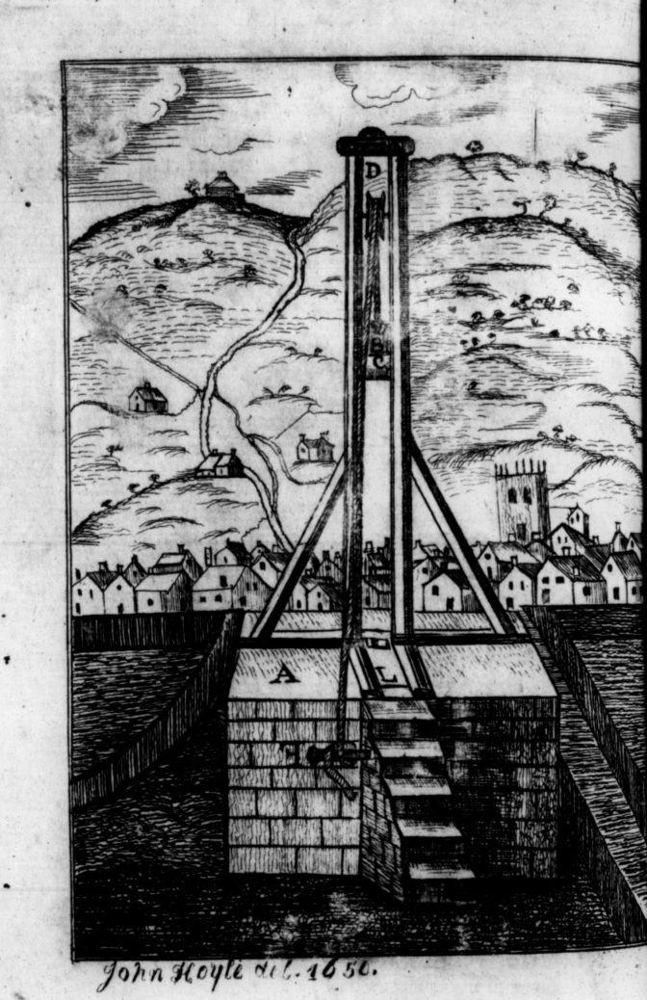
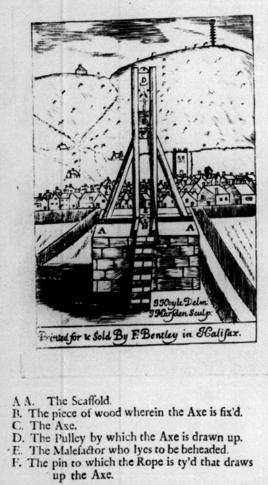
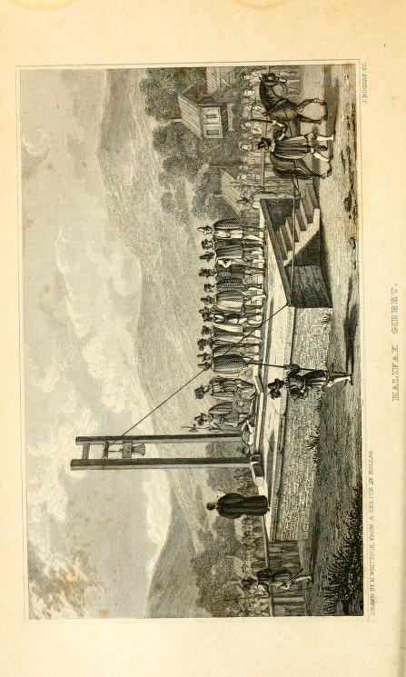

# The Halifax Gibbet

## Halifax Gibbet

https://theyorkshirejournal.wordpress.com/wp-content/uploads/2018/11/2018-2-the-halifax-gibbet-pages-26-45.pdf

In *Sheffield Daily Telegraph*, [Thursday 24 May 1877](https://britishnewspaperarchive.co.uk/viewer/bl/0000250/18770524/171/0008).

THE HALIFAX GIBBET LAW.

The Gibbet Law forms a curious feature in the history Halifax, and it is a subject of more than local interest. The law existed from time immemorial, and its origin is probably coeval with that of the town. It has been traced to the early period of 1280; it existed at the time when the manor of Wakefield, containing the parish of Halifax, was granted to the Earl of Warren, and was continued, down to 1650. We find in Holinshed's "Chronicle," edition 1587, the following interesting account:— "There is and hath been of ancient time a law, or rather custom, at Halifax, that whosoever doth commit any felony, and is taken with the same, or confess the fact upon examination, if it be valued by four constables to amount to the sum of thirteen pence halfpenny, is forthwith beheaded upon one of the next market days (which fall usually upon the Tuesdays. Thursdays, and Saturdays), or else upon the same day that he is so convicted, if a market be holden. The engine wherewith the execution is done is a square block of wood, the length of four feet and a half, which doth ride up and down in a slot, rabet, or regall, between two pieces timber that are framed and set upright of five yards in height. In the nether end of the sliding block is an axe, keyed or fastened with an iron into the wood, which being drawn up to the top of the frame, is there fastened by a wooden pin (with a notch made into the same, after the manner of a Samson's post), unto the midst of which pin also there is a long rope fastened, that cometh down among the people; so that when the offender hath made his confession, and hath laid his neck over the nethermost block, every man there present doth either take bold of the rope for putting forth his arm near to the same as he can get, in token that he is willing to see justice executed, and pulling out the pin in this manner, the head block wherein the axe is fastened doth fall down with such violence that if the neck of the transgressor were so big as that of a bull it should be cut in sunder at a stroke and roll from the body a huge distance. If it be so that the offender be apprehended for an ox, sheep, kine, horse, or any such cattle, the self beast, or other of same kind, shall have the end of the rope tied somewhere unto them, so that they being drawn, draw out the pin whereby the offender is executed." Before a felon was condemned to suffer, the proof of certain facts appears to have been essentially necessary. In the first place, the felon was to be taken in the liberty; and if he escaped out of the liberty, even after condemnation, he could not be brought back to be executed; but if he ever returned into it again, and was taken, he was sure to suffer; was the case with one Lacy, who, after his escape, lived seven years out of the liberty, but, returning, was beheaded on his former verdict, A.D. 1623. This man was not so wise as one Dinnis, who, having been condemned to die, escaped out of the liberty on the day fixed for his execution (which might be done by running about five hundred yards), and never returned again. Meeting several people, that asked him if Dinnis was not to be beheaded that day? his answer was "I trow not," which, having some humour in it, became a proverbial saying amongst the inhabitants, who to this day use the expression, "'I trow not,' I quoth Dinnis." . . . In 1840 there was discovered the pedestal, or stone scaffold, which had been concealed under a long accumulation of rubbish and soil forming a grassy mound commonly supposed to be a natural hill, on which the temporary scaffold for the gibbet was from time to time erected; but the town trustees having purchased the Gibbet Hill, and being wishful to reduce it to the level of the surrounding fields, this curious relic of antiquity was brought to light, and is carefully preserved. In the enclosure the following inscription is placed;— "The Remains of the Halifax gibbet within this enclosure were discovered in the year 1840 under a mound of earth known as Gibbet Hill and were enclosed by the Trustees of the Town. The Public Records Preserve the Names of fifty-three Persons Beheaded on this spot between the years 1541 and 1650. The first on tho list is Richard Bentley of Sowerby Executed March 20th 1541 and the last were John Wilkinson and Anthony Mitchell both Beheaded April 30, 1650. This Fence was erected at the cost and in the Mayoralty of the Worshipful Samuel Waterhouse. A.D. 1852." ... At the Rolls Office. Wakefield, may still seen the ancient gibbet-axe. It weighs seven pounds twelve ounces; its length is ten inches and a half; it is seven inches broad at the top, and very near nine at the bottom; its centre is about seven inches and a half. The Earl of Morton, passing through Halifax about the middle of the sixteenth century, witnessed an execution, and gave instructions for a model to be made of the gibbet, and on his return to Scotland, of which he was Regent, he had similar instrument constructed, which, remaining so long unused, was called "The Maiden;" but on the 3rd of June, 1581, he was himself executed by it. "The Maiden" is preserved in the Museum the Society of Antiquaries of Scotland, at Edinburgh. The saying of "From Hell, Hull, and Halifax, good Lord, deliver us," is very common, and, according to Fuller, is part of the "Beggars' and Vagrants' Litany."— *The Argonaut for May.*

--

https://archive.org/details/bim_eighteenth-century_halifax-and-its-gibbet-_bentley-william-parish_1761
Halifax, and its gibbet-law placed in a true light. Together with a description of the town, ...  1761
by Bentley, William, parish clerk of Halifax.

Publication date 1761

esp. Chapter II, pp. 12-31, *Of the Cuſtoms, or Law of Halifax, in reference to the Gibbet, and the Reasonableness thereof*; Ch. III, pp. 31-9, *Containing a full and true narrative of the Manner of Trying Felons at Halifax, in the Foreſt of Hardwick, within the Manor of Wakefield, as the ſame hath been managed in all Times by Paſt. Together with a Relation after what Manner they were Executed at the Gibbett*.

TO DO - this is the same as in The history of the town and parish of Halifax

Chapter II.

*Of the Cuſtoms, or Law of Halifax, in reference to the Gibbet, and the Reasonableness thereof.*

THE moſt Eminent and Learned in the Laws of our Nation, do tell us for an undeniable Maxim, *That the common Law of* England, *is the common Cuſtoms of the Realm.*

AND aſo, that when ſuch a Cuſtom hath obtain'd the Force of a Law, it is ever ſaid to be *Jus non conſcriptum*; in regard that it cannot be made or created, either by Charter from the King, or enacted by the Authority of King and Parliament, which are public Acts reduced into Writing, and are always Matter of Record.

BUT where Things have only a Relation to matter of Fact, conſiſting only in Uſe and Practice, it can no where be Recorded but in the Memory of Man, and the Uſage of the People.

SUCH Cuſtoms being among the Learned, eſteem'd as ſelf-evident Principles, and fixed in the ſame Orb with the Law of Nature.

HENCE it comes to paſs, and after the following Manner, hath every Cuſtom had its Beginning, Growth, and Perfection.

WHEN any thing tending to a Public Good, is not only reaſonable, but profitable in its Contrivance, privately and then, ſucceſsfully propounded and brought forth into Action; this no ſooner is found to be good and beneficial to the People, as having a perfect Agreement with their Neceſſities and Diſpoſitions; the ſame is immediately put into Uſe and Practice, which by conſtant and frequent Iteration, thro' Tract of Time, doth contract the Authority of a Cuſtom, and that continuing without any Intèerruptions from the Supreme Power, (time out of mind) obtains the Force of a Law.

And among all Laws, thoſe which are grounded on Cuſtom, have in the Judgement of all learned Writers, ſtill carried the Pre-eminence, and obtained the Reputation of the moſt Perfect, moſt Excellent, and without Compariſon, the beſt and moſt firmly obliging Law on which to found, conſtitute, and to preſerve any Common Wealth, and doth indeed exceed, and is preferable to all others, for this undeniable Reaſon.

BECAUSE all written Laws which are made, either by the Edicts of Princes, or by the King and his Grand Council in Parliament; theſe are all of them impoſed upon the Subjects, and to be obeyed by them, before they have had any experimental Tryal, or Approbation of them whether they be fit and agreeable to their deſigned Uſe, and do in all Things anſwer the Neceſſities, Natures, and Diſpoſitions of the People; or on the contrary, may impoſe many Inconveniences, and Prejudices upon their Liberties, eſpecially in Things relating to common Practice betwixt Man and Man, one with another.

WHEREAS a Cuſtom can never create any ſuch Prejudices, in regard it never becomes a Law wherewith to bind the People, until it hath been tried, approved, and allowed of, time out of mind, without any manner of Queſtion, Diſpute or Interruption.

AND for which practical Reaſon, and moſt ꝓroitable Experience, our Sages in the Common Law of *England*, now Part of *Great Britain*, do in their Pleas, ſtile Cuſtom, to be the Root and Touch-ſtone of all good Laws, in regard, that although it took its Beginning beyond the Memory of any living Man: yet it is daily preſerved in the ſucceſſive Memoirs of Living Men.

AND as the Laws of* Great Britain*, on this Side the River *Tweed*, are grounded upon divers general Cuſtoms; ſo likewiſe are there ſome peculiar Laws, which are uſed in ſeveral Counties, Towns, Cities and Lordſhips, within this Part of the Realm, which are built upon ſundry particulars Cuſtoms, appertaining

TO DO

https://archive.org/details/bim_eighteenth-century_the-history-of-the-town-_bentley-william-parish_1789/mode/2up?q=%22halifax+gibbet%22
The history of the town and parish of Halifax, containing a description of the town, ...  1789
by Bentley, William, parish clerk of Halifax.

Publication date 1789

Ay Account of the Cuſtoms,

OR LAW of HALIFAX,

In reference to the Gibbet and the

REASONABLENESS THEREOF.

pp393-417

THE moſt eminent and learned in the laws of our nation, do tell us for an undeniable maxim, That the common law of England, is the common cuſtoms of the realm.

And also, that when such a custom hath obtained the force of a law, it is ever ſaid to be *Jus non conſcriptum*, in regard that it cannot be made or created, either by Charter from the King, or enacted by the authority of King and Parliament, which are public acts reduced into writing, and are always matter of record of fact.

But where things have only a relation to matter of faxct, conſiſting only in use and practice, it can no where be recorded but in the memory of man, and the uſage of the people.

Such cuſtoms being among the learned, eſteemed as ſelf-evident principles, and fixed in the ſame orb with the law of nature.

Hence it comes to pass, and after the following manner, hath every cuſtom had its beginning, growth, and perfection.

When any thing tending to a public good, is not only reafonable, but profitable in its contrivance, privately and then successfully propounded, and brought forth into action; this no ſooner is found to be good and beneficial to the people, as having a perfect agreement with their neceſſities and diſpoſitions; the ſame is immediately put into uſe and practice, which by conſtant and frequent iteration, thro' tract of time, doth contract the authority of a cuſtom, and that continuing without any interruptions from the ſupreme power, (time out of mind) obtains the force of a law.

And among all laws, thoſe which are grounded on cuſtom, have in the judgement of all learned writers, ſtill carried the pre-eminence, and obtained the reputation of the moſt perſect, moſt excellent, and without compariſon, the beft and moſt firmly obliging law on which to found, conſtitute, and to preſerve any common wealth, and doth indeed exceed, and is preferable to all others, for this undeniable reaſon.

Becauſe all written laws which are made, either by the edicts of princes, or by the King and his grand council in Parliament; theſe are all of them impoſed upon the ſubjects, and to be obeyed by them, before they have had any experimental tryal, or approbation of them whether they be fit and agreeable to their deſigned uſe, and do in all things anſwer the neceſſities, natures and diſpoſition of the people; or on the contrary, may impoſe many inconveniences, and prejudices upon their liberties, eſpecially in things relating to common practice betwixt man and man, one with another.

Whereas, a cuſtom can never create any ſuch prejudices, in regard it never becomes a law wherewith to bind the people, until it hath been tried, approved, and allowed of, time-out of mind, without any manner of queſtion, diſpute or interruption.

And for which practical reaſon, and moſt profitable experience, our ſages in the common law of England, now part of Great-Britain, do in their pleas, ſtile cuſtom, to be the root and touch-ſtone of all good laws, in regard, that although it took its beginning beyond the memory of any living man; yet it is daily preſerved in the ſucceſſive memoirs of living men.

And as the laws of Great-Britain, on this ſide the river Tweed, are grounded upon divers general cuſtoms, ſo likewiſe are there ſome peculiar laws which are uſed in ſeveral counties, towns, cities, ind lordſhips, within this part of the realm, which are built upon ſundry particular cuſtoms, appertaining only to thoſe places, but do all of them concur in this general cuſtom, That in all the King's courts, every cauſe is to be determined, not by the judges itinerants, but by twelve men of the neighbourhood, according to antient cuſtom.

But thoſe particular cuſtoms, which do more immediately lead us to the conſideration of our preſent caſe, are thoſe cuſtoms of gravel kind in Kent, Burgh Engliſh, in Nottingham, and ſeveral other cuſtoms in and about the city of London, and were never interrupted, or called in queſtion, by any acts of Parliamen

Alſo Mr. Manwood in his learned diſcourſe ot foreſt laws, gives us a very ſatisfactory account both of the antiquity of foreſts, their peculiar cuſtoms, and the neceſſities of them; together with their manner of apprehending, examining, ang condemning of felons, very different from the practice of all other courts, and their laws, and in whoſe way of cuſtomary proceedings no oath is required by reaſon of the undeniable evidence of the fact.

Unto which learned diſcourſe the reader is referred, as to what concerns their peculiar terms of art, and methods of proceeding according to their foreſt laws. So that nothing more need to be ſaid on that account.

All which conſidered with a deliberate judgement, will make way to my proceeding more uninterruptedly to give an impartial account of the cuſtoms of the foreſt of Hardwick, as it hath a peculiar relation to the town of Halifax and the liberties thereunto appertaining, which you may read in the following order.

The inhabitants within the foreſt of Hardwick, being a mixed people of freeholders and copyholders, all of them ſubject to the Lord of the Manor of Wakefield, formerly the inheritance of the Kings of England, and is ſtill part of the Dutchy of Lancaſter, which was ſometime the inheritance of the earl of Warren, &c. but now the inheritance of his Grace the Duke of Leeds, &c. Have, and do claim a cuſtom by the uſage and continuance of
by reaſon of the undeniable evidence of time, fince when is not in the memory of man to the contrary, as was acknowledged in the Days of King Philip and Queen Mary, who have by their ſtatutes of the ſecond and 3d. of their reigns, confirmed unto them from their uſage, cuſtom and freedom, to buy and ſell wool by retail, in order to the carrying on of that manufacture, which gave occaſion to the encouraging cuſtom.

That if a felon be taken within their liberty, with goods ſtolen out or within the liberty or precincts of the ſaid foreſt, either Hand-habend, Back-berand, or Confeſs-and cloth, or any other commodity of the value of thirteen-pence half-penny, that they ſhall after three markets, or meeting days, within the town of Halifax, next after ſuch his apprehenſion, and being condemned, he ſhall be taken to the Gibbet, and there have his head cut off from his body.

This is the ancient cuſtom of Hallifax, which ought not to be diſregarded, although ſome ſort of perſons have been pleaſed to caſt a reproach upon it, by giving to it the characters of rigid, cruel, ſevere and irrational; but how juſtly and truly it doth merit ſuch a cenſure, is left to the wiſe and ingenious, when they have read and conſidered the true and right information, both of the nature and diſpoſition of the people, the temper, extent, and ſituation of the ſoil; together with the manner of their exerciſing of their ſeveral callings, and their diſtance from neighbours, it cannot bur appear to them, a thing moſt fitting and neceſſary, eſpecially when they add thereunto, that this their way of proceeding is grounded upon the law of nations, that is to ſay, the civil law, which doth require that the theft be laid open, and made manifeſt; or if you pleaſe, take it in their own phraſe, that it be Fortuj Manifestum.

For being ſuch, it ſtands in need of no oath, to inform and convince the judgment of the jury.

And to this determination of the civilians, doth Bracton, our learned common lawyer agree; yea, and as poſitively confirms the ſame, as may be ſeen and read at large in his third book, ſecond tract, and thirty ſecond chapter, in which he plainly declares, That there is nothing more required to evidence the truth of the felony, than what is uſed in our practice, that the thief be taken, hand-habend, and back-berand. He doth only make mention of theſe two, as ſufficient evidence; but the cuſtom of the foreſt of Hardwick hath added thereto confeſſion, to make the theft more undeniably manifeſt.

Nor is the felon, when apprehended, and from theſe evidences condemned to die, ſpeedily and without any further inſpection and conſideration, executed; but the whole matter is ſolemnly and deliberately examined by the Frith Burghers, within the ſame liberty; the extent of which liberty ought well to be known and underſtood by every reader, as it gives in part the Occaſion of the cuſtom, and therefore ſhall take occaſion to make its deſcription.

Theſe liberties have their beginning on the weſt, from the bounds dividing the counties of Yorkſhire and Lancaſhire. On the eaſt, Salter Hebblebrook, as the ſame runneth from Illingworth to the River Calder. On the north, it borders on the vicarage of Bradford: and on the ſouth on the rivers of Riburn and Calder, and doth contain within its circuit theſe following Towns and Hamlets,

Halifax, Ovenden, Illingworth, Mixenden, Bradſhaw, Skircoat, Warley, Sowerby, Riſhworth, Luddenden, Midgley, Erringden, Heptonſtall, Rottenſtal, Stanfield, Crofs-ftone and Langfield.

The ſoil being much of the ſame nature of all foreſts, ſtony, mountainous and barren, but in moſt places very much improved by the populouſneſs and great induſtry of the inhabitants.

And out of the moſt wealthy, and beſt reputed men for honeſty and underſtanding, from among theſe towns and hamlets, they uſually made choice for their juries, by whom all Felons were tryed; a brief account whereof you may take in the manner following.

When the felon is firſt apprehended, he is forthwith brought unto the Lord's Bailiff in Halifax, who by virtue of the authority granted unto him from the Lord of the Manor of Wakefield, under the particular ſeal appertaining to that Manor, who there keeps a common goal in the ſaid town, and doth receive the priſoner, and him there detains in acta et ſalva cuſtodia, for he hath alſo the keeping of the ax, and is to be his executioner at the Gibbet, when condemned, in order whereunto, at the complaint of the proſecutors, the Bailiff forthwith iſſues out his ſummons to the conſtables of four ſeveral towns, within the ſaid precincts, to require four Frith Burghers within each town, as members of the ſaid foreſt, to appear before him, at, or upon a day certain, that then and there they may make a jury to examine ſuch matters of fact as ſhall be alledged, and made manifeſt before them.

At which, their time of appearance, both the felons and proſecutors, are brought before them face to face, and the thing ſtolen produced to their view, if it be beaſt or horſe, or any thing of that kind; but if it be a thing portable, it is laid before them in the room, where they are aſſembled together; and if upon examination they do find that the felon is not only guilty of the goods ſtolen, and lying, or being within their view, but alſo do find the value of the goods ſo ſtolen, to be of thirteen pence halfpenny, or above, then is the felon found guilty by the ſaid Jury; grounding that their verdict upon the evidence of the goods ſtolen and lying before them, together with his own confeſſion, which, in ſuch caſes, is always required; and being ſo found guilty, is by them condemned to be beheaded, according to the antient cuſtom.

But if upon examination and conſideration had of the whole matter, they do not find the accuſed to be guilty of the feloay, the jury acquits him, her, or them; and the party or parties ſo accuſed, is preſently ſet at liberty, upon payment of his, her, or their fees.

But when any felon is found guilty, and ſo pronounced, publiſhed, and declared by the Jury, the Bailiff immediately thereupon returns him back again into priſon, for the ſpace of one week, or thereabouts; not only that he may have time to prepare himſelf for his latter end, but alſo to expoſe him openly to the world, for the reaſon following.

There being, as hath been ſaid before, three meetings, or market days in Halifax every Week, for traffic in all ſorts of commodities, ſaving cloth, which is only bought and fold on the Saturdays; on every ſuch meeting day, the felon is ſer in the public ſtocks, and either upon his back, if the thing folen be portable, or if not, then before his face the goods are ſo placed, that they may be noted by all paſſengers: This is done in terror to others, that they may take warning by ſuch wicked deeds, never to commit the like.

And alſo that he being known for a felon, it may engage any perſon that hath ought againſt him, to bring in their accuſation,

This is that regal power, which by the King's and Queen's of England, hath been always confirmed to the foreſt of Hardwick ever ſince the firſt grant to the Lord of the Mannor of Wakefield, and by them hath been uſed and practiſed beyond the memory of man; according to the law of nations: which Lords have always in their abſence, committed the managing of the Gibbet Law unto their chief Bailiff reſiding in Halifax, as their legal deputy, and unto whom the Lord always committed, not only the keeping of the Ax, and the Gibbet, as is before declared, but alſo within the liderty of the Manor of Wakefield, and within the foreſt of Hardwick, to make execution of all writs and precepts iſſuing not only out of the Lord's courts, but out of any of the King's and Queen's courts at Weſtminſter, directed unto them, with this ſtrict obligation, that he the ſaid chief Bailiff, do give notice of all ſuch perſons, as ſhall preſume to make arreſts upon any Sheriff's warrant, within the ſaid manor, and cauſe affidavit of ſuch arreſts to be made before a Maſter of the Dutchy, to the end that ſuch perſons may be baniſhed, for enterino into the ſaid manor without licenſe.

And alſo he hath authority to ſummon the Frith Burghers, which Frith Burghers, is by Roger Hovenden, folio 345, underſtood to be ſame with that which is now called Frank Pledge; a word it is, which ſignifies no more in our common law than a pledge or ſurety that is given for every free-man.

For the antient cuſtom of England faith Bracton, in order to the preſervation of the publick peace, was that every free born man of fourteen Years of age (all religious perſons, clerks, knights and their eldeſt ſons excepted) ſhould find ſureties for his faith and obedience, and true bearing to the King and all his ſubjects and liegemen, or elſe to be confined and kept in priſon.

Whereupon certain of the neighbourhood was required to become bound one for another, to ſee to it, that each man had his pledge forth coming at all times, to anſwer for his fidelity or his tranſgreſſion, and when required thereunto, if they brought him not forth in one and thirty days, they were to make ſatisfaction for his offence, or ſuffer ſuch amercements, as the Lord ſhould in the name of his authority from the King think fit to impoſe on him.

Which manner of proceeding in the Lord's court-leet, I thought very convenient to relate, in regard it gives very much light and reaſon, and alſo very great authority to the cuſtomary Laws of the foreſt of Hardwick, with a very peculiar relation to the Gibbet and its Law, as it hath been formerly uſed in Halifax and for all the adjacent parts, trading within the circuit and liberties of the foreſt of Hardwick, conſidering the nature and diſpoſition, of the people, as well as the ſituation of the inhabitants, which was one main reaſon of the riſe of this cuſtomary law.

For being grown very populous, thro' the number of ſervants, foreigners and ſtrangers of all ſorts, retained to aſſiſt them in their callings, and other ſervices, beſides the increaſe of their own children, it cannot he expected but that in the multitude of ſuch various inclinations, ſome will prove wicked and ungovernable, for vice and all ſorts of intemperance, are ſpreading evils, apt to harden men in all manner of wicked practices, eſpecially when rough riotous living, or otherwiſe by misfortunes and unſucceſsful proceedings in their callings, they and their families being brought up into poverty, ſuch perſons (eſpecially being looſe principled) are apt to fall unto ſtealing and other vicious practices, tempted thereunto by Satan and their own wants,. together with the opportunity laid before them of taking their neighbours cloth from off the tenters, which they conclude may be done without diſcovery, in regard thoſe tenters are at ſome diſtance from heir houſes, and their houſes at a much greater diſtance from neighbours, to diſcover their wickedneſs, which thing hath but given too frequent occaſion unto men who want means to ſupply their extravagant expences, to rob honeſt men, and moſt commonly they do it unto thoſe who are leaſt able to bear the loſs; and becauſe of their inability, cannot proſecute ſuch felons at the common law, according their merit, if they ſhould do it, what by reaſon of their diſtance from the place of the affizes, which is held but twice in the year, and alſo ſo vaſtly expenſive, that they have neither money nor leiſure wherewith to proſecute the felon: beſides, well knowing that if they ſhould do it, the do but ſpend both their time and their money, recover thoſe goods they muſt never enjoy, as being forfeited to the crown; which neglect, hath indeed increaſed the number of thieves.

All which hazards and inconveniences, coming to the knowledge of the gracious Kings of this realm, gave occaſion to the contrivance and allowance of this cuſtomary law, which doth in reality prevent all ſorts of misfortunes and caſualties, ſo far as human wiſdom and power can extend; endeavouring to ſecure every man in his rights, liberties and properties, according to the ancient cuſtoms of England, moſt commonly confirmed unto them by Magna Charta; and ſuch a contrivance it is, as is both equitable and in all its proceedings betwixt party and party, for by this cuſtom every felon is tried by his neighbours, and is himſelf and his ſtolen goods, the only evidences againſt him, not only to make his condemnation juſt and equitable, but alſo in ſome reſpect, according to the law of God, to make reſtitution by permitting the party injured, to have his goods reltored to him again, with as little loſs and damage as can be contrived; to the great encouragement df the honeſt and induſtrious, and as a great terror to the wicked and evil doers.

Furthermore, this way and madner of proceeding with felons, cannot in reaſon be condemned for unjuſt and unequitable in paſſing the ſentence of death upon them for ſtealing to the value of thirteen pence half-penny, in regard it is a known received maxim, that the common law is, grounded upon reaſon, and ſo is undeniable. Now by the common law, it is felony and death for any perſon to ſteal a thing which is above the value of twelvepence, on a verbal proof; ſurely then it muſt needs paſs undeniable, that it ought to be felony and death to him that ſteals any thing above the value of thirteen-pence half-penny; more eſpecially ougnt it to be ſo, where the perſon is remarkably ths e known and taken in the fact, hath the goods JW. brought in for evidence againſt him, and the truth ity thereof confirmed by his own confeſſion; this is a matter of fact which cannot be denied by any prudent and conſidering perſons; and in regard conſideration is the root from whence ſprings and grows up all cuſtoms, the ground of all uſes, the reaſon of all right, and the cauſe and occaſion of all duties; certainly then it muſt neceſſarily follow.

That thoſe conſiderations which laid the foundation of this foreſt cuſtomary law, muſt needs be allowed to be juſt and equitable, as well as neceſſary, becauſe it carries in the body of it a real intention to preſerve the peace and right of the King and his ſubjects; the promoting, ſtrengthening, and incouragiug the moſt ſubſtantial manufacture of the nation.

By vertue and under the protection of this cuſ755 tom, them that are rich, are encouraged with freedom and ſecurity to lay out their money, to imploy and ſet at work thoſe that are poor and neceſſitous, to prevent them and their families from becomin
burthenſome to the country.

And on the other ſide, through the plenty of work, them that are poor, are made happy inſtruments through their induſtrious labours of promoting the peace and wealth of the common-wealth, and oftentimes it becomes inſtrumental of raiſing themſelves and families from meanneſs and poverty, to the increaſe of riches and plenty.

All which good intentions and undertakings can never attain their true and proper ends, without the aſſiſtance and ſecurity, as well as protection from ſuch juſt laws, whoſe ſpeedy execution, not only cuts off all felonious and wicked perſons, but doth likewiſe faithfully reſtore to every man his own, without much loſs or damage. The ſenſe whereof ſhould engage every honeſt tradeſman, not to traduce and cenſure with hard names this moſt ancient cuſtom, but highly to applaud its benefits and privileges, in keeping them under ſafety, while they enjoy the fruits of their labours in peace and quietneſs.

Nor indeed can the wiſe and prudent, altho' no traders in cloth, paſs raſh cenſures to the condemnation of this cuſtomary law, when they reflect upon that grand maxim, That every man's particular intereſt is involved in the good of the whole; and that by judgement and juſtice the throne is eſtabliſhed, and where theſe are wanting piety and honeſty inſenſibly decay, and all ſin and wickedneſs continue proſperous and ſucceſsful.

Beſides ſuch men may conſider that this kind of al cuſtomary law, is no new thing, lately ſprung out of the heads of angry, covetous, ſelf-ended and contentious men, but it is a law which hath been practiſed in this part of Great-Britain before the Norman conqueſt, and during the time of the Saxons; and hath alſo its further confirmation by the pracice of all the European nations; inſomuch that we need travel no further for a preſent proof, then to the Highlands in the north part of this iſland of Great-Britain, ſtill continued to our preſent age, where many lords have within their manors, Furca & Foſſia, for the puniſhment and execution of felons, taken within their juriſdiction, and all of them grounded upon ancient cuſtom.

Which manner of proceeding is the rather to be noted, in that it not only gives confirmation to the cuſtom of the foreſt of Hardwick, as being no novel, and an impracticable device; but alſo in that it beſpeaks the noble and more, generous way of putting felons to death, not hanging them by the neck, as is done to moſt contemptible animals, but by ſevering their heads from their bodies with an ax, after the manner of their engine called the Scottiſn Maiden, in their vulgar language. A death ſo brave and manly, that many perſons of knightly order, have petitioned the Kings of England, that they might be honoured with that death, when condemned to ſuffer for their treaſonable offences.

Finally, and utterly to put to ſilence all cavilling objections, for in this caſe nothing ought to be omit. ted that can evidence the chriſtian prudence of this cuſtomary law, I will in a few inſtances, declare with what certainty, and religious charity they have all along proceeded againſt every felon which was brought before the jury.

Firſt, They are aſcertained of his perſon, and that he is really the man that hath committed the felony, altho' he ſhould ſtubbornly and with a bold face deny his name; and this is done, by his being either taken in the very committing of the fact, or elſe that he is found with the goods about him, or under his cuſtody; undeniable aſſurance that he is guilty of the felony, altho' his name be concealed.

Secondly, To aſcertain the fact beyond all doubtful diſputation, their law hath theſe limitations, that the felon muſt be taken hand-haband, that is, having his hand in, or being found in the very act of ſtealing, or back-berand, that is, having the thing ſtolen, either upon his back, or ſomewhere elſe about him, carrying it away, and doth refuſe, when aſked, to tell where he had it, or how he came by the ſame; nor doth produce any witneſs to teſtify for him, how he came by ſuch things, but ſeeks to evade the truth of the matter, by trivial excuſes, various reports, and dubious ſtories; alledging ſometimes one thing, and by and by contradicting himſelf, ſaying he had it from this and the other man, naming ſeveral perſons and ſeveral places; thereby giving juſt occaſion of ſuſpicion that he is a thief; or elſe he is found out and diſcovered by his own free confeſſion, that he is really the perſon which did ſteal the thing, for which he was apprehended and now accuſed.

Thirdly, They ate very prudent and merciful in their manner of proceeding, in not altogether following the ſtrict rule of the law, but put the value of thirteen-pence half-penny upon the thing ſtolen; and if, at the judgment of the Jury, it be but, at the utmoſt value, worth thirteen-pence halfpenny and no more, or of leſs value, by this cuſtom they are to acquit the felon, and he ſhall not die for it.

Fourthly, This, their cuſtomary law, is only againſt theft, which declares it to be calculated only, and on purpoſe for this meridian, to ſecure all induſtrious tradeſmen in the woollen manufacture; and ſuch a manner of theft it muſt be, which doth occaſion their cuſtom to be grounded on the law of nations, called furtum manifeſtum, or manifeſt theft; for the thing ſtolen (as hath already been ſaid) muſt be produced before the Jury, to bear evidence againſt the felon.

Laſtly, As touching the manner of the felon's death, you will find great kindneſs and chriſtian compaſſion to be diſcovered, in that he hath fix days allowed him after his condemnation, to prepare himſelf by the beſt means he can deviſe, or ſhall make choice of, to fit, and prepare himſelf for his latter end religiouſly and devoutly, as being well aſſured that his death is unavoidable.

All which prudent, chriſtian, and neighbourly proceedings, beſpeak very wiſe and deep conſideration to have been exerciſed in contriving and framing this cuſtomary law, in regard that like all dther neceſſary and wholeſome laws, it doth command and require, that right be done to all the King's liege people.

It forbids and corrects, that which is unlawful and unjuſt, in order to the preſervation and ſecurity of every man's right and property; otherwiſe, if ſome men were not kept in awe, and under the obedience of ſuch laws, they would ſoon become as ungovernable as the wild rangers of the wilderneſs, mercileſsly devouring one another; nor, on the othe ſide, would ſome men's tempers ſuffer them to condemn and take away the lives of their fellow creatures, altho' juſtly deſerving death by the laws both of God and man, if they were not commanded and compelled thereunto, by the power and rule, of the law. On which account was care taken, that this cuitomary law of Halifax, ſhould carry in it the power of compulſion, in reference both to the proſecutors, the felon, and the jury, and doth ſtrongly imply it to be of regal and legiſlative authority.

Having already given in an abſtract by what power the bailiff ſummons the jury, and after what manner they proceed againſt the felon, together with the iſſue that befalls both the innocent and guilty felons. Nothing is further remaining to be ſpoken to on that occaſion, but to give a ſhort narrative how far this law is compulſory to the profecutors. And thus it is.

This cuſtom doth require that every man who hath any goods ſtolen within this liberty, and ſhall ſecretly, without making any public report thereof by his own induftry, or the additional help ot ſome private friend and neighbours, hath not only dicovered the felon, but ſecured the goods, he muſt not, by any underhand, or private contract, receive his goods again without proſecuting the felon; but he is, by this cuſtomary law, bound and obliged to bring the felon, together with what goods he hath ſtolen, to ſome of the Lord's bailiffs, within the Manor of Wakefield, who preſently ſends away the felon, and the things ſtolen, to the chief bailiff in Halifax, and there, before the proſecutor can get his goods again, he muſt proſecute the felon according to ancient cuſtom; otherwiſe if he refuſe to proſecute, he will not only forfeit his goods to the Lord, but run the danger of being accuſed of theft-boot, for his private connivance and agreement with the felon. Thus, and according to this manner, is the proſecutor compelled by this law to purſue the felon, and this way of preventing underhand practices and colluſions, gives great encouragement as well as ſecurity to all tradeſmen againſt all manner of felonious practices.

From all which, it may rightly and truly be concluded, that this cuſtom really conſiſts more of terror than tyranny, of a national profit, than any private intereſt, and all along, like all other ancient and good cuſtoms, hath appeared to carry along with it, the univerſal conſent and compliance of the whole land; in that there never was yet known any legal complaints exhibited againſt it in any public or private ſeſſions, nor before any judges of aſſizes, held at York for the ſame county ; nor never any complaints exhibited againſt it unto the high court of Parliament in any King's reign.

But on the contrary, there hath been given to it great aſſurance and manifeſtation of the extraordinary regard which the Kings of England and their legal courts and great officers therein, have always had to this good and neceſſary cuſtom, doth particularly appear, in that the Coroners have it given in charge, as part of their office and duty, that after any felon hath been condemned and executed, they do forthwith repair to the town of Halifax, and there ſummon a jury of twelve men before them, and ſometimes the ſame jury that — the felon, unto whom he adminiſters an oath, obliging them to give in a true and perfect verdict, relating the matter of fact, for which the ſaid felon was executed, to the intent that a record may be made thereof in the Crown-Office, to teſtify the King's allowance and corroboration of their cuſtomary law. And that the ſame may be continued for the good ſecurity and benefit of his ſubjects and their ſucceſſors, who in theſe parts do practice the art and myſtery of clothing; which gracious and ſage proceedings of the Coroner in this matter ought, one would think, to abate in all conſidering men's minds, that edge of acrimony, which hath provoked malicious and prejudiced perſons to whet and let looſe their tongues to revile and debaſe this laudable and neceſſary cuſtom.

But reaſon and more prudent thoughts having ſome time ſince, driven its furious adverſaries from the railing poſt, they have invented and ſtarted two objections, by which they doubt not but utterly to over-throw its uſage.

Firſt, They urge, That the thing itſelf is now wholly ſuſpended, and its power loſt in ſo long a tract of time, in which it hath not been uſed, time having eaten out its power.

Secondly, They alledge, The manner of its proceedings to be illegal, in that their juries are not all ſworn.

Theſe are the two pillars on which they build their objections, but do not doubt but that the reader will find them ſandy and weak; things of no moment in this caſe, when he hath peruſed the anſwers that ſhall be made unto them in order.

As to the firſt, that tract of time hath ſuſpended is power for want of uſage: It is anſwered the weakneſs of this objection will appear to any reader that rightly conſiders the time, and the manner of its ſuſpenſion.

As to time, it was done in that ſeaſon, when the nation was unſettled, and in a hurry, through the rage and tumults of war; ſo no proper ſeaſon for regulation of laws, which requires calmneſs, and a ſedate temper of mind.

And as to the manner of doing it, this being a cuſtom beyond any date, and confirmed by the ſucceſive Kings of England, it can neither be ſuperſeeded nor ſuſpended without an act of parliament; and was really the error of thoſe times, as well as their not underſtanding the merit of the cauſe, that gives ſtill life and being to this dutchy cuſtom, which cannot be deſtroyed without an act of parliament; for if our civil privileges and liberties allowed unto us, by the conſent of king and people, were not to ſtand firm and untouched, until ſuſpended by the public acts of king and parliament, the nation would be in a very precarious condition, as to all its laws, privileges, and liberties.

And now, after all that hath been ſaid in anſwer to this farſt objection, if ſome mens' honour do ſtill incline them to follow the bias of their own wills, all I have, or indeed is neceſſary to be ſaid as to their conviction, is only to put them in mind, that the foundation of this cuſtom is regal, and then the old maxim cannot but ſuperſeed their raſh judgments, and engage them to own this undeniable truth, that nullum tempus occurit regi.

As to the ſecond objection, that the jury was not ſworn, and ſo their act is illegal.

It is anſwered, that common reaſon, and their own experience, one would think, ſhould tell them, that a man need not ſwear he believes that to he true, which the common conſent of others, and his own eyes and ears confirms to him the truth thereof.

Nor would it appear leſs ridiculous when a man hath a bullock, or a horſe placed before him, if another would not give credit to his word, that this is an ox and that a horſe, except he ſwear to the difference, both which inſtances together, with the free confeſſion of the felon, are the fundamental evidences upon which the Jury ground their determinate ſentence; and are, in themſelves, ſo clear and convincing, that they ſtand in need of no oath to guide and regulate their judgments,

For an oath, according to the rule of ſacred writ, is then only neceſſary, when things are doubtful and controverted to put an end to all ſtrife and contention; which, in this plain matter of fact, and free confeſſion of the felon, is needleſs to be required,

True it is, that in matters of meum and tuum, where things are doubtful and intricate, and where intereſt and relation in any kind, may be apt to warp mens judgments; in ſuch a caſe it is not convenient, but neceſſary, that an oath be adminiſtered to ſuch a concerned jury, in regard the awe of humane laws, and the loſs of their reputation in the world may have a greater influence upon ſome mens conſciences than the fear of God and a future judgment.

But to put the matter beyond diſpute, that an oath is not eſſentially neceſſary to a juryman, when he is to give his difinitive ſentence, even in matters of the greateſt moment of life and death, and that according to the laws and uſages of this nation is clear from this well known inſtance and example.

In the trial of a peer of the realm, where his jury gives their determinate jugdment and ſentence, ony upon their honour, and not from the binding power of an oath: and I hope none will deny but that all conſcientious men value the honour of their ſouls, as much in the ſight of God and man, as the greateſt peer of the realm; for ſo was the opinion of the grave, learned, and moſt faithful counſellor, the Lord Chancellor Edgerton, as appears in the following caſe.

When a matter of moment was propounded to the judges, in which their poſitive judgments were required, and they ſcrupling to do it, becauſe they were not upon the bench, and under the power of an oath.

This great man makes unto them this ſmart reply, ſaying, "your determination in this caſe is not to be doubted of, although there be no oath at all, for except men of knowledge, antiquity of years, and of a good repute, do not fear God and his Judgments, even out of a religious conſcience, which is frænum ante peccatum, et flagrum poſt peccatum, it may juſtly be doubted, that the external ceremony of adding a book to kiſs would little avail."

He that reads this remarkable inſtance, and compares it with the qualities, eſtates and conditions of all jurymen, that profeſſeth godlineſs, and lives in great repute amongſt their neighbours, cannot but conclude it to be want of charity in themſelves to queſtion the juſtice and integrity of their proceedings, eſpecially in this caſe, where the thing itſelf, and the manner of proceedings are ſelf evident, and undeniable.

So that nothing more remains to be added in Juſtification of this advantageous and neceſſary cuſtom, ſave a plain and full narrative of the natter of fact, which will give both light and luſtre to its proceedinsg, and is reſerved for the following ſubject.

It being the condeſcending practice of the ſupreme authority of this nation, to cauſe to be put in print the ſeveral trials and proceedings in law againſt all ſuch offenders, as have deſigned the overthrow of church and ſtate, to the end that all their loving ſubjects may not only be informed, touching the merit of the cauſe, for which ſuch offenders have been condemned and executed.

But alſo to remain an indelible caution unto men of corrupt principles, ſo to conſider, and take heed to their ways, as carefully to avoid all occaſions which may tempt them to commit the like crimes; and likewiſe to preſerve and ſecure all honeſt minds ſtedfaſt and ſincere in their faith and loyalty.

In imitation of which grand and gracious example, and that the juſtice and equity, as well as neceſſity of the Gibbet-Law, may appear unto all men, as the ſame hath been practiſed within the town of Halifax, is the deſign of this ſubject, in which will be preſented a true, perfect, and impartial narrative of the trials, condemnation, and execution of the laſt malefactors, who ſuffered at the ſaid Gibbet, which ſaid execution being, by ſome per ſons in that age, judged to be too ſevere; thence came it to paſs, that the gibbet, and the cuſtomary law, for the foreſt of Hardwick, got its ſuſpenſion. But whether their complaints were juſt and reaſonable, is left to the reader's judgement, when he hath peruſed the following matter of fact, and the equity of their trials.

pp.417-439

A TRUE AND IMPARTIAL NARRATIVE OF THE TRIALS

*Arabam Wilkinſon, John Wilkinſon, and Anthony Mitchell, for Felony, by them committed within the Foreſt of Hardwick, and Liberty of Halifax.*

ABOUT the latter end of April, Ann. Dom. 1650, Abraham Wilkinſon, John Wilkinſon, and Anthony Mitchel, were apprehended within the Manor of Wakefield and the liberties of Halifax, for divers felonious practices, and brought, or cauſed to be brought into the cuſtody of the chief bailiff of Halifax, in order to have their trials for acquittal or condemnation, according to the cuſtom of the foreſt of Hadwick.

*At the complaint and proſecution of*

Samuel Colbeck, of Warley, within the liberty of Halifax,

John Fielden, of Stansfield, within the ſaid liberty,

AND

John Cusforth, of Durker, in the pariſh of Sandall, within the Manor of Wakefield.

Theſe aboveſaid felonious perſons, being upon the information of the aforeſaid proſecutors, taken into ſafe cuſtody by the chief bailiff of Halifax; he, the ſaid bailiff, by virtue of his office, and according to the cuſtom of the foreſt of Hardwick, did forthwith iſſue forth his ſummons to the ſeveral conſtables of Halifax, Sowerby, Warley, and Skircoat, charging and requiring them, that without fail, they make their appearance, with each of them four men of the moſt antient, intelligent, and of the beſt ability, within their ſeveral Conſtableries, at his houſe in Halifax, at, or upon the twenty-ſeventh day of April, in the year of our Lord one thouſand ſix hundred and fifty, to hear, examine, and determine the ſeveral cafes betwixt the proſecutors and the aforeſaid felons.

Accordingly at the day prefixed, the ſeveral conſtables did make their appearance at the bailiff's houſe, with each of them four ſubſtantial inhabitants, whoſe names are as follow.

The NAMES of the JURORS.

HALIFAX JURORS.

James Holland,  
Richard Nicholls,  
Isaac Hooker,  
John Exlet.

SOWERBY JURORS.

Francis Priestley,  
Henry Riley,  
James Dobson,  
Joseph Priestley.

WARLEY JURORS.

John Ryalls,  
Michael Wood,  
John Holdsworth,  
Henry Mirriel.

SKIRCOAT JURORS.

James Whitaker,  
James Ellison,  
Anth. Waterhouse,  
Thomas Gill.

Theſe ſixteen being by the bailiff empanneled into a Jury in a convenient room at his houſe, according unto cuſtom, whither the felons and their proſecutors being brought face to face before them, as alſo the ſtolen goods, to be by them viewed, examined, and apprized.

The bailiff on the ſaid day, being the twenty-ſeventh day of April, in the year aforefaid. Thus, and in the following manner, opens unto them the occaſion of their ſummons.

"NEIGHBOURS and FRIENDS,

"YOU are ſummoned hither and empanneled, according to the antient cuſtom of the foreſt of Hardwick, and by Virtue thereof, you are required to make diligent ſearch and inquiry into ſuch complaints as are brought againſt the felons concerning the goods that are ſet before. you, and to make ſuch juſt, equitable, and faithful determination betwixt party and party, as you will anſwer it between God and your own conſciences."

Which ſaid, the ſeveral informations were brought in, and alledged againſt them, in manner and form following.

*The information of Samuel Colbeck, of Warley.*

The informant ſaith and affirmeth, that upon Tueſday the nineteenth day of April, one thouſand, ſix hundred, and fifty, he had feloniouſly taken from off his tenters by Abraham Wilkinſon, John Wilkinſon, and Anthony Mitchel, ſixteen yards of ruſſet coloured kerſey; part of which cloth you have here before you, and of which you are to enquire of its worth and value, and take their confeſſion here before you.

The information of John Cusforth, of Durker, in Sandal pariſh.

This informant ſaith and affirmeth, that Abraham Wilkinſon and Anthony Mitchel, did feloniouſly take from off Durker-Green, the ſeventeenth day of April, one thouſand, ſix hundred, and fifty, (at night) one black colt, which colt, as well as the priſoner, are here preſented before you; and alſo, at the ſame time, one other grey colt, belonging to Paul Johnſon, of Durker, were feloniouſly taken by theſe men, at the ſame time from off Durker-Green, and is here produced to your view.

The information of John Fielden, of Stansfield.

This informant ſaith, and doth affirm, that he had one whole kerſey piece, feloniouſly taken from the tenters, at Brerely-Hall, by Abraham Wilkinſon, about chriſtmas laſt, which he the ſaid John Fielden, hath found in the hands of Thomas Brown, bailiff, in Wakefield; ſix yards of which kerſey being dyed cinnamon colour, and eight yards thereof white, and frized for blankets; which dyed piece he affirms, that Iſaac Gibſon's wife, of Wakefield, did affirm to the ſaid Fielden, that Abraham Wilkinſon did deliver it unto her; alſo William Elliſons' wife doth affirm the ſame, and John Roberts doth affirm, that he knoweth the man, and his name to be Abraham Wilkinſon.

Theſe three ſeveral informations being thus given in to the Jury, Abrahain Witkinſon, the felon (accuſed by Fielden) craved leave, before they entered into other matters, to be heard as to that information; which being allowed, he, the ſaid Abraham Wilkinſon openly declared, that he did not confeſs the aforeſaid piece unto Gibſon's wife; but ſaith, that he was by and preſent when John Spencer, a ſoldier in Cheſterfield, did deliver the ſaid piece unto Gibſon's wife.

Thereupon ſome debates ariſing amongſt the ſurymen, touching Abraham Wilkinfon's reply to the laſt information; after ſome mature conſideration, the Jury, as is cuſtomary in ſuch caſes, did adjourn themſelves unto the thirtieth day of April, reſolving that day fully to give in their verdict.

And accordingly, on the ſaid thirtieth day of April, they met together again at the Bailiff's houſe, together with the informers, felons, and ſtolen goods; ſome whercof were placed before them in the room, and the reſt in ſuch convenient places where the Jury might view them.

And after a full examination and hearing of the whole matter, they, with united conſent, gave in their verdict in writing, in the words following:

At an inquiſition taken at Halifax, the twenty-ſeventh and the thirtieth days of April, 1650, upon certain informations hereunto annexed.

To the complaint of Samuel Colbeck, &c.

We, whoſe names are hereunto ſubſcribed, being ſummoned and impanneled according to ancient cuſtom, do find, by the confeſſion of Abraham Wilkinſon, of Sowerby, within the liberty of Halifay being apprehended and taken; that he the ſaid Abraham Wilkinſon, took the cloth in the information mentioned, with the aſſiſtance of his brother John Wilkinſon, from off the tenter of Samuel Colbeck, in Warley; being ſixteen yards of ruſſet coloured kerſey, nine yards at the leaſt thereof, being brought before us, with the priſoner; the ſaid Samuel Colbeck doth affirm to be his own cloth, and part of the ſixteen yards aforeſaid, and is ſo confeſſed to be by the priſoner; which nine yards ve do value and apprize to be worth nine ſhillings at the leaſt.

To tne complaint and information of John Cuſworth, &c.

We, the aforeſaid impanneled jury, do find, by the free confeſſion of Anthony Mitchell, that John Wilkinſon did take the black colt of John Cuſworth's, from Durker Green, and that himſelf and Abraham Wilkinſon was there preſent at the ſame time; and alſo that Anthony Mitchell himſelf did ſell the aforeſaid colt to Simeon Helliwell, near Hepton-Brigg, for forty-eight ſhillings, whereof he received in part twenty-ſeven ſhillings, and we do apprize and value the fame colt to be worth John forty-eight ſhillings; likewiſe, we do find, by the confeſſion of the aforeſaid Anthony Mitchell, that Abraham Wilkinſon did take the grey colt of Paul Johnſon's, from off Durker Green aforeſaid, and that John Wilkinſon was with his brother Abraham Wilkinſon, when he took him, and that the ſaid Anthony Mitchell was by and preſent when Abraham did ſtay and bridle the grey colt: alſo he confeſſeth, that himſelf and John Wilkinſon did leave the ſaid colt with George Harriſon, of Norland, wich colt we have ſeen, and do value and apprize him at three pounds.

The determinate ſentence.

The priſoners, that is to ſay Abraham Wilkinbn, and Anthony Mitchell, being apprehended withia the liberty of Halifax, and brought before us, with nine yards of cloth, as aforefaid, and the colts above-mentioned; which cloth we apprized to nine ſhillings, and the black colt to forty-eight ſhillings, and the grey colt to three pounds; all which aforeſaid being feloniouſly taken from the aboveſaid perſons, and found with the ſaid priſoners.

By the antient cuſtom and liberty of Halifax, whereof the memory of man is not to the contrary, the ſaid Abraham Wilkinſon and Anthony Mitchell, are to ſuffer death, by having their heads ſevered and cut off from their bodies, at Halifax Gibbet, unto which verdict we ſubſcribe our names, the thirtieth of April, one thouſand ſix hundred and fifty.

James Holland, Richard Niccols, Iſaac Hooker, John Exley, Francis Prieſtley, Henry Ryley, James Dobſon, Joſeph Prieſtley, John Ryalls, Michael Wood, John Holdſworth, Henry Mirriell, James Whitaker, James Elliſon, Anthony Waterhouſe, Thomas Gill.

After this, the ſaid Abraham Wilkinſon and Anthony Mitchell were, the ſame day, (becauſe it was Saturday, or the great market,) conducted to the ſaid gibbet, and there executed in the uſual form.

The priſoner being brought to the ſcaffold by the bailiff, the ax being drawn up by a pulley and faſten'd with a pin to the fide of the ſcaffald the bailiff, the jurors, and the miniſter, choſen by the priſoner, being always upon the ſcaffoid with the priſoner, while the fourth pſalm is played on the bagpipes in the moſt ſolemn manner.

After che miniſter hath finiſhed his miniſterial office, and chriſtian duty, if it was a horſe, an ox or cow, &c. that was taken with the priſoner, it was thither brought along with him to the place of execution, and faſtened by a cord to the pin that ſtayed the block, ſo that when the time of the execution came (which was known by the juror holding up one of their hands) the balliff, or his ſervant whipping the beaſt, the pin was plucked out, and execution done.

But if there be no beaſt in the felon's caſe then the bailiff, or his ſervant cut the rope.

The above account was taken from the old original Law Book.

This is the plain account of a cuſtom, which by many is ſuppoſed not to have had its like in the kingdom, and therefore they have given it the diltinguiſhing title of the Halifax law; a circumſtance which alone can juſtify an antiquarian in his reſearches about it.

If the felon, after his apprehenſion, or in his going to execution, happen to make his eſcape out of the foreſt of Hardwick, (which liberty, on the eaſtend of the town, doth not extend above the breadth of a ſmall river; on north, about ſix hundred paces; on the ſouth about a mile; but on the weſt, about ten miles,) he could not be brought back to be executed; but if ever he returned into it again, and was taken, he was ſure to ſuffer; as was the caſe of one Lacy, who, after-his eſcape, lived ſeven years out of the liberty, but venturing back, was beheaded on his former verdict, in the year 1613.

This man was not ſo wiſe as one Dinnis, who having been condemned to die, eſcaped out of the liberty on the day deſtined for his execution, and never returned thither again; meeting ſeveral people, they aſked him if Dinnis was not to be beheaded that day? his anſwer was, I trow not; which having ſome humour in it, became a proyerbial ſaying amongſt the inhabitants; who, to this day, uſe the expreſſion, "I trow not, quoth Dinnis."

The gibbet ſtood a little way out of town, towards the weſt end, in a place ſtill diſtinguiſhed by the name of the Gibbet-lane. Here, to this day, ls to be ſeen a ſquare platform of earth, conſiderably raiſed from the. level of the ground, walled about, and aſcended by a flight of ſtone ſteps; on this were placed two upright pieces of timber, hve yards in height, joined at the top by a tranſverſe beam ; within theſe was a ſquare block of wood, which Harriſon, in his deſcription of England, volume i. page 185. London, 1587, ſays, was of the length of four feet and an half, which roſe up and down, between the ſaid uprights, by means of grooves cut for that purpoſe; to the lower end of this ſliding block an iron ax was faitened, vhich is yet to be ſeen at the jayl in Halifax; its weight is ſeven pounds twelve ounces; its length full ten inches and an half; it is ſeven inches over at the top, and very near nine at the bottom; its middle is about ſeven inches and an half; and towards the top are two holes made to faſten it to the block above mentioned. See the Plate.

Harriſon, above mentioned, tells us, with regard to the execution, that every man preſent took holg of the rope, or put forth his arm as near it as he could, in token that he was willing to ſee true juftice executed, and that the pin was pulled out in this manner.

John Taylor, in a book called, "News from Hell, Hull, and Hallifax," aſſerts, that the line was cut, and that no man muſt cut it, but the owner of the ſtolen goods, which if he did, he had all again; but if he would not cut it, he loſt all; the goods were employed to ſome charitable uſes, and the thief eſcaped.

The time of the execution was known by the Jurors (if they could properly be fo called who were not ſworn) holding up one of their hands; for it ſeems as if they were under a neceſſity of being preſent at the execution of thoſe ok they had found guilty, to give it the greater appearance of juſtice. 

*A. The Scaffold. B. The Stock of the Axe. C. The Axe. D. The Pully by which it is drawn up. E. The Black. F. The Pin that holds the ſuſpending Cord. L. The Stage where the Criminal is laid with his Neck on the Block to receive the fatal Blow.*

It is worth remarking, that neither of the laſt executed criminals were taken either handhabend, or backberand, but that both were convicted on their own confeſſion; and it ſeems that John Wilkinſon eſcaped merely by not confeſſing; for Anthony Mitchell charged him directly with ſtealing the black colt; and Abraham Wilkinſon, with aſſiſting him to rob the tenter of Samuel Colbeck. Does it not therefore follow, that the two others might likewiſe have ſaved their lives, had they uſed the ſame precaution? But if ſo, there was a great defect in this mode of proceeding, for unleſs a man was taken with ſtolen goods in his actual and immediate poſſeſſion, (which would very ſeldom be the caſe) his ſilence was ſure to bring him off, and the perſon injured had no farther redreſs; for we do not ſuppoſe that the criminal could, after this, be arraigned for the ſame offence in the King's court. we mult alſo note a miſtake in the regiſter book at Halifax, which has John Wilkinſon beheaded, inſtead of Abraham; for if this be right, then Abraham Wilkinſon was acquitted, though he confeſſed that he ſtole the cloth, and John was executed merely on the information of the two others, which is diretly ſubverſive of the very foundation on which this cuſtom is ſaid to ſtand.

The expreſſion in the determinate ſentence, "that the two colts and cloth were found with the priſoners," appears foreign to the purpoſe, if the nature of this privelege is rightly handed down to us; for they were not found with them either hand-habend, or back berand; neither could they have been found guilty from the manner of the diſcovery, for if they could, John Wilkinſon muſt alſo have ſuffered with them.

The value of the goods ſtolen muſt amount to thirteen-pence half-penny, or more. The opinions about this, however, have differed, ſome fixing the value at thirteen-pence, others that it was to exceed thirteen-pence half- pennny, but the firſt account is to us the moſt probable. Dr. Grey, in his notes on Hudibras, volume ii. page 288, ſeems to think, that thirteen-pence half-penny may have been called hangman's wages, in alluſion to the Halifax law; if ſo, might not the Scotch mark, which was made current in England, in the reign of king James I. for thirteen-pence halfpenny, have been made the ſtandard value for convicting capitally at this place, and this piece, or the value of it, be the uſual gratuity to the executioner? Nothing renders this improbable, but that the cuſtom muſt then have undergene an alteration, without its being known by what authority.

Having now compleated the circumſtantial account of this curious cuſtom, it is time to enquire th how long it may have been exerciſed.

In Domeſday book, the manor of Hallifax, (with ſeveral others in that neighbourhood) is put down, though not expreſsly by that name, as having been part of the demeſne lands of king Edward, but at the making of that ſurvey, in the hands of the crown; probably therefore nothing of this ſort was exerciſed then, nor till the manor of Wakefield, (of which this was part) was beſtowed on earl Warren; but we have not the leaſt doubt of its beginning at that time; for in the reign of king Edward I. at the pleas of aſſize and jurats at the borough of Scarbrough, John, earl of Warren and Surry, anſwering to a writ of Quo Warranto, ſaid that he claimed gallows at Coningſburgh, and Wakefield, and the power of doing what belonged to a gallows in all his lands, and ſees, and that he and all his anceſtors, had uſed the ſame from time immemorial; to which it was anſwered, on the part of the king, that the aforeſaid liberties belonged merely to the crown, and that no long ſeiſin, or preſcription of time, ought to prejudice the king; and that the earl had no ſpecial warrant for the ſaid liberties, therefore judgment was deſired, if the ſeifin could be to the ſaid earl a ſufficient warrant.

From hence it is plain, that the charter containing theſe privileges could not be produced, even about the year 1280; and therefore it would be in vain to look for it now; the preſcriptive right was, however, deemed good, for upon the inquiſition taken afterwards, it does not appear that any thing was found for the king.

It ſeems to have been univerſally agreed, that theft was the only thing cogniſable in this court; and yet in a manuſcript in the Harleian collection in the Britiſh Muſeum, No. 797, under the title Halifax, is the following entry: "The court of the Counteſs, held 30th January, in the 33d year of the reign of Edward III. It is found by inquiſition, that if any tenant of this lordſhip of Halifax be beheaded for theft, or other cauſe, that the heirs of the ſame tenant ought not to looſe their inheritance, notwithſtanding any leaſe made in the mean time by the ſteward."

The ſame might therefore be ſaid of this cuſtom as was of gavel-kind,

"The father to the bough,  
"The ſon to the plough."

The difficulty here is, how to account for their beheading for other cauſes than theft, at the above period, and yet no traces of this power remain in later times. This happened either through diſuſe, or ſome reſtraint put upon the power, by the crown; for in 1359, a few months after the date of the above inquiſition, the ſaid counteſs died, and the manor came to the crown, in the perſon of Edward III, as ſon of Richard, duke of York, whoſe right it was, and who was killed at Wakefield fight.

Now this Edward (if it was not done before) might think proper to reduce the exceſſive power of the Barons, which ſeemed to infringe too much upon the royal prerogative, if they could put to death for other cauſes than theft; and this he might do without giving offence to any one; for the power which had gone out from the crown, was returned to it again. And as we take this to be the very period when trade made its firſt appearance here, it is not improbable, but ſo much of the old proceedings might, as the ſuit of the tenants, be allowed, as related to theft, in order to encourage the manufactory, then in its infancy.

But it ſeems they were not to take cognizance of any ſort of theft, but ſuch as was proved in the cleareſt manner; and where the thing ſtolen was of ſuch a determined value, that the lives of the king's copyholders and others, might not be too much at the mercy either of ignorant, or ill-deſigning men, as perhaps it might be found they had too long been.

There is a miſtake in the general account of this cuſtomary law, which ought to be noticed.— It is looked upon as belonging to the foreſt of Hardwick, as ſuch; and therefore in Bentley, page 13, we are referred to Manwood's diſcourſe of foreſt laws, for an elucidation of this ſubject; but it ſeems to us as if the cuſtom had nothing to do with a foreſt at all.

Our reaſons are theſe: firſt, Halifax ſeems not to have ſtood in a foreſt; for at the above mentioed pleas of aſſizes and jurats at Scarbrough, earl Warren being ſummoned to anſwer by what warrannt he appropriated to himſelf the diviſions of Halifax, &c. his reply was, that he claimed no foreſt in the ſaid lands, only free chace, and free warren.

Secondly, Becauſe theſe privileges were ſo commonly exerciſed in other places, where there was not the leaſt pretenſion to a foreſt. In fact, they are in themſelves older chan any known foreſt laws, except thoſe of Knute are genuine, which ſir Edward Coke ſays are to be ſuſpected; for in the laws of Edward the Confeſſor, which William the Baſtard afterwards confirmed, in chapter xxi. intitled, "De Baronibus qui ſuas habent curias, & confuctudines," expreſs mention is made of Infangtheſe, which in chapter xxvi. is thus explained, "Juſtitia cognoſcentis latronis ſua eſt, de homine ſuo ſi captus ſuerit ſuper terram ſuam." Now if theſe proccedings at Halifax were not in conſequence of a foreſt being there, how can it be thought that they were allowed, as mentioned in Wright, page 77, for the preſervation either of the King's, or Baron's deer? If of the King's, then would the King's officers have exerciſed that power; if of the Barons, why did they execute for every kind of theft, provided the proofs were manifeſt? and why were two men beheaded for a robbery committed in Lancaſhire? The truth is, that this power was annexed to a manor, and not a foreſt; but being within the purlieu of a foreſt, the preſervation of the veniſon would, amongſt others, be one object of it.

It has generally been ſuppoſed, that the puniſhment by decollation was practiſed in no part of England but at Halifax, upon common oftenders, but in the Harleian manuſcripts, No 980, fol. 355, is the following remark:

"Aunciently the ſeveral cuſtomes of places made in thoſe dayes capitall puniſhments ſeverall. Apud Dover infaliſtatus, apud Southampton ſubmerſus, apud Winton demembratus, vel decapitatus, ut apud Northampton, &c."

We have alſo in a manuſcript, relating to the earls of Cheſter, extracts from ſome records, wherein it is ſaid, that the ſerjeants, or bailiffs of the earls had power to behead any malefactor, or thief, who was apprehended in the action, or againſt whom it was made apparent by ſufficient witneſs, or confeſſion, before four inhabitants of the place, or rather before four inhabitants of the four neighbouring towns."

Then follows an account of the preſenting of ſeveral heads of felons at the caſtle of Cheſter, according to cuſtom, by the Earl's Serjeants. And it muſt have been the uſual way to behead malefactors in this county, becauſe in a Roll 3 Edw. II. it is called the Cuſtom of Cheſhire.

Theſe are direct, and evident proofs, that the beheading of criminals was not peculiar to Halifax but was Exerciſed likewiſe in other parts of the kingdom; and, accordingly it ſeems to have been known to be ſo, even in later times; for in the ſecond volume of Holinſhead's Chronicle, printed in 1577, at Page 654, is a wood cut, repreſenting the execution of a man who attempted to murder king Henry III. The criminal is laid within ſuch a gibbet as that at Halifax, only the ax is ſuſpended ſtom the top by a cord, which the executioner is cutting with a knife, ſimilar to an engraved repreſentation of the Halifax gibbet in Moll's ſet of fifty maps of England and Wales, London, 1724, where the bailiff, or ſome other, is cutting the rope. Alſo in Fox's book of Martyrs, volume 1, page 37. London, 1684, is a plate of this ſort, except that a man is pulling up the ax to a proper height, by means of a cord which runs through an hole in the tranſverſe piece of wood at the top, and when he lets go the cord, the ax deſcends.

From whence the cuſtom of beheading criminals with an engine originally came, is not eaſy to ſay. It has been thought that the people of Halifax took the hint from the Scottiſh Maiden at Edinburgh, which is well known to have reſembled their own; but ſo far from that, different writers have toid us that this Maiden was borrowed from the Halifax gibbet. See Watley's England's Gazetteer, London, 1751, under Halifax, and the Geography of England done after the manner of Gordon, London, Dodſley, 1744. It ſeems that Earl Morton, the Regent of Scotland, carried a model of it from Halifax to his own country, where it remained ſo long unuſed, that it acquired the name of the Maiden. The Scots have a tradition, that the firſt Inventor of this machine, was the firſt who ſuffered by it. So far is certain, that earl Morton, who way executed June 2, 1581, had his head taken off by ſuch an inſtrument as this; for in the continuation of Holingſhead's Chronicle of Scotland, we read, "that having laid his necke *under the axe*, he cried Lord Jeſus receive my ſpirit, which words he ſpake powe even while *the axe fell on his necke*." This continuator, indeed, has made no remarks on the ſingularity of this act, as might have been expected from him, if the Earl had been known to have brought this contrivance with him from England, and to have been the firſt who ſuffered by it; but hiſtorians too often think it ſufficient to record matters of fact without the addition of ſuch obſervations, as would be of ſervice to antiquarians.

We have been informed by a perſon born in Edinburgh, that the Maiden there is the only inſtrument of the kind in that kingdom, and that it has very ſeldom been uſed; from whence it may be concluded that it is of no very great antiquity; and as the cuſtom of beheading with it was local, no proof ariſes that it was prior in time to that at Halifax; more eſpecially ſo, as the date of this machine at Halifax is utterly unknown. It is evident that ſuch a contrivance was known in Germany before the execution of Earl Morton; for we have ſeen a ſmall engraving, dated in 1553, done by Aldegraft of Weſtphalia, repreſenting Titus Manlius ſtanding by to ſee the execution of his ſon, for fighting contrary to his orders. The ſon's head is laid upon a block, and a ponderous ax hang born over his neck, ſuſpended by a cord; there are hollows cut in the two uprights, to direct it in its deſcent, but being a fide view, the method made uſe of to cauſe it to fall, is not repreſented. An officer who ſtands by the ſide of Manlius, has his left hand an the criminal's head.

It is circumſtance worth remarking, that this power of the Barons, to inflict a capital puniſhment, was kept up at Halifax, a conſiderable time after it had ceaſed in every other part of the kingdom. This, however, as we take it, was merely accidental; the privilege (as it is called) was not taken away from any place, by act of parliament, but dropt by degrees, as the motives for its continuance became leſs neceſſary. And ſurely it was but right, as the tenures in capite ceaſed, that the liberties therewith granted ſhould ceaſe alſo. As Halifax, however, was a place of ſo much trade, this cuſtom, which ſtruck ſuch a terror into thieves in general, was found to be ſo highly beneficial to the honeſt manufacturers there, that, they kept it up as long as they durſt: And it is very probable that it had not ceaſed when it did, if the bailiff had not been threatened, after the laſt executions, that if ever he attempted the like again, he ſhould be called to a public account for it.

This is the beſt account we can at preſent give of this celebrated cuſtom, which ſeems to have puzzled every writer who has touched upon the ſubject. For the ſatisfaction of the curious, we ſhall add ſuch a liſt of perſons beheaded at Halifax, as the regiſter books there afford us; which is fo formidable a one, for the time it takes in, that we need not wonder to hear, that thieves and vagabaonds uſed familiarly the following petition, "From Hell, Hull, and Halifax, good Lord deliver us."

THE FOLLOWING IS A LIST CAREFULLY COLLECTED FROM The Regiſter Books at Halifax, Of ſuch Perſons as have been beheaded there, ſince entries were made of ſuch tranſactions. 

RICHARD BENTLEY de Sowerby decollat. 20 die Martii, 1541.—Quidam Extraneus capitalem ſubiit ſententiam 1 die Jan. 1542.

Joh'es Brygg, Capellanie de Heptonſtal, capitalem ſubiit ſententiam 16 Septembris, 1544.

Joh'es Ecoppe, de Eland, capitalem ſubiit ſententiam ultimo die Martii, 1545.

Thomas Waite, de Halifax, capitalem ſubiit ſententiam, & ſuit ſepultus 5 die Decemb. 1545.

Richard Sharp, de North'm, John Learoyd, de North'm, beheaded the 5th day of March, 1568, for a robbery done in Lancaſhire.

William Cokekere was headed 9th day of October, 1572.

John Atkinſon, Nicholas Frear, Richard Garnet, were headed at Halifax, the 9th day of January, 1572.

Richard Stopforthe was headed the 19th of May, 1574.

James Smith, de Sowerby, was headed at Halifax, the 12th of Febr. 1574.

Henry Hunt was headed at Halifax the 3d of November, 1576.

Robert Bayrſtall, alias Ferneſyde, was headed the 6th of February, 1576.

John Dicconſone, de Bradford, was headed the 6th of January, 1578.

John Waters was headed at Halifax, March 16, 1578.

Bryan Caſſone was headed at Halifax, the 15th of October, 1580.

John Appleyard, de Halifax, was headed the 19th of February, 1581.

John Slayden, was headed at Halifax, the 7th of February, 1582.

Arthur Firthe was headed the 17th of Jan. 1585.

John Duckworth was headed at Halifax, the 4th of October, 1586.

Nicholas Hewett, de Northouram, Thomas Maſone, vagans, were headed the 27th of May, 1587.

Thomas Roberts, de Halifax, was beheaded the 13th of July, 1588.

Robert Wilſon, de Halifax, was beheaded the 5th of April, 1589.

Decollatus Petrus Crabtrye, Sorby, 21, December, 1591.

Decollatus Barnard Sutcliffe, Northowram, 6th of January, 1591.

Abraham Stancliffe, Halifax, capite truncatus, September 23, 1602.

Ux. Peter Hariſon, Bradford, decoll, Februuy 22, 1602.

Chriſtopher Coſin decollatus, December 29, 1610.

Thomas Briggs decollatus, April 10, 1611.

George Fairbanke, perditiſſimus nebulo, vulgo vocatus Skoggin, ob nequitiam. Anna, ejuſdem Georgii Filia ſpuria, ambo meritiſſimè ob ſurtum manifeſtum decollati, December 23, 1623.

John Lacy, perditiſſimus nebulo & latro, decollatus January 29, 1625.

Edmund Ogden decollatus April 8, 1624.

Richard Midgley, of Midgley, decollatus April 13, 1624.

Ux. Johan. Wilſon decollata July 5, 1627.

Sara Lume, Hal. decollata Dec. 8, 1627.

John Sutcliffe, Sk. [ Skircoat,] decollatus 14 May, 1629.

Richard Hoile, Hept. decollatus October 20, 1629.

Henry Hudſon. Ux. Samuel. Ettal ob plurima furta decollati, Auguſt 28, 1630.

Jeremy Bowcock, de Watley, decollatus April I4, 1632.

John Crabtrae, de Sourby, decollatus September 22, 1632.

Abraham Clegg, Norland, decollatus May 21, 1636.

Iſaac Illingworth, Ovenden, decollatus October 7, 1641.

Jokn Wilkinſon, Anthony Mitchell, Sowerby, decollati April 30, 1650.

IN ALL FORTY-NINE;

Of which five were executed in the ſix laſt years of king Henry VIII, twenty-five in the reign of queen Elizabeth, ſeven in that of king James I, ten in that of king Charles I, and two during the inter-regnum.

---

In *Weekly Chronicle (London)*, [Sunday 30 June 1839](https://britishnewspaperarchive.co.uk/viewer/bl/0002264/18390630/077/0010).

RELIC OF FORMER TIMES.—THE HALIFAX GIBBET. — Our readers will recollect that the mound of earth usually called Gibbet-hill, and standing on the spot where executions, under the Halifax gibbet-law, used to take place, was enclosed, a short time ago, by the town trustees, for the purpose of being formed ir to a yard for their carts, &c. The earth, which was merely the accumulated rubbish of a series of years, probably a century or more, is now in course of removal; and the workmen have, within the last few days, uncovered a large stone platform, let t feet square, and nearly live feet high, which is, there can be no reasonable doubt, the platform of the ancient gibbet. Part of the upper course of the store-work is wanting, but the platform appears in a better state ef preservation than could have been expected. We hope that the town trustees will take steps for the preservation of this curious relic of local antiquity, that it may remain a monument of the sanguinary laws of a rude and barbarous age.*—Halifax Express*

In *Yorkshire Gazette*, [Saturday 22 June 1839](https://britishnewspaperarchive.co.uk/viewer/bl/0000266/18390622/038/0008).

DISCOVERY OF THE REMAINS OF THE HALIFAX GIBBET.

The workmen employed in removing rubbish from the Gibbet-Hill have this week succeeded in uncovering the remains of the ancient gibbet. When the usage of the gibbet had ceased, the ground on which it stood appears to have served as a receptacle for the refuse the town for the space of at least a hundred years, and the heap of rubbish thus formed became so large as to acquire the name of Gibbet-Hill. The very existence of the platform of the gibbet was nearly forgotten, and the received opinion was that it bad stood upon the hill, when in reality it stood under it, on a level with the present road. Some time since this ground was purchased from Mr. Bates by the trustees of the town, with the intension of entirely removing the hill, and keeping the place for the town's use. The first operations were made upon it about year since, when the workmen were instructed to the precise spot where the gibbet stood, in order that no portion of might be taken away with the rubbish. After considerable portion of the hill had been removed operations ceased for time. It was not till lately that they were re-commenced, when on Wednesday last the east end of tho stone platform of the gibbet was uncovered, and on the next day nearly the whole erection was exposed to view. This unique and interesting remain the stone fabric on which the upright wooden frame was placed which held the axe, and is on the south side about five feet high, and twelve feet and half square. Its form and arrangement will be readily remembered by all who have seen the old prints of the gibbet as it formerly stood the best of these may be found old Bvo. History of Halifax, published by Jacobs. It is print engraved in the year 1630, the same year which the last execution took place at Halifax. In this print the platform is ascended by steps, and if allow foot for each step have at once its present height; there can be no doubt but that five feet was the entire height. The first person whom we find beheaded here is thus entered in the registers—" Richard Bentley de Sowerby decollat die Martii, 1541." Since the keeping of registers in Halifax, forty-nine suffered death by decapitation this gibbet; the last two were John Wilkinson and Anthony Mitchel of Sowerby; who were beheaded April 30, 1650. A few years since, in digging the foundation for Mr. Bates's warehouse, the two skeletons of these men were found a little above where the gibbet stands; the heads were placed in both instances about half yard apart from their bodies. The remains of the platform appear very old, and the stones are much worn exposure to the weather; but the exact age of this structure cannot now be ascertained, though it may be conjectured to have been of great antiquity even in the earlier part of the sixteenth century, from the fact that the custom in Halifax was then according to ancient usage, which usage was agreeable to privilege enjoyed by the Earls Warren of executing all felons found within the forest Hard wick. To the townspeople of Halifax this relic of more turbulent times will possess many attractions, and will no doubt be justly valued by them. Halifax is the only town in Great Britain rendered famous by such custom; and since its gibbet is the only one now in existence ; this, together with its local association, and the fact that it is the only antique in the town worthy of notice (the parish church excepted), will no doubt ensure its preservation from further decay. Great praise is due to the workmen for the care they have exercised in removing the rubbish from these remains.— *Halifax Guardian.*

https://archive.org/details/b28773901/page/326/mode/2up
Fragmenta antiquitatis; or, antient tenures of land, and jocular customs of some manors
by Beckwith, Josiah, 1734- nr 00036233

Publication date 1784

pp. 325-7

[description]

The Bailiff, Jurors, and the Minifter, chofen by the Prifoner, were always on the Scaffold with him, and the fourth Pfalm was played round the Scaffold on the Bagpipes; after which the Minifter prayed with him a while till he underwent the fatal Stroke.

It appears by the Regifter Books at Halifax , that from the Year 1541, when Entries of fuch Tranfactions were firft begun to be made, to the year 1650, when this Cuftom of beheading Criminals at Halifax ceafed, there were executed in all Fortynine Eerfons `[Watfon's Hiftory of Halifax, Page 214. et feq.]`.

This was the Antient Privilege of *Infang-theof* `[Blount's Law Dict. Tit. Lidford-Law]`, and *Utfang-theof* `[Ray's Proverbs, 22 5.]`, often mentioned in Antient Charters, and was continued to be exercifed at Halifax later than any other Place in England.

- *Infangtheof* was a Privilege, or Liberty, granted to Lords of certain Manors to Judge any Thief taken within their Fee. *Les Termes de la Ley.*

- *Utfangtheof*, was the Privilege that Thieves, or Felons, belonging to a Manor, but taken out of it, fhould be brought back to the Lord’s Court and there Judged. *Les Termes de la Ley.*

In *Halifax Guardian*, [Saturday 16 December 1843](https://britishnewspaperarchive.co.uk/viewer/bl/0002874/18431216/085/0008).

Halifax Literary and Philosophical Society

... model of the Halifax gibbet, by Mrs. Waterhouse; ...

In *Halifax Guardian*, [Saturday 10 August 1839](https://britishnewspaperarchive.co.uk/viewer/bl/0002874/18390810/048/0003).

Southowram Bazaar

...

The *chef-d'oeuvre* of the bazaar was a model of the Halifax Gibbet, the workmanship of Mr. Graves, who had kindly presented it to the committee, The gibbet was carefully railed off, and extra silver was expected to view it. The platform was ascended by five steps, and the *modus operandi* was exhibited by a gentleman in attendance, who superseded for the afternoon the services of the executioner then upon duty. A small figure was stretched beneath the fatal beam, attended by the Sheriffs (the twelve "good men and true" were not introduced), and suffered decapitation some scores of times. Another poor wretch was "bound hand and foot," receiving absolution at the hands of the priest prior to ascending the platform. All the figures were in appropriate costume, and as far as effect could be given, the countenances of the officials wore a becoming aspect. The poor culprit who was just about to ascend the steps "grinned horribly." Considerable revenue was yielded to the funds from this source.

https://archive.org/details/bim_early-english-books-1641-1700_camdens-britannia-_camden-william_1695/page/n675/mode/2up?q=halifax
Camden's Britannia, ...  1695
by Camden, William.

Publication date 1695

pp.726-7

[n] At ſome diſtance from this river is Halifax, to which town and pariſh Mr. *Nathaniel Waterhouſe*, by Will dated the firſt of July 1642. was an eminent Benefactor, by providing an Houſe for the Lecturer, an Hoſpital for 12 aged poor, and a Work-houſe for 20 Chiidren (the Overseer whereof is to have 45 l. per An.) and a yearly Salary to the preaching Ministers of the 12 Chapelries, which, with moneys tor repair of the banks, amounts to 300l. per Ann. *Brian Crowther* Clothier, gave also 10l. per An. to the poor,and 20l. per An. to the *Free-ſchool of Queen Elizabeth* in the Vicarage of Halifax. In this Charch is incerr'd tne heart of *William Rokeby* (of the Rokebys of *Kirk Sandal* by *Doncaster*, where he was born) Vicar of *Halifax*, and person of *Sandall*, aſterwards Biſhop of Meath and Archbishop of *Dublin*, where dying the 29th of Nov. 1521.he order'd his bowels to be bury'd at *Dublin*, his heart at *Halifax*, and his body at *Sandall*, and over each a Chapel to be built; which was perform'd accordingly.

The vaſt growth and increase of this town may be guess'd at from this inſtance, which appears in a MS. of Mr. *John Brearcliff*'s, of one *John Waterhouſe* Eiq; born ann.
1443. He was Lord of the Manour, and livd nigh a hundred years; in the beginning of whose time, there were in Halifax but 13 houses, which in 123 years were increas'd to above 520 houlſeholders that kept fires, and anſwer'd the Vicar An. 1566.

It is honour'd by giving title to the Right Honourable *George* Lord *Savile* of Eland, Earl and Marquiſs of *Halifax*: and with the nativity of Dr. *John Tillotſon*, Arch-biſhop of Canterbury. So that this West-Riding of Yorkshire has the honour of both the Metropolitans of our Nation, Dr. *John Sharp* Archbiſhop of York, born in the neighbouring town of Bradford; where Mr. *Peter Sunderland* (of an ancient family at *High-Sunderland* nigh *Halifax*) besides other benefactions, founded a Lecture, and endow'd it with 40l. per An.

But nothing is more remarkable than their methods of proceeding againſt Felons; which in ſhort was this: That if a Felon was taken within the Liberty with Goods ſtoln out of the Liberties or Precincts of the Foreſt of *Hardwick*, he should after three Markets or Meeting-days within the town of *Halifax*, next alter his apprehenſion, be taken to the Gibbet there, and have his head cut off from his body. But then the fact must be certain; for he must either be taken *hand-habend*, i.e. having nis hand in, or being in the very act of ſtealing; or *back berond*, i.e. having the thing ſtoln either upon his back, or ſomewhere about him, without giving any probable account how he came by it; or laſtly *confession'd*, owning that he ſtole the thing for which he was accuſed.

The cauſe therefore muſt be only *theft*, and that manner of theft only which is call'd *furtum manifeſtum*, grounded upon ſome of the forefaid evidences. The value of the thing ftoln must likewiſe amount to above 13d. ob. for if the value was found only fo much, and no more, by this Cuſtom he ſhould not dye tor it.

He was firſt brought before the Bailiff of *Halifax*  who preſently ſummon'd the *Frithborgers* within the ſeveral Towns of the Foreſt; and being found guilty, within a week was brought to the Scattold. The Ax was drawn up by a pulley, and faſten'd with a pin to the ſide of the Scaffold. If it was an horſe, an ox, or any other creature, that was sftoln, it was brought along with him to the place of execution,and faſten'd to the cord by a pin that ſtay'd the block. So that when the time of execution came (which was known by the Jurors holding up one of their hands) the Bailiff or his Servant whipping the beaſt, the pin was pluckt out, and execution done. But if it was not done by a beaſt, then the Bailiff or his Servant cut the rope.

But the manner of execution will be better apprehended by the following draught of it.

Halifax Gibbet Notes & Queries

https://archive.org/details/sim_notes-and-queries_1855-10-27_12_313/mode/2up?q=%22halifax+gibbet%22

https://archive.org/details/sim_notes-and-queries_1857-10-24_4_95/mode/2up?q=%22halifax+gibbet%22

https://archive.org/details/sim_notes-and-queries_1864-01-16_5_107/mode/2up?q=%22halifax+gibbet%22

https://archive.org/details/sim_notes-and-queries_1867-05-18_11_281/mode/2up?q=%22halifax+gibbet%22

https://archive.org/details/sim_notes-and-queries_1870-02-26_5_113/mode/2up?q=%22halifax+gibbet%22
Lots of references
pp231-2

https://archive.org/details/sim_notes-and-queries_1875-08-21_4_86/mode/2up?q=%22halifax+gibbet%22
From Hull, Hell, and Halifax, Good Lord Deliver us

Also in https://archive.org/details/sim_notes-and-queries_1922-08-05_11_225/mode/2up?q=%22halifax+gibbet%22

?? Camden has an image , and in Crabtree History of Halifax

https://archive.org/details/concisehistoryof00crab/page/n79/mode/2up?q=gibbet
A concise history of the parish and vicarage of Halifax, in the county of York
by Crabtree, John, d. 1837

Publication date 1836

The Gibbet Laq

pp. 61-76

https://archive.org/details/HistoryOfTheGuillotine/page/n47/mode/2up?q=halifax

History Of The Guillotine
by John Wilson Croker

Publication date 1853

p34-7

In 
https://archive.org/details/bim_early-english-books-1641-1700_camdens-britannia-_camden-william_1695/page/n675/mode/2up?q=halifax
Camden's Britannia, ...  1695
by Camden, William.

Publication date 1695
image p727

Image in 
https://archive.org/details/bim_eighteenth-century_the-history-of-the-famou_bentley-william-parish_1712
The history of the famous town of Hallifax in Yorkshire. Being a description thereof. ...  1712
by Bentley, William, parish clerk of Halifax.

Publication date 1712

https://archive.org/details/bim_eighteenth-century_a-descriptive-tour-and-_housman-john_1800/page/13/mode/2up?q=%22machine+of+death+is+now+destroyed%22
A descriptive tour, and guide to the lakes, caves, mountains, and other natural curiosities, in Cumberland, Westmoreland, Lancashire, and a part of the West Riding of Yorkshire. By John Housman.  1800
by Housman, John.

Publication date 1800

p14-16

The manor of Halifax is parcel of the very extenſive one of Wakefield. Great part of it was anciently called the Liberty of the Foreſt of Sowerbyſhire, or of Hardwick. Within this Liberty a very ſingular cuſtom long prevailed, called *Halifax-gibbet law*. It conſiſted in a ſummary mode of trying, and capitally puniſhing, ſelons (apparently thieves only) taken within the liberties, with 5 the goods found about them, or upon their own confeſſion; and the mode of execution was beheading, by means of an inſtrument called a gibbet, conſiſting of two upright pieces of timber joined by a tranſverſe piece, within which was a ſquare block of wood ſliding in grooves, worked in the uprights, and armed below with an iron axe: this being drawn up, was let fall ſuddenly, either by pulling out a pin, or cutting a cord that ſupported it, and thus the maleſactor's head was at once ſtruck off.— An engine exactly of the ſame kind was for ſome time in uſe at Edinburgh, under the name of *the maiden*; but whether this was the original, or only a copy, is diſputed. It has lately been revived, with improvements, in France, under the name of the too-famous *guillotine*; which appears, however, to have been an original invention of the perſon whoſe name it bears. With reſpect to this at Halifax, it ſeems to have been pretty freely uſed, eſpecially after it became a manufacturing town, againſt the robbers of tenter grounds. The laſt exccutions by it were in 1650; the practice was then put a ſtop to, the bailiff being threatened with a proſecution if he ſhould repeat it. Forty-nine perſons had ſuffered by it, from the firſt entries in the regiſter in the year 1541. A raiſed platform of ſtone on which the gibbet was placed is ſtill remaining in Gibbet-lane.

Mr. PENNANT gives the following account of this remarkable cuſtom:

"The time when this cuſtom took place is unknown, whether Earl WARREN, lord of this Foreſt, might have eſtabliſhed it among the ſanguinary laws then in uſe among the invaders of the hunting rights, or whether it might not take place after the woollen manufactures at. Halifax began to gain ſtrength, is uncertain. The laſt is very probable; for the wild country around the town was inhabited by a lawleſs ſet, whoſe depredations on the cloth tentcrs might ſoon ſtifle the efforts of infant induftry. For the protection of trade, and for the greater terror of offenders by ſpeedy execution, this cuſtom ſeems to have been eſtabliſhed, ſo as at laſt to receive the force of law; which was, 'That if a felon be taken within the liberty of the Foreſt of Hardwick, with goods ſtolen out ot within the ſaid precincts, either *hand-habend*, *back-berand*, or* confeſſion'd*, to the value of thirteen pence halfpenny, he ſhall, after three market-days or meeting-days within the town of Halifax next after ſuch his apprehenſion and being condemned, be taken to the gibbet, and there have his head cut from its body.'

"The offender had always a fair trial; for as ſoon as he was taken he was brought to the Lord's bailiff, at Halifax; he was then expoſed on the three markets (which here were held thrice in a week), placed in a stocks, with the goods ſtolen on his back; or, if the theft was of the cattle kind, they were placed by him and this was done both to ſtrike terror into others and to produce new informations againft him. The bailiff then fummoned four freeholders of each town within the Foreſt, to form a jury. The felon and proſecutors were brought face to face; the goods, the cow or horſe, or whatſoever was ſtolen, produced. If he was found guilty he was remanded to priſon, had a week's time allowed for preparation, and then was conveyed to this ſpot, where his head was ſtruck off by this machine.

"This privilege was very freely uſed during the reign of Elizabeth: the records before that time were loſt. Twenty-five ſuffered in her reign, and at leaſt twelve from the year 1623 to 1650; after which, I believe, the privilege was no more exerted.

"This machine of death is now deſtroyed; but I ſaw one of the ſame kind in a room under the Parliament-houſe at Edinburgh, where it was introduced by the Regent Morton, who took a model of it as he paſſed through Halifax, and at length ſuffered by it himſelf. — It is in the form of a painter's eaſel, and about ten feet high. At four feet from the bottom is a croſs bar, on which the felon lays his head, which is kept down by another placed above. In the inner edges of the frame are grooves; in theſe is placed a ſharp axe, with a vaſt weight of lead, ſupported at the very ſummit with a peg; to that peg is faſtened a cord, which the executioner cutting, the axe falls, and does the affair effectually, without ſuffering the unhappy criminal to undergo a repetition of ſtrokes, as has been the caſe in the common method. If the ſufferer is condemned for ſtealing a horſe or cow, the ſtring is tied to the beaſt, which, on being whipped, pulls out the peg, and becomes the executioner."

...
