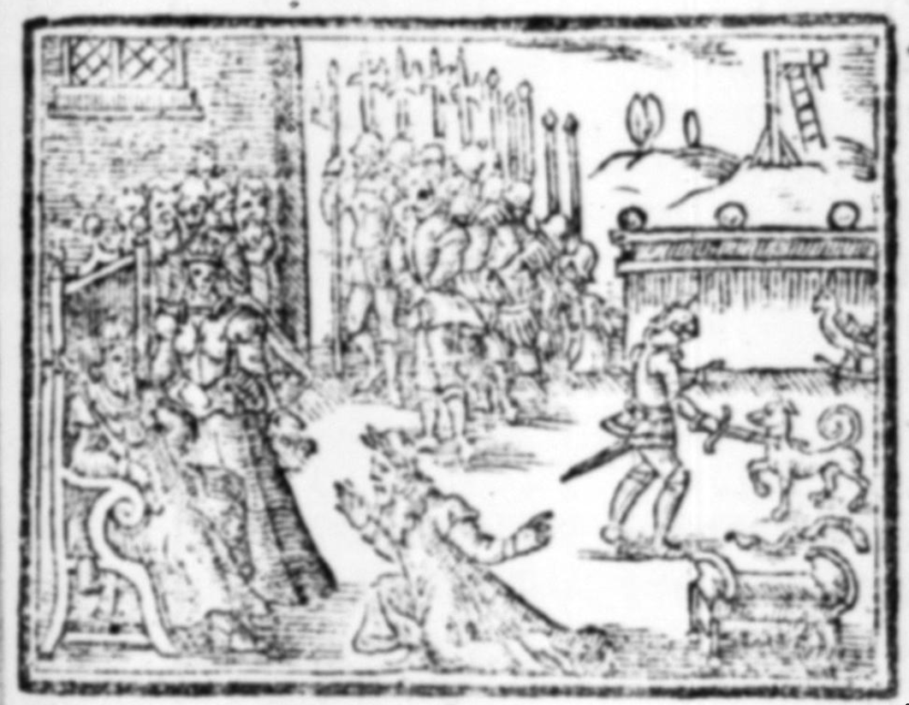

# Llewelyn and Gelert

https://archive.org/details/interestinganecd00brow/page/146/mode/1up?q=llewellyn+gelert
Interesting anecdotes of the animal kingdom classified as to species
by Brown, Thomas, 1785-1862; Goldsmith, Oliver, 1730?-1774. History of the earth, and animated nature

Publication date 1800
p146

...

The memory of the dog Gelert has been preserved by tradition, and celebrated by poetry. In the neighbourhood of a village at the foot of Snowden, a mountain in Wales, Llewellyn, son-in-law to King John, had a residence. The king, it is said, had presented him with one of the finest greyhounds in England, named Gelert. In the year 1205. Llewellyn one day on going out to hunt called all his dogs together, but his favourite greyhound was missing, and nowhere to be found. He blew his horn as a signal for the chase, and still Gelert came not. Llewellyn was much disconcerted at the heedlessness of his favourite, but at length pursued the chase without him. For want of Gelert the sport was limited; and getting tired he returned home at an early hour, when the first object that presented itself to him at the castle gate was Gelert, who bounded with the usual transport to meet his master, having his lips besmeared with blood. Llewellyn gazed with surprise at the unusual appearance of his dog. On going into the apartment where he had left his infant son and heir asleep, he found the bed-clothes all in confusion, the cover rent, and stained with blood. He called on his child, but no answer was made, from which he hastily concluded that the dog must have devoured him; and, giving vent to his rage, plunged his sword to the hilt in Gelert's side. The noble animal fell at his feet, uttering a dying yell which awoke the infant, who was sleeping beneath a mingled heap of the bedclothes, while beneath the bed lay a great wolf covered with gore, whom the faithful and gallant hound had destroyed. Llewellyn, smitten with sorrow and remorse for the rash and frantic deed which had deprived him of so faithful an animal, caused an elegant marble monument, with an appropriate inscription, to be erected over the spot where Gelert was buried, to commemorate his fidelity and unhappy fate. The place to this day is Beth-Gelert, or the Grave of the Greyhound.

...

---
https://archive.org/details/beautiesengland06braygoog/page/n420/mode/2up?q=llewellyn+gelert

The Beauties of England and Wales, or, Delineations, topographical, historical, and descriptive, of each county
by Britton, John, 1771-1857; Brayley, E. W. (Edward Wedlake), 1773-1854; Nightingale, Joseph, 1775-1824; Brewer, J. N. (James Norris); Evans, J. (John), fl. 1812; Hodgson, John, 1779-1845; Laird, Francis Charles; Shoberl, Frederic, 1775-1853; Bigland, John, 1750-1832; Rees, Thomas, 1777-1864; Hood, Thomas, d. 1811; Harris, John, 1756-1846

Publication date 1801

pp.404-6

Near the conflux of the Colwyn and the Glasllyn, stands the small village of Beddgelert. Here was once a priory, dedicated to St. Mary, for monks of the Augustine order; `[Mr. Pennant says, "There is reason to suppose they might have been of that class, called Gilbertines; and consisted of both men and women, who lived under the same roof, but strictly separated from each other, by a wall; as I discovered a piece of ground, near the church, called Doly Lleian, or the meadow of the nun." Tour in Wales, Vol. II. p. 355).]` the foundation of which Tanner ascribes to the last Llewelyn: but except Bardsey, this was probably the most ancient monastic institution in North Wales. For it appears from grants of lands, made by divers benefactors, that it subsisted long prior to that period: and Rymer recites, in his Foedera, `[Tom. 11.316.]` a charter in which certain lands were bestowed on it by Llewelyn ap Jorwerth, who commenced his reign in the year 1194. A traditionary account, recorded by the bards, states that he was the founder, and that on a most extraordinary occasion. The prince had a hunting seat at this place, and during the absence of the family, a wolf entered the house, and Llewelyn returning first, was met at the door by his favourite greyhound Gelert, `[This dog had been a present to Llewelyn from his father-in-law, King John.]` whose mouth was covered with blood. The prince alarmed at the circumstance, hastened to the nursery, where he found the cradle overturned, and the ground wet with gore. In his momentary alarm for the fate of his infant son, supposing it had been killed by the dog, he drew his sword, and stabbed the animal while caressing his master. But what was the consternation of the latter, when on turning up the cradle, he found his son alive, and sleeping by the side of the wolf; which had been slain by the faithful and vigilant Gelert. The circumstance appears to have had such an effect on the prince's mind, that he erected a tomb over the dog's grave, on the spot, where subsequently the conventual church was built, which was, from this incident, denominated Bedd Gelert, or the grave of Gelert, founded a monastery for the good of his soul, and as a grateful offering to divine Providence for the preservation of his child.


---

https://archive.org/details/curiousmythsmid02barigoog/page/n154/mode/2up
Curious myths of the Middle ages
by Sabine Baring-Gould

Publication date 1867

pp134-44

(First edition of 1866 https://archive.org/details/curiousmythsmid04barigoog/page/n138/mode/2up pp. 126-36 has incomplete scan, but the text of the tale is the same.)

The Dog Gellert

Having demolished William Tell, I proceed to the destruction of another article of popular belief.

Who that has visited Snowdon has not seen the grave of Llewellyn's faithful hound Gellert, and been told by the guide the touching story of the death of the noble animal? How can we doubt the facts, seeing that the place, Beth-Gellert, is named after the dog, and that the grave is still visible? But unfortunately for the truth of the legend, its pedigree can be traced with the utmost precision.

The story is as follows: —

The Welsh Prince Llewellyn had a noble deerhound, Gellert, whom he trusted to watch the cradle of his baby son whilst he himself was absent.

One day, on his return, to his intense horror, he beheld the cradle empty and upset, the clothes dabbled with blood, and Gellert's mouth dripping with gore. Concluding hastily that the hound had proved unfaithful, had fallen on the child and devoured it, — in a paroxysm of the prince drew his sword and slew the dog. Next instant the cry of the babe from behind the cradle showed him that the child was uninjured, and, on looking further, Llewellyn discovered the body of a huge wolf, which had entered the house to seize and devour the child, but which had been kept off and killed by the brave dog Gellert.

In his self-reproach and grief, the prince erected a stately monument to Gellert, and called the place where he was buried after the poor hound's name.

Now, I find in Russia precisely the same story told, with just the same appearance of truth, of a Czar Firas. In Germany it appears with considerable variations. A man determines on slaying his old dog Sultan, and consults with his wife how this is to be effected. Sultan overhears the conversation, and complains bitterly to the wolf, who suggests an ingenious plan by which the master may be induced to spare his dog. Next day, when the man is going to his work, the wolf undertakes to carry off the child from its cradle. Sultan is to attack him and rescue the infant. The plan succeeds admirably, and the dog spends his remaining years in comfort. (Grimm, K. M. 48.).

But there is a story in closer conformity to that of Gellert among the French collections of fabliaux made by Le Grand d'Aussy and Edelestand du Meril. It became popular through the "Gesta Romanorum," a collection of tales made by the monks for harmless reading, in the fourteenth century.

In the "Gesta" the tale is told as follows: —

"Folliculus, a knight, was fond of hunting and tournaments. He had an only son, for whom three nurses were provided. Next to this child, he loved his falcon and his greyhound. It happened one day that he was called to a tournament, whither, his wife and domestics went also, leaving the child in the cradle, the greyhound lying by him, and the falcon on his perch. A serpent that inhabited a hole near the castle, taking advantage of the profound silence that reigned, crept from his habitation, and advanced towards the cradle to devour the child. The falcon perceiving the danger, fluttered with his wings till he awoke the dog, who instantly attacked the invader, and after a fierce conflict, in which he was sorely wounded, killed him. He then lay down on the ground to lick and heal his wounds. When the nurses returned, they found the cradle overturned, the child thrown out, and the ground covered with blood, as was also the dog, who they immediately concluded had killed the child.

"Terrified at the idea of meeting the anger of the parents, they determined to escape; but in their flight fell in with their mistress, to whom they were compelled to relate the supposed murder of the child by the greyhound. The knight soon arrived to hear the sad story, and, maddened with fury, rushed forward to the spot. The poor wounded and faithful animal made an effort to rise and welcome his master with his accustomed fondness, but the enraged knight received him on the point of his sword, and he fell lifeless to the ground. On examination of the cradle, the infant was found alive, and unhurt, with the dead serpent lying by him. The knight now perceived what had happened, lamented bitterly over his faithful dog, and blamed himself for having too hastily depended on the words of his wife. Abandoning the profession of arms, he broke his lance in pieces, and vowed a pilgrimage to the Holy Land, where he spent the rest of his days in peace."

The monkish hit at the wife is amusing, and might have been supposed to have originated with those determined misogynists, as the gallant Welshmen lay all the blame on the man. But the good compilers of the "Gesta" wrote little of their own, except moral applications of the tales they relate, and the story of Folliculus and his dog, like many others in their collection, is drawn from a foreign source.

It occurs in the Seven Wise Masters, and in the "Calumnia Novercalis" as well, so that it must have been popular throughout Mediaeval Europe. Now the tales of the Seven Wise Masters are translations from a Hebrew work, the Kalilah and Dimnah of Rabbi Joel, composed about A.D. 1250, or from Symeon Seth's Greek Kylile and Dimne, written in 1080. These Greek and Hebrew works were derived from kindred sources. That of Rabbi Joel was a translation from an Arabic version made by Nasr-Allah in the twelfth century, whilst Simeon Seth's was a translation of the Persian Kalilah and Dimnah. But the Persian Kalilah and Dimnah was not either an original work, it was in turn a translation from the Sanskrit Pantschatantra, made about A.D. 540.

In this ancient Indian book the story runs as follows: —

A Brahmin named Devasaman had a wife, who gave birth to a son, and also to an ichneumon. She loved both her children dearly, giving them alike the breast, and anointing them alike with salves. But she feared the ichneumon might not love his brother.

One day, having laid her boy in bed, she took up the water jar, and said to her husband, "Hear me, master! I am going to the tank to fetch water. Whilst I am absent watch the boy, lest he gets injured by the ichneumon." After she had left the house, the Brahmin went forth begging, leaving the house empty. In crept a black snake, and attempted to bite the child; but the ichneumon rushed at it, and tore it in pieces. Then proud of its achievement, it sallied forth, all bloody, to meet its mother. She, seeing the creature stained with blood, concluded, with feminine precipitance, that it had fallen on the baby and killed it, and she flung her water jar at it and slew it. Only on her return home did she ascertain her mistake.

The same story is also told in the Hitopadesa (iv. 13), but the animal is an otter, not an ichneumon. In the Arabic version a weasel takes the place of the ichneumon.

The Buddist missionaries carried the story int Mongolia, and in the Mongolian Uligerun, which is a translation of the Tibetian Dsanghen, the story reappears with the pole-cat as the brave and suffering defender of the child.

Stanislaus Julien, the great Chinese scholar, has discovered the same tale in the Chinese work entitled, "The Forest of Pearls from the Garden of the Law." This work dates from 668; and in it the creature is an ichneumon.

In the Persian Sindibad-n&meh, is the same tale, but the faithful animal is a cat. In Sandabar and Syntipas it has become a dog. Through the influence of Sandabar on the Hebrew translation of the Kalilah and Dimnah, the ichneumon is also replaced by a dog.

Such is the history of the Gellert legend; it is an introduction into Europe from India, every step of its transmission being clearly demonstrable. From the Gesta Romanorum it passed into a popular tale throughout Europe, and in different countries it was like the Tell myth localized and individualized. Many a Welsh story, such as those contained in the Mabinogion, are as easily traced to an Eastern origin.

But every story has its root. The root of the Gellert tale is this: A man forms an alliance of friendship with a beast or bird. The dumb animal renders him a signal service. He misunderstands the act, and kills his preserver.

We have tracked this myth under the Gellert form from India to Wales; but under another form it is the property of the whole Aryan family, and forms a portion of the traditional lore of all nations sprung from that stock.

Thence arose the classic fable of the peasant, who, as he slept, was bitten by a fly. He awoke, and in a rage killed the insect. When too late he observed that the little creature had aroused him, that he might avoid a snake which lay coiled up near his pillow.

In the Anvar-i-Suhaili is the following kindred tale. A king had a falcon. One day, whilst hunting, he filled a goblet with water dropping from a rock. As he put the vessel to his lips, his falcon dashed upon it, and upset it with its wings. The king, in a fury, slew the bird, and then discovered that the water dripped from the jaws of a serpent of the most poisonous description.

This story, with some variations, occurs in Aesop, iElian, and Apthonius. In the Greek fable, a peasant liberates an eagle from the clutches of a dragon. The dragon spirts poison into the water which the peasant is about to drink, without observing what the monster had done. The grateful eagle upsets the goblet with his wings.

The story appears in Egypt under a whimsical form. A Wali once smashed a pot full of herbs which a cook had prepared. The exasperated cook thrashed the well-intentioned but unfortunate Wali within an inch of his life, and when he returned, exhausted with his efforts at belabouring the man, to examine the broken pot, he discovered amongst the herbs a poisonous snake.

How many brothers, sisters, uncles, aunts, and cousins of all degrees a little story has! And how few of the tales we listen to can lay any claim to originality? There is scarcely a story which I hear which I cannot connect with some family of myths, and whose pedigree I cannot ascertain with more or less precision. Shakespeare drew the plots of his plays from Boccacio or Straparola; but these Italians did not invent the tales they lent to the English dramatist. King Lear does not originate with Geofry of Monmouth, but comes from early Indian stores of fable, whence also are derived the Merchant of Venice and the pound of flesh, aye! and the very incident of the three caskets.

But who would credit it, were it not proved by conclusive facts, that Johnny Sands is the inheritance of the whole Aryan family of nations, and that Peeping Tom of Coventry peeped in India and on the Tartar steppes ages before Lady Godiva was born ?

If you listen to Traviata at the opera, you have set before you a tale which has lasted for centuries, and which was perhap? born in India.

If you read in classic fable of Orpheus charming woods and meadows, beasts and birds, with his magic lyre, you remember to have seen the same fable related in the Kalewala of the Finnish Wainomainen, and in the Kaleopoeg of the Esthonian Kalewa.

If you take up English history and read of William the Conqueror slipping as he landed on British soil, and kissing the earth, saying he had come to greet and claim his own, you remember that the same story is told of Napoleon in Egypt, of King Olaf Harald's son in Norway, and in classic history of Junius Brutus on his return from the oracle. A little while ago I cut out of a Sussex newspaper, a story purporting to be the relation of a fact which had taken place at a fixed date in Lewes. This was the story. A tyrannical husband locked the door against his wife, who was out having tea with a neighbour, gossiping and scandal-mongering; when she applied for admittance, he pretended not to know her. She threatened to jump into the well unless he opened the door.

The man, not supposing that she would carry her threat into execution, declined, alleging that he was in bed, and the night was chilly; besides which he entirely disclaimed all acquaintance with the lady who claimed admittance.

The wife then flung a log into a well, and secreted herself behind the door. The man hearing the splash, fancied that his good lady was really in the deeps, and forth he darted in his nocturnal costume, which was of the lightest, to ascertain whether his deliverance was complete. At once the lady darted into the house, locked the door, and on the husband pleading for admittance, she declared most solemnly from the window that she did not know him.

Now this story, I can positively assert, unless the events of this world move in a circle, did not happen in Lewes, or any other Sussex town. 

It was told in the Gesta Romanorum six hundred years ago, and it was told, may be, as many hundred years before in India, for it is still to be found in Sanskrit collections of tales.


---


https://archive.org/details/populartalesand00unkngoog/page/166/mode/2up
Popular tales and fictions, their migrations and transformations
by Clouston, W. A. (William Alexander), 1843-1896

Publication date 1887

p166-186

LLEWELLYN AND HIS DOG GELLERT, OR KILLHART.

In his 'Curious Myths of the Middle Ages', Mr Baring-Gould has conclusively shown that the tradition of Llewellyn and his faithful hound — so glibly related to credulous tourists in North Wales by the officious guides, who show, moreover, the very grave of the dog Gellert, or Killhart — has no more foundation in fact than the story of William Tell's shooting at an apple on his son's head. I purpose, in the present paper, going somewhat more fully into the literary history of this widely-diffused tale, tracing it, if not to its original, at least to an older form than is referred to in Mr Baring-Qould's useful and interesting work.

The Dog Gellert.

"There is a general tradition in North Wales," says Edward Jones, in his 'Musical Relics of the Welsh Bards,' vol. i. [p75](https://archive.org/details/bim_eighteenth-century_musical-and-poetical-rel_jones-edward_1794/page/n79/mode/2up), "that a wolf had entered the house of Prince Llewellyn. Soon after, the prince returned home, and going into the nursery, he met his dog Killhart all bloody and wagging his tail at him. Prince Llewellyn, on entering the room, found the cradle where his child lay overturned and the floor strewed with blood. Imagining that the greyhound had killed the child, he immediately drew his sword and stabbed it; then turning up the cradle, found under it the child alive, and the wolf dead. This so grieved the prince that he erected a tomb over the faithful dog's grave, where afterwards the parish church was built, and goes by the name Bedd Gelbart (the Grave of Killhart), in Caernarvonshire. From this incident is derived a very common Welsh proverb, 'I repent as much as the man who slew his greyhound.' Prince Llewellyn ab Jowerth," adds our author, "married Joan, a daughter of King John, by Agatha, daughter of Bobert Ferrers, Earl of Derby, and this dog was a present to the prince from his father-in-law, about the year 1205." ^

```{note}
The legend of Gellert has been finely versified by Mr Spencer when UeweUyn had slain the faithful dog and immediately after discovered his child unhurt —

Ah, what was then Llewellyn's pain?  
For now the truth was clear:  
The gallant hound the wolf had slain.  
To save Llewellyn's heir.

Vain, vain was all Llewellyn's woe:  
"Best of thy kind, adieu!  
The frantic deed which laid thee low  
This heart shall ever me."

And now a gallant tomb they raise,  
With costly sculpture decked;  
And marbles storied with his prsise  
Poor Gellert's hones protect

Here never conld the spearman pass,  
Or forester, unmoved;  
Here oft the tear-besprinkled grass  
Llewellyn's sorrow proved.

And here he flung his horn and spear,  
And oft as evening fell,  
In fancy's piercing sounds would hear  
Poor Gellert's dying yell.

```

Such is the Welsh tradition; but the story was current in Europe, with a snake instead of a wolf, before Prince Llewellyn was presented with his faithful hound. It is the first tale in the oldest Latin prose version of 'The Seven Wise Masters,' entitled 'Dolopathos; sive, de Rege et Septem Sapientibus,' written by Johannes, a monk of the Abbey of Alta Silva (Dan Jehans of Haute Seille), in France, about the year 1184. Nearly a century previous to that date — circa 1090 — it had existed in 'Syntipas,' a Greek version of the Book of Sindibid, the Eastern prototype of 'The Seven Wise Masters'; and it is probable that it was current orally at a much earlier period. From the Latin 'Dolopathos,' or from oral tradition, the story was taken into subsequent versions of the Wise Masters, and also into the 'Gesta Romanorum.'

```{note}
The story also occurs in the 'Liber de Donis' of Etienne de Bourbon (No. 370). "After giving a version of this story, which has become in several places a local legend, Etienne proceeds to say that the dog was considered as a martyr, and its grave was visited by the sick, just like the shrines of wonder-working saints. Sick children especiaUy were brought to the place, and made to pass nine times through an aperture formed in the trunks of two trees growing over the hound's grave, while various pagan rites were performed, and the child was finally left naked at the foot of the tree until two candles an inch long were consumed. Etienne, by virtue of his office as inquisitor [of heresy in the south of France], had the dog exhumed, its bones burnt,, and the grove cut down." — Professor T. F. Crane: 'Mediaeval Sermon-Books and Stories.'
```

It reappears in the 'Historia Septem Sapientum Romae' from which was derived our English version of the 'History of the Seven Wise Masters of Rome,' first printed by Wynkyn de Worde, about 1505, and reprinted by W. Copland, about 1550. And here I may remark that Sir G. Dasent, following Des Longchamps and others, is in error when he states, in the introduction to his 'Popular Tales from the Norse,' pp. Ixi, Ixii, that the 'Historia Septem Sapientum Romae' was derived from the work of Dan Jehans, that is, the Latin 'Dolopathos.' These two works are very different: In 'Dolopathos' there are eight subordinate stories, seven of which are related by the Wise Masters, and the eighth by the prince's tutor; in the 'Historia' there are fifteen stories, seven by the Wise Men, seven by the queen, and one by the prince, and only three of these — the Snake, the King's Treasury, and the Husband Shut Out — are found in 'Dolopathos.' Moreover, the 'Historia' was not composed till after the invention of printing (say, in the latter years of the fifteenth century), while the French 'Roman des Sept Sages,' written about 1284, has all the tales save one which are found in the 'Historia,' and that one does not occur in 'Dolopathos.'

The story of the Dog and the Snake is thus related in a black-letter copy of the 'Seven Wise Masters,' [1655](https://archive.org/details/bim_early-english-books-1641-1700_the-history-of-the-seven_1655/page/n25/mode/2up) preserved in the Glasgow University Library:



*The Knight and the Greyhound.*

There was a certain valiant knight which had one only son, the which he loved so much, that he ordained for his keepers three nourishers (i.e., nurses). The first should give him suck, and feed him; the second should wash him, and keep him clean; and the third should bring him to his sleep and rest. The knight had also a greyhound and a falcon, which he also loved right well. The greyhound was so good that he never run at any game, but he took it and held it till his master came. And if his master disposed him to go into any battel, if he should not speed therein, anone as he should mount upon his horse, the greyhound would take the horse-tail in his mouth, and draw backward, and would also howl and cry marvellouslie loud. By these signs, and the due observation thereof, the knight did always understand that his journey should have very ill success. The falcon was so gentle and hardy, that he was never cast off to his prey but he took it. The same knight had much pleasure in justing and tourney, so that upon a time under his castle he proclaimed a tournament, to the which came many great lords and knights. The knight entered into the tourney, and his ladie went with her maidens to see it: and as they went out, after went the nourishers, and left the child lying alone there in the cradle in the hall, where the greyhound lay near the wall, and the hawk or falcon standing upon a perch. In this hall there was a serpent lurking, or hid in a hole to all of them in the castle unknown, the which when he perceived that they were all absent; he put his head out of the hole, and when he saw none hut the child lying in the cradle, he went out of his hole towards the cradle, for to have slain the child. The noble falcon perceiving that, made sach a noise and rustling with her wings presently, that the greyhound awoke and rose up: and when he saw the serpent nigh the child, anone against him he leapt, and they both fought so long together, until that the serpent had grievously hurt and wounded the greyhound, that he bled so sore, that the earth about the cradle was all bloody. The greyhound, when that he felt himself grievously hurt and wounded, starts fiercely upon the serpent, and fought so sore together, and so eagerly, that between them the cradle was overcast with the child, the bottome upward, And because that the cradle had four pomels like feet falling towards the earth, they saved the child's life and his visage from any hurt. What can be more exprest to make good the wonder in the preservation of the child? Incontinently thereafter, with great pain the greyhound overcame and slew the serpent, and laid him down again in his place and licked his wounds. And anon after the justs and tumey was done, the nowrishers came first into the castle, and as they saw the cradle turned upside down upon the earth, compassed round about with blood, and that the greyhound was also bloody, they thought and said among themselves that the greyhound had slain the child, and were not so wise as to turn up the cradle again with the child, for to have seen what was thereof befallen; but they said, Let us run away, lest that our master should put or lay any blame upon us, and so slay us. As they were thus running away, they met the knight's wife, and she said unto them, Wherefore make ye this sorrow, and whither will ye run? Then said they, O lady, wo and sorrow be to us, and to you. Why, said she, what is there happened? show me. The greyhound, they said, that our lord and master loved so well, hath devoured and slain your son, and lyeth by the wall all full of blood. As the lady heard this she presently fell to the earth, and began to weep and cry piteously, and said, Alace, O my dear son, are ye slain and dead? What shall I now do, that I have mine only son thus lost? Wherewithal came in the knight from the tourney, and beholding his lady thus crying and making sorrow, he demanded of her wherefore she made so great sorrow and lamentation. She answered him, O my lord, that greyhound that you have loved so much hath slain your only son, and lyeth by the wall, satiated with the blood of the child. The knight, very exceeding angry, went into the hall, and the greyhound went to meet him, and did fawn upon him, as he was wont to do, and the knight drew out his sword, and with one stroke smote off the greyhound's head, and then went to the cradle where the child lay and found his son all whole, and by the cradle the serpent slain; and then by diverse signs he perceived that the greyhound had killed the serpent for the defence of the child. Then with great sorrow and weeping he tare his hair, and said, Wo be to me, that for the words of my wife I have slain my good and best greyhound, the which hath saved my child's life, and hath slain the serpent, therefore I will put myself to penance. And so he brake his sword in three pieces, and went towards the Holy Land, and abode all the days of his life.

How many generations, "gentle and simple," old and young, have pored over, or listened to, this story of the Knight and his Greyhound! In the pedlar's pack, among his stock of ballads and chap-books, the 'History of the Seven Wise Masters of Rome' was never wanting; and the reading of it aloud by the "farmer's ingle" has cheered many a winter's night. Gorres, in his 'Folksbucher,' bestows extraordinary praise on this Book of the Seven Sages. "It sprang originally," says he, "from the Indian mountains, whence from primeval days it took its course as a little rivulet, and flowed in a westerly direction through Asia's wide field, and, while it proceeded for thousands of years through space and time, always spreading more and more in reaching us. Out of it whole generations and many nations have drank; and, having passed to Europe with the great tide of population, is now also in our day and generation supplied to such a considerable portion of the public, that in regard to its celebrity and the magnitude of its sphere of influence, it reaches the Holy Book, and surpasses all classical ...


---

For a related tale with a slightly different twist, see Grimm's *Old Sultan*.
