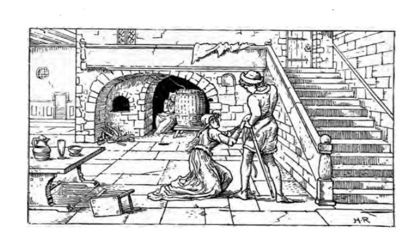
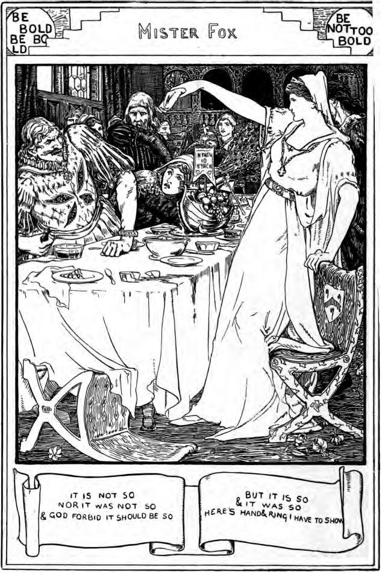

# Mr Fox

A fantastically grim English folk tale, the sort of thing that might well go down as a Halloween tale, or a ghost story... A lesser told tale than Perrault's *Bluebeard* and/or Grimm's *The Robber Bridegroom*, the gist of it is much the same.

We can find an early version of the tale in a commentary to Shakespeare's *Much Ado About Nothing* on the phrase *"it is not so, nor 'twas not so: but indeed God forbid it should be so"*, offered a source for that quote and remembered as a tale told by an elderly relation of the commentator (Blakeway).

```{admonition} An old tale, 1821
:class: dropdown
https://archive.org/details/playsandpoemswi22rowegoog/page/164/mode/2up

The plays and poems of William Shakspeare
by Shakespeare, William, 1564-1616; Boswell, James, 1778-1822, ed; Malone, Edmond, 1741-1812; Pope, Alexander, 1688-1744; Johnson, Samuel, 1709-1784; Capell, Edward, 1713-1781; Stevens, George, 1736-1800; Farmer, Richard, 1735-1797; Rowe, Nicholas, 1674-1718; George Fabyan Collection (Library of Congress) DLC

Publication date 1821

p164-5

[In section on "Much Ado About Nothing"]

*Benedict.* Like the old tale, it is not so, nor 'twas not so: but indeed God forbid it should be so.] I believe none of the commentators have understood this; it is an allusion, as the speaker says, to an *old tale* which may perhaps be still extant in some collections of such things, or which Shakspeare may have heard, as I have, related by a great aunt, in his childhood.

Once upon a time, there was a young lady, (called Lady Mary in the story) who had two brothers. One summer they all three went to a country seat of theirs, which they had not before visited. Among the other gentry in the neighbourhood who came to see them, was a Mr. Fox, a batchelor, with whom they, particularly the young lady, were much pleased. He used often to dine with them, and frequently invited Lady Mary to come and see his house. One day that her brothers were absent elsewhere, and she had nothing better to do, she determined to go thither; and accordingly set out unattended. When she arrived at the house, and knocked at the door, no one answered. At length she opened it, and went in; over the portal of the hall was written *"Be bold, be bold, but not too bold:"* she advanced: over the stair-case, the same inscription: she went up: over the entrance of a gallery, the same: she proceeded: over the door of a chamber, *"Be bold, be bold, but not too bold, lest that your heart's blood should run cold."* She opened it; it was full of skeletons, tubs full of blood, &c. She retreated in haste; coming down stairs, she saw out of a window Mr. Fox advancing towards the house, with a drawn sword in one hand, while with the other he dragged along a young lady by her hair. Lady Mary had just time to slip down, and hide herself under the stairs, before Mr. Fox and his victim arrived at the foot of them. As he pulled the young lady up stairs, she caught hold of one of the *bannisters* with her hand, on which was a rich bracelet. Mr. Fox cut it off with his sword: the hand and bracelet fell into Lady Mary's lap, who then contrived to escape unobserved, and got home safe to her brother's house.

After a few days, Mr. Fox came to dine with them as usual (whether by invitation, or of his own accord, this deponent saith not). After dinner, when the guests began to amuse each other with extraordinary anecdotes. Lady Mary at length said, she would relate to them a remarkable dream she had lately had. I dreamt, said she, that as you, Mr. Fox, had often invited me to your house, I would go there one morning. When I came to the house, I knocked, &c. but no one answered. When I opened the door, over the hall was written, *"Be bold, be bold, but not too bold"*. But, said she, turning to Mr. Fox, and smiling, *It is not so, nor it was not so*; then she pursues the rest of the story, concluding at every turn with *"It is not so, nor it was not so,"* till she comes to the room full of dead bodies, when Mr. Fox took up the burden of the tale, and said, *"It is not so, nor it was not so, and God forbid it should be so:"* which he continues to repeat at every subsequent turn of the dreadful story, till she came to the circumstance of his cutting off the young lady's hand, when, upon his saying as usual. *It is not so, nor it was not so, and God forbid it should be so.* Lady Mary retorts. *But it is so, and it was so, and here the hand I have to show*, at the same time producing the hand and bracelet from her lap: whereupon the guests drew their swords, and instantly cut Mr. Fox into a thousand pieces.

Such is the *old tale* to which Shakspeare evidently alludes, and which has often *"froze my young blood,"* when I was a child, as, I dare say, it had done his before me. I will not apologize for repeating it, since it is manifest that such *old wive's tales* often prove the best elucidation of this writer's meaning. Blakeway.
```

The tale was brought to wider attention by Halliwell-Phillips in his *Popular rhymes and nursery tales* of 1849. The layout in Halliwell's version makes me think the refrain might provide a useful invitation to participation...

```{admonition} A simple, but very curious tale, 1849
:class: dropdown
https://archive.org/details/popularrhymesnur0000unse/page/46/mode/2up
Popular rhymes and nursery tales: a sequel to the Nursery rhymes of England
by Halliwell-Phillipps, J. O. (James Orchard), 1820-1889

Publication date 1849
pp47-8

THE STORY OF MR. FOX. `[A simple, but very curious tale, of considerable antiquity. It is alluded to by Shakespeare, and was contributed to the variorum edition by Blakeway. Part of this story will recall to the reader's memory the enchanted chamber of Britomart.]`

Once upon a time there was a young lady called Lady Mary, who had two brothers. One summer they all three went to a country seat of theirs which they had not before visited. Among the other gentry in the neighbourhood who came to see them was a Mr. Fox, a bachelor, with whom they, particularly the young lady, were much pleased. He used often to dine with them, and frequently invited Lady Mary to come and see his house. One day, when her brothers were absent elsewhere, and she had nothing better to do, she determined to go thither, and accordingly set out unattended. When she arrived at the house and knocked at the door, no one answered. At length she opened it and went in, and over the portal of the door was written:

Be bold, be bold, but not too bold.

She advanced, and found the same inscription over the staircase; again at the entrance of a gallery; and lastly, at the door of a chamber, with the addition of a line:

Be bold, be bold, but not too bold,  
Lest that your heart's blood should run cold!

She opened it, and what was her terror and astonishment to find the floor covered with bones and blood. She retreated in haste, and coming down stairs, she saw from a window Mr. Fox advancing towards the house with a drawn sword in one hand, while with the other he dragged along a young lady by the hair of her head. Lady Mary had just time to slip down, and hide herself under the stairs, before Mr. Fox and his victim arrived at the foot of them. As he pulled the young lady upstairs, she caught hold of one of the bannisters with her hand, on which was a rich bracelet. Mr. Fox cut it off with his sword: the hand and bracelet fell into Lady Mary's lap, who then contrived to escape unobserved, and got safe home to her brothers' house.

A few days afterwards, Mr. Fox came to dine with them as usual. After dinner, the guests began to amuse each other with extraordinary anecdotes, and Lady Mary said she would relate to them a remarkable dream she had lately had. I dreamt, said she, that as you, Mr. Fox, had often invited me to your house, I would go there one morning. When I came to the house, I knocked at the door, but no one answered. When I opened the door, over the hall I saw written, "Be bold, be bold, but not too bold." But, said she, turning to Mr. Fox, and smiling, "It is not so, nor it was not so." Then she pursued the rest of the story, concluding at every turn with, "It is not so, nor it was not so," till she came to the discovery of the room full of bones, when Mr. Fox took up the burden of the tale, and said:

It is not so, nor it was not so,  
And God forbid it should be so!

which he continued to repeat at every subsequent turn of the dreadful story, till she came to the circumstance of his cutting off the young lady's hand, when, upon his saying, as usual,

It is not so, nor it was not so,  
And God forbid it should be so!

Lady Mary retorts by saying,

But it is so, and it was so,  
And here the hand I have to show!

at the same moment producing the hand and bracelet from her lap. Whereupon the guests drew their swords, and instantly cut Mr. Fox into a thousand pieces.
```

The tale was reproduced and further popularised Joseph Jacobs in his collection [*English Fairy Tales*](https://archive.org/details/englishfairytal00jacogoog/page/n176/mode/2up), 1890, pp.148-151, along with two illustrations by John D. Batten.

The first illustration, at the start of the chapter, sees Lady Mary witness Mr Fox's arrival with a new victim, from her hiding place underneath the stairs.



The second illustration depicts Lady Mary's revelation of Mr Fox's nefarious deeds.



Jacobs also gives some additional notes on the tale (p247):

> XXVI. MR. FOX.
> 
> *Source.* — Contributed by Blakeway to Malone's Variorum Shakespeare, to illustrate Benedick's remark in *Much Ado about Nothing* (I. i. 146): "Like the old tale, my Lord, 'It is not so, nor 'twas not so, but, indeed, God forbid it should be so;'" which clearly refers to the tale of Mr. Fox. "The Forbidden Chamber" has been studied by Mr. Hartland, *Folk-Lore Journal*, iii. 193, seq.
>
> *Parallels.* — Halliwell, p. 166, gives a similar tale of "An Oxford Student," whose sweetheart saw him digging her grave. "Mr. Fox" is clearly a variant of the theme of "The Robber Bridegroom" (Grimm, No. 40, Mrs. Hunt's translation, i. 389, 395; and Cosquin, i. 180-1).

As Jacobs noted, in Halliwell-Phillips' collection, the tale is complemented by another related one, of a student who sought seduced a maiden, and then attempted to hide the fact...

```{admonition} *The Oxford Student*, 1849
:class: dropdown
https://archive.org/details/popularrhymesnur0000unse/page/48/mode/2up
Popular rhymes and nursery tales: a sequel to the Nursery rhymes of England
by Halliwell-Phillipps, J. O. (James Orchard), 1820-1889

Publication date 1849

pp49-50

THE OXFORD STUDENT. `[Obtained in Oxfordshire from tradition.]`

Many years ago there lived at the University of Oxford a young student, who, having seduced the daughter of a tradesman, sought to conceal his crime by committing the more heinous one of murder. With this view, he made an appointment to meet her one evening in a secluded field. She was at the rendezvous considerably before the time agreed upon for their meeting, and hid herself in a tree. The student arrived on the spot shortly afterwards, but what was the astonishment of the girl to observe that he commenced digging a grave. Her fears and suspicions were aroused, and she did not leave her place of concealment till the student, despairing of her arrival, returned to his college. The next day, when she was at the door of her father's house, he passed and saluted her as usual. She returned his greeting by repeating the following lines:

One moonshiny night, as I sat high,  
Waiting for one to come by,  
The boughs did bend; my heart did ache  
To see what hole the fox did make.

Astounded by her unexpected knowledge of his base design, in a moment of fury he stabbed her to the heart. This murder occasioned a violent conflict between the tradespeople and the students, the latter taking part with the murderer, and so fierce was the skirmish, that Brewer's Lane, it is said, ran down with blood. The place of appointment was adjoining the Divinity Walk, which was in time past far more secluded than at the present day, and she is said to have been buried in the grave made for her by her paramour.

According to another version of the tale, the name of the student was Fox, and a fellow-student went with him to assist in digging the grave. The verses in this account differ somewhat from the above.

As I went out in a moonlight night,  
I set my back against the moon,  
I looked for one, and saw two come:  
The boughs did bend, the leaves did shake,  
I saw the hole the Fox did make
```

*The Oxford Student* is also referenced by Sidney Oldall Addy in his *Household Tales*, along with a couple of other loosely related tales.

```{admonition} *Jack Otter*, 1895
:class: dropdown
8.— JACK OTTER.

`[From Lincolnshire. Compare the next story. Otter here stands for Höttr, the hatted one, a name of Odin, on account of the slouching hat or hood which he wore, In Hava-mal Odin says, "I mind me hanging on the gallows-tree nine whole nights, wounded with the spear, offered to Odin, myself to myself; on the tree, whose roots no man knoweth. They gave me no loaf; they held no horn to me." Vigfusson and Powell's Corpus Poeticum Boreale, i. p. 24.]`

IN Lincolnshire there once lived a man, called Jack Otter, who had been married nine times, and had murdered all his wives one after another. One day he was angry with the woman that he was courting, and whom he intended to take for his tenth wife. So he asked her to go for a walk with him, and when they had got into a lonely place he stabbed her and buried her on the spot. But his crime was found out, and he was gibbeted on a post in the lane. Now a bird, called the willow-biter, built her nest in the dead man's mouth as he hung on the gallows tree, and brought up her fledgelings in it. And hence this riddle is asked:

There were ten tongues within one head;  
And one went out to fetch some bread  
To feed the living in the dead.

```

```{admonition} *The girl who got up the tree*, 1895
:class: dropdown
https://archive.org/details/householdtaleswi00addyuoft/page/n49/mode/2up
Household tales with other traditional remains, collected in The Counties of York, Lincoln, Derby, and Nottingham
by Addy, Sidney Oldall, 1848-

Publication date 1895

pp10-11

9.— THE GIRL WHO GOT UP THE TREE. `[From North Derbyshire. Compare the preceding tale, and a tale in Halliwell's Popular Rhymes and Nursery Tales, 1849 p. 49 called "The Oxford Student."]`

A GIRL who was leaving her master's service at a farm in the country told her sweetheart that she would meet him near a stile where they had met many times before. This stile was overhung by a tree. The girl got there before him and found a hole dug underneath the tree, and a pickaxe and spade lying by the side of the hole. She was much frightened at what she saw, and got up the tree. After she had been up the tree awhile her sweetheart came, and another man with him. Thinking that the girl had not yet come, the two men began to talk, and the girl heard her sweetheart say, "She will not come to-night. We'll go home now, and come back and kill her to-morrow night." As soon as they had gone the girl came down the tree and ran home to her father. When she had told him what she had seen, the father pondered a.while and then said to his daughter: "We will have a feast and ask our friends, and we will ask thy sweetheart to come and the man that came with him to the tree." So the two men came along with the other guests. In the evening they began to ask riddles of each other, but the girl who had got up the tree was the last to ask hers. She said:

I'll rede you a riddle,  
I'll rede it you right,  
"Where was I last Saturday night?  
The wind did blow, the leaves did shake,  
When I saw the hole the fox did make.

`[The following variation occurs: One moonlight night as I sat high, Waiting for one but two came by, The boughs did bend, my heart did quake, To see the hole the fox did make,]`

When the two men who had intended to murder the girl heard this they ran out of the house.
```

## Related Tales

By way of comparison, consider this original telling of *Bluebeard*, from 1846. I don't find it satisfying at all, and would never consider telling it this way:

```{admonition} The popular story of Blue Beard, or, Female curiosity, 1846
:class: dropdown
https://archive.org/details/McGillLibrary-PN970_R9_P67_1846-2022/page/n1/mode/2up
The popular story of Blue Beard, or, Female curiosity: embellished with beautiful cuts
by Perrault, Charles,1628-1703.Barbe bleue.English

Publication date 1846

pp.1-8

THE HISTORY OF BLUE BEARD

THERE was a man who had fine houses, both in town and country, a deal of silver and gold plate, embroidered furniture, and coaches gilded all over with gold. But this man had the misfortune to have a blue beard, which made him so frightfully ugly, that all the women and girls ran away from him.

One of his neighbours, a lady of quality, had two daughters, who were perfect beauties. He desired of her one of them in marriage, leaving to her the choice which of the two she would bestow on him. They would neither of them have him, and sent him backwards and forwards from one to another, not being able to bear the thoughts of marrying a man who had a blue beard. And what, besides, gave them disgust and aversion was, his having already been married to several wives, and nobody ever knew what became of them.

Blue Beard, to engage their affections, took them, with the lady their mother, and three or four ladies of their acquaintance, with other young people of the neighbourhood, to one of his country seats, where they continued a whole week. There was nothing then to be seen but parties of pleasure, fishing, mirth, and feasting; and all passing the night in rallying and joking with each other. In short, every thing so well succeeded, that the youngest daughter began to think the master of the house not to have a beard so very blue, and that he was a mighty civil gentleman.

So soon as they returned home, the marriage was concluded. About a month afterwards, Blue Beard told his wife that he was obliged to take a country journey for six weeks, at least, about affairs of very great consequence, desiring her to divert herself in his absence, sending for her friends and acquaintance, carry them into the country, if she pleased, and make good cheer wherever she was. "Here," said he, "are the keys of the two great wardrobes, wherein I have my best furniture; these are my silver and gold plate; these open my strong boxes, which hold my money, both gold and silver; these my casket of jewels; and this is the master-key to all my apartments; but as for this little one here, it is the key of the closet at the end of the great gallery on the ground floor. Open them all, go into all and every one, except that little closet, which I forbid you, and forbid it in such a manner, that if you happen to open it, there is nothing but what you may expect from my just anger and resentment." She promised to observe exactly whatever he had ordered; when, after having embraced her, he got into his coach, and proceeded on his journey.

Her neighbours and good friends did not stay to be sent for by the new-married lady, so great was their impatience to see all the rich furniture of her house, not daring to come while her husband was there, because of his blue beard, which frightened them. They ran through all the rooms, closets, and wardrobes, which were all so rich and fine, that they seemed to pass one another. After that, they went into the two great rooms, which were the best and richest furniture; they could not sufficiently admire the number and beauty of the tapestry, beds, couches, cabinets, stands, tables, and looking-glasses, in which you might see yourselves from head to foot: some of them were framed with glass; others with silver, plain and gilded, the finest and most magnificent ever seen. They ceased not to extol and envy their happiness of their friend, who, in the mean-time, no way diverted herself in looking upon all these rich things, because of the impatience she had to go and open the closet on the ground-floor. She was so much pressed by her curiosity, that, without considering that it was very uncivil to leave her company, she went down a little back staircase, with such excessive haste, that she had twice or thrice like to have broken her neck.

Being come to the closet door, she made a stop for some time, thinking upon her husband's orders, and considering what unhappiness might attend her if she was disobedient, but the temptation was so strong, she could not overcome it; she took then the little key, and opened it, trembling, but could not at first see any thing plainly, because the windows were shut. After some moments, she began to perceive that the floor was all covered over with clotted blood, on which lay the bodies of several dead women, ranged against the walls; these were all the wives which Blue Beard had married and murdered, one after another. She thought she would have died for fear, and the key, which she pulled out of the lock, fell out of her hand.

After having somewhat recovered her surprise, she took up the key, locked the door, and went up stairs into her chamber, to recover herself; but could not, so much was she frightened. Having observed that the key of the closet was stained "With blood, she tried two or three times to wipe it off, but the blood would not come out; in vain did she wash it, and even rub it with soap and sand; the blood still remained, for the key was a fairy, and she could never make it quite clean; when the blood was gone off from one side, it came again on the other.

Blue Beard returned from his journey the same evening, and said he had received letters upon the road, informing him that the affair he went about was ended to his advantage. His wife did all she could to convince him that she was extremely glad of his speedy return. Next morning he asked her for the keys, which she gave him, but with such a trembling hand, that he easily guessed what had happened. "What!" said he, "is not the key of my closet among the rest?" "I must certainly," answered she, "have left it above upon the table." "Fail not," said Blue Beard, "to bring it to me presently."

After several going backwards and forwards she was forced to bring him the key. Blue Beard, having attentively considered it, said to his wife, "How comes this blood upon the key?" "I do not know," cried the poor woman, paler than death. "You do not know," replied Blue Beard; "I very well know, you were resolved to go into the closet, were you not? Mighty well, madam! you shall go in, and take your place among the ladies you saw there!"

Upon this she threw herself at her husband's feet, and begged his pardon, declaring she would never more be disobedient. She would have melted a rock, so beautiful and sorrowful was she; but Blue Beard had a heart harder than any rock. "You must die, madam," said he, "and that presently. "Since I must die," answered she, looking upon him with her eyes all bathed in tears, "give me some little time to say my prayers." "I give you," replied Blue Beard, "half a quarter of an hour, but not one moment more."

When she was alone, she called out to her sister, and said to her, "Sister Anne," for that was her name, "go up, I beg you, upon the top of the tower, and look if my brothers are not coming; they promised me that they would come to-day; and if you see them, give them a sign to make haste." Her sister went upon the top of the tower, and the poor afflicted wife cried out from time to time, "Anne, sister Anne, do you see anyone coming?" And sister Anne said, "I see nothing but the sun, which makes a dust, and the grass, which looks green."

In the mean while Blue Beard, holding a great cimeter in his hand, cried out, as loud as he could bawl, to his wife, "Come down instantly, or I shall come up to you." "One moment longer, if you please," said his wife; and then she cried out very softly, "Anne, sister Anne, dost thou see any body coming?" and sister Anne answered, "I see nothing but the sun, which makes a dust, and the grass looking green." "Come down quickly," cried Blue Beard, "or I will come up to you." "I am coming," answered his wife; and then she cried, "Anne, sister Anne, dost thou not see any one coming?" "I see," replied sister Anne, a great dust which comes on this side here." "Are these my brothers?" "Alas! no, my dear sister, I see a flock of sheep." "Will you not come down?" cried Blue Beard. "One moment longer," said his wife; and then she cried out, "Anne, sister Anne, dost thou see any one coming?" "I see," said she, "two horsemen coming, but they are a great way off." "God be praised!" replied the poor wife joyfully, "they are my brothers." "I am making them a sign," said sister Anne, "as well as I can, for them to make haste." Then Blue Beard bawled out so loud, that he made the whole house tremble.

The distressed wife came down, and threw herself at his feet, all in tears, with her hair about her shoulders. "This signifies nothing," says Blue Beard, "you must die then, taking hold of her hair with one hand, and lifting up his cimeter with the other, he was going to take off her head. The poor gentlewoman, turning about to him and looking at him with dying eyes, desired him to afford her one little moment to recollect herself. "No, no," said he, "recommend thyself to God and was just ready to strike. At this very instant, there was such a loud knocking at the gate, that Blue Beard made a sudden stop. The gate was opened, and presently entered two horsemen, who, drawing their swords, ran directly to Blue Beard.

He knew them to he his wife's brothers, one a dragoon, the other a musketeer; so he ran immediately to save himself; but the two brothers pursued so closely, that they overtook him before he could get to the steps of the porch, when they ran their swords through his body, and left him dead.

The poor wife was almost as dead as her husband, and had not strength enough to rise and welcome her brothers. Blue Beard had no heirs, and so his wife became mistress of all his estate. She made use of one part of it to marry her sister Anne to a young gentleman, who had loved her a longwhile; another part, to buy captains' commissions for her brothers; and the rest, to marry herself to a very worthy gentleman, who made her forget the ill time she had passed with Blue Beard.
```

The Grimm's *Robber Bridegroom*, however, does seem to work better as a possible straight tell, for me at least:

```{admonition} The Robber Bridegroom, 1826
:class: dropdown
https://archive.org/details/german-popular-stories-volume-2-1826/page/198/mode/2up
German Popular Stories, translated from the Kinder und Haus Marchen, collected by M. M. Grimm, volume 2, 1826

pp. 199-205

THE ROBBER-BRIDEGROOM.

There was once a miller who had a pretty daughter; and when she was grown up, he thought to himself, "If a seemly man should come to ask her for his wife, I will give her to him that she may be taken care of." Now it so happened that one did come, who seemed to be very rich, and behaved very well; and as the miller saw no reason to find fault with him, he said he should have. his daughter. Yet the maiden did not love him quite so well as a bride ought to love her bridegroom, but, on the other hand, soon began to feel a kind of inward shuddering whenever she saw or thought of him.

One day he said to her, "Why do you not come and see my home, since you are to be my bride?" "I do not know where your house is," said the girl. "Tis out there," said her bridegroom, "yonder, in the dark green wood." Then she began to try and avoid going, and said, "But I cannot find the way thither." "Well, but you must come and see me next Sunday," said the bridegroom; "I have asked some guests to meet you, and that you may find your way through the wood, I will strew ashes for you along the path."

When Sunday came and the maiden was to go out, she felt very much troubled, and took care to put on two pockets, and filled them with peas and beans. She soon came to the wood, and found her path strewed with ashes; so she followed the track, and at every step threw a pea on the right and a bean on the left side of the road; and thus she journeyed on the whole day till she came to a house which stood in the middle of the dark-wood. She saw no one within, and all was quite still, till on a sudden she heard a voice cry,

"Turn again, bonny bride!  
Turn again home!  
Haste from the robber's  
Haste away home!!".

She looked around, and saw a little bird sitting in a cage that hung over the door; and he flapped his wings, and again she heard him dry,

"Turn again, bonny bride!  
Turn again home!  
Haste from the robber's den,  
Haste away home!"

However, the bride went in, and reamed along from one room to another, and so over all the house; but it was quite empty, and not a soul could she see. At last she came to a room where a very very old woman was sitting. "Pray, can you tell me, my good woman," said she, "if my bridegroom lives here?" "Ah! my dear child!" said the old woman, "you are come to fall into the trap laid for you: your wedding can only be with Death, for the robber will surely take away your life; if I do not save you, you are lost!" So she hid the bride behind a large cask, and then said to her, "Do not. stir or move yourself at all, lest some harm should befall you; and when the robbers are asleep we will run off; I have long wished to get away." She had hardly done this when the robbers came in, and brought another young maiden with them. that had been ensnared like the bride. Then they began to feast and drink, and were deaf to her shrieks and groans: and they gave her some wine to drink, three glasses, one of white, one of red, and one of yellow; upon which she fainted and fell down dead. Now the bride began to grow very uneasy behind the cask, and thought that she too must die in her turn. Then the one that was to be her bridegroom saw that there was a gold ring on the little finger of the maiden they had murdered; and as he tried to snatch it off, it flew up in the air and fell down again behind the cask just in the bride's lap. So he took a light and searched about all round the room for it, but could not find any thing; and another of the robbers said, "Have you looked behind. the. large cask yet?" "Pshaw!" said the old woman, "come, sit still and eat your supper now, and leave the ring alone till to-morrow; it won't run away, I'll warrant." So the robbers gave up the search, and went on with their eating and drinking; but the old woman dropped a sleeping-draught into their wine, and they laid themselves down and slept, and snored. roundly. And when the bride heard this, she stepped out from behind the cask; and as she was forced to walk over the sleepers, who were lying about on the floor, she trembled lest she should awaken some of them. But heaven aided her, so that she soon got through her danger; and the old woman went up stairs with her, and they both ran away from this murderous den. The ashes that had been strewed were now all blown away, but the peas and beans had taken root and were springing up, and showed her the way by the light of the moon. So they walked the whole night, and in the morning reached the mill; when the bride told her father all that had happened to her. As soon as the day arrived when the wedding was to take place, the bridegroom came; and the miller gave orders that all his friends and relations should be asked to the feast. And as they were all sitting at table, one of them proposed that each of the guests should tell some tale. Then the bridegroom said to the bride, when it came to her turn, "Well, my dear, do you know nothing? come, tell us some story." "Yes," answered she, "I can tell you a dream that I dreamt. I once thought I was going through a wood, and went on and on till I came to a house where there was not a soul to be seen, but a bird in a cage, that cried out twice,

'Turn again, bonny bride!  
Turn again home!  
Haste from the robber's den,  
Haste away home!"

"I only dreamt that, my love. Then I went through all the rooms, which were quite empty, until I came to a room where there sat a very old woman; and I said to her, 'Does my bridegroom live here?' but she answered, 'Ah! my dear child! you have fallen in the murderer's snare; your bridegroom will surely kill you;'—I only dreamt that, my love. But she hid me behind a large cask; and hardly had she done this, when. the robbers came in, dragging a young woman along with them; then they gave her three kinds of wine to drink, white, red, and yellow, till she fell dead upon the ground;—I only dreamt that, my love. After they had done this, one of the robbers saw that there was a gold ring on her little finger, and snatched at it; but it flew up to the ceiling, and then fell behind the great cask just where I was, and into my lap; and here is the ring!" At these words she brought out the ring and showed it to the guests.

When the robber saw all this, and heard what she said, he grew as pale as ashes with fright, and wanted to run off; but the guests held. him fast and gave him up to justice, so that he and all his gang met with the due reward of their wickedness.

Note, p. 253

The Robber Bridegroom. p: 199. "Der Raiiberbraütigam" of MM. Grimm. This tale has a general affinity to that of *Bluebeard*, most of the incidents of which story are found in others of the German collection. It should, perhaps, be observed, that in the original, the *finger* is chopped off, and is carried away by the bride, as well as the ring upon it.
```

For another take on the *Robber Bridegroom* tale, a gypsy tale collected from Noah Lock by Thomas William Thompson, that appears as the first in a series of *English Gypsy Folk-Tales, and other Traditional Stories* in the *Journal of the Gypsy Lore Society*.

```{admonition} The Robber and the Housekeeper, 1914-5
:class: dropdown
https://archive.org/details/journalgypsylorensv8-1914-15/page/n221/mode/2up
Journal of the Gypsy Lore Society, VOLUME VIII
Publication date (1914—1915)

p202-8

1. The Robber and the Housekeeper

From Noah Lock

THE' was wonst a big high gentleman what lived in a fine mansion, a very grand place it was an' no mistake, standing back in its own grounds, an' the' was a carriage drive leading up to it from the road, an' trees growing all about it. I can't tell you exac'ly who he was, but he was some very high notified gentleman. Now it so come about at the time I'm a-speaking on as this gentleman, an' the lady his wife, an' their son—they only had but one son—an' their two da'ghters, they all went away for a week's holiday. An' they had a little baby, this gentleman an' lady had, but they didn't take it wid 'em; they left it at home wid the housekeeper; an' they left one 'n the sarvant gals as well for comp'ny like for the housekeeper, but the tother sarvant gals they took wid 'em.

They'd be gone away now some two or three days, when the' comes knocking at the doar 'n the house an owld woman—or so she'd 'pear to be—a rale comital owld woman. An' this owld woman got a-gate telling tales an' things, an' sich funny tales she to wid that she kept the housekeeper an' the tother sarvant in fits o' laughing. She got on an' got on, one tale a'ter another, an' all the time they was standing at the back doar, all the three 'n they. Whatsumever, a'ter a bit, the one sarvant says to the tother: 'Shall we ax her to come in an' sit down a bit?' 'Well aye,' says the tother, 'she'll be a bit o' good comp'ny for we.' So they axes her in, an' sets vittles afoare her—plenty to eat an' plenty to drink —an' a'ter when she'd had a bellyful they all sits talking, an' telling tales, an' laughing till nigh upon night time.

So whatever to you, the owld woman now begins to ax 'em for one bit o' thing an' another, an' they gi'es her these, for they wa'n't o' no value not to speak on. Getting bowld like she axes 'em for summat else, an' this thing it was o' some value, though what it was exac'ly I couldn't rightly say—not now. Whatsumever, it was kept upstairs, this thing was what she'd axed for, so the sarvant an' the housekeeper as well they both goes upstairs, an' they leaves the little baby downstairs in the kitchen wid the owld woman. Whether it was they couldn't find it, or whether it was they was talking it over a bit as to how they should get rid 'n this owld woman, or what, I couldn't say, but they was a t'emendous long while upstairs, an' the owld woman gets out o' patience wid waiting. 'If you don't come down at wonst,' she hollers out, 'an' bring me that thing what I axed you for, then I shall restroy this baby.' Whatsumever, they 'pears to take no notice on her, so she makes for the baby, an' is just going to knock its brains out, when out jumps a big, black 'triever dog, as had been sleeping in the corner wid one eye open all the time, an' which she'd never as much as noticed afoare. It has her by the throat afoare she could stir hand or limb to keep it off, an' shakes the life out'n her—aye, kills her stone dead on the spot it does.

As soon as they hears the baby scream the housekeeper an' the tother sarvant they comes rushing downstairs, an' they finds the owld woman lying dead on the floar, an' the big 'triever dog standing over her. Now being as she is dead they begins to sarch her, an' what should they find but that the owld woman isn't a woman at all, but a man dressed up in woman's things. There's something 'spicious about this, they thinks, an' they goes through all his pockets, an' there they finds a 'volver—a six chamber 'volver —a dagger, and a horn.

Whatsumever to you, the housekeeper now takes an' blows this horn, three times she blows it, an' no sooner has she done this but what three robbers comes running up the drive as fast as ever they can. She doesn't lose not a minute; she snatches up the 'volver and shoots two 'n they dead on the spot, an' the third she'd have sarved the same, only but he run away agen afoare she had the time.

Now when the master an' mistress come home agen it was only nat'ral-like 'at the first thing they should ax was, how had their little baby been this long time. 'Oh! quite well,' says' the housekeeper, for she didn't like to say nothink about the robbers. But the tother sarvant she wa'n't agen telling, so she up an' towld the whole story. When the master heeard this he was very pleased at the way the housekeeper had done to the robbers. He should make her comfor'able for the rest 'n her life, he said, an' she should have a house 'n her own near by to his, an' no more work to do, that was not unless she had a mind to, an' she shouldn't want for nothink, he said, as long as he had money to buy it wid. So soon a'ter he had a very tidy soart 'n a house builded in his own grounds, an' this he gi'ed to the housekeeper for her very own, to do as she liked wid.

Whatever to you, the robber as had run away an' missed getting killed, he put a 'vartisement into the papers saying as how he'd like to find a job as coachman wid some gentleman; he was very used to horses, he said, and a good stidy driver. Now it just so happened as the gentleman what lived in the mansion next to the one where the housekeeper was stood in want 'n a coachman, so when he seen the 'vartisement into the papers he sent for the robber, an' gi'ed him a month's trial, an' when the month was up he took him on for good.

Afoare long this robber gets on wid the housekeeper, and goes courting her very strong. An' she gets rale sweet on him, her not knowing like who he is, for he was a very good-looking man, an' pleasant spoken enough when it suited his parpose. A'ter a bit he axes her, will she marry him. She doesn't say 'yes,' nor yet she doesn't say 'no,' but she goes straight to her master an' tells him all, an' axes him: 'what shall I do?' 'Oh! that's soon answered,' he says. 'If you 're fond 'n him,' he says, 'then marry him. But if you don't like him,' he says, 'then don't marry him.'

'Oh! I love him,' she says. 'Well then,' he says, 'that being the state o' 'fairs you go an tell him you'll have him.' So she did, and afoare long they got married, an' went to live in the house what the gentleman'd had builded for her.

At first they was very happy of course like everybody is. About six months passed, an' then one day the robber tells his wife as he's going to take her to see his delations. 'You know, my dear, he says, 'we now been married this long time, an' I ha'n't as much as set eyes on one 'n my own people from that day to this.

They must think it strange 'n we not going over to see 'em.' 'Yes, dear,' she says, 'we ought to go, and I'm sure it'll be a great pleasure to me.' 'It will,' he says, and away he goes to harness the pony, an' yoke it. She gets up into the trap besides him, and off they sets.

He drives on and on over mountains and all manner o' wild lonesome places all that day, and all the next day, and all the day a'ter that agen. About the fourth day she begins to be a bit anazy in her mind, an' wonders, poor thing, wherever they can be going to, an' whenever will they get there. She works herself up into sich a state till at last she bursts out crying; she couldn't keep it in no longer. 'Oh! my dear husband,' she says, 'where are we going to, an' however much farther is it?' 'Be quiet, woman,' he says, 'you'll find out just now; an' plenty soon enough that'll be, for if you only but knew what was to happen to you when we get to my brother's house you wouldn't be fretting your heart out to get there.' 'Oh! my dear,' she says,' whatever is up with you talking so strange-like.' 'Well, if you will know,' he says, 'it was you murdered my two brothers, and now we're a-going to take us vengeance on you.' At that she begun crying agen, an' begging him on her bended knees to take her back home, but he didn't take not a bit o' notice on her, only towld her to stop her hollering, or it would be the worse for her.

In about another day they comes to the robbers' house, an' the robbers they takes an' shuts up the housekeeper in a room, an' strips her stark mother naked, an' ties her up to the ceiling by the hairs 'n her head, an' leaves her there, whils' they go an' talk over what kind o' death they shall put her to. Whatsumever, they hadn't tied her hands, so as soon as they're gone out 'n the room she gets to work breaking her hairs, two or three at a time, bit by bit, till at last she works herself loose. She opens the window as quiet as ever she can, an' Lord! she was a-frightened for fear they should hear her, but they didn't, so she gets out. She takes a good look round to make cartain as nobody is watching her, an' then away she runs as fast as her legs can take her, away back on the road they'd come.

Whatever to you, she might be gone from the robbers' house p'r'aps three or four hours, an' she was fair fit to drop, an' all of a faint, when she comes up wid an owld man driving a cart all full o' nothink only but apples. An' she towld this owld man 'bout the state she was in—which there wa'n't no need for, as he'd got eyes an' could see for hisself—an' how she was running away from some robbers as was going to take her life, an' where it was she was wanting to get to. 'Oh!' she says, 'if only you could find it in your heart to do a kindness to a poor woman in trouble, an' help her on her way a bit!' The owld man was very sorry for her, an' so, being as he was going her road, he towld her to jump up besides him, which she did pretty quick as you can guess. An' he shifts the apples away from one side 'n the cart, an' tells her to lay herself down there, an' she does, an' he covers her all over wid the apples.

He drives on now, an' for about two days they goes on and on over the mountains an' places, an' never sets eyes on a soul. Then a fine gentleman on horseback comes up wid they. It was the robber this was, an' the owld man knowed it well enough, for he was cunning owld fellow. He'd heeard the horse coming along behind him all the while, but he hadn't as much as turned round. 'My good man,' says the robber, 'have you seen annythink on a woman going stark mother naked?' 'N—o,' the owld man answers him, an' goes driving on. 'But she's come this road,' says the robber, 'an' she must ha' passed you somewheres, for she isn't behind you.' The owld man pulls up. 'Well,' he says, 'now I come to think 'n it, I seen somethink yesterday what looked very funny; I couldn't make nothink on it. Somethink white it was, 'way back on the owld road right over yonder, miles an' miles back. What it was though I couldn't say, I'm sure.' 'Ah!' says the robber, 'that must ha' been her,' an' wi' that he puts spurs to his horse, an' gallops off to look for her down the owld side road, what was many an' many a mile back.

The owld man laughs to hisself an' goes on agen, an' he gets a long way on afoare the robber comes up wid him a second time. 'Stop, you owld white-headed rascal,' he shouts, the robber does, cussing an' swearing somethink awful; 'you been telling me lies for a parpose.' 'No,' says the owld man, 'that I ha'n't, for I ha'n't never towld you no lies at all.' Well anyhow,' says the robber, 'the woman ha'n't gone that road what you towld me.' 'Well, I never said as she had,' says the owld man, very quiet-like. 'All I said was I seen some funny white thing along the owld road. It was you yourself,' he says, 'as said it must be her.' 'Ah!' says the robber, 'I can see you got moare knowledge on her nor what you lets on, you owld varmint. I shouldn't wonder if you ha'n't got her in your cart all the time.' 'No I ha'n't,' says the owld man; 'but if you don't put no trust in my words p'r'aps you'll believe your own eyes. Look,' he says, an' he pulls off the cover off 'n his cart, an' shows the robber his cart full of apples. 'She's not here, is she now?' 'No,' says the robber, 'I can't see nothink only but apples.' Then a'ter this the robber leaves him, an' the owld man drives on now till he comes to the place where the housekeeper lives.

Whatever to you, the first thing the housekeeper does is to go an' tell her owld master everythink what has happened to her, an' she begs him to save her from the robber. 'My dear,' he says very kind-like, 'don't you think no moare about it. You must stay here,' he says, 'in my house, an' you shall have everythink what you wants—plenty to eat an' to drink, an' plenty o' grand clothes to wear, an' a lady companion to be wid you always. And as for the robber,' he says,'just leave him to me; I'll see to it as he don't do you no harm. I got a plan for catching him,' he says; 'it's just now come into my head.'

An' wid that he goes off, an' orders bills to be put out everywheres, on every barn-doar, and every tree, and every gate-post for miles an' miles round, saying as on sich-an'-sich a day' he'll give a big feast, and as everybody is axed to it, rich an' poor, they'll all be made welcome. Now it gets on an' gets on 'till it's only but two days afoare the feast is to be gi'ed, when the robber he comes back agen into them parts, an' of course it's not long till he sees the bills. He goes to his wife's house, but it's empty. Well, he thinks it over to hisself, as the best he can do is to reguise hisself an' go to this feast; she is sure to be there, he thinks, an' he can watch her where she goes a'ter when it is over.

On the night 'n the feast there is the housekeeper, all dressed in silks an' satins, an' her lady companion at her side, walking up an' down, up an' down, in the grand hall where the supper is laid. An' the master he is standing at the doar shaking hands wid everybody as they comes in. Of course they're both 'n they looking out for the robber. Now it's a curious thing that though they seen everybody as come in they didn't see the robber among 'em, neither the one nor yet the tother didn't. And agen when all the guests is sat down to the tables they both walks back'ards an' for'ards, an' back'ards an' for'ards, an' they has a good look at everybody, an' yet they can't find him, though they knew as he must be in the room somewheres. 'Well, this is ancominon strange/ says the master; 'but I'll find him yet afoare the night is out, just you see.'

Now a'ter when they'd all eaten till they couldn't eat no moare, an' drunk most all the wine, the master he g6ts up from his place, an' he begins to make a bit 'n a speech. 'I been greatly pleased,' he says, 'wid your comp'ny here to-night. An' now,' he says, 'afoare you go—and I shall be very sorry to have to part from you —the's just one thing. I'm now going to call for a toast,' he says, 'which I wants all 'n you here present, *every one 'n you*, to drink standing up, *wid yowr left hands flat open above your heads, so*.' It was a cunning trick this was, for the robber you see had the two first fingers 'n his left hand cut off by the middle joints, so that when they all stood up an' raised their hands to drink the toast he was fun' out. The master tells his sarvants to seize him, an' he sends to fatch a rigiment o' soldiers, an' they comes, an' they shoots him. An' that was the end 'n the robber.
```

## The Tale of Bloody Baker

In the August 25th, 1850, issue of *Notes and Queries*, (`"When found, make a note of"`), a previously recorded legend of a certain Sir Bloody Baker, was likened to the tale of *Mr Fox*.

```{admonition} Resembling the story of Sir Richard "Bloody" Baker, August 1850
:class: dropdown

https://archive.org/details/sim_notes-and-queries_1850-08-24_2_43/page/196/mode/2up
Notes and Queries  1850-08-24: Vol 2 Iss 43, p197

FOLK-LORE

*The Story of Mr. Fox.* — Your correspondent F.L., who has related the story of Sir Richard, surnamed Bloody Baker, is, doubtless, aware of a similar tale with which Mr. Blakeway furnished my late friend James Boswell, and which the latter observed "is perhaps one of the most happy illustrations of Shakspeare that has appeared." — (Malone's *Shakspeare*., vol. vii. pp. 20. 163.)

The two narratives of Bloody Baker and Mr. Fox are substantially the same. Variations will naturally creep in when a story is related by word of mouth; for instance, the admonition over the chamber in Mr. Fox's house —

"Be bold, be bold! but not too bold.  
Lest that your heart's blood should run cold."

is altogether of a more dignified character than the similar warning given by the parrot, at p. 68. Each of these worthies. Baker and Fox, is seen bringing into his house the corpse of a murdered lady, whose hand falls into the lap of the concealed visitor; but in Fox's story the ornament on the hand is a rich bracelet, in Baker's a ring. The assassins are, in both stories, invited to the visitor's house, and upon Fox *summary* justice is inflicted.

It may be asked, if Baker was burned, how came he to have a tomb with gloves, helmet, &c., suspended over it in Cranbrook Church? Such honour was not paid to a man of higher rank in Salisbury Cathedral, a murderer also, who was hung, viz.. Lord Stourton. Dodsworth tells us that till about 1775, no chivalrous emblems were suspended over the latter, but only a twisted wire, with a noose, emblematic of the halter. Allow me to ask. What instances have we of tombs or gravestones, as memorials of individuals who have suffered at the *stake*, exclusive of those monuments which in after times may have been raised in honour of distinguished martyrs at the Reformation?

J. H. M., Bath.
```

The supposed legend of Sir Richard, as supplied by *F. L.*, was recorded in the issue of June 29th, earlier that year, locating the tale in Cranbrook, Kent:

```{admonition} The Legend of Sir Richard Baker, June 1850
:class: dropdown

https://archive.org/details/sim_notes-and-queries_1850-06-29_2_35/mode/2up
Notes and Queries  1850-06-29: Vol 2 Iss 35, pp.67-8

FOLK-LORE

*Legend of Sir Richard Baker, surnamed Bloody Baker.*—I one day was looking over the different monuments in Cranbrook Church in Kent, when in the chancel my attention was arrested by one erected to the memory of Sir Richard Baker. The gauntlet, gloves, helmet, and spurs were (as is often the case in monumental erections of Elizabethan date) suspended over the tomb. What chiefly attracted my attention was the colour of the gloves, which was red. The old woman who acted as my cicerone, seeing me look at them, said, "Aye, miss, those are Bloody Baker's gloves; their red colour comes from the blood he shed." This speech awakened my curiosity to hear more, and with very little pressing I induced my old guide to tell me the following strange tale.

The Baker family had formerly large possessions in Cranbrook, but in the reign of Edward VI. great misfortunes fell on them; by extravagance and dissipation, they gradually lost all their lands, until an old house in the village (now used as the poor-house) was all that remained to them. The sole representative of the family remaining at the accession of Queen Mary, was Sir Richard Baker. He had spent some years abroad in consequence of a duel; but when, said my informant, Bloody Queen Mary reigned, he thought he might safely return, as he was a Papist. "When he came to Cranbrook he took up his abode in his old house; he only brought one foreign servant with him, and these two lived alone. Very soon strange stories began to be whispered respecting unearthly shrieks having been heard frequently to issue at nightfall from his house. Many people of importance were stopped and robbed in the Glastonbury woods, and many unfortunate travellers were missed and never heard of more. Richard Baker still continued to live in seclusion, but he gradually repurchased his alienated property, although he was known to have spent all he possessed before he left England. But wickedness was not always to prosper. He formed an apparent attachment to a young lady in the neighbourhood, remarkable for always wearing a great many jewels. He often pressed her to come and see his old house, telling her he had many curious things he wished to show her. She had always resisted fixing a day for her visit, but happening to walk within a short distance of his house, she determined to surprise him with a visit; her companion, a lady older than herself, endeavoured to dissuade her from doing so, but she would not be turned from her purpose. They knocked at the door, but no one answered them; they, however, discovered it was not locked, and determined to enter. At the head of the stairs hung a parrot, which on their passing cried out,— "Peepoh, pretty lady, be not too bold, Or your red blood will soon run cold."

And cold did run the blood of the adventurous damsel when, on opening one of the room doors, she found it filled with the dead bodies of murdered persons, chiefly women. Just then they heard a noise, and on looking out of the window saw Bloody Baker and his servant bringing in the murdered body of a lady. Nearly dead with fear, they concealed themselves in a recess under the staircase.

As the murderers with their dead burden passed by them, the hand of the unfortunate murdered lady hung in the baluster of the stairs; with an oath Bloody Baker chopped it off, and it fell into the lap of one of the concealed ladies. As soon as the murderers had passed by, the ladies ran away, having the presence of mind to carry with them the dead hand, on one of the fingers of which was a ring. On reaching home they told their story, and in confirmation of it displayed the ring. All the families who had lost relatives mysteriously were then told of what had been found out; and they determined to ask Baker to a large party, apparently in a friendly manner, but to have constables concealed ready to take him into custody. He came, suspecting nothing, and then the lady told him all she had seen, pretending it was a dream. "Fair lady," said he, "dreams are nothing: they are but fables." "They may be fables," said she; "but is this a fable?" and she produced the hand and ring. Upon this the constables rushed in and took him; and the tradition further says, he was burnt, notwithstanding Queen Mary tried to save him, on account of the religion he professed.  
F. L

```

As was often the case in *Notes and Queries*, other correspondents often sought to "clarify" matters further:

```{admonition} Testing the veracity of the legend, September 1850
:class: dropdown

https://archive.org/details/sim_notes-and-queries_1850-09-14_2_46/page/244/mode/2up

Notes and Queries  1850-09-14: Vol 2 Iss 46, p244

FOLK LORE

*The Legend of Sir Richard Baker* (Vol. ii., p. 67.).—  Will F. L. copy the inscription on the monument in Cranbrook Church? The dates on it will test the veracity of the legend. In the reign of Queen Mary, the representative of the family was Sir John Baker, who in that, and the previous reigns of Edward VI. and Henry VIII., had held some of the highest offices in the kingdom. He had been Recorder of London, Speaker of the House of Commons, Attorney-General and Chancellor of the Exchequer, and died in the first year of the reign of Queen Elizabeth. His son. Sir Richard Baker, was twice high-sheriff of the county of Kent, and had the honour of entertaining Queen Elizabeth in her progress through the county. This was, most likely, the person whose monument F. L. saw in Cranbrook Church. The family had been settled there from the time of Edward III., and seem to have been adding continually to their possessions ; and at the time mentioned by F. L. as that of their decline, namely, in the reign of Edward VI., they were in reality increasing in wealth and dignities. If the Sir Richard Baker whose monument is referred to by F. L. was the son of the Sir John above mentioned, the circumstances of his life disprove the legend. He was not the sole representative of the family remaining at the accession of Queen Mary. His father was then living, and at the death of his father his brother John divided with him the representation of the family, and had many descendants. The family estates were not dissipated; on the contrary, they were handed down through successive generations, to one of whom, a grandson of Sir Richard, the dignity of a baronet was given; and Sivinghurst, which was the family seat, was in the possession of the third and last baronet's grandson, E. S. Beagham, in the year 1730. Add to this that the Sir Richard Baker in question was twice married, and that a monumental erection of the costly and honourable description mentioned by F. L. was allowed to be placed to his memory in the chancel of the church of the parish in which such Bluebeard atrocities are said to have been committed, and abundant grounds will thence appear for rejecting the truth of the legend in the absence of all evidence. The unfortunately red colour of the gloves most likely gave rise to the story. Nor is this a solitary instance of such a legend having such an origin. In the beautiful parish church of Aston, in Warwickshire, are many memorials of the Baronet family of Holt, who owned the adjoining domain and hall, the latter of which still remains, a magnificent specimen of Elizabethan architecture. Either in one of the compartments of a painted window of the church, or upon a monumental marble to one of the Holts, is the Ulster badge, as showing the rank of the deceased, and painted red. From the colour of the badge, a legend of the bloody hand has been created as marvellous as that of the Bloody Baker, so fully detailed by F. L.

St. Johns.

`[Will our correspondent favour us by communicating the Aston Legend of the Holt Family to which he refers?]`

```

As was also frequently the case, the editor's request at the end of that notice for additional information was also acceded to by another correspondent:

```{admonition} The Red Hand of the Holt Family, November 1850
:class: dropdown
https://archive.org/details/sim_notes-and-queries_1850-11-30_2_57/mode/2up?q=Aston+holt
Notes and Queries  1850-11-30: Vol 2 Iss 57

*Red Hand — Holt Family — Aston Church* (Vol. ii, p. 241 `[sic; 243]`).—The tradition is not, I believe, of very ancient date. It is stated that one of the Holt family murdered his cook, and was afterwards compelled to adopt the red hand in his arms. It is, however, obviously only the "Ulster badge" of baronetcy. I have never heard any further particulars of the tradition. ESTE.

```

Back on the case of Sir Richard Baker, a correspondent a couple of years later sought to debunk the supposed legend:

```{admonition} Correcting some very extraordinary errors, November 1852
:class: dropdown

https://archive.org/details/sim_notes-and-queries_1852-10-02_6_153/page/318/mode/2up
Notes and Queries  1852-10-02: Vol 6 Iss 153, pp.318-9

LEGEND OF SIR RICHARD BAKER.

(Vol. ii., p. 67.)

I do not know whether you may think it worth while to refer now to any thing which appeared so long ago as in your 35th Number; but should you be so disposed, you have it in your power to correct some very extraordinary errors committed by your correspondents. I allude to the article at p. 67., headed " Folk Lore," and purporting to give an account of what the writer saw and heard in Cranbrook Church with regard to Sir Richard Baker and his monument.

There does not appear to have been any memorial whatever of the Bakers in Cranbrook Church before the year 1736, when a cumbrous but costly monument was erected in the south aisle by John Baker Dowel, a descendant. The position of this monument was found to be so inconvenient, that some few years ago it was removed to the south chancel, where it at present stands. And now for your correspondent F. L. She says, she saw suspended over his tomb, the gauntlet, gloves, helmet, spurs, &fc. of the deceased; and what particularly attracted her attention was, that the gloves were red. These red gloves are made the foundation of a very pretty story, which is said to be well known at Cranbrook as a tradition. Perhaps you will scarcely believe me, when I say that the whole of this is a pure fiction. There are not, nor ever were there, any gauntlet, gloves, or other monumental insignia of any kind, suspended over Baker's monument, nor even within sight of it. The banners, helmets, gauntlets, shields, swords, &c., which are the only things of the kind that F. L. could have seen, are in another chancel, and all belong to the ancient family of Roberts of Glassenbury in Cranbrook; as the crest on the helmets, and the blazon on the shields and tabard, undeniably prove.

Having restored to their rightful owner these red gloves— which, by-the-bye, are more brown than red — let us go to the tradition. The story is wholly unknown in Cranbrook, and I do not believe that F. L. could have heard it there. The only traditional story, which I can discover, relating to the Bakers is this: — Sir John Baker, who was Chancellor of the Exchequer and Privy Counsellor to Henry VIII., Edward VI., and Queen Mary, is said to have rendered himself very obnoxious in consequence of the very prominent part he took in oppressing the followers of the Reformed religion. He, it is said, had procured an order for the burning two culprits, and would have certainly carried the order into execution but that the death of the queen disappointed his intentions. It is said that the news of the queen's death reached him at a spot where three roads met, and which is now known by the name of Bakers Cross. Whether there be any truth in this legend, I cannot say; but most probably he Obtained the name of Bloody Baker as being the known enemy of the Reformers, and in the same way as his royal mistress obtained the name of Bloody Mary. F. B——w.

```

Whether or not there was any such legend, and whether or not F. L. truly believed it to be the case, the June 1850 article could well have added the tale to the canon of Kentish folk-lore, at least amongst the readership of *Notes and Queries*.

## The History of Bluebeard

A few years later, another query to provided to *Notes & Queries* focussed on the origins of the Blue Beard tale.

```{admonition} The original Blue Beard, July 1855
:class: dropdown

https://archive.org/details/sim_notes-and-queries_1855-07-28_12_300/page/66/mode/2up
Notes and Queries  1855-07-28: Vol 12 Iss 300

p. 66

*Blue Beard.*—Can any of your correspondents kindly inform me who Blue Beard was? Any information on the subject will oblige. *Easby.*

[The original Blue Beard was Giles de Laval, Lord of Raiz, who was made Marshal of France in 1429, and in the reigns of Charles VI. and VII. distinguished himself by his courage against the English when they invaded France. The services that he rendered his country might have immortalised his name, had he not for ever blotted his glory by murders, impieties, and debaucheries. Mezeray says that he encouraged and maintained sorcerers to discover hidden treasures, and corrupted young persons of both sexes, that he might attach them to him, and afterwards killed them for the sake of their blood for his charms and incantations. At length, for some state crime against the Duke of Brittany, he was sentenced to be burnt alive in a field at Nantes in 1440. Holinshed notices another Blue Beard in the reign of Henry VI., anno 1450. Speaking of the committal of the Duke of Suffolk to the Tower, he says, "This doing so much displeased the people, that if politike provision had not been made, great mischief had immediately ensued. For the commons in sundry places of the realm assembled together in great companies, and chose to them a captain, whom they called Blue Beard; but ere they had attempted any enterprise, their leaders were apprehended, and so the matter pacified without any hurt committed."]
```

The editor's response seems to provide the basis for the definition of the tale in Chambers' Encyclopedia.

```{admonition} In Chambers' Encyclopedia, 1868
:class: dropdown

https://archive.org/details/chamberssencycl62unkngoog/mode/2up
Chambers's encyclopædia, Volume II
Publication date 1868

p170

BLUE BEARD, the name given to the hero of a well-known tale of fiction, which is of French origin. According to this romance, the Chevalier Raoul has a blue beard, from which he gets his designation. This personage tests his wife's curiosity by intrusting her, during his absence on a journey, with the Key of a chamber, which she is forbidden to enter. She is unable to stand the test, and he puts her to death. Several wives share the same fate but at length the seventh is rescued at the last moment by her brothers, and B. is slain. The tale appears in innumerable collections, under various forms. Tieck, in his *Phantasus*, has worked up this material into a clever drama, with numerous romantic and satirical additions, and Grétry has made use of it in his opera of *Raoul*.

The historic original of Chevalier Raoul would appear to be one Giles de Laval, Lord of Raiz, who was made marshal of France in 1429, and fought valiantly in defence of his country when invaded by the English; but his cruelty and wickedness seem to have eclipsed even his bravery, as he is remembered chiefly for his crimes, which credulous tradition has painted in the blackest and most fearful colours. He is said to have taken a pleasure, among other atrocities, in corrupting young persons of both sexes, and afterwards in murdering them for the sake of their blood, which he used m his diabolical incantations. Out of this fact, in itself probably half-mythical, the main feature of the tale of B. has probably grown. Laval was burnt alive in a field near Nantes, in 1440, on account of some state-crime against the Duke of Brittany.
```

The origins of the Blue Beard tale were revisited in *Notes & Queries* a couple of years later.

```{admonition} Origins of Blue Beard, Revisited in N&Q, January, 1871
:class: dropdown

https://archive.org/details/sim_notes-and-queries_1871-01-14_7_159/mode/2up?q=bluebeard
Notes and Queries  1871-01-14: Vol 7 Iss 159
Publication date 1871-01-14

p29

Notes.

BLUEBEARD: ORIGIN OF THE STORY.

The story of Bluebeard forms one of a collection of the popular nursery tales of France for which we are indebted to Perrault. How far he preserved the exact form in which these tales must have been related to him by some old crone, it is, of course, impossible at the present time to say. It has been asserted that the story is founded on the atrocities imputed to a certain Gilles de Retz, or de Raiz, Sieur de Laval `[See "N. & Q." 1st S. xii. 66.—Ed.]`, who lived in the reign of Charles VII. of France; but the enormities of which this nobleman is said to been guilty bear but little resemblance to the crimes of our hero of the nursery. An incident related in the life of S. Gildas, Abbot of Rhuys, in Brittany, in the sixth century, comes much nearer to the tale which interested us so much in our childish days. A certain Count Conomor was fond of matrimony, but was not desirous of being troubled with the consequences; so whenever his wife gave signs of being likely to become a mother, he made away with her. He was a widower for the fourth, or as some say for the seventh, time, when he sought the hand of Triphyna, daughter of Count Guerech, of Vannes, a young lady of great beauty, who had been educated under the eye of S. Gildas. Both the father and daughter would willingly have declined the proffered honour, but Count Conomor, who was Childebert's lieutenant in Brittany, and had powerful friends at court, insisted in his suit, and gave it to be understood that if his demand were not acceded to he was quite ready to enforce it at the point of the sword. S. Gildas, wishing to avert a disastrous war, undertook to intercede, and was successful in bringing about the desired alliance, on the condition, however, that if Conomor should get tired of his wife he should send her back to her father. The wedding was kept at Vannes with great pomp, and Conomor carried off his bride to his own castle, but before many months had elapsed, the countess, who was far advanced in her pregnancy, perceived that her husband's manner towards her was entirely changed, and, fearing the fate of his former wives, resolved to take refuge with her father. Watching her opportunity, she mounted one morning on a fleet horse, and, accompanied by a few faithful followers, galloped off in the direction of Vannes. Her husband was informed of her flight, and pursued her. As he gained upon her, and she perceived that her capture was almost inevitable, she threw herself from her horse and endeavoured to conceal herself in the deep recesses of a forest, but she was discovered by her brutal lord, who, with one stroke of his sword, severed her head from her body. S. Gildas, on being informed of what had happened, hastened to the spot, replaced the head on the body, and by his prayers restored the lady to life. She was shortly afterwards safely delivered of a son, who was baptised by S. Gildas, and called by his name, to which, by way of distinction, was afterwards added that of Trech-meur or Tremeur. Such is the legend as told by the Breton hagiographers Père Albert le Grand and Dom Gui-Alexis Lobineau. But now comes a fact. as related by M. Hippolyte Violeau, in a work entitled *Pélerinagen de Bretagne*, which renders it almost certain that Perrault's tale is founded on the legend. He says that in January, 1850, in repairing the vault of the chapel of S. Nicolas-de-Bieuzy, some ancient frescoes were discovered with scenes from the life of S. Triphyna: the marriage—the husband taking leave of his wife, and entrusting a key to her—a room with an open door, through which are seen the corpses of seven women hanging—the husband threatening his wife while another female is looking out of a window above—and finally, in the last picture, when the husband has placed a halter round the neck of his victim, the opportune arrival of her friends, accompanied by S. Gildas. If these frescoes are really of the early date assigned to them, they probably represent the popular form of the legend, with some additional incidents which have not been thought worthy of record by the hagiographers, and there can be no doubt whence the nursery tale derives its origin.

Guernsey, Edgar MacCulloch
```

A more comprehensive history is provided in Chamber's *Book of Days*:

```{admonition} In *The Book of Days*, 1888
:class: dropdown

https://archive.org/details/bookofdaysmiscel02cham_2/mode/2up

The book of days; a miscellany of popular antiquities in connection with the calendar, including anecdote, biography, & history, curiosities of literature and oddities of human life and character
by Chambers, Robert, 1802-1871

Publication date 1888

pp. 727-8

DECEMBER 22.

...

THE ORIGINAL BLUEBEARD.

For more than a century and a half, Bluebeard has been a favourite melodramatic hero: favourite, that is, with those who wish to find a tyrant as a foil to some ill-used damsel or heroine; and the more savage he is, the more intense is the interest felt in the story — by boys and girls, if not by 'children of larger growth.' In this, as in some other histories, the more thoughtful readers occasionally ask — Is it true? There certainly was no real lady to say: 'Sister Anne, sister Anne, do you see anybody coming?' but nevertheless Mezeray, and other French writers, tell us of a man who really suggested to Perrault the idea for the story of *Bluebeard*.

Giles de Laval, Seigneur de Retz, better known in French history as Marshal de Retz, was born in or about the year 1396. Losing his father in 1416, Giles entered the service of his sovereign-prince, the Duc de Bretagne; and his name is found mentioned in connection with events in 1420 and 1425. He next entered the service of the French king, Charles VII., and was actively engaged in the defensive war maintained by that monarch against the English; distinguishing himself in many engagements. In 1429, he was one of the captains under the celebrated Joan of Arc; and aided her in bringing provisions into Orleans. We then hear of Giles, and his brother René, accompanying the king to Rheims; and it is supposed that Giles was on this occasion created Marshal of France, in recognition of his military merits. It was he who carried the holy *ampoule*, at the consecration of the king, from the abbey of St Remi to the cathedral. He appears also at this time to have been counsellor and chamberlain to the king. Again we hear of him commanding troops against the English in 1430 and 1433, in which last-named year his martial services appear to have terminated.

Now, there is nothing whatever in this career to denote a cruel or depraved taste: on the contrary, Giles de Laval presents himself to us as the Marshal de Retz, a man of high birth, successful as a military commander, and in high favour at the court of the king of France. Yet the French annals tell us that this man, at the age of thirty-seven, commenced the abominable course of life which has brought infamy upon his name. When twenty years of age, he had inherited large estates from his father; at twenty-four, he had married Catherine de Thouars, who brought him still larger property; and when his maternal grandfather, Jean de Craon, died in 1432, another set of estates fell to him: insomuch that Giles became the richest subject in France. This immense fortune was the grand cause of his ruin. He plunged into a course of profligacy and debauchery which diminished Ms wealth rapidly; and he sold one estate after another to defray his lavish expenses. He maintained a guard of honour of two hundred horsemen; and his suite, of fifty persons, comprised chaplains, choristers, musicians, pages, and *serviteurs*; most of whom were made ministers or accomplices in his acts of libertinism. Yet, withal, he affected great pomp and magnificence in religious ceremonies. His chapel was hung with cloth of gold and silk; the sacred vessels were of gold, and enriched with precious stones. His chaplains, habited in scarlet robes adorned with fur, bore the titles of dean, chanter, archdeacon, and bishop; and he even sent a deputy to the pope, to ask permission for a cross to be carried before him! These, and other extravagances, made such inroads on his wealth that he began to dispose of his estates one after another. His family, alarmed at this prodigal waste of means, in which they all had an interest, obtained a decree from the parliament of Paris, forbidding him to make any further alienations of his property.

Even at this stage we do not recognise in Giles de Retz what the world would call a monster; we see in him only a profligate spendthrift, who joined licentiousness with religious observances in a way not at all unusual in the middle ages. But the worst was approaching. Craving for wealth to supply his extravagance, he had recourse to alchemy. Failing, then, to discover the grand art of transmuting base metals into gold, he next turned his attention to magic or sorcery, under the guidance of an Englishman, named Messire Jean, and an Italian, named Francisco Prelati. He is reported to have now made a compact with Satan, offering to give, in return for boundless wealth, everything except his own life and soul: as regarded the lives and souls of others, he felt no scruple. It was at this time, according to the accounts which have descended to us, that he began to immolate children — even while fulfilling his religious duties in his chapel with careful precision. The poor little creatures, made the victims of his iniquity in various ways, were finally put to death, and their blood and hearts used as charms in diabolical rites. His myrmidons inveigled boys and girls from the neighbouring villages into his castle, and they were never afterwards seen. Other agents of his, during his tours from one to another of his castles in Bretagne, were wont to persuade poor peasants, who had beautiful children, to intrust them to the care of the marshal, who promised to attend to their advancement in life. The children were never again seen; and when outcries were made in consequence, the accomplices in De Retz's iniquities sought to stifle them by threats or bribery. This continued so long, and the number of children who disappeared became so large, that the matter came under the notice and interference of the authorities. In 1440, the marshal was arrested, together with two of his men, Henri and Etienne Corillant. Confronted with his two accomplices, Giles at first denied all knowledge of them; but a threat of the torture having alarmed him, he made what is called a 'clean breast of it' by revealing everything. The judges were frozen with horror at the obscene and atrocious recital which he made. There is no doubt as to the authenticity of the horrible transactions; and a biographer of the marshal, in the *Biographie Universelle*, states that manuscript reports of the trial (which lasted a month) exist in the Bibliothèque Imperiale at Paris, and also among the archives of the Chateau at Nantes. What the wretched young victims (who varied from eight to eighteen years of age) were made to endure before being put to death, cannot be described here. During a period of at least eight years, and at his several castles of Machecoul, Chantocé, and Tiffanges, as well as in his mansions at Nantes and Suze, were these atrocities carried on. In most cases he burned the bodies; but sufficient remains were found to indicate forty-six victims at Chantocé, and eighty at Machecoul. Giles did not boast of his atrocities; he confessed them, and publicly asked pardon of the parents of the murdered innocents. Condemned to be strangled, he exhibited once more a characteristic of his strange nature, by begging that the bishop of Nantes would head the procession which was formed on this occasion. His execution took place in 1440, about or a little before Christmas-day — some say December 22.

Probably on account of some personal peculiarity, Giles de Laval became remembered as *Barbe-bleue*, whence our *Bluebeard*. It seems to have speedily become a name of terror; for Holinshed, speaking of the committal of the Duke of Suffolk to the Tower, in the reign of Henry VI., says: 'This doing so much displeased the people, that if politic provision had not been made, great mischief had immediately ensued. For the commons, in sundry places of the realm, assembled together in great companies, and chose to them a captain, whom they called *Bluebeard*; but ere they had attempted any enterprise, their leaders were apprehended, so that the matter was pacified without any hurt committed.'

As to the children's *Bluebeard*, it was written by Perrault in the time of Louis XIV., and has been translated from the French into nearly all the languages of Europe. This Bluebeard's propensity is not to kill children, but to marry wife after wife in succession, kill them, and deposit them in the fatal closet which curiosity would not leave untouched. We all know how another victim was saved, and how *Bluebeard* met his death.
```

A description of "the original Blue Beard" in Doran's *Knights and their days*, 1890, is preceded by another grisly tale of a bad-tempered knight, which to my mind has echoes of the historical tale behind the song *"The Raggle Taggle Gypsy"*, and the tragedy of Lady Jean Hamilton.

```{admonition} A strong reaction to a wife's perceived unfaithfulness, 1890
:class: dropdown seealso

https://archive.org/details/knightstheirdays00dora/page/36/mode/2up
Knights and their days
by Doran, Dr. (John), 1807-1878

Publication date 1890

pp57-9

... An exemplification is afforded us in Gallenga's History of Piedmont. It will serve to show how absolute a master a powerful knight and noble was in his own house. Thus, from Gallenga we learn that Antonio Grimaldi, a nobleman of Chieri, had become convinced of the faithlessness of his wife. He compelled her to hang up with her own hand her paramour to the ceiling of her chamber; then he had the chamber walled up, doors and windows, and only allowed the wretched woman as much air and light, and administered with his own hand as much food and drink, as would indefinitely prolong her agony. And so he watched her, and tended her with all that solicitude which hatred can suggest as well as love, and left her to grope alone in that blind solitude, with the mute testimony of her guilt — a ghastly object on which her aching eyes were riveted, day by day, night after night, till it had passed through every loathsome stage of decomposition. This man was surely worse in his vengeance than that Sir Giles do Laval, who has come down to us under the name of BlueBeard.

This celebrated personage, famous by his pseudonym, was not less so in his own proper person. There was not a braver knight in France, during the reigns of Charles VI. and VII., than this Marquis de Laval, Marshal of France. The English feared him almost as much as they did the Pucelle. The household of this brave gentleman was, however, a hell upon earth; and licentiousness, blasphemy, attempts at sorcery, and, more than attempts at, very successful realizations of, murder were the little foibles of this man of many wives. He excelled the most extravagant monarchs in his boundless profusion, and in the barbaric splendor of his court or house: the latter was thronged with ladies of very light manners, players, mountebanks, pretended magicians, and as many cooks as Julian found in the palace of his predecessor at Constantinople. There were two hundred saddle-horses in his stable, and he had a greater variety of dogs than could now be found at any score of "fanciers" of that article. He employed the magicians for a double purpose. They undertook to discover treasures for his use, and pretty handmaids to tend on his illustrious person, or otherwise amuse him by the display of their accomplishments. Common report said that these young persons were slain after a while, their blood being of much profit in making incantations, the object of which was the discovery of gold. Much exaggeration magnified his misdeeds, which were atrocious enough in their plain, unvarnished infamy. At length justice overtook this monster. She did not lay hold of him for his crimes against society, but for a peccadillo which offended the Duke of Brittany. Giles de Laval, for this offence, was burnt at Nantes, after being strangled — such mercy having been vouchsafed to him, because he was a gallant knight and gentleman, and of course was not to be burnt alive like any petty villain of peasant degree. He had a moment of weakness at last, and just previous to the rope being tightened round his neck, he publicly declared that he should never have come to that pass, nor have committed so many excesses, had it not been for his wretched education. Thus are men, shrewd enough to drive bargains, and able to discern between virtue and vice, ever ready, when retribution falls on them at the scaffold, to accuse their father, mother, schoolmaster, or spiritual pastor. Few are like the knight of the road, who, previous to the cart sliding from under him, at Tyburn, remarked that he had the satisfaction, at least, of knowing that the position he had attained in society was owing entirely to himself. "May I be hanged," said he, "if that isn't the fact." The finisher of the law did not stop to argue the question with him, but, on cutting him down, remarked, with the gravity of a cardinal before breakfast, that the gentleman had wronged the devil and the ladies, in attributing his greatness so exclusively to his own exertions.

I have said that perhaps Blue-Beard's little foibles have been exaggerated; but, on reflection, I am not sure that this pleasant hypothesis can be sustained.
```

## *The Count's Daughter*

In the July 12th, 1884, issue of *Notes & Queries*, in an article on *"Magyar Folk-Tales"*, W. Henry Jones recorded, amongst other tales, one in particular called *"The Count's Daughter"*.

```{admonition} Magyar Folk-Tales, July 1884
:class: dropdown

https://archive.org/details/sim_notes-and-queries_1884-07-12_10_237/mode/2up
Notes and Queries  1884-07-12: Vol 10 Iss 237

MAGYAR FOLK-TALES. (Continued from 6th S. ix. 503.)

pp. 22-24

...

These may be taken as fair samples of witch stories as told amid the Magyar people, the "iron nose" or iron teeth being inseparably connected with the witches. Some of the stories are full of wild and blood-curdling scenes, Such is "The Count's Daughter," `[Erdélyi, ii.]` wherein the heroine—who was sought after by all the marriageable men in the country—for the fame of her beauty and wealth was known from "Henczida to Bonczida." Amongst other suitors were three sons of a count, who dwelt in a castle in the wood, and appeared to be immensely wealthy, though no one knew where the money came from. These young men were continually at the castle, and were very anxious to persuade the young lady to visit them, but she would not. One day she wandered away in the wood, and came to a magnificent castle. Crossing the courtyard, she went up the marble steps, one hundred in number, but there was not a soul to be seen. Waen she came to the landing a parrot cried, "Girl, beware!" but the girl was so dazzled by the splendour that she went on up another hundred steps, seeing fresh wonders at every turn, but no living thing. At last she opened a door on the landing, and found that it led into a magnificent room with three beds in it; this she felt sure was the room of the three young men. Going on, she found the next room full of all sorts of weapons ; beyond that was a great hall, crowded with every conceivable kind of dress, military, clerical, civilian, &c., also piles of female robes. Going still further, she found a female figure made of razors, that stood with open arms over a fearful dark hole. Horror-stricken she fled back. When she got as far as the bed-room she heard the sound of male voices, and in her terror she crept under one of the beds. Just then the door opened and the count's three sons came in, carrying with them a beautiful girl, a great friend of the trembling maid under the bed. The men stripped their captive, and as they could not get her diamond ring from her finger they chopped it off, and the little finger rolled under the bed where the rich girl was hidden. One of the men began to look for it, but ceased upon being reminded that he could find it afterwards. The poor captive was then taken to the next room, and in a moment the razor figure clasped its arms and the girl's mangled remains fell into the deep hole. Upon their return they put off till the morning their search for the ring, and went to bed. The hidden girl waited till they slept, and, secreting the finger in her dress, crawled out of the room and fled. Next day the three brothers came as usual on a visit to the countess and her daughter. The daughter then told of a remarkable dream she had had, describing all she had gone through the night before. The men's suspicions were aroused, and when the girl produced the bleeding finger with the ring upon it, they cried out, "We are betrayed," and fled; but servants were all around, and they were seized, tried, and beheaded as a punishment for their numberless horrible deeds. `[I have a distinct recollection of a tale that my grandmother used to tell me when a child, the plot of which was the same as in this story. It was then said to be a Northumbrian legend. The same story also occurs in Danish, German, and Dutch tales. Cf. Grimm, xl.]`

...

W. Henry Jones.
```

A couple of years later, folklorist E. Sidney Hartland likened *The Count's Daughter"* to *Mr. Fox*.

```{admonition} E. S. Hartland on "The Count's Daughter", 1886.
:class: dropdown

https://archive.org/details/sim_notes-and-queries_1886-10-23_2_43/mode/2up
Notes and Queries  1886-10-23: Vol 2 Iss 43

pp321-3

THE COUNT'S DAUGHTER.

(See 6th S. x. 23.)

*Benedick.* Like the old tale, my lord: it is not so, nor 'twas not so; but, indeed, Heaven forbid it should be so. — 'Much Ado about Nothing,' I. i.

Mr. W. Henry Jones, in his articles on the 'Magyar Folk-Tales,' narrates a story under the above title from Erdélyi's collection, a German version of which will be found *in extenso* in Stier's 'Ungarische Sayen und Märchen' (Berlin, 1850), p. 45; and in a note he avers a distinct recollection of a similar story told him in his childhood by his grandmother, and then said to be a Northumbrian legend. The tale to which Mr. Jones thus refers is the same as that alluded to by Benedick in the passage quoted above. It is one of the very few "märchen" distinctly traceable in English folk-lore, and is known as 'Mr. Fox.' It will be found at length in the works noted below. `[Halliwell's 'Popular Rhymes and Nursery Tales,' p. 47; Chambers's 'Book of Days,' vol. i. p. 291. A translator's note in Miss Hunt's version of Grimm's 'Household Tales,' vol. i. p.389, Both the latter appear to be derived from Halliwell.]` A parallel German story given by Grimm from Lower Hesse is mentioned by Mr. Jones in a note. This variant is to the following effect. A wmiller's daughter is betrothed to a suitor, who appears to be rich but inspires her with no confidence, He asks her to pay him a visit at his house in the forest, and, to show her the way, strews ashes to mark the path. On the following Sunday, according to appointment, she makes her way to the house, strewing peas and lentils as she goes, that she may not fail to find the path back. Arrived at the house, in the darkest and thickest part of the forest, she finds it silent and apparently empty; but a bird ina cage on the wall warns her:—

Turn back, turn back, young maiden dear,  
'Tis a murderer's house you enter here.

At last she finds in the cellar an old woman, who tells her that she is in a murderer's den, and she will be killed and eaten. To save her from this fate the crone hides her behind a great hogshead. From this hiding place she watches the robbers come in with another young girl, whom they put to death and cut up. As one of them chops off her finger to get a gold ring from it the finger springs up over the cask and falls into the heroine's bosom; but the robber is dissuaded by the old woman from troubling to find it then, and they sit down to eat. The woman drugs their wine, and while they sleep she and the maiden escape. The wind has in the mean time blown away the ashes from their path, but the peas and lentils have taken root and sprung up, and by means of these they are guided home. The wedding day comes, and each guest has to tell a tale. The bride, in her turn, relates what she has seen as if it were a dream. At every pause she turns to the bridegroom and says, "My darling, I only dreamt this!" After describing the cutting off of the finger, she suddenly produces it, "And here is the finger with the ring!" The robber, who has become pale as ashes, leaps up and tries to escape, but is caught by the guests and handed over to justice; and he and his crew are executed for their misdeeds.

I have not had an opportunity of comparing the variants to which Grimm refers in his note, except in one case. This I shall mention by-and-by. Meanwhile, let me observe that other variants have since been recorded. Birlinger `['Volksthümliches aus Schwaben,' story No. 594, vol. i, p, 372,]` gives a Swabian tale, in which a knight's daughter, going daily to a chapel, meets a knight, who makes her acquaintance and is invited to her mother's house. In return he invites her to his own castle on an appointed day. She determines to visit it beforehand alone. It stands empty, and after searching upstairs and downstairs she finds a room wherein is a block with an axe and everything spattered with blood, as if a murder had been freshly committed. Seeing a trap-door, she lifts it and descends—to discover below a woman's body with the head and right hand cut off. While there she hears another murder committed above, and the body is thrown down the trap. She overhears the knight tell his servant that only one more was wanted, and she was coming to-morrow. While the servants sleep she escapes, taking the ring off the hand of the dead body. After reaching home she invites a party of friends, and the knight among them. She proposes to them that each one should tell his latest dream. When her turn comes, she relates what she saw in the knight's castle. The knight laughs at first, and says, "Dreams are froth; it is quite otherwise at my castle." But she goes on, and at length pulls out the ring. He is confounded. The other guests spring up, and, seizing him, hand him over to the officers who are waiting; and he is beheaded for his crimes.

In this tale the knight's remark to his servant suggests that the reason of these murders was some magical purpose. There is no hint of the cannibalism of Grimm's story and of that which I am about to cite; and, indeed, the requirement of a certain number of maidens would be inconsistent with such a design. M. Carnoy, `['Contes Francais'  story No. 31, p. 203.]` however, obtained from Lorraine a story in which the motive for the murders is frankly imputed to the desire to eat the bodies. It does not differ widely from the variants abstracted above, except that there are three maidens, a peasant's daughters, and three cavaliers to whom they are betrothed. Catherine, the eldest of the sisters, is invited to dine on Sunday at the castle belonging to these lovers, She sets out, accordingly, but an owl on an apple tree by the wayside warns her—

Catherine, Catherine, thou art wrong,  
Thou 'rt marching swiftly to death along!

The owl follows her, flitting from tree to tree and repeating the same words, until she is fairly frightened and turns back. Marie, the second sister, then starts in her place, but is driven back in the same manner. Toinette, the youngest, pursues the adventure to its end, despite the warnings of ten owls. The castle is described as covered with plates of gold and silver, which shone in the sun, and surrounded with unknown trees and extraordinary flowers. Toinette, hidden in the cellar, witnesses the unnatural banquet, hears the ruffians regret that her sister has failed them, picks up a finger which has been cut off and which still bears a ring, and contrives to escape with this evidence. A week after, when the lovers come to see them, Toinette calmly tells them what she has seen. They pretend to laugh, saying, "Your story is very well told; but is it true? Have you any proof? And have you not been dreaming?" "I have only this proof," she replies, pulling out the finger and the ring; "and the three brigands were no other than yourselves."

A variant coming from a village near Besançon, in Franche-Comté, differs only in the commencement, where the three maidens meet the cavaliers as they come from mass, and accompany them home, where they are invited to dine. They refuse, save on condition that one of the girls will in return visit them at their castle. The two elder refuse, but the youngest accepts.

Grimm seems to consider his tale as a variant of the Bluebeard myth; and the only one of the parallels to which he refers and which I have been able to examine is undoubtedly so. It is given by Meier in his 'Deutsche Volksmarchen aus Schwaben'; and the reader will find its substance in my article on 'The Forbidden Chamber' in the *Folk-lore Journal*, vol. iii, p. 207. A Dutch story, also, treated by Grimm as a variant of 'Fitcher's Bird,' `['Kinder und Hausmarchen' (Göttingen, 1856), vol. iii, p. 75. Miss Hunt's English version, vol. i, p.396.]` has some resemblance to the story of 'Mr. Fox.' In it a shoemaker's three daughters are successively stolen by a stranger in a splendid carriage. The third, after examining all the treasures of the castle in his absence, opens the cellar door, where she finds an old woman "scraping guts," who threatens to scrape hers tomorrow. In her terror the girl drops the key into a basin of blood. "Now," says the hag, "your death is certain; because my lord will see by that key that you have been in this chamber, which no one is allowed to enter but himself and I." But she takes pity on the girl, and advises her to get into a hay-cart which is just leaving the castle laden with hay. She does so, and takes refuge at a neighbouring castle. On her captor's return the old woman makes him believe she has butchered the heroine, showing him a lock of hair and a heart in proof, and declaring that the dogs have eaten the rest, except the intestines, which she is still scraping. A feast is given at the castle where the heroine has taken refuge, and her captor, among others, is invited. The guests tell tales, and she in her turn relates her own history. Her captor is seized and executed. She succeeds to his wealth, and marries the son of the lord of the castle whither she had fled.

Now, putting aside the mere mention of blood and such-like horrors, the one point of similarity between this tale and that of 'The Count's Daughter, or 'Mr. Fox' is the concluding scene of the tale-telling. And on this it must be observed that the solution of the plot of many a folk-tale is brought about by the device of telling tales at a great gathering; nor could any device seem more natural than this to the audience, however farfetched it may appear to us. Moreover, the narration is perpetually interrupted in 'Mr. Fox' and most of its congeners by exclamations on the part of the narrator or of the villain, in a formula intended to allay the suspicions of the company up to the moment when the final and damning proof is produced. 'The Count's Daughter,' indeed, omits this striking detail, though it represents the ruffians as taking part in the conversation; but the incident is assuredly absent from the Dutch story just cited. Much stress need not be laid on this absence, for a claim to any organic connexion between 'Bluebeard' and 'Mr. Fox' must rest upon a broader ground than this concluding scene in one variant. 'The case for such a connexion would probably be based on the wooing of an innocent maiden by a murderer and the deeds of blood performed in his den. This, at least, seems to have been what Grimm had in his mind. 'Bluebeard,' however, belongs to a class of stories whose central thought is a *taboo*; and the utter want of the *taboo*, either express or implied, in the group now under consideration would put this contention out of court. Yet it may be worthy of inquiry whether 'Mr. Fox' and the rest may not have developed independently from a germ common to them and 'The Forbidden Chamber.' Such a germ might, perhaps, be a story like that of 'The Man possessed with a Na,' told among the Karens, or the Swabian tale of 'The Robber and the Miller's Twelve Daughters' (both of which I have abstracted in the article before referred to), or some of the variants of 'Lady Isabel and the Elf-Knight,' given by Prof. Child in 'The English and Scottish Popular Ballads,' pt. i. p. 22. Let me suggest this query to folk-lore students interested in the subject.

E. Sidney Hartland. Swansea.
```

With Hartland having called out a variant of *Fitcher's Bird,* as also having some resemblance to *Mr. Fox*, the note referred to in Hunt's translation of *Grimm's household tales* a couple of years earlier had likened *Fitcher's Bird* to *Bluebeard*.

```{admonition} Visibly containing the saga of *Bluebeard*, 1884
:class: dropdown

https://archive.org/details/grimmshouseholdt01grim/page/394/mode/2up
Grimm's household tales: with the author's notes.
by Grimm, Jacob, 1785-1863; Grimm, Wilhelm, 1786-1859; Hunt, Alfred William, Mrs., 1831-1912; Lang, Andrew, 1844-1912

Publication date 1884

pp. 394-7

Notes to 46. — Fitcher's Bird.

...

Our story visibly contains the saga of *Bluebeard*. We have indeed heard this in German, and have given it in the first edition, No. 62, but as it only differs from Perrault's *La barbe bleue*, by one or two omissions, and by one peculiar circumstance, and as the French story may have been known at the place where we heard the story, we have, in our uncertainty, not included it again. Sister Anne is wanting, and the part which varies contains this feature that the distressed girl lays the bloody key in hay, and it is a genuine popular belief that hay draws blood out. The story in Meier, No. 38, seems also to be derived from the French. The saga is likewise evidently to be traced in a beautiful popular ballad, *Ulrich and Annchen* (Wunderhorn, 1. 274). See Herder's *Volkslieder* 1. 79, and Gräter's *Idunna*, 1812, where however the blue beard is not named. Bluebeard is also the popular name of a man whose beard grows strongly, as in Hamburg (Schiitze, *Holst. Idiot*. 1. 112) ; and here in Cassel, a deformed, halt-mad apprentice lad is for the same cause tolerably well known by the name. There is also (like the Norse Blâtand, Blacktooth) a Blackbeard, referable in the first instance to some illness, such as leprosy which can only be cured by bathing in the blood of innocent maidens, hence the inconceivable horror. See *Der arme Eeinrich*, p. 173.

We add also a Dutch story from oral tradition which belongs to this place. A shoemaker had three daughters. Once on a time when he had gone out, a great lord came in a splendid carriage, and took one of the girls away with him, who never returned. Then he took away the second in exactly the same way, and lastly the third, who likewise went with him, believing she was about to make her fortune. On the way, when night fell, he asked her,

"The moon shines so bright,  
My horses run so light,  
Sweet love dost thou repent?"

("'t maantje schynt zo hel,  
myn paardtjes lope zo snel,  
soete liefje, rouwt 't w niet?") `[This recals the well-known song of the dead rider, which in the Norwegian popular rhyme runs, "maanen skine, dömand grine, värte du ikke räd (Idunna, 1812, p. 60). Compare Altdeutsche Blätter, i. 194.]`

"No," she answered, "why should I repent? I am always safe when with you;" nevertheless she was secretly alarmed. They came into a great forest, and she asked if they would soon reach the end of their journey. "Yes," he replied, "Dost thou see that light in the distance, there stands my castle." Then they arrived there and everything was most beautiful. Next day he said to her, "I must go away, but I will only be absent two days; here are the keys of the entire castle, and thou mayst see of what kind of treasures thou art the mistress." When he had set out on his journey, she went through the whole house and found everything so beautiful that she was perfectly satisfied. At length she came to a cellar wherein sat an old woman scraping intestines. "Well, little mother, what may you be doing?" said the girl. "I am scraping intestines, my child; to-morrow, I will scrape yours for you." Thereupon the girl was so terrified that she let the key which she was holding in her hand fall into a basin full of blood, which it was not easy to wash off again. "Now," said the old woman, "Your death is certain, because my lord will see by that key that you have been in this chamber, into which no one is permitted to enter except himself and me." Then the old woman perceived that at this very moment a cart of hay was going to be driven away from the castle, and said, "If thou wonld'st save thy life, hide thyself in the hay, and then thou wilt be driven away with it." This she did, and got safely out. AVhen the lord came home however, he asked for the girl. " O," said the old woman, "I had no more work, and as it had to be done tomorrow anyhow, I killed her at once; here is a lock of her hair and her heart, and there too is some blood which is still warm; the dogs have eaten all the rest of her, but I am still cleaning her intestines." So he was satisfied, and believed that the girl was dead. She had, however, arrived at a castle to whose owner the cart of hay had been sold. She sprang out, and told the lord of the castle all that had happened. He asked her to stay there, and after some time gave a feast to the noblemen of the neighbourhood, and the lord of the murder-castle was invited too. The girl was forced to seat herself at table, but her face and dress were so changed that she was not recognizable. When they were all sitting together every one was to tell a story, and when it was the maiden's turn, she related her own. During this the lord of the murder-castle became so very uneasy that he wished to force his way out, but the lord of the castle had him seized and bound. Then he was executed, his murder-castle was pulled down, and the maiden received his treasures. She married the son of the lord of the castle where she had taken refuge, and lived to an old age. In Swedish, compare a popular ballad in Geyer and Afzelius (3. 94.) In Asbjörnsen (p. 237) there is a Norwegian tale. In *The Thousand and One Nights*, in the *Story of the third Kalender* (Night 66), the prohibition against entering a certain room in a palace likewise appears, and disregard of it is punished.
```

## In Hartland's Note on *"The Forbidden Chamber"*

Hartland's reply in *N&Q* elaborating his thoughts on *The Count's Daughter* also referenced his earlier and more substantial work published in the *Folk-Lore journal* in 1885 on "The Forbidden Chamber". The opening part of that article described in some detail how the Blue Beard tale worked as an example of the invocation of that story device.

*The style of the article is typical of the new wave of "scientific folklore" being developed a the time, and takes the scholarship rather further than I typically go in putting together my own storynotes.*

```{admonition} The Forbidden Chamber
:class: dropdown

https://archive.org/details/folklorejournal03folkuoft/page/192/mode/2up

Folk-Lore Journal, January-December 1885
vol. iii, p. 207

pp. 193-242 (-204)

THE FORBIDDEN CHAMBER.

By E. Sidney Hartland.

"IT is a peculiarity of Fairyland," says Mr. Clouston in a note to his useful edition of *The Book of Sindibad*, "that there are certain rooms which the fortunate mortal who has entered the enchanted palace is expressly forbidden to enter, or doors which he must on no account open, or cabinets which he must not unlock, if he would continue in his present state of felicity." It is the object of the following pages, and of the tables appended, to gather together some of the stories presenting this prohibition and to attempt a rough classification of them. I divide them into the following types, distinguished in each case by the name of the most characteristic variant, viz.:—

1. Bluebeard.

2. The Dead Hand, with its sub-genus of The Robber Chief.

3. Mary's Child.

4. The Faithless Sister.

5. Marya Morevna.

6. The Teacher and his Scholar, with its sub-genus of Scabby John.

7. The Third Royal Mendicant. Of these the first four display feminine curiosity and its consequences, while the rest deal with the same vice in the male sex.

The myth of the Forbidden Chamber is one of a large class which finds its central thought in a taboo. The study of folk-tales has not yet made sufficient advances to enable us to trace these myths to a common origin, nor to explain satisfactorily their meaning. It is obvious that the first step in this direction must be a careful collation of the types and variants of each myth. The main object of the present paper is to do this in some imperfect manner for the Forbidden Chamber. I am conscious that any essay in this direction must contain much that may seem tedious; and I cannot hope to escape from this charge, especially in the sections which follow, treating of Bluebeard and The Dead Hand. These two types lend themselves more readily than the others to a close scrutiny, since so many more of their variants have been collected and published in an easily accessible form than those of the remaining types. But the very value of the comparative method lies in the certainty attainable in proportion to the number and variety of the subjects examined. It therefore seemed desirable to make the comparison as ample as the materials at hand would permit, even at the cost of being occasionally wearisome. It is only thus that we can hope to separate that which is essential from that which is merely accessory, and to distinguish natural growth from violent and unnatural grafting. It is only thus that we can expect to arrive at a rational explanation of the origin, evolution, and meaning of what on the surface is so hopelessly confused and irrational as a cluster of myths or folk-tales.

I.

I have placed Bluebeard first in the list because it is under this form that the myth of The Forbidden Chamber is best known to us. It is probably not an early development of the myth: indeed, reasons are not wanting for supposing that it may be one of the latest. But it is perhaps the one most widely scattered in Western Europe. The story as found in English chap-books is not an independent version, but a free translation of that given by Perrault. It may be summed up in the following formula:— A woman married to a monster disobeys in her husband's absence his prohibition to open the door of a certain room. On his return he discovers her disobedience, and is about to put her to death when she is rescued and her husband killed. The details have been so familiar to us from our childhood that I need not waste time over any of them, but will at once pass on to other versions. The nearest I have found in any foreign collection is a Swabian tale related by Meier and entitled "King Bluebeard." `[Deutsche Volksmärchen aus Schwaben, Story No. 38, p, 134.]` It may be worth while to abstract this at some length. It runs thus:— A man who has three sons and two daughters lives in a wood. A splendid carriage drives one day to the door; and a gentleman stepping out asks the man for his younger daughter as wife. The maiden objects; but her brothers overcome her reluctance, and give her a whistle, telling her in case of need to blow on it and they will come to her help. She accordingly marries the stranger, who is called King Bluebeard; and her sister accompanies her to his castle. One day her husband goes away on a journey, leaving her his keys, but forbidding her for her life to open the door to which the little golden key belongs. For the first three days her sister keeps her from disobeying; but on the fourth the temptation is too strong: she opens the door, to find the chamber within full of the corpses of Bluebeard's former wives. The key falls into their blood; nor, however much she rub, can she clean the bloodstains off it. By them her husband on his return discovers her disobedience; and he orders her to prepare for death. Her sister bethinks her of the whistle and blows upon it thrice. Bluebeard growing impatient comes upstairs after his victim. Meantime the sister is watching for her brothers; and a dialogue takes place between the sisters as in Perrault's tale. At last the brothers arrive and burst into the house just as Bluebeard is breaking open the door of his wife's room. They slay him, seize his treasure and destroy the castle.

This version is at once seen to be practically identical with that of Perrault; and indeed Grimm expresses the opinion that it is derived from the French. `[Kinder- und Haus- märchen, vol. iii. p. 74. He also states that it admittedly represents a folk-song of Ulrich and Anne, where, however, there is no mention of the blue beard. In Grimm's first edition appeared a tale which he had collected, but being in doubt whether it also did not owe its origin to the French he afterwards omitted it. It differed from Perrault's version only in two particulars. Sister Anne was not introduced; and the heroine laid the key in hay, in accordance with an old superstition that hay will take out bloodstains. I cite Grimm's notes from the 3rd edition (in three vols.), Gottingen, 1856; the stories from the 7th edition, Berlin, 1880.]` The centre of the story is the wife's disobedience, which in most of the tales of this type varies but slightly in its circumstances. A few differences may, however, be noted. In the Swabian story the heroine's sister plays a part, in endeavouring to dissuade her from opening the Forbidden Chamber, which is not very usual in fairy-tales. Generally the heroine's sisters lead her into mischief, as for example in stories of the Cupid and Psyche group; and in at least one version of the tale we are now considering a sister plays the same unlucky part and slinks away when the disobedience is discovered. `[Kreutzwald, Ehstnische Märchen, Story No. 20, p. 273.]` But the faithful sister who advises obedience represents the friends who in Perrault's tale by their presence retard the gratification of the heroine's curiosity. In the Tuscan story of "The Three Cauliflowers" `[Tuscan Fairy Tales, p. 63.]` a little lap-dog appears and protests against the opening of the closet which contains the dead wives; but the heroine's two sisters, who preceded her in the economy of the Mago's household, if not in his affections, having come to grief through disregarding these protests, the heroine is applauded for putting the dog to death to prevent his telling tales of her. In another Tuscan tale `[Imbriani, La Novellaja Fiorentina, Story No. 23, p. 290.]` the monster distinctly threatens that the bitch, which is the only servant in his castle, will tell him if his wife disobey. The heroine in the Icelandic story of "A Giant Tricked," `[Powell and Magnusson, Icelandic Legends, 2nd series, p. 498.]` seeking for a certain little dog, finds him lying before the door of a room which the giant forbids her to enter; but in this case the dog himself offers no opposition.

The contents of the chamber are usually, as in the typical tale, the monster's previous wives. They are not always dead `[Ibid.; Imbriani, op. cit. Story No. 1, p. 7; Webster, Basque Legends, p. 173.]`; sometimes only their heads are found `[Krentzwald, Ehstniche Märchen, loc. cit.]`; sometimes bodies whose sex is unrecorded `[Grimm, op. cit. Story No. 46, p. 177; Webster, loc. cit.; Folk-Lore Record, vol. iv. p. 152.]`; a prince is occasionally discovered in rather a sad plight `[Schmidt, Griecheche Märchen, &c. M. No. 12, p. 93; Imbriani, loc. cit.; Webster, loc. cit]`; and in one group of tales, where the heroine weds the Devil, the door closes the entrance to hell `[Schneller, Märchen, &c. aus Wälschtirol, Story No. 31, p. 86; Story No. 32, p. 88, p. 187 ; Busk, Household Stories from the Land of Hofer, p. 278 ; Bernoni, Fiabe Popolari Vencziane, Story No. 3, p. 16 ; Visentini, Fiabe Mantovane, p. 181.]`. In the Greek story of "The Trimmatos," `[Legrand, Contes Populaires Grecs, p. 115.]` the wife entering the Forbidden Chamber looks through its window, and for the first time beholds her husband in his true character of a ghoul of monstrous form. But accompanying the dead bodies the heroine occasionally finds the elixir which is capable of restoring them to life `[Tuscan Fairy Tales, loc. cit.; Folk-Lore Record, vol. iv. p. 152; Asbjornsen and Moe, given by Thorpe, Yule Tide Stories, p. 288.]`. This incident, however; is more common to stories belonging to the next type; nor, when the elixir is found, does the heroine always make use of it. Possibly we may in such cases presume an incompleteness in the version of the story which has come down to us. One instance of this incompleteness is that of "The Three Cauliflowers " cited above, a tale that is marked by other and considerable variations from the type.

In Perrault's tale, which I take as the type, the heroine's disobedience is discovered by a mark of blood upon the key. Sometimes the key is replaced by an egg or a ball `[Imbriani, op. cit. Story No. 1, p. 7; Grimm, loc. cit.]` which the monster gives the heroine, with injunctions not to put it down, or (where he is identified with the Devil) by a rose he places in her bosom or hair, which is withered by the hot blast from within the door of hell `[Bernoni, Busk, Schneller, Visentini, loc. cit. In Imbriani, op. cit. p. 290, a nosegay is given, though the monster is not identified with the Devil, but the heroine escapes before he has a chance to test her disobedience.]`. In these cases the heroine usually escapes detection by carefully putting the test-gift aside before opening the door. In the Portuguese Story of a Turner, `[Folk-Lore Record, loc. cit.]` the heroine has her reward for venturing to bring her less fortunate sisters back to life in the directions they give for wiping the key quite clean. The same function is performed in one of Campbell's Gaelic stories `[Tales of the West Highlands, vol. ii. p. 274, a variant of Story No. 41.]` by a cat who is disenchanted and changed into a woman on drinking some milk given her by the heroine ; but here it is the heroine's foot that is soiled with blood. In another story of the same series the cat offers to cleanse her foot for a drop of milk, and afterwards gives instructions to restore her sisters to life by means of the magic club. `[Tales of the West Highlands, Story No. 41, p. 265.]`

Thus it happens in some of the stories that the heroine is not found out at all. This is usually so where she is the youngest of three or more sisters who have been less lucky. When she is found out, the means are not always the same. In the Basque tale of "The Cobbler and his Three Daughters," `[Webster, loo. cit.]` for example, the disobedience of the two elder sisters alone is discovered, and this seems to occur rather by their own confession than by any suspicious appearances on the key which they have successively dropped on the ground. In "The Trimmatos" the ghoul has the power of assuming various forms, and he deceives the heroine into admitting her guilt by taking the shape of her nurse. I have already referred to the part played by a little dog in two Tuscan tales, in which it appears as a spy, though in both these cases we are justified in supposing that the magician learns the sorry fact independently of the tell-tale beast.

The next point to be considered is the heroine's deliverance. In the type her deliverance is effected entirely by extraneous aid; and in this important respect the type differs from most of the variants which it has been my fortune to meet with. A few, however, are in accord with Perrault's tale on this point. In the Esthonian tale of "The Wife-Murderer," already referred to, `[Kreutzwald, loc. cit.]` the heroine is warned against her suitor by a gooseherd, who gets leave to accompany her to her husband's castle, and after the catastrophe strikes down the husband as he is about to chop off her head, brings him to justice, and marries her after his death. In one of the Tirolese stories given by Miss Busk, `[Household Stories from the Land of Hofer, loc, cit.]` in which the heroine marries the Devil, she sends a note by two carrier-pigeons to her father, praying to be released. The task is undertaken by a former rejected lover, and accomplished with the aid of his three servants, the man of keenest sight, the man of keenest hearing, and the man of greatest strength, while the Devil sleeps unconscious even of her disobedience. In another, given by Schneller from the Italian Tirol, `[Schneller, loc. cit.]` a dove comes to her window from her home; by it she sends a message back to her father, who rescues her with the help of the three servants just mentioned, and a fourth, who can glide so softly that his sharp-eared comrade cannot hear him. `Pitré (Fiabe Novella e Racconti Popolari Siciliani, vol. i. Story No. 21, p. 191) gives an allied story in which the bridegroom compels his bride to take a number of dead bodies, one by one, out of a certain room and arrange them erect. Worn out by this labour, she bethinks her of a magic gift bestowed on her by her aunt. She opens the vessel containing it and utters her wish to return home. A dove flies out and bids her write to her father. The dove carries the letter. She is rescued by a seventh son. The husband afterwards makes the attempt at revenge, discussed later on under the Dead Hand type. In a variant the messenger is a swallow, and the monster is a dragon with a long tail, out of whose folds the heroine is delivered. This is analogous to the sleeping Devil of the text.`

In Grimm's tale of Fitcher's Bird, `[Grimm. Story already cited.]` the heroine finds in the Forbidden Chamber her sisters' bodies hacked in pieces, and, having managed to evade the test of her disobedience (the egg stained with blood), puts the scattered fragments together and so brings her sisters back to life. The sorcerer, deceived into a belief of her obedience, promises to marry her. He has now (like persons of flesh and blood who have been entrapped into a similar promise) no more power over her, but must do what she desires. She tricks him into carrying her two sisters home in a basket. Fear of her and belief that she can see him all the way prevent him from discovering what is inside the basket, though he tries several times. On his return she detains him to hold a dialogue with her as she stands disguised in feathers until help arrives, when, the sorcerer and his friends being all in the house, her brothers and kinsmen set fire to it and burn them all. This tale, as regards its termination, holds an intermediate position between those already mentioned in which the heroine is rescued by others, and the far larger class where her own wit is the chief agent in her deliverance. The variants in which the heroine is the youngest of at least three sisters are very numerous; and in these cases the conclusion is somewhat similar to Fitcher's Bird, but without the avenging kinsmen. One mentioned in Grimm's notes gives the captors as three dwarfs; and there the heroine, when she has sent them home with her sisters, dresses up a clout in her clothes, disguises herself by rolling in blood and feathers, and when the dwarfs find out the trick flies home before them, but slamming the door behind her cuts off her heel. In one of Arnason's Icelandic legends, cited before, the heroine escapes disguised with soot and ashes and riding on a poker witch-fashion. She meets the giant, her captor, and his friends, coming to the wedding feast and holds a dialogue with them, but they fail to recognise her. Have we here a relic of an earlier form of the Fitcher's Bird-story, in which the heroine may have been changed into a bird in order to escape? The doves in the two Tirolese tales referred to above point perhaps to this. It is obvious to remark that the story doubtless originated long before the art of writing was invented. Nor can we fail to be reminded of the flight of Odin in eagle guise from Suptung's hall, and of that of Loki in hawk-plumage with Idwyn from the giant Thiazzi. These incidents of course do not belong to the myth we are now considering; but they show the idea of the transformation to have been familiar in a certain stage of civilisation. The conjecture receives confirmation from a North American Indian story detailed later on, where the heroine actually becomes a sheldrake duck.

This mode of escape is, however, an unusual one. The heroine is generally carried home by the ogre in the same way as her sisters, a doll in most cases being made up and placed in her bed to deceive him when he fetches the chest that really contains her. In this way the Devil is deceived in a Mantuan story given by Visentini, `[Fiabe Mantorane, loc. cit.]` and in a Venetian story given by Bernoni `[Fiabe Popolari Veneziane, loc. cit.]`. The heroine in Cuelho's Portuguese tale cited above persuades the Moor to take three successive barrels of sugar to her father, which really inclose her two sisters and herself; and she dresses up a straw figure with her own clothes and places it on the watch-tower, thus deceiving the Moor, who believes it to be herself. So in Fitcher's Bird and the variant above referred to the heroine deceives her captor by a skull or a dressed-up clout; and in the Icelandic story a tree-trunk, disguised in her wedding clothes, is left by the poker-riding lady. Schneller, also, refers to a Tirolese tale `[Op. cit. p. 187.]` in which the heroine places a straw figure at the well, as if she were there washing, and the deluded Devil carries her home in the chest.

In some cases, however, the episode of the doll is absent. Of these a Tirolese variant given in substantially similar terms by Schneller and Miss Busk `[Schneller, op. cit. Story No. 32, p. 88. Busk, op. cit. p. 290.]` approaches most nearly to the terminal type we have just been discussing. In the Gaelic story of "The Widow and her Daughters," `[Tales of the West Highlands, vol. ii. Story No. 41, p. 265.]` referred to above, the cat who is so useful in cleaning the blood off the heroine's foot counsels her as to restoring her sisters to life, and getting the horse, her captor, to take them and herself successively home. When the horse on returning the third time finds he has been deceived, and rushes back to the heroine's mother's house, the heroine, previously instructed by the omniscient cat, strikes off his head. He is thereby freed from his enchantment, and, being restored to his former condition as a king's son, he marries his deliverer. The other version given by Campbell `[Ibid. p. 274.]` does not treat the horse so well. When the heroine chops off his head there is an end of him; but she returns to his castle and enjoys his wealth in company with the cat, who turns out to be no cat but a king's daughter. In this tale the heroine herself slays the ogre; nor is it a singular example. In the Basque variant she manages to drop the keys as she gives them back to him, and while he stoops to pick them up she cuts off his head with a sabre she has found in the Forbidden Chamber. In another, `[Imbriani, op. cit. Story No. 1, p. 7.]` Blue Beard has assumed the character of Punchkin. The test of disobedience here is that one of three golden balls given by the ogre to his victim is dropped by accident into a certain cupboard in the Forbidden Chamber and thus becomes defiled. The heroine, before disobeying, puts the balls carefully aside, and so deceives the monster, who accordingly trusts her with the knowledge that he cannot be put to death because his soul is in a certain egg. She persuades him to bring her the egg, and striking it out of his hands, it is broken, and he dies. In a third story, `[Archivio, vol. iii. p. .368.]` the heroine flies with a king's son, whom she has liberated, and flings in the face of the pursuing ogre the medicine that slays, which, with the medicine that revives, she has stolen from the Forbidden Cupboard.

The flight of the heroine, either alone or in company with a prince whom she rescues from the monster's power, though, as we have seen, not unknown to stories of this type, is not so common as in the next class we shall consider. In the Norse tale of "The Three Sisters who were entrapped into a Mountain," `[Thorpe, loc. cit.]` she dresses up a straw figure in her own clothes, and steals home in the troll's absence. The latter, discovering her fraud, pursues her, and, unable to get back to his cavern before dawn, succumbs to the usual fate of trolls by bursting when the sun rises. In this case, although the fugitive lady is not the direct agent of her gaoler's death, the mythical meaning is doubtless the same. More frequently, however, he is simply foiled, as in the Swabian märchen of "The Hunter and the Miller's Daughters," `[Birlinger, Volksthümliches aus Schwaben, vol. i. No. 593, p. 369.]` where the heroine escapes his search hidden beneath the fodder-sacks in a carrier's cart which she has overtaken on the way; or as in "The Trimmatos," `[Legrand, loc. cit.]` where she is hidden in a bale of cotton, pierced in vain by the suspicious ghoul's sword. Sometimes he succeeds in flinging after the damsel and her lover a curse which separates them and long retards their happiness. `[Finamore, Tradizioni Popolari Abruzzesi, vol. i. Story No. 12, p. 55.]` This incident occurs only in one of the stories I have examined. It belongs more properly to the Jasonian cycle; and perhaps is nothing more than a merely accidental confusion of two stories caused by the forgetfulness of a solitary story-teller. `[This can only be determined by a fuller comparison. Other stories of this type point to a connection with the Jason stories — for example, that of Petrosina cited above from the Archivio, where the heroine has to let down her hair for the monster to ascend by into his castle.]` Another termination of the flight in which the monster plans deliberate revenge I shall treat more fully hereafter.

Before leaving the type that we have been examining, it may be well just to glance at the mode in which the heroine gets into the evil being's power. In the typical story, as in many of the variants, it is a case of proposal by a stranger, and marriage. Where, as often happens, three or more sisters are taken, the stranger either marries them successively (usually under different disguises), or fetches the younger ones to be companions to the eldest, his wife. In Fitcher's Bird the heroine and her sisters are stolen by a sorcerer who lives in a gloomy wood. Sometimes the maiden is caught in the ogre's garden stealing, `[Imbriani, loc. cit.]` or her mother is so caught and gives her daughter (even an unborn daughter) as the price of her own life. `[Archivio, Finamore, loc. cit.]` Sometimes the maiden's father incurs the vengeance of the monster by cutting down a tree. `[Folk-Lore Record, loc. cit.]` Sometimes she is bought for money. `[Webster, loc. cit.]` In one of Grimm's tales already cited three dwarfs mislead the heroine to their cavern: in Asbjornsen's tale three sisters, successively going out to look for a missing hen, hear a voice in the mountain side, and, approaching, fall through a trapdoor into a troll's subterranean dwelling. Three sisters, in Campbell's story, are caught one after another in their own kailyard by an enchanted grey horse by magical power, and dragged to his dwelling in a hill which opens at the utterance of certain words. Disobedience to parents yields an awful example in one of Miss Busk's Tirolese variants. From Iceland we have a version, `[Powell and Magnusson, loc. cit.]` the heroine of which is a kind of Cinderella. Her two elder sisters are successively wooed and won by a man who, on the way home, changes into a three-headed giant, and asks his wife whether he shall carry or drag her. In their pride they both choose the former, and are made to sit on one of his heads and thus carried in state to his cave. There, however, their pride has a fall: their husband thrusts them into an underground cellar with their hands tied behind them, and locks them up. The youngest sister, in her turn wooed and taken away, chooses more humbly to be dragged, and is made the giant's housekeeper.

Probably none of these variations in the mode in which the ogre acquires possession of the heroine are important; but their variety lends emphasis to the idea of a combination of cleverness and malignity which go to make up the character of Bluebeard, but which are ultimately defeated by the greater cleverness of the lady. In Perrault's version the lady's cleverness has disappeared, leaving as its only relic the constant excuses and delays wherewith she puts off her husband's vengeance until her brothers are able to rescue her. Few, however, of the variants which I have examined concur in this apparent simplification of the story. Another detail which has dropped out of the typical story, as well as some others, is the gloom of forest and cavern amid which the ogre dwells, and which harmonises fitly with his character. This gloom seems an essential part of the myth lying at the root of the tale: it is the gloom of cloud, of night, of winter, the outward and visible sign and vesture of the fiend who inhabits it.

`[Continues with other tale types.]`
```

*Providing the texts of the other works cited by Hartland here is not, I think, directly useful, but may form part of a more comprehensive storynote republishing Hartland's complete paper, along with all the stories referenced from it.*

## One Moonshiny Night

The rhyme given by Halliwell-Phillipps in the context of *The Oxford Student* merited a brief query in *Notes & Queries* in 1858 asking for further details surrounding the story associated with the tale. *(The reference to Matthew Paris is perhaps a mistake, as the note refers to Blakeway, and is then propagated forward by later correspondence.)*

```{admonition} An Old Riddle, April 1858
:class: dropdown

https://archive.org/details/sim_notes-and-queries_1858-04-17_5_120/mode/2up
Notes and Queries  1858-04-17: Vol 5 Iss 120
p. 315

*An Old Riddle.*— I have ringing in my memory the words of an old riddle which used to be current among the boys of the village, and I transcribe it for preservation in your collection of popular antiquities. I fear that my version is not altogether complete, though accurate as far as it goes:—

"Riddle me, riddle me right:  
Where was I last Saturday night?  
I saw a champ-champ champing on his bridle:  
I saw an old fox working himself idle:  
The boughs did shiver, and I did shake,  
To see what a hole the fox did make."

In Halliwell's Nursery Rhymes is the following, which doubtless has reference to the same story:—

"One moonshiny night,  
As I sat high,  
Waiting for one  
To come by,  
The boughs did bend,  
My heart did ache,  
To see what a hole the fox did make."

In a note the reader is referred to Matthew Paris, but as I have not the work on my own scant shelves, and have no library to go to, may I ask you to give me the legend? I have some dim recollection of a story told in explanation of the rhyme, of a lady, who, having made an assignation with her lover, went to the trysting-spot before the hour, and discovered his horse fastened to a tree, and, from the boughs into which she had climbed, observed the false one engaged in digging a grave for her reception. T. Q. C.

Bodmin.
```

The rhyme was again picked up on in a correspondence chain initiated in February 1887.

```{admonition} One Moonshiny Night, 1887
:class: dropdown

https://archive.org/details/sim_notes-and-queries_1887-02-19_3_60/page/148/mode/2up
Notes and Queries  1887-02-19: Vol 3 Iss 60

p.149

"ONE MOONSHINY NIGHT," &c.—In Halliwell's 'Popular Rhymes' the following lines are given as having been obtained from Oxfordshire:—

One moonshiny night  
As I sat high,  
Waiting for one  
To come by;  
The boughs did bend,  
My heart did ache  
To see what hole the fox did make.

The story alluded to is said to be related by Matthew Paris.

As a child I heard the following version from a Yorkshire woman:—

One moonlight night  
As I sat high,  
I looked for one,  
But two came by.  
My heart did ache,  
The leaves did shake,  
To see the hole the fox did make.  
The clock in heaven  
Struck eleven:  
The little birds cried "pitty patty  
Bury me."

Are there any other variants?  
F. C. Birkbeck Terry
```

A month later, one correspondent suggested that no riddle was meant by the rhyme:

```{admonition} No riddle intended, 1887
:class: dropdown

https://archive.org/details/sim_notes-and-queries_1887-03-19_3_64/page/228/mode/2up
Notes and Queries  1887-03-19: Vol 3 Iss 64
pp.229-230

"ONE MOONSHINY NIGHT, (7 S. iii, 149.)

In Derbyshire — at any rate in the vicinity of Derby — the following version used to be in every child's mouth forty years ago. The lines were known as

*Riddle me, riddle me right.*  
Oh, read me this riddle, and read it aright.  
Where was I last Saturday night!  
The wind blew,  
The cock crew,  
I waited for one,  
And there came two.  
The woods did tremble,  
The boughs did shake,  
To see the hole  
The fox did make.  
Too little for a horse,  
Too big for a bee;  
I saw it was a hole  
Just a fit for me.

There was no riddle intended, but the lines served as the introduction to a tale which varied considerably according to the powers of the teller. I have heard the story from old mouths and young ones, and, as far as memory serves me now—for there were many versions—the story ran:— There was once a young man courted a lass, and she was in the family way. She wanted him to marry her, and he would not; and she said she would tell everybody about him. This made him mad, and he swore at her and he hit her, and told her to go and hang herself. She cried very much, and he ran away and left her. Next day he sent her word by his friend, and told her that she must meet him in a wood at eleven o'clock that night. She told the young man that she would, and he went away. The poor young woman cried all day, and when night came she went to bed in good time. But instead of going to bed, she opened the window and let herself drop down; and then she ran to the wood, and got there a long time before eleven o'clock. She was very scard (frightened), and she climbed up into a tree that was in the wood. When she had been in the tree for a good bit, she heard somebody coming along; and they came close to the tree, and then pulled out a dark lantern. She then saw that it was her young man and his friend. They had a pick and a spade, and they began to hack a hole, which they made a good depth, and they shut up the lantern and waited. They began to talk about her, and said that they would cut her throat and put her in the hole. When she heard that, she skreeted three or four times and had a fit. The men thought it was a spirit, and ran away frightened, and left the deep hole and the spade and the pick. The young woman went home, and she never saw her young man and his friend any more.

This is the tale as nearly as I can remember. A wood in the neighbourhood was pointed out as that in which the events of the night occurred.

Thomas Ratcliffe. Worksop.
```

The same issue of *N&Q* also gave a couple of other variants, starting with this one:

> There is a variant in Miss Peacock's 'Tales and Rhymes in Lindsey Folk-Speech,' and here is yet another that made my young blood curdle in Kesteven a long time ago:—  
> 
> Where was I last Saturday night?  
> The wind blew, the tree shook and I quake  
> To see what a hole the Fox did make.  
> Too little for horse, too big for Bee, [a dog]  
> Just fitted the man, and was made for me.
> 
> ST. SWITHIN.

S. O. Addy also offered a short commentary, which complements his inclusion of the tale *The girl who got up the tree* in *Household tales with other traditional remains*.

> The version which Mr. Terry heard from a Yorkshire woman is nearly what I have heard in North Derbyshire. The lines which have been told to me are:—
> 
> One moonlight night  
> As I sat high,  
> I watched for one,  
> But two came by.  
> The leaves did shake,  
> My heart did ache  
> To see the hole the fox did make.
> 
> I have not heard the last four lines quoted by Mr. Terry. A short prose tale accompanies these seven lines. It is said that a lover appointed to meet his mistress in a wood on a summer's evening. The girl, fearing some treachery, climbed up into a tree, and hid herself among the leaves, As she sat there her lover came by in company with a man. She heard them say that they intended to murder her, and she saw the grave which they had made close by.
> 
> Such is the story which I have heard. It has been suggested to me that the lover's name was Fox. May not "fox" here have the meaning of broadsword? S. O. Addy.

A yet more comprehensive reply focussing on related tales appeared several issues later, in May, 1887.

```{admonition} Several interesting versions, May 1887
:class: dropdown
https://archive.org/details/sim_notes-and-queries_1887-05-21_3_73/mode/2up
Notes and Queries  1887-05-21: Vol 3 Iss 73

pp.410-11

"ONE MOONSHINY NIGHT." (7th S. iii, 149, 229.)

The interesting versions given of this do not seem to refer to those printed by Mr. Halliwell ('Pop. Rhymes and Nurs. Tales,' 1849, pp. 47-50). In one, 'Mr. Fox,' may be recognized the popular tale, 'The Robber Bridegroom' (Grimm), 'The Knight of the Valley,' or 'The Red Court.' The heroine finds her way to the robbers' haunt, where she is a silent witness to the murder of another lady. Failing to readily disengage a ring from the corpse's finger, the murderers chop off the finger (*al.* hand) itself, and it bounces into the lap of the spectator. Subsequently this latter relates her experiences, as a dream, in the presence of the robber captain, convicting him by the evidence of the finger. (See 7th S. ii. 321.) `[The Count's Daughter.]`

In another common form, 'The Oxford Student,' the story agrees pretty well with the Derbyshire version (*ante*, p. 229): only I have heard the words, "I watched for one, but two came by," sometimes made to refer to the "Fox "—the murderer—and a second less fortunate mistress, murdered in view of the heroine; not a male companion.

In Ireland the following is understood as a riddle:—

Last Saturday night—  
The wind blew,  
The cocks crew,  
All the bells in heaven Struck eleven,  
Under an ivy-tree.

Answer, "A soul going to heaven" (?). The sequel,—

Too little for a horse,  
Too big for a bee, &c.,

not heard. There is a version in Irish, obtained from Kilbehinny, Cork, where the fox and hole again figure.

Banim's powerful if occasionally coarse novel, 'The Nowlans' (London, 1826, c. vi. p. 166) seems to owe a scene to a Kilkenny version of this story, where Peggy, anticipating her villainous lover at the trysting-place at night in the Foil Dubh, sees him dig a grave. "About where she stood, a woman had once been cruelly murdered," &c.

Another circumstantial popular legend is introduced into the same novel — that in which a servant girl is the terrified and secret witness of a pedlar's murder. The robbers afterwards approach, singe her very eyebrows off to test her simulated sleep, &c. Banim thought it a "true situation" (p. 275).

The foregoing was written before I had seen communications in which both Mr. Halliwell's versions of 'Mr. Fox' and various forms of the tale which I call 'The Red Court' are referred to. I will add two or three miscellaneous notes.

We have apparently to distinguish three things. (1) The story of Lady Mary, "Be bold," &c. This was first contributed to the 'Variorum Shakespeare.' (2) 'Mr. Fox,' best known as an Oxfordshire tale. (3) The riddle. Of these, any further oral versions of "Be bold" would be of value; and what is the precise reference to Matthew Paris?

An Oxford metrical version of (2) figures in 'The Midland Minstrel; consisting chiefly of Traditionary Tales and Local Legends,' by Thomas Gillet (Oxford, 1822):—

But why, beside that rural *walk*  
That boasts the name *Divinity*,  
Does yon disguièd figure stalk  
Beneath the pale moon's glimmering eye!

And why is that lone grave prepar'd,  
Prepar'd in such unhallow'd place?  
*Nought in its womb can e'er be laid*  
*Save the dull brute* of vilest race.

But, soft—*two figures* tread the walk, &c,

The unhappy Lucy, here made the victim of an historical seducer, is buried in the haunted Divinity Walk. The passages italicized show the influence of local traditional rhymes.

Another interesting rustic fragment is the Derbyshire tale alluded to on p. 305, *supra*. Mr. STERNBERG gave a version (1st S. v. 602) where the company the night traveller (generally a priest or monk) comes among are satyr-like demons. The Breton legends of nocturnal *ludificationum fantasiae*, referred to by William of Paris, and a common Irish story of a priest who fell among the good people, may be said to belong to the same class.

The following are respectively Buckinghamshire and Gloucestershire versions of the rhyme. The second is a riddle.

As I sat up in an ivy tree  
A wicked fox was under me,  
Digging a hole to bury me,  
But yet he could not find me:  
The boughs did bend and the leaves did shake  
To see what a hole the fox did make.

The Gloucestershire rhyme is no doubt imperfect:—

Riddle come riddle come right,  
Where was I last Saturday night?  
The leaves did shake,  
And I did quake,  
To see what a great hole the fox did make.

Further variations would be instructive, and would have interest. D. F.
```

In the same issue,an example of such another version is provided from Ireland:

> The version I learned as a child was different from any of those given by your correspondents and was as follows:—
> 
> Riddle me, riddle me, riddle me right!  
> It was upon a Saturday night:  
> The winds blew,  
> The cocks crew,  
> The bells of heaven  
> Struck eleven!  
> The false Fox came to bury me!
>
> My rhyme came from Limerick, and its meaning always puzzled my childish attempts to discover it.
> 
> M. L. Ferrar.
> 
> Newcastle, co. Down

Although the riddle appears to make little sense, the framing of it in the following reply, again in the same issue, does clarify how the riddle might have been used:

> When a child, in New England, thirty years ago, the following was a very popular riddle:—
> 
> Come riddle come riddle come right.  
> Where was I last Friday night!  
> The moon was high,  
> And so was I;  
> The wind did quake,  
> My heart did ache  
> To see what a great hole  
> The two-legged fox did make.
> 
> The answer was a legend somewhat similar to that given by Mr. Ratcliffe, viz., of two highwaymen who had a young woman captive, but allowed the run of a certain ground. That while she was one evening out she had climbed a tree, and had seen them dig under it a grave, and heard them converse as to its occupant, who was to be herself. When the time came to carry their purpose into execution they granted her respite if she would compose a riddle they could not guess. The result was the above, and the legend has it that they failed to guess it, and so she saved her life.
> 
> T. H. Smith.
