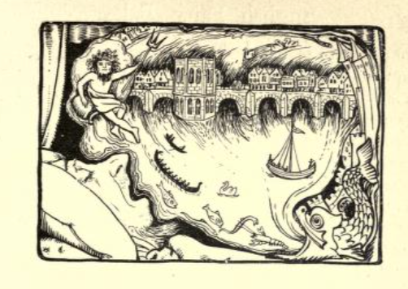
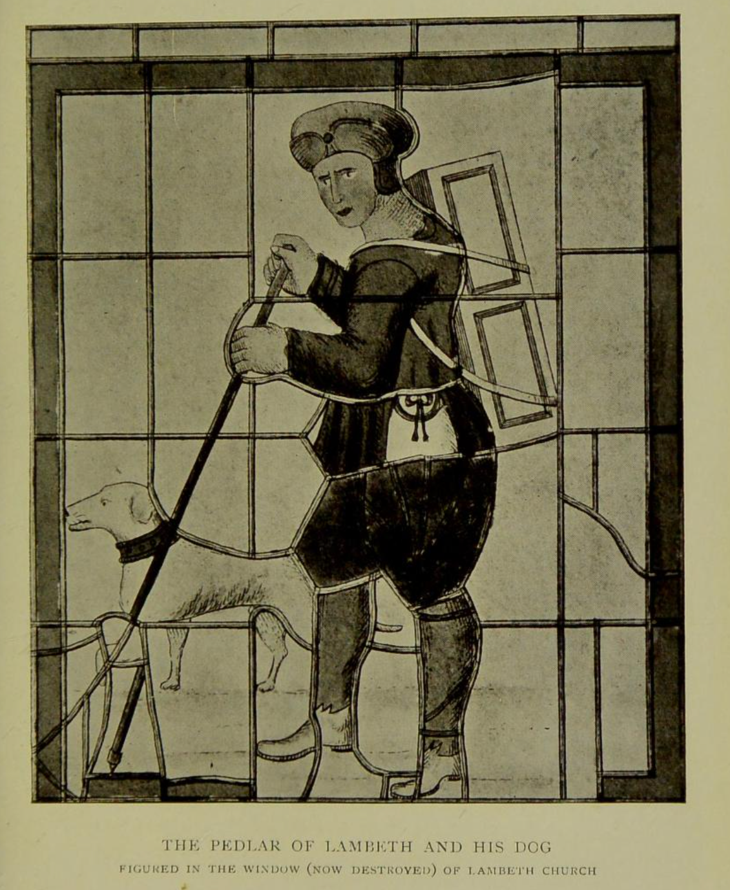
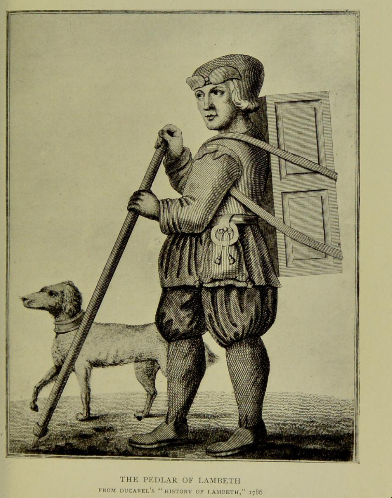

# The Pedlar of Swaffham

My way in to this story is "In the county of Norfolk, in the town of Swaffham, there was a pedlar. He lived ..." I also use our our cooking apple-tree as the minds-eye representation of the tree under which the treasure is found...


---

https://archive.org/details/bim_eighteenth-century_an-essay-towards-a-topog_blomefield-francis_1739_3/page/505/mode/2up

An essay towards a topographical history of the county of Norfolk, containing a description of the towns, villages, and hamlets, ... By Francis Blomefield, ...  1739: Vol 3

pp. 506-508

The North Isle of this Church

Is generally reported and believed to be built by Jobn Chapman a Tinker, of this Town, the History of it I shall here Transcribe from Sir Roger Twysden's *Remembrances* Ms; P. 299, published by our great English Antiquary Mr. Hearne of Oxford and then shall give my Opinion on it:

The Story `[Tho. Caij. Vindic. Antiq. Acad. Oxen. Vol. I, P. 84, Appendix]` of the PEDLAR of Swaffham Marker is in substance to this.

That Dreaming one Night if he went to *London*, he should certainly meet with a Man upon *London Bridge*, whith would tell him good News; he was so perplext in his Mind, that till he set upon his Journey, he could have no Rest :“ To London therefore he hasts, and Walk'd upon the Bridge for some Hours, where being espyed by a Shopkeeper, and asked what he wanted, he answered, you may well ask me that Question, for truly ( quoth he) I am come hither upon a very vain Errand, & so told the story of his Dream which occasioned the Journey. Whereupon the Shopkeeper reply'd, Alas good Friend! should I have heeded Dreams, I might have proved myself, as very a Fool as thou Hast; for tis not long since that I dreamt, that at a Place called *Swaffham Market* in *Norfolk*, dwells one *John Chapman* a PEDLAR, who hath a Tree, in his Backside unger which is buried a Pot of Money. Now therefore, if I should have made a Journey thither to dig, for such hidden Treasure, judge you whether I should, not have been counted a Fool. To whom the PEDLAR cunningly said " Yes verily ;" I will therefore return home and follow my business, not heeding such Dreams hence forward. But when he came Home, (being satisfied that his Dream was fulfilled, ) he took occasion to dig in that Place, and accordingly found a large Pot full df Money, which he prudently conceal'd, putting the Pot amongst the rest of his Brass, After a Time it happen'd that one, who came to dus House and beholding the Pot, observed an Inscription upon it, which being in *Latin* `[The common Tradition is, it was in English Rhyme, viz. Where this stood, Is another as good. Or as some will have it, Under me dothe lye, Another much richer than I.]`, he Interpreted it, that under that there was another twice as good. Of this Inscription the PEDLAR was before Ignorant, or at least minded it not, but when he heard the Meaning of it he said, tis very true, in the Shop where I bought this Pot, stood another under it, which was twice as big ; but considering that it might tend to his further profit to dig deeper in the same Place where he found that, he fell again to Work, and discoverd such a Pot, as Was intimated by the Inscription, full of old Coine: Notwithstanding which, he so conceal'd his Wealth, that the Neighbours took no Notice of it. But not long after the Inbabitance of *Swaffham* resolving to reedify their Church, and having consulted the Workmen about the Charge, they made a *Levy*, wherein they taxed the PEDLAR, according to no other Rate than what they had formerly done. But he, knowing his own Ability, came to the Church and desired the Workimen to shew him thir Model, and to tell him what they esteemed the Charge of the NORTH-ISLE would amount to; which when they told him, he presently undertook to pay them for Building it, and not only that, but of a very tall and beautifull Tower Steeple. This is the tradition of the *Inhabitants* as it was told me there. And in Testimony thereof, there was then his Picture, with his Wife and three Children, in every Window of the Isle, with an Inscription running through the bottom of all those Windows, viz. Orate pro bono Statu Johannis Chapman, . . . Uroris eius, et Libecorum luorum, qui quidem Johannes hanc Alam cum fenestris, teao et . . . rect fecit.

It was in Henry VII. Time, but the Year I now remember not, my Notes being left with Mr. William Sedgwike, who trickt the Pictures, he being then with me.

In that Isle is his Seat, of an antique Form, and on each Side the Entrance, the Statue of the PEDLAR of about a Foot in Length, with his Pack on his Back, very artificially Cut.

This was sent me from Mr. WILLIAM DUGDALE of Blyth Hall in Warwickshire, in a Letter dated the 29th of January 1652-3, which I have since learnt from others to have been most true.

ROGER TWYSDEN,

And in effect the aame has been found, in the* Histories Admirables de nostre Temps' par Simon Goulart, imprime a Geneve 1614, Tom. 3, P. 366. Soubs ce titre, Songe marveilleus, &c. Et Johannis Fungeri Etimologicon Latino-Græcum, Pag. 1110, et 1111*.

It is somewhat surprizing to find such considerable Persons as Sir William Dugdale, Sir Roger Twysden, &c. to patronize or credit such a Monkish Legend and Tradition favouring so much of the Cloister, and that the Townsmen and Neighbourhood should also believe it. I shall therefore endeavour to clear up this trite Story.

The *Seat* of the PEDLAR observed by *Dugdale* in his Time, to be in the *North Isle*, was taken down with others some Years past, when the greatest part of the Church, with the East End of the said Isle was new Seated and Pew'd in a modern way, but in the North Transept Chapel there is now, a patch'd piece of Woodwork, collected out of the Fragments of antient Stalls and Seats, and here united. On the lower Part of this Work is this Inscription, *Drate pro animabus*, and near the Top, *Johannis Langman . . . Katerine . . .* this Part no doubt belonged to some Seat made at the Charge of John Langman, who appears from an antient Mss, of this Church, call'd the BLACK-BOOk, to have been a considerable Benefactor to it. In the middle of this Work, and between the Inscriptions, is twice represented the Effigies of a Man as busied in his Shop, with a Mark of an I and C. conjoin'd, near it, probably for John Chapman and Catharine his Wife, and the Figure of a Woman also carv'd in two Places, and looking over the Door of a Shop. This Work is supported on each Side by the Heads of the Founders Seat, on both which near the Summit is a PEDLAR carv'd, with a Pack upon his Shoulders, and below him near the Bottom, a Figure which is commonly said to be a Dog, but from his being muzzled and a Chain running croſs his Back, is much more likely to prove a Bear, and so it seems to be in the Window of the North Isle, The uppermost Window but one of this Isle is now the only one, where the Effigies are remaining, here they are represented in two Places in a suppliant Posture, with close round purple Gowns turn'd up, and robed with Furr, tincturd Or. He has a rich Pilgrims Purse or Pouch hanging from a curious Belt or Girdle, and a little Dagger, and from her right Side hangs a string or Lace, at the End of which is something very like to the Shield and Arms of the antient Family of the Knever's in Norfolk, but I believe nothing more than a Buckle; behind her kneels her Son in a close blew Gown furr'd Or, there were two more Children behind him, but they are broken and lost. At the bottom of the Window this fragment of an Inscription now remains,

. . . Fenestre, ad Deict Sanctorum eius gloriam.

Over the Head of the Man in one Pannel as a Label,

petite Petre . . . Paule Beate.

In another.

. . . Christi Baptista Pisca .. . .

That the North Isle of this Church was founded by John Chapman, who was ChurchWarden in 1462, is beyound dispute; but that the *Founder* was a PEDLAR, is very improbable, for the `[These Zonae Stipatae, Pretiosae,Epitogia, Clochae furratae ad oram, Bursae cum imaginibus variis, et sculpti, enemalati et deaurati Cultelli, ad modum Gladiorum dependentes, &c, belonged to the People of Diſtinction, but were forbid the Clergy by John Stratford Archbishop of Cant.  Lindwodj Provinc' Lib. 3T de Vitâet honestate  Clericorum, &c. P. 123. It appears from an Arabick Canon of the 1st Nicene Council, that the bearing of a Purse is very Antient, which Canone enjoyns, that those in Holy Orders should not carry about them a pair of Knives, as if they were quarrelling Fellows, going out to fight and kill, &c. and that they should not hang a Purse at their Girdle. Ridley's View of Civil and Eccle' Law, P. 263.]` Richness of his Habit, &c. shews that he was a Person of Distinction: Now had this CHAPMAN been really a PEDLAR, it would have been more commendable to have had a Pourtraiture suitable to his Calling, (as is the Picture of the PEDLAR who was a Benefactor to the Church of St. Mary Lambeth in Surry) and to have been represented on the Glass, as the PEDLAR is on his Seat. If the carv'd Work was design'd to perpetuate the Memory of his low Degree, the Affectation of a Dress on the Glads so much superior to his Station, being of a Piece with other Benefactors in the Windows, Men of Estate and Worth, must be ridiculous to his own Times, and frustrate the very End and Intent of the Carving, by showing Posterity that he was a Man of Figure and Fortune.

The Truth of the Case seems to be no more than this, the Figures of a Pedlar, and a Man and Woman *busied in their Shop*, were according to the low taste of that Age in a modest Manner to set forth the Name of the Founder CHAPMAN, a Trader or Dealer, the word *Chapman* for a Trader is of great Antiquity, and Pedlars are often called by that Name even to this Day, by some antient People, such *Rebusses* are frequently met with on old Works, but I shall only mention One, and that because it is in the very Church.

Near to the Communion, Table on the North Side is the Altar Monument of Jobn Botwright, D. D. Rector of the Church when it was Rebuilt, on the body of the Tomb are four Shields, two, to represent his Priesthood, bearing the Sacramental Cups, and the Triangilur Emblem of the TRINITY, and two to represent his Name, bearing Boats and Wimbles, Instruments essential to any Wright or Worker in Wood, an *Ænigma* or *Rebus* full as obscure, as `[History of Walter Hemingford, published by Mr. Hearne, Vol. I, Appendix, P. 180.]` Chapman, under the Figure of a Pedlar.

---

Joseph Jacobs, [More English fairy tales](https://archive.org/details/moreenglishfairy00jacoiala/page/90/mode/2up), 1894, pp91-3.



The Pedlar of Swaffham

IN the old days when London Bridge was lined with shops from one end to the other, and salmon swam under the arches, there lived at Swaffham, in Norfolk, a poor pedlar. He'd much ado to make his living, trudging about with his pack at his back and his dog at his heels, and at the close of the day's labour was but too glad to sit down and sleep. Now it fell out that one night he dreamed a dream, and therein he saw the great bridge of London town, and it sounded in his ears that if he went there he should hear joyful news. He made little count of the dream, but on the following night it come back to him, and again on the third night.

, Then he said within himself, " I must needs try the issue of it," and so he trudged up to London town. Long was the way and right glad was he when he stood on the great bridge and saw the tall houses on right hand and left, and had glimpses of the water running and the ships sailing by. All day long he paced to and fro, but he heard nothing that might yield him comfort. And again on the morrow he stood and he gazed he paced afresh the length of London Bridge, but naught did he see and naught did he hear.

Now the third day being come as he still stood and gazed, a shopkeeper hard by spoke to him.

" Friend," said he, " I wonder much at your fruitless standing. Have you no wares to sell ? "

" No, indeed," quoth the pedlar.

" And you do not beg for alms."

" Not so long as I can keep myself."

" Then what, I pray thee, dost thou want here, and what may thy business be ? "

" Well, kind sir, to tell the truth, I dreamed that if I came hither, I should hear good news."

Right heartily did the shopkeeper laugh.

" Nay, thou must be a fool to take a journey on such a silly errand. I'll tell thee, poor silly country fellow, that I myself dream too o' nights, and that last night I dreamt myself to be in Swaffham, a place clean unknown to me, but in Norfolk if I mistake not, and methought I was in an orchard behind a pedlar's house, and in that orchard was a great oak tree. Then meseemed that if I digged I should find beneath that tree a great treasure. But think you I'm such a fool as to take on me a long and wearisome journey and all for a silly dream. No, my good fellow, learn wit from a wiser man than thyself. Get thee home, and mind thy business."

When the pedlar heard this he spoke no word, but was exceeding glad in himself, and returning home speedily, digged underneath the great oak-tree, and found a prodigious great treasure. He grew exceeding rich, but he did not forget his duty in the pride of his riches. For he built up again the church at Swaffham, and when he died they put a statue of him therein all in stone with his pack at his back and his dog at his heels. And there it stands to this day to witness if I lie.

NOTES p 229

LXIII. THE PEDLAR OF SWAFFHAM.

Source. Diary of Abraham de la Pryme (Surtees Soc.) under date loth Nov., 1699, but re-written by Mr. Nutt, who has retained the few characteristic seventeenth century touches of Pryme's dull and colourless narration. There is a somewhat fuller account in Blomfield's History of Norfolk, vi. 211-13, from Twysden's Reminiscences, ed. Hearne, p. 299. In this there is a double treasure ; the first in an iron pot with a Latin inscription, which the pedlar, whose name is John Chapman, does not understand. Inquiring its meaning from a learned friend, he is told

Under me doth lie

Another much richer than I.

He accordingly digs deeper and finds another pot of gold.

Parallels. Blomfield refers to Fungerus, Etymologicum LatinoGrcecttm, pp. ino-ii, where the same story is told of a peasant of Dort, in Holland, who was similarly directed to go to Kempen Bridge. Prof. E. B. Cowell, who gives the passage from Fungerus in a special paper on the subject in ti\t Journal of Philology, vi. 189-95, points out that the same story occurs in the Masnd-vi of the Persian port Jalaluddin, whoseyforwz/ is 1260 A.D. Here a young spendthrift of Bagdad is warned in a dream to repair to Cairo, with the usual result of being referred back.

Remarks. The artificial character of the incident is sufficient to prevent its having occurred in reality or to more than one inventive imagination. It must therefore have been brought to Europe from the East and adapted to local conditions at Dort and Swaffham Prof. Cowell suggests that it was possibly adapted at the latter place to account for the effigy of the pedlar and his dog.

An exemplary version of the story is given by Hugh Lupton in a recording from on [online seminar](https://www.youtube.com/watch?v=BDckUYph0-o) on the story istelf, as well as the wider storytelling tradition.

```{youtube} BDckUYph0-o
:url_parameters: ?t=528s
```


---


George Laurence Gomme, [Folklore as an historical science](https://archive.org/details/b24858912/page/n35/mode/2up), 1908, pp.13-24.

The evidence of historic events

I

The evidence of historic events which enter into tradition relates principally to the earliest periods, but much of it relates to periods well within the domain of history and yet reveals facts which history has either hopelessly neglected or misinterpreted. We shall find that these facts, though frequently relating to minor events, often have reference to matters of the highest national importance, and perhaps nowhere more definitely is this the case than in the legends connected with particular localities. Of one such tradition I will state what a somewhat detailed examination tells in this direction. It will, I think, serve as a good example of the kind of research that is required in each case, and it will illustrate in a rather special manner the value of these traditions to history.

The locus of the legend centres round London Bridge. The earliest written version of this legend is quoted from the MSS. of Sir Roger Twysden, who obtained it from "Sir William Dugdale, of Blyth Hall, in Warwickshire, in a letter dated 29th January, i652-3." Sir William says of it that "it was the tradition of the inhabitants as it was told me there," and Sir Roger Twysden adds of it that : " I have since learnt from others to be most true." This, therefore, is a very respectable origin for the legend, and I will transcribe it from Sir William Dugdale's letter which begins "the story of the Pedlar of Swaffham-market is in substance this " : —

"That dreaming one night if he went to London he should certainly meet with a man on London Bridge which would tell him good news he was so perplext in his mind that till he set upon his journey he could have no rest ; to London therefore he hasts and walk'd upon the Bridge for some hours where being espyed by a shopkeeper and asked what he wanted he answered you may well ask me that question for truly (quoth he) I am come hither upon a very vain errand and so told the story of his dream which occasioned the journey. Whereupon the shopkeeper reply'd alas good friend should I have heeded dreams I might have proved myself as very a fool as thou hast, for 'tis not long since that I dreamt that at a place called Swaffham Market in Norfolk dwells one John Chapman a pedlar who hath a tree in his backside under which is buried a pot of money. Now therefore if I should have made a journey thither to day for such hidden treasure judge you whether I should not have been counted a fool. To whom the pedlar cunningly said yes verily I will therefore return home and follow my business not heeding such dreams hence forward. But when he came home being satisfied that his dream was fulfilled he took occasion to dig in that place and accordingly found a large pot of money which he prudently conceal'd putting the pot amongst the rest of his brass. After a time it happen'd that one who came to his house and beholding the pot observed an inscription upon it which being in Latin he interpreted it that under that there was an other twice as good. Of this inscription the Pedlar was before ignorant or at least minded it not but when he heard the meaning of it he said 'tis very true in the shop where I bought this pot stood another under it which was twice as big ; but considering that it might tend to his further profit to dig deeper in the same place where he found that he fell again to work and discover'd such a pot as was intimated by the inscription full of old coins : notwithstanding all which he so conceal'd his wealth that the neighbours took no notice of it." `[It is printed, and I have used this print, in Blomefield's History of Norfolk (1769), >ii. 5°6> from which source I quote the facts concerning- it. Sir William Dugdale's account goes on to connect it with a monument in the church, but this part of the local version is to be considered presently.]`

Blomefield thought it "somewhat surprising to find such considerable persons as Sir William Dugdale and Sir Roger Twysden to patronise or credit such a monkish legend and tradition savouring so much of the cloister, and that the townsmen and neighbourhood should also believe it," but I think we shall have reason to congratulate ourselves that so good a folk-tale was preserved for us of this age.

The next and, it appears, an independent version, is given in the Diary of Abraham de la Pryme , under the date November ioth, 1699 : —

" Constant tradition says that there lived in former times, in Soffham (Swaffham), alias Sopham, in Norfolk, a certain pedlar, who dreamed that if he went to London bridge, and stood there, he should hear very joyfull newse, which he at first sleighted, but afterwards, his dream being dubled and trebled upon him, he resolv'd to try the issue of it, and accordingly went to London, and stood on the bridge there two or three days, looking about him, but heard nothing that might yield him any comfort. At last it happen'd that a shopkeeper there, hard by, haveing noted his fruitless standing-, seeing- that he neither sold any wares nor asked any almes, went to him and most earnestly begged to know what he wanted there, or what his business was ; to which the pedlar honestly answer'd, that he had dream'd that if he came to London and stood there upon the bridg, he should hear good newse ; at which the shopkeeper laught heartily, asking him if he was such a fool as to take a journey on such a silly errand, adding, ' I'll tell thee, country fellow, last night I dream'd that I was at Sopham, in Norfolk, a place utterly unknown to me, where methought behind a pedlar's house in a certain orchard, and under a great oak tree, if I digged I should find a vast treasure! Now think you,' says he, 'that I am such a fool to take such a long jorney upon me upon the instigation of a silly dream? No, no, I'm wiser. Therefore, good fellow, learn witt of me, and get you home, and mind your business.' The pedlar, observeing his words, what he had sayd he had dream'd and knowing they concenterd in him, glad of such joyfull newse went speedily home, and digged and found a prodigious great treasure, with which he grew exceeding rich, and Soffham church being for the most part fal'n down he set on workmen and reedifyd it most sumptuously, at his own charges ; and to this day there is his statue therein, cut in stone, with his pack at his back, and his dogg at his heels ; and his memory is also preserved by the same form or picture in most of the old glass windows, taverns, and alehouses of that town unto this day." `[See the Diary printed by the Surtees Society, p. 220.]`

Now this version from Abraham de la Pryme was certainly obtained from local sources, and it shows the general popularity of the legend, together with the faithfulness of the traditional version. `[The legend was also printed in that popular folk-book, New Help to Discourse , so often printed between 1619 and 1656, and Mr. Axon transcribed this version for the Antiquary, xi. 167-168 ; and see my notes in Gent. Mag. Lib. English Traditions, 332-336.]` But other evidence of the traditional force of the story is to be found. Observing that De la Pryme's Diary was not printed until 1870, though certainly the MS. had been lent to antiquaries, it is curious that the following almost identical account is told in the St. James's Chronicle of November 28th, 1786: — `[I happen to possess the original cutting of this version preserved among my great-grandfather's papers.]`

"A Pedlar who lived many Years ago at Swaffham, in Norfolk, dreamt, that if he came up to London, and stood upon the Bridge, he should hear very joyful News ; which he at first slighted, but afterwards his Dream being doubled and trebled unto him, he resolved to try the Issue of it ; and accordingly to London he came, and stood on the Bridge for two or three Days, but heard nothing which might give him Comfort that the Profits of his Journey would be equal to his Pains. At last it so happened, that a Shopkeeper there, having noted his fruitless standing, seeing that he neither sold any Wares, or asked any Alms, went to him, and enquired his Business ; to which the Pedlar made Answer, that being a Countryman, he had dreamt a Dream, that if he came up to London, he should hear good News : 'And art thou (said the Shopkeeper) such a Fool, to take a Journey on such a foolish Errand? Why I tell thee this— last Night I dreamt, that I was at Swaffham, in Norfolk, a Place utterly unknown to me, where, methought, behind a Pedlar's House, in a certain Orchard, under a great Oak Tree, if I digged there, I should find a mighty Mass of Treasure. Now think you, that I am so unwise, as to take so long a Journey upon me, only by the Instigation of a foolish Dream! No, no, far be such Folly from me ; therefore, honest Countryman, I advise thee to make haste Home again, and do not spend thy precious Time in the Expectation of the Event of an idle Dream.' The Pedlar, who noted well his Words, glad of such joyful News, went speedily Home, and digged under the Oak, where he found a very large Heap of Money ; with Part of which, the Church being then lately fallen down, he very sumptuously rebuilt it ; having his Statue cut therein, in Stone, with his Pack on his Back and his Dog at his Heels, which is to be seen at this Day. And his Memory is also preserved by the same Form, or Picture, on most of the Glass Windows of the Taverns and Alehouses in that Town."

The differences in these versions are sufficient to show independent origin. The identities are sufficient to illustrate, in a rather remarkable manner, how closely the words of the tradition were always followed. It appears from the last words of the contributor to the St. James's Chronicle , who signed himself "Z," that he heard it by word of mouth about the time of his writing it down, `[These words are, "lam not a Bigot in Dreams, yet I cannot help acknowledging the Relation of the above made a strong Impression on me.]` so that there is more than a hundred years between him and the Dugdale version, which was also recorded from "constant tradition."

In Glyde's Norfolk Garland (p. 69), is an account of this legend, but with a variant of one incident. The box containing the treasure had a Latin inscription on the lid, which John Chapman could not decipher. He put the lid in his window, and very soon he heard some youths turn the Latin sentence into English

" Under me doth lie Another much richer than I."

And he went to work digging deeper than before, and found a much richer treasure than the former. Another version of this rhyme is found in Transactions of the Cambridge Antiquarian Society (iii. 318) as

follows : u where this stood

Is another as good."

And both these versions are given by Blomefield.

Now if there were no other places besides Swaffham in Norfolk to which this legend is applied the interest in it would, of course, not be very great. But there are many other places, and we will first note those in Britain. The best is from Upsall, in Yorkshire, as follows : —

"Many years ago there resided, in the village of Upsall, a man who dreamed three nights successively that if he went to London Bridge he would hear of something greatly to his advantage. He went, travelling the whole distance from Upsall to London on foot ; arrived there, he took his station on the bridge, where he waited until his patience was nearly exhausted, and the idea that he had acted a very foolish part began to rise in his mind. At length he was accosted by a Quaker, who kindly inquired what he was waiting there so long for? After some hesitation, he told his dreams. The Quaker laughed at his simplicity, and told him that he had had last night a very curious dream himself, which was, that if he went and dug under a certain bush in Upsall Castle, in \ orkshire, he would find a pot of gold ; but he did not know where Upsall was, and inquired of the countryman if he knew, who, seeing some advantage in secrecy, pleaded ignorance of the locality, and then, thinking his business in London was completed, returned immediately home, dug beneath the bush, and there he found a pot filled with gold, and on the cover an inscription in a language which he did not understand. The pot and cover were, however, preserved at the village inn, where one day a bearded stranger like a Jew, made his appearance, saw the pot, and read the inscription on the cover, the plain English of which was —

" ' Look lower, where this stood Is another twice as good The man of Upsall hearing this resumed his spade, returned to the bush, dug deeper, and found another pot filled with gold, far more valuable than the first. Encouraged by this discovery, he dug deeper still, and found another yet more valuable.

"This is the constant tradition of the neighbourhood, and the identical bush yet exists (or did in i860) beneath which the treasure was found ; a burtree, or elder, Sambucus nigra , near the north-west corner of the ruins of the old castle." `[Leeds Mercury , January 3rd, 1885, communicated by Mr. Wm. Grainge of Harrogate.]`



It would be tedious to go through other English versions, `[Mr. Axon says it is current in Lancashire and in Cornwall, Antiquary, xi. 168 ; Sir John Rhys gives two Welsh versions in his Celtic Folklore, ii. 45S-462, 464-466 ; a Yorkshire version in ballad form is to be found in Castillo's Poems in the North Yorkshire Dialect (1878), under the title of "T' Lealholm Chap's lucky dreeam," Antiquary, xn. 121 ; an Ayrshire variant relates to the building of Dundonald Castle, and is given in Chambers's Pop. Rhymes of Scotland, 236.]` but I must point out that it is connected with a London district. This is shown not by the actual presence of the legend, which has died out in London, but by its representation in the parish church of Lambeth. The legend so strongly current at Swaffham, in Norfolk, is represented in the church in the shape of a carving in wood of a figure to represent the pedlar, and below him the figure of what is locally called a dog. `[Blomefield, Hist, of Norfolk, iii. 5°7> suggests that the animal carving represents a bear. There is nothing to confirm this and readers may judge for themselves by reference to the illustrations, which are from photographs taken in Swaffham Church.]` A comparison of this carving with the representation of the pedlar's window formerly existing in Lambeth Church, but which was sacrilegiously removed in 1884 by the late vicar of the parish, shows much the same general characteristics, and search among the parish books shows it to relate to a pedlar known by the name of Dog Smith, who left property still known by the name of the "Pedlar's Acre" to the parish. `[I discussed the details in the Antiquary , vol. x. pp. 202—205.]` All this suggests that we have here the last relics of the pedlar legend located in London.

The next stage in the history of this legend shows it to belong to the world's collection of folk-tales. There is, however, a preliminary fact of great significance to note, namely that two non-British versions refer to London Bridge. Thus a Breton tale refers to London Bridge, and the interest of this story is sufficiently great to quote it here from its recorder straight from the Breton folk : —

"Long ago, when the timbers of the most ancient of the vessels of- Brest were not yet acorns, there were two men in a farmhouse in the Cotes du Nord disputing, and they were disputing about London Bridge. One said it was the most beautiful sight in the world, while the other very truly said, 'No! the grace of the good God was more beautiful still.' And as the dispute went on, 'Let us,' said one of them, 'settle it once and for all, and in this way : let us now this moment go out along the high-road and let us ask the first three men we meet as to which is the most beautiful — London Bridge or the grace of the good God ? And which ever way they decide, he who holds the beaten opinion shall lose to the other all his possessions, farm and cattle and horses, everything.' So each being confident he was right, they went out : and the first man they met declared that though the grace of the good God was beautiful, London Bridge was more beautiful still ; and the second the same, and the third. And the man whose opinion was beaten, a rich farmer, gave up all he had and was a beggar.

" 'Now,' said he to himself when the other, taking his horse by the bridle, had left him — 'now let me go and see this London Bridge which is so wonderfully beautiful ; ' and, being very manful and stout, he set out at once to walk, and walking on and on was there by nightfall. But, good Christian that he was, he could see in it nothing to shake his belief that the grace of the good God was more beautiful still.

" Soon the bridge was silent, and the last to cross it had gone home ; and he, notwithstanding his losses, tired out and sleepy, lay down and fell into a doze there ; and, while he was dozing, there came by two men, and one of them, standing quite close by him, said to the other, ' The night is fine, the wind gentle, the stars clear ! On such a night whoever were to collect the dew would be able to heal the blind.'

' It is true,' answered the other ; ' but none know of it.' And they passed on, quietly as they had come. Thereupon up rose the beggared farmer, and with basin and cup set about collecting the dew ; and in a very short time performed with it the most wonderful cures ; finally curing the daughter of a neighbouring Emperor who had been blind from her birth, and whom her grateful father gave to him at once in marriage, since directly she set eyes on him she loved him." `[This story was communicated by "W.F." to the St. James s Gazette, March 15th, 1888. Its continuation, in order to point a moral, does not belong to the real story, which is contained in the part I have quoted.]`



The second non-British variant, which also attaches to London Bridge, is to be found in the Heimskringla , `[Saga Library , Heimskringla , iii. 126.]` and I will quote William Morris's translation:—

" West in Valland was a man infirm so that he was a cripple and went on knees and knuckles. On a day he was abroad on the way and was asleep there. That dreamed he that a man came to him glorious of aspect and asked whither he was bound and the man named some town or other. So the glorious man spoke to him : Fare then to Olafs church the one that is in London and thou wilt be whole. Thereafter he awoke, and fared to seek Olafs church and at last he came to London bridge and there asked the folk of the city if they knew to tell him where was Olaf's church. But they answered and said that there were many more churches there than they might wot to what man they were hallowed. But a little thereafter came a man to him who asked whither he was bound and the cripple told him. And sithence said that man : We twain shall fare both to the church of Olaf for I know the way thither. Therewith they fared over the bridge and went along the street which led to Olaf's church. But when they came to the lich gate then strode that one over the threshold of the gate but the cripple rolled in over it and straightway rose up a whole man. But when he looked around him his fellow farer was vanished.

I shall have to refer again to these Breton and Norse versions, because of their retention of London Bridge as the locale of the story, in common with all the versions which have been found in Britain. In the meantime it is to be noted that the remaining non-British variants are told of other bridges and other places. Holland, Denmark, Italy, Cairo, have their representative variants ; `[These have been collected and commented upon with his usual learning and research, by Mr. Hartland in the Antiquary , xv. 45-48. Blomefield, in his History of Norfolk, iii. 507, points out that the same story is found in Johannes Fungerus' Etymologicon Latino-Grcecum, pp. 1 noun, though it is here narrated of a man at Dort in Holland, and in Histoires admirables de nostre temps, par Simon Goulart, Geneva, 1614, iii. p. 366. Professor Cowell, in the third volume of the Cambridge Antiquarian Society Transactions, p. 320, has printed a remarkable parallel of the story which is to be found in the great Persian metaphysical and religious poem called the Masnavi, written by Jaldluddin, who died about 1260. J. Grimm discussed these treasure-on-the-bridge stories in Kleinere Schriften , iii. 414-428, and did not attach much value to them.]` and it thus presents to the student of tradition an excellent example for inquiry as to the value to history of legends world-wide in their distribution attaching themselves to historical localities.

There are some obvious features about this group of traditions, which at once lead to interesting questions. There is first the fact that all the British variants of the treasure stories centre round London Bridge; secondly, there is the extension beyond Britain to the Breton variant and the Norse variant, both non-British legends, of which the locus is London Bridge. From these two facts it is clear that London Bridge had some special influence at a period of its history which dates before the separation of the Breton folk from their Celtic brethren in Britain, for the Bretons would not after their separation acquire a London Bridge tradition ; and again at a period of its history when Norse legend and saga were fashioning. In the one case the myth-makers must have been Celts of the fourth century, and the only bridge known to these Celts must have been that belonging to Roman Lundinium ; in the other case the myth-makers were Norsemen, and the bridge known to them was the later bridge so frequently referred to in the chronicle accounts of the Danish and Norse invasions of England.

It is not difficult, by a joint appeal to history and folklore, to trace out from this very definite starting-point the events which brought about this particular specialisation of the world-spread treasure myths.

...


----


E. S. Hartland, [English fairy and other folk tales](https://archive.org/details/englishfairyothe00hartiala/page/76/mode/1up), 1906?, p76-7.

See also: [The diary of Abraham De la Pryme, the Yorkshire antiquary](https://archive.org/details/diaryofabrahamde00delarich/page/218/mode/2up), The publictionos of the Surtees Society, vol. LIV, pp. 219-20, 1869.

THE PEDLAR OF SWAFFHAM. `[*Diary of Abraham dela Pryme*, p. 220, under date 10 Nov. 1699. (Surtees Society.)]`

Constant tradition says that there lived in former times in Soffham (Swaflfham), alias Sopham, in Norfolk, a certain pedlar, who dreamed that if he went to London Bridge, and stood there, he should hear very joyful! newse, which he at first sleighted, but afterwards, his dream being doubled and trebled upon him, he resolved to try the issue of it, and accordingly went to London, and stood on the bridge there two or three days, looking about him, but heard nothing that might yield him any comfort At last it happened that a shopkeeper there, hard by, having noted his fruitless standing, seeing that he neither sold any wares nor asked any almes, went to him and most earnestly begged to know what he wanted there, or what his business was; to which the pedlar honestly answered that he had dreamed that if he came to London and stood there upon the bridge he should hear good newse ; at which the shopkeeper laught heartily, asking him if he was such a fool as to take a journey on such a silly errand, adding : " I'll tell thee, country fellow, last night I dreamed that I was at Sopham, in Norfolk, a place utterly unknown to me, where methought behind a pedlar's house in a certain orchard, and under a great oak tree, if I digged I should find a vast treasure! Now think you," says he, "that I am such a fool to take such a long journey upon me upon the instigation of a silly dream ? No, no, I'm wiser. Therefore, good fellow, learn wit from me, and get you home, and mind your business." The pedlar observing his words, what he had say'd he dream'd, and knowing they concentred in him, glad of such joyful! newse, went speedily home, and digged and found a prodigious great treasure, with which he grew exceeding rich ; and SofFham (Church) being for the most part fallen down, he set on workmen and rectified it most sumptuously, at his own charges ; and to this day there is his statue therein, but in stone, with his pack at his back and his dogg at his heels ; and his memory is also preserved by the same form or picture in most of the old glass windows, taverns, and alehouses of that town unto this day.


---

E. Sidney Hartland, in [Folk lore : A quarterly review of myth, tradition, institution , and custom](https://archive.org/details/dli.ministry.13083/page/332/mode/2up), 1908, p333-6

The PEDLAR OF SWAFFHAM.

I have tread in the June number of Fo/é-Zore the review by Mr. Andrew Lang of Mr. Gomme's recent book on Jo/Alore as an fisterical Saence, While it displays many of the piquant and delightful characteristics of Mr. Lang's writing I hardly think it does justice to the keen critical power, the wide knowledge, and the fertility of suggestion displayed in the work. On one point, however, I am heartily im agreement with the reviewer, namely, his opening remark that "discussion clears matters up, and that criticism is really a form of collaboration." With this in mind I venture to offer a few observations on Mr. Gomme's treatment of the tale of the Pedlar of Swaffham. It is a mere detail, and if the conclusion I am about to controvert be rejected the general argument of the book will be in no way affected. The utmost that can then be said is that some other story would have formed a better illustration of the possibilities which a due consideration of the contents of tradition may evolve.

All the British variants of the story of the Pedlar of Swafiham represent the hero to have been directed by his dream to London Bridge as the place where he was to hear good news. London Bridge is also mentioned in other traditions, English and Welsh, Moreover, it appears in a Breton story pot belonging to the Pedlar cycle, where the hero disputes with another man which was more beautiful, London Bridge or the grace of God. He bets all his possessions on the latter, and by the award of the first person they meet loses them. Then he makes his way to London Bridge to see it for himself, and there hears something which finally obtains him the hand of an emperor's daughter. A story in the ffeimskringla also mentions London Bridge. A cnpple directed to St. Olafs Church for healing meets on London Bridge a mysterious stranger who shews him the way to the church, Mr Gomme claims that these traditions prove that London Bridge, first built by the Romans, had produced a profound impression on the minds of the natives of Britain prior to the emigration to Brittany, as well as on the minds of the raiding Norsemen centuries later.

Taking the Norsemen first, it will be observed that the mention of the bridge is merely incidental, Toa man coming to London from France, as the tale represents, London Bridge would be the entrance to the city; and it is there (surely the most natural place) that he meets the Stranger who conducts him to the church. All the other stories to which Mr. Gomme refers were recorded centuries later than this, The earliest recorded version of the Pedlar of Swaffham is by Sir William Dugdale ina letter to Sir Roger Twysden under date zgth Jan., 1652-3. The Welsh tales (which do not belong to the same cycle, though they do relate to buried treasure) Were not recorded before the middle of the last century. The Breton story is later still,

Now with great submission I think this is rather a sandy foundation for Mr. Gomme's conclusion, It may be conceded that London Bridge had acquired a reputation as a remarkable work, and one of the wonders of the capital, in all sorts of out of the way places. But it is far too large an assumption that it must have been before the flight of the Btitish emigrants at the time of the Anglo-Saxon invasion to their new home in Brittany. There was plenty of time and plenty of opportunity for much later tidings of the wonder to travel to remote places and become fixed in the mind of the folk before any of the tales were recorded, I am not tnmindful of the tenacity of tradition, mor do T forget that the date of the record is by no means the ferwinus a guo from which the date of the tradition itself is to be reckoned. The stories, however, are, in the form t least in which they have descended to us, all of them late. None of them, save perhaps the song "London Bridge is broken down," could have arisen in a condition of society where hostility and bloodshed were rife, and travel and commerce were unknown or uncommon and unsafe. In a sense it is true that, as Mr, Gomme points out, legends of buried treasure belong to the period of conquest and fighting. But im this form they point to a period when the conquest and fighting had long been done, when peace had been re-established in such prestige that people could safely trade and journey and if good luck attended them recover the treasure buried by others long ages before. There are still further considerations. The tale of the Pedlar of Swaffham is common all over central Europe as far north as Denmark and as far south as Sicily. It even appears in the Arabian Nights, the Masnavi J Ma'navé and other Onental compilations. The relations of these variants to ome another and to the British variants have mot yet been fully investigated. But it is quite clear that they all arose in much the same state of society; and it is important to mote that nearly all the European variants mention a bridge—sometimes one bndge, sometimes another, according to the country where the tale is told—as the place where the good news is to be communicated or the treasure heard of. Before we can draw any certain inferences from the mention m the Hritish tales of London Bridge, we must know why a bridge at all was selected as the scene. There is nothing of the sort in the, Oriental versions, and the remarkable agreement of the European tales on this detail points to a common source for them all. If, when the tale came' to England, probably—nay, certainly—long after the Anglo-Saxon settlement, a bnidge had to be found as the scene, many reasons may be suggested for choosing London Bridge, without going back to the days of the Romans for its renown. The Lambeth window cannot upon the evidence be connected with the story. It did indeed agree with the stone figure at Swaffham in representing a pedlar with his pack and dog. But 80 far as local tradition goes, it was intended simply to commemorate a benefaction to the parish by a pedlar called Dog Smith. Dog Smith was an historical character who lived in he seventeenth century. It seems, however, that a painting | of a pedlar existed in the window long before his death, but whom or what it referred to there is nothing to show.! WNo tale corresponding to that of the Pedlar of Swaffham has been recovered in the parish. The dog, it should be observed, though found in the representations both at Swaffham and at Lambeth, does not make his apptatance in the story,

In view of these considerations I cannot think that Mr. Gomme is well advised in adducing the tale of the Pedlar of Swaffham as revealing anything of the stage of civilization of the native Britons when the Romans first built London Bridge, or of the impression made by the bridge upon their minds.

E. Sidney Hartland.

---
