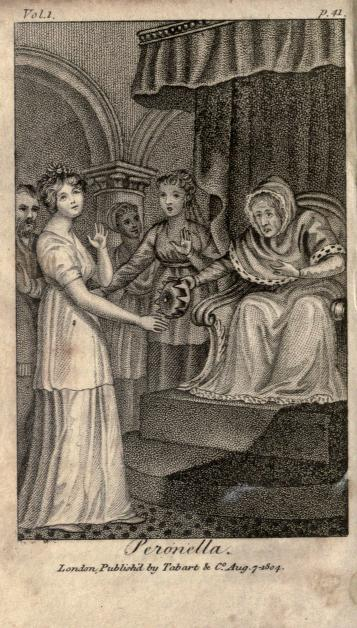

# Peronella

Tabart's collection of popular stories for the nursery : from the French, Italian, and old English writers
by Godwin, William, 1756-1836, Part I

Publication date 1804

pp. 38-47

PERONELLA.

THERE was once upon a time a queen so very old, that all her teeth had dropped out and all her hair had fallen off: her head shook like an aspen leaf, nor could she scarcely see at all even with spectacles: her nose and chin almost touched each other: she was shrunk to somewhat more than half of her former height; was all of a heap,and her back so very round that one could not but imagine she had been hunch-backed all her life.

A fairy who had been present at the birth of the queen just now paid her a visit, and, seeing her burthened with age and infirmity, asked her majesty if she wished to grow young again.

"How can you doubt it?" replied the queen: "there is not a jewel in my caskets but I would give to be once more only twenty years of age."

"If it be so," continued the fairy, "we must immediately look out for some young blooming creature, who for the sake of your majesty's great riches will take upon her the hundred years you would fain get rid of. Does your majesty think we shall be able to find such a person?"

"We will try," replied the queen; and immediately ordered the strictest search to be made throughout her dominions, for a young lass who should be willing to give her youth in exchange for age, infirmities, and riches.

It was not long before several covetous creatures made their appearance to accept the proffered conditions: but when they saw how the old queen coughed, and spit, and rattled in her throat; how she lived upon spoon-meat; how dirty she was; that she was wrinkled, and her person smelled disagreeably; what pain she suffered; and how many times she said over the same thing, they said they preferred their own condition, poor and miserable as it was, to riches and the hundred years of her majesty.

Afterward there came some persons of a still more ambitious temper: to these the queen promised the most profitable places and the highest honours. At first they were extremely willing; but when they had stayed a short time with her majesty, they shook their heads as they left the room, saying: "Of what use would all the queen possesses be to us, since, being so very hideous and disgusting, we could not venture to show ourselves to any one?"

At length, a young lass from a country village presented herself. She was extremely beautiful, and declared herself willing to accept of the crown in exchange for her youth:— her name was Peronella.

At first the queen was very angry; but what end could it answer to be angry, since it was her determination to grow young again?

She proposed to Peronella to divide the kingdom with her: "You shall have one half, and I the other," said she: "this surely is enough for you, who are but a poor country girl."

"No," replied Peronella: "this will by no means satisfy me. I will have the whole: or let me be still a country girl with my blooming complexion and my briskness, and do you keep your wrinkles and your hundred years, with Death himself treading upon your heels."

"But," continued the queen, "what shall I do if I give away my whole kingdom?" "Do?" said Peronella. "Your majesty will laugh, dance and sing as I do:" and so saying, she laughed, danced and sung before her.

Tht queen, who could do nothing like this, asked Peronella how she would amuse herself if she were in her place, a stranger as she was to the infirmities of age?

"I really cannot be quite sure what I would do," answered Peronella: "but I have a great mind to try the experiment, since every one says it is so fine a thing to be a queen."

While the queen and Peronella were thus making their agreement, the fairy herself entered the room, and said to the country lass: "Are you willing to make the trial, how you should like to be a queen, extremely rich, and a hundred years old?"

"I have no objection," said Peronella.

In a single instant her skin is all over wrinkles; her hair turns gray; she becomes peevish and ill-natured; her head shakes; her teeth dropout: she is already a hundred years old.

The fairy next opened a little box, and a numerous crowd of officers and courtiers, all richly dressed, came out of it; who immediately rose to their full stature, and all paid a thousand compliments to the new queen.

A sumptuous repast is set before her: but she has not the least appetite; she cannot chew; she knows not what to say, or how to behave, and is quite ashamed at the figure she makes; she coughs till she is almost dead; she drivels, and a drop hangs at her nose which she has not strength to wipe away; she sees herself in the looking-glass, and perceives she is as ugly and deformed as an old grandam ape.

In the mean while the real queen stood in a corner, smiling all the time to see how fresh and comely she was grown; what beautiful hair she had; and how her teeth were become white and firm.

Her complexion was fair and rosy, and she could skip about as nimbly as a deer: but then she was dressed in a short filthy rag of a petticoat, and her cap and apron seemed as if she had sifted cinders through them.

She scarcely dared to move in such clothes as these, to which she had never been accustomed; and the guards, who never suffered such dirty ragged-looking people within the palace gates, pushed her about with the greatest rudeness.

Peronella, who all the time was looking on, now said to her: "I see it is quite dreadful to you not to be a queen, and it is still more so to me to be one: pray take your crown again, and give me my ragged petticoat."

The change was immediately made. The queen grew old again, and Peronella as young and blooming as she had been before.

Scarcely was the change complete, than each began to repent of what she had done, and would have tried a little longer: but it was now too late. The fairy condemned them for ever after to remain in their own conditions.

The queen cried all day long, if her finger did but ach; saying: "Alas! if I were now but Peronella, I should, it is true, sleep in a poor cottage, and live on potatoes; but I should dance with the shepherds under a shady elm, to the soft sounds of the flute. Of what service is a bed of down to me, since it procures me neither sleep nor ease? or so many attendants, since they cannot change my unhappy condition?"

Thus the queen's fretfulness increased the pain she suffered: nor could the twelve physicians, who constantly attended her, be of the least service. In short, she died about two months after.

Peronella was dancing, with her companions, on the fresh grass by the side of a transparent stream, when the first news of the queen's death reached her: so she said to her companions: "How fortunate I was in preferring my own humble lot to that of a kingdom!"

Soon after, the fairy came again to visit Peronella, and gave her the choice of three husbands: the first was old, peevish, disagreeable, jealous, and cruel; but, at the same time, rich, powerful, and a man of high distinction, who would never suffer her by day or night to be, for a single moment, out of his sight.

The second was handsome, mild, and amiable; he was descended from a noble family, but was extremely poor, and unlucky in all his undertakings.

The third, like herself, was of poor extraction, and a shepherd; but neither handsome nor ugly: he would be neither overfond nor neglectful; neither rich nor very poor. Peronella knew not which to choose; for she was passionately fond of fine clothes, of a coach, and of great distinction.

But the fairy, seeing her hesitate, said:

"What a silly girl you are! If you would be happy, you must choose the shepherd.

"Of the second you would be too fond; the first would be too fond of you; either would make you miserable: be content, if the third never treat you unkindly.

"It is a thousand times better to dance on the green grass, or on the fern, than in a palace; and to be poor Peronella in a village, than a fine lady who is for ever sick and discontented at court.

"If you will determine to think nothing of grandeur and riches, you may lead a long and happy life with your shepherd, in a state of the most perfect content."

Peronella took the fairy's advice, and became a proof of the happiness that awaits a simple life.
