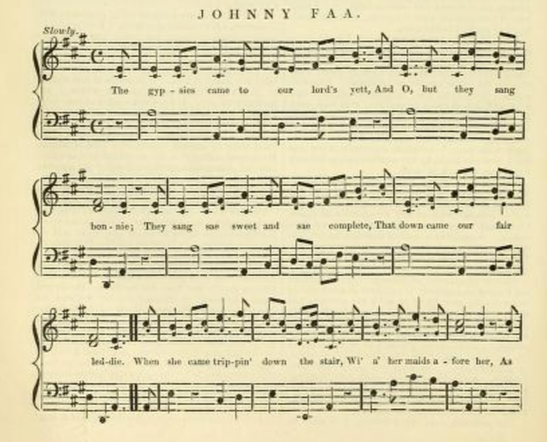
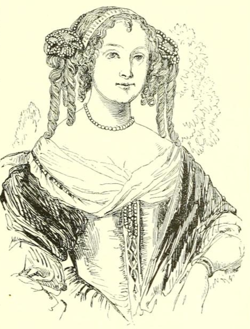

# Raggle Taggle Gypsy

There are many versions of this fantastic folk song, one of Emma's favourites, based on the ballad of Johnny Faa and Countess of Cassilis.

For example, here's a gentle version by *Planxty*:

```{youtube} JyP407UnUWw
```

And a slightly more punky version from *Ferocious Dog*:

```{youtube} YWJwe44MgXs
```

Which seems to follow the lyrics of a version by *The Chieftains* quite closely:

```{youtube} FnHhb3o9T2w
```

```{admonition} *Raggle Taggle Gypsy*, The Chieftains
:class: dropdown

There were three old gypsies came to our house door
they came brave and boldly-o
And one sang high and the other sang low
and the other sang a raggle taggle gypsy-o

It was upstairs downstairs the lady went
put on her suit of leather-o
And there was a cry from around the door
she's away wi' the raggle taggle gypsy-o

It was late that night that the Lord came in
enquiring for his lady-o
And the servant girl she says to the Lord
"She's away wi' the raggle taggle gypsy-o"

"Well saddle for me my milk white steed
- my big horse is not speedy-o
I will ride, I will seek my bride
she's away wi' the raggle taggle gypsy-o"

Well he rode East and he rode West
he rode North and South also
Until he came to a wide open field
it was there that he found his lady-o

"Tell me, how could thee leave your goose feather bed
your blankets strewn so comely-o?
How could you leave your noble wedded Lord
all for the raggle taggle gypsy-o?"

"Well what do I care for my goose feather bed
And for my blankets strewn comely-o?
Tonight I lie in a wide open field
in the arms of a raggle taggle gypsy-o"

"Tell me, how could you leave your house and your land?
how could you leave your money-o?
How could you leave your only wedded Lord
all for that raggle taggle gypsy-o?"

"Well what do care I for my house and my land?
And what do I care for my money-o?
I'd rather have a kiss from the yellow gypsy's lips
I'm away with the raggle taggle gypsy-o!"

"I'm away with the raggle taggle gypsy-o!"
```

My current-working take on the tale, is still in preparation:

```{admonition} A telling
:class: seealso dropdown

> There is, or was, in the Cassilis family's winter home in Maybole,  a fragment of tapestry, depicting a beautiful young woman astride a majestic white horse, arms clasped round the waist of her handsome lover, a party of gaily clothed men riding with them.
>
> You can sense their happiness, their excitement at riding together, their love of life, and their love for each other. It is said that those tapestries were stitched by the former Lady Cassilis herself. It is said, that the walls of her room were covered from floor to ceiling with panels of similar scenes.
>
> Years before, the young Lady Jean Hamilton was very much in love with dashing young knight. Sir John Faa was his name, of nearby Dunbar. Jean was still too young to marry, but they had betrothed themselves to each other. Even so, Jane's father was less then enamoured of the young knight, and favoured a more advantageous partnership, in the form of a marriage to the Earl of Cassilis. Who know what strategies Lady Jane used to try to put her father off this idea — "I can't marry him; it would not be right; you all saw what the fifth earl did to his wife — he beat her senseless, and suffered the penalty for it; he treated her worse than he would his dog; would you have me, would you have your own daughter, treated that same way?" But the sixth earl was considered a man of great virtue, serious, and grave, and not like his cousin, and Lady Jane's father was insistent, that Lady Jane and Sir John Faa should break off their engagement. To try to buy some time, Sir John Faa departed to the continent to do whatever  "knightly things" men of adventure did at that time; and when he returned in a couple of years, he would surely have achieved such a rank that would him legitimise him as a husband.
>
> The time passed slowly. Jane's father began to seek a suitor for her. She did what she could to dissuade him, but it was to no avail. The second anniversary of her parting from Johnny Faa came and went, and then, a letter arrived, from the English ambassador at Madrid. Johnny Faa had been involved in some sort of battle, or fight, and had been killed.
>
> If Jane had complained about the age difference — Cassilis was older than she — about how the family fortune would be lost into his estate if — when — he would die before her — it made no difference: a dispensation was made that her fortune would remain hers.
>
> So married she would be.
>
> And married she was.
>
> And as a wife, she did "her duty", bearing the earl a son and two daughters.
>
> It is said that the Lady Cassilis was a pious and knowledgeable woman, but she could also be rather outspoken; once, during the Commonwealth, when Cromwell's men were passing by the Castle, she started to taunted them, to lambast them, to call them out as *murderers*, "you killed our King, you MURDERERS". Her maid tried to stop her, but the lady was in full voice, and her maid was only able to pull her away one of the soldiers fired his musket back in response, with the musket ball only narrowly missing both of the women.
>
> Another time, when the Earl was away, a party of gypsies passed by; at that time, gypsy bands had a certain *reputation*: whenever they passed by, anything that wasn't tied down would somehow end up in their possession; and if anything was tied down, you;d be lucky if you were left with the rope. But this band seemed different. This band seemed more like troubadours than vagabonds, musicians rather then thieves.
>
> They'd settled on the mound in front of the Castle, beneath the boughs of the spreading tree that grew there. The Lady Cassilis had a taken a fancy to listen to them sing and play from the battlements. She called her maid to fetch some coins, that she could throw down to them, and called them closer... and recognised, amongst, them, Johnny Faa. Her true love. Her betrothed. The maid was sent to tell the men to go round to the kitchens, where they would be fed. And somehow she managed to meet with them, or at least, one of them in particular.
>
> "what happened to you? Where have you been? We had a letter, that you were killed, that you were killed in some battle, or fight? And so I had to marry him, I, I thought you were dead..."
>
> "Not dead, just detained. By the Inquisition... there was a little misunderstanding. I may have said something that didn't go down too well... but then, eventually, I, well, you know, and then it took some time to get back across Spain, across the mountains, across France... And when I eventually got to London, I saw Cassilis, heard that he had married, heard he'd married you..."
>
> "I joined up with these men, told them my story... And we made a plan... So come with us, come with me... You don't have to stay here any more. We can be together, like we said we would be."
>
> It is said, in some versions of the song, that the gypsies beguiled the lady, that she left with them under some enchantment.
>
> It is said, or it is sung, that when the Earl returned home to find his wife had left with a raggle taggle band of gypsies, that he saddled his fastest black horse and set off in search of them.
>
> That when he eventually found them, he wondered of his wife how she could leave her house, and her lands, her finery and her finances, and then she replied that she was happier with he raggle taggle gypsy, oh.
>
> But the story tells a different tale.
>
> It tells of how the Earl of Cassilis and his men found them at a ford, a crossing place of stepping stones over the Doon, a place that came to be known as the Gypsies' steps. Cassilis may well have asked his wife what she thought she was doing, but he also took Sir John Faa, and all but one of the gypsy men he was with, as his prisoners.
>
> Because at this time in Scotland, the Lord of the manor was also the man who determined the law. And he saw fit to punish John Faa.
>
> The Lady Cassilis, Lady Jane Hamilton, as was, was taken up to the castle. Was taken to the window from which she had teased and taunted Cromwell's men, and forced to watch as one by one the gypsy men were hung from the spreading tree on the mound in front of the house. Was forced to watch as the last of the men, her once betrothed knight, Sir John Faa, was hung by the neck, until he was dead. And then cut down.
>
> That room, in the Castle of the Cassilis family line, was forever after known as the Countess' room. For a short while, she remained there, but as she sank into melancholy and despair, a perhaps understandable reaction to what she had been forced to witness. She was then removed to the family house at Maybole and divorced by the Earl of Cassilis.
>
> But still her punishment continued. For carved into the stone staircase were fifteen heads, their features the same as those of Johnny Faa's men, and largest amongst them the carved head of Sit John Faa himself.
>
> And so the Lady spent her time in isolation, fixated on creating in tapestry another ending to the tale. An ending that is one more commonly found in the song that was written by the man who escaped the clutches of the Earl of Cassilis' mean at the Gypsies' steps. The song that is known as the *Raggle Taggle Gypsy, Oh*.
```

By way of comparison, the lyrical content of various versions of the song are reviewed on the [*Irish Music Daily*](https://www.irishmusicdaily.com/raggle-taggle-gypsy) website:

```{admonition} Irish Music Daily — *Raggle Taggle Gypsy*
:class: dropdown

https://www.irishmusicdaily.com/raggle-taggle-gypsy

> Raggle Taggle Gypsy – ancient song – modern appeal
> 
> The Raggle Taggle Gypsy is a very old folk song that has had a resurgence in popularity over recent years thanks to recordings by high profile artists like The Waterboys, Planxty and Celtic Thunder.
>
> The song is to be found all over the world under various names including The Raggle Taggle Gypsies, Black Jack Davy, Gypsy Davy, Seven Yellow Gypsies and many more.
>
> The rough gypsy charms the fine lady
> The different versions vary in detail but the basic story is generally the same. A noble lady married to the local lord of the manor falls in love with a gypsy who turns up unexpectedly at the door of her stately home.
>
> She abandons her husband and her lavish lifestyle so she can run away with the handsome stranger.
>
> Raggle Taggle Gypsy
> She's away with the raggle, taggle gypsy-o
> When the lord returns and can not find his wife, the servants tell him that "she's away with the raggle taggle gypsy-o".
>
> Furious, he takes his fastest horse and vows to ride until he finds his wife. When he does find her, however, she refuses to return and says she would prefer to stay with her new gypsy lover.
>
> The husband's reaction to this news is somewhat materialistic and ensures that we don't have much sympathy with him, even though he has just been abandoned by his wife.
>
> How could you leave your house and your land?
> Instead of coming across as heartbroken or even upset, the husband's reaction suggests he feels insulted rather than rejected. His main concern is not so much that his wife has left him, but rather that she has left him for an impoverished gypsy.
>
> He fires questions at her, all to do with wealth rather than love. He asks her how could she leave her house, her land, her money and her fine feather bed … "all for a raggle taggle gypsy-o".
>
> These are questions that may be going through the minds of many listeners too but the lady has an answer.
>
> What care I for money-o?
> The wife's response is that this is all about love. She doesn't care for money, land, fine beds or anything else. She'd rather sleep out rough in the fields if it means she can be in "the arms of a raggle taggle gypsy-o".
>
> Most versions of the Raggle Taggle Gypsy end in this way with the wife happy in her choice and ready to start enjoying her new life. There are, however, several alternative endings.
>
> Alternative endings to Raggle Taggle Gypsy
> In some versions of the song, such as Seven Yellow Gypsies recorded by Nic Jones, the gypsy and his gang are captured by the husband and hanged – denying both us and the wife a happy ending!
>
> In other versions, the wife appears to be having second thoughts as she reflects on how last night she slept in a fine feather bed whereas tonight "I will sleep in the cold barren shed".
>
> There's nothing stated explicitly but there's a sense that she is starting to wonder about her decision. This introduction of doubt gives the song more depth as the lady suddenly becomes a more rounded character.
>
> And, of course, these are also the kind of questions that may go through the mind of the listener – will the lady's new gypsy lover and sleeping rough still seem exciting a few years down the line?
```

## Chambers' take on the story

The tale behind the ballad appears to have been popularsied by Robert Chambers' telling of the "common version of the story" in his *Picture of Scotland, volume first, Article Ayrshire*, 1827, [pp. 294-6](https://archive.org/details/picturescotland00chamgoog/page/n301/mode/2up). Both the telling and the ballad are in his *The Scottish ballads*, 1829, [pp143-6](https://archive.org/details/scottishballads01chamgoog/page/n166/mode/2up), where he sets the scene as follows:

```{admonition} Maybole, and the mansion-house of the Cassilis family, 1927
:class: dropdown

https://archive.org/details/picturescotland00chamgoog/page/n299/mode/2up

The Picture of Scotland
by Robert Chambers

Publication date 1827

pp.293-4

Maybole, the capital of Carrick, and a burgh of barony, is a good-looking town, situated on the face of a gentle hill, with a southern exposure. Though the streets have the fault of narrowness, and contain no eminently fine place or public building, Maybole nevertheless possesses a certain degree of massive and metropolitan magnificence, seldom seen in much larger towns. This is owing to the circumstance of its having been in former times the winter-residence of a number of the noble and baronial families of the neighbourhood, some of whose mansions, yet surviving, with their stately turrets and turnpikes, give an air of antique dignity to all the houses around. There were once no fewer than twenty-eight such mansion-houses; and, previous to the abolition of heritable jurisdictions, the town derived additional respectability from the legal practitioners who attended the court of the Bailiery of Carrick; a few of whose ancient maiden descendants, lately surviving, gave token by their pride and high manners, that the society of Maybole was a very different thing a century ago from what it is now. Tradition preserves but a very faint remembrance of the glories of that past time; but it is at least evident, that Maybole was then invested with many of the proud attributes of a capital.

The mansion-house of the Cassilis family is the finest surviving specimen of the twenty-eight winter seats formerly existing in Maybole. It is a tall, stately, wellbuilt house at the east end of the town, and *par excellence* is usually termed "the Castle." A finer, more sufficient, and more entire house of the kind, has never fallen under the observation of the present writer. It is said to have been the residence of the repudiated Countess of Cassilis, whose story is so well knowil> from its being the subject of a popular ballad.

```

Robert Chambers' version of the story itself is quoted in full, along with the ballad, in Robert Chambers' *The Scottish ballads*, 1829, [pp143-6](https://archive.org/details/scottishballads01chamgoog/page/n166/mode/2up) as well as more widely, as for example in *The British Minstrel* of 1843, which also includes a musical score.

```{admonition} In *The British minstrel*, 1943
:class: dropdown
}https://archive.org/details/britishminstrelm00glas/page/n249/mode/2up
The British minstrel, and musical and literary miscellany
Publication date 1843

pp. 242-4




"O come wi' me," says Johnny Faa,  
"O come wi' me, my dearie;  
For I vow and I swear by the staff of my spear,  
Your lord shall nae mair come near ye!"  
"Gae tak frae me my silk manteel.  
And bring to me a plaidie;  
For I will travel the warld owre,  
Alang wi' the gypsie laddie.

"Yestreen I lay in a weel-made bed,  
And my gude lord beside me;  
This night I'll lie in a tenant's barn.  
Whatever shall betide me.  
Last night I lay in a weel-made bed  
"Wi' silken hangings round me;  
But now I'll lie in a farmer's barn,  
Wi' the gypsies all around me."

Now when our lord cam' hame at e'en.  
He speir'd for his fair leddie;  
The ane she cried, the t'ither replied,  
"She's awa wi' the gypsie laddie."  
Gae saddle me the gude black steed.  
The bay was ne'er sae ready;  
For I will neither eat nor sleep,  
"Till I bring hame my leddie.

Then he rode east and he rode west.  
And he rode near stra' bogie;  
And there he found his ain dear wife,  
Alang wi' gypsie Johnny.  
And what made you leave your houses and land,  
Or what made you leave your money;  
Or what made you leave your ain wedded lord.  
To follow the gypsie laddie.

Then come thee hame my ain dear wife,  
Then come thee hame my dearie;  
And I do swear by the hilt of my sword,  
The gypsies nae mair shall come near thee.  
Oh, we were fifteen weel made men.  
Although we were nae bonnie;  
And we were a' put down for ane,  
For the Earl o' Cassilis' leddie."

JOHNNIE FAA, THE GYPSIE LADDIE.

The ballad of Johnnie Faa was first printed in Allan Ramsay's Tea Table Miscellany In 1724. Several different versions have since appeared, particularly one in Finlay's Scottish Ballads, 1S08; another under the title of "Gypsie Davie," in Motherwell's Minstrelsy, 1827, and a third from the recitation of Mr. John Martin, the celebrated painter, in the Songs of Scotland, 1835. The occurrence, in the family of the Earl of Cassilis, on which the ballad is said to have been founded, is thus related in "Chambers's Picture of Scotland":—

"John, the sixth Earl of Cassilis, a stern Covenanter, and of whom it is reported by Bishop Burnet that he never would permit his language to be understood but in its direct sense, obtained to wife lady Jean Hamilton, a daughter of Thomas, first Earl of Haddington, a man of singular genius, who had raised himself from the Scottish bar to a peer age and the best fortune of his time. The match, as is probable from the character of the parties, seems to have been one dictated by policy; for Lord Haddington was anxious to connect himself with the older peers, and Lord Cassilis might have some such anxiety to be allied to his father-in-law's good estates ; the religion and politics of the parties, moreover, were the same. It is therefore not very likely that Lady Jean herself had much to say in the bargain. On the contrary, says report, her affections were shamefully violated. She had been previously beloved by a gallant young knight, a Sir John Faa of Dunbar, who had perhaps seen her at her father's seat of Tynningham, which is not more than three miles from that town. When several years were spent and gone, and Lady Cassilis had brought her husband three children, this passion led to a dreadful catastrophe. Her youthful lover, seizing an opportunity when the Earl was attending the Assembly of Divines at Westminster, came to Cassilis Castle, a massive old tower on the banks of the Doon, four miles from Maybole, then the principal residence of the family, and which is still to be seen in its original state. He was disguised as a gypsy, and attended by a band of these desperate outcasts. In the words of the ballad,

The gypsies cam to the Yerl o' Cassilis' yett,
And, oh, but they sang sweetly;  
They sang sae sweet and sae complete,  
That doun cam our fair ladye.

She came tripping doun the stairs,  
Wi" a' her maids before her;  
And as sune as they saw her weel-faur'd face,  
They cuist the glaumourye owre her.

Alas! love has a glamourye for the eyes much more powerful than that supposed of old to be practised by wandering gypsies, and which must have been the only magic used on this occasion. The Countess right soon condescended to elope with her lover. Most unfortunately, ere they had proceeded very far, the Earl came home, and, learning the fact, immediately set out in pursuit. Accompanied by a band which put resistance out of the question, he overtook them, and captured the whole party, at a ford over the Doon, still called the Gypsies' Steps, a few miles from the castle. He brought them back to Cassilis, and there hanged all the gypsies, including the hapless Sir John, upon "the Dule Tree," a splendid and most umbrageous plane, which yet flourishes upon a mound in front of the castle gate, and which was his galhiws-in-ordinary,as the name testifies. As for the Countess, whose indiscretion occasioned all this waste of human life, she was taken by her husband to a window in front of the castle, and there, by a refinement of cruelty, compelled to survey the dreadful scene---to see, one after another, fifteen gallant men put to death, and at last to witness the dying agonies of him who had first been dear to her, and who had perilled all that men esteem in her behalf. The particular room in the stately old house where the unhappy lady endured this horrible torture, is still called "the Countess's Room." After undergoing a short confinement in that apartment, the house belonging to the family at Maybole was fitted for her reception, by the addition of a fine projecting staircase, upon which were carved heads representing those of her lover and his band; and she was removed thither and confined for the rest of her life— the Earl in the meantime marrying another wife. One of her daughters, Lady Margaret, was afterwards married to the celebrated Gilbert Burnet. The family, fortunately, has not been continued by her progeny, but by that of her husband's second wife. While confined in Maybole Castle, she is said to have wrought a prodigious quantity of tapestry, so as to have completely covered the walls of her prison; but no vestige of it is now to be seen, the house having been repaired (*otherwise* ruined), a few years ago, when size-paint had become a more fashionable thing in Maybole than tapestry. The effigies of the gypsies are very minute, being subservient to the decoration of a fine triple window at the top of the stair, case, and stuck upon the tops and bottoms of a series ot little pilasters, which adorn that part of the building. The head of Johnnie Faa himself is distinct from the rest, larger, and more lachrymose in the expression of the features. Some windows in the upper flat of Cassilis Castle are similarly adorned; but regarding them tradition is silent."

```

The tale also appeared in various editions of *Chambers's Miscellany*, as for example this edition, volume 7, from 1871:

```{admonition} In Chambers's Miscellany, 1871
:class: dropdown

https://archive.org/details/chamberssmiscell07chamiala/page/n373/mode/2up
Chambers's miscellany of instructive & entertaining tracts
by Chambers, William, 1800-1883; Chambers, Robert, 1802-1871
Vol. VII. 1871

ANECDOTES OF THE SCOTTISH GIPSIES.

One of the earliest anecdotes of the Scottish gipsies is that of 'Johnnie Faa, the Gipsy Laddie,' who eloped with the lady of the Earl of Cassilis. This story rests on tradition and on an old ballad; the facts, so far as they can be gathered, are thus related in the *Picture of Scotland*. 'John, the sixth Earl of Cassilis, a stem Covenanter, of whom it is recorded by Bishop Burnet that he would never permit his language to be understood but in its direct sense, obtained to wife Lady Jean Hamilton, a daughter of Thomas, first Earl of Haddington, who had raised himself from the Scottish bar to a peerage, and the best fortune of his time. The match seems to have been dictated by policy; and it is not likely that Lady Jean herself had much to say in the bargain. On the contrary, says report, she had been previously beloved by a gallant young knight, a Sir John Faa of Dunbar, who had perhaps seen her at her father's seat of Tyningham, which is not more than three miles from that town. When several years were gone, and Lady Cassilis had brought her husband three children, this passion led to a dreadful catastrophe. Her youthful lover, seizing an opportunity when the Earl of Cassilis was attending the Assembly of Divines at Westminster, came to Cassilis Castle, a massive old tower, on the banks of the Doon. He was disguised as a gipsy, and attended by a band of these desperate outcasts. The countess consented to elope with her lover. Ere they had proceeded very far, however, the earl came home, and immediately set out in pursuit. Accompanied by a band which put resistance out of the question, he overtook them, and captured the whole party at a ford over the Doon, still called the "Gipsies' Steps," a few miles from the castle. He brought them back to Cassilis, and there hanged all the gipsies, including the hapless Sir John, upon "the Dule Tree," a splendid and most umbrageous plane, which yet flourishes on a mound, in front of the castle gate, and which was his gallows in ordinary, as the name testifies:

"And we were fifteen weel-made men,  
Although we were na bonnie;  
And we were a' put down for ane —  
A fair young wanton lady."

The countess was taken by her husband to a window in front of the castle, and there compelled to survey the dreadful scene — to see, one after another, fifteen gallant men put to death — and at last to witness the dying agonies of him who had first been dear to her. The particular room in the stately old house where the unhappy lady endured this horrible torture, is still called "The Countess's Room." After undergoing a short confinement in that apartment, the house belonging to the family at Maybole was fitted up for her reception, by the addition of a fine projecting staircase, upon which were carved heads, representing those of her lover and his band; and she was removed thither, and confined for the rest of her life — the earl, in the meantime, marrying another wife. One of her daughters was afterwards married to the celebrated Gilbert Burnet. The effigies of the gipsies on the staircase at Maybole are very minute; the head of Johnnie Faa himself is distinct from the rest, large, and more lachrymose in the expression of the features.' Such is the story; but whether the hero, who is here called Sir John Faa of Dunbar, was himself of gipsy blood, as the ballad bears, and as tradition asserts, or whether he was merely in such intimacy with the gipsies as to obtain their aid in the adventure, cannot be decisively ascertained. It may be mentioned, however, that the colony of gipsies long established in Yetholm, in Roxburghshire, always claimed to be of the same stock with the Faws or Falls, a family of respectability settled in East Lothian, and of which the hero of the ballad may have been a scion, holding some rank in Scottish society, and yet keeping up a connection with his outcast kindred.

```

## Appearances in popular song collections

At the start of the twentieth century, the song might also have been brought to a wider popular attention than it might otherwise have received through its inclusion as the first song in Baring-Gould's *English folk-songs for schools* collection:

```{admonition} In *English folk-songs for schools*, 1900
:class: dropdown
https://archive.org/details/englishfolksongs00bari/page/2/mode/2up
English folk-songs for schools
by Baring-Gould, S.

Publication date 1900

pp. 2-3 No. 1

![Music for Raggle Taggle Gypsies, O!, in Baring-Gould, English folk-songs for schools]](images/raggle-taggle-sbg.png)

THE WRAGGLE TAGGLE GIPSIES, O!

1 Three gipsies stood at the Castle gate,  
They sang so high, they sang so low,  
The lady sate in her chamber late,  
Her heart it melted away as snow.

2 They sang so sweet, they sang so shrill,  
That fast her tears began to flow.  
And she laid down her silken gown,  
Her golden rings and all her show.

3 She pluck-ed off her high-heeled shoes,  
A-made of Spanish leather, O.  
She would in the street, with her bare, bare feet;  
All out in the wind and weather, O.

4 O saddle to me my milk-white steed,  
And go and fetch me my pony, O!  
That I may ride and seek my bride,  
Who is gone with the wraggle taggie gipsies, O!

5 O he rode high, and he rode low,  
He rode through wood and copses too,  
Until he came to an open field,  
And there he espied his a-lady, O!

6 What makes you leave your house and land?  
Your golden treasures for to go?  
What makes you leave your new-wedded lord,  
To follow the wraggle taggle gipsies, O?

7 What care I for my house and my land?  
What care I for my treasure, O?  
What care I for my new-wedded lord,  
I'm off with the wraggle taggle gipsies, O!

8 Last night you slept on a goose-feather bed,  
With the sheet turned down so bravely, O!  
And to-night you'll sleep in a cold open field,  
Along with the wraggle taggle gipsies, O!

9 What care I for a goose-feather bed,  
With the sheet turned down so bravely, O!  
For to-night I shall sleep in a cold open field,  
Along with the wraggle taggle gipsies, O!

```

Several decades earlier, the song also appeared in Francis J. Child's *English and Scottish Ballads*, 1860, vol. IV, [p114-7](https://archive.org/details/englishandscott13unkngoog/page/n122/mode/2up), who provided a brief history of it:

> This ballad first appeared in print in the *Tea-Table Miscellany*, (ii. 282,) from which it was adopted into Herd's and Pinkerton's collections, Johnson's *Museum*, and Ritson's *Scottish Songs*. The version here selected, that of Finlay, (*Scottish Ballads*, ii. 39,) is nearly the same, but has two more stanzas, the third and the fourth. Different copies are given in Motherwell's *Minstrelsy*, p. 360, Smith's *Scottish Minstrel*, iii. 90, *The Songs of England and Scotland*, (by Peter Cunningham,) ii. 346, and Sheldon's *Minstrelsy of the English Border*, p, 329, (see our Appendix;) others, which we have not seen, in Mactaggart's *Gallovidian Dictionary*, Chambers's *Scottish Gypsies*, and *The Scot's Magazine* for November, 1817.

Child also gave a synopsis of the historical tale it supposedly tells:

> There is a popular tradition, possessing, we believe, no foundation in fact, that the incidents of this ballad belong to the history of the noble family of Cassilis. The Lady Jean Hamilton, daughter of the Earl of Waddington, is said to have been constrained to marry a grim Covenanter, John, Earl of Cassilis, though her affections were already engaged to Sir John Faa of Dunbar. In 1643, several years after their union, when the Countess had given birth to two or three children, her husband being absent from home on a mission to the Assembly of Divines at Westminster, Sir John presented himself at Cassilis Castle, attended by a small band of gypsies, and himself disguised as one. The recollection of her early passion proved stronger than the marriage vow, and the lady eloped with her former lover. But before she had got far from home, the Earl happened to return. Learning what had occurred, he set out in pursuit with a considerable body of followers, and, arresting the fugitives, brought them back to his castle, where he hanged Sir John and his companions on a great tree before the gate. The Countess was obliged to witness the execution from a chamber window, and after a short confinement in the castle, was shut up for the rest of her life in a house at Maybole, four miles distant, which had been fitted up for her, with a staircase on which were carved a set of heads representing her lover and his troop.

Before debunking that claimed history:

> Unfortunately for the truth of the story, letters are in existence, written by the Earl of Cassilis to the Lady Jean after the date of these events, which prove the subsistence of a high degree of mutual affection and confidence; and Finlay assures us that after a diligent search, he had been able to discern nothing that in the slightest confirmed the popular tale. The whole story is perhaps the malicious invention of an enemy of the house of Cassilis, and as such would not be unparalleled in the history of ballad poetry. See Dauney's *Ancient Scottish Melodies*, p. 269, and Chambers's *Scottish Ballads*, p. 143.

```{admonition} In *English and Scottish Ballads*, 1860
:class: dropdown
https://archive.org/details/englishandscott13unkngoog/page/n122/mode/2up
English and Scottish Ballads
Publication date 1860
vol IV
Francis James Child

pp114-7
THE GYPSIE LADDIE.

The gypsies came to our good lord's gate,  
And wow but they sang sweetly;  
They sang sae sweet and sae very complete,  
That down came the fair lady.

And she came tripping doun the stair, 
And a' her maids before her;  
As soon as they saw her weel-far'd face.  
They coost the glamer o'er her.

"O come with me," says Johnie Faw,  
"O come with me, my dearie;  
For I vow and I swear by the hilt of my sword,  
That your lord shall nae mair come near ye."

Then she gied them the beer and the wine.  
And they gied her the ginger;  
But she gied them a far better thing,  
The goud ring aff her finger.

"Gae tak frae me this gay mantle,  
And bring to me a plaidie;  
For if kith and kin and a' had sworn,  
I'll follow the gypsie laddie.

"Yestreen I lay in a weel-made bed,  
Wi' my good lord beside me;  
But this night I'll lye in a tennant's barn,  
Whatever shall betide me."

"Come to your bed," says Johnie Faw,  
O come to your bed, my dearie;  
For I vow and swear by the hilt of my sword.  
That your lord shall nae mair come near ye."

"I'll go to bed to my Johnie Faw,  
I'll go to bed to my dearie;  
For I vow and I swear by the fan in my hand,  
That my lord shall nae mair come near me.

"I'll mak a hap to my Johnie Faw,  
I'll mak a hap to my dearie;  
And he's get a' the coat gaes round,  
And my lord shall nae mair come near me."

And when our lord came hame at e'en.  
And spier'd for his fair lady,  
The tane she cry'd, and the other replied,
"She's away wi' the gypsie laddie."

"Gae saddle to me the black black steed,  
Gae saddle and make him ready;  
Before that I either eat or sleep,  
I'll gae seek my fair lady."

And we were fifteen weel-made men,  
Altho' we were na bonny;  
And we were a' put down but ane,  
For a fair young wanton lady.
```

## An antiquarians' favourite?

The tale appears to have been popular in various antiquarian collections as a claimed historical tale, often as a straight telling that is contrasted with one or more verses of the song.

```{admonition} A story of old standing, 1894
:class: dropdown
https://archive.org/details/scottishgypsies01macrgoog/page/n120/mode/2up
Scottish Gypsies under the Stewarts
by MacRitchie, David, 1851-1925

Publication date 1894

pp. 109-111

The Ballad of "Johnny Faw"

The traditional story of the elopement of a Countess of Cassillis with a certain "Johnnie Faw, the Gypsy laddie," is popularly placed in the first half of the seventeenth century. The story is of old standing, as is also the ballad which has helped to perpetuate it. But, according to Sir William Fraser, it has no historical basis to stand upon. That writer `[In his Memorials of the Montgomeries, Earls of Eglinton (Edinburgh, 1859), vol. i. pp. ix-xii.]` points out that the Lady Cassillis identified as the heroine of the ballad and tale died greatly regretted by her husband, after twenty-one years of married life. And he maintains that the "great respect and tenderness for the memory of the Countess Jane" which the Earl evinced, "is quite inconsistent with the story of her elopement with the Gipsy King." It might be urged that this is a matter of opinion; and that, the Gypsy lover and his band having been hanged in front of the castle (as tradition states), the escapade may have been overlooked and eventually almost forgotten. Or, the correctness of the tale may be questioned only as regards the date fixed upon. The tradition is certainly deep-rooted. As a ballad it is very widespread, and as a story it still clings to the scene of the alleged adventure; where a ford `[More probably a series of stepping-stones.]` across the River Doon bears the name of "the Gypsies' Steps." But there is apparently no historical evidence to bear out the story. `[Even such a detail as the existence of a certain piece of tapestry commemorating the event (Anderson's Scottish Nation, i. 607) receives no confirmation at the present day; as I am assured that no such tapestry exists in the castle referred to, or is remembered by the representative of the family. Curiously enough, a piece of tapestry representing an incident in the life of these same Gypsy Faws, but of later date, is stated by Mr Simson (History, p. 237) to have been preserved in a Fifeshire family, of good social position, with whom they had intermarried.]` This also is the view taken by Professor Child, who, in his English and Scottish Popular Ballads (Part VIL, Boston, 1890), gives eleven different versions of the ballad (while a twelfth variant was recently obtained by Mr John Sampson from some English Gypsies; for which see Gyp.-Lore Soc. Jour., ii. 84-85).

A casual reference in one version of the Faw-Cassillis tradition suggests another Gyspy incident. The arrival of the Gypsy lover at the Countess's home is thus described: — "One evening as she was taking her accustomed walk on the battlements of the castle of Cassillis, on the left bank of the Doon, she descried a band of Gypsies hastily approaching. Such bands were very common at that period, but the number and suspicious appearance of this company were calculated to create considerable alarm. On arriving at the house, however, instead of offering violence, they commenced some of their wild strains," and so on with the tale. `[Anderson's Scottish Nation, i. 607.]` This reference to the formidable appearance then presented by a band of Gypsies is quite borne out by the many references in the statutes to their predatory habits, to the "insolencies" they committed, and to the fact that they went armed, and would "even attack the lieges with hagbuts and pistolets when opposed." `[For confirmation of this practice, even in the eighteenth century, see Simson's History, p. 205, note. In passing, it may be noticed that Sir Walter Scott had recognised the formidable character of the Gypsy gangs in times anterior to his own, when, in describing the appearance of a certain old Scottish manor-house, he employs these words: — "Neither did the front indicate absolute security from danger. There were loop-holes for musketry, and iron stanchions on the. lower windows, probably to repel any roving band of Gipsies, or resist a predatory visit from the caterans of the neighbouring Highlands" (Waverley, ch. viii.).]` And the fears ascribed to the Countess of Cassillis at the sight of the Gypsy band are (whatever the truth of that tradition) quite in agreement with the following anecdote:—

"A writer in Blackwood's Magazine mentions that the Gipsies late in the seventeenth century, broke into the house of Pennicuik [Mid-Lothian], when the greater part of the family were at church. Sir John Clerk, the proprietor, barricaded himself in his own apartment, where he sustained a sort of siege — firing from the windows upon the robbers, who fired upon him in return. One of them, while straying through the house in quest of booty, happened to ascend the stairs of a very narrow turret, but, slipping his foot, caught hold of the rope of the alarm bell, the ringing of which startled the congregation assembled in the parish church. They instantly came to the rescue of the laird, and succeeded, it is said, in apprehending some of the Gipsies, who were executed. There is a written account of this daring assault kept in the records of the family." `[Simson's History, pp. 195-96. See also Mr John J. Wilson's ArmdU of Penicuik, Edinburgh, 1891.]`

Such traditional stories as these, which, whether themselves authentic or not, are founded on an actual condition of things, help one to realise the necessity for that long succession of anti-Gypsy enactments, so often ignored and so fitfully enforced. And a very partial knowledge of the feuds and jealousies that long animated the great nobles of Scotland, enables one to understand that when one of these exerted his influence to save an accused Gypsy from conviction, or when — in the face of prohibitory laws — he "resetted" and sustained a Gypsy band for weeks, or even months at a time, he was really securing for himself a not unimportant body of adherents, for occasions of private revenge or (as in the case of the Earl of Crawfurd) of treasonable revolt.

```

One of the works referred to in *Scottish Gypsies under the Stewarts*, William Anderson's *The Scottish nation*, contains one of the most comprehensive biographies of the claimed inspiration for song, the Sixth Earl of Cassilis, his wife Lady Jean Hamilton, and the man to whom she was originally betrothed, Sir John Faa of Dunbar.

```{admonition} Biographies of the original cast, 1863
:class: dropdown
https://archive.org/details/b21974354_0001/page/606/mode/2up
The Scottish nation, or, The surnames, families, literature, honours, and biographical history of the people of Scotland/ by William Anderson
by Anderson, William, 1805-1866; Royal College of Physicians of Edinburgh

Publication date 1863

Vol. I

pp.606-8

The sixth earl, styled "the grave and solemn" earl, is described as a person of great virtue and of considerable abilities, and so sincere that he never would permit his words to be understood but in their direct sense. Being zealously attached to the presbyterian form of worship, he took a prominent part in the proceedings of the Covenanters in 1638, and following years, and in June 1639, when the Lyon king at arms was sent to their camp at Dunse Law, with a proclamation from the king, the earl of Cassillis offered a protest, adhering to the last General Assembly held at Glasgow, which the Lyon refused to receive. On the 17th September, 1641, he was nominated of his majesty's privy council. He was one of the three ruling elders sent to the assembly of divines at Westminster in 1643, to ratify the solemn league and covenant. In September 1646, he was one of the commissioners directed to repair to Charles the First, to urge his majesty to accept of the propositions made to him by the English parliament. In 1648 he opposed the 'Engagement' to march into England, to attempt the relief of the king. In 1649, on the dismissal of the earl of Crawford as treasurer, Cassillis was made one of the four lords of the treasury. After the execution of Charles, he was sent by the Scots parliament, in March 1649, with the earl of Lothian, Lord Burly, and others, as commissioners, to Charles the Second at Breda, to offer him the crown of Scotland on certain conditions. These commissioners acted in a double capacity, and had instructions both from the estates and from the commission of the kirk, in both of which the earl of Cassillis was the chief person. Charles endeavoured to prevail on them to modify some of the conditions, but Cassillis adhered firmly to his instructions. On his return to Scotland, his lordship was appointed justice-general, and gave his oath 'de fideli administratione,' 29th June of the same year. On 3d July he was appointed an extraordinary lord of session. In 1650 he was again one of the commissioners sent by the parliament to treat with the king at Breda. After the battle of Dunbar, a deputation was sent by the estates, consisting of Cassillis, Argyle, and other members, to the western army "to solicit unity for the good of the kingdom," General Leslie having threatened to resign his command if they did not unite with him: but their efforts were in vain. The earl afterwards refused to come into any terms with Cromwell.

On the settlement of the court of session after the Restoration, his lordship, 1st June 1661, was re-appointed one of the four extraordinary lords, but was superseded in July 1662, on account of his refusal to take the oaths of allegiance and supremacy without an explanation, which the parliament would not allow of. In the Scots parliament his lordship moved for an address to the king to marry a protestant, but found only one to second him. When the persecution of the presbyterians commenced, he obtained a promise under the king's hand that he and his family should not be disturbed in serving God in any way he pleased. He died in April 1668. He married, first, Lady Jean Hamilton, born 8th February 1607, daughter of the first earl of Haddington, and by her, who was the heroine of the popular ballad of 'Johnie Faa, the Gypsy Laddie,' he had a son, James, Lord Kennedy, who died unmarried, and two daughters. His elder daughter, Lady Margaret, became the wife of the celebrated Bishop Burnet, but had no issue. She was a lady of considerable piety and knowledge, but not remarkable for her political discretion. It is related of her that one day during the commonwealth, as she was standing at a window, she reviled some of Cromwell's soldiers as murderers of their king. The soldiers threatened that, unless she held her tongue they would fire at her, but she continued in the same strain, on which they fired, and a bullet passed between her and another lady beside her, narrowly missing them both. Her sentiments inclined strongly towards the presbyterians, with whom she was in high credit and esteem. Owing to the disparity of their ages, the day before her marriage, the bishop delivered to her a deed renouncing all claim to her fortune, which was considerable. Her younger sister. Lady Catherine, married in 1653, William Lord Cochrane, eldest son of the first earl of Dundonald. The earl of Cassillis married, secondly, Lady Margaret Hay, only daughter of the tenth earl of Errol, relict of Henry Lord Ker, and by her he had a son. John, seventh earl, and two daughters. Ladies Mary and Elizabeth.

There are various versions of the story of the ill-staired lady, his first countess. The opening stanzas of the ballad which refers to her, run thus:

"The gypsies cam to lord Cassillis yett,  
And O! but they sang bonnie;  
They sang sae sweet, and sae complete,  
That doun cam our fair lady.

"She cam tripping doun the stairs,  
Wi' a' her maids before her,  
As soon as they saw her weelfar'd face.  
They cuist their glamourie ower her."

It is said that the lady Jean Hamilton previous to her marriage with the ear1, had been betrothed to a gallant young knight, a Sir John Faa of Dunbar, which town was not more than three miles distant from her father's seat of Tynningham. When the earl of Cassillis offered for her, the match was esteemed so advantageous that she was commanded by her father to break off her former engagement; but she areanged with her lover that he should go to the continent, under a solemn pledge that he would return in a few months. Two full years, however, passed away, without any tidings of or from him, and a letter having been received from the English ambassador at Madrid, giving assurance of his death by the hands of some bravos, the lady at last reluctantly consented to marry the earl. Finding that the countess preferred solitude to his society, he is said to have treated her with the utmost indifference. One evening as she was taking her accustomed walk on the battlements of the castle of Cassillis. on the left bank of the Doon, she descried a band of gypsies hastily approaching. Such bands were very common at that period, but the number and suspicious appearance of this company were calculated to create considerable alarm, the more especially as the earl was from home, attending the assembly of divines at Westminster. On arriving at the house, however, instead of offering violence, they commenced some of their wild strains, and the countess was in the act of dropping some pieces of money from the window to them, when all at once she recognised in their leader, the tall commanding figure of her former lover, Sir John Faa. An interview immediately took place, and the mysterious cause of his long absence was fully explained. He had been confined for four years in the Inquisition, on account of some unguarded expression he had used respecting the church of Rome. On obtaining his liberty he hastened to London, where he learned for the first time that she was married. He prevailed upon her to elope with him; but they had not proceeded far when the earl most unexpectedly arrived with a powerful retinue. He immediately pursued the fugitives, whom he speedily overtook, and after a short encounter captured the whole party, but one, at a ford over the Doon, still called "the Gypsies' steps," a few miles from the castle. Sir John Faa and his followers, fifteen in all, were hanged on a tree, known by the name of the "dule," or dolor, tree, a splendid and most umbrageous plane, which still flourishes on a little knoll in front of the castle gate; while the countess was compelled by her husband to survey from a window the dreadful scene. The particular room in the stately old house where the unhappy lady endured this torture is still called "the Countess' room." After a short confinement in that apartment, a house at Maybole, which formed the earl's winter residence, and which is now occupied by the factor of the family, was fitted up for her reception, by the addition of a fine projecting stair-case, upon which were carved fifteen heads representing those of her lover and his band. Being removed thither she there languished out the short remainder of her life in strict confinement. She is said to have occupied herself in working a prodigious quantity of tapestry, so as to have completely covered the walls of her prison. In this she represented her unhappy flight, but with circumstances unsuitable to the details of the ballad, for she is shown mounted behind her lover, gorgeously attired, on a superb white horse, and surrounded by a group of persons who bear no resemblance to a band of gypsies. This fragmentary piece of old tapestry, which is said still to be preserved at Culzean Castle, seems to owe its name and interest to the inventive faculties of the housekeepers, who of course have the old tradition by rote, and connect the countess with what never may have had the slightest relation to her.

The above version of the story is different from that recited in the ballad, which is supposed to have been composed by the only one of the band who escaped. There is extant a letter from the earl to the Rev. Robert Douglas, written shortly after his first wife's death, in which he expresses a respect and tenderness for her memory quite inconceivable had she been guilty of endeavoring to elope from him; so that it is very doubtful if the Lady Jean Hamilton was the "frail fair one " after all. A portrait of the countess is shown at Holyi-ond house, but its authenticity is doubted. It is thought rather to be a portrait of Lady Sunderland, the Sacharissa of Waller. Another portrait of the countess, said to be a correct likeness, is preserved at Culzean castle. An engraving of it is given in Constable's Scots Magazine for 1817, from which the following woodcut is taken:


```

```{admonition} The most romantic tale, 1881
:class: dropdown
https://archive.org/details/recreationsanan00fittgoog/page/506/mode/2up
Recreations of an antiquary in Perthshire history and genealogy
by Fittis, Robert Scott

Publication date 1881

An episode, the most romantic in the traditionary story of the Scottish Gipsies, seems to have occurred a few years before the middle of the seventeenth century. We refer to the singular incident of the elopement of a Countess of Cassilis with John Faa, the Gipsy leader, on which a favourite old ballad has been founded:—

The Gipsies cam to our gude lord's yett.  
And O but they sang sweetly;  
They sang sae sweet and sae very complete,  
That doon cam our fair lady.

And she cam tripping doon the stair.  
And all her maids before her;  
As sune as they saw her weel-faured face,  
They cuist their glamour ower her.

The Gipsy captain was attended by a party of fourteen of his followers; and the lady, in the absence of her husband, and seemingly under the influence of "glamour might," fled from her stately home, escorted by the band. But her lord came home shortly after her flight, He pursued and overtook the wild company at a ford on the Doon, since called the "Gipsies' Steps," and taking all of them prisoners, brought them back to Cassilis Castle. The fifteen Gipsies were hung upon the *Dule Tree*— a majestic plane growing upon a mound in front of the gateway. The Countess was forced to be a witness of the execution, and was afterwards doomed to confinement for life in a room of the House of Cassilis near Maybole, where she is said to have amused her tedious days by embroidering on a piece of tapestry a representation of her flight in the midst of a gallant cavalcade very unlike that of Gipsies. By another version of the tradition, the lady's lover was not of the Rommany race, but was Sir John Fall of Dunbar, disguised in gipsy attire, and supported by some of the tribe. Take the tale, however, in any shape, — no historical confirmation of it has ever been pointed out.

```

Several 19th century collections relating to Scottish border country and Scottish minstrelsy also reprinted both the tale and the complete song:

```{admonition} In *The minstrelsy of the English border*, 1847
:class: dropdown
https://archive.org/details/minstrelsyengli01shelgoog/page/n354/mode/2up
The minstrelsy of the English border. Being a collection of ballads, ancient, remodelled, and original
by Sheldon, Frederick

Publication date 1847

pp326-333

The rare Ballad of Johnnie Faa and the Counteſs o' Caſſilis,

THE incidents recorded in this Ballad muſt have occurred in the reign of James the Fifth of Scotland, or poſſibly in that of his father, James the Fourth, the King of the Commons, who commenced a regular proceſs of extermination againſt the Border reivers and moſſtroopers, hung Johnny Armſtrong at the gate of his own tower, and ſpread ſuch terror and diſmay over the country, that in the words of the time, "The ruſh buſh kept the cow." The reſidence of the Earl of Caſſilis was at Maybole Tower in Ayrſhire, if I am informed rightly, where the tragedy recounted in theſe verſes was perpetrated. I have heard this Ballad ſung repeatedly by Willie Faa, and have endeavoured to preſerve as much of his verſion as recollection would allow me. It appears doubtful whether the partner of the unfortunate Counteſs was Johnny Faa; for ſome writers of the ſtory, in contradiftion of this aſſertion, affirm that he was a favoured lover of the lady, one Sir John Pringle, who ſhould have married the Counteſs, had not the threats of her father (who I believe was Primate of Saint Andrew's), and her mother (a ſiſter of the Black Douglas), forced her to beſtow her hand on the jealous and cruel Earl of Caſſilis. The ſtory runs, that the repeated cruelties of the Earl having diſguſted the Counteſs, ſhe determined to leave her huſband, and fly to her father's reſidence, and for that purpoſe ſought the aſſiſtance of Sir John Pringle who, (having returned from the French wars, whither he had gone on the marriage of the lady) had been lately reſiding in the neighbourhood of the caſtle, for the purpoſe of feeing his firſt love. Burning with rage at the daſtardly condud of the Earl, he lent himſelf to the eſcape of the unfortunate Counteſs, and with the aid of that celebrated vagrant leader, Johnny Faa, to whom he had performed ſome act of kindneſs, he diguiſed himſelf as a gipſy, and carried her off. Earl Caſſilis however purſued the fugitives with a large force, and brought them back to the caſtle, where having the feudal privilege of "pit" and "gallows" at his diſpoſal, he immediately availed himſelf of it, and to the ſhame of knighthood, and againſt the laws of honour, hung Sir John and his gipſy aſſociates on a large elm growing in front of the caſtle. 'Tis ſaid that he compelled the unhappy Counteſs to witneſs the execution of Sir John, and actually held her to the window, whilſt her unhappy lover ſtruggled in the agonies of death. The Counteſs was immured in a nunnery by her brutal huſband, who was ſoon after ſlain in a battle with the Engliſh near Edinburgh. Such is the tradition affirmed to be true by many writers.

*I'm Johnny Faa o' Yetholm town.*

Yetholm, on the borders of Northumberland, ſituated amongſt the receſſes of the Cheviots, has ever been the head quarters of the Gipſy tribes. The Faa's, (a corruption of Fall, their original defignation), the Youngs, Armſtrongs and Gordons, ſtill look up to this ſtraggling village as their city of refuge. The author has more than once taken a leſſon in the Waltonian art, from old Willy Faa, the laſt deſcendant of the Kings of "Little Egypt." It was on ſeeing Johnny Armſtrong, the celebrated freebooter, at the head of his gang, that King James remarked.

*What wants that knave, which a king ſhould have, Forbye ſceptre and crown.*

The rare Ballad of Johnnie Faa

and the Counteſs o Caſſilis.

THERE were feven Gipſies in a gang,  
They were both briſk and bonny O,  
They rode till they came to the Earl of Caſtle's houſe.  
And there they ſung ſo fweetly O.

The Earl of Caſtle's lady came down,  
With her waiting maid beſide her O;  
As ſoon as her handſome face they ſaw,  
They caſt the glamour o'er her O.

They gave to her a nutmeg brown,  
Which was of the belinger O;  
She gave to them a far better thing,  
The ring from off her finger O.

The Earl he flang his purſe to them,  
For wow but they ſung bonny O;  
Gied them red wine and manchet cake.  
And all for the Gipſy laddie O.

The Earl wad gae hunt in Maybole woods,  
For blythſome was the morning O,  
To hunt the deer wi' the yelping curs,  
Wi' the huntſman bugle founding O.

The Counteſs went doun to the ha'  
To hae a crack at them fairly O;  
"And och," ſhie cried, "I wad follow thee.  
To the end o' the world or nearly O."

He kiſt the Counteſs lips ſae red,  
And her jimp white waiſt he cuddled O;  
She ſmoothed his beard wi' her luvely hand.  
And a' for her Gipſy laddie O.

"And och," ſhe cried, "that I ſhould love thee,  
And ever wrong my Earlie O,  
I ken there's Glamour in mine e'ee.  
To follow a Gipſy laddie O."

Quo he, "Thou art ane Earl's ladye,  
And that is kent fu' fairly O;  
But if thou comeſt awa wi' me,  
Thou'lt be a queen fo rarely O.

"I'm Johnny Faa o' Yetholm town,  
There dwall my min and daddie O;  
And ſweet Counteſs, I'm nothing leſs  
Than King o' the Gipſy laddies O."

She pull'd off her high heel'd ſhoes,  
They were made of Spaniſh leather O;  
She put on her Highland brogues.  
To follow the Gipſy laddie O.

At night, when my lord came riding home,  
Enquiring for his lady O,  
The waiting maid made this reply—  
"She's following the Gipſy laddie O,"

"O now then," quo' the bonny Earl,  
"That ever ſiccan a thing ſuld be;  
All ye that love, oh never build  
Your neſt upon the topmoſt tree.

"For oh the green leaves they will fall,  
And roots and branches wither O;  
But the virtue o' a leal woman,  
I trow wad never ſwither O.

"Go ſaddle me my mylk white ſteed,  
Go ſaddle it ſo ſadly O,  
And I will ride out oure the lea.  
To follow her Gipſy laddie O.

"Go ſaddle me my bonny black,  
And eke my gray cowt quickly O;  
Gin I hae not Johnny Faa his head,  
The de'il may claw me tightly O.

"Have you been eaſt, or have you been weſt,  
Or have you been briſk and bonny O,  
Or have you ſeen a gay lady  
Following a Gipſy laddie O?"

He rode all the ſummer's night,  
And part of the next morning O;
At length he eſpied his own wedded wife,  
She was cold, wet, and weary O.

The leddy ſabbed, the leddy cried,  
And wrung her hands ſae ſadly O;  
And aye her moan was to the Earl,  
To ſpare her Gipſy laddie O.

"Why did you leave your houſes and lands,  
Or why did you leave your money O,  
Or why did you leave your own wedded lord.  
To follow the Gipſy laddie O?"

"O what care I for houſes and lands,  
Or what care I for money O?  
So as I have brew'd, ſo I will drink,  
So fare you well, my honey O."

They marched them to the gallows tree,  
Whilſt the Earl ftood at the window O;  
And aye the ſmile was on his lip,  
As he thocht on the Gipſy laddie O.

There were ſeven Gipſies in a gang,  
They were fo briſk and bonny O,  
And they're to be hang'd all in a row,  
For the Earl o' Caſſtle's leddy O.

```

```{admonition} A gypsy enterprise of the romantic sort, 1890
:class: dropdown
https://archive.org/details/cu31924028083115/page/n233/mode/2up
Byways of the Scottish border: a pedestrian pilgrimage.
by Eyre-Todd, George, 1862-1937

Publication date 1890

pp. 199-201

A gypsy enterprise of the romantic sort which the popular mind attributes to that mysterious people, furnishes the subject of one of the best known ballads of Ayrshire, The scene of the ballad was Cassillis House, on the banks of the Doon, before whose door still stands the ancient Dule-Tree or Tree of Sorrow. The heroine was some fair and frail Countess of Cassillis, wife of a chief of the Kennedys; and tradition avers that "Johnnie Faa," the leader of the gypsy band, was a young knight, Sir John Fall, who had been her lover before her marriage.

JOHNNIE FAA.

The gypsies cam' to our gude lord's yett,  
And O but they sang sweetly;  
They sang sae sweet and sae very complete  
That doun cam' our fair lady.

And she cam' tripping down the stair,  
And all her maids before her;  
As soon as they saw her weel-faured face  
They cuist the glamourye `[The gypsies have always been credited with the powers of magical illusion, or hypnotism.]` o'er her.

"O come with me," says Johnnie Faa,  
"O come with me, my dearie;  
For I vow and I swear, by the hilt of my sword.  
That your lord shall nae mair come near ye."

Then she gi'ed them the red red wine,  
And they gi'ed her the ginger;  
But she gi'ed them a far better thing,  
The gowd ring aff her finger.

"Gae tak' frae me this gay mantle.  
And bring to me a plaidie;  
For if kith and kin and a' had sworn,  
I'll follow the gypsy laddie.

"Yestreen I lay in a weel-made bed,  
Wi' my gude lord beside me;  
This night I'll lie in a tenant's barn.  
Whatever shall betide me!"

"O baud your tongue, my hinny and my heart!  
O haud your tongue, my dearie!  
For I vow and I swear by the moon and the stars.  
That your lord shall nae mair come near ye."

But when our lord cam' hame at e'en,  
And speired for his fair lady.  
The ane she cried, and the other replied,  
"She's awa' wi' the gypsy laddie!"

"Gae saddle to me the black black steed,  
Gae saddle and mak' him ready;  
Before that I either eat or sleep  
I'll gae seek my fair lady."

O we were fifteen weel-made men,  
Although we werena bonnie;  
And we were a' put down for ane,  
A fair young wanton lady.

According to tradition the lady when brought back was first, by a refinement of cruelty, compelled to witness from a window the dying agonies of the gypsy party, including her disguised lover, on the Dule-Tree; she was then divorced by her lord *a mensa et thoro*, and was finally imprisoned for life in the castle of Maybole. There to this day, far overhead above the street, is pointed out the window of the room in which she was confined, and in which she occupied her leisure in working the story of her flight in tapestry. The Earl in the meanwhile, it is said, married another wife.
```

```{admonition} A well-known Scottish song, 1891
:class: dropdown
https://archive.org/details/monthlychronicle05jubiuoft/page/206/mode/2up
The Monthly chronicle of North-country lore and legend 
May 1891

There is a well-known Scottish song, entitled, "Johnny Faa, the Gipsy Laddie." It concerns a Sir John Faa, who carried off a Countess of Cassilis in the seventeenth century, under very singular circumstances.

LADY CASSILIS AND SIR JOHN FAA.

The following, taken from Whitelaw's "Book of Scottish Ballads," gives an account of the adventure just mentioned:—

John, the sixth Earl of Cassilis, a stern Covenanter, of whom it is recorded by Bishop Burnet that he never would permit his language to be understood but in its direct sense, married Lady Jean Hamilton, a daughter of Thomas, first Earl of Haddington, a man of great ability, who had risen from the Scottish bar to a peerage. The match seems to have been dictated by policy. Lord Haddington was anxious to connect himself with the old nobility, while Lord Cassilis was just as anxious to be allied to his father-in-law's rich estates. It is therefore not very likely that Lady Sean herself had much say in the matter. On the contrary, report says she was in love with a young knight, Sir John Faa of Dunbar, who had probably seen her at her father's seat of Tynningham, which is near that town.

When several years had passed, and three children were born to Lord and Lady Cassilis, this love led to a dreadful catastrophe. Sir John Faa, seizing his opportunity while the earl was absent attending the Assembly of Divines at Westminster, presented himself at Cassilis Castle in the disguise of a gipsy, and accompanied by a band of these outcasts. In the words of the ballad, "They cuist the glaumourye ower her": but love would be the only magic used on this occasion, and so powerful was its spell that the countess eloped with her lover. The earl returned soon after their departure, and, learning what had happened, at once started in pursuit.

Accompanied by a band which put resistance out of the question, he overtook them, and captured the whole party at a ford over the Doon, still called the "Gipsies' Steps," a few miles from the castle. He brought them all back to Cassilis, and hanged all the gipsies, including the hapless Sir John, upon the "Dule Tree," a splendid plane, which was his gallows in ordinary, as the name testifies. As for the countess, whose indiscretion occasioned all this waste ot human life, she was taken by her husband to a window and compelled to survey the dreadful scene— to see one after another of the fifteen gallant men put to death, and at last to witness the dying agonies of him who had been so dear to her. The particular room in the castle where the unhappy lady endured this torture is still called the "countess's room." After undergoing a short confinement in that apartment, the house belonging to the family at Maybole was fitted up for her reception by the addition of a fine projecting staircase upon which were carved heads representing those of her lover and his band. In this house Lady Cassilis was confined for the rest of her life— the earl in the meantime marrying again. One of her daughters, Lady Margaret, was afterwards married to the celebrated Gilbert Burnet.

THE BALLAD OF "JOHNNIE FAA."

Subjoined is a copy of the celebrated ballad relating to the elopement: —

The gipsies cam' to our gude lord's yett,  
And O but they sang sweetly;  
They sang sae sweet and sae very complete  
That doun cam' our fair lady.

And she cam' tripping doun the stair,  
And all her maids before her;  
As sune as they saw her weel-faured face,  
They cuist the glaumourye ower her.

"O come with me," says Johnnie Faa,  
"O come with me, my dearie,  
For I vow and I swear, by the hilt of my sword,  
That your lord shall nae mair come near ye."

Then she gieci them the gude wheit breid,  
And they ga'e her the ginger;  
But she gied them a far better thing,  
The gowd ring off her finger.

"Ga'e, tak fra me this gay mantil,  
And bring to me a pladie,  
For, if kith and kin and a' had sworn,  
I'll follow the gipsy laddie.

"Yestreen I lay in a well-made bed,  
Wi' my gude lord beside me;  
This night I'll lie in a tenant's barn,  
Whatever shall betide me."

"Come to your bed," says Johnnie Faa,  
"Come to your bed, my dearie;  
For I vow and I swear, by the hilt of my sward,  
That your lord shall nae mair come near ye."

"I'll go to bed to my Johnnie Faa,
I'll go to bed to my dearie;  
For I vow and I swear, by the fan in my hand,  
That my lord shall nae mair come near me."

And when our lord cam' hame at e'en,  
And speired for his fair lady;  
The tane she cried, and the other replied,  
"She's awa wi' the gipsy laddie."

"Gae saddle to me the black, black steed,  
Gae saddle and mak' him ready;  
Before that I eat or sleep,  
I'll gae seek my fair lady!"

And we were fifteen well-made men,  
Although we were nae bonnie;  
And we were a' put doun for ane,  
A fair young wanton lady.
```

As well as the the tale and the song, *The ballad minstrelsy of Scotland* provides extensive notes regarding other editions in which the song may be found:

```{admonition} In *The ballad minstrelsy of Scotland*, 1871
:class: dropdown
https://archive.org/details/balladminstrelsy00glasiala/page/616/mode/2up?q=%22John+fall%22+cassilis
The ballad minstrelsy of Scotland, romantic and historical, collated and annotated
Publication date [1871]

p616-9

JOHNNIE FAA.

Great variety and contrariety of opinion exists regarding the period of the following ballad. Mr. Paterson, in his *Ballads and Songs of Ayrshire*, states that he is "inclined to date back the circumstance" to the time of James V., which monarch furnished "Johnnie Faw, Lord and Erie of Little Egypt," with a letter, under the Privy Seal, dated February 15th, 1540, "establishing his authority over the tribe, and calling upon all Sheriffs and persons in authority in Scotland to 'assist him in exicutione of justice vpon his company and folkis.'"

Another account brings it down to about one hundred years later, by assuming the heroine to be Lady Jean Hamilton, a daughter of Thomas, first Earl of Haddington, who was married to "the grave and solemn " John, sixth Earl of Cassilis. One version of the story accords with the ballad, in alleging that the Countess eloped with a real gypsy; but other accounts state that the bold Lothario was a Sir John Fall, of Dunbar, a former and favoured lover of the lady. Those who are disposed to favour a later date are, however, at variance as to the precise time; some connecting it with the execution of Johnnie Faa, and seven of his tribe, who were tried and condemned at Edinburgh in January, 1624; while Dr. Robert Chambers states that "the gallant young knight" `[He is also styled "Her youthful lover." But as the Countess, if she had lived, would then have been in her thirty-sixth or thirty-seventh year, the youth of her assumed lover does not appear very probable, although not impossible.]` seized "an opportunity when the Earl was attending the Assembly of Divines at Westminster" (1643), that he came "disguised as a gypsy, and attended by a band of these desperate outcasts," or, as others say, by a party so disguised.

With reference to the earlier date, it can scarcely be supposed that the lady, who was born in 1607, had formed such an ardent attachment, abandoned, or been forced to abandon it, married, and given birth to two or three children, by or before she was seventeen years of age; while the latter date is disposed of by the fact that she died towards the close of 1642, as is shown by letters to and from the Earl, wherein his "great losse and heavy visitation" in the death of his "beloved yoke-fellow," as he pathetically styles her in one letter, or his "deir bed-fellow," as he touchingly designates her in another, is mutually and feelingly deplored. But these letters not only demolish the "Westminster Assembly of Divines" period theory, but also the allegation of Lady Jean Hamilton being "the frail fair one" at all. They also show that the usually accurate Professor Child is in error, in stating that "letters are in existence, written by the Earl of Cassilis to the Lady Jean after the date of these events, which prove the subsistence of a high degree of mutual affection and confidence," — the reference probably being to the letters anent her death.

Another ballad editor, Mr. J. S. Roberts, in his *Legendaiy Ballads*, p. 510, referring to the letter "issued under the Privy Seal by James the Fifth" in favour of "Johnnie Faa," pathetically and judicially, though neither accurately nor judiciously, adds that this did not save him from meeting a bad end; as we find that, in 1624, Captain Johnnie Faa, and seven of his tribe, were tried as "vagaboundis, someris, common theieves, callit, knawin, repute, and halden Egiptianes," and hanged, as they no doubt deserved to be.

Whether any Lady or Countess of Cassilis eloped in the manner described, was captured at "the Gypsies' Steps," `[Dr. Chambers writes: "Most unfortunately (!), ere they had proceeded very far, the Earl came home, and learning the fact [of the elopement] immediately set out in pursuit." He also refers to the "Gypsies' Steps," as distant "a few miles from the Castle," and the "capture" as occurring there, both of which Mr. Paterson corrects, stating "that they are not half a mile. Besides, tradition does not say that they were taken there." — 'Ballads and Songs of Ayrshire', part i., p. 16.]` brought back, doomed to witness the execution of her lover and his companions "upon the Dule Tree," divorced *a mensa et thoro*, imprisoned for life in the Castle of Maybole, employed her leisure hours in working the story of her flight in tapestry, or in gazing on the stone representation of the Gypsies' heads, carved at the instance of her outraged lord, are facts or fancies which it seems impossible to expiscate and demonstrate, so as to establish the accuracy of the one, or dispel the phantasy of the other.

The music of "Lady Cassiles Lilt" occurs in the *Skene MS.* (see Dauney's *Ancient Scotish Melodies*, p. 228 and p. 268). The air is the same as that to which the ballad is sung; but whether the air is anterior or posterior to the ballad, cannot be determined. Mr. Dauney, who considers the Skene MS., or MSS., to have been penned 1615-20, `[Mr. Chappell, who seems disposed to date the MS., or MSS., a ceutnry later, appears to have the best of the argument in this case. — See 'Popular Music of the Olden Time', pp. 613-16.]` contends for the former, both in this case and in that of "Ladye Rothemayis Lilt," referred to in the introduction to the ballad of "The Burning of Frendraught," which follows, and necessarily so in the latter case, as tha tragedy which that ballad commemorates was enacted, without doubt, in the year 1630.

Different versions of this ballad have appeared in —

I. Ramsay's *Tea-Table Miscellany*, voL ii., p. 282.

II. Finlay's *Scottish Ballads*, vol. ii., p. 39.

III. The *Scots Magazine for November, 1817, (contributed by C. K. Sharpe, Esq.)

IV. Chambers's *Scottish Gypsies*.

V. MacTaggart's *Scottish Gallovidian Encyclopedia*, p, 284.*

`This "strangest of all human editors," as Motherwell designates him, in introducing what appears to be a burlesque written by himself, writes:— "Many editions of the song of the 'Gypsie Laddie' have now been given to the world; but was ever this one of mine given? Never — and I believe it to be as gentiine as any that ever appeared." The following specimen may suffice:— "On they mounted and af they rade, Ilk gypsie had a cuddy. And when through the Stincher they did prance, They made the water muddy. "(Quo' she), 'Aft time this water I ha'e rade Wi' mony a lord and lady; But now I maun sleep in an auld reeky kiln, Alang wi' a gypsey laddie.'"`

VI. Smith's *Scottish Minstrel*, vol. iii. , p. 90.

VII. Motherwell's *Minstrelsy* (under the title of "Gypsy Davie"), p. 360.

VIII. Sheldon's *Minstrelsy of the English Border*, p. 329.

IX. *The Songs of England and Scotland*, edited by Peter Cunningham, vol. ii, p. 346.

Ramsay's version is the one chiefly followed; but three stanzas have been deleted and three added, namely 3 and 4 from Finlay's, and 7 from C. K. Sharpe's versions. The first and last of the added stanzas are similar, but superior to those deleted.

1 The gypsies came to our good lord's yett,  
And oh, but they sang sweetly;  
They sang sae sweet, and sae very complete,  
That down came our fair ladye.

2 And she came tripping down the stair,  
And all her maids before her;  
As soon as they saw her well-fared face,  
They coost the glamour o'er lier. `["Glamour, according to Scottish interpretation, is that supernatural power of imposing on the eyesight, by which the appearance of an object shall be totally different from the reality. "Mr. [afterwards Sir Walter] Scott, describing the wonderful volume of Michael of Balwearie, says,— 'It had much of glamour might, Could make a lady seem a knight; The cobwebs on a dungeon wall Seem tapestry in a lordly hall; A nutshell seem a gilded barge, A sheeling seem a palace large. And youth seem age, and age seem youth— All was delusion, nought was truth.'"— C. K. Sharpe, in the Scots Magazine.]`

3 "Oh, come with me," says Johnnie Faa,  
"Oh, come with me, my dearie;  
For I vow and I swear by the hilt of my sword.  
That your lord shall nae mair come near ye."

4 Then she gied them the red red wine,  
And they gied her the ginger;  
But she gied them a far better thing,—  
The gowd ring aff her finger.

5 "Gae take frae me this gay mantle,  
And bring to me a plaidie;  
For if kith, and kin, and all had sworn,  
I'll follow the gypsie laddie.

6 "Yestreen I lay in a well-made bed.  
With my good lord beside me;  
This night I'll lie in a tenant's barn,  
Whatever shall betide me!"

7 "Oh, hold your tongue, my hinny and my heart,  
Oh, hold your tongue, my dearie;  
For I vow and swear, by the moon and the stars,  
That your lord shall nae mair come near ye."

8 But when our lord came hame at e'en,  
And speir'd for his fair ladye.  
The ane she cried, and the other replied,  
"She's away with the gypsie laddie!"

9 "Gae saddle to me the black, black steed,  
Gae saddle and make him ready;  
Before that I either eat or sleep,  
I'll gae seek my fair ladye."

10 Oh, they were fifteen well-made men,  
Altho' they were nae bonnie;  
And they were all put down for ane,  
A fair young wanton ladye. `[]"They" is here substituted in place of "we," in lines 1, 2, and 3 of this stanza. "But" is also sometimes used in place of "for," line 3, and necessarily, if the stanza is made to read as if it were written by one of the gypsies. Such a reading, as also the tradition which supports it, are, however, both equally at variance with the previous tenor of the ballad, as the most superficial reader may see at a glance.`
```

I don't see any reference to the story or the ballad the referenced William Chambers' *Exploits and Anecdotes of the Scottish Gypsies: With Traits of Their Origin*, [1886](https://archive.org/details/exploitsandanec00chamgoog/page/n14/mode/2up) (reprint of orginal edition of 1821).
