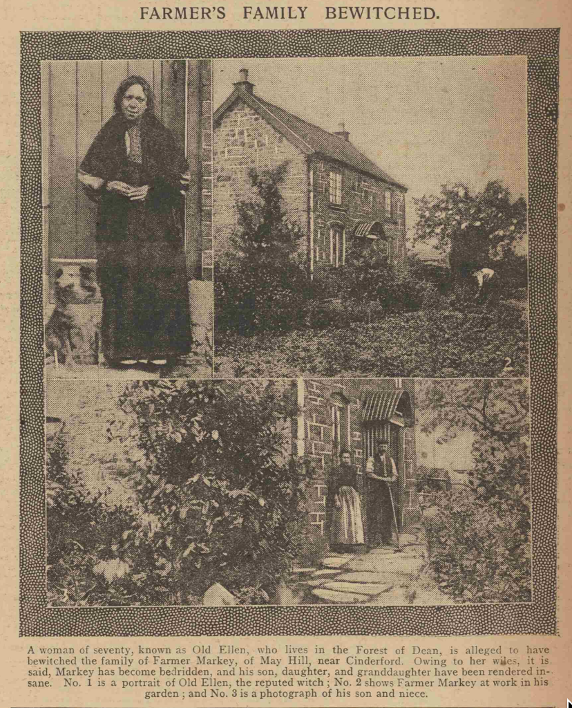

# Ross on Wye

From Tim:

https://en.wikipedia.org/wiki/A_Beast_With_Two_Backs Dennis Potter

https://en.wikipedia.org/wiki/Lord_Saltoun_and_Auchanachie cf old Maid's walk
https://mainlynorfolk.info/nic.jones/songs/annachiegordon.html

---

## Who Killed the Bears?

https://britishnewspaperarchive.co.uk/viewer/bl/0000325/18890430/014/0003
Gloucester Citizen - Tuesday 30 April 1889

FIGHT WITH BEARS IN THE FOREST OF DEAN.

TWO FRENCHMEN BEATEN.

A Forest of Dean correspondent sends the following extraordinary story:— A very remarkable affair has occurred in Dean Forest, in which four Frenchmen were subjected to rough treatment at the hands of the colliers and others living in the neighbourhood of Ruardean Hill, near Cinderford. Two Russian bears which the foreigners had with them were killed. It appears that the Frenchmen arrived on Friday morning at Cinderford. They were accompanied by two Russian bears of ordinary size. The animals were muzzled, and each was in charge of two keepers. They exhibited about the town till about three o'clock the afternoon, and then took the road for Nailbridge *en route* for Drybrook, Ruardean, and Lydbrook. The party was followed out of the town by many small children. Somewhere in the neighbourhood of Nailbridge the report was started that a child had been killed at Cinderford, and a woman very much hurt, at the same time and place, by the bears. The report, it seems, was a pure fabrication, but the poor Frenchmen and their quadrupeds who had been objects of interest at once received the attention of a hostile mob. Without inquiring as to the truth of the story, scores of young fellows and boys who had collected intimated their intention to despatch the brutes. To this end stakes were torn up, garden clothes props, stones, brick bats, and other weapons, were used to attack the bears. Their keepers, unable to speak a word of English, went down on their knees and in great distress implored, by gestures, to be left alone. Their entreaties ware in vain, and several times the men were struck either with sticks or stones, and one received a serious blow in the neck with a half brick. In this way a couplo of miles were traversed, and at six o'clock was estimated that a mob of 200 persons had collected. The bears became very excited and in the middle of the road within sight of Ruardean the smaller of the two beasts was killed outright by a heavy pole which someone levelled at its head. Two of the Frenchmen escaped into a wood, and they have not been seen nor heard of since. The other two, worn out with fatigue and fright, sank to the ground, thus letting the second animal free. The beast jogged on as fast as it could, but was again captured and was shot dead. Some persons who took pity on the strangers invited them into their houses and gave them shelter. The neighbourhood continued in a most excited state for some time. Much sympathy is expressed for the strangers, who have lost their means of livelihood.

We are informed that the French Vice-Consul in Gloucester (Mr. J. B. Karn) has received a communication from Mr. M. F. Carter, of Newnham, stating that proceedings will be taken against some of the men alleged to have been concerned in the affray; that the aagistrates have power to make a grant of £10 compensation for the loss of the bears, and suggesting that the Frenchmen do not speak English Mr. Karn had better attend at Littledean Police-court when the cases came on, as interpreter, or make proper arrangements. The French Consul at Cardiff communicated with Mr. Karn this morning by telegram requesting that he would take what steps might be deemed advisable for asserting the rights of the Frenchmen concerned. The two men who escaped into the woods have arrived at Cardiff. The matter is considered of such importance that Mr. Karn this afternoon proceeded to the Forest to make inquiries on the spot, preparatory to taking what action may be considered necessary.

https://britishnewspaperarchive.co.uk/viewer/bl/0000325/18890502/025/0004
Gloucester Citizen - Thursday 02 May 1889

THE OUTRAGE ON FRENCHMEN IN THE FOREST OF DEAN. 

Late last night Super intends Ford and a number of extra policemen succeeded in arresting George Wilkes, Robert Wilkes, William Williams, William Baldwin, Ernest Cinderby, Henry Baldwin, George Rawlins, Joseph Hopkins, Thomas Meek, Isaac Baldwin, Joseph Hardwick, Sidney Rawlins, George Tippins, and Arthur Golding, colliers and labourers of Ruardean neighbourhood, on the charge of unlawfully and maliciously killing two bears, contrary to the statute, being the property of four Frenchmen, who it is stated belong to the Pyrenees district. The prisoners are lodged in Littledean lock-up. In a second warrant the prisoners are charged with assaulting these men. The arrests, which were affected quietly, was unexpected, but that course was in deference to the justces' wishes in the district. The two men who escaped to Cardiff arrived at Newnham to-day at noon. Mr. George Ealing, French Consul General, Cardiff, will probably attend Littledean to-morrow to conduct the prosecution. The feeling in the Forest is relieved now that so many arrests have been made.

https://britishnewspaperarchive.co.uk/viewer/bl/0000325/18890504/015/0003
Gloucester Citizen - Saturday 04 May 1889

THE OUTRAGE ON FRENCHMEN IN DEAN FOREST.

POLICE COURT PROCEEDINNGS

The conduct of an enraged but cowardly mob at Ruardean, by which two dancing bears were slain and two Frenchmen were badly beaten, as reported in another column, was made the subject of a searching magisterial inquiry at Littledean Police-court yesterday. The magistrates present on the Bench were Messrs. R. J. Kerr, M. W. Colchester-Wemyss, A. Thomas, and A. Bright. George Wilkes, Robert Wilkes, William Baldwin, Ernest Cinderby, Henry Baldwin, George Rollins, Joseph Hopkins, Thomas Meek, Isaac Baldwin, Joseph Hardwick, Sidney Rollins, George Tippins, and Arthur Golding, colliers and labourers of Ruardean neighbourhood, were charged with that they, on the 26th of April in the township of East Dean, in the parish of Ruardean, did unlawfully and maliciously kill two bears, the property of Gabriel Qugant Yas, Gabriel Balent Huguet, Thomas Biernés Sirgant, and Alfred Gerand ; with having at the same time and place unlawfully assaulted and beaten the four French subjects, and with illtreating and torturing the two bears at tbe same time and place. The ages of the men charged varied from 15 to 49. The prosecution was conducted by Mr. M. F. Carter, magistrates' clerk. The interests of the Frenchmen were watched by Mr. W. Langley-Smith, instructed by Mr. J. B. Karn, French Consul at Gloucester. Mr. F. F. Goold, barrister, instructed by Mr. Bradstock, defended George Wilks, Robert Wilks, Ernest Cinderby, Thomas Meek, William Baldwin, and George Tippins; and Mr. Whatley defended George Rollings, Isaac Baldwin, Arthur Golding, Joseph Hopkins, and Sydney Rollings.

William Henry Leach, of Gloucester, acted as interpreter. The greatest interest was manifested in the proceedings. A large crowd collected outside the Courthouse Yard long before time at which the Court is opened, but none but witnesses and persons having other business were admitted.

Mr. M. W. Colchester-Wemyss said that he had written a letter to the newspapers regarding the case only last night—if he had not, the object with which he had written would have been delayed for a week—and therefore he would retire from the Bench. Mr. Goold and Mr. Whatley said they would have no objection to Mr. Wemyss adjudicating, but the Chairman thought it better for him not to do so. He therefore retired.

The case of assaulting the men was first taken. Gabriel Balent Huguet, a native the south of France, said that he was with three other Frenchmen and two performing bears, working Cinderford, and when leaving on the day in question many children followed them. At the bottom of the town some men joined tbe crowd. They came behind them saying something which they could not understand, and throwing stones at them. Witness recognised Wilkes, sen., being one who was there throwing stones, and hitting him with short sticks. Over 40 men were there. He could not recognise any others for they had black faces and different clothes on. They were continually beaten, and witness could not tell when the children left. Witness was hit with a stone in the back and with a stick in the side, and was twice knocked down and kicked. He at last became unconscious. He could not say whereabouts he was left, for there were no houses. He could not say what public-houses they were near when they were commenced to be beaten. (P.C. White here stated that they were the Old Inn and the Engine.)— Cross-examined by Mr. Goold: It was about seven or half-past when he saw the prisoner Wilkes. Wilkes came out of a house on the roadside, but witness could not say whether it was a private or a public-house. The first blow that he received was from a stone on the back of the head, and he could not recognise anyone. Wilkes was the man who hit him with the stick. When he was fust knocked down he did not lose his memory.— By Mr. Whatley: The occurrence took place some time after six o'clock. They were then within sight of the public-houses.

Gabriel Qugant Yas was examined, and said that he was with the last witness and remembered about forty men following them after leaving the town. They threw stones and then beat them with sticks. Witness was not knocked down. He recognised Wilkes. Tha assaults of the crowd continued right up where the second bear was let go (Ruardean). By Mr. Goold: Wilkes motioned them to get along the road as there was a crowd with them. His pole was taken from him, and he had not seen it since. Witness was not the one who picked up the last witness.

Thomas Biernès Sirgant estimated the crowd at about 30. While they were in the town the people were very civil to them, but just before they got into the other village they commenced to attack them. He was not touched, for he was one of those who got away. Witness was present when his bear was killed. He recognised Wilkes.

Alfred Gerand estimated the number of people present about 35 or 40. He saw his partner (the first witness) felled with a stone, and he picked him up. Huguet was knocked down a second time. Witness got away to Cardiff, stopping in the wood all night. The first man to commence the attack was Wilkes. When Huguet was felled, he said, "Leave me here, and save your own life."

James Barnett, Nailbridge, Milsom Symonds, a lad, Benjamin Kirkhouse, Ruardean, Henry Vick, the Morse, Arthur Vick, Arthur John Brain, Mark Westaway, and Henry Jones also gave evidence describing the brutal attack upon the men and their bears. Clothes-props, sticks, and stones were used.

This concluded the evidence for the prosecution and Mr. Goold, in addressing the bench for the defence, submitted that because any one of tbe prisoners was in a crowd which assaulted the Frenchmen was no evidence against them. He also asked them to take into consideration that the men were apprehended on this charge, and had not had a chance of collecting evidence on their behalf. He proceeded to review the evidence against each of his clients.

Mr. Whatley having endorsed Mr. Goold's remarks as to the regretability of the occurrence, proceeded to defend his clients.

The Chairman said that as far as the present charge was concerned, George Rollings, Golding, Hopkins, Henry Baldwin, and Hardwick would be discharged. The next case was then proceeded with. Milsom Symonds repeated his evidence. He identified several of the prisoners as being present in the crowd. George and Robert Wilkes and Henry Baldwin struck one of the bears with sticks across the head, ribs, and back. Farther along he saw William Williams and Henry Baldwin strike the bears. He saw Henry Baldwin throw stones on to the back of one of the bears when it was on the ground. He could not say who killed the bear, there were so many beating it. Considerable corroborative evidence was given. Gabriel Huguet said he and his partners bought the larger bear when about four or five months old, giving 850 francs (£32 10s.) for Thomas Sirgant said he gave 1000 francs (£4O) for the other bear. The bear had been about four months in training.

The Chairman said there was evidence against Thomas Meek, Tippins, Sidney Rollings, and Hardwick, in this case.

The magistrates retired for some considerable time, and delivering judgment the Chairman said they had taken some time to consider their decision, not because they had any doubt as to the assault having been committed, but to whether they should give prisoners the option of a fine. They had determined after considerable doubt to give them the option paying a fine, but they would make it a very heavy fine, and it would have to be paid on the spot. The case was a most disgraceful one fact the most disgraceful that had come before him on the bench. These Frenchmen were going harmlessly about the country, and had been attacked by a mob of people on a cry which had no foundation whatever. They considered George Wilkes be the worst offender, and next to him Tippins, Cinderby and Thomas Meek. For the assault G. Wilkes, Cinderby, Tippins and Meek would be fined £5 each, and in default month's imprisonment; and Robert Wilkes, Henry Baldwin, and Sidney Rollings 10s. each, or seven days. For killing and attacking the bears George Wilkea was fined and £30 damages, or a month, Cinderby £1 and £5 damages, or a month, and Robert Wilkes, Henry Baldwin, George Rollings, Joseph Hopkins, Isaac Baldwin, and Arthur Goulding £1 and £5 damages each, or days, costs to follow in each case. Hardwick and William Baldwin were discharged.

Mr. J. B. Karn, addressing the bench, said he had been desired by the Frenchmen to thank Mr. Carter for the very able, efficient, and courteous way in which had looked after their interests.

The fines and damages together amounted to £84 10s., and in nearly every case the money was paid.

Mr. J. B. Karn informed our representative yesterday that far from its being the intention of Mons. Jacquemin, French Consul General at Cardiff, to conduct the case himself, he had written to him (Mr. Karn) thanking him for the trouble had taken in the matter, and leaving the case entirely in his hands. The Frenchmen, and particularly the old man, have not yet fully recovered from the attack, and have appeared very anxious to make the best of their way back to their native land. They were last night sent to Cardiff by Mr. Karn, and they will be sent thence at the earliest opportunity by Mons. Jacquemin. The subscription list opened in South Wales amounts at present to £36.

Mr. Colchester-Wemyss writes from Westbury Court, under Thursday's date:— Many of your readers will have heard of the most barbarous assault upon four innocent Frenchmen, and their two equally innooent four-footed companions last Friday the Forest of Dean. As I shall be one of the magistrates who will have to try the Friday, it is obvious I can do no more than mention the occurrence, and simply express on behalf of at least 99 out of every 100 my neighbours our utter abhorrence of what has transpired. I have, however, been requested in several quarters to endeavour to offer to these poor foreigners, and through them to the friendly nation to which they belong, some more tangible expression of public sympathy than mere words. I propose therefore to open a subscription list on their behalf, and shall be most happy to receive any contributions myself, or they may be paid to an account which will be opened for this purpose with The Capital and Counties Bank at Newnham. I would add that it is not so desirable that tbe individual subscriptions should be of a considerable amount, as that the number of subscribers should be large. This would furnish practical assurance to our neighbours cross the Channel, that, although the event has cast a stain upon the fair name of our county, it is repudiated bv all in every class whose opinion is worth anything. I shall feel greatly obliged by your insertion of this letter in your next issue. Receipt of subscriptions will be acknowledged by public advertisement.

Gertrude Sey, a member of tbe Band of Mercy, of 19, Porchester-square, Hyde Part, London, writes expressing the shame and grief which she felt reading of the conduct of the Foresters and saying that never before was she glad that she escaped by a narrow space from being born a Forester. She concludes: " Are those foreigners to go home and say that they visited a part of England where the men are worse than the beasts of their own land—that they were stoned and ruined in the Forest of Dean? Surely there should for the honoiur of the Forest (if such a thing remains) be a subscription to refund the men for their loss."

https://britishnewspaperarchive.co.uk/viewer/bl/0000532/18890504/085/0008
Gloucester Journal - Saturday 04 May 1889

THE OUTRAGE ON FRENCHMEN DEAN FORIST.

POLICE COURT PROCEEDINGS.

The cooduct of an enraged but cowardly mob ar Ruardean, by which two dancing bears were slain and two Frenchmen were badly beaten, as reported in another column, was made the subject of a searching magisterial inquiry at Littledean Police-court yesterday. The magistrates present were Messrs. R. J. Kerr, M. W. Colchester-Wemyss, A. Thomas, and A. Bright. George Wilkes, RobertW ilkes, William Williama, William Baldwin, Ernest Cinderby, Henry Baldwin, George Rollins, Joseph Hopkins, Thomaa Meek, Isaac Baldwin, Joseph Hardwick, Sidney Rollins, George Tippins, and Arthur Golding, colliers aad labourers of Ruardean neighbourhood, were charged with that they, on the 26th of April in the township of East Dean, in the parish of Ruardean, did unlawfully and maliciously kill two bears, the property of Gabriel Qugant Zas, Gabriel Balent Hugnet, Thomas Biernés Sirgant, aad Alfred Gerand; with having at the same time and place unlawfully assaulted and beaten the four subjects, and with ill treating and torturing the two bears at the same time and place. The ages of the men charged varied from 15 to 49. The prosecution was conducted by Mr. M. F. Carter, magistrates' clerk. The interests of the Frenchmen were watched by Mr. W. Langley-Smith, instructed by Mr. J. B. Kara, French Consul at Gloucester. Mr. F. F. Goold, barrister, instructed by Mr. Bradstock, defended George Wilks, Robert Wilks, Ernest Cinderby, Thomas Meek, William Baldwin, and George Tippins; and Mr. Whatley defended George Rollings, Isaac Baldwin, Arthur Golding, Joseph Hopkins, aad Sydney Rollings.

William Henry Leach, of Glouceeter, acted interpreter. The greatest interest was manifested in the proceedings. A large crowd collected outside the Courthouse Yard long before the time at which the Court is opened, but none but witnesses and persons having other business were admitted.

Mr. M W. Colchester-Wemyss said that he bad written a letter to the newspapers regarding the case only last night— if he had not, the object with which h had written would have been delayed for a week—and therefore he would retire from the Bench. Mr. Goold and Mr. Whatley said they would hare no objection to Mr. Wemyss adjudicating, but the Chairman thought it better for him not to do so. He therefore retired.

The case of assaulting the men was first taken. Gabriel Balent Huguet, a native of the south of France, said that he was with three other Frenchmen and two performing bears, working Cinderford, and when leaving on the day in question many children followed them. At the bottom of the town some men joined the crowd. They came behind them saying something which they oould not understand, and throwing stones at them. Witness recognised Wilkes, sen., as being one who was there throwing stones, and hitting him with short sticks. Over 40 men were there. He could not reoogniae any others for they had black faces and different clothes on. They were continually beaten, and witness oould not tell when the children left. Witness was hit with a stone in the back and with a stick in the side, and was twice knocked down and kicked. He at last became unconscious. He could not say whereabouts he was left, for there were no houses. He could not say what publio-houses they were near when they were commenced to be beaten. (P.C. White here stated that they were the Old Inn and the Engine.)— Cross-examined by Mr. Goold: It was about seven or half-past when he saw the prisoner Wilkes. Wilkea came out of a house on the roadside, but witness could not say whether it was a private or a public-bouse. The first blow that he received was from a stone on the back of the head, and he could not recognise anyone. Wilkes was the man who hit him with the stick. When he was first knocked down he did not lose his memory.— By Mr. Whatley: The occurrence took place some time after six o'clock. They were then within sight of the public-houses.

Gabriel Qugant Yas waa examined, and said that he was with the last witness and remembered about forty men following them after leaving the town. They threw stones and then beat them with sticks. Witness was not knocked down. He recognised Wilkes. The assaults of the crowd continued right up to when the second bear was let go (Ruardean). By Mr. Goold: Wilkes motioned them to get along the road as there was a crowd with them. His pole was taken from him, and he had not seen it since. Witness was not the one who picked up the last witness.

Thomas Biernès Sirgant estimated the crowd at about 30. While they were in the town the people were very civil to them, but just before they got into the other village they commenced to attack them. He was not touched, for he was one of those who got away. Witness was present when his bear was killed. He recognised Wilkes.

Alfred Grand estimated the number of people present about 30 or 40. He saw his partner (the first witness) felled with a stone, and he picked him up. Huguet was knocked down a second time. Witness got away to Cardiff, stopping in the wood all night. The first man to commence the attack waa Wilkes. When Huguet waa felled, aaid, "Leave me here, and aave your own life." 

[This report will be ooncluded in our second edition.]

Mr. Colchester-Wemyss writes from Westbury Court, under Thursday's date:— Many of your readers will have heard of the moat barbarous assault upon four innocent Frenchmen, and their two equally innocent four-footed companions last Friday in the Forest of Dean. As I shall be one of the magistrates who will have to try the case Friday, it is obvious I can do no mora than mention the occurrence, and simply express on behalf of at least 99 out every 100 of my neighbours our utter abhorrence at what has transpired. I have, however, been requested in several quarters to endeavour to offer to these poor foreigners, and through them to the friendly nation to which they belong, some more tangible expression of public sympathy than mere words. I propose therefore to open a subscription list on tbeir behalf, and shall be most happy to receive any contributions myself, or they may be paid to an account which will be opened for this purpose with The Capital and Counties Bank at Newnham. I would add that it is not desirable that the individual subscriptions should be of a considerable amount, as that the number of subscribers should be large. This would furnish practical assurance to our neighbours across the Channel, that, although the event has cast a stain upon the fair name of our county, it is repudiated by all in every class whose opinion is worth anything. I shall feel greatly obliged by your insertion of this letter in your next issue. Receipt of subscriptions will be acknowledged by public advertisement.

Another correspondent writes:—The outrage on the bears in the Forest is but the revival of a latent superstition that the bears of itinerant exhibitors are fed upon the flesh of young children clandestinely obtained. The writer never sees a dancing bear in the streets without associating it with the tales which were told him in his youth by ignorant nursemaids and peasants.

https://britishnewspaperarchive.co.uk/viewer/bl/0000325/18890504/010/0003
Gloucester Citizen - Saturday 04 May 1889

The Forest of Dean has obtained anything but a pleasant notoriety during the past week. No matter from what cause the attack upon the itinerant Frenchmen and their two bears arose, whether from the rumour said to be circulated that one of the bears had killed a child, or from a latent superstition in connection with such animals, it was not the correct thing for a large mob to pursue the strangers, and so shamefully beat them with sticks and injure them with atones that the bears were killed and their keepers almost despaired of life. Had not the matter been taken up with commendable promptitude and delicate negociations in connection with the un-English assault been conducted with despatch and diplomatically, the Foresters' action might have had consequences of a much more serious nature than the proceedings at the Littledean Police Court yesterday. We have only to imagine four of our countrymen treated in a similar manner in a French village to realise the feelings experienced by our neighbours on reading of the assault. But all's well that ends well; and another equally trite if equally stale proverb is that which says that the least said is the soonest mended. We certainly are interested in letting the matter drop now that justice has been done. But even a case in which so much is unsatisfactory has one bright and pleasant gleam. One of the poor fellows, beaten and terrified as he lay, as he thought, dying, begged his fellow traveller not to think of him but to save his own life. This was true heroism.

https://britishnewspaperarchive.co.uk/viewer/bl/0000393/18890504/042/0005
Gloucestershire Chronicle - Saturday 04 May 1889

FOREST OF DEAN DISTRICT.

COWARDLY ATTACK ON FRENCHMEN.

An extraordinary outrage is reported having been committed on Friday. Four Frenchmen, accomnanied by couple of performing bears, visited Cinderford on that day. The bears were muzzled, and each was in charge of two keepers. In the afternoon they left for Drybrook, Ruardean, and Lydbrook. In the neighbourhood of Nailbridge a report was started that a child had been killed at Cinderford, and a woman very much hurt, by the bears. The report was a fabrication, but the poor Frenchmen and their companions, who had been objects of interest, were at once attacked by a mob. Scores of young fellows and boys armed themselves with stakes, clothes props, stones, brickbats, and other weapons, to attack the bears. Their keepers, unable to speak a word of English, went on their knees and in great distress implored, by gestures, to be left alone. Their entreaties were in vain, and several times the men were struck either with sticks or stones, and one of them received a serious blow in the neck with a brick. In this way couple of miles were traversed, and at six o’clock it was estimated that a mob of 200 persons bad collected. The bears became very excited, and in the road within sight of Ruardean the smaller of the two beasts was killed by a heavy pole which someone levelled at its head. Two of the Frenchmen escaped into a wood, and found their way to Cardiff, and communicated with the Consul. The other two, worn out with fatigue and fright, sank to the ground, letting ihe second bear free. The beast jogged on as fast as it could, but was again captured and was shot dead. Some persons who took pity on the strangers invited them into their houses and gave them shelter. Much sympathy was expressed for the strangers, who have lost their means of livelihood.

Early in the week Mr. Maurice Carter, magistrates' clerk, informed Mr. J. B. Karn, French Consul at Gloucester, that proceedings will be taken against some of the men alleged to have been concerned in the affray: that ihe magistrates have power to make a grant of £10 compensation for the loss of the bears; and suggesting that, as the Frenchmen do not speak English, Mr. Karnhad better attend at Littledean petty session, as interpreter, or make proper arrangements. Mr. Karn went to the Forest make enquiries, preparatory to taking snch action in the affair as he might deem advisible. A subscription has been started at Cardiff for the unfortunate Frenchmen.

This affair with the bears in the Forest reminds us of some adventures which have occurred with French bruins in Gloucester. Over thirty years ago there stood on the site of the present Wellington Hall a public-house called the New Bear Inn, which had attached to it lock-up stables. One night a travelling Frenchman stabled his dancing bear at this appropriately-named place of call, and some of the *habitués* of the inn, which was kept by Mr. Cobb, seized tbe opportunity of playing a practical joke (and it might have been a fatal one) on a small tradesman who went by the cognomen of "Rush". "Rush"  had a penchant for rabbits or anything in the "fur" line, and a suggestion to him that be might easily annex Mr. Cobb's rabbits required no pressing on him. After dark "Rush" proceeded to the stable in which he fondly imagined the "bunnies" were hutched, and on drawing tbe staple from the door and opening it he was startled to find himself "planted" in the tight embraces of the Frenchman’s bear, who resented this nocturnal intrusion by an utter stranger. The cries and shrieks of "Rush" brought speedy assistance from the "New Bear", and he was rescued more dead than alive from the clutches of the "old 'un." He was very sore whenever a bear was mentioned afterwards. Some dozen years ago we ourselves remember having seen a Frenchman in a blue blouse and a bear baled before the magistrates charged with creating an obstruction in the public streets. Restless "Bruin" could not resist showing off some of his antics to the bench, but he was not punished for contempt of court, for he and his frightened master, whose *patois* was difficult to comprehend, were let off on the promise of the latter to make himself and his zoological charge scarce in Gloucester.

PROCEEDINGS BEFORE THE MAGISTRATES.

At the Littledean petty session yesterday (before Russell J. Kerr, M. W. Colchester-Wemyss, A. Thomas, and A. Bright, Esqrs.), Geo. and B. Wilks, W. Williams, Isaac and H. Baldwin, E. Cindery, G. Rawlins, J. Hopkins, T. Meek, Jos. Hardwick, Sydney Hawkins, Geo. Tippins, and Arthur Golding, were charged in custody with killing two bears, the property of Gabriel Dogault Tas, Gabriel Bulint, Sirgaut Thomas, and Gerald Alfred, Frenchmen, on 26th April, and assaulting the persons named. Mr. Langley Smith appeared for complainants, and the prisoners were defended by Mr. F. Goold, of the Oxford Circuit, and Mr. Whatley. Mr. Leach, Gloucester, acted as interpreter. Mr. Colchester-Wemyss intimated that in consequence of a letter he had addressed to the newspapers he should not adjudicate in the case. The prisoners elected to have the case disposed of by tbe bench. Dugault deposed that at Cinderford they were performing with bears, and some children followed. Later a number of men came up and began throwing stones. George Wilks hit him with stick on his side and head. The attack went on, and they went on as quick as possible. Twice he was knocked down and kicked, and left where he lay insensible. Some one took him into a bouse. Cross-examined: Wilks was foremost, and once hit him with stick. The other complainants stated that about 40 men were after them, and forced them along. The pole they had was taken from them. One of them said he saw his partner knocked down, and picked him up. When he got to the wood he remained there all night.

Several other witnesses were examined; and then the charge of cruelty to the bears was gone into. The prisoners were convicted. George Wilks, Cindery, Tippins, and T. Meek were each fined £5, in default a month's hard labour; Robert Wilks, H. Baldwin, and Sawlins were each fined 10s. or seven days. The others were discharged. For the injury to the bears Wilks was fined £1, and damage, in default a month’s hard labour; Cindery and Rawlins, £1 and £5 damage, or a  month; Wilks, H. Baldwin, Hopkins, J. Baldwin, and A. Golding £1, £5 damage, or 14 days. The others to pay all costs before being discharged.

https://britishnewspaperarchive.co.uk/viewer/bl/0000377/18890504/059/0004
Hartlepool Northern Daily Mail - Saturday 04 May 1889

DEAN FOREST BEAR HUNT. At Forest of Dean, yesterday, fourteen men were charged with seriously assaulting four Frenchmen, who were travelling the country with two performing bears, also with maliciously killing tli« animals. The leader of the crowd, which numbered about a hundred, ww fine! for the assault, and fined £1 with £20 do. ages for killing the bears. The other de endants were fined from £5 downwards. 

---
https://britishnewspaperarchive.co.uk/viewer/bl/0000919/18890503/038/0002
South Wales Daily News - Friday 03 May 1889

THE FOREST OF DEAN INCIDENT.

WHOLESALE ARRESTS.

The Forest of Dean bear fight is regarded in serious a light that warrants were granted to the police against the following PERSONS:—George Wilks, Robert Wilks, William Williama, William Baldwin, Earnest Cinderley, Henry Baldwin, George Rawlins, Joseph Hopkins, Thomas Meek, Isaac Baldwin, Joseph Hardwick, Sidney Rawlins, George Tippins, and Arthur Golding. These men all live in one locality, and are mostly colliers. They were apprehended at night, and at nearly the same time, and in so quiet a manner that only a few outsiders kuew what was taking place. They were taken to Littledean lock-up. The charge against the prisoners is that on the evening of tbe 26th April they then did unlawfully and maliciously kill certain animals, to wit, two boars, the same being animals ordinarily kept in confinement, contrary to the statute, and being the property of Gabriei Quagauet, James Gabriel BaluiJ, Twjigant Thomas, and Geraut Alfred, Frenchmen, said to belong to the Pyrenees district. In a second charge the prisoners are proceeded againrt for assaulting the Frenchmen. The two last named persons, who managed to escape to Cardiff, returned to the Forest, having arrived at Newnham station at noon on Thursday, The Consul-General at Cardiff and Mr Karn, vice- consul, Gloucester, are arranging that the foreigners shall be properly represented at Littledean to-day (Friday).

https://britishnewspaperarchive.co.uk/viewer/bl/0003328/18890511/072/0004
Bristol Observer - Saturday 11 May 1889

THE BEAR KILLING EPISODE IN DEAN FOREST.

At the petty sessional court at Littledean, yesterday, William Williams surrendered to his bail on the charge of assaulting the four Frenchmen, and further with cruelly illtreating their two bears. The circumstances of the case as regards the several defendants fined last week have been reported. Evidence having been led in the case of Williams, the bench dismissed the charge of injuring the bears, and fined the prisoner 10s and costs for assaulting the Frenchmen.

https://britishnewspaperarchive.co.uk/viewer/bl/0000325/18890511/013/0003
Gloucester Citizen - Saturday 11 May 1889

THE ATTACK ON FRENCHMEN IN THE FOREST.

At the Little dean Petty Seaaions yesterday, William Williams, collier, of Nailbridge, a warrant for whom was out last week for his arrest in connection with the assault on the four Frenchmen and bears near Cinderford, surrendered to his bail charged with assaulting Gabriel Qugant Yas, Gabriel Baluit Huguat, Thomas Sirgant, and Alfred Gerand, and with assaulting and killing their bears at Ruardean on the 26th ult.

Mr. Whatley appeared to defend the prisoner. As before, the case of the assault on the men was taken first.

Milsom Simmonds, labourer, of Morse Lane, repeated the evidence he gave last week, which was to the effect that he saw the four Frenchmen and two bears in the Morse-road and a mob following, throwing stones. At Ruardean, where there were a couple of hundred people, Williams struck at one of the bears with clothes-prop, which he obtained at Mark Knight's, and in doing so struck one of the men over the shoulder. Witness had known Williams five or six years. Cross-examined: Witness saw the occurrence from the top of a wall opposite Williams' house. He saw Williams on Thursday and said "If you say you caught hold of my arm to prevent my throwing stones I shall say you struck one of the men with a pole." Although Mr. Whatley had a witness to swear to the contrary, he (Simmonds) would swear that he did not throw stones, and that Williams did not catch hold of him. Williams did not tell him not to throw stones. He said something to him, but he did not know what he said. Mr. Whatley: If you know that he did not tell you to fling stones, what did he say? Witness, in answer, now said that Williams did not speak to him. He did not see Kirkhouse and Williams holding the gate to keep the people back from getting into Knight's. Further pressed, witnets said that he saw Kirkhouse holding the gate two or three moments after the blow was struck. Simmonds, examined with regard to the second case, said the little bear was killed near the Pike at Ruardean. Witness saw Williams strike the bear with a short stick, and and *(sic)* others threw stones on to his back. The bear only survived about ten minutes after this. By Mr. Whatley: Witness did not strike the bear, but he had a stick. He did not throw a stone.

Henry Vick deposed to seeing the bear killed. Williams was present, but he did not see him strike it. Witness made a statement to the police. He saw Williams leading the bigger bear with the chain, and he saw him deliver the bear to the mob. The statement produced was the one which he made to the police. This statement was to the effect that William Williams (and others) were using sticks at the time the bear died. Cross-examined: When he saw Williams father he told him that Williams only led the bear with the chain. Before the bear was shot at by Bond Williams had let go of it.—P.C. White said he had a warrant for the arrest of Williams at the same time as the others. He went to his home to arrest him at twelve o'clock at night, but could not find him. Williams gave himself up at the police-station on Tuesday. He knew Williams as a very respectable man. Witness met him on the night of the assault, and Williams then said that he had had nothing to do with it.

Mr. Whatley asked if the Bench thought it was sufficient evidence to convict. He had several witnesses to call.

The magistrates decided to hear them. Mr. Whatley explained that why prisoner did not give himself up was because he thought the time was too short for him to get sufficient evidence to clear himself. He gave himself up directly he advised him.

Benjamin Kirkhouse, for the defence, said he saw Williams at Knight's. Witness arrived there before him. The bear was struck there, but not by Williams. Witness had not known Williams before the 26th of April. He knew nothing about the killing of the second bear.

Joseph Kent said that when the Frenchman was knocked down Williams went to assist him. Witness saw Williams far as Mark Knight's, and during that time he did not see Williams do anything. He did not see Williams while the men and the bears were in at Knigjht's. Bond wanted to shoot the bear while Williams had hold of him, but the latter said "No, let us take him back up." Cross-examined: Williams had said "Let us take it back to the White Hart and deliver it to the Frenchman." He did nothing prevent the bear being killed.

Arthur Vick corroborated as to Williams's action with regard to the second bear. Williams did his best to prevent the bear being killed, but the mob would not let him take it back.

Mr. Whatley read from P. C. White's book a statement made by witness which corroborated this.

Thomas Cooksey, a fireman, of Nailbridge, said that when the old Frenchman was knocked down Williams said "Let him alone; let them go on." Later on Williams tried to prevent the crowd throwing stones. He saw Williams talk to Mr. Charlton, and the latter tried to prevent the mob following the Frenchmen. Witness saw Simmonds throwing stones and Williams tried to prevent him. This witness also corroborated as to the action taken by Williams in bringing the second bear back. Cross-examined: Witness was present from to end of the occurrence but could not say who beat the besr. On Mr. Carter mentioning some names witness said he saw Robert Wilkes strike the bear.

Defendant was fined 10s. and costs, or fourteen days' for assaulting the Frenchmen, and the other case was dismissed.

The parish of Rudford has followed the good example set by Tibberton, and the sum of £1 has been subscribed "for the poor Frenchmen who were so shamefully treated in the Forest." A cheque for the amount mentioned has been sent to the French Vice-Consul in Gloucest (Mr. J. B. Karn) by the rector of the parish, the Rev, J. K. Washbourn.

https://britishnewspaperarchive.co.uk/viewer/bl/0000393/18890511/051/0005
Gloucestershire Chronicle - Saturday 11 May 1889

FOREST OF DEAN DISTRICT.

Littledean Petty Session, Yesterday.—Before Sir T. H. Crawley Boevey, Bart., and Rnssell J. Kerr and A. W. Bright, Esqrs.)— ... William Williams was charged with assault and cruelty in connection with the recent attack on four Frenchmen and their two bears. Mr. Whatley appeared for the prisoner. Evidence of the attack on the Frenchmen and their bears was given, Williams being among those who followed the men, but it was contended that he was not one of those who struck one of the bears with a stick. The charge against him of injuring the bears was dismissed, but he was fined 10s. for assaulting the Frenchmen.

https://britishnewspaperarchive.co.uk/viewer/BL/0000393/18890525/035/0004
Gloucestershire Chronicle - Saturday 25 May 1889

The Assault on Frenchmen.— Mr. M. W. Colchester-Wemyss has sent to Mr. James B. Karn, vice-consul for France at Gloucester, a cheque for £34 6s. 2d., being the amount which he has received in response to his appeal for the Frenchmen who received such grievous treatment in the Forest of Dean. Mr. Colchester-Wemyss, in his letter to Mr. Karn, says:—"If you forward the cheque to the Consul-General, perhaps you will send with it the enclosed letter (in French). If, however, yon transmit the money direct to the men, will you please assure them, on the part of the subscribers, that the feeling towards them has been one of the heartiest commiseration, and they sincerely hope that the great expression of sympathy which has been evoked may afford them some consolation for the outrage of which they were the innocent victims."

https://britishnewspaperarchive.co.uk/viewer/bl/0000532/18890525/070/0008
Gloucester Journal - Saturday 25 May 1889

TO DO 
THE RECENT OUTRAGE ON FRENCHMEN IN THE FOREST OF DEAN.

It will be remembered that Mr. Colchester-Wemyss a week or two ago wrote to the local press inviting subscriptions on behalf of the four Frenchmen who were beaten in the Forest of Dean, and whose performing bears were killed. It will be seen below that upwards of £36 has been subscribed. A cheque for this amount was forwarded by Mr. Colchester-Wemyss to Mr. J. B. Karn, French Vice-Consul at Gloucester, and a letter to the French Consul-General. The letter to the latter was follows, and we subjoin the reply Westbury Court, Newnham. 20.5.89. Monsieur,—Je too* prie d'svoir la vonte d'accepter, au Bern d'un grand nombre d'habitants de Gloucester, le cheque que vous trouverex dans oe pli, et d'en remettre le produit vos malheureux com trio tea qui ont snbi derailment dans la de Dean trait* ment dee plus d^ploralles. Veuilkx nasi, Monsieur, lee assurer qu'il nfest pas Domme de «n ce comt4, et je puis ajouter en toute notre vicelle qui vonlut leur offrir un de sympathie avec l'expreesion d'un vif regret qu'un tel ait pu se produire milieu de nous. vous prie d'agi4er Monsieur, 1' assurance de consideration la plus diatingu£e. M. W. Colchester-Wemyss. A Monsieur Consul-General de la Republic Francaise. Consulst de France, Cardiff, Mai, 1889. Monsieur, Monsieur J. B. Karn vient de me faire parvenir le moutant d' une souscription ouverte par vos vous soins faveur dee 4 malheureox Francais, qui le 26 Avril dernier, victimee d' une agreesion icqnalifiable dans la Ford» de Dean. 11 m'a Cgalement transmit la lettre que deetinezet dans laquel'evcus m'exprimezd'tue fsfon si chaleureuse votre vive sympathie pour mes compatriots® lee sentiments de profonds regrets resnntis par tons lee habitants de la For£t nouvellee cette attendat. je m'empresse, dee lors. monsieur, de vous remercier bien sincerement, tant en mon nom personel qu'au de mes quatres nationaux pour lee nobles sentiments qui oat diet? votre lettre, et ont pousee ouvrir cette pouscription, ainsi que pour l'envoi £36 3s. receuillis a cette occasion gi&ce a votre bon intermediate. Veuillez monsieur meilleurs remerciments les assurances le ma consideration la plus distingu&. A. Jacqckmin, Consul General.

Subjoined is the subscription list: Sir J E Dorington, Bart, M.P. 10a, F Lucas 10s, Rev Thorpe 6d, Messrs Damsell 2s 6d, Earl of Dade £2, Rev C Guise 10s 6d, T Denton 10s, Rev V Amery 6d, Rev E Gullbanks 4a, Hiss Meldon 10s, Rev K Machen 10s, Rev J Bagot de la Bere 6d, Dr Ancrum £l, Col Dav.es ad, E Palmar «d, A Helps ss, Miss Bernard ss, C Bernard ss, E Lloyd Baker 2s ttd, Mis Lloyd Baker is 6d, Mrs Barwick Baker td, H O Baker Bd, J Sessions 10s, Rev H Williams ss, J E W Is, E M W Is, Biggs feed, T Nelson Foster ss, J Bretkerton £1 is (id, A Strickland £1 la, H Marshall 2a, Gee £l, H Taylor ss, A C Wheeler £1 Is, Mrs Barton Is, Miss Barton Is, B (.ladle 2a 6d, Mis Ley £2, Cine 10s, BoulUe 10s, Une Amie Is, petite Marie Is, Ureula la, Grannie 6d, May and Daisy Is, Jardinier ad, Chariot ttd, Maid of the Churn Is, La Duchssse Is, la, Celestine Is, Cloche Is, the Rev W. Barker !a Bd, T Brain ta ad, T Whatley ss, the Rev H Miles 2s, Dr Need ham £1 la. H Gwinnett £l, Macartney sa, Mrs Macartney 6s, Miss Hicks 2s ad, Miss G Hicks ss, Mrs Hill 7s ad, Miss Heron 2s Bd, Mrs Harvey (Rosa) ss, Miss Harvey Ss, Thomas Green ad, George Daves ad, Sarah Smith ad, Abla Gardiner Jane Snolt 3d, Mrs Lloyd £l, Llewellyn 2s, Indignant family of children lid, and Mrs Parkinson 2s, A.B.E.M. ad, Miss Ewens ss, Mr Cox 2s ttd, James Poaell la, H Grindon Is, B John Ackers £l, Mrs Clarke ss, Mr Land 3s, Colchester 10s, the Rev Peacock Is, 8 Dobhs Is Blrt Is, la, Humphreys Is, W Hart la, Drinkwater ad, J Green Od, E Ackerman ttd, Dobbins 3d, W Hyett 3d, E Ryland 3d, Marshall 3d, D Hyett 3d, X Parry 3d, W Hart 3d, H Ancil 3d, H Hatch 3d, D Cllsaold 3d, C Turner 3d, W Brown 3d, T Cadle 3d, J Blalney 3d, James Win tie 10a, J R Philpotts 2s, H Hinton 6s. B KeeUng £1 Is, Mrs Glmtlett 3s, (Miss Keeling ad, Miss M C KeeUng 2s ad, J Bennett 2sM, Monmouthshire friend 2s Bd, sympathiser 2s, Major Genl Cookes 10a, Mrs Vyner Williams 10s, Capt Hodgson ss, E J 2s, Major Geneial Hodges sa, Mis Hodges 2sad,alittleborad, Wilhelmad, Wherrett 2s, Mrs Wade Wait Bd, WH King ad, Mrs Parr 14s, Miss Parr 2s, Miss Parr 2s, Miss Parr 2s, P Woodman 2a, and Woodman Is, P Woodman junr Bd, W Brown ad, Stephens 3d, F Martin 3d, Mrs Danter 3d, Yelland Id, E Weyman Id, B Wlthlngton 2d, A .stranger 2d, M Young ad, W Gardner 6d, Bailey 6d, Hamlen ad, Jones 2d. F Stalt 3d. Croome 2jd, W Slgglns la, Cox la, A B Bd, Mrs Clutterbuck 3d, Ayland 3d, Harry ad, T Hooper ad, J Davies and Son Is, Green 2d, Taffe 3d, J Grimes 3d, Jones 3d, Coleman ad, C Wakefield ad, Good 3d, A Littleton 6d, R Art us ttd, W Coleman ad, W Co* Bd, 4d, Fisher 2d. M Carter Se, a Pot disgusted Inhabitant ad, A E D Is, Mr and Mis Hough 2s ad, M Lsteher ss. sympathy la; total £35 Bid.

Altogether the maltreated Frenchmen have received about £15O.

----

https://britishnewspaperarchive.co.uk/viewer/bl/0000328/18310616/002/0001
North Devon Journal - Thursday 16 June 1831
Riots in the Forst of Dean

https://britishnewspaperarchive.co.uk/viewer/bl/0000328/18310616/002/0001
North Devon Journal - Thursday 16 June 1831
RIOTS THE FOREST OF DEAN. " Monmouth, Friday Morning here is at present a strong popular excitement in the forest of Dean

https://britishnewspaperarchive.co.uk/viewer/bl/0000928/18310618/024/0003
Monmouthshire Merlin - Saturday 18 June 1831

FOREST OF DEAN. ARRIVAL OF THE MILITARY-DISPERSION GF THE LEVELLERS AND APPREHENSION OF THE RINGLEADERS. Our account of the proceedings in the Forest of Dean last week was necessarily concluded at a very interesting crisis, like an act in some dramatic entertainment, where the curtain drops upon a scene of great excitement, leaving the imagination upon the fret, until the time arrives for its further development.

https://britishnewspaperarchive.co.uk/viewer/bl/0000063/18310628/012/0004
Hull Packet - Tuesday 28 June 1831

https://britishnewspaperarchive.co.uk/viewer/bl/0000912/18360604/047/0004
Cardiff and Merthyr Guardian, Glamorgan, Monmouth, and Brecon Gazette - Saturday 04 June 1836

TO DO

SHOCKING MURDER in THE FOREST OF DEAN. A powerful sensation has been produced this week in the Forest of Dean, by the murder of a labourer named Phillip Cooke, under the following circumstances ...

https://britishnewspaperarchive.co.uk/viewer/bl/0000365/18401010/050/0004
Carlisle Patriot - Saturday 10 October 1840
MURDER AND SUICIDE. A most dreadful murder and suicide were committed in the Forest of Dean oh Monday night, about seven by a man of the name of Philip Willis, a fore-man in the employ of Messrs. James and Co., of Lydney. 

https://britishnewspaperarchive.co.uk/viewer/bl/0000532/18421105/030/0003
Gloucester Journal - Saturday 05 November 1842

HORRIBLE INFANTICIDES—SIX INFANTS MURDERED BY THEIR MOTHER.—We have this week the painful duty of recording a case of long continued and inhuman depravity almost unparalleled in the annals of crime. It appears that a woman named Frances Bennett, residing at Ruardean Hill, in the Forest of Dean, being very ill, and probably fearing to die with the undivulged guilt of murder upon her conscience, communicated to the Rev. Henry Formby, curate of Ruardean, that about twelve months since she became the mother of a child by a man named Thomas Yapp, with whom she has been for eight or ten years cohabiting, which child, after it had lived a few days she destroyed by poisoning it; after which she and Yapp buried it beneath the pavement ot the brewhouse. The wretched woman further added that she had been the mother of five other children by the same man, all of whom she had murdered at their birth, and with Yapp’s assistance had buried their bodies at separate spots beneath the floor of the brewhouse and barn adjoining her cottage. These horrid confessions seemed, from their unexampled atrocity, to be more like the ravings of delirium than truth; but upon information being given to the police, and a search being made in the spots indicated by the unnatural woman, the skeletons of her six murdered offspring were all found, and stamped truth upon a tale too horrid else for belief. Upon this, Yapp was taken into custody, and a policeman, we believe, remained to take charge of the woman, who repeated her confession to her sister, and afterwards to the policeman Fowler. The circumstances being communicated to John Cooke, Esq. coroner, a warrant was issued for summoning a jury to hold an inquest. By this time, however, the woman Frances Bennett, had recovered in a measure the hardihood of her character, and on the inquest, which was held on Tuesday last, she positively denied that she had ever given birth to any children, except to two which she bore to her late husband, and which were alive now; and she, moreover, in the strongest manner, protested that she had never made any communication such as that above stated, either to her sister, to the policeman Fowler, or to the clergyman, the Rev. Mr. Formby. The latter gentleman was examined by the coroner, and deposed as above; and he further admitted that the woman had subsequently made further disclosures and confessions to him,* but as they were made to him in his spiritual capacity he must decline to divulge them!* And though the rev. gentleman had taken the usual oath before the coroner to "tell the truth, the whole truth, and nothing but the truth," he nevertheless rsisted in declining to give in evidence what the woman had stated to him. This conduct on the part of a Protestant clergyman of the Established Church, which is certainly somewhat singular, and we apprehend not quite recognised by the laws of the country, astonished both the coroner and the jury. We know that in the Roman Catholic priesthood the secrets of the confessional are held to be sacred, and very properly so, since the minister enters into a previous solemn engagement never to divulge them, and the communications are made in full faith in the inviolability of that engagement, and solely for a spiritual purpose, that of receiving absolution; but Protestant clergymen have no reservation of that kind to plead, and the whole truth with them must mean all that they know upon the particular subject. After, without effect, endeavouring to prevail upon Mr. Formby to state all that the woman had told him, and after the unavailing remonstrances against withholding of evidence, the coroner left the point as it stood, and passed on to the examination of the sister of Frances Bennett, whose evidence was to the effect that on Saturday last, the 29th October, she was with her sister, who had been in a weak state of health for some time and had been confined to her bed for about a week; that before Mr. Formby called, her sister made an alarm and exclaimed that she would have her dead children dug up and buried in the church-yard. She said that she delivered herself of the children over a pan of water, and that immediately the infants were born she held them under the water till they were dead, and that then she and Yapp buried them. She added that the last of the six children was not served in this way, but lived for two days; that it was weakly and she gave it some arsenic and it died; that Yapp was very sorry when he found this child was dead, and said he would not have lost it for fifty pounds; and that they both together buried the child in the brewhouse.—At this stage of the proceedings it was thought advisable to adjourn the inquiry, in order to afford opportunity for further and more deliberate inquiry into the circumstances of this mysterious and very extraordinary case; and the inquest was accordingly adjourned till Wednesday next.

One of the strange features in this case is that the sister, who resides next door to Frances Bennett, states that she never suspected the latter to be in the family way; nor does it appear that any of the other female neighbours ever expressed any suspicions of the kind. And thus for about the last eight years, according to her own statement, had this unnatural and monstrous woman been almost yearly in the constant practice of giving birth to and murdering a child without incurring any suspicion; and it was only from the compunctions of her own overladen guilty conscience, in what she no doubt supposed to be the dread hour of death, that the horrid tragedy above narrated was disclosed to the world.

This woman, Frances Bennett, we understand, is the widow of a man named Bennett, who at his death left her his property, but with the absurd, and in this case mischievous proviso, that if ever she married again the property should pass from her. This stipulation probably was the cause of her cohabiting with Yapp, instead of being married to him, and may also have been the remote inducement which led to the multiplied murders of which she acknowledged herself to have been guilty. From our inquiries, we gather that poverty could not have been the motive to such unnatural conduct, as she and Yapp were, for persons in a labouring class, in easy circumstances, Their cottage is well furnished, and has every appearance of comfort. The occurrence, we need hardly say, has created a great sensation in the neighbourhood, and various rumours are afloat.

Further disclosures in this most foul and most unnatural case are looked for with much anxiety; and it is hoped that the scruples which the Rev. Mr. Formby felt as to giving his evidence will, at the next assembling of the jury be removed, more especially, as we believe there can be no doubt that by a continued refusal to give legitimate evidence, he may render himself amenable to unpleasant consequences. With regard to the wretched woman herself, who has been the author of this frightful tragedy, we understand she appears to be between forty and fifty years of age, and that her illness is of a very serious character, so much so as to lead to the opinion that she will not recover.

https://britishnewspaperarchive.co.uk/viewer/bl/0000181/18421112/020/0007
Sheffield Independent - Saturday 12 November 1842
SIX INFANTS MURDERED BY THEIR MOTHER (Abridgod from a Gloucester Paper of Saturday.)

https://britishnewspaperarchive.co.uk/viewer/bl/0000393/18421112/023/0003
Gloucestershire Chronicle - Saturday 12 November 1842

FOREST OF DEAN. The Extraordinary Charge of Child-Murder in the Forest of Dean.— The adjourned inquiry into the mysterious and horrible cases of wholesale child-murder Kuardeaii, In the Forest of Dean, the particulars of which published last week, was resumed 

https://britishnewspaperarchive.co.uk/viewer/bl/0000348/18421123/004/0003
Taunton Courier and Western Advertiser - Wednesday 23 November 1842

https://britishnewspaperarchive.co.uk/viewer/bl/0000425/18421125/035/0004
Cork Examiner - Friday 25 November 1842

[syndicated widely] eg
- https://britishnewspaperarchive.co.uk/viewer/bl/0000174/18421121/027/0004 Morning Post - Monday 21 November 1842

THE CHILD MURDERS IN THE FOREST OF DEAN. The inquiry into the unparalleled case of the alleged murder of six infants successively by their mother, at Ruardeanhill, in the Forest of Dean, terminated on Wednesday last, before John Cooke, Esq., coroner. Several magistrates of the district attended the inquest. 

https://britishnewspaperarchive.co.uk/viewer/bl/0001670/18421203/055/0004
Warwick and Warwickshire Advertiser - Saturday 03 December 1842
THE MURDERS AT RUARDEAN. Gloucbstbr, Saturday.— Few

https://britishnewspaperarchive.co.uk/viewer/bl/0000077/18421204/019/0008
Lloyd's Weekly Newspaper - Sunday 04 December 1842

THE CHILD MURDERS IN THE FOREST OF DEAN.-DEATH OF I THE MURDERESS. AVe last week announced the committal of Frances Bennett to our county gaol on the charge of murdering her six infant children. We have nowto record that the doom, the apprehension of which terrified her into the disclosures wbich made public her unnatural and unparalleled attr

https://britishnewspaperarchive.co.uk/viewer/bl/0000090/18421203/046/0013
Northern Star and Leeds General Advertiser - Saturday 03 December 1842
THE LATE WHOLESALE INFANTICIDE IN THE FOREST OF DEAN. DE&TH OF FRANCES BENNETT, THE MUR. DERER OF HER CHILDREN. GLOUCESTER,

https://britishnewspaperarchive.co.uk/viewer/bl/0000082/18421121/018/0004
Morning Chronicle - Monday 21 November 1842

https://britishnewspaperarchive.co.uk/viewer/bl/0000393/18420122/033/0003
Gloucestershire Chronicle - Saturday 22 January 1842

FOREST OF DEAN

TO DO

The Iron Mines of the Forest of Dean.— Some of the primitive Iron mines In the Forest are great curiosities, although they easily escape the attention of strangers, from their secluded situation, and the obscurity of their entrances. small aperture, not unlike a fbx-eaiib, amongst projecting masses of limestone rock, admits the miner the scene his labours. descends partly wooden pegs driven into the soil, and the help of short ladder which carries with him, and thus arrives in the subterranean labyrinth from which he excavates the ore. These mines are worked labouring men, who ara “free minors** under the old forest laws, asdsted bv their families; and the ore is carried to the surface young bovs, in packages called •’billies,” which are secured the Imck, and thus secured they crawl hands, knees, and feet from the recesses the mine, till they climb into day-light. The hands ami knees of these j>uor boys are frequently hoofed ; the skin being converted into a boiry texture continual pressure. The iron ore, lying in ’ pockets' or churns,” as they are called the miners, ribbed in the limestone rock, loaves irregular passages and caverns lu all directions, after it has been dug out, that the Interior presents the most grotesque combinations pillars, cells, grottoes, lofty domes, and narrow low corridors of variously coloured limestone, the effect of which, under the purl i«l illumination of the miners’ candles, is often very imposing. This class * * y periinl alteration. In consequence of the application of capital to improved methods of mining on larger scale. The scene which the wrritcr wishes describe, is tlwj site of probably the most ancient mine-w-orks the kingdom, and not visited so frequently as it desetves to be. lies near the village of Dream, on the left of the turnpike road leading from kydnevto Coleford, and known the provincial appellation £e •Stmules,” a name commonly ai»pltod to old mine-works, and probably derived, as suggested a learned Forest Commissioner, from the British Ceatc/, signifying a cavern or excavation. the recesses of wood, near some of the primitive mines, you suddenly enter upon what at first sight appears to be an extensive and confused min, in deep dell, overgrown with ivy and lichen, and interspersed with lofty trees. These are. reality, the limestone rock left its natural formations after the iron ore had been carried away by the old British and Homan miners, who appear to have pursued course of mining downwards from the surface, clearing out the superficial “churns,” a<» far they extended in every direction, and thus leaving cavities and elevations which a long course of years lias given their present romantic appearance, obliterating all traces of the process, and clothing every hollow with vegetation. Tall and spreading tree* flourish on the very summits of some of the natural columns that rear their lofty forms amidst this wild scene ; others extend their branches over clustering rocks covered with raos? and creeping plant*, whilst devious paths, winding their way amongst these relics of nature exposed art, invite the visitor’s tarriance. whilst he Indulges the musing mood which such spot is calculated to inspire. But the most singular portion of these antique scowdes grotesque mas.? rocks, called the •' Devil’s Chapel," In which Is pulnit vast dimensions, appropriated the country people the infernal oratory of Satan w hen he officiates on solemn occasions amongst his congregations of demons and witches there a*sembled. In truth it is a scene well adopted to superstitious imaginings, and those old tales of witchcraft and diablerie, in which the arch-demon and his earthly colleagues celebrate their nocturnal orgies. A cloudy midnight such place, with glimpses of moonshine just revealing its ragged horrors, and profound shades—a fitful night-wind, and flapping boughs, with now and then the cry of an ill-omened bird, startling the ear, would make susceptible imagination run wild, peopling the solitude with its unutterable visions. 

---
https://en.wikipedia.org/wiki/Hafren
Hafren /  Sabrina Goddess of the River Severn

---
https://britishnewspaperarchive.co.uk/viewer/bl/0002067/19050511/104/0004
Ross Gazette - Thursday 11 May 1905

ALLEGED ROBBERY AT MAY HILL.

On Saturday afternoon, the residence of Mr. John Markey, of May Hill, was entered, and a sum of £5O is said to have been stolen from a drawer. It appears that Mr. Markey had locked the door before leaving and secreted the key upon the premises, and, as there is no evidence of breaking in, it is supposed that the robber procured the key, and after helping himself to the above named sum, re-locked the door and placed the key again in its usual hiding-place. The police are investigating the matter.

https://britishnewspaperarchive.co.uk/viewer/bl/0000325/19050523/007/0003
Gloucester Citizen - Tuesday 23 May 1905

THE MAY HILL SENSATION.

Return of Mrs. Markey.

ANOTHER PAINFUL DEVELOPMENT.

The mystery surrounding the disappearance of Mrs. John Markey from her home on Friday morning last was put to an end by her returning home on Monday afternoon about 5 p.m., having, it is stated, spent the time in Newent Wood, which is close to her home. Inspector Dennis, Gloucester, was present when she came home. Mrs. Markey wasin a very exhausted condition, and said she had had nothing but a little water and some leaves sinoe Friday. She also said she had heard members of the search party pass close by her while she was hiding in the wood, but she was too frightened to come out. When she arrived home Mrs. Markey was carrying a large hazel stick, and on being questioned she replied that she had used it "to keep the witches away."

Another sad development in this mysterious affair is occasioned by the present state of mind of George Markey, second son of John Markey. It appears that upon hearing of the robbery he came to his parents, presumably to assist in clearing up the affair, and on Friday morning he went to get some brandy for his mother, but on his return found she had disappeared, at which he seemed to be upset. On Saturday he returned to his home at Blakeney, but, being unable rest there, he returned to May Hill on Sunday afternoon. His condition became rapidly worse, and all day Monday it required the efforts of three men to control him, and in spite of this restraint it is said that he broke up a large sofa in the house. The authorities have been communicated with on his account. George Markey was married for the second time on Eaater Monday, his first-wife having died in an asylum.

https://britishnewspaperarchive.co.uk/viewer/bl/0000320/19050523/078/0003
Gloucestershire Echo - Tuesday 23 May 1905

THE MAY HILL SENSATION.  
MRS. MARKEY RETURNS HOME.

On Monday, Inspector John Dennis, of Gloucester, again visited May Hill, and organised another party to search the woods for Mrs. John Markey, whose mysterious disappearance from home on Friday had occasioned consideable consternation in the parish. About five o'clock on Monday evening the unfortunate woman returned home in an exhausted condition. She stated that she had been sitting down in the wood "hiding from the witches," and that she had had nothing to eat or drink except leaves and water.

https://britishnewspaperarchive.co.uk/viewer/bl/0002067/19050525/130/0004
Ross Gazette - Thursday 25 May 1905

THE MAY HILL ROBBERY.

EXTRAORDINARY SEQUEL.

The peaceful conditions usually prevailing among the residents of May Rill have been considerably disturbed during the past week by a series of sequences to the robbery reported to have taken place a fortnight ago in that locality, when a sum of money, raid to be about £5O, was taken from a drawer in the roaidence of Mr. John Markey.

It appears that suspicion rested upon a local resident, who is known to be of a quiet and respectable demeanour, and a warrant to search his house and premises was procured, but notwithstanding a most minute search no trace of the money could be obtained. In consequence of this failure, it is stated that the services of a woman from the Forest of Dean, who is believed by superstitious people to be possessed of powers of witchcraft, were requisitioned. After her advent upon the scene, remarkable and alarming occurrences took place, and a daughter and grand-daughter of Mr. Markey, both married women, and residing within a few yards of their parents, became so affected as to lose their reason, and by their violent actions threw the locality into a state of consternation. Windows and other breakable property were smashed to atoms, including some old and valuable china. To such a pass did matters come that Mrs. Barnes was removed to Gloucester Asylum, and her daughter was taken to Newent Workhouse Hospital on Friday morning.

Unable to bear the strain of events any longer, Mrs. John Markey, wife of the person whose house was robbed, suddenly left her house on Friday morning at 8 o'clock, without hat or jacket, and despite the efforts of a search party, no trace of her could be found. Inspector Dennis went down to Longhope from Gloucester on Sunday and organised a fresh search. A large band of searchers covered a big area, embracing the surrounding woodland, fields, and ponds, but without avail, no trace of Mrs. Markey being found.

The mystery surrounding the disappearance of Mrs. John Markey from her home on Friday morning last was put to an end by her returning home on Monday afternoon about 5 p.m., having, it is stated, spent the time in Newent Wood, which is close to her home. Inspector Dennis, Gloucester, was present when she came home. Mrs. Markey was in a very exhausted condition, and said she had had nothing but a little water and some leaves since Friday. She also said she had heard members of the search party pass close by her while she was hiding in the wood, but she was too frightened to come out. When she arrived home Mrs. Markey was carrying a large hazel stick, and on being questioned she replied that she had used it "to keep the witches away."

Another sad development in this mysterious affair is occasioned by the present state of mind of George Markey, second son of John Markey. It appears that upon hearing of the robbery he came to his parents, presumably to assist in clearing up the affair, and on Friday morning he went to get some brandy for his mother, but on his return found she had disappeared, at which he seemed to be upset. On Saturday, he returned to his home at Blakeney, but, being unable to rest there, he returned to May Hill on Sunday afternoon. His condition became rapidly worse, and all day Monday it required the efforts of three men to control him, and in spite of this restraint it is said that he broke up a large sofa in the house. The authorities have been communicated with on hls account. George Markey was married for the second time on Easter Monday, his first wife having died in an asylum.

https://britishnewspaperarchive.co.uk/viewer/bl/0000325/19050525/053/0004
Gloucester Citizen - Thursday 25 May 1905

THE MAY HILL SENSATION.

Further Development.

SCENE ON BLAKENEY HlLL.

There a further unfortunate development in the extraordinary occurrences which have followed upon the now notorious incidents associated with the alleged housebreaking and theft of money from the house of Mr. John Markey, of a Longhope.

There appears to be large family of the Markeys, and one of the sons (George), has been living first in one place and then another in the Blakeney district, has naturally been much interested in the unhappy affair. Unable to reast either at Blakeney or Longhope, his has spent his time wandering backwards and forwards between the two places. Our readers will remember that on Tuesday we reported that he developed all those symptoms which suggested that he, too, had become so upset as to be rapidly losing his reason, and he became so violent as to require the strength of three men to keep him quiet. He was taken to his Blakeney Hill home by two brothers late on Wednesday evening, and they had not long left him before it was clear very serious was in store for his friends. So strange did he become at home that his young wife and her mother, with whom was staying on Blakeney Hill, deemed it prudent to leave the house, and a kind neghbour having offered them a home for the night, arrangements were made to carry this into effect. Markey now became violent, and in the course of a struggle which took place in the court he seems to have fallen against a sharp spike and very much damaged his eye. He then ran away, both bootless and hatless. but was eventually taken charge of by a friendly collier who took him into the house of Mr. William Hale. Some little before midnight, by which time the hill-side was in a state of agitation, Sergt. Jones, who had been sent for by two or three different people, arrived upon the scene, and eventually, as the poor fellow's behaviour upon the highway was so strange, the sergeant took him into custody on suspicion of being a wandering lunatic. He remained in the cell during Wednesday night, and on Thursday morning Dr. Harris attended to his injuries. Mr. Edwin Long, the East Dean relieving officer, has been communicated with, and when our message left he was expected to take possession of the man and convey him to Newnham to be examined by Dr. Carleton, the official medical man for the district.

In some further particulars which have been obtained, we learn that during Wednesday evening Mrs. G. Markey became very upset and protrate, and seeing her condition her husband produced a quantity of what he described as "witch wood" and which he frantically urged her to seize in her hands, and to grasp as tightly as she could and then to pray fervently, so as circumventthe witches which he seemed imagine had influenced their family.

GEORGE MARKEY PRONOUNCED INSANE

[BY TELEGRAPH.]

George Markey was examined by Dr. Carleton on Thursday afternoon, and was pronounced insane. The usual magistrate's order was signed by Mr. Arnold Thomas. The poor fellow who is nearly half-dead from the injury to his eye is greatly troubled, and continually refers to the "witchery" practised upon his family, which he seems to blame for all the serious trouble which has come upon them.

https://britishnewspaperarchive.co.uk/viewer/bl/0000644/19050526/098/0004
Birmingham Mail - Friday 26 May 1905

A GLOUCESTERSHIRE WITCH

STRANGE SOTRY FROM THE FOREST OF DEAN

SUPERSTITTON AND MADNESS.

The people residing about that portion of the West of England known as the Forest of Dean are notoriously superstitious, and fromtime to time incidents proving this have occurred. A remarkable story now comes from the usually peaceful parish of May Hill, in West GLoucestershire. Some time ago, the tale goes, a farmer reported that he had lost £5O. from his house, someone having taken from its secret hiding place the key the box in which his wealth was stored, and abstracted £5O. Suspicion fell on a resident, whose house was searched, but without any trace of the money being discovered. Then it was suggested that a "witch" should be consulted, and the suggestion was acted upon, with results more disastrous to the farmer and his family than the thief. Immediately the "witch" arrived on the scene the farmers daughter and grand-daughter, both married women, showed unmistakable evidences of madness, and soon the former had removed to Gloucester Asylum, whilst the Latter was taken to Newent Workhouse Hospital. The same morning the farmer's wife suddenly left home, and in spite of a whole day's search by Inspector Dennis, of the Gloucester Police, and a staff of constables and many neighbours and friends, her whereabouts remained undiscovered. She returned home, however, on Monday eveining in a very exhausted condition, having subsisted on the green leaves of the wood and a little water from a ditch. She had both seen and heard the searchers, she said, but was too terrified to discover her whereabouts to them. As showing the state of the poor woman's mind, the correspondent understands that, replying to an enquiry why she carried a hazel stick in her hand, she said it was to keep the witches away.

The latest victim of this drama is the farmer's son. His first wife died about two years ago in Gloucester Asylum, and it was only on Easter Monday that he married a Blakeney Hill girl. The suppoad "visitation of evil spirits" upon his father’s farm, he seems to have imagined, would also fall to his lot, and for his own protection he also possessed himself a quantity of twigs with which to keep the witches away. After he had created a disturbance on May Hill, two brothers brought him to Blakeney on Wednesday evening, where he behaved very strangely, eventualiy injuring himself by running his head against a large iron spike. This so upset his young wife and her mother that they made arrangements to beat a hasty retreat. Imagining that she, too, was the object of the attention of the witch, the man frantically implored his distressed wife to seize the hazel stick and to pray frequently that she might escape the evil spirit.

It is not surprising to hear, after all this, that the whale country-side now in state of ferment, and stories are being told of the mysterious smashing of windows and the destruction of other property.

The "witch" who is believed to have wrought all this mischief resides in a  remote part of the Forest of Dean, and pilgrimages are frequently made to her by persons who imagine that the old lady has powers of divination, or, at any rate, can gave a friendly lead in unravelling mysterious matters. After the latest samples of her handiwork her trade may be expected to suffer a decline.

https://britishnewspaperarchive.co.uk/viewer/bl/0000532/19050527/050/0007
Saturday 27 May 1905

[AS PER ROSS GAZETTE OF MAY 25]

https://britishnewspaperarchive.co.uk/viewer/bl/0000325/19050601/012/0003
Gloucester Citizen - Thursday 01 June 1905

THE MAY HILL SENSATION.

Question in the House of Commons.

HOME OFFICE INQUIRIES.

In the House of Commons on Wednesday Mr. McVeagh asked the Home Secretary whether his attention had been called to the practice of witchcraft at May Hill and other parts of Gloucestershire; whether he was aware that in the case of a family, named Markey, four members last week lost their reason, and one attempted to commit suicide, at a place called Blakeney, as a result of these practices; and, in view of the alarm in the locality, what action would taken by the authorities to suppress witchcraft.

Mr. Akers Douglas: I have made inquiries into this very curious case. I find that Markey and his wife consulted a supposed witch about some money which they believed to have been stolen, and that subsequently three members of the family became insane, while the wife left the house, and remained concealed in wood for nearly four days. If sufficient evidence is forthcoming to justify a prosecution, proceedings will be taken by the local police against the woman who was consulted.

https://britishnewspaperarchive.co.uk/viewer/bl/0002067/19050601/108/0003
Ross Gazette - Thursday 01 June 1905

THE MAY HILL SENSATION.

There is a further unfortunate development of the extraordinary occurrences which have followed upon the now notoriom incidents emaciated with the alleged housebreakiug and theft of money from the house of Mr. John Markey, of May Hill, near Longhope.

One of the sons (George), who has been living first in one place and then another in the Blakeney district, has naturally been much interested in the unhappy affair. Unable to rest either at Blakeney or at Loughope, he has spent his time wandering backwards and forwards between the two places. We reported that he developed all those symptoms which suggested that he, too, had become so upset as to be rapidly losing his reason, and he became so violent as to require the strength of three men to keep him quiet. He was taken to his Blakeney Hill home by two brothers late on Wednesday evening, and they had not long left him before it was clear very serious trouble was in store. So strange and violent did he become at home, that his young wife and her mother deemed it prudent to leave the house, and a neighbour offered them home for the night. Markey now became violent, and in the course of a struggle, which took place in the court, he seems to have fallen against a sharp spike and very much damaged his eye. He then ran away, both bootless and hatless, but was eventually taken charge of by a friendly collier, who took him into the house of Mr. William Hale. Some little time before midnight, by which time the hill-side was in a state of agitation. Sergt. Jones, who had been sent for by two or three different people, arrived upon the scene, and eventually, as the poor fellow's behaviour upon the highway was so strange, the sergeant took him into custody on suspicion of being a wandering lunatic. He remained in the cell during Wednesday night, and on Thursday morning, Dr. Harris attended to his injuries.

During Wednesday evening, Mrs. G. Markey became very upset and prostate, and seeing her condition, her husband produced a quantity of what he described as "witch wood" and which he frantically urged her to seize in her hands and to grasp as tightly as she could, and then to pray fervently, so as to circumvent the witches which be seemed to imagine had influenced their family.

George Markey was examined by Dr. Carleton on Thursday afternoon, and was pronounced insane. The usual Magistrate's order was signed by Mr. Arnold Thomas. The poor fellow, who is nearly half-dead from the injury to his eye, is greatly troubled. and continually refers to the "witchery" practised upon his family, which he seems to blame for all the serious trouble which has come upon them.

A correspondent of the *Weekly Dispatch* has had an interview with Old Ellen, the "wise woman," who is stated to have been consulted by Mr. John Markey, in connection with the robbery at his house. Old Ellen herself, says the correspondent, is within a few months of 70. Her appearance is not pre-posseesing. Her hair is tangled and tousled and ragged, grey wisps hanging about her unquestionably dirty, old face. Huntley and May Hill villagers say Old Ellen showed Markey in a crystal, when he consulted her on May 17th, the face of a member of his family as that of the thief, and that this magical achievement led directly to the insanity of three members of the family and the ill-health of the old couple themselves. Old Ellen's voice thrilled and deepened as she told her story. "I had never seen him before that day, and I told him I did not like his face. I would not take his money, I can read faces. I know phrenology, and can tell a man's thoughts. I knew what he wanted. I knew where his money was. What I told him was to wait nine days. If he had done so, it would have been all right with him. I do not need to use eryatals; I should not have shown him a face if I could."

https://britishnewspaperarchive.co.uk/viewer/bl/0002067/19050608/098/0003
Ross Gazette - Thursday 08 June 1905

THE MAY HILL SENSATION, HOME OFFICE INQUIRIES.

In the House of Commons on Wednesday. Mr. McVeagh asked the Home Secretary whether his attention had been called to the practice of witchcraft at May Hill and other parts of Gloucestershire; whether he was aware that in the case of a family, named Markey, four members last week lost their reason, and one attempted to commit suicide, at a place called Blakeney, as a result of these practices; and, in view of the alarm in the locality, what action would be taken by the authorities to suppress witchcraft.

Mr. Akers Douglas: I have made inquiries into this very curious case. I find that Markey and his wife consulted a supposed witch about some money which they believed to have been stolen, and that subsequently three members of the family became insane, while the wife left the house, and remained concealed in a wood for nearly four days. If sufficient evidence is forthcoming to justify a prosecution, proceedings will be taken by the local police against the woman who was consulted.

https://britishnewspaperarchive.co.uk/viewer/bl/0002067/19050615/108/0003
Ross Gazette - Thursday 15 June 1905

ROSS'S JUSTIFIABLE QUESTION. It cannot be denied us in Ross that we were justified in asking whether the Ross cures, so many of which have been reported in the columns of our local newspapers during the past few years, were lasting cures; for after-all, permanency is the only test of a cure. A convincing Ross answer is given here.

Mrs. E. Meredith lives at 8, Over-Ross-street, Ross. She is in her 74th year, which makes the following all the more remarkable. She says:—

"For many years I was a victim to sharp, shooting pains in the hollow of my back. Sometimes they came on suddenly, nearly bringing me down. Many times I have had to take hold of the furniture, or I should have fallen. None of the medicines I tried did me any good except Doan's Backache Kidney Pills. I got some of these, because I heard they were curing many people in Ross. On giving the pills a trial, I ffound there was no exaggeration in their claim to cure backaches and other kidney troubles, for they did all they could in my case. They soon drove the pains completely away, so that I could get about with ease. Doan's Pills are certainly the finest medicine I ever came across, and I consider my cure is a great credit to them, seeing may age."

It was in February of 1902 that Mrs. Meredith was cured, as related in her statement given above. She now adds:—

"Although I am getting on in years now, I can truthfully say that I am still enjoying good health, and it is Doan's Backache Kidney Pills alone I have to thank for it. My cure has proved a lasting one, for I haven't been troubled with kidney complaint since."

If you are ill, write and fully describe your case to us. We shall be pleased to give you the best advice in our power, free of charge. You can depend upon your letter being treated in strictest confidence. Doan's Backache Kidney Pills are two shillings and ninepence per box (six boxes for thirteen shillings and ninepence). Of all chemists and stores, or post free, on receipt of price, direct from Foster-McClellan Co., 8, Wells-street, Oxford-street, London, W.

Be sure you get the same kind of piUe ea Mrs. Meredith had.

THE MAY HILL SENSATION.

STATEMENT BY ELLEN HAYWARD.

The following communication, which is signed "Ellen Hayward, Pembroke-road, The Meend, Cinderford," has been published:— Whereas there have been certain cruel and scandalous allegations circulated about me, which are destined to do me very serious harm, I would like to state that I am the "Old Ellen" referred to in the local and other papers. The statements made are absolutely false and unfounded, and I would like to say I have been living in the Forest of Dean for 30 years, for 19 years at the above address; and have gained my livelihood for 45 years as a herbalist, also a dresser of cuts, sores, and wounds, of which I have cured some hundreds, both far and near. I am widely known through Gloucestershire and surrounding counties, and I wish to emphatically deny that I am a witch (so cruelly called by the Press), nor am I a fortune teller or hand reader. I have no knowledge of such pagan ideas; I have no power or ability to bewitch anyone, nor do I believe to any such thing. I am only as others of my unfortunate sex—human. I have a knowledge of phrenology, but from this I get no portion of my living, which is obtained solely as before stated. I make no charge, but leave it entirely to these who have required my services to give me as they please. The Press stated that I had been to May Hill to a Markey family. This I deny, as I have not been to May Hill for over eight years. I never saw the Markey family, and I am entirely ignorant of them. Mr. Markey came to my house one Saturday in May. I did not receive anything off him. He appeared ill, and I advised him to go home and take rest for nine or 10 days, and probably when those who stole his money saw how ill he was, they would either return him his money or put it where he may find it. Beyond that, I said nothing. He offered me 5s., which I did not take. I deny any interview with any representative of the Press, nor do I know how my photo was taken to be published by the Press, and I state most conscientiously that I have never done or wished any person or persons any harm, but have the happy consciousness of knowing that I have been able to render good to many hundreds. This declaration I vow to be true, and will leave it to the discretion of all who may have known me.

The writer adds: "As I am suffering through a cruel attack made upon me in the Press. which has incapacitated me from earning my living, I do hereby appeal to the sympathetic public for their kind consideration and help. Any small subscription will be most thankfully received and acknowledged by Ellen Hayward, or by Mr. W. Leonard French, Eureka House, Bilson Green, Cinderford."

https://britishnewspaperarchive.co.uk/viewer/bl/0000560/19050529/076/0009
Daily Mirror - Monday 29 May 1905

A woman of seventy, known as Old Ellen, who lives in the Forest of Dean, is alleged to have bewitched the family of Farmer Markey, of May Hill, near Cinderford. Owing to her wiles, it is said, Markey has become bedridden, and his son, daughter, and granddaughter have been rendered insane. No. 1 is a portrait of Old Ellen, the reputed witch; No. 2 shows Farmer markey at work in his garden; and No. 3 is a photograph of his son and niece.

https://britishnewspaperarchive.co.uk/viewer/bl/0000325/19050529/017/0003
Gloucester Citizen - Monday 29 May 1905

THE MAY HILL SENSATION.

INTERVIEW WITH THE "WITCH." A correspondent of the "Weekly Dispatch" has had an interview with Old Ellen, the "wise woman," who is stated to have been consulted by Mr. John Markey, of Longhope, in connection with the robbery at his house, and which has been followed by the remarkable events reported from day to day in our columns.

Old Ellen herself, says the correspondent, is within a few months 70. Her appearanoe is not prepossessing. Her hair tangled and tousled and ragged, grey wisps hanging about her unquestionably dirty, old face. But she is not without a merry twinkle in her eye times, and her deeply-lined cheeks bear the wrinkles of good humour and kindliness. As soon as it was bruited abroad that a stranger had entered the door —forbidden of late even to the most regular customers —there was a succession of callers.

One or two she satisfied.

"Take these, my dear; they touch the melancholy organs at once, and you'll be quite rid in a week of that depression," was her advice to one applicant.

"I have cured eight cases cancer, but you can't cure a cancer when it has spread in more than 13 different directions," was one of her dogmas.

"I have cured hundreds of tumours and thousands of sores," she lightly boasted, and there is not shadow doubt about it said a number of neighbours, whose opinions upon her skill were invited later.

As the twilight deepened the bundles of herbs on every hand, the mysterious pills and potions in heterogeneous glass bottles, and the old, old woman with her parchment complexion, became more and more eerie, and it became possible to one who had not quite forgotten the misfortunes and trials of Alice in Wonderland and Macbeth and the indiscreet friends of the Lancashire witches to press the subject of Mr. John Markey's week of disasters.

Huntley and May Hill villagers say Old Ellen showed Markey in a crystal, when he consulted her on May 17th, the face of a member of his family as that of the thief, and that this magical achieve; ment led directly to the insanity of three members of the family and the ill-health the old couple themselves.

Old Ellen's voice thrilled and deepened as she told her story, and her huge and handsome oollie, which had been curled to her feet, growled angrily in sympathy.

"I had never seen him before that day, and I told him I did not like his face. I would not take his money, I can read faces. I know phrenology, and can tell a man's thoughts. I knew what wanted. I knew where his money was. What I told him was to wait nine days. If he had done so it would have been all right with him. I do not need to use crystals; I should not have shown him a face if I could."

The more ignorant of the neighbours of the Markeys are certainly terribly alarmed at all the strange happenings, and hazel sticks are frequently seen in their hands.

https://britishnewspaperarchive.co.uk/viewer/bl/0002067/19050601/108/0003
Ross Gazette - Thursday 01 June 1905

THE MAY HILL SENSATION.

There is a further unfortunate development of the extraordinary occurrences which have followed upon the now notorious incidents associated with the alleged housebreaking and theft of money from the house of Mr. John Markey, of May Hill, near Longhope.

One the sons (George), who has been living first in one place and then another in the Blakeney district, has naturally been much interested in the unhappy affair. Unable to rest either at Blakeney or at Longhope, he has spent his time wandering backwards and forwards between the two places. We reported that he developed all those symptoms which suggested that he, too, had become so upset as to be rapidly losing his reason, and ho became so violent as to require the strength of three men to keep him quiet. he was taken to his Blakeney Hill home by two brothers late on Wednesday evening, and they bad not long left him before it was clear very serious trouble was in store. So strange and violent did he become at home, that his young wife and her mother deemed it prudent to leave the house, and a neighbour offered them a home for the night. Markey now became violent, and in the course of a struggle, which took place in the court, he seems to have fallen against a sharp spike and very much damaged his eye. He then ran away, both bootless and hatless, but was eventually taken charge of by a friendly collier, who took him into the house of Mr. William Hale. Some little time before midnight, by which time the hillside was in a state of agitation. Sergt. Jones, who had been sent for by two or three different people, arrived upon the scene, and eventually, as the poor fellow's behaviour upon the highway was so strange, the sergeant took him into custody on suspicion of being a wandering lunatic. He remained in the cell during Wednesday night, and on Thursday morning, Dr. Harris attended to his injuries.

During Wednesday evening, Mrs. G. Markey became very upset and prostate, and seeing her condition, her husband produced a quantity of what he described as "witch wood" and which he frantically urged her to seize in her hands and to grasp as tightly as she could, and then to pray fervently, so as to circumvent the witches which he seemed to imagine had influenced their family.

George Markey was examined by Dr. Carleton on Thursday afternoon, and was pronounced insane. The usual Magistrate's order was signed by Mr. Arnold Thomas. The poor fellow, who is nearly half-dead from the injury to his eye, is greatly troubled. and continually refers to the "witchery" practised upon his family, which he seems to blame for all the serious trouble which has come upon them.

A correspondent of the *Weekly Dispatch* has had an interview with Old Ellen, the "wise woman," who is stated to have been consulted by Mr. John Markey, in connection with the robbery at his house. Old Ellen herself, says the correspondent, is within a few months of 70. Her appearance is not pre-posseesing. Her hair is tangled and tousled and ragged, grey wisps hanging about her unquestionably dirty, old face. Huntley and May Hill villagers say Old Ellen showed Markey in a crystal, when he consulted her on May 17th, the face of a member of his family as that of the thief, and that this magical achievement led directly to the insanity of three members of the family and the ill-health of the old couple themselves. Old Ellen's voice thrilled and deepened as she told her story. "I had never seen him before that day. and I told him I did not like his face. I would not take his money, I can read faces. I know phrenology, and can tell a man's thoughts. I knew what he I wanted. I knew where his money was. What I told him was to wait nine days. If he had done so, it would have been all right with him. I do not need to use eryatals ; I should not have shown him a face if I could."

https://britishnewspaperarchive.co.uk/viewer/bl/0000560/19050529/025/0004
Daily Mirror - Monday 29 May 1905

THE FOREST "WITCH."

Denies That She Is Responsible for a Farmer's Ill-Fortune.

The alleged "witch" of the Dean Forest, in Gloucestershire, a visit to whom is associated in the district with the series of terrible misfortunes which have recently befallen the family of Mr. John Markey, of Mayhill, ten miles west of Gloucester, is not by any means so formidable a personage as she has been represented.

"Old Ellen" was visited yesterday at her home in the heart of the Forest. She is a herbalist, nearly seventy years of age, and in her immediate neighbourhood has built up a great reputation as a healer of all kinds of human ills. Locally they do not call her a witch, but at Mayhill, ten miles away, the most tremendous powers have been attributed to her.

Her own account of her relations with farmer Markey is brief and positive. "He was a stranger to me till last Wednesday week, and then he came with his wife to ask for herbs, and to see if I could tell him who had stolen some money from him." Though I knew where his money was before he spoke, I told him nothing, except that he had better wait nine days, and then his money would come back to him.

"I am naturally a clairvoyante, just a little, but I have never had dealings with magic. Markey's son and daughter and granddaughter have not gone mad through me. I have tried to do good all my life, and have cured thousands of people."

Poor old Mr. Markey has become bedridden since last Monday. He is seventy-six, and very feeble. He would not say anything about the witch, but just shook his head and muttered "It's a bad business." The neighbours at Mayhill say that he was shown in a crystal by the "witch" the face of a relative who, she said, was the thief, and that this caused all the mischief. 

https://britishnewspaperarchive.co.uk/viewer/bl/0000532/19050603/046/0007
Gloucester Journal - Saturday 03 June 1905

- the interview
- the HoC mention

https://newspapers.library.wales/view/3432789/3432793/49/%22old%20ellen%22%20witch
Cardiff Times and South Wales Weekly News
Saturday June 03 1895

Ellen "the Witch."

SUPERSTITION IN DEAN FOREST

A Farmer's Family Woes.

A correspondent of the" Weekly Dispatch" has had an interview with old Ellen, the wise woman, who ia alleged to have been the prime cause of a series of dire misfortunes which have befallen a small farmer named John Markey and his wife.

Old Ellen herself, says the correspondent, is within a few months of 70.

Tousled and Tangled Hair.

Her appearance is not prepossessing. Her hair Is tangled and tousled and ragged, grey wisps hanging about her unquestionably dirty, old face.

But she is not without a merry twinkle in her eye at times, and her deeply lined cheeks bear the wrinkles of good humour and kindliness. As soon as it was bruited abroad that a stranger had entered the door—forbidden of late even to the most regular customers—there was a succession of callers.

One or two she satisfied.

"Take these, my dear they touch the melancholy organs at once, and you'll be quite rid in a week of that depression," was her advice to one applicant.

"I have cured eight cases of cancer, but you can't cure a cancer when it has spread in more than 13 different directions," was one of her dogmas.

I have cured hundreds of tumours and thousands of sores," she lightly boasted, and there is not a shadow of doubt about it said a number of neighbours, whose opinions upon her skill were invited later.

Herbs and Mysterious Pills.

As the twilight deepened the bundles of herbs on every hand, the mysterious pills and potions in heterogeneous glass bottles, and the old, old woman with her parchment complexion, became more and more eerie, and it became possible to one who had not quite forgotten the misfortunes and trials of Alice in Wonderland and Macbeth and the indiscreet friends of the Lancashire witches to press the subject of Mr John Markey's week of disasters.

The positive facta are these:—

On May 6 Mr and Mrs Markey left their farm cottage on the south slope of May Hill, which is 973ft high and nine miles west of Gloucester, amd went to the latter place to shop.

They locked the front door on the inside, and the back door from the outside, placing the key on a ledge. They returned late, and noticed nothing unusual till the next morning.

Then they found that the right-hand top drawer of the chest in their bedroom had been forced opan with a hammer, and £34 in gold and about a pound's worth of silver was missing.

Police-Sergeant Hunt, of Huntley village, close by, was called in on the Monday, and still has the case in hand, for the money has not been traced.

Within a few yards of the cottage of the Markeys lived in separate dwellings their daughter and granddaughter, both married.

A search warrant was issued at Newent, but a thorough turn-out out of a cottage which was suspected produced no result.

Then, on May 17, Farmer Markey drove to Cinderford to consult Old Ellen. The motive was ths double one of remedying ill-health and worry about hia heavy loss.

What happened at the meeting between the wise woman and the possibly foolish farmer is a mystery; but on Thursday May 18, Markey's daughter went mad, and his granddaughter, in violent hysteria, smashed windows and crockery wholesale.

Crazed by Family Misfortunes.

That day Markey himself took to his bed with rheumatism, and worst of all, his elder son George, who had come 14 miles to see if he could help his parents, was crazed by the accumulated horror of the family misfortunes, and thouhh his brother Sydney got him safely home to Blakeney, he serionsly injured his eye with a spike before he could be taken to Gloucester Asylum.

Huntley and May Hill villagers say Old Ellen showed Markey in a crystal the face of a membe of his family as that of the thief, and that this magical achievement led directly to the insanity of three members of the family and the ill-health of the old couple themselves.

Old Ellen's voice thrilled and deepened as she told her story, and her huge and handsome collie, which had been curled at her feet, growled angrily in sympathy.

"I had never seen him before that day, and I told him I did not like his face. I would not take his money, I can read faceH. I know phrenology, and can tell a man's thoughts. I knew what he wanted. I knew where his money was. What I told him was to wait nine days. If he had done so it would have been all right with him. I do not noed to use crystals: I should not have shown him a face if I could."

The more ignorant of the neighbours of the Markeys are certainly terribly alarmed at all the strange happenings, and hazel sticks are frequently seen in their hands.

Superstition is still viralent, and West Gloucestershire to-day has made the evil eye the chief topic of conversation.

https://britishnewspaperarchive.co.uk/viewer/bl/0000325/19050609/030/0004
Gloucester Citizen - Friday 09 June 1905

THE MAY HILL SENSATION

STATEMENT BY ELLEN HAYWARD.

...

https://britishnewspaperarchive.co.uk/viewer/bl/0001455/19050617/079/0004
Chepstow Weekly Advertiser - Saturday 17 June 1905

SUPERSTITION IN DEAN FOREST

OLD ELLEN'S DENIAL.

Ellen Hayward, the "Old Ellen" referred to in recent report in the Press in reference to some strange happenings in Dean Forest, writes from Pembroke-road, Thw Mwend, Cindetford, to say the statements made in the Press are absolutely false and unfounded, and emphatically denying that she is a witch or fortune-teller or head-reader. "I have no knowledge of such Pagan ideas," she says. "I have no power or ablllty to bewitch anyone, nor do I believe in any such thing. I have been living in the Forest of Dean for 30 years, and have gained my livelihood for 45 years as a herbalist, alos dresser of cuts, sores, and wounds, of which I have cured some hundreds." She denies any interview with any representative of the Press. As the cruel attack made upon her has incapacitated he from earning a living she appeals to the public for help.

https://britishnewspaperarchive.co.uk/viewer/bl/0002722/19060526/056/0002
Midlothian Advertiser - Saturday 26 May 1906
[widely syndicated]
TO BEWITCH THE WITCH. Ellen Hayward, a widow, aged 70, residing In the Forest of Dean, was charged at Little Dean Petty sessions with pretending to be a witch. The case rested on the evidence of a Worcester farmer named Davies, who consulted the defendant "because things had goes wrong with hie stock," and he himself felt ill "in a mysterious manner." He went to her because thought that be had been "cast under a spell" by some witch, and he wanted Mrs. Hayward to "bewitch the witch." The defendant denied being anything more than a herbalist, and the case was dismissed.

---

https://britishnewspaperarchive.co.uk/viewer/bl/0002722/19060526/056/0002
Midlothian Advertiser - Saturday 26 May 1906

[WIDELY SYNDICATED]

TO BEWITCH THE WITCH.

Ellen Hayward, a widow, aged 70, residing in the Forest of Dean, was charged at Little Dean Petty Sessions with pretending to be a witch. The case rested on the evidence of a Worcester farmer named Davies, who consulted the defendant "because things had gone wrong with his stock," and he himself felt ill "in a mysterious manner." He went to her because he thought that he had been "cast under a spell" by some witch, and he wanted Mrs. Hayward to "bewitch the witch."

The defendant denied being anything more than a herbalist, and the case was dismissed.

https://britishnewspaperarchive.co.uk/viewer/bl/0002113/19060524/095/0006
Melton Mowbray Mercury and Oakham and Uppingham News - Thursday 24 May 1906

"WITCH" IN COURT.

FARMER AND THE CHARMED PIG.

About a year ago the mine of Ellen Hayward, of Haywood, Cinderford, Dean Forest, was associated with proceedings at May Hill, Gloucestershire, it being alleged that at the instigation of some people named Markey she had cast her spell upon certain of the Markey family. A remarkable sequel was disclosed in polices-court proceedings at Littledean on Friday, when Ellen Hayward, 70, a widow, was charged with unlawfully using between November 24th. 1905, and March 1st 1906, certain craft, or means, or devices, by pretending witchcraft, to decieve and impose upon James Davis.

James Davis, a farmer, 66 years of age, deposed that he was a hurdle maker residing at Pauntley, Redmarley, near Worcester. Witness had kept animals, including cows and pigs, and had had ill-luck with them. The cows refused milk, and the pigs became strangely unwell. In September last year, he purchased a store pig at Newent Market, which was delivered at witnees's house. Soon afterwards the pig failed, and feeling that he was being spited he had a suspicion that it was woman named Amos, the keeper's wife, who had charmed it. He had not spoken to that woman for ten years past, although a neighbour. A year before that two pigs were ill, and before that two cows went bad. A travelling woman whom he consulted told him the animals were being charmed, and there was a spell upon them, and that a woman named Amos was the instigation of it. Having heard of what the wise woman of Cindeeford had been able to do in the strange Markey case, he sent her 2s. 6d. in a letter written by his sister Hannah.

A day or two later witness made a pilgrimrage into the Forest of Dean to consult Mrs. Hayward. Having told her all about it, she replied, "You must wait till the moon changes." For that information he gave her 5s., receiving afterwards further advice. The pig got better and then worse again, and at the end of last November, he sent 10s. in a letter to the defendant, who replied acknowledging the sum, but that reply had been lost. In December witness was himself taken seriously ill—he was still ill—and he made a second journey to Cinderford to consult the old lady, this time on his own account. He put a sovereign into her hand. Defendant said she was satisfied that he had influenza and was not to come again till February. At the end of February he made his third call, and said to her, "I want you to take it off. I should think he gave you a good sum of money to serve me like this." Mrs. Hayward's reply was, "I have not seen the man, but I have seen the woman. She wanted me to write to you." Continuing, witness said he put it to Mrs. Hayward that if she didn't "take it off soon" he should put it in the Government hands. (Loud laughted *(sic)*.) The last time he was in the house Mrs. Hayward gave him something to drink, and he was bad afterwards. She said God would take away the spell, which had not yet been removed.

Defendant said she had done nothing of the kind alleged against her. She had nothing to do with witchcraft or palmistry. She remembered Davis coming to her, and that she gave him a cup of tea, but she put nothing into it. When he complained to her of what the keeper had done, she told him that neither the keeper nor enyone else could do him harm in that way. They had no such power.

The Court considered their decision in private, and dismissed the case.

https://britishnewspaperarchive.co.uk/viewer/bl/0000532/19131122/020/0003
Gloucester Journal - Saturday 22 November 1913

"A PLEA FOR WITCHES." FOREST OF DEAN CASE RE-CALLED. In view of letters of Mr. Hueffer and Mr. Chesterton recently published in the "Times," a correspondent that paper, V. M. Collins, of 39 Paulton's-square, Chelsea, S.W., writes recalling that as late as May, 1906, Ellen Hayward (aged 70) was summoned at Littledean, in the Forest of Dean, for using, between November 24, 1905, and March 1, 1906, " certain craft, or or device, to wit, by pretended witchdraft, to deceive and impose upon one of his Majesty's subjects, to wit, James Davis." James Davis swore that his cows refused milk and his pigs had become strangely unwell. A store pig he had bought failed. He suspected a keeper's wife had "charmed" it. He visited the "wise woman of Cinderford," gave her 2s. 6d., then 55., then 10s., and finally £1. This time it was he himself who was ill. Then he told her that if she did not "take it off soon," he would put it in the Government's hands. The defendant denied having anything to do with witchcraft or palmistry. "She could look everybody in the face. God would have his way yet. He had promised her that His children should not want." The Court, who had received some 30 letters, all written by uneducated persons, testifying to the good done them or their children or friends by the defendant, considered their decision in private and dismissed the case.

---
https://britishnewspaperarchive.co.uk/viewer/bl/0002216/18871125/032/0002
Stroud News and Gloucestershire Advertiser - Friday 25 November 1887

WITCHCRAFT IN DEAN FOREST.

"In a certain town in this (Forest of Dean) district" (said the "Journal" of February 15th. 1834) "which shall for the present be nameless, lately occurred the following incident: The pigs of certain individuals by no means of what is termed the *lowest* class, having committed sundry vagaries, unsocordant with piggish practices in general, were set down by their sagacious owners as under the influence of witchcraft. Consulting the doctrines of a schoolmaster, 'not precisely' one who is said now to be so much 'abroad,' the owners prepared a charm, in order to discover the operator of the enchantment, and to counterect its influence. For this purpose they killed one of the animals, took out its heart, which they stuffed with pins and thorns, and then laid it on the fire under the cinders. "Scarcely had the heart began to roast" (stated the correspondent) "when in rushed an old woman of the neighbourhood—her hair dishevelled—her cheek flushed—and her whole face streaming with perspiration—who forthwith began to inquire about the pigs, and vehemently to disclaim having touched them. It is needless to say that this satisfactory teat at once decided that the old woman was the witch, but the injured owners of the pigs were too much in awe of her power to revenge themselves by violent means upon her. At her request she was allowed to see the enchanted animals, which the old dame blessed, passed her hands over them, and retired, since which, it is said, the pigs recovered."

