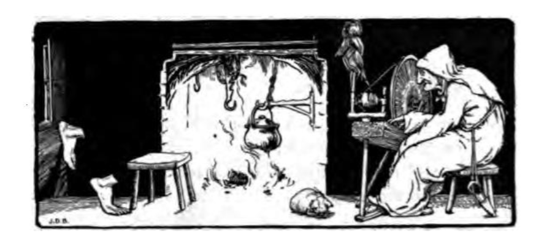
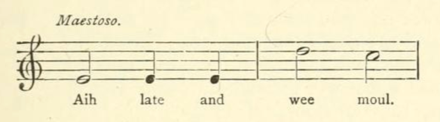
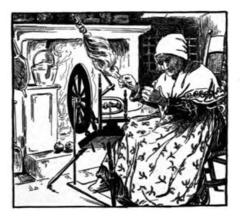
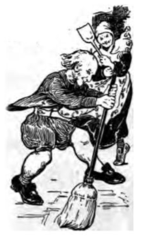
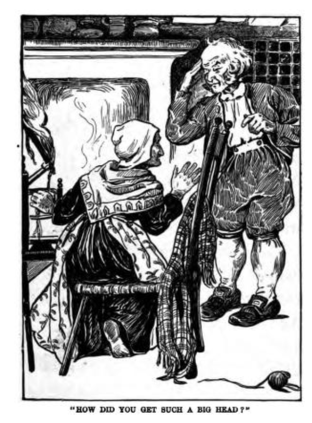

# The Strange Visitor

I first heard this from Hugh Lupton on the *Barefoot Books Podcast*, who frames the tale with opening and a closing settings, simplifies the body parts and the actions associated with them, and uses the refrains "*And still she sat, and still she sewed, and still she wished for company"* and *"Too much water, too little meat"*.

https://archive.org/details/englishfairytal00jacogoog/page/n208/mode/2up
English Fairy Tales
by Joseph Jacobs

Publication date 1890

pp.179-182

The Strange Visitor

A WOMAN was sitting at her reel one night;  
And still she sat, and still she reeled, and still she wished for company.

In came a pair of broad broad soles, and sat down at the fireside;  
And still she sat, and still she reeled, and still she wished for company.

In came a pair of small small legs, and sat down on the broad broad soles; A still she sat, and still she reeled, and still she wished for company.

In came a pair of thick thick knees, and sat down on the small small legs;  
And still she sat, and still she reeled, and still she wished for company.

In came a pair of thin thin thighs, and sat down on the thick thick knees;  
And still she sat, and still she reeled, and still she wished for company.

In came a pair of huge huge hips, and sat down on the thin thin thighs;  
And still she sat, and still she reeled, and still sh* wished for company.

In came a wee wee waist, and sat down on the huge huge hips;  
And still she sat, and still she reeled, and still she wished for company.

In came a pair of broad broad shoulders, and sat down on the wee wee waist;  
And still she sat, and still she reeled, and still she wished for company.

In came a pair of small small arms, and sat down on the broad broad shoulders;  
And still she sat, and still she reeled, and still she wished for company.

In came a pair of huge huge hands, and sat down on the small small arms;  
And still she sat, and still she reeled, and still she wished for company.

In came a small small neck, and sat down on the broad broad shoulders;  
And still she sat, and still she reeled, and still she. wished for company.

In came a huge huge head, and sat down on the small small neck.

"How did you get such broad broad feet?" quoth the woman.  
"Much tramping, much tramping" (*gruffly*).

"How did you get such small small legs?"  
"*Aih'h'h!* — late — and *wee-e-e* — moul" (*whiningly*).

"How did you get such thick thick knees?"  
"Much praying, much praying" (*piously*).

"How did you get such thin thin thighs?"  
"*Aih'h'h!* — late — and *wee-e-e* — moul" (*whiningly*).

** How did you get such big big hips?"  
"Much sitting, much sitting" (*gruffly*)-

"How did you get such a wee wee waist?"  
"*Aih'h'h!* — late — and *wee-e-e* — moul" (*whiningly*).

"How did you get such broad broad shoulders?"  
"With carrying broom, with carrying broom" (*gruffly*).

"How did you get such small small arms?"  
"*Aih'h'h!* — late — and *wee-e-e* — moul" (*whiningly*).

"How did you get such huge huge hands?"  
"Threshing with an iron flail, threshing with an iron flair" (*gruffly*).

"How did you get such a small small neck?"  
"*Aih'h'h!* — late — and *wee-e-e* — moul" (*pitifully*).

"How did you get such a huge huge head?"  
"Much knowledge, much knowledge" (*keenly*).

"What do you come for?"  
"FOR YOU!" *(At the top of the voice, with a wave of arm and a stamp of the feet.)*

Notes, p249

XXXII. THE STRANGE VISITOR

*Source.* — From Chambers, *l.c.* 64, much Anglicised. I have retained "Aih-late-wee-moul," though I candidly confess I have not the slightest idea what it means; judging other children by myself, I do not think that makes the response less effective. The prosaic-minded may substitute "Up-late-and-little-food."

*Parallels.* — The man made by instalments, occurs in the Grimms' No. 4, and something like it in an English folk-tale. *The Golden Ball*. *ap.* Henderson, *l.c.*, p. 333.

---

Chambers cited is 1870 version though the book dates back further at least two earlier editions (1847 and 1858), and the rhyme can be found in each

https://archive.org/details/popularrhymesofs00cham/page/64/mode/2up

Popular rhymes of Scotland
by Chambers, Robert, 1802-1871

Publication date 1870

pp64-6

THE STRANGE VISITOR.

A wife was sitting at her reel ae night;  
And aye she sat, and aye she reeled, and aye she wished for company.

In came a pair o' braid braid soles, and sat down at the fireside;  
And aye she sat, &c.

In came a pair o' sma' sma' legs, and sat down on the braid braid soles;  
And aye she sat, &c.

In came a pair o' muckle muckle knees, and sat down on the sma' sma' legs;  
And aye she sat, &c.

In came a pair o' sma' sma' thees, and sat down on the muckle muckle knees;  
And aye she sat, &c.

In came a pair o' muckle muckle hips, and sat down on the sma' sma' thees;  
And aye she sat, &c.

In came a sma' sma' waist, and sat down on the muckle muckle hips;  
And aye she sat, &c.

In came a pair o' braid braid shouthers, and sat down on the sma' sma' waist;  
And aye she sat, &c.

In came a pair o' sma' sma' arms, and sat down on the braid braid shouthers;  
And aye she sat, &c.

In came a pair o' muckle muckle hands, and sat down on the sma' sma' arms;  
And aye she sat, &c.

In came a sma' sma' neck, and sat down on the braid braid shouthers;  
And aye she sat, &c.

In came a great big head, and sat down on the sma' sma' neck.

'What way hae ye sic braid braid feet?' quo' the wife.

'Muckle ganging, muckle ganging' (*gruffly*).

'What way hae ye sic sma' sma' legs?'

'Aih-h-h ! — late — and wee-e-e — moul' (*whiningly*).

'What way hae ye sic muckle muckle knees?'

'Muckle praying, muckle praying' (*piously*).

'What way hae ye sic sma' sma' thees?'

'Aih-h-h ! — late — and wee-e-e — moul' (*whiningly*).

'What way hae ye sic big big hips?'

'Muckle sitting, muckle sitting' (*gruffly*).

'What way hae ye sic a sma' sma' waist?'

'Aih-h-h ! — late — and wee-e-e — moul' (*whiningly*).

'What way hae ye sic braid braid shouthers?'

'Wi' carrying broom, wi' carrying broom' (*gruffly*).

'What way hae ye sic sma' sma' arms?'

'Aih-h-h ! — late — and wee-e-e — moul' (*whiningly*)'

'What way hae ye sic muckle muckle hands?'

'Threshing wi' an iron flail, threshing wi' an iron flail' (*gruffly*).

'What way hae ye sic a sma' sma' neck?'

'Aih-h-h ! — late — and wee-e-e — moul' (*pitifully*),

'What way hae ye sic a muckle muckle head?'

'Muckle wit, muckle wit' (*keenly*).

'What do you come for?'

'FOR YOU!' (*At the top of the voice, with a wave of the arm and a stamp of the feet.*)

[The figure is meant for that of Death. The dialogue, towards the end, is managed in a low and drawling manner, so as to rivet the attention, and awaken an undefined awe in the juvenile audience. Thus wrought up, the concluding words come upon them with such effect as generally to cause a scream of alarm.]

--
THis version can also be found in

https://archive.org/details/scottishfairyfol00doug/mode/2up?q=%22was+sitting+at+her+reel%22
Scottish fairy and folk tales
by Douglas, George Brisbane, Sir, bart., 1856-1935, ed

Publication date 1900

pp83-6

---

Also in

https://archive.org/details/comehither0000walt/page/618/mode/2up?q=%22was+sitting+at+her+reel%22
Come Hither
by Walter De La Mare

Publication date 1923

pp618-20

--

Bowdlerised

(corrupted) https://archive.org/details/progressiveroad00burcgoog/page/n32/mode/2up

https://archive.org/details/progressiveroadt0000unse/page/30/mode/2up

The progressive road to reading: Book Two
by Burchill, Georgine, 1868-; Ettinger, William L. (William Louis), 1862- joint author; Shimer, Edgar Dubs, 1853- joint author

Publication date 1909

pp.27-32

THE OLD WOMAN AND HER COMPANY

Once there was an Old "Woman, and she lived all alone.

One night she sat by the fire spinning, and as she spun she said to herself, "I wish I had some one to talk to."

Just as she said these words two big, big feet came flying through the window,  
and stood by the fireplace.  
And still she sat.  
And still she spun.  
And still she wished for company.

In came two fat, fat legs,  
and fixed themselves at once on the big, big feet.  
And still she sat.  
And still she spun.  
And still she wished for company.

In came a wee, wee waist,  
and quick as a wink  
fixed itself on the fat, fat legs.  
And still she sat,  
And still she spun,  
And still she wished For company.

In came two broad, broad shoulders, and in the twinkling of an eye  
they were on the wee, wee waist.

And still she sat.  
And still she spun.  
And still she wished For company.

In came a big, big head, and in a flash settled down on the broad, broad shoulders.  
And there by the fire stood an Old, Old Man.  
The Old Woman stopped spinning, and looked at the Old Man.

"Where did you get such big feet?" she asked.

"Walking, walking, walking," said the Old Man.

"How did you get such fat legs?" asked the Old Woman.

"Climbing, climbing, climbing," said the Old Man.

"How did you get such a wee waist?" asked the Old Woman.

"Stretching, stretching, stretching," said the Old Man.

"How did you get such broad shoulders ?" asked the Old Woman.

"Carrying wood, carrying wood, carrying wood," said the Old Man.

"How did you get such a big head ?"  

asked the Old Woman.

"Thinking, thinking, thinking," said the Old Man.

"What did you come for?" asked the Old Woman.

"To have a good time," said the Old Man.  
And he jumped up, and began to dance with the broomstick.

The Old Woman jumped up, too, and began to dance with the fire shovel. And they danced and danced, and danced and danced, till they couldn't dance any more.

And it is said that the Old Woman was never lonesome afterward.

