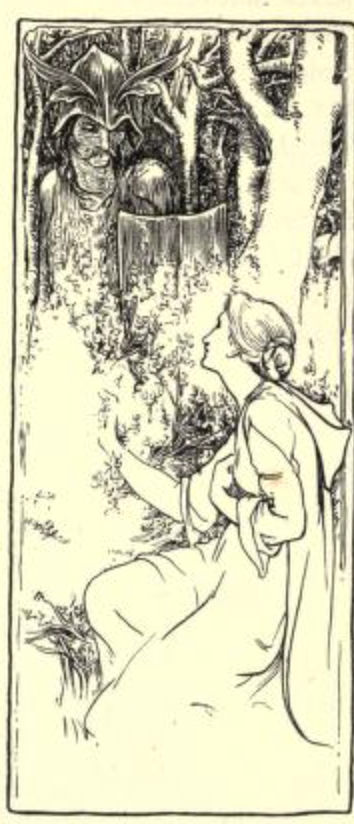
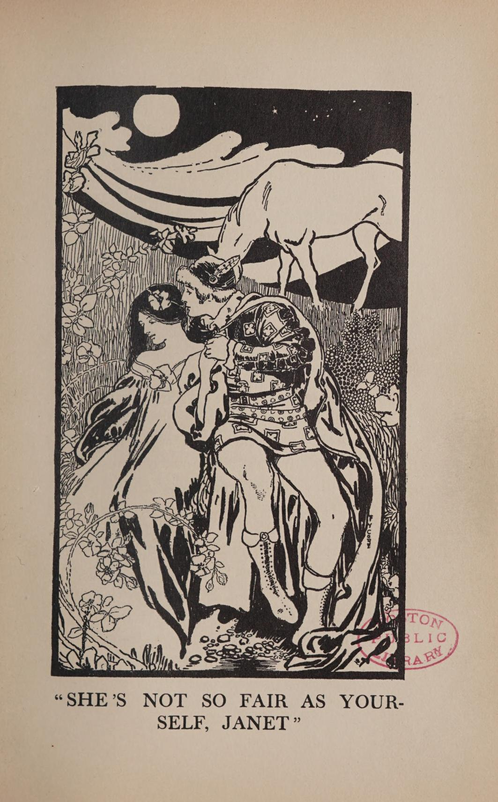

# Tam Lin / Tamlane

https://archive.org/details/moreenglishfairy00jacoiala/page/158/mode/2up

More English fairy tales
by Jacobs, Joseph, 1854-1916; Batten, John Dickson, 1860-1932, ill

Publication date 1894

pp. 159-62

Tamlane

YOUNG TAMLANE was son of Earl Murray, and Burd Janet was daughter of Dunbar, Earl of March. And when they were young they loved one another and plighted their troth. But when the time came near for their marrying, Tamlane disappeared, and none knew what had become of him.

Many, many days after he had disappeared, Burd Janet was wandering in Carterhaugh Wood, though she had been warned not to go there. And as she wandered she plucked the flowers from the bushes. She came at last to a bush of broom and began plucking it. She had not taken more than three flowerets when by her side up started young Tamlane.

"Where come ye from, Tamlane, Tamlane?" Burd Janet said; "and why have you been away so long?"

"From Elfland I come," said young Tamlane. "The Queen of Elfland has made me her knight."

"But how did you get there, Tamlane?" said Burd Janet.

"I was a-hunting one day, and as I rode widershins ound yon hill, a deep drowsiness fell upon me, and when I awoke, behold! I was in Elfland. Fair is that land and gay, and fain would I stop but for thee and one other thing. Every seven years the Elves pay their tithe to the Nether world, and for all the Queen makes much of me, I fear it is myself that will be the tithe."

"Oh can you not be saved? Tell me if aught I can do will save you, Tamlane?"

"One only thing is there for my safety. To-morrow night is Hallowe'en, and the fairy court will then ride through England and Scotland, and if you would borrow me from Elfland you must take your stand by Miles Cross between twelve and one o' the night, and with holy water in your hand you must cast a compass all around you."

"But how shall I know you, Tamlane," quoth Burd Janet, "amid so many knights I've ne'er seen before?"

"The first court of Elves that come by let pass, let pass. The next court you shall pay reverence to, but do naught nor say aught. But the third court that comes by is the chief court of them, and at the head rides the Queen of all Elfland. And by her side I shall ride upon a milk white steed with a star in my crown; they give me this honour as being a christened knight. Watch my hands, Janet, the right one will be gloved but the left one will be bare, and by that token you will know me."

"But how to save you, Tamlane?" quoth Burd Janet.

"You must spring upon me suddenly, and I will fall to the ground. Then seize me quick, and whatever change befall me, for they will exercise all their magic on me, cling hold to me till they turn me into red-hot iron. Then cast me into this pool and I will be turned back into a mother-naked man. Cast then your green mantle over me, and I shall be yours, and be of the world again."

So Burd Janet promised to do all for Tamlane, and next night at midnight she took her stand by Miles Cross and cast a compass round her with holy water.

Soon there came riding by the Elfin court, first over the mound went a troop on black steeds, and then another troop on brown. But in the third court, all on milk white steeds, she saw the Queen of Elfland and by her side a knight with a star in his crown with right hand gloved and the left bare. Then she knew this was her own Tamlane, and springing forward she seized the bridle of the milk-white steed and pulled its rider down. And as soon as he had touched the ground she let go the bridle and seized him in her arms.

"He's won, he's won amongst us all," shrieked out the eldritch crew, and all came around her and tried their spells on young Tamlane.

First they turned him in Janet's arms like frozen ice, then into a huge flame of roaring fire. Then, again, the ire vanished and an adder was skipping through her arms, but still she held on; and then they turned him into a snake that reared up as if to bite her, and yet she held on. Then suddenly a dove was struggling in her arms, and almost flew away. Then they turned him into a swan, but all was in vain, till at last he was changed into a redhot glaive, and this she cast into a well of water and then he turned back into a mother-naked man. She quickly cast her green mantle over him, and young Tamlane was Burd Janet's for ever.

Then sang the Queen of Elfland as the court turned away and began to resume its march.

"She that has borrowed young Tamlane  
Has gotten a stately groom,  
She's taken away my bonniest knight  
Left nothing in his room.

"But had I known, Tamlane, Tamlane,  
A lady would borrow thee,  
I'd hae ta'en out thy two grey eyne,  
Put in two eyne of tree.

Had I but known, Tamlane, Tamlane,  
Before we came from home,  
I'd hae ta'en out thy heart o' flesh,  
Put in a heart of stone.

"Had I but had the wit yestreen  
That I have got to-day,  
I'd paid the Fiend seven times his teind  
Ere you'd been won away."

And then the Elfin court rode away, and Burd Janet and young Tamlane went their way homewards and were soon after married after young Tamlane had again been sained by the holy water and made Christian once more.

Notes, p238

LXXV. TAMLANE.

Source. — From Scott's *Minstrelsy*, with touches from the other variants given by Prof. Child in his *Eng. and Scotch Ballads*, i. 335-58.

*Parallels.*— Prof. Child gives no less than nine versions in his masterly edition, I.e., besides another fragment "Burd Ellen and Young Tamlane," i. 258. He parallels the marriage of Peleus and Thetis in Apollodorus III., xiii. 5, 6, which still persists in modern Greece as a Cretan ballad.

*Remarks.*— Prof. Child remarks that dipping into water or milk is necessary before transformation can take place, and gives examples, I.e. 338, to which may be added that of Catskin (see Notes infra). He gives as the reason why the Elf-queen would have "ta'en out Tamlane's two grey eyne," so that henceforth he should not be able to see the fairies. Was it not rather that he should not henceforth see Burd Janet?— a subtle touch of jealousy. On dwelling in fairyland Mr. Hartland has a monograph in his *Science of Fairy Tales*, pp. 161-254.

https://archive.org/details/oldballadsinpros00tapp_0/page/122/mode/2up
Old ballads in prose
by Tappan, Eva March, 1854-1930

Publication date 1901

pp123-31

TAMLANE

"Burn your nuts on the hearth," said the old nurse, "and eat your apples before the glass, and your own true love will come and look over your shoulder; but go you not out of the house door this night, for the witches and the warlocks are abroad and mayhap the fiend himself."

"But I am going out on the moor to sow the hemp seed; and when I look over my left shoulder, Ill see no face in a glass, but Ill see my own sweetheart," said Janet, the fairest of the maidens.

"Willful wanderers walk in woeful ways," grumbled the nurse, "and it's sorry you ‘ll be if you go out on the moor this night. There's bogies and ghosts and demons, and there's Tamlane, and it's Tamlane that comes out of the bush on the moor by the well, and if he sees a maiden, she must give him her golden ring off her finger or her mantle of green off her shoulders, or else he'll take her on his milk-white steed and carry her away to Elfinland."

"I'll give him no gold ring off my finger, and I'll give him no green mantle off my shoulders, and I'll not go to Elfinland with him!" cried fair Janet, "but it's out on the moor to Carterhaugh that I'll go this night. It's my own land, and may I not walk on my own sod?" and the willful maiden tucked up her green skirt and braided her yellow hair, and she flung wide the house door and sped over the moor to Carterhaugh.

The moon shone bright, and over the grass — were the elfin rings, but fair Janet went boldly on to the haunted well, scattering the hemp seed as she walked. The water gleamed in the moonlight, and beside the well was a bush of red roses. Fair Janet plucked a rose and put it in her hair, and the water in the well gurgled and murmured and seemed to be trying to make words.

"The rose is my own," said fair Janet, "and I'll pluck it for all the water that is in the well." She plucked a second rose and put it in her bosom, and then she heard the neighing of a milk-white steed that stood by the well.

"The rose is my own," said fair Janet, "and I'll pluck it for all the milk-white steeds in the countryside," and she put forth her hand to pluck a third rose, but a voice came from out the bush : —

"Why do you break the tree, Janet? and why come you to Carterhaugh when you've asked no leave of me?"

"And why should I ask leave of you? Is not the land my own? My father left it to me, and Ill come and go as I will without the leave of ghost or goblin."

"But I'm no ghost or goblin, Janet. My hand is as warm as yours," and a warm, firm hand reached out from the bush and gently clasped her own.

"You 're no true man," said fair Janet, "if you were not christened at the church door."

"But I was christened at the church door as well as you, Janet, and it was on the selfsame day. You are the child of the Earl of March, and I'm the son of the Earl of Murray. I've loved you all my life, Janet, for I was the little boy with whom you used to play."

"And if you've loved me all your life," asked fair Janet, "where have you been these many years?"

"There's been but one day in the year for me, Janet, and that was the eve of All Hallows Day, for then I was free to come to the well, and weary my heart with hoping and waiting for you."

"But who has held you so fast?" questioned Janet; and then Tamlane came from out the bush, and they sat beside the well, and the_milk-white steed softly cropped the grass in the moonlight, and the water in the well laughed gently to itself, and murmured sweet little forgotten tunes.

"It was a bitter cold night," said Tamlane, "and the wind blew out of the north. A sleep like death came over me. I fell from my horse into a fairy ring, and the Queen of Elfinland bore me away to yonder green hill."

"Is not the Queen fairer than any maiden on earth, Tamlane?"

"She's not so fair as yourself, Janet."

"Is not Elfinland a bonnier place than the earth, Tamlane?"

"It is a bonny place, indeed, Janet, but every seventh year there's one of us must go to the fiend, and I fear it will be myself, Janet. Only the maid that I love can save me, and there's none that I love but you, Janet."

"And what must I do?" whispered fair Janet, and Tamlane answered joyfully:—

"To-night is Halloween, and she that dares to stand by the old Miles Cross can free her own true love from all the magic of Elfinland. Are you my own true love, Janet?"

"And what should I do if I were, Tamlane?"

"You must go alone to the Cross, Janet. "Tis an eerie, fearsome way, but no harm will come to her who goes forth in the gloom of the midnight, if it be to save her own heart's love. You must take holy water in your hand and sprinkle it ina great circle round about. When the bell strikes twelve, all the folk of Elfinland will ride by, and I shall be among them."

"But how shall I know you, Tamlane?"

"Let the first company pass, Janet; let the second, too, go by; but when the third company draws close, then if your love is true and your heart does not fail from fear, you can see me and free me, for all the powers of Elfinland."

"Shall you be on the horse, Tamlane?"

I'll be on my own milk-white steed, Janet, and there'Il be a crown on my head because I was a knight; and there'll be a gold star in the crown because I was a christened child. Let pass the black horse, let pass the brown, but cling fast to the milk-white steed and pull the rider to the ground;" and the great white horse neighed gently and rested his head softly on Janet's shoulder. Janet looked back and stroked his face.

"And if I forget how you look, Tamlane, I'll know you by the milk-white steed."

"When you have me, Janet, the trouble's only begun. Can you hold me fast and have no fear?"

"I never feared aught on the earth," said Janet, "and I'll not begin to-night."

"But they'll come in awesome shapes, Janet, and they'll turn me to a lizard and they'll turn me to an adder, and then I'll be a flame of fire; but last of all, I'll lie in your arms like a new-born babe, and if you throw your green mantle over me, I'll be a man on earth again and your own true love forever and aye."

So to the church went fair Janet, and called for the priest.

"Give me some holy water, I pray, for to-night I must meet the fiends."

"Let me go with you," urged the priest, but fair Janet shook her head.

"Sometimes one must meet the fiends alone," she said, "and there's one that I love that says they'll do me no harm if my love is true, and my heart does not fail."

So over the moor and across the brook and by the narrow path through the woods went fair Janet with the holy water in her hand; and when she came to Miles Cross, she sprinkled the holy water all around, and then she stood still and clung to the Cross for fear, for over the little hill came riding the folk of Elfinland. The first company passed, and the second passed. Then came the black horse, and the rider was something terrible to look upon, and Janet, who had never feared anything on earth, began to tremble. Then came the brown horse, and the rider was even more terrible, and Janet, who had never feared anything on earth, felt a cold chill strike her heart. Then came the milk-white steed. She trembled no more, and her heart was warm again, for the rider was her own true love.

The milk-white steed neighed softly, and she threw her arms about his neck, and she pulled the rider down. Such an eldritch screech arose from the ghastly company that the moon hid her face behind a cloud, and the great gray owl on the tree cried, "Hoot!" and flew far away into the forest; but Janet only looked into the eyes of her own true love, and clasped him firmly to her heart. In a moment he was gone, and she was holding a loathsome lizard to her breast. She shut her eyes, but she would not let it go. Then the lizard vanished, and now she was clinging to an adder that hissed and twined, but she would not let it go. Then the adder vanished, and her arms were empty of aught save a flame of fire that rose above her and whispered fearsome words in her ear, but she would not let it go. And then the fire was gone, and in her arms he lay like a new-born babe, and she threw her green mantle over him and kissed him on the lips, for her true love was all her own.

The horrible company disappeared, but from over the hill came a voice more hateful than one could dream, for it was the angry voice of the Queen of Elfinland, and it shrieked:—

"If I had known, Tamlane, that you had looked upon the woman that would steal you from me, I would have plucked out your two gray eyes and put in two eyes of wood; and if I had known, Tamlane, that your heart had had a thought of the woman that would steal you from me, I would have plucked out your warm, red heart and put into your breast a heart of stone; and if yesterday I had been wise, Tamlane, as wise as I am to-day, I would have paid my toll to the fiend seven times over before you should have been stolen away from me."

The bell on the tower struck one, and the moon shone bright. Tamlane and fair Janet walked together in the narrow little path through the ferns and under the pine-trees to the great door of the hall, and contentedly stepping after them, there followed on the milk-white steed.

---

Reimagined:

https://archive.org/details/traditionaltales01cunn/page/n7/mode/2up
https://archive.org/details/traditionaltales02cunni/page/n3/mode/2up
Traditional Tales of the English and Scottish Peasantry (two volumes)
by Allan Cunningham

Publication date 1822

In vol II, https://archive.org/details/traditionaltales02cunni/page/88/mode/2up?q=elphin
pp89-122

