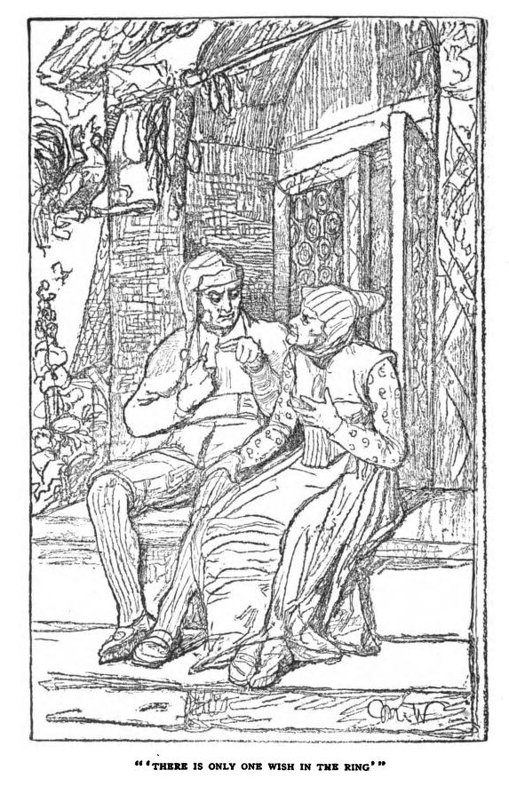

# The Wish Ring

I first heard this story told by Daniel Morden as part of his Covid lockdown podcast series, as supported by a stability grant from the Arts Council of Wales's National Lottery Fund (["The Ring", Daniel Morden podcast](https://podbay.fm/p/daniel-morden-storyteller/e/1607284800)).

<audio controls>
  <source src="https://thecraneskinbag.podomatic.com/enclosure/2020-12-06T12_00_00-08_00.mp3" type="audio/mpeg">
Your browser does not support the audio element.
</audio>

*It's rapidly becoming one of my favourite 5 minute tales for retelling in a similar way, and is suitable for a wide range of audiences.*

I'm pretty sure I heard Daniel say somewhere (FATE 2021, maybe, in a lunch queue, telling someone else?) that it had come via an old collection of Welsh traditional tales, but the first place I tracked it down to was the *Vol 10 Iss 12* issue of the St Nicholas magazine, from October, 1883, [p938-9](https://archive.org/details/sim_saint-nicholas-a-magazine-for-boys-and-girls_1883-10_10_12/page/938/mode/2up?q=%22wish+ring%22), thereafter reprinted in *Fairy stories retold from St. Nicholas*, 1906, [p185-192](https://archive.org/details/FairyStoriesRetoldFromStNicholas/page/n195/mode/2up?q=%22wish+ring%22), from which the following image is  taken.



```{admonition} The Wish Ring, translated from the German by Anna Eichberg
:class: dropdown

A YOUNG farmer who was very unlucky sat on his plow a moment to rest, and just then an old woman crept past and cried : "Why do you go on drudging day and night without reward? Walk two days till you come to a great fir tree that stands all alone in the forest and overtops all other trees. If you can hew it down, you will make your fortune."

Not waiting to have the advice repeated, the farmer shouldered his ax and started on his journey. Sure enough, after tramping two days, he came to the fir tree, which he instantly prepared to cut down. Just as the tree swayed, and before it fell with a crash, there dropped out of its branches a nest containing two eggs. The eggs rolled to the ground and broke, and there darted out of one a young eagle and out of the other rolled a gold ring. The eagle grew larger, as if by enchantment, and when it reached the size of a man, it spread its wings as if to try their strength, then, soaring upward, it cried: "You have rescued me ; take as a reward the ring that lay in the other egg; it is a wish-ring. Turn it on your finger twice, and whatever your wish is, it shall be fulfilled. But remember there is but a single wish in the ring. No sooner is that granted than it loses its power and is only an ordinary ring. Therefore, consider well what you desire, so that you may never have reason to repent your choice." So speaking, the eagle soared high in the air, circled over the farmer's head a few times, then darted, like an arrow, toward the east.

The farmer took the ring, placed it on his finger, and turned on his way homeward. Toward evening, he reached a town where a jeweler sat in his shop behind a counter, on which lay many costly rings for sale. The farmer showed his own, and asked the merchant its value.

"It is not worth a straw," the jeweler answered.

Upon that, the farmer laughed very heartily, and told the man that it was a wish-ring, and of greater value than all the rings in the shop together.

The jeweler was a wicked, designing man, and so he invited the farmer to remain as his guest over night. "For," he explained, "only to shelter a man who owns a wish-ring must bring luck." So he treated his guest to wine and fair words ; and that night, as the farmer lay sound asleep, the wicked man stole the magic ring from his finger and slipped on, in its place, a common one which he had made to resemble the wish-ring.

The next morning, the jeweler was all impatience to have the farmer begone. He awakened him at cock-crow, and said: "You had better go, for you have still a long journey before you."

As soon as the farmer had departed, the jeweler closed his shop, put up the shutters, so that no one could peep in, bolted the door behind him, and, standing in the middle of the room, he turned the ring and cried: "I wish instantly to possess a million gold pieces !"

No sooner said than the great, shining gold pieces came pouring down upon him in a golden torrent over his head, shoulders, and arms. Pitifully he cried for mercy, and tried to reach and unbar the door ; but before he succeeded, he stumbled and fell bleeding to the ground. As for the golden rain, it never stopped till the weight of the metal crushed the floor, and the jeweler and his money sank through to the cellar. The gold still poured down till the million was complete, and the jeweler lay dead in the cellar beneath his treasure.

The noise, however, alarmed the neighbors, who came rushing over to see what the matter was ; when they saw the man dead under his gold, they exclaimed: "Doubly unfortunate he whom blessings kill." Afterward, the heirs came and divided the property.

In the meantime, the farmer reached home in high spirits and showed the ring to his wife.

"Henceforth we shall never more be in want, dear wife," he said. "Our fortune is made. Only we must be very careful to consider well just what we ought to wish."

The farmer's wife, of course, proffered advice. "Suppose," said she, "that we wish for that bit of land that lies between our two fields ?"

"That isn't worth while," her husband replied. "If we work hard for a year, we 'll earn enough money to buy it."

So the two worked very hard, and at harvest time they had never raised such a crop before. They had earned money enough to buy the coveted strip of land and still have a bit to spare. "See," said the man, "we have the land and the wish as well."

The farmer's wife then suggested that they had better wish for a cow and a horse. But the man replied: "Wife, why waste our wish on such trifles? The horse and cow we'll get anyway."

Sure enough, in a year's time the money for the horse and cow had been earned. Joyfully the man rubbed his hands. "The wish is saved again this year, and yet we have what we desire. How lucky we are !"

But now his wife seriously adjured him to wish for something at last. "Now that you have a wish to be granted," she said, "you slave and toil, and are content with everything. You might be king, emperor, baron, even a gentleman farmer, with chests overflowing with gold ; but you don't know what you want."

"We are young and life is long," he answered. "There is only one wish in the ring, and that is easily said. Who knows but sometime we may sorely need this wish? Are we in want of anything? Have we not prospered, to all people's astonishment, since we possessed this ring? Be reasonable and patient for a while. In the meantime, consider what we really ought to wish for."

And that was the end of the matter.

It really seemed as if the ring had brought a blessing into the house. Granaries and barns were full to overflowing, and in the course of a few years the poor farmer became a rich and portly person, who worked with his men afield during the day, as if he, too, had to earn his daily bread ; but after supper he liked to sit in his porch, contented and comfortable, and return the kindly greeting of the folk who passed and who wished him a respectful good-evening.

So the years went by. Sometimes, when they were alone, the farmer's wife would remind her husband of the magic ring, and suggest many plans. But as he always answered that they had plenty of time, and that the best thoughts come last, she more and more rarely mentioned the ring, and, at last, ceased speaking of it altogther.

To be sure, the farmer looked at the ring, and twirled it about as many as twenty times a day; but he was very careful never to wish.

After thirty or forty years had passed away, and the farmer and his wife had grown old and white-haired, and their wish was still unasked, then was God very good to them, and on the same night they died peacefully and happily.

Weeping children and grand-children wished to remove the ring from the still hand as a remembrance, the oldest son said : "Let our father take his ring with him. There was always a mystery about it; perhaps it was some dear remembrance. Our mother, too, so often looked at the ring — she may have given it to him when they were young."

So the old farmer was buried with the ring, which had been supposed to be a wish-ring, and was not; yet it brought as much good fortune into the house as heart could desire.

```

Following Daniel Morden's telling, I have been telling this with an ending along the lines of *"the ring may not have contained a wish at all, the ring being swapped by the greedy jeweller all those years ago, but it did contain a much deeper magic, that of `hope`"*, but I'm not sure that's right? The ring provided some sort of _confidence_, born of trust, or faith, in the "insurance" of the support that the ring would be able to provide, albeit once only, if it were required.

## An Earlier Telling, in the German

Picking up on the *translated from the German* reference in the St. Nicholas telling, a web search on the German translation of *The Wish Ring* — `Der Wunschring` — turned up a version of the story in [*Der Kinder Wundergarten Märchen aus aller Welt*,
Friedrich Hofmann, 1888?](https://archive.org/details/derkinderwunderg01hofm/page/164/mode/2up?q=Wunfchring), p164-170, with illustrations on p.164 and p167, although an earlier version from 1878 can also be found [here](https://play.google.com/books/reader?id=4IlCAQAAMAAJ&pg=GBS.PA224&hl=en_GB).

````{admonition} Der Wunschring / The Wish Ring
:class: dropdown seealso

Via: *Der Kinder Wundergarten: Märchen aus aller Welt*, Friedrich Hofmann, 1878, p225-8, https://play.google.com/books/reader?id=4IlCAQAAMAAJ&pg=GBS.PA224&hl=en_GB

*The following is crude translation from Google Translate. It might be worth trying with GPT4 to see if that offers any improvement.*

The young farmer, who was not making any headway in the business, sat on his plow and rested for a moment to wipe the sweat from his face. Then an old pere came sneaking past and called out to him: "What are you struggling with and still getting nowhere?" Rarely go out for two days until you come to a large fir tree that stands freely in the forest and towers over all the other trees. If you turn it over, your luck is made. "

The farmer didn't need to be told twice, took his hatchet and set off. After two days he found the fir. He immediately set about felling it , and the moment it fell and fell violently to the ground , a nest with two eggs fell out of its highest treetop . The eggs fell on the ground and broke , and as they broke , a young eagle came out of one egg , and a small golden ring fell out of the other . The eagle grew steadily until it was probably half a man's height, shook its wings as if trying them, rose a little above the ground and then cried:

"You redeemed me! As a thank you, take the ring that was in the other gi! It is a wish ring. If you turn a finger and make a wish, it will soon come true. But there is only one wish in the ring. So think carefully about what you wish for so that you don't regret it afterwards.

Then the eagle flew high in the air, hovered for a long time in large strips over the farmer's head, and then shot like an arrow towards the morning.

The farmer took the ring, put it on his finger and started to go home. When it was evening he arrived at a town; there the goldsmith stood in the shop and had many princely rings for sale. Then the farmer showed him his ring and asked him what it was worth. " A cardboard stick ! " said the goldsmith. Then the farmer laughed out loud and told him that it was a wishing ring and was worth more than all the rings together that Fener had for sale. But the oldsmith was a wrong, big man. He invited the farmer to come over Staying with him at night said: "To shelter a man like you with such treasures brings good luck; stay with me!" took the ring off his finger unnoticed and put an ordinary ring of the same kind on him instead.

The next morning the goldsmith could hardly wait for the farmer to leave. He woke him up early in the morning and said: "You still have a long way to go. It is better if you get up early . "

As soon as the farmer was gone, he hurriedly went into his room, closed the shutters so that no one would steal anything, then bolted the door behind him, stood in the middle of the room, turned the ring and called out: "I want to right away have a hundred thousand thalers. "


```{admonition} Raining thalers...
:class: dropdown


```

Hardly had he spoken this than it began to rain thalers, hard, shiny thalers, as if it were pouring with hollows, and the thalers hit his head, shoulders and arms. He started screaming pitifully and wanted to jump to the door, but before he could reach it and unlock it, he fell to the ground, bleeding all over his body. But the rain of thalers never ended, and soon the floorboards collapsed under the load, and the goldsmith fell into the deep cellar with the money. Then it kept raining until the hundred thousand were full, and then the goldsmith lay dead in the cellar with all that money on him. The neighbors rushed over to hear the noise, and when they found the goldsmith lying dead among the money, they said: "It's a great misfortune when the blessing comes so thick! "Then the heirs also came and shared."

Meanwhile the farmer went home happily and showed his wife the ring. Now it can't be missing, dear wife," he said. "Our luck is made. We just want to think carefully about what we want to wish for."

But the woman immediately knew good advice. What do you mean if we wish for a little more vein? We have so little. A swidel just reaches between our veins; we want to wish for that.

That would be worth the trouble," replied the man. "If we work hard for a year and are lucky, we might be able to buy it." Then husband and wife worked with all their might for a year, and the harvest had it has never poured out like this time, so that you could buy the gusset and still have an hour's money left over. "You see!" said the man, "we have the dagger, and the wish is still free. "

Then the woman said it would be good if you wished for a rest and a horse. Madam," replied the man again, rattling the remaining money in his big pocket, "what do we want to forgive our wishes for such a slob. We'll get the cow and the horse the same way. "

And right , after another year the chair and the horse were richly deserved . Then the man rubbed my hands happily and said: "Another trip, saved the wish and got everything that one wished for. How lucky we are! "But the wife seriously persuaded her husband to go after the wish at last.

"I don't know you at all," she said angrily. In the past you always complained and had pity and wished for everything possible, and wherever you can have it as you want it, you toil and lock yourself up, are satisfied with Adem and let the best years pass. King, emperor, count, you could be a great farmer, have all your coffers full of money - and you can't make up your mind what you want to choose. "

"Stop your constant hustle and bustle," replied the farmer. We are both young and life is long. There is only one wish in the king and it is soon done. Who knows what will happen to us again when we need the ring . Are we missing something? Haven't we come up so since we've had the king that everyone is amazed? Aijo ſei understanding. In the meantime you can always think about what we could wish for. "

That was the end of the matter for the time being. And it was really as if the whole blessing had come into the house with the ring, because the scouring and pounding became more and more violent and fuller from year to year, and after a long series of years the poor little farmer grew into a big, fat one Became a farmer, who worked with the servants throughout the day as if he wanted to earn the whole world, but after vespers sat comfortably and contentedly in front of the front door and let the people wish him good evening.

Year after year went by like that. Now and then, when they were all alone and no one heard, the wife still reminded her husband of the ring and made all sorts of suggestions. But since he always replied that there was still plenty of time and that the best thing always comes to mind, it became increasingly rare, and in the end it hardly ever happened that the ring was even spoken of. Although the farmer himself turned the ring on his finger twenty times a day and looked at it, he was careful not to express a wish.

And thirty or forty years passed, and the farmer and his wife were old and white as snow, but the wish was still not fulfilled. God showed them mercy and let them both die happily in one night.

Children and child finders stood around their two coffins and wept, and when one of them wanted to pull off the ring, the eldest son said:

"Let the father take his ring with him to the grave. He has had a secret with him all his life. It must be a dear keepsake. And the mother also looked at the ring so often; in the end she had given it to her father when she was young. "

So the old farmer was buried with the ring, which was supposed to be a wishing ring and wasn't one, and yet had brought as much luck into the world as anyone could wish for. Because it is a separate matter with what is right and what is wrong; and bad things in good hands are still worth much more than good things in bad hands.

```{warning} Original source — *Hofmann , Wundergarten*

The contents suggest the source `Leander`, and is more fully described in the introduction as *Richard Leander's Träumereien an franzöſiſchen Kaminen*. (Richard Leander is actually a pseudonym of Richard Volkman.) The original edition of that work appears to date from 1871. The earliest online edition I have found is an 1876 version here: https://books.google.co.uk/books?id=Q_cjZzO-UhcC&printsec=frontcover#v=onepage&q&f=false

Leander's work appears to have been republished many times, particularly in American editions for US schools. For example, this 1898 edition  — Richard Leander's Reverie on French Fireplaces : Träumereien an französischen kaminen; märchen, by Volkmann, Richard von — available from the Internet Archive: https://archive.org/details/trumereienanfra01watsgoog/page/n24/mode/2up

```

````
