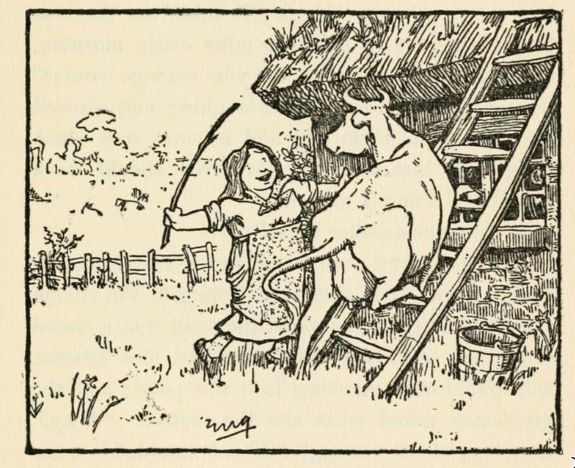

# The Three Sillies

This is one of the stories that appears widely in English folk-tale collectoins, although I donlt recall any particular examples of having heard it myself. From the breifest refreshers of the bones of the tale, I told it myself for the first time at &Spoken Word at Monkton Arts* in May, 2024. Coming in at about 11 minutes, the scope for humour is plentiful. The tale ends as a "happiliy ever after", with an opportunity to say there are fools everywhere, but one comment was that it missed a kicker (a topper, or a twist), at the end.

The version that seems to appear most commonly in English folk-tale collexctions is the one published by Jacobs in his *English Fairy Tales*:

```{admonition} Jacobs, *The Three Sillies*, 1895
:class: dropdown
English Fairy tales;
Joseph Jacobs, 1895, [pp. 11-17](https://archive.org/details/englishfairytale00jaco/page/268/mode/1up).

THE THREE SILLIES.

ONCE upon a time there was a farmer and his wife who had one daughter, and she was courted by a gentleman. Every evening he used to come and see her, and stop to supper at the farmhouse, and the daughter used to be sent down into the cellar to draw the beer for supper. So one evening she had gone down to draw the beer, and she happened to look up at the ceiling while she was drawing, and she saw a mallet stuck in one of the beams. It must have been there a long, long time, but somehow or other she had never noticed it before, and she began a-thinking. And she thought it was very dangerous to have that mallet there, for she said to herself : " Suppose him and me was to be married, and we was to have a son, and he was to grow up to be a man, and come down into the cellar to draw the beer, like as I'm doing now, and the mallet was to fall on his head and kill him, wliat a dreadful thing it would be !" And she put down the candle and the jug, and sat herself down and began a-crying.

Well, they began to wonder upstairs how it was that she was so long drawing the beer, and her mother went down to see after her, and she found her sitting on the settle, crying, and the beer running over the floor. " Why, whatever is the matter ?" said her mother, " Oh, mother !" says she, " look at that horrid mallet ! Suppose we was to be married, and was to have a son, and he was to grow up, and was to come down to the cellar to draw the beer, and the mallet was to fall on his head and kill him, what a dreadful thing it would be !" " Dear, dear ! what a dreadful thing it would be !" said the mother, and she sat her down aside of the daughter and started a-crying, too. Then, after a bit, the father began to wonder that they didn't come back, and he went down into the cellar to look after them himself, and there they two sat a-crying, and the beer running aU over the floor. " Whatever is the matter ?" says he. " Why," says the mother, " look at that horrid mallet. Just suppose, if our daughter and her sweetheart was to be married, and was to have a son, and he was to grow up, and was to come down into the cellar to draw the beer, and the mallet was to fall on his head and kill him, what a dreadful, thing it would be!' " Dear, dear, dear ! so it would !" said the father, and he sat himself down aside of the other two, and started a-crying.

Now the gentleman got tired of stopping up in the kitchen by himself, and at last he went down into the cellar too, to see what they were after; and there they three sat a-crying side by side, and the beer running all over the floor. And he ran straight and turned the tap. Then he said : " Whatever are you three doing, sitting there crying, and letting the beer run all over the floor?" "Oh!" says the father, " look at that horrid mallet ! Suppose you and our daughter was to be married, and was to have a son, and he was to grow up, and was to come down into the cellar to draw the beer, and the mallet was to fall on his head and kill him !" And then they all started a-crying worse than before. But the gentleman burst out a-laughing, and reached up and pulled out the mallet, and then he said : "I've traveled many miles, and I never met three such big sillies as you three before ; and now I shall start out on my travels again, and when I can find three bigger sillies than you three, then I'll come back and marry your daughter." So he wished them good-by, and started off on his travels, and left them all crying because the girl had lost; her sweetheart.

"Well, he set out, and he traveled a long way, and at last he came to a woman's cottage that had some grass growing on the roof. And the woman was trying to get her cow to go up a ladder to the grass, and the poor thing durst not go. So the gentleman asked the woman what she was doing. "Why, lookye," she said, "look at all that beautiful grass, I'm going to get the cow on to the roof to eat it. She'll be quite safe, for I shall tie a string round her neck, and pass it down the chimney, and tie it to my wrist as I go about the house, so she can't fall off without my knowing it." " Oh, you poor silly!" said the gentleman, "you should cut the grass and throw it down to the cow!" But the woman thought it was easier to get the cow up the ladder than to get the grass down, so she pushed her and coaxed her and got her up, and tied a string round her neck, and passed it down the chimney, and fastened it to her own wrist. And the gentleman went on his way, but he hadn't gone far when the cow tumbled off the roof, and hung by the string tied round her neck, and it strangled her. And the weight of the cow tied to her wrist pulled the woman up the chimney, and she stuck fast halfway and was smothered in the soot.

Well, that was one big silly.



And the gentleman went on and on, and he went to an inn to stop the night, and they were so full at the inn that they had to put him in a double-bedded room, and another traveler was to sleep in the other bed. The other man was a very pleasant fellow, and they got very friendly together; but in the morning, when they were both getting up, the gentleman was surprised to see the other hang his trousers on the knobs of the chest of drawers and run across the room and try to jump into them, and he tried over and over again, and couldn't manage it; and the gentleman wondered whatever he was doing it for. At last he stopped and wiped his face with his handkerchief. " Oh dear," he says, " I do think trousers are the most awkwardest kind of clothes that ever were. I can't think who could have invented such things. It takes me the best part of an hour to get into mine every morning, and I get so hot ! How do you manage yours ?" So the gentleman burst out a-laughing, and showed him how to put them on ; and he was very much obliged to him, and said he never should have thought of doing it that way.

So that was another big silly.

Then the gentleman went on his travels again ; and he came to a village, and outside the village there was a pond, and round the pond was a crowd of people. And they had got rakes, and brooms, and pitchforks, reaching into the pond; and the gentleman asked what was the matter. "Why," they say, " matter enough ! Moon's tumbled into the pond, and we can't rake her out anyhow !" So the gentleman burst out a-laughing, and told them to look up into the sky, and that it was only the shadow in the water. But they wouldn't listen to him, and abused him shamefully, and he got away as quick as he could.

So there was a whole lot of sillies bigger than them three sillies at home. So the gentleman turned back home again and married the farmer's daughter, and if they didn't live happy forever after, that's nothing to do with you or me.

```

As ever, Jacobs provides notes as to his sources:

```{admonition} Jacons, *The Three Sillies [Notes]*
Notes, p. 268
:class: dropdown
*Source.*— From *Folk-Lore Journal*, ii, 40-3; to which it was communicated by Miss C. Burne.

Parallels. — Prof. Stephens gave a variant from his own memory in *Folk-Lore Becord*, iii. 155, as told in Essex at the beginning of the century. Mr. Toulmin Smith gave another version in *The Constitutional*, July 1, 1853, which was translated by his daughter, and contributed to *Mélusine*, t. ii. An Oxfordshire version was given in *Notes and Queries*, April 17, 1852. It occurs also in Ireland, Kennedy, "Fireside Stories," p. 9. It is Grimm's "Kluge Else," No. 34, and is spread through the world. Mr. Clouston devotes the seventh chapter of his "Book of Noodles" to the Quest of the Three Noodles

```

Here is a typical retelling:

```{admonition} In *English Fairy tales, retold by Flora Annie Steel*, 1918
:class: dropdown

*English Fairy tales, retold by Flora Annie Steel*, 1918, [pp. 103-110](https://archive.org/details/englishfairytale0000noau/page/102/mode/2up):

THE THREE SILLIES

ONCE upon a time, when folk were not so wise as they are nowadays, there lived a farmer and his wife who had one daughter. And she, being a pretty lass, was courted by the young squire when he came home from his travels.

Now every evening he would stroll over from the Hall to see her and stop to supper in the farm-house, and every evening the daughter would go down into the cellar to draw the cider for supper.

So one evening when she had gone down to draw the cider and had turned the tap as usual, she happened to look up at the ceiling, and there she saw a big wooden mallet stuck in one of the beams.

It must have been there for ages and ages, for it was all covered with cobwebs ; but somehow or another she had never noticed it before, and at once she began thinking how dangerous it was to have the mallet just there.

"For," thought she, "supposing him and me was married, and supposing we was to have a son, and supposing he were to grow up to be a man, and supposing he were to come down to draw cider like as I'm doing, and supposing the mallet were to fall on his head and kill him, how dreadful it would be!"

And with that she put down the candle she was carrying and seating herself on a cask began to cry. And she cried and cried and cried.

Now, upstairs, they began to wonder why she was so long drawing the cider ; so after a time her mother went down to the cellar to see what had come to her and found her, seated on the cask, crying ever so hard, and the cider running all over the floor.

"Lawks a mercy me!" cried her mother, "whatever is the matter ?"

"Oh, mother!" says she between her sobs, "it's that horrid mallet. Supposing him and me was married and supposing we was to have a son, and supposing he was to grow up to be a man, and supposing he was to come down to draw cider like as I'm doing, and supposing the mallet were to fall on his head and kill him, how dreadful it would be!"

"Dear heart!" said the mother, seating herself beside her daughter and beginning to cry: "How dreadful it would be!"

So they both sat a-crying.

Now after a time, when they did not come back, the farmer began to wonder what had happened, and going down to the cellar found them seated side by side on the cask, crying hard, and the cider running all over the floor.

"Zounds !" says he, "whatever is the matter ?"

"Just look at that horrid mallet up there, father," moaned the mother. "Supposing our daughter was to marry her sweetheart, and supposing they was to have a son, and supposing he was to grow to man's estate, and supposing he was to come down to draw cider like as we're doing, and supposing that there mallet was to fall on his head and kill him, how dreadful it would be !"

"Dreadful indeed!" said the father, and seating him¬ self beside his wife and daughter started a-crying too.

Now upstairs the young squire wanted his supper ; so at last he lost patience and went down into the cellar to see for himself what they were all after. And there he found them seated side by side on the cask a-crying, with their feet all a-wash in cider, for the floor was fair flooded. So the first thing he did was to run straight and turn off the tap. Then he said :

"What are you three after, sitting there crying like babies, and letting good cider run over the floor ?"

Then they all three began with one voice, "Look at that horrid mallet ! Supposing you and me/she was married, and supposing we / you had a son, and supposing he was to grow to man's estate and supposing he was to come down here to draw cider like as we be, and supposing that there mallet was to fall down on his head and kill him, how dreadful it would be!"

Then the young squire burst out a-laughing, and laughed till he was tired. But at last he reached up to the old mallet and pulled it out, and put it safe on the floor. And he shook his head and said, "I've travelled far, and I've travelled fast, but never have I met with three such sillies as you three. Now I can't marry one of the three biggest sillies in the world. So I shall start again on my travels, and if I can find three bigger sillies than you three, then I'm come back and be married — not otherwise."

So he wished them good-bye and started again on his travels, leaving them all crying ; this time because the marriage was off !

Well, the young man travelled far and he travelled fast, but never did he find a bigger silly, until one day he came upon an old woman's cottage that had some grass growing on the thatched roof.

And the old woman was trying her best to cudgel her cow into going up a ladder to eat the grass. But the poor thing was afraid and durst not go. Then the old woman tried coaxing, but it wouldn't go. You never saw such a sight ! The cow getting more and more flustered and obstinate, the old woman getting hotter and hotter.

At last the young squire said, "It would be easier if you went up the ladder, cut the grass, and threw it down for the cow to eat."

"A likely story that," says the old woman. "A cow can cut grass for herself. And the foolish thing will be quite safe up there, for I'll tie a rope round her neck, pass the rope down the chimney, and fasten tother end to my wrist, so as when I'm doing my bit o' washing, she can't fall off the roof without my knowing it. So mind your own business, young sir."

Well, after a while the old woman coaxed and codgered and bullied and badgered the cow up the ladder, and when she got it on to the roof she tied a rope round its neck, passed the rope down the chimney, and fastened tother end to her wrist. Then she went about her bit of washing, and young squire he went on his way.

But he hadn't gone but a bit when he heard the awfullest hullabaloo. He galloped back and found that the cow had fallen off the roof and got strangled by the rope round its neck, while the weight of the cow had pulled the old woman by her wrist up the chimney, where she had got stuck half-way and been smothered by the soot !

"That is one bigger silly," quoth the young squire as he journeyed on. "So now for two more !"

He did not find any, however, till late one night he ar¬ rived at a little inn. And the inn was so full that he had to share a room with another traveller. Now his room-fellow proved quite a pleasant fellow, and they foregathered, and each slept well in his bed.

But next morning when they were dressing what does the stranger do but carefully hang his breeches on the knobs of the tallboy.

"What are you doing?" asks young squire.

"I'm putting on my breeches," says the stranger; and with that he goes to the other end of the room, takes a little run, and tried to jump into the breeches.

But he didn't succeed, so he took another run and another try, and another and another and another, until he got quite hot and flustered, as the old woman had got over her cow that wouldn't go up the ladder. And all the time young squire was laughing fit to split, for never in his life did he see anything so comical.

Then the stranger stopped a while and mopped his face with his handkerchief, for he was all in a sweat. It s very well laughing," says he, "but breeches are the most awkwardest things to get into that ever were. It takes me the best part of an hour every morning before I get them on. How do you manage yours ?"

Then young squire showed him, as well as he could for laughing, how to put on his breeches, and the stranger was ever so grateful and said he never should have thought of that way.

"So that," quoth young squire to himself, "is a second bigger silly." But he travelled far, and he travelled fast without finding the third, until one bright night when the moon was shining right overhead he came upon a village. And outside the village was a pond, and round about the pond was a great crowd of villagers. And some had got rakes, and some had got pitchforks, and some had got brooms. And they were as busy as busy, shouting out, and raking, and forking, and sweeping away at the pond.

"What is the matter?" cried young squire, jumping off his horse to help. "Has any one fallen in ?"

"Aye! Matter enough," says they. "Can't ee see moon's fallen into the pond, an' we can't get her out nohow ?"

And with that they set to again raking, and forking, and sweeping away. Then the young squire burst out laughing, told them they were fools for their pains, and bade them look up over their heads where the moon was riding broad and full. But they wouldn't, and they wouldn't believe that what they saw in the water was only a reflection. And when he insisted they began to abuse him roundly and threaten to duck him in the pond. So he got on his horse again as quickly as he could, leaving them raking and forking and sweeping away ; and for all we know they may be at it yet !

But the young squire said to himself, "There are many more sillies in this world than I thought for ; so I'll just go back and marry the farmer's daughter. She is no sillier than the rest."

So they were married, and if they didn't live happy ever after, that has nothing to do with the story of the three sillies.

```


```{admonition} TO DO - Date of Hartlands' *English fairy and other folk tales*
:class: warning
I properly need to fix the publication date of this...
```

And by Hartland:

```{admonition} E.S. HArtland,  *English fairy and other folk tales*
:class: dropdown
Edwin Sidney Hartland, *English fairy and other folk tales*. 1906? 1890?, [pp260-4](https://archive.org/details/englishfairyothe00hartiala/page/260/mode/2up)

THE THREE SILLIES. `[Folk-Lore Journal, vol. ii. p. 40.]`

Once upon a time there was a farmer and his wife who had one daughter, and she was courted by a gentleman. Every evening he used to come and see her, and stop to supper at the farmhouse, and the daughter used to be sent down into the cellar to draw the beer for supper. So one evening she was gone down to draw the beer, and she happened to look up at the ceiling while she was drawing, and she saw an axe stuck into one of the beams. `[Miss Burne, who collected this story, informs me that she finds the dangerous tool was, not an axe, but "a great big wooden mallet, as some one had left sticking there when they'd been making-up the beer," i.e., stopping up the barrels.]` It must have been there a long, long time, but somehow or other she had never noticed it before, and she began a-thinking. And she thought it was very dangerous to have that axe there, for she said to herself: " Suppose him and me was to be married, and we was to have a son, and he was to grow up to be a man, and come down into the cellar to draw the beer, like as I'm doing now, and the axe was to fall on his head and kill him, what a dreadful thing it would be ! " And she put down the candle and the jug, and sat herself down and began a-crying.

Well, they began to wonder upstairs how it was that she was so long drawing the beer, and her mother went down to see after her, and she found her sitting on the setluss crying, and the beer running over the floor. " Why whatever is the matter ? " said her mother. " Oh, mother ! " says she, " look at that horrid axe ! Suppose we was to be married, and was to have a son, and he was to grow up, and was to come down to the cellar to draw the beer, and the axe was to fall on his head and kill him, what a dreadful thing it would be ! " " Dear, dear ! what a dreadful thing it would be ! " said the mother, and she sat her down aside of the daughter and started a-crying too. Then after a bit the father began to wonder that they didn't come back, and he went down into the cellar to look after them himself, and there they two sat a-crying, and the beer running all over the floor. "Whatever is the matter?" says he. " Why," says the mother, " look at that horrid axe. Just suppose, if our daughter and her sweetheart was to be married, and was to have a son, and he was to grow up, and was to come down into the cellar to draw the beer, and the axe was to fall on his head and kill him, what a dreadful thing it would be ! " " Dear, dear, dear ! so it would ! " said the father, and he sat himself down aside of the other two, and started a-crying.

Now the gentleman got tired of stopping up in the kitchen by himself, and at last he went down into the cellar too, to see what they were after ; and there they three sat a-crying side by side, and the beer running all over the floor. And he ran straight and turned the tap. Then he said : " Whatever are you three doing, sitting there crying, and letting the beer run all over the floor ? " " Oh I " says the father, " look at that horrid axe ! Suppose you and our daughter was to be married, and was to have a son, and he was to grow up, and was to come down into the cellar to draw the beer, and the axe was to fall on his head and kill him!" And then they all started a-crying worse than before. But the gentleman burst out a-laughing, and reached up and pulled out the axe, and then he said: " I've travelled many miles, and I never met three such big sillies as you three before; and now I shall start out on my travels again, and when I can find three bigger sillies than you three, then I'll come back and marry your daughter." So he wished them good-bye, and started off on his travels, and left them all crying because the girl had lost her sweetheart

Well, he set out, and he travelled a long way, and at last he came to an old woman's cottage that had some grass growing on the roof. And the old woman was trying to get her cow to go up a ladder to the grass, and the poor thing durst not go. So the gentleman asked the old woman what she was doing. "Why, lookye," she said, "look at all that beautiful grass. I'm going to get the cow on to the roof to eat it. She'll be quite safe, for I shall tie a string round her neck, and pass it down the chimney, and tie it to my wrist as I go about the house, so she can't fall off without my knowing it." " Oh, you poor old silly ! " said the gentleman, "you should cut the grass and throw it down to the cow I " But the old woman thought it was easier to get the cow up the ladder than to get the grass down, so she pushed her and coaxed her and got her up, and tied a string round her neck, and passed it down the chimney, and fastened it to her own wrist. And the gentleman went on his way, but he hadn't gone far when the cow tumbled off the roof, and hung by the string tied round her neck, and it strangled her. And the weight of the cow tied to her wrist pulled the old woman up the chimney, and she stuck fast half-way, and was smothered in the soot.

Well, that was one big silly.

And the gentleman went on and on, and he went to an
nn to stop the night, and they were so full at the inn that they had to put him in a double-bedded room, and another traveller was to sleep in the other bed. The other man was a very pleasant fellow, and they got very friendly together; but in the morning, when they were both getting up, the gentleman was surprised to see the other hang his trousers on the knobs of the chest of drawers and run across the room and try to jump into them, and he tried over and over again, and couldn't manage it ; and the gentleman wondered whatever he was doing it for. At last he stopped and wiped his face with his handkerchief. " Oh dear," he says, "I do think trousers are the most awkwardest kind of clothes that ever were. I can't think who could have invented such things. It takes me the best part of an hour to get into mine every morning, and I get so hot ! How do you manage yours?" So the gentleman burst out a-laughing, and showed him how to put them on ; and he was very much obliged to him, and said he never should have thought of doing it that way. So that was another big silly.

Then the gentleman went on his travels again ; and he came to a village, and outside the village there was a pond, and round the pond was a crowd of people. And they had got rakes, and brooms, and pikels (pitchforks), reaching into the pond ; and the gentleman asked what was the matter. "Why," they says, "matter enough! Moon's tumbled into the pond, and we can't get her out anyhow ! " So the gentleman burst out a-laughing, and told them to look up into the sky, and that it was only the shadow in the water. But they wouldn't listen to him, and abused him shamefully, and he got away as quick as he could. `[Miss Burne writes to me as follows : — " I find my sister-in-law, also a Staffordshire woman, knew the story when a child, with the variation of an old woman weeding by candlelight at noonday, instead of the moonrakers." The story has many variants ; but I know of none better told than this.]`

So there was a whole lot of sillies bigger than them all, and the gentleman turned back home again and married the farmer's daughter.

```

Jacob's credits Charlotte Burne, writing in *The Folk-lore journal*, 1884, as his source for the story:

```{admonition} Collected by Charlotte Burne, 1862

In *The Folk-lore journal*, Vol. II (January-December 1884), 1884, [pp. 40-43](https://archive.org/details/s7274id1398127/page/40/mode/1up):

VARIANT OF THE THREE NOODLES.

Told in 1862 (and afterwards) by a nursemaid then aged sixteen, a native of Houghton, near Stafford.

ONCE upon a time there was a farmer and his wife who had one only daughter, and she was courted by a gentleman.

Every evening he used to come to see her, and stop to supper at the farmhouse, and the daughter used to be sent down into the cellar to draw the beer for supper. So one evening she was gone down to draw the beer, and she happened to look up at the ceiling while she was drawing, and she saw an axe stuck into one of the beams. `[I cannot feel certain whether it was not a hammer or some other tool in my nurse's story, and whether I may not have unconsciously borrowed the axe from Grimm's Kluge Else.]` It must have been there a long, long time, but somehow or other she had never noticed it before, and she began a-thinking. And she thought it was very dangerous to have that axe there, for she said to herself, " Suppose him and me was to be married, and we was to have a son, and he was to grow up to be a man, and come down into the cellar to draw the beer, like as I'm doing now, and the axe was to fall on his head and kill him, what a dreadful thing it would be!" And she put down the candle and the jug, and sat herself down and began a-crying.

Well, they began to wonder upstairs how it was that she was so long drawing the beer, and her mother went down to see after her, and she found her sitting on the setluss crying, and the beer running over the floor. " Why, whatever is the matter?" said her mother. "Oh, mother!" says she, "look at that horrid axe! Suppose we was to be married, and was to have a son, and he was to grow up, and was to come down into the cellar to draw the beer, and the axe was to fall on his head and kill him, what a dreadful thing it would be!" "Dear, dear! what a dreadful thing it would be!" said the mother, and she sat her down aside of the daughter and started a-crying too.

Then, after a bit, the father began to wonder that they didn't come back, and he went down into the cellar to look after them himself, and there they two sat a-crying, and the beer running all over the floor. " Whatever is the matter?" says he. "Why," says the mother, "look at that horrid axe. Just suppose, if our daughter and her sweetheart was to be married, and was to have a son, and he was to grow up, and was to come down into the cellar to draw the beer, and the axe was to fall on his head and kill him, what a dreadful thing it would be!" "Dear, dear, dear! so it would!" said the father, and he sat himself down aside of the other two, and started a-crying.

Now the gentleman got tired of stopping up in the kitchen by himself, and at last he went down into the cellar too to see what they were after; and there they three sat a-crying side by side, and the beer running all over the floor. And he ran straight and turned the tap. Then he said, "Whatever are you three doing, sitting there crying, and letting the beer run all over the floor?" "Oh!" says the father, "look at that horrid axe! Suppose you and our daughter was to be married, and was to have a son, and he was to grow up, and was to come down into the cellar to draw the beer, and the axe was to fall on his head and kill him!" And then they all started a-crying worse than before. But the gentleman burst out a-laughing, and reached up and pulled out the axe, and then he said, "I've travelled many miles, and I never met three such big sillies as you three before ; and now I shall start out on my travels again, and when I can find three bigger sillies than you three then I'll come back and marry your daughter." So he wished them good-bye, and started off on his travels, and left them all crying because the girl had lost her sweetheart.

Well, he set out, and he travelled a long way, and at last he came to an old woman's cottage that had some grass growing on the roof. And the old woman was trying to get her cow to go up a ladder to the grass, and the poor thing durstn't go. So the gentleman asked the old woman what she was doing. " Why, lookye," she said, "look at all that beautiful grass. I'm going to get the cow on to the roof to eat it. She'll be quite safe, for I shall tie a string round her neck, and pass it down the chimney, and tie it to my wrist as I go about the house, so she can't fall off without my knowing it." "Oh, you poor old silly!" said the gentleman, "you should cut the grass and throw it down to the cow!" But the old woman thought it was easier to get the cow up the ladder than to get the grass down, so she pushed her and coaxed her and got her up, and tied a string round her neck, and passed it down the chimney, and fastened it to her own wrist. And the gentlewian went on his way, but he hadn't gone far when the cow tumbled off the roof, and hung by the string tied round her neck, and it strangled her. And the weight of the cow tied to her wrist pulled the old woman up the chimney, and she stuck fast half-way and was smothered in the soot.

Well, that was one big silly.

And the gentleman went on and on, and he went to an inn to stop the night, and they were so full at the inn that they had to put him in a double-bedded room, and another traveller was to sleep in the other bed. The other man was a very pleasant fellow, and they got very friendly together; but in the morning, when they were both getting up, the gentleman was surprised to see the other hang his trousers on the knobs of the chest of drawers `[Chests of drawers with knobbed handles are an invention of this century so this nust be a very recent variation of the story.]` and run across the room and try to jump into them, and he tried over and over again and couldn't manage it, and the gentleman wondered whatever he was doing it for. At last he stopped and wiped his face with his handkerchief. "Oh dear!" he says, "I do think trousers are the. most awkwardest kind of clothes that ever were. I can't think who could have invented such things. It takes me the best part of an hour to get into mine every morning, and I get so hot! How do you manage yours?" So the gentleman burst out a-laughing, and showed him how to put them on, and he was very much obliged to him, and said he never should have thought of doing it that way.

So that was another big silly.

Then the gentleman went on his travels again: and he came to a village, and outside the village there was a pond, and round the pond was a crowd of people. And they had got rakes, and brooms, and pickels [= pitchforks] reaching into the pond, and the gentleman asked what was the matter. " Why," they says, " matter enough ! moon's tumbled into the pond, and we can't get her out anyhow !" So the gentleman burst out a-laughing, and told them to look up into the sky, and that it was only the shadow in the water. But they wouldn't listen to him, and abused him shamefully, and he got away as quick as he could.

So there was a whole lot of sillies bigger than them all, and the gentleman turned back home. again and married the farmer's daughter. `[References to parallel stories in Folk-Lore Record, vol. iii. p. 156. See also the " Three Goodies," [Not A Pin To Choose Between Them] in Popular Tales from the Norse, and another parallel in Campbell's Tales of the Western Highlands, vol. ii. No. xlviii. Cf. No. xx.]`

Charlotte S. Burne.
```

Burne (and Jacobs) also credit a parallel version claimed to have been told in Essex around about 1800, that appeared in *The Folk-lore record*, 1888:

```{admonition} The Three Noodles, 1878
:class: dropdown
In *The Folk-lore record*, iii., 1878, [p155-6](https://archive.org/details/folklorerecord3218unse/page/154/mode/2up)

THE THREE NOODLES, OR THE HEAVEN *MIGHT* HAVE FALLEN,

As told in Essex about the Year 1800.

There was once an old woman who left her daughter at home to get dinner ready when she went to church. On coming back she found nothing in order, and her daughter crying by the fireplace. "Heyday! what now?" said the incomer. "Why, do you know," replied the girl, "as I was going to cook the dinner a brick fell down the chimney, and, you know, it might have killed me !"

In a little while the husband came in, and, finding both weeping, began, "What's the matter here ? All in tears ?" " Why," said his wife, "do you know, that as Sally was going to get the dinner ready a brick fell down the chimney, and, you know, it might have killed her !"

Shortly after entered Sally's sweetheart, and, seeing the confusion, burst out, "Why ! how now ? What ! all weeping ?" "Why, do you know," whimpered the father, "as Sally was going to cook the dinner a brick fell down the chimney, and, you know, it might have killed her !"

"Well," said the young man, "of all the fools I've seen you are the three greatest, and when I find three as great as you I'll come back and marry your daughter."

So away he went, till he came to where an old body should bake, but bewailed her ill fortune, for she was trying in vain to drag the oven with a rope to the table where the dough lay. "Oh ! you ninny !" exclaimed the young man ; "you should take the bread to the oven, and not pull the oven to the bread. Well, that's indeed fool number one." "I didn't think of that," mumbled she.

Then he wandered further — a long, long way — till he reached a place where an old wife should feed her cow with grass that grew on the roof of her cottage ; but, instead of throwing down the grass to the cow, she was trying to draw the cow up to the roof. "Hallo ! stupid !" exclaimed he, laughing, "cut the grass and cast it down to the cow, to be sure. Well, that's fool number two, but it will be long enough ere I meet such another."

But, as he jogged along after this, he came to where a man was trying to put his breeches on. But, instead of holding them in his hand, he had propped them up with sticks, and was, to no purpose, taking run after run, to jump right into them. "Well, here indeed I have fool number three," cried the lass's sweetheart, turning home-wards. So he went back to her cottage, and married Sally, the old woman's daughter.

Parallels: Norse, Asbjornsen and Moe, vol. i. p. 10, *Somme Kjaeringer er slige*. German, Grimm, *Die kluge else*. Irish, Gerald Griffin, *Collegians*, p. 139; Kennedy's *Fireside Stories of Ireland*, p. 9. Another English version, from Oxfordshire, in *Notes and Queries*, April 17, 1852, p. 363.
```

Another parallel was reported in *Notes & Queries*, 1852:

```{admonition} "Thoughtful Moll", N&Q, 1852
:class: dropdown
In *Notes and Queries*, Vol 5 Iss 129, April 17th, 1852, [pp.363-4](https://archive.org/details/sim_notes-and-queries_1852-04-17_5_129/page/362/mode/2up)

POPULAR STORIES OF THE ENGLISH PEASANTRY, NO. I.

Only a few years before the advent of Ambrose Merton, it was the sorrowful lament of Picken that he could find no legendary lore among our English peasantry. The rapid progress of education, according to him, had long ago banished our household traditions. Want of acquaintance with the shy and reserved character of John Bull probably proved a stumbling-block to our collector, for what a rich harvest has been reaped since his day! Our mythic treasures, however, are far from being exhausted ; and if we wish to emulate our brethren of Deutschland, we must do yet more. The popular tales and legends which abound among our rural population, are still for the most part ungarnered. The folk-tales of the sister kingdoms have been ably chronicled in the pages of Croker and Chambers, but our own have been almost entirely neglected. So much indeed is this the case, that we have had recourse to Germany in order to recruit our exhausted nursery literature; and readers of all sizes devour with avidity the charming versions of the Messieurs Taylor, few of them suspecting that stores of like character form the sole imaginative lore of their uneducated countrymen.

Some years ago while in the country I made a practice of noting down the more curious traditionary stories which came under my notice ; and, with the kind permission of the Editor, will transfer a few portions of my researches to the columns of "N. & Q.," in the hope of inducing some of your rural correspondents to embark in a similar design. I am aware that certain antiquaries of the old régime still entertain doubts as to the utility of these collections. As vestiges, however, of primitive fiction, they will interest the philosophical inquirer; while their value as contributions to ethnological and philological science has been recognised by all writers on the subject.

Premising that these tales, however puerile, are not associated with any such idea by the people among whom they were gathered, permit me to introduce your readers to "Thoughtful Moll," in whom they will trace a remarkable resemblance to *Die kluge Else* of Grimm. It is from Oxfordshire, and affords no bad specimen of the facetious class of fables which often enliven the winter's evening hearth-talk. I have endeavoured to preserve the narrators' style and dialect.

In a certain village there once lived a young woman so extremely noted for prudence and forethought, that she was known among her neighbours as "Thoughtful Moll." Now this young lady had a thirsty soul of a sweetheart, who dearly loved a drop of October, and one day when he came a-wooing to her: "O Moll," says he, "fill us a tot o'yeal `[Tot, a mug ; yeal, ale]`, I be most mortal dry." So Moll took a tot from the shelf and went down the cellar, where she tarried so long that her father sent down her sister to see what had come of her. When she got there she found her sister weeping bitterly. "What ails thee, wench?" said she. "O!" sobbed Moll, "don't ye see that stwon in the arch, that stands out from the mortar like? Now, mayhaps, when I be married an have a bwoy, an he comes down here to draw beer, that big
stwon'll fall down on'm and crush'm." "Thoughtful Moll!" said her admiring sister, and the two sat down and mingled their tears together. The drink not being forthcoming, another sister is despatched, and she also stops. Meantime Dob grew chafed at the delay, and went down himself to look after his love and his beer. When he hears the cause of the stoppage, he falls into a violent rage, and declares he won't have Moll unless he can find three bigger fools than herself and sisters. It is noonday when Dob sets out on his travels; and the first person he saw was an old woman, who was running about and brandishing her bonnet in the sunshine: " What bist at, Dame ?" says Dob. "Why," said the old woman; "I'm  ketchin' sunshine in this here bonnet to dry me earn as a' leased in wet." " Mass!" quoth Dob, "that's one fool." And so on he went till he came to another Gothanite, who was dragging about the corn-fields a huge branch of oak. "What may ye be a-doin' wi' that, Measter?" says Dob. "Kaint ye see?" says the man; "I'm a gettin' the crows to settle on this branch, they've had a'most all me crop a'ready." "The devil you are!" said Dob, as he went on his way. He meets no one else for a long time, and almost despairs of completing his number, when at last he sees an old woman trying all she could to get a cow to go up a ladder. "What are ye arter there, Missus?" says he. "Dwunt ye see, young mon?" says she; "I'ma drivin' this keow up the lather t'eat the grass aff the thack `[lather: ladder; thack: thatch]`." "Deary me!" says Dob, "one fool makes many." And so he turned back, and married Moll; with whom he lived long and happily, if not wisely.

Besides Grimm's version, we meet with a somewhat similar fable in Ireland. Vide Gerald Griffin's *Collegians*, p. 139.

Another pretty numerous class of our popular stories consists of those in which animals are made the actors. One of the most common of these relates to the strife between the fox and the hedgehog, who, according to the good people of Northamptonshire, are the two most astute animals in creation. How a couple of these worthies once fell out as to which was the swifter animal; and how, when they had put their speed to the trial, the cunning urchin contrived to defeat Reynard by placing his consort in the furrow which was to form the goal: so that when her mate had made a pretence of starting, she might jump out and feign to be himself just arrived. And how, after three desperate runs, the broken-winded fox fell a victim to the deceit, and was compelled to yield to his adversary ; who, ever since that day, has been his most inveterate enemy. This myth is curious on many accounts, for the hedgehog has always been regarded as an emblem of subtlety. Grimm gives a tale precisely similar, with the exception that it is a hare and not a fox who is deceived by the ruse. Aldrovandus likewise tells us much on the score of his craft; and it was probaby some mythic connexion between the animals which led Archilochus to class them together in the adage: 

Poll ols alapne all exinos en mega

Your readers will also call to mind the fable of AElian, lib. iv., cap. xviii.

T. Sternberg

```

A Scots variant is found in Campbell's *Popular tales of the west Highlands*, 1860 (the following is taken from a later edition):

```{admonition} In Campbell, *Popular tales of the west Highlands*, 1860
:class: dropdown
 J. F. (John Francis) Campbell, *Popular tales of the west Highlands*, 1890, [pp. 388-92](https://archive.org/details/cu31924080788676/page/388/mode/2up):

XLVIII.

THE TALE OF SGIRE MO CHEALAG.

From John Campbell, Strath Gairloch, Ross.

THERE was once a young lad, and he went to seek a wife to Sgire mo Chealag ; and he married a farmer's daughter, and her father had but herself. And when the time of cutting the peats came on, they went to the peat hag, the four.

And the young wife was sent home to seek the food ; and when she had gone in she saw the speckled filly's packsaddle over her head, and she began to cry, and to say to herself, —

"What should she do if the packsaddle should fall, and kill herself and all that were to follow."

When the people who were gathering the peats found that she was long without coming, they sent her mother away to see what was keeping her, and when the carlin arrived she found the bride crying,

"That it should come to me!"— Said she, "What came to thee ?"

"Oh," said she, "when I came in I saw the speckled filly's packsaddle over my head, and what should I do if it should fall and kill myself and all that are to follow !"

The old woman struck her palms. "It came to me this day ! If that should happen, what shouldst thou do, or I with thee !"

The men who were in the peat-hag were thinking it long that one of the women was not coming, for hunger had struck them. So it was that the old man went home to see what was keeping the women, and when he went in it was so that he found the two crying, and beating their palms.

"O, uvon !" said he, "what came upon you ?"

"O!" said the old woman, "when thy daughter came home, did she not see the speckled filly's packsaddle over her head, and what should she do if it should fall and kill herself and all that were to follow !"

" It came upon me !" said the old man, as he struck his palms, " If that should happen !"

The young man came at the mouth of night, full of hunger, and he found a leash crying together.

"Oovoo!" said he, "what came upon you?" and when the old man told him ;

"But," said he, "the packsaddle did not fall."

When he took his meat he went to lie down ; and in the morning he said, " My foot shall not stay till I see other three as silly as ye."

Then he went through Sgire mo Chealag, and he went into a house in it, and there was no man within but a leash of women, and they were spinning on five wheels.

"I myself will not believe," said he, "that it is of the people of this place that you are."

"Well, then," said they, "it is not. We ourselves will not believe that it is of the people of the place that thou art thyself."

"It is not," said he.

" Weel," said they, "the men that there are in this place are so silly, that we can make them believe anything that we please ourselves."

" Weel," said he, "I have here a gold ring, and I will give it to the one amongst you who will best make her husband believe."

The first one that came home of the men, his wife said to him, "Thou art sick."

"Am I," said he.

"Oh thou art," said she, "put off thee thy lot of clothes, and be going to lie down."

He did this, and when he was in the bed she said to him, "Thou art now dead."

"Oh, am I ?" said he.

"Thou art," said she, "shut thine eyes and stir not hand or foot."

And now he was dead.

Then there came the second one home, and his wife said to him, "It is not thou."

" O, is it not me ?" said he.

And he went away and betook himself to the wood.

Then here came the third to his own house, and he and his wife went to lie down, and a summons went out on the morrow for the burial of the dead man, but this wife would not let her husband get up to go there.

When they saw the funeral going past the window, she told him to be rising. He arose in great haste, and he was seeking his set of lost clothes, and his wife said to him that his clothes were about him.

"Are they?" said he.

"They are," said she : "Haste thee that thou mayest catch them."

Here, then, he went, running hard. And when the funeral company saw the man who was stripped coming, they thought it was a man who was out of his reason, and they themselves fled away, and they left the funeral. And the naked man stood at the end of the dead-chest. And there came down a man out of the wood, and he said to the man who was naked, —

"Dost thou know me ?"

"Not I," said he, "I do not know thee."

"Oh, thou dost not ! if I were Tomas my own wife would know me."

"But why," said he, "art thou naked?"

" Am I naked ? If I am, my wife told me that the clothes were about me."

"It was my wife that said to me that I myself was dead," said the man in the chest.

And when the men heard the dead speaking, they took their soles out (of that), and the wives came and they took them home, and it was the wife of the man who was dead that got the ring.

And then he saw three as silly as the three he left at home, and returned home.

And then he saw a boat going to fish, and there were twelve men counted going into the boat, and when she came to land, there was within her but eleven men, and there was no knowing which one was lost, for the one who was counting was not counting himself at all. And he was beholding this.

"What reward would you give me if I should find you the man that is lost by you?"

"Thou shalt get any reward if thou wilt find the man," said they.

"Sit there," said he, "beside each other ;" and he seized a rung of a stick, and he struck the first one a sharp stroke.

" Mind thou that thou wert in her" (the boat).

He kept on striking them, till he had roused twelve men, and made them bleed on the grass.

And though they were pounded and wounded, it was no matter, they were pleased, because the man who was lost was found, and after the payment they made a feast for the one who had found the man who was lost.

The tenants of Sgire mo Chealag had a loch on which they used to put fish, and so it was that they needs must drain the loch, to get fresh fish for the feast ; and when the loch was drained, there was not a single fish found on the loch but one great eel. Then they said, —

"This is the monster that ate our fish." Then they caught her, and they went away with her to drown her in the sea. And when he saw this he went home ; and on the way he saw four men putting a cow up to the top of a house that she might eat the grass that was growing on the house-top. Then he saw that the people of Sgire mo Chealag were men without intelligence ; but said he, "What reward will you give me, and I will bring the grass down ?"

He went and he cut the grass, and he gave it to the cow, and went on before him.

Then he saw a man coming with a cow in a cart, and the people of the town had found out that the man had stolen the cow, and that MOD a court should be held upon him, and so they did ; and the justice they did was to put the horse to death for carrying the cow.

And to shew you that this tale is true, it was this that made Iain Lom the bard say :

" As law of ages that are not  
As was Sgire mo Cheallag,  
When doomed they the garron in mote."

```
