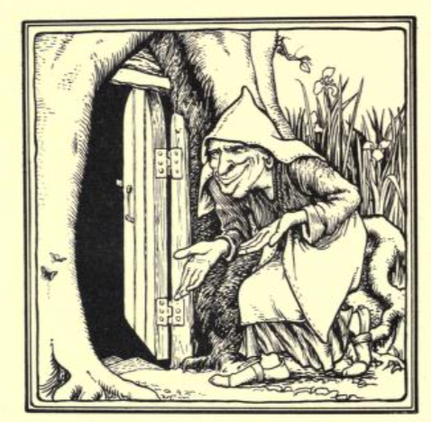

# Tom Tit Tot

In the summer of 2025, in one of his late night shows at Wickham Festival, I head Cliff Eastabrook, aka *The Travelling Talesman*, tall *Tom Tit Tot*, the English variant of *Rumpelstiltskin* followed by its sequel, *The Gypsy Woman*, itself a variant of Grimm's *The Three Spinners* (Neil Phillip also places the tales next to each other in *The Watkins Book of English Folktales*). I'm pretty sure I've heard this combination before, back in the day, but it was good to be reminded of it. Some time later, I came across a Devonshire variant of the tale (*Duffy and the Devil*) in the *Bristol Mercury* from 1867, and then a longer variant of *that* tale, based on a Christmas play, which presents the naming game *and* the trick to avoid spinning in the future, as a single tale.

This storynote pulls together several versions of the tale, starting with *Tom Tit Tot*.

*As ever, detailed comparisons of the tales are not provided here. The intention is simply to provided a convenient collection of story variants for storytellers to draw on in their own story research and preparation.*

## Tom Tit Tot, and The Gipsy Woman

The tale of *Tom Tit Tot* first make its appearance in the *Suffolk Notes and Queries* column in the *Ipswich Journal* in 1878.

```{admonition} Tom Tit Tot, 1878
:class: dropdown

https://www.britishnewspaperarchive.co.uk/viewer/bl/0000071/18780115/002/0001
Ipswich Journal - Tuesday 15 January 1878

Suffolk Notes and Querie. `[sic]`

No. XLIII

Notes.

125. An old Suffolk Folk-tale

TOM TIT TOT.

Well, once upon a time there were a woman, and she baked five pies. And when they come out of the oven, they was that overbaked, the crust were too hard to eat. So says she to her darter,

"Maw'r," says she, "put them there pies on the shelf, an' leave 'em there a little, an' they'll soon come agin." — She meant, you know, the crust 'ud get soft.

But the gal, she says to herself, "Well, if they'll come agin, I'll ate 'em now." And she set to work and ate 'em all, first and last.

Well, come supper time the woman she said; "Goo you and git one of them there pies. I dare say they've come agin now."

The gal she went, an' she looked, and there warn't nothin' but the dishes. So back she come and says she,

"Noo, they ain't come agin."

"Not none on 'em?" says the mother.

"Not none on 'em," says she.

"Well, come agin or not come agin," says the woman, "I'll ha' one for supper."

"But you can't if they ain't come," says the gal.

"But I can," says she. "Goo you and bring the best of 'em."

"Best or worst," says the gal, "I've ate 'em all, and you can't ha' one till that's come agin."

Well, the woman she was wholly bate, and she took her spinnin' to the door to spin, and as she spun she sang:

"My darter ha' ate five pies to-day,—"My darter ha' ate five, five pies to-day."

The king he were a comin' down the street, an' he hard her sing, but what she sang he couldn't hare, so he stopped and said,

"What were that you was a singun of, maw'r?"

The woman she were ashamed to let him hare what her darter had been a doin', so she sang 'stids o' that:

"My darter ha' spun five, five skeins to-day. — "My darter ha' spun five, five skeins to-day."

"S'ars o' mine!" said the king. "I never heerd tell of anyone as could do that."

Then he' said, "Look you here, I want a wife, and I'll marry your darter. But look you here," says he, "'leven months out o' the year she shall have all the vittles she likes to eat, and all the gownds she likes to git, and all the cump'ny she likes to hev, but the last month o' the year, she'll hev to spin five skeins iv'ry day, an' if she doon't, I shall kill her."

"All right," says the woman, for she thowt what a grand marriage that was. And as for them five skeins when te come tew, there'd be plenty o' ways of gettin' out of it, and, likeliest, he'd ha' forgot about it.

Well, so they was married. An' for 'leven months the gal had all the vittles she liked to ate, and all the gownds she liked to git, and all the cumpn'y she liked to hev.

But when the time was gettin' oover, she began to think about them there skeins, an' to wonder if he had 'em in mind. But not one word did he say about 'em, an' she wholly thowt he'd forgot 'em.

Howsivir, the last day o' the last month he takes her to a room she'd nivir set eyes on afore. There worn't nothing in it but a spinnin' wheel and a stool. An' says he, "Now me dear, hare you'll be shut in to-morrow with some vittles and some flax, and if you hain't spun five skeins by the night, yar hid'll goo off."

An' awa' he went about his business.

Well, she were that frightened. She'd allus been such a gatless mawther, that she didn't so much as know how to spin, an' what were she to dew to-morrer, with no one to come nigh her to help her? She sat down on a stool in the kitchen, and lork! how she did cry!

Howsivir, all on a sudden she hard a sort of a knockin' low down on the door. She upped and oped it, an' what should she see but a small little black thing with a long tail, that looked up at her right kewrious, an' that said:

"What are yew a cryin' for?"

"What's that to yew?" says she.

"Never yew mind," that said. "But tell me what you're a cryin' for."

"That oon't dew me noo good if I dew," says she.

"Yew doon't know that," that said, an' twirled that's tail round.

"Well," says she, "that oon't dew no harm, if that doon't dew no good," and she upped and told about the pies, an' the skeins an' everything.

"This is what I'll dew," says the little black thing, "I'll come to yar winder iv'ry mornin' an' take the flax, an' bring it spun at night."

"What's your pay?" says she.

That looked out o' the comers o' that's eyes, an' that said: "I'll give you three guesses every night to guess my name, an' if you hain't guessed it afore the month's up, yew shall be mine."

Well, she thowt she'd be sure to guess that's name afore the month was up. "All right," says she; "I agree."

"All right," that says, an' lork! how that twirled that's tail!

Well, the next day har husband he took her inter the room, an' there was the flax an' the day's vittles.

"Now, there's the flax," says he, "an' if that ain't spun up this night off goo yar hid." An' then he went out an' locked the door.

He'd hardly goon, when there was a knockin' agin the winder. She upped and she oped it, and there sure enough was the little oo'd thing a-settin' on the ledge.

"Where's the flax?" says he.

"Here te be," says she. An' she gonned it to him.

Well, come the evenin', a knockin' come agin the winder. She upped an' she oped it, and there were the little oo'd thing with five skeins of flax on his arm.

"Here te be," says he. An' he gonned it to her.

"Now what's my name?" says he.

"What is that Bill?" says she.

"Noo, that ain't," says he. An' he twirled his tail.

"Is that Ned?" says she.

"Noo, that ain't," says he. An' he twirled his tail.

"Well is that Mark?" says she.

"Noo, that ain't," says he. An' he twirled his tail harder, an' awa' he flew.

Well, when har husban' he come in, there was the five skeins riddy for him. "I see I shorn't hev for to kill yew to-night, me dare," says he. "Yew'Il hev yar vittles an' yar flax in the morning," says he, an' away he goes.

"Well, ivery day the flax an' the vittles they was browt, an' ivery day that there little black impet used for to come mornins and evenins. An' all the day the mawther she set a tryin' fur to think of names to say to it when te come at night. But she niver hot on the right one. An' as that got towarts the ind o' the month, the impet that began for to look soo maliceful, an' that twirled that's tail faster an' faster each time she gave a guess.

At last te came to the last day but one. The impet that come at night along o' the five skeins, an' that said:

"What! hain't yew got my name yet?"

"Is that Nicodemus?" says she.

"Noo, tain't," that says.

"Is that Sammle," says she.

"Noo, tain't," says he.

"A-well, is that Methusalem?" says she.

"Noo, tain't that norther," he says.

Then that looks at her with that's eyes like a cool o' fire, an' that say's, "Woman, there's only to-morrer night, an' then yar'll be mine." An' away te flew.

Well, she felt that horrud. Howsomediver, she hard the king a comin' along the passage. In he came, an' when he see the five skeins he says, says he:

"Well, me dare," says he, "I don't see but what yew'll ha' your skeins ready to-morrer night as well, an' as I reckon I shorn't ha' to kill you, I'll ha' supper in here to-night." So they brought supper, an' another stool for him, and down the tew they sat.

Well, he hadn't eat but a mouthful or so, when he stops, an' begins to laugh.

"What is it?" says she.

"A-why," says he, "I was out a huntin' to-day, an' I got away to a place in the wood I'd never seen afore. An' there was an old chalk pit. An' I heerd a sort of a hummin', kind o'. So' I got off my hobby an' went right quiet to the put, an' I looked down. Well, what should there be but the funniest little black thing yew iver set eyes on. An' what was that a dewin' on, but that had a little spinnin' wheel, an' that were a spinnin' wonnerful fast, an' a twirlin' that's tail. An' as that span, that sang:

"Nimmy, nimmy not,  
My name's Tom Tit Tot."

Well, When the mawther heerd this, she fared as if she could ha' jumped outer her skin for joy, but she din't say a word.

Next day, that there little thing looked soo maliceful when he come foo the flax. An' when the night came, she heerd that a knockin' agin the winder panes. She oped the winder, an' that come right in on the ledge. That were grinnin' from are to are, an' Oo! tha's tail were twirlin' round so fast.

"What's my name?" that says, as that gonned her the skeins.

"Is that Solomon?" she says, pretendin' to be afeard.

"Noo, t'ain't," that says, an' that come fudder inter the room.

"Well, is that Zebedee?" says she agin.

"Noo, t'ain't," says the impet. An' then that laughed an' twirled that's tail, till yew cou'n't hardly see it.

"Take time, woman," that says; "next guess an' you're mine." An' that stretched out that's black hands at her.

Well, she backed a step or two, an' she looked at it, and then she laughed out, an' says she, a pointin' of her finger at it,

"Nimmy, nimmy not,  
Yar name's Tom Tit Tot."

Well, when that hard her, that shruck awful, an' awa' that flew into the dark, an' she niver saw it noo more.

A. W. T.
```

The tale was republished just over twenty years later, in *Merry Suffolk*, along with a sequel, both of which were credited to Anna Walter Thomas (the *A.W.T.* referred to at the end of the Ipswich Journal column).

```{admonition} The best versions, 1899
:class: dropdown

https://archive.org/details/merrysuffolkmast00fiso
Merry Suffolk; Master Archie and other tales;
by Fison, Lois A; Thomas, Walter, Mrs, 1899

Publication date 1899

PREFACE

...

In "The Bookman" for [October, 1893 (page 21)](https://archive.org/details/sim_bookman_1893-10_5_25/page/21/mode/1up), Mr. Francis Groom wrote:— "Suffolk has the distinction of having produced by far the best versions of the old Folk Lore hitherto collected in England. They are three only in number — 'Cap o' Rushes,' 'Tom Tit Tot,' and 'Brother Mike.' They were contributed to a set of 'Suffolk Notes and Queries,' that I edited sixteen years ago for the *Ipswich Journal*. They are now being republished in an illustrated form by the Collectors, Mrs. Walter Thomas and Miss L. A. Fison, to whom as children they were told by their old nurse." `[Punctuation corrected to make it clear that the whole quote is due to Fancis Hindes Groome.]`

The Author is indebted to Mr. H. F. Euren and Mr. William Jarrold ..., for an introduction to Mr. William Bottrell's "Traditions and Heathside Stories of West Cornwall," printed in 1875, where a story will be found called "Duffy and the Devil." Here the family likeness to the old German Folk Story of "Tom Tit Tot" is plainly seen. The tale was given as a Christmas Play in Cornwall formerly.

We find here told, that a rich Squire, "Lovel," marries Duffy because he hears she is the best spinster and knitster in the county. By aid of an old witch, the girl Duffy gets the help of a devil called "Buck-a-boo," who spins for her, but demands as his reward that she shall marry him at the end of three years unless she can tell his name.

The Squire when hunting sees a band of witches dancing in a wood with "Buck-a-boo" their master. The witches sing,

"By night and by day,  
We will dance and play,  
With our noble captain,  
'Farraway,' 'Farraway.'"

Duffy finds the name therefore, when the Squire tells her what he has seen, and when the devil comes to carry Duffy away, she astonishes him by sa3'ing his name, and so escapes, as the Queen does in "Tom Tit Tot."

And in the second part or Sequel of this Tale, the heroine escapes from danger through the aid of the Wise Woman, much as the Queen in "Tom Tit Tot" does by the help of the Gipsies.

...

```

The opening few lines of *Tom Tit Tot* differ slightly in language to the version in the earlier *Ipswich Journal*, but then follows it almost exactly, except for the addition of a final extra line in the *Merry Suffolk* version.

```{admonition} Tom Tit Tot, 1899
:class: dropdown

https://archive.org/details/merrysuffolkmast00fiso
Merry Suffolk; Master Archie and other tales;
by Fison, Lois A; Thomas, Walter, Mrs, 1899

Publication date 1899

"TOM TIT TOT" & SEQUEL BY MRS. WALTER THOMAS.

pp. 9-17

TOM TIT TOT.

THE SUFFOLK VERSION OF GRIMM's TALE, "RUMPELSTILTSKIN."

WELL, once upon a time there were a woman, and she baked five pies, and when they come out of the oven, they was that overbaked the crust was too hard for to ate. Soo says she to her darter,

"Mawther," says she, "put them pies up on the shelf, du, and they'll soon come agin." (She meant the crust would get soft.)

Well, the gal set 'um on the shelf, and says she,

"Lork! if they pies'll come agin, I'll ate 'um all now," says she.

Soo she set too work and eat 'um all, first and last, that she did.

`[The tale then continues as per the Ipswich Journal, except that the attribution to A. W. T. is omitted, and the following final line is added:]`

Lork! how she did dap her hands for joy!" I'll warrant my master'll ha' forgot all about spinning next year," says she.
```

The sequel is given the title *The Gipsy Woman*.

```{admonition} Tom Tit Tot Sequel, 1899
:class: dropdown

https://archive.org/details/merrysuffolkmast00fiso
Merry Suffolk; Master Archie and other tales;
by Fison, Lois A; Thomas, Walter, Mrs, 1899

pp. 18-22

THE GIPSY WOMAN.

SEQUEL TO TOM TIT TOT.

WELL, the hool o' that yare the mawther `["Mawther," Suffolk for girl.]` she'd the best o' livin' an' the best o' cump'ny, till the 'leventh month was nare over.

An' then har husban' says to her, says he,

"Well, me dare, to-day that's the end o' the month, an' to-morrer you'll ha' to begin an' spin yar five skeins ivvery day."

She hadn't nivver given a thowt but what he'd clane forgotten about it, an' now what te dew she did not know. She knew she couldn't reckon noo moor on Tom Tit Tot, an' she couldn't spin a mite herself; an' now har hid 'ud hav to come off!

Well, pore toad, she set herself down agin on a stule in the back-house, an' she cried as if har heart 'ud break. All at onst, she hared someone a-knockin' at the door. Soo she upped an' onsnecked it, an' there stood a gipsy woman, as brown's a berry.

"Why, wha's this te-dew hare?" sez she. "What air yew a-cryin' for like that?"

"Git awa', yew golderin' mawther," says she. "Doon't yew come where yew ain't noo good."

"Tell me yar trouble, an' may be I shall be some good," says the woman.

Well she looked soo onderstandin' that the queen she upped an' toold her.

"Wha's that all?" sez she. "I ha' hoped folks out o' wuss than this, an' I'll help yew out o' this."

"Ah, but what de yew arst for dewin' of it?" sez the queen, for she thowt how she'd nare gonned herself awa' to that snaisly little black impet.

"I doon't ask nothun' but the best suit o' clothes yew ha' got," the gipsy said.

"Yow shall hev 'em an' welcome," says the queen, an' she runned an' ooped the hutch where har best gownd an' things was, an' giv 'em to the woman, an' a brooch o' gay goold. For she thowt to herself, "If she's a chate, an' can't help me, an' my hid is cut off, that woon't make no matters, if I hev giv awa' my best gownd."

The woman she looked rarely plazed when she see the gown, an' sez she,

"Now, then, yow'll ha' to ask all the fooks yew know to a stammin' grand partery. An' I'll come tew it."

Well, the mawther she went to her husband, an' says she,

"My dare, being that 'tis the larst night afoor I spin, I should like to hev a partery."'

"All right, me dare," sez he. Soo the fooks wuz all arst, an' they come in their best clothes: silks an' sattuns, an' all mander o' fine things. Well, they all had a grand supper o' the best o' vittles, an' they liked theirselves rarely well. But the gipsy woman she nivvir come nigh, an' the queen, har heart was in 'har mouth. One of the lords as was right tired o' dancin' said that worn't far from bull's noon, an' te wuz time te goo.

"Noo, noo, dew yew sta' a little longer," says the queen. "Le's hev a game o' blind man's buff fust."

So they began to play. Just then the door that flew open, an' in come the gipsy woman. She'd woished herself an' coomed har hair, an' whelmed a gay an' gah handkercher round har hid, an' put on the gran' gownd till she looked like the queen come in.

"S'ars o' mine, whu's that?" says the king.

"Oo, tha's a frind o' mine,' says the queen. An' she looked to see what the gipsy 'ud dew.

"What! are yew a-playin' blind man's buff?" sez she. "I'll jine in along o' ye."

An' soo she did. But in har pocket what wuz there but a little gotch of cold cart grease, an' as she run, she dipped har hand in this hare grease, an' smudged it on the fooks as she run by.

That wom't long afore somebody hollered out, "Oo, lork! there's some rare nasty stuff on my gownd!"

"Why, soo there is on mine," sez another. "That must ha' come off of yow."

"Noo, that that din't. Yew ha' put it on to me." An' then nigh ivverybody began to holler an' quarrel with ache other, ache one a-thinkin' that the tother had gone an' smirched 'em.

Well, the king he come forrerd an' he heerd what was the matter. The ladies was a-cryin' an' the gentlemen was ashouten', an' all their fine things was daubed over.

"Wha's this?" he sah, for there was a great mark on his coat-sleeve, an' says he, "Why, that's cart grease!"

"Noo, that ain't," sez the gipsy woman. "That's off my hand. Tha's spindle grease."

"Why, wha's spindle grease?" sez he.

"Well, says she, "I ha' been a great spinner i' my time, an' I span an' span an' span five skeins a day. An' becos I span se much the spindle grease, that, worked inter my hands, and now woish 'em as often as I may, I naster everything I touch. An' if yar wife spins like I, she'll ha' spindle grease like I."

Well, the king he looked at his coat-sleeve, an' he rubbed it, an' then he said,

"Look yew hare, me dare, an' listen what I sa' to yew. If ivver I see yew with a spindle agin in yar hands, yar hid'll goo' off."

An' tha's all.

*Gathered from her old nurse by Anna Walter Thomas.*

```

The book was reviewed by E. Sidney Hartland in the *Folklore* hournal a year later.

```{admonition} A little book of genuine folklore, 1900
:class: dropdown

https://archive.org/details/folklore11folkuoft/page/204/mode/2up?q=%22merry+suffolk%22


Folklore Vol. XL JUNE, 1900. [No. II.
pp204-6

Merry Suffolk, Master Archie, and other Tales : a Book of Folklore. By Lois A. Fison. With which is included "Tom Tit Tot" and Sequel, by Mrs. Walter Thomas. London: Jarrold & Sons. 1899.

This is a little book of genuine folklore, in parts just the least bit spoiled by being written up to a literary standard. For this purpose it has been thought necessary to cast the information in three of the chapters into the shape of imaginary narrative or quasidramatic sketches: a sort of sugar-coating for "the general reader" of the pill of folklore. Such too is the softening down of the catastrophe of the sequel to Tom Tit Tot. This sequel is really an independent story, not belonging to the cycle of Rumpelstilzchen, but equally well known on the Continent of Europe. The true catastrophe as told in Suffolk is less fit perhaps for the parlour than Mrs. Thomas's version; but then it did not originate in the parlour. It ought nevertheless to be preserved, and therefore I venture to give it to the readers of Folk-Lore. The story is the same up to the introduction of the gipsy-confederate into the party. She has put a dozen rotten eggs in her pocket. She sits down and "jiffeys and jiffeys" until they are broken. The lords and ladies all freely accuse each other "o' stinkin' like a fummard; till there was sech a te-dew that the King he said: 'I'll ha' te know hew 'tis is a-stinkin' like that.' So he made 'em set down all round. Then the gipsy-woman she got up an' said: ''Tis me as stinks.' 'A-well, yew naster pug, git hoom and woish yerself, and doon't yew come hare ne moore,' says he. 'Woishin' oon't dew it,' says she. 'When I were a gal, I were a great spinner, an' I span an' span, till my twatlin' thrids was broke; an' what's moore, if yar wife spins like I, she'll stink like I.' An' soo the King he says: 'Look yew hare, me dare, an' listen what I sa' te yew. If ivver I see yew with a spindle agin in yar hands, yar hid'll goo off.' An' tha's all."

Mrs. Thomas may indeed be congratulated on having preserved with great ingenuity in the version she has given the spirit and outline of the story. If it is not as it stands the lore of the folk, we must not forget that we are indebted to her for two of the best English folktales that have been preserved, "Tom Tit Tot" and "Cap o' Rushes," both very properly included here. Excellent they are, and excellently told. Her sister, Miss Fison, has done good service also in recording in the pages that follow them som.e of the superstitions, charms, customs, riddles, and sayings of the county. More than "a pretty custom" is that of giving a bunch of immortelles to a girl when betrothed. It must be given by a married friend, and its destination is to be given by the maiden to her lover, who will preserve her love as long as he keeps the flowers. Here, in a particularly beautiful form, is 

For other examples of belief and practice, I must refer readers to the book itself, which will be valued both within and without the county of Suffolk for its record of many things now fast passing or altogether passed away.

E. Sidney Hartland.
```

In the intervening years, the tale was picked up by Edward Clodd, who included it in *The Philosophy of Rumpelstiltskin*, a paper "read before the Folklore Society, 26th February, 1889" and published in *The Folk-Lore Journal*, Vol. 7, No. 2, 1889, [pp. 135-163](https://archive.org/details/bub_gb_8PMRAAAAYAAJ/page/134/mode/2up).

From that source, the tale of *Tom Tit Tot* then seems to have made its way into Joseph Jacobs' *English Fairy Tales* (1899).

*Neil Philip also notes that Mrs. Thomas took umbrage at Jacobs' use of the tale "without payment or acknowledgement" in a letter to *The Times*. Certainly, Jacobs' note to the story bears no mention of her as the collector.*

```{admonition} Jacobs, notes, 1899
:class: dropdown

https://archive.org/details/englishfairytal00jacogoog/page/n18/mode/2up?q=%22tom+tit%22
English Fairy Tales
by Joseph Jacobs

Publication date 1890

pp. 1-8

Note pp. 229-30

I. TOM TIT TOT.

Source, — Unearthed by Mr. E. Clodd from the "Suffolk Notes and Queries" of the Ipswich Journal, and reprinted by him in a paper on "The Philosophy of Rumpelstiltskin" in *Folk-Lore Journal*, vii. 138-43. I have reduced the Suffolk dialect.

Parallels. — In Yorkshire this occurs as "Habetrot and Scantlie Mab," in Henderson's *Folk-Lore of Northern Counties*, 221-6; in Devonshire as "Duffy and the Devil"' in Hunt's *Romances and Drolls of the West of England*, 239-47; in Scotland two variants are given by Chambers, *(Popular Rhymes of Scotland)*, under the title "Whuppity Stourie." The "name-guessing wager" is also found in "Peerifool," printed by Mr. Andrew Lang in *Longman's Magazine*, July 1889, also *Folk-Lore*, September, 1890. It is clearly the same as Grimm's "Rumpelstiltskin" (No. 14); for other Continental parallels see Mr. Clodd's article, and Cosquin, Contes pop. de Lorraine, i. 269 seq.

Remarks. — One of the best folk-tales that have ever been collected, far superior to any of the continental variants of this tale with which I am acquainted. Mr. Clodd sees in the class of name-guessing stories, a "survival" of the superstition that to know a man's name gives you power over him, for which reason savages object to tell their names. It may be necessary, I find, to explain to the little ones that Tom Tit can only be referred to as "that," because his name is not known till the end.

```

Edward Clodd certainly seems to have taken the tale to heart, taking his paper out "on tour" in 1893.

```{admonition} Philosophising upon a Suffolk Folk-tale, 1893
:class: dropdown

https://www.britishnewspaperarchive.co.uk/viewer/bl/0000071/18931007/046/0008
Ipswich Journal - Saturday 07 October 1893

AN OLD SUFFOLK FOLK-TALE.

Mr. Edward Clodd, the well-known scientific writer, has combined with his visit to Suffolk for the purpose of planting a rosebush, the offspring of another growing by the grave of Omar Khayyàm, the Persian poet, upon the resting-place of his great translator, Edward Fitzgerald, in Boulge churchyard, the[n] telling and philosophising upon an interesting Suffolk Folk-tale, under the auspices of the Ipswich Scientific Society, on Wednesday evening.

Mr. E. P. RIDLEY, president of the Society, who presided over a large and influential attendance, mentioned that it was thought advisable that the benefit of the lecture should be extended to a more inclusive circle than the members of the Society, and the Mayor had kindly granted the use of the Council Chamber.

The LECTURER, who was cordially received, observed that in the study of folk-lore they came across tales in widely distant lands, which presented the same fundamental ideas. One of the features of our age was the recognition of the value of things formerly ignored and regarded in the light of waste product. The study of folk-lore tended to no small gain in deepening our relations with our common humanity and the enlargement of our sympathies. Research brought us, more often than not, upon some deposit of early thought and mere instinctive feelings of a barbaric nature which the more enlightened ages ultimately verified, the strivings after a philosophy which embraced all humanity in one common origin and destiny. Mr. Clodd then ran over the familiar story of "Rumpelstiltskin," from "Grimm's Fairy Tales." The gist of this story was that a beautiful maiden was falsely represented by her father to be able to spin straw into gold, that she was seized by the King and ordered to perform this impossible task, and that in the extremity of despair she was able to do so with the assistance of a "funny little man," or fairy. The letter demanded a varying penalty unless the maiden could, within so many guesses, find out his name. This she was unable to do until the last moment, and then only because the King informed her of having accidentally met in the forest a "funny little man," who was muttering the magic name to himself. On hearing his name, the spell was broken and the dwarf vanished. Looking over a bundle of old numbers of the Ipswich Journal, in which were collected some odds and ends of Suffolk notes, by Mr. Francis Hindes Groome, who had edited them for that paper, he found the Suffolk version entitled, "Tom tit tot." It appeared that it was told by an old West Suffolk nurse to the lady from whom Mr. Groome received it, There was an apparently un. important prelude, after which the story ran much on the Grimm lines, but the dwarf was here a black impet. It was read by Mr. Clodd in broad Suffolk, and exceedingly quaint it was. The upshot was that the "mawther" was told the name by the King, who mentioned casually that "as he was out a-hunting to-day, there was an old chalk-pit, and he heard a sort of humming, kinder, and got off his bobby, and looking into the pit saw the funniest little black thing you ever set your eyes on. There was a little spinning wheel and it was spinning and singing

"'Niminy, niminy not,  
My name's Tom tit tot.'"

Accordingly she meets the "impet." "'What's my name?' that say, as that gonned her a scare.

"'Is that Solomon?' she sez, pretendin' to be afeared.

"' Noo tain't,' that say, 'an that coom fodder into the room.

'Well, is that Zebedee?' sez she agin.

"Noo taint,' says the impet, and then that laughed and twirled that's tail till you couldn't hardly see it.

'"Take time, missus,' that say, 'next guess and yar mine,' and that threw out that's black hand at her.

"Well, she backed a step or two, and she looked at it, and she laughed out, and sez she, a-pointing of her finger at it

"'Niminy niminy not,  
Yar name's Tom tit tot,'"

Well, when that hard har, that shruck awful, and that flew into the dark, and she never saw it no moor."

— Mr. Clodd proceeded to narrate versions of the same story from Cornwall, the Scottish Borders, Sweden and Norway. It existed as far off as Hungary, and Mr. Clodd quoted one from Asia, though here, to the unlearned judgment, the resemblance was remote. The root idea on which Mr. Clodd ably enlarged was the notion, common to barbaric modes of thought, that the name of any being, whether human or superhuman, was an integral part of that being, and that the being could be affected by dealing with his name, This lay at the root of fetish worship, idolatry, and witchcraft.

On the motion of Sir W. B. GURDON, seconded by Dr. BARTLET, a cordial vote of thanks was accorded to Mr. Clodd for his interesting paper.

```

A few years later, he would publish a further extended essay on the topic ([*Tom Tit Tot: an essay on savage philosophy in folk-tale, 1898*](https://archive.org/details/tomtittotessayon0000clod)).

In later years, the tale would continue to be of interest to folklorists, as for example in *Chapter VIII — Tom Tit Tot and Rumpelstilsken* of Yearsley Macleod's [The folklore of fairy-tale](https://archive.org/details/fairytales_201911/page/n165/mode/2up), 1924.

## Duffy and the Devil

First published in Robert Hunt's *Popular romances of the west of England* in 1865, it was reprinted in the *Bristol Mercury* of [Saturday 31 August 1867](https://britishnewspaperarchive.co.uk/viewer/bl/0000034/18670831/017/0006), which is where I saw it first.


Hunt notes TO DO

https://archive.org/details/s1popularromance00huntuoft/page/272/mode/2up?q=duffy

*Popular romances of the west of England*; or, The drolls, traditions, and superstitions of old Cornwall;
by Hunt, Robert, 1807-1887

Publication date 1865

pp. 273-84

[Duffy and the Devil]

The incidents of this story are strikingly similar to those in "Rumpel-stilzchen." The maiden in that tale has to spin straw into gold thread, and she, like Duffy, has to discover the name of the spirit who has befriended her.

Mr Robert Chambers, in his "Popular Rhymes of Scotland," has a fairy tale in which the fairy threatens the mother that she will have her "lad bairn" unless "ye can tell me my right name." The anxious mother takes a walk in the wood, and she hears the fairy singing —

"Little kens our gude dame at hame

That 'Whuppity Stoorie' is my name."

Of course, when the fairy comes to claim the "lad bairn," she is addressed as "Whuppity Stoorie," and she at once disappears.

In "Who Built Reynir Church?" in the "Icelandic Legends" of Jon Arnason, the story turns on the discovery of the name of the builder. — Icelandic Legends, p. 49.


The story itself TO DO

```{admonition} Duffy and the Devil, 1867 (1865)
:class: dropdown

*Bristol Mercury* of [Saturday 31 August 1867](https://britishnewspaperarchive.co.uk/viewer/bl/0000034/18670831/017/0006)

DUFFY AND THE DEVIL.

A CORNISH LEGEND.

[We take the following amusing legend from "Popular Romances of the West of England; or, the Drolls, Traditions, and Superstitions of old Cornwall; collected and edited by Robert Hunt, F.R.S.," a work which was noticed some time ago in our columns.]

Many of the superstitions of our ancestors are preserved in quaint, irregular rhymes, the recitation of which was the amusement of the people in the long nights of winter. These were sung, or rather said, in a monotone, by the professional Drolls, who doubtless added such things as they fancied would increase the interest of the story to the listeners. Especially were they fond of introducing known characters on the scene, and of mixing up events which had occurred within the memory of the old people with the more ancient legend. The following story, or rather parts of it, formed the subject proof one of the Cornish Christmas plays. When, I was a boy, I well remember being much delighted with the coarse acting of a set of Christmas players, who exhibited in the "great hall" of a farmhouse at which I was visiting, and who gave us the principal incidents of Duffy and the Devil Terrytop; one of the company doing the part of Chorus, and filling up by rude descriptions-often in rhyme—the parts which the players could not represent.

It was in cider-making time. Squire Lovel of Trove, or more correctly, Trewouf, rode up to Burian Church-town to procure help, boys and maidens were in request, some to gather the apples from the trees, others to carry them to the cider-mill. Passing along the village as hastily as the dignity of a squire would allow him, his attention was drawn to a great noise-scolding in a shrill treble voice, and crying—proceeding from Janey Chygwin's door. The squire rode up to the cottage, and he saw the old woman beating her step-daughter Duffy about the head with the skirt of her swing tail gown, in which she had been carrying out the ashes. She made such a dust that the squire was nearly choked and almost blinded with the wood ashes.

"What cheer, Janey?" cries the squire; "what's the to-do with you and Duffy?"

"Oh, the lazy huzzy!" shouts Janey, "is all her time courseying and courranting with the boys! she will never stay in to boll the porridge, knit the stockings, or spin the yarn."

"Don't believe her, your honour," exclaims Duffy; "my knitting and spinning is the best in the parish".

The war of tongues continued in this strain for some time, the old squire looking calmly on, and resolving in his mind to take Duffy home with him to Trove, her appearance evidently pleasing him greatly. Squire Lovel left the old and young woman to do the best they could, and went round the village to complete his hiring. When he returned peace had been declared between them; but when Lovel expressed his desire to take Duffy home to his house to help the housekeeper to do the spinning, "A pretty spinner she is" shouted old Janey at the top of her voice. "Try me, your honour," said Duffy, curtseying very low; "my yarns are the best in the parish."

"We'll soon try that," said the squire; "Janey will be glad to get quits of thee, I see, and thou'lt be nothing loth to leave her; so jump up behind mle, Duffy."

No sooner said than done. The maid Duffy, without ceremony, mounted behind the squire on the horse, and they jogged silently down to Trove. Squire Lovel's old housekeeper was almost blind — one eye had been put out by an angry old wizard,and through sympathy she was rapidly losing the power of seeing with the other. This old dame was consequently very glad of some one to help her in spinning and knitting. The introduction over, the housekeeper takes Duffy up into the garret where the wool was kept, and where the spinning was done in the summer, and requests her to commence her work.The truth must be told; Duffy was an idle slut, she could neither knit nor spin. Well, here she was left alone, and, of course, expected to produce a good specimen of her work. The garret was piled from the floor to the key-beams with fleeces of wool. Duffy looked despairingly at them, and then sat herself down on the "turn"— the spinning-wheel — and cried out, "Curse the spinning and knitting. The devil may spin and knit for the squire for what I care."

And scarcely had Duffy spoken these words than she heard a rustling noise behind some woolpacks, and forth walked a queer-looking little man, with a remarkable pair of eyes, which seemed to send out flashes of light. There was something uncommonly knowing in the twist of his mouth, and his curved nose had an air of curious intelligence. He was dressed in black, and moved towards Duffy with a jaunty air, knocking something against the floor at every step he took.

"Duffy dear," said this little gentleman, "I'll do all the spinning and knitting for thee."

"Thank'e," says Duffy, quite astonished.

"Duffy, dear, a lady shall you be."

"Thank'e, your honour," smiled Duffy.

"But, Duffy dear, remember," coaxingly said the queer little man—"remember — that for all this, at the end of three years you must go with me unless you can find out my name."

Duffy was not the least bit frightened, nor did she hesitate long, but presently struck a bargain with her kind but unknown friend, who told her she had only to wish, and her every wish should be fulfilled; and as for the spinning and knitting, she would find all she required under the black ram's fleece. He then departed. How, Duffy could not tell, but in a moment the queer little gentleman was gone. Duffy sung in idleness, and slept until it was time for her to make her appearance. So she wished for some yarns, and looking under the black fleece she found them. Those were shown by the housekeeper to the squire, and they both declared "they had never seen such beautiful yarns." The next day Duffy was to knit this yarn into stockings. Duffy idled, as only professed idlers can be idle; but in due time, as if she had been excessively industrious, she produced a pair of stockings for the old squire. If the yarn was beautiful, the stockings were beyond all praise. They were as fine as silk, and as strong as leather. Squire Lovel soon gave them a trial; and when he came home that night after hunting, he declared he would never wear any other than Duffy's stockings. He had wandered all day through brake and briar, furze and brambles, there was not a scratch on his legs, and he was as dry as a bone. There was no end to his praise of Duffy's stockings.

Duffy had a rare time of it now — she could do what she pleased, and rove where she willed. She was dancing on the mill-bed half the day, with all the gossiping women who brought their grist to be ground. In those "good old times", the ladies of the parish would take their corn to milled, and serge the flour themselves. When a few of them met together, they would either tell stories, or dance whilst the corn was grinding. Sometimes the dance would be on the mill-bed, sometimes out side on the green. On some occasions the miller's fiddle would be in request, at others the "crowd" (a sieve covered with sheep-skin) was made to do the duty of a tambourine. So Duffy was always finding excuses to go to mill, and many "a round" would she dance with the best people in the parish.

Old Bet, the miller's wife, was a witch, and she found out who did Duffy's work for her. Duffy and old Bet were always the best of friends, and she never told any one about Duffy's knitting friend, nor did she ever say a word about the stockings being unfinished. *There was always a stitch down.*

On Sundays the people went to Burlan Church, from all parts, to look at the squire's stockings; and the old squire would stop at the Cross, proud enough to show them. He could hunt:

"Through brambles and furze in all sorts of weather:  
His old shanks were as sound as if bound up in leather."

Duffy was now sought after by all the young men of the country; and at last the squire, fearing to lose a pretty girl, and one who was so useful to him, married her himself, and she became, according to the fashion of the time and place, Lady Lovel; but she was commonly known by her neighbours as the Duffy Lady.

Lady Lovel kept the devil hard at work. Stockings, all sorts of fine underclothing, bedding, and much ornamental work, the like of which was never seen, was produced at command, and passed of as her own. Duffy pased a merry time of it, but somehow or other she was never happy when she was compelled to play the lady. She passed much more of her time with the old crone at the mill than in the drawing-rooms at Trove. The squire sported and drank, and cared little about Duffy, so long as she provided him with knitted garments. The three years were nearly at an end. Duffy had tried every plan to find out the devil's name, but had failed in all. She began to fear that she should have to go with her queer friend, and Duffy became melancholy. Old Bet endeavoured to rouse her, persuading her that she could, from her long experience, and many dealings with the imps of darkness, at the last moment put her in the way of escaping her doom. Duffy went day after day to her garret, and there each day was the devil gibing and jeering till she was almost mad. There was but another day. Bet was seriously consulted now, and as good as her word, she promised to use her power. Duffy Lady was to bring down to the mill that very evening a jack of the strongest beer she had in the cellar. She was not to go to bed until the Squire returned from hunting, no matter how late, and she waged to make no remark in reply to anything the squire might tell her. The jack of beer was duly carried to the mill, and Duffy returned home very melancholy to wait for the squire. No sooner had Lady Lovel left the mill than old Bet came out with the "crowd" over her shoulders, and the blackjack in her hand. She shut the door, and turned the water off the mill-wheel,—threw her red cloak about her, and away. She was seen by her neighbours going, towards Bolelt. A man saw the old woman trudging past the Pipers, and through the Dawnse Main into the downs, but there he lost sight of her, and no one could tell where old Bet was gone to at that time of night.

Duffy waited long and anxiously. By and by the dogs came home alone. They were covered with foam, their tongues were hanging out of their mouths, and all the servants said they must have met the devil's hounds without heads. Duffy was seriously alarmed. Midnight came but no squire. At last he arrived, but like a crazy, crack-brained man, he kept singing,

"Here's to the devil,  
With his wooden pick and shovel."

He was neither drunk nor frightened, but wild with some strange excitement. After a long time Squire Lovel sat down, and began, "My dear Duffy, you haven't smiled this long time; but now I'll tell 'e something that would make ye laugh if you're dying. If you'd seen what I've seen to-night, ha, ha, ha!

"Here's to the devil,  
With his wooden pick and shovel."

True to her orders, Duffy said not a word, but allowed the squire to ramble on as he pleased, At length he told her the following story of his adventures, with interruptions which have not bean retained, and with numerous coarse expressions which are best forgotten:— 

"Duffy, dear, I left home at break of day this morning. I hunted all the moors from Trove to Trevider, and never started a hare all the live-long day. I determined to hunt all right but that I'd have a brace to bring home, So, at nightfall I went down Lemorna Bottoms, then up Brene Downses, and as we passed the Dawnse Main up started a hare, as fine a hare as ever was seen. She passed the Pipers, down through the Reens, in the mouth of the dogs half the, time, yet they couldn't catch her at all. As fine a chase as ever was seen, until she took into the Fugoe Hole. `[There is a tradition firmly believed on the lower side of Burian, that Fugoe Hole extends from the cliffs under ground so far that the end of it is under the parlour co the Tremewen's house in Trove, which is the only remaining portion of the old mansion of the Lovels. Here the witches were in the habit of meeting the devil, and holding their Sabbath. Often his dark highness has been heard piping, while the witches danced to his music. A pool of water some distance from the entrance prevents any adventurer from exploring the "Hole" to its termination. Hares often take refuge in the Fugoe Hole, from which they have never been known to return.]` In went the dogs after her, and I followed, the owls and bats flying round my head. On we went, through water and mud, a mile or more, I'm quite certain. I didn't know the place was so long before. At last we came to a broad pool of water, when the dogs lost the scent, and ran back past me howling and jowling, terrified almost to death! A little further on I turned round a corner, and saw a glimmering fire on the other side of the water, and there were St. Leven witches in scores. Some were riding on ragwort, some on brooms, some were floating on their three-legged stools, and some, who had been milking the little good cows in Wales, had come back astride of the largest leeks the could find. Amongst the rest there was our Bet of the Mill, with her 'crowd' in her hand, and my own blackjack slung across her shoulders. In a short time the witches gathered round the fire, and blowed it up, after a strange fashion, till it burned up into a brilliant blue flame. Then I saw amongst the rest a queer little man In black, with a long forked tail, which he held high in the air and twirled around. Bet struck her 'crowd' as soon as he appeared, and beat up the tune,

'Here's to the devil,  
With his wooden pick and shovel,  
Digging tin by the bushel,  
With his tail cock'd up!'

Then the queer little devil and all danced like the wind, and went faster and faster, making such a clatter, 'as if they had on each foot a pewter platter.' Every time the man in black came round by old Bet, he took a good pull from my own blackjack, till at first, as if he had been drinking my best beer, he seemed to have lost his head, when he jumped up and down, turned round and round, and roaring with laughter, sung,  

'Duffy, my lady, you'll never know-what? —  
That my name is Terrytop, Terrytop-top.'

When the squire sung those lines, he stopped suddenly, thinking that Duffy was going to die. She turned pale and red, and pale again. However, Duffy said nothing, and the squire proceeded:— 'After the dance, all the witches made a ring around the fire, and again blew it up, until the blue flames reached the top of the 'Zawn' `[Zawn — a cavernous gorge.]`. Then the devil danced through and through the fire, and springing ever and anon amongst the witches, kicked them soundly. At last — I was shaking with laughter at the fun — I shouted, 'Go it, Old Nick!' and, lo, the lights went out. And I had to fly with all my speed, for everyone of the witches were after me. I scampered home somehow, and here I am. Why don't you laugh, Duffy?" Duffy did laugh, and laugh right heartily now, and when tired of their fun, the squire and the lady went to bed.

The three years were up within an hour. Duffy had willed for an abundant supply of knitted things, and filled every chest in the house. She was in the best chamber trying to cram some more stockings into a big chest, when the queer little man in black appeared before her.

"Well, Duffy, my dear," said he, "I have been to my word, and served you truly for three years as we agreed, so now I hope you will go with me, and make no objection." He bowed very obsequiously, almost to the ground, and regarded Duffy Lady with a very offensive leer.

"I fear," smiled Duffy, "that your country is rather warm, and might spoil my fair complexion."

"It is not so hot as some people say, Duffy," was his reply; "but come along, I've kept my word, and of course a lady of your standing will keep your word also. Can you tell me my name?"

Duffy curtsied, and smilingly said, "You have behaved like a true gentleman, yet I wouldn't like to go so far." The devil frowned, and approached as if he would lay forcible hands upon her. "Maybe your name is Lucifer?"

He stamped his foot and grinned horridly. "Lucifer! Lucifer! He is no other than a servant to me in my own country." Suddenly calming again, he said quietly, "Lucifer! I would scarcely be seen speaking to him at court. But come along. When I spin for ladies I expect honourable treatment at their hands. You've two guesses more. But they are of little use; my name is not generally known on earth."

"Perhaps," smiled Duffy again, "my lord's name is Beelzebub?"

How he grinned, and his sides shook with convulsive joy.

"Beelzebub!" says he; "why, he's little better than the other, a common devil, he. I believe he's some sort of a cousin — a Cornish cousin, you know."

"I hope your honour," curtsied Duffy, "will not take offence. Impute my mistake to ignorance."

Our Demon was rampant with joy; he danced around Duffy with delight, and was, seeing that she hesitated, about to seize her somewhat roughly.

"Stop! stop!" shouts Duffy; "perhaps you will be honest enough to admit that your name is Terrytop?"

The gentleman in black looked at Duffy, and she steadily looked him in the face. "Terrytop! deny it if you dare," says she.

"A gentleman never denies his name," replied Terrytop, drawing himself up with much dignity. "I did not expect to be beaten by a young minx like you, Duffy but the pleasure of your company is merely postponed." Wth this Terrytop departed in fire and smoke, and all the devil's knitting suddenly turned to ashes.

Squire Lovel was out hunting, away far on the moors; the day was cold and the winds piercing. Suddenly the stockings dropped from his legs and the homespun from his back, so that he come home with nothing on but his shirt and his shoes, almost dead with cold. All this was attributed by the squire to the influence of old Bet, who, he thought, had punished him for pursuing her with his dogs when she had assumed the form of a hare.

The story, as told by the Drolls, now rambles on. Duffy cannot furnish stockings. The squire is very wroth. There are many quarrels—mutual recriminations. Duffy's old sweet-heart is called in to beat the squire, and eventually peace is procured, by a stratagem of old Bets, which would rather shock the sense of propriety in these our days.

```

--

jack - leather drinking 


https://archive.org/details/cu31924029890526/page/n8/mode/2up

Traditions and hearthside stories of West Cornwall
by Bottrell, William, 1816-1881

Publication date 1873

pp. 1-26

DUFFY AND THE DEVIL.

AN OLD CHRISTMAS PLAY.

Part First.

Open your doors, and let me in, I hope your favours I shall win;  
Whether I rise, or whether I fall, I'll do my best to please you all.

Christmas Play of St. George and Ihe Dragon.

ASSOCIATED with Trove and the ancient family who lived, for many generations, in that pleasant place, there is a tradition that one old Squire Lovell wedded a poor girl solely because he believed her to be the best spinster and knitster in Buryan; but that all the fine stockings and other knitted garments with which she provided her husband were made by a devil. This droll formed the subject of an old Guise-dance (Christmas Play) which is all but forgotten: yet, in our youth, we have heard a few scenes rehearsed, which may be interesting as an example of a primitive drama of West Penwith, that may have succeeded, or been contemporary with, the miracle plays which, about three centuries ago, were acted in the Plan-an-gwarre, St. Just, and at the Church-town cross in most other western parishes. This uncouth piece shows something of the rude and simple humour of old times, when people were quite as innocent, though less fastidious, than in our days.

Great part of the dialogue appears to have been improvised, as the actor's fancy dictated. Yet there were some portions in rude verse, -which would seem to have been handed down with little variation. Mimical gesticulation expressed much of the story; and when there was unwonted delay in change of scene, or any hitch in acting, in came the hobby-horse and its licenced rider, to keep the mirth from flagging. This saucy jester being privileged to say whatever he pleased, kept the audience in good humour by filling up such intervals with burlesque speeches on any matters which had taken place during the past year, that furnished fit subjects for ridicule.

A hall, farmhouse-kitchen, barn, or other out-house, served for a theatre, and a winnowing-sheet, suspended from key-beams or rafters, made a drop-curtain. Father Christmas, as chorus, described the scene, and told the company what characters the actors represented, unless they introduced themselves, as was frequently the case, like St. George, saying, "Here comes I, a champion bold," &c. He also narrated such parts as could not be acted conveniently.

Our simple actors got up their dresses in as old-fashioned and smart a style as they were able to contrive them, by begging or borrowing cast-off finery from the gentry round. Male players were often seen rigged- in long-waisted, gay-coloured coats, having their skirts spread out with straw, instead of buckram or bombast, and resplendent with brass or tin buttons, large as crown pieces, and long ruffles at their breasts and wrists; their breeches were of blue, red, or buff, slashed, puffed, and tricked out with ribbons, tassels, and knee-buckles. Their hose was of any bright hue, to make a strong contrast to the small clothes. High-heeled shoes were adorned with shining buckles or bows of ribbons. Yet their greatest pride was displayed in steeple-crowned or cocked hats, surmounted with plumes and decked with streamers of gay ribbons.

Our rural actresses also wore steeple-crowns fixed high above their heads on pads; stiffen-bodied, long-waisted gowns, with bag skirts or long trains; ruffles hanging from their elbows, wide stiff ruffs round their necks; and any other remnants of old finery that they could contrive to get.

It is somewhat curious that in this old guise-dance, or story about Madame Lovell and the devil, several ladies belonging to noted families who lived in Buryan, two or three centuries ago, are represented as bringing their corn to Trove Mill to be ground and as serging (bolting) their flour themselves. The names of Mesdames Cardew, Pender, Nov, Trezilian, &c., are taken by these ladies, whose gossip forms a kind of by-play.

We now purpose to reproduce a few well-remembered scenes, as we have heard them related many years ago, by old folks of Bui-yan, and to simply toll the story as expressed by others. Yet With a feeling somewhat akin to regret, we have curtailed some portions, in order to exclude whatever might, now, be regarded as indelicate: there is sufficient, however, preserved to carry on the story as far as it is likely to interest or amuse any but antiquarian students who might prefer, with all its blemishes, an unmutilated picture of such "merrie disports" as were usual at Christmas-tide with our simple-honest forefathers.

Characters:-

SQUIRE LOVELL, *of Trove*.  
DUFFY, *a poor girl, who became Madame Lovell*.  
HUEY LENINE, *Duffy's lover*.  
Jenny Chyowin, *Duffy's stepmother*.  
A BUCKA-BOO, *or Devil*.  
Betty, *the witch of Trove Mill*.  
JONE, *Squire Lovell's housekeeper*.  
*Several ladies and gentlemen, and witches.*

Scene i. — Father Christmas, with long hoary hair and beard enters before the curtain, and says: — "Ladies and gentlemen, — Please to take it that we are in Buryan Church-town, in the cider-making time. Squire Lovell is come up to get help to gather in his apples. When the curtain rises you wll see him at Jenny Chygwin's door."

Curtain raised. Squire Lovell is seen on his horse (a hobby horse); an old woman and a young woman scolding within.

Squire:— Hullo! in there! Jenny, what's all the caperrouse with you and the maid, I'd like to know?"

Duffy rushes out, and round the stage, followed by old Jenny, her stepmother, who beats the girl with the skirt or kirtle of her gown, saying, "I will break every bone in her body; the lazy hussy is all the time out courseying, and corantan, with the boys. She will neither boil the porridge, knit nor spin."

Duffy runs to the Squire, saying "Don't e believe her, your honour. I do all the work, whilst she is drunk from morning till night, and my spinning and knitting is the best in Church-town. Your stockings are nothing so fine as I can make."

Squire:— "Stop beating the maid, Jenny, and choaking one with dust from the skirt of thy old swing-tail gown. And, Duffy, as thou canst spin and knit so well, come down to Trove and help my old Jone, who is blind on one eye and can't see much with the other, as any one may know by looking at the bad dams in my stocking and patches on my breeches. Come away, on to the heaping-stock. Jump up: you can ride down behind me without pillion or pad."

Squire rides off: Duffy follows.

Jenny:— "Aye, go thee ways with the old bucca, and good riddance of bad rummage."

*(Curtain drops.)*

Scene ii. At Squire Lovell's door. — Squire on Horseback : Duffy standing beside him.

Squire calls:— "Jone, come here and take in Duffy Chygwin, who is come down to help thee knit and spin, give her some bread and cheese, and beer: dost thou hear?"

Squire rides off.

JONE comes out, and says:— "Oh, Duffy, my dear, I am glad to see thee here, for I want help sorely ever since that villain, Tom Chynance, put out the sight of my eye because I seed his thievish tricks in stealing from the standings one night in Penzance."

JONE tells us a long story which we omit, as it can be found in the first series of *Traditions and Hearth-side Stories of West Cornwall*. `[[One-eyed Joan's Tale, p. 213.](https://sacred-texts.com/neu/celt/swc1/swc133.htm)]` She concludes by saying, "Now you needn't eat any bread and cheese, as dinner will be ready soon. You can go up to the loft whenever you please and card wool to spin in the afternoon."

Scene iii. — A room in which are seen fleeces of wool, a turn (spinning-wheel) and other appliances for spinning. Duffy seated, carding and making rolls of wool, which were placed in a cayer (winnowing seive.) Over a while she rises and exclaims:—

"Cuss the carding and spinning!"What the devil shall I do now the wool is carded, for I can neither spin nor knit, and the devil take such work for me."

From behind some wool comes a devil, in the shape of a black man, with half-cocked, squinting eyes, and the barbed or forked tip of his tail just seen below his coat skirts.

Devil:— "My dear, here I am, come at your call, ready to do all you wish for very little pay. Only agree to go with me at the end of three long years, and for all that time I'll do your spinning and knitting and everything else you wish for, and even then, if you can tell me my name at three times asking, you may go or stay, till another time."

Duffy:— "Well, I don't mind much: anything for a change. What ded'e say you were called?"

Devil, winking:— "You have only to prick your arm and draw blood to sign our agreement you know."

Duffy:— My word is as good as my mark. Spin and knit for me if you will; and I'll have, that while, a courant in the orchard and a dance at the mill."

In leaving, Duffy says:— "Bolt the door, that no one may see who is doing the work."

"Stop and let me take the measure of your foot," says the devil, "in stringing the wheel as handy as if he had been used to spinning all his life."

Father Christmas comes before the curtain and says:— "Good people, you see that Duffy wans't at all scared at the Bucca-boo's appearance, because in old times people were so much used to dealings with the devil — women especially — that they didn't mind him. Duffy is now gone off by the outer door and stair, to merrily pass the day; and old Jone, hearing a rumble all through the house, thinks her to be busy at work."

Duffy passes a great part of her time at Trove Mill, near at hand; where a crowd of women high and low, meet to take their turn at grinding, serging, &c. Whilst some work others tell stories, sing, or dance on the green, near which grew many old oaks, sycamores, and elms, in a place still called the rookery, a little above.

There was a great friendship between Duffy and Old Betty, who worked the mill, because this old dame, having long had strange dealings, saw at once, by a stocking Duffy pretended to be knitting, that a stitch was always down and that the work was none of hers.

In the evening, Duffy hearing, when she came in, the devil still spinning, thought she would see him at work and try to learn something. Looking through the latch-hole she saw what she took to be a woman, seated, and spinning with a small treddleturn such as is used for spinning thread, and the wool-turn (with a wheel as large as that of a coach) put aside. When she looked around she knew that it was only the devil dressed in clothes like what she wore. He had on a loose bed-gown, petticoat, and towser (large coarse apron or wrapper,) with a nackan (large 'kerchief) thrown loosely over his head and shoulders. As Duffy entered, he turned around and said, "How are'e, my dear? Here I am, you see, busy at work for'e. See what I've already spun," he continued, pointing to a heap of balls in the corner, and skeins of yarn hanging on the walls.

She stood wondering, with eyes and mouth wide open, to see how handy the devil spun, and yet seemed to do nothing with his hands but pull off the yarn whilst his foot worked the treddle, and a ball dancing on the floor wound up itself!

"Arreah! faix," said Duffy, "I should have taken 'e for a woman if I hadn't chanced to spy your cloven foot, and your tail hanging down, and I don't much admire 'e in petticoats."

"There's good reason for wearing them, however," replied he; "besides, they are handy for such work, and if you will come here on Saturday night you will find, under that black fleece, ever so many pairs of stockings, both for you and the squire. I know his measure, and see if I don't well fit both of ye. So now good night."

Before she could wish him the same he disappeared, and all the yarn of his spinning along with him, leaving nothing to show that he had ever been there but a strong smell of brimstone.

Duffy didn't wait till dark night on Saturday, but went up to the wool-chamber about sunset. The Bucca-boo had just left work, and, having thrown off his petticoats, stood before her dressed like a sporting gentleman. He bowed as she entered and, handing her half-a-dozen pairs of stockings, all as strong as broadcloth and as fine as silk, said, "Excuse me, my dear, from staying a moment longer, as I must be away before Buryan bells are rung; else, some mishap may befall me."

"I wish 'e well till I see 'e again, and thank 'e, Mr. Whatshall-I-call-'e," said Duffy, taking the stockings from his hand.

"You may call me captain," he replied, and vanished in a flash of lightning with a roar of thunder that shook the house.

On Sunday morning, when Squire Lovell was getting ready to don his velvet suit, that he might ride to church in grand state, as was his wont, Duffy brought him a pair of stockings suitable for the occasion.

"You see, master," said she, "that I havn't been idle, to spin and knit ye a pair of such long stockings in three days and the work so fine too." He put on the stockings, admired the beautiful knitting and good fit; then to show his delight at having such nice hose, the like of which were never on his legs before, he kissed Duffy again and again.

It was late when he reached Church-town. After churching, he stopped, as usual, to exchange greetings with other gentry of Buryan. Everyone admired his fine stockings. The ladies enquired how and where he procured them, saying there was no one in the parish who could do such good work; one and all declared they were fit for a king.

The fame of Squire Lovell's stockings drew crowds of people to Buryan church on the following Sunday. Old and young wanted to feel his legs. They couldn't be satisfied with looking, and so they continued to come from farther and farther, Sunday after Sunday. Church-town, for some weeks, was full of people like on a fair or feasten tide.

[It will be understood that great part of the foregoing, as well as the narrative parts of what follows, is related by Father Christmas, in his character of Chorus. He enters into details about the devil's wonderful spinning with a turn (spinning-wheel) of his own invention, that took wool from the fleece, without carding, and passed it into the spinster's hands all ready for knitting or weaving. He also related many other surprising exploits of these sable gentry, such as their church-building in out-of-the-way places, like that of St. Levan, of their amiable intercourse with witches, &c. Thus, as fancy dictated, he entertained his audience until the curtain rose.]

"We next behold Squire Lovell's kitchen, with Jone, rather the worse for liquor, on a chimney-stool or bench in a broad and deep fire-place, such as used to be found in every West-country mansion, when wood and turf were the only fuel. She makes awful groans and screeches, till Duffy enters. Then Jone says "Oh Duffy, you can't think what cramps I have in my stomach and wind in my head, that's making it quite light. Help me over stairs to bed, and you wait up to give master his supper."

The old housekeeper is led off by Duffy, who soon returns and seats herself on the chimney-stool.

Then Huey Lenine enters and says:— "What cheer, Duffy, my dear? Now thee cus'nt (can'st not) say that the lanes are longer than the love, when I'm come to see thee with this rainy weather."

"Joy of my heart," said she, "come by the fire and dry thyself."

Huey sits on the outer end of the chimney-stool. After a long silence, the following dialogue takes place:—

Duffy:— "Why dos'nt thee speak to me than, Huey?"

Huey:— "What shall I say than?"

Duffy:— "Say thee dos't love me, to be sure."

Huey:— "So I do."

Duffy:— "That's a dear. — Brave pretty waistcoat on to you, than, Huey."

Huey:— "Cost pretty money too."

Duffy:— "What ded a cost than?"

Huey:— "Two and twenty pence, buttons and all."

Duffy:— "Take care of an than."

Huey:— "So I will."

Duffy:— "That's a dear."

Another prolonged silence.

Huey continues:— "I'm thinkan we will get married next turkey season if thee west (thou wilt.")

Duffy:— "Why doesn't thee sit a little nearer than?"

HUEY:— "Near enough I bla (believe.")

Duffy:— "Nearer the fire, I mean. Well, I'll be married to thee any day, though thee art no beauty, to be sure."

Huey gets. a little nearer.

Duffy, putting her hand on his face, "Thy face is as rough as Morvah Downs, that was ploughed and never harved (harrowed) they say; but I'll have thee for all that and fill up with putty all the pock-mark pits and seams; then paint them over and make thee as pretty as a new wheelbarrow."

The squire is heard outside calling his dogs. Duffy starts up in a fright, seizes a furze-prong, and says, "Master will be here in a minute, jump into the huccarner (wood-corner) and I'll cover thee up with the furze."

Huey hesitates.

Duffy:— "Then crawl into the oven: a little more baking will make thee no worse."

Huey gets into an oven, opening on to the fire-place and behind the chimney-stool, just as the Squire enters and calls out,

"Joan, take up the pie, if its ready or raw. I'm as hungry as a hound."

Duffy, rising to uncover a pie that was baking on the hearth, says, "Master, I have staid up to give ye your supper, because An Joan es gone to bed very bad with a cramp in her stomach and wind in her head, so she said."

"Why I heard thee talking when I came to the door, who was here then?" demanded the Squire.

"Only a great owl, master dear," she replied, "that fell down from the ivy-bush growing over the chimney and perched hisself there on the stool, with his great goggle eyes, and stood staring at me and blinkan like a fool. Then he cried Hoo! boo! Tu-"wit, tu-woo; and, when you opened the door, he flew up the chimney the same way he came down."

The Squire, satisfied with Du£fy's explanation, advances, and puts his foot on the hearth-stone, looks at his legs, saying, "Duffy, my dear, these are the very best stockings I ever had in my life. I've been hunting all day, over moors and downs, through furze and thorns, among brambles and bogs, in the worst of weather, yet there isn't a scratch on my legs and they are as dry as if bound up in leather."

The Devil (supposed to be invisible) rises behind Duffy and grimaces at the Squire.

Duffy:— "I may as well tell 'e master that I shan't knit much more for 'e, because Huey Lenine and I have been corn-tan for a long time. We are thinkan to get married before winter, and then I shall have a man of my own to work for."

Squire:— "What! Huey Lenine! I'll break every bone in hie carcase if he shows his face near the place. Why the devil is in it that a young skit like thee should have it in thy head to get married! Now I'll sit down a minute and talk reason with thee."

(The Squire sits close beside Duffy. The Devil tickles them with his tail. Huey is seen peeping from the oven.)

Squire:—"Give up thy courting with Huey Lenine,  
And I'll dress thee in silks and satins fine."

Duffy:— "No I'll never have an old man, an old man like you.  
Though you are Squire Lovell:  
To my sweetheart I'll be constant and true,  
Though he work all day with threshal and shovel."

The Devil tickles the Squire behind the ears. He sits nearer and places his arm round her waist.

Squire:— "Thou shalt have a silk gown all broidet'd in gold,  
Jewels and rings, with, such other fine things. 
In the old oak chest, as thee did'st never behold."

Duffy:— "My sweetheart is young, lively, and strong.  
With cheeks like a red rose;  
But your time will not be long;—  
You have very few teeth, and a blue-topped nose.  
So keep your silks and keep your gold,  
I'll never have a man so feeble and old."

Here the Devil tickles them both. The Squire hugs and kisses Duffy, who makes less and less resistance.

Squire:— You shan't find me feeble, though I'm near sixty;  
I'm stronger still than many a man of twenty.

Duffy:— "Your only son is now far away.  
If he came home and found ye wed.  
What think ye he would say?"

Squire:— "I hope he is already dead,  
Or'll be kill'd in the wars some day,  
If alive he shan't enter my door,  
I'll give thee my land, with all my store.  
Thou shalt ride to church behind me upon a new pavillion.  
Smarter than Dame Pendar or Madam Trezillian."

Duffy:— "Dear master, hold your flattering tongue,  
Nor think to deceive one so simple and young;  
For I'm a poor maid, lowly born and bred;  
With one so humble you could never wed.  
Keep your distance, and none of your hugging;  
You shall kiss me no more till you take me to church.  
I'll never cry at Christmas for April fooling.  
Like a poor maid left in the lurch.  
Look! the sand is all down and the pie burned black  
With the crust too hard for your colt's-teeth to crack:  
So off to the hall and take your supper."

Duffy rises, takes up from the hearth a pie, which had been baking there, goes out with it, followed by the Squire and Devil dancing. Huey crawls from the oven, saying "Lack a day who can tell, now, what to make of a she-thing?" By the time he gets on his legs Duffy returns, and, assisted by the devil pushes him to doors, saying,

"Now betake thyself outside the door,  
Nor show thy black face here any more;  
Don't think I would wed a poor pillock like thee.  
When I may have a Squire of high degree."

Duffy and the Devil dance till the Squire returns and joins in a three-handed reel, without seeing the Old One, who capers back into a dark corner at the pass of the dance, and comes close behind him at the pitch. *Curtain drops.— Thunder and lightning.*

The scene changes to Trove Mill, where a long gossip takes place over the new "nine days' wonder" of Squire Lovell having wedded Duffy for the sake of her knitting. Some say she will behave like most beggars put on horseback, and all the women agreed that they would rather be a young man's slave, and work their fingers to stumps, than be doomed to pass a weary time beside such an old withered stock; they should wish him dead and no help for it.

In the next, Duffy (now Madame Lovell) is beheld walking up and down her garden, or hall, decked out in a gown with a long train, hanging ruffles at her elbows, ruff of monstrous size round her neck, towering head-dress, high-heeled shoes, with bright buckles, earrings, necklace, fan, and all other accessories of old-fashioned finery. The bucca-boo is seen grinning, half-hidden, in the corner; whilst Madam walks she sings:—

"Now I have servants to come at my call,  
As I walk in grand state through my hall,  
Decked in silks and satins so tine:  
But I grieve through the day,  
And fret the long night away.  
Thinking of my true-love, young Huey Lenine.  
I weep through many a weary long hour,  
As I sit all alone in my bower,  
"Where I do nothing but pine;  
Whilst I grieve all the day,  
And fret the long nights away,  
In dreaming of my true-love, young Huey Lenine.  
Avoid the devil but come at my call,  
And take the old Squire —silks, satins, and all.  
With jewels and rings so fine;  
Then, merry and gay, I'd work through the day,  
And cheerily pass the nights away.  
Kissing my true-love, young Huey Lenine."

Part Second.

"Refinement, too, that smoothens all  
O'er which it in the world hath pass'd,  
Ha8 been extended in its call.  
And reach'd the devil, too, at last.  
That Northern Phantom found no more can be,  
Horns, tail, and claws, we now no longer see.
But with your like, when we the name can learn,  
Your nature too we commonly discern."

Goethe's Faust.  
*Filimore's Translation.*

In a millscene, after the Squire's marriage, there is a long dialogue, in rhyme, on "the cruel miseries to be endured" by both husband and wife, "when a young maid is wedded to an old man." This can not bo given because much of it would now be regarded as indelicate.

In another scene, the Squire's man Jack, and Huey Lenine, discuss the same subject. This is also inadmissible for the same reason. We are reluctant to dismember this old piece, even by so much as may be deemed necessary by persons of fastidious taste, because students of ancient manners would doubtless prefer an unpruned version.

We shall give the remainder of the story as it may be gathered from the play, without dividing it into scenes. And indeed great part of it, for want of convenience in acting, was often recited by Father Christmas, in his character of Chorus. We also omit the mill scenes, as they afforded a kind of by-play, that had little or nothing to do with the main story. Whenever time was required for the principle personages to get ready, a bevy of women were brought on to gossip about old times and the past year's events, or they told stories, danced, or sung until their turn came to "serge their flow," (bolt their meal.)

Duffy complaind to the kind old witch that she was very dissatisfied with her aged spouse. The old crone advised her to have patience and well feather her nest, that she might secure a youthful successor to Squire Lovell, who was'nt likely to trouble her long. Notwithstanding Madam's griefs, she kept the Buccaboo to his work, so that all her chests and presses were filled with stockings, blankets, yarn and home-spun cloth; and her husband was clad, from top to toe, in devil-made garments. Squire Lovell, as was his wont, being away hunting every week-day, from dawn till dark, and the housekeeper and other servants hearing a constant rumbling throughout the house like the noise of a spinning-wheel, only varied by the clicking of cards, thought their mistress busy at work, when she spent great part of her time at the mill.

The stocking that Duffy made out to be knitting, but never finished, had always a stitch down. By that old Betty suspected her of having strange dealings as well as herself.

Though the time seemed long and wearisome to Madam, the term for which the devil engaged to serve her drew near its end : yet she was ignorant as ever of his true name, and gave herself but little concern on that account, thinking it might be just as well to go with a devil, who was so very obliging, as to remain with old Squire Lovell; for all the time this Bucca-boo became, as it were, her slave, he was well-behaved and never gave her the least reason to complain of his conduct.

Yet when she walked through Trove orchards, and saw the apple-trees weighed down with ripe fruit, she had some misgivings, lest her next abode might be less pleasant than Trove, besides, she thought that the devil, like most men, might be very civil in courtship but behave himself quite otherwise when he had her in his power.

Madam being much perplexed made her troubles known to Betty, the witch, who, cunning woman as she was, had'nt found out the particulars of the bargain. She was'nt much surprised, however, when Duffy told her, because she knew that women and devils were capable of doing extraordinary things. Betty was somewhat troubled, but not much; for in old times, white-witches could perform almost incredible feats, by having devils and other spirits under their command. So, after twirling her thumbs a minute, and thinking what to do' she said, "Duffy, my dear, cheer up! I would'nt like for 'e to be taken away before me. Now do what I advise 'e, and it is much to me if we don't find 'e a way to fool this young devil yet, he is but a green one. So, to-morrow evening, soon after sunset, bring me down a black jack of your oldest and strongest beer. But before that, be sure you get the Squire to go hare-hunting. Fool him with the old story, or any thing else to make him go. Wait up till he comes back, and note well what he may say. Go 'e home now: ask me no questions; but mind and do what I have told 'e!"

Next morning, the Squire noticed that his wife ate no breakfast, and, at dinner, observing that she seemed very sour and sad, and appeared to loath everything on the board, he said,

"My dear wife, how is it that you have been so melancholy of late? What is the matter with 'e? Don't I do as much to comfort 'e as any man can? If there's anything to be had, for love or money, you shall have it. You don't appear to have much appetite, honey; what would 'e like to eat?"

"I could just pick the head of a hare, if I had it," she replied; "I am longing for hare-pie; but you have been so busy about the harvest that we havn't had one for weeks, and I'm feeling so queer that have one I must or the consequences will be awful to the babe unborn, and to you as well."

"You know dear," said the Squire, "that harvest is late. We have still much corn to get into the mowhay. Besides, it's full time that all should be ready for cider-making. I would do my best to catch a hare if that would please ye," he continued, over a bit; "but dont 'e think that the old story about the child, that according to your fancy has been coming to and again for the last three years, is ever going to fool me to the neglect of corn and apples."

"Hard-hearted, unbelieving wretch," replied she, "you don't deserve to be the father of my child. Know, to your shame, that innocent virgins, when first wedded are often deceived with false hopes. Now would 'e have our cheeld disfigured for the sake of such little good as you are among the harvest people? An old man's bantling," she continued, "is mostly a wisht and wizened-looking object! Would 'e like to see ours with a face like a hare besides an ugly nose, and a mouth from ear to ear? Go, do, like a dear, and stay my longing; but in the evening, after croust (afternoon refreishment), will be time enow for 'e to start, that we may have one for dinner to-morrow."

With coaxing, scolding, and hopes of paternal joys, she, at length prevailed.

Soon after the Squire and his dogs were out of sight, Duffy drew about a gallon of beer, that was many years old, into a strong leather jack, made small at the mouth like a jar, for convenience in carrying, and took it down to the mill. Betty, after trying the liquor, said it would do, and told Duffy to go home, make the devil work till dark, wait up for her husband, and keep her ears open to all he might say. When nearly dark and a few stars glimmered, Betty turned the water from the mill-wheel and closed the flushet. Then, having donned her steeple-crowned hat and red cloak, she fastened the jack of beer to one end of a "giss" (hempen girth), and her "crowd" to the other, slung them across her shoulder, under her cloak, took a black-thorn stick, closed her door, and away she went over the hill. She went up the "Bottom" (glen) between Trove and Boleigh, till she passed the Fuggo Hole, and there, amongst the thickets, she disappeared! All this Bottom was well-wooded, and the upper part thickly covered with hazel, thorn, and elder; and a tangled undergrowth of briars, brambles, and furze, surrounded a wood called the Grambler Grove. Few persons liked to pass near this place, because strange noises were heard, and fires often seen within it by night, when no one would venture near the place.

Duffy waited up many hours after the servants had gone to bed, in great impatience for her husband's return. Her fears and doubts increasing, she remained seated in the kitchen chimney-corner, attending to a pie on the hearth; that it might be kept hot for the Squire's supper. It came into her head at times, as a kind of forlorn hope, that the crafty old witch might somehow get the Devil to take her husband instead of herself. About midnight, however, her uneasy musings were interrupted by the dogs rushing in, followed by Squire Lovell, who seemed like one distracted, by the way he capered about and talked in broken sentences, of which his wife could make neither head nor tail. Sometimes he would caper round the kitchen, singing snatches of a strange dancing-tune; then stop, try to recollect the rest, and dance till tired out. At last the Squire sat down and told his wife to bring him a flagon of cider. After draining it, he became more tranquil, and, when Duffy asked if he had caught a hare, he answered,

"I've seen queer sights to-night, and the damn'd hare — as fine a one as ever was chased — most in the dogs' mouths all the while. We coursed her for miles, yet they couldn't catch her at all." Then he burst out singing,

"To-morrow, my fair lady,  
You shall ride along with me,  
Over land and over sea,  
Through the air and far away!"

O! the funny devil! How he tossed up his heels and tail when he danced and sang,

"'To strange countries you shall go,  
For never here can you know.'

"I've forgotten the rest," said he, after a pause; "but give me supper, and fill the tankard again. Then I will begin at the beginning, and tell 'e all about the strange things I've seen to-night. I wish you had been there; it would have made ye laugh, though I havn't seen 'e so much as smile for a long time. But give me supper, I tell thee again, and don't stay gaping at me like a fool frightened! Then, and not before, I'll tell thee all about our uncommon chase, and we will ride 'Over land, and over sea, with the jolly devil, far away, far away!'" Duffy placed a pie on the board and helped the Squire. After supper he came more to himself, and said, "We hunted all the way down, both sides of the Bottom, from Trove to Lamorna without seeing a hare. It was then dark, but for the starlight : we turned to come home, and, up by Bosava, out popped a hare, from a brake of ferns close beside the water. She (the hare) took up the moors; we followed close after, through bogs, furze, and brambles, helter-skelter, amongst mire and water. For miles we chased her — the finest hare that ever was seen, most in the dogs' mouths all the way, yet they couldn't catch her at all. By the starlight we had her in sight all the way till far up the Bottom, between Trove and Boleigh, there we lost all sight and scent of her at last, but not till, tearing through brakes of brambles and thorns, we found ourselves in the Grambler Grove. And now," continued he, aftet a pull from the flagon, "I know for certain that what old folks say is true — how witches meet the Devil there of summer's nights. In winter they assemble in the Fuggo Hole, we all know; because one may then often hear the devil piping for their dance under our parlour floor — that's right over the inner end of the Fuggo. And now I believe what we took for a hare was a witch that we chased into this haunted wood. Looking through the thickets I spied, on a bare spot, surrounded by old withered oaks, a glimmering flame rising through clouds of smoke. The dogs skulked back and stood around me like things scared. Getting nearer, and looking through an opening, I saw scores of women — some old and ugly, others young and passable enow as far as looks go. Most of them were busy gathering withered ferns or dry sticks, to the fire. I noted, too, that other witches, if one might judge by their dress, were constantly arriving — flying in over the trees, some mounted on ragworts, brooms, ladles, furze-pikes, or anything they could get astride of. Others came on through the smoke as comfortable as you please, sitting on three-legged stools; and alighted by the fire, with their black cats on their laps. Many came in through the thickets like hares, made a spring through the fiame, and came out of it as decent lasses as one might see in Buryan Church of a holiday. A good large bonfire soon blazed up; then, by its light, I saw, a little way back sitting under a tree, who should 'e think? Why no less than old witch Bet, of the Mill. And by her side a strapping dark-faced fellow, that wasn't bad looking and that one wouldn't take to be a devil at all but for the company be was with, and the sight of his forked tail that just peeped out from under his coat-skirts. Every now and then Old Bet held to his mouth a black leather jack, much like ours, and the Devil seemed to like the liquor by the way he smacked his lips. Now said I to myself I don't much dislike nor fear thee, devil or no, as thee art so honest as to drink hearty. So here's to thee, wife!"

Duffy was very impatient, but took care not to interrupt the Squire. After draining the flagon, he continued to say,

"Faix, I should think the Devil got drunk at last by the way he capered when the witches, locked hand-in-hand, danced round the fire with him in their midst. They went round and round so fast one couldn't follow their movements as Betty beat up on her crowd the old tune of

'Here's to the Devil, with his wooden spade and shovel,  
Digging tin by the bushel, with his tail cocked up.'"

"Over a while Old Bet stopped playing; the Devil went up to her, drained the jack, took from her the crowd, and sang a dancing-tune I never heard before. The words, if I remember right were,

'I have knit and spun for her  
Three years to the day,  
To-morrow she shall ride with me,  
Over land and over sea,
Far away! Far away!  
For she can never know  
That my name is Tarraway!'"

"The witches then sung as a chorus,

'By night and by day  
We will dance and play,  
With our noble captain —  
Tarraway! Tarraway!'"

"I thought the words odd for a dancing-tune, but devils and witches do queer things."

"The witches, locked hand-in-hand, danced madder and faster, pulled each other right through the fire, and they wern't so much as singed, the bitches. They spun round and round so fast that at last, especially when the Devil joined in, my head got light. I wanted to dance with them and called out as I advanced, 'Hurra! my merry Devil, and witches all!' In an instant, quick as lightning, the music stopped, out went the fire, a blast of wind swept away umers (embers) and ashes, a cloud of dust and fire came in my eyes and nearly blinded me. When I again looked up they had all. vanished. By good luck I found my way out of the wood and home. I'll have another hunt to-morrow and hope for better luck."

The Squire drank another flagon of ale; then, weighed down with fatigue and drink, he rolled from his seat on to the floor. Duffy covered him up. He often passed his nights thus, when too drunk to go over stairs. As she threw over him a rug, and kicked a pile of rushes from the floor, in under his head, he murmured, "To-morrow, we will ride over land and over sea, through the air and faraway!"

It was hours after sunrise when Squire Lovell awoke and found his wife sitting near him; but she didn't say a word about his going a-hunting; in fact she would rather not be left in the house alone, or with servants only. Late in the afternoon, however, he whistled to his dogs and away he went a hunting again. As he had a mind to see, by daylight, the ground he coursed over, and where the witches danced, he took his way towards the Grambler Wood. Now Duffy hadn't been up-stairs for all that day, but, a little after sunset, she went up to the guest-chamber, as a large spare bed-room was called, to fetch something she much wanted. She took the garment from a hanging-press, and hastened to leave the chamber, but, when she passed round the bed she beheld the bucca-boo, standing before her, in the door-way. She never saw him looking so well, nor so sprucely dressed, before. From beneath a broad-brimmed hat and plume his coal-black hair fell in glossy curls on his shoulders. He wore a buff coat of fine leather, with skirts so long and full that they quite concealed his forked tail, or he might have coiled it round his waist for what we know, any how there wasn't so much as the tip of it to be seen.

Madam surveyed him, over and over again, from the golden spurs on his bright black riding-boots to the nodding plume on his high pointed hat, and thought she had never seen a more likely-looking fellow. Yet she was speechless from fear or surprise. The devil, advancing with stately step, doffed his hat, and bowing, said in courteous tones,

"Know, fair lady, the time is passed and some hour's over that I engaged myself to work for ye, and I hope that you have no reluctance to fulfil your part of our agreement."

"Indeed no," said she, "I can't say I have much objection as you are a very well-behaved obliging devil, and, during the three years that I have had the pleasure of your acquaintance, you have given me no reason to complain of your conduct. Yet," continued she, after a moment's pause, "I'd like to know where you live when at home, and what sort of a country it is? I fear it may be rather hot, as you seem to be burnt very dark!"

"As to where my country is," replied he, "You wouldn't bo much the wiser if I told 'e all about it, because you have hitherto seen so little of the world, and there would be great difficulty in making 'e understand. As a proof, hovever, that my country's climate isn't much to be complained of, you see me strong and healthy enow; besides, I'm not so dark-skinned under my clothes; and, if you were burned as black as myself, I would love ye all the same."

"I can't quite make up my mind," said she, "though no doubt you would please me as well, and make a better husband than Squire Lovell, who, if he isn't drunk, snores all night with iis face to the wall. If I went how would 'e convey me to your far country?"

"I have brought to the Grambler Grove a noble steed," he replied, "that will go over land and sea, or fly through the air with lightning speed. Now do make haste, dear, and get ye ready for my horse is very impatient to be left alone; he may whistle for me and shake down the chimney-tops, or paw the ground and make all the country tremble; yet he is as gentle as a lamb when mounted. So come along as you are; there's no time for delay," said he, offering his hand.

"If you please," said madam, shrinking back, "I would like to stay in Trove a little longer."

"Now, no nonsense," said the devil, in an angry tone; "You know that I have been true to my word, as every gentleman ought, and trust you will abide by our bargain : and as for your knowing my name," added he, with a haughty air, "that's impossible, because it is long since that I, like other persons of quality, have only been known by my title, and even that is not familiar to vulgar ears." Assuming his ordinary courteous manner, he said, "Yet, my love, for mere form's sake I'll ask 'e three times if ye like! Besides, I'm curious to know what sort of a guess you will make at it. So now, for the first time asking, tell me if you can, what is my name?"

"My dear Mr. Devil," said she, "don't 'e take offence if I happen to misname ye in my ignorance. Now arn't 'e my lord Beelzebub!"

"No! be d————," replied he, choaking with anger, "how could ye even think me such a mean, upstart devil as Beelzebub, whose name isn't known in the place where I belong; and, oven here, among those best acquainted with him, nobody ever heard of his grandfather! Now I hear my horse shaking his bridle and, for the second time, I ask ye my name?"

"Pray excuse my ignorance and don't 'e be vexed," said she, "for I don't doubt but you are a grand gentleman when at home and no other, I think, than Prince Lucifer!"

""What? Lucifer!" he exclaimed, more than ever enraged; "you make me mad but to think that I should ever be taken for one of such a mean tribe as Lucifer, who is no better than the other. As for me, I wouldn't be seen in their company. None of their family were ever known or heard of in this country till lately. Great indeed is your want of sense," continued he, with a scornful air, "to take me for one of these upstarts. Yet, forsooth, many fools — if one may judge by their fears — seem to reverence them; nay almost to worship them. But crafty folks, who profit by fools' fears, havn't a good word to say of these new buccas behind their backs, nor yet of their country; for that, they say, is full of burning brimstone, and one may well believe it, for when any of the tribe come here they stink of sulphur. But one like you — born and bred in Buryan Churchtown — can't have any notion of the antiquity and dignity of my family! If you hadn't been the loveliest of Buryan ladies I would never have condescended to spin for 'e. And now, for the third and last time, I ask what is my name?" On the same breath he added, "come! Give me your hand love, and let's away, for you can never guess it."

Duffy didn't feel much reluctance to go with him, yet was proud to outwit the devil and answered,

"Don't 'e be in such a hurry, old gentleman, Buryan people mayn't be so ignorant as you think them; they live near enow to St. Levan witches to know something of devils and their deahngs. YOU ARE TARRAWAY — you won't deny it!"

"No, by my tail," said he, almost speechless with surprise; "I am too proud of my ancient name to disown it. I'm fairly beaten; it's provoking though to be outwitted by a young thing like you, and I can't think however you found it out. But true as I'm a gentleman, if you don't go with me now, the time will come when you'll wish you had, and one day you shall spin for me yet."

Duffy shrunk back, and, in a moment, thick smoke gathered around Tarraway; the room became dark; and he disappeared amidst a blaze of lightning and a rattling peal of thunder, that shook the house from end to end.

Duffy, much frightened, ran down stairs, and, as she entered the hall, in tore old Jone, terrified out of her wits by the kitchen chimney-top rattling down on the hearth where pots, kettles, and pans were all smashed. Their dread was much increased by finding throughout the house a smother of burning wool. Other women servants ran shrieking into the hall. Old Jone said she felt a fit coming on; whilst she looked about for a place to fall down and have her fit comfortable; into their midst rushed the Squire, with nothing on but his hat, shirt, and shoes. At this sight all the women have fits; the Squire stands for some time, looking on, like one distraught, till the women come to; all rise and run out except his wife; she asked him how he came home in such a plight, and where he had left his clothes. The Squire told her that when he came to the Grambler he had a fancy to see by daylight the place where Old Nick and his witches had their dance the preceding night. He entered and searched all round — over bare places, between the trees, and elsewhere, but saw no signs of any fire having been made in the wood; there wasn't even a handful of ashes, or the grass so much as burnt on the spot where he was sm-e he saw a bonfire blazing the night before.

He turned to leave this haunted place, by taking his course down the Bottom, but, when he was just out of the wood, a blinding flash of lightning surrounded him like a sheet of flame, whilst he was stunned by louder thunder than he ever heard before. When he recovered his senses and opened his eyes he found that all his home-spun woollen garments were burned from his breech and his back, leaving him as he then stood. He believed it was all done by witchcraft, because he saw their devilish doings. He told his wife to fetch him a coat, stockings, and breeches.

Duffy, disliking to go upstairs alone, called Jone to accompany her, and great was her terror to find that every article of Tarraway's work had disappeared from chests and presses — nothing was left in them but Squire Lovell's old moth-eaten garments covered with dust and ashes. He was very dissatisfied with his old clothes, but there was no help for it.

As clever a conjuror, or pellar, as any in the west country was fetched. He declared that it was all exactly as Squire Lovell thought — the devil and witches had served him out because he wanted to pry into their doings, and had chased one of them in the form of a hare. The wise man nailed old horse-shoes over the doors, and promised, for little pay in proportion to his services, that he would take Trove and the Squire's household under his protection, so that they need fear no more mischief from witchcraft, nor bad luck.

Madam, by the witch's aid, had a happy riddance of Tarraway, yet greater troubles were in store for her. Squire Lovell, disliking to be seen again wearing his old stockings, would neither go to church nor to market, and instead of hunting, as was his wont, from dawn till dark, he stayed indoors all day, in a very surly mood, to keep his wife at her spinning; and she knew no more how to spin than when she summoned the bucca-boo to work for her.

The Squire having forbade Betty the witch to come near his house, Duffy had Little chance to see her; but one Thursday evening when he was off guard — up to the blacksmith's shop in Boleigh, to hear the news from returning market-people, as was his custom — Duffy hastened off to Mill and made known her troubles, and the next market-day Betty went to Penzance and bought the best stockings she could get. On Sunday morning Duffy brought them to her husband and passed them off as her own work; but he wasn't at all satisfied, because they wern't so fine and soft as what he had been accustomed to for three years. He wouldn't go to church in them; he went a-hunting, however, and returned very cross, for his new stockings didn't protect his legs from brambles, furze and wet, like Tarraway's. He again staid indoors to keep his wife to spin, and Madam was obliged to twirl her wheel all day though she only spoiled the wool, for unless he heard the sound of turn or cards, he would be up to the wool-chamber door calling out, "art thee asleep Duffy, lazy slut that thee art, I havn't heard cards nor turn for an hour or more, and unless thou very soon makest me better stockings than the rags on my legs, and a good breeches too, I'll know the reason why, that I will, you lazy faggot you, what the devil else did I marry thee for I'd like to know." She would threaten to card his face if he entered, so they led a cat and dog life for months, that seemed years to Duffy, shut up as she was in a dusty wool-loft and not a soul to comfort her or to share her griefs. Her spirits sunk and her beauty faded fast, she thought it had been better by far to have gone with the devil, than lead such an irksome life with old Squire Lovell. Often she prayed Tarraway to come for her, but he turned a deaf ear to her cry, and was never more seen in Trove.

By good luck, when winter and muddy roads came, the Squire took it into his head one Sunday morning to don his jack-boots and jog off to church, that he might learn what was going on in the rest of the world.

It was the Sunday before Christmas. He wished his wife to mount behind him, but she, pretending illness, begged to be excused and said she woiild be glad to accompany him next time.

Madam watched her good man spurring his Dobbin till he was clear of Trove town-place, then down she ran to Mill and told old Betty that unless she got a speedy release from her irksome task she would drown herself in the mill-pool.

Bet sat a moment on the mill-bed, twirling her thumbs so quick that one could hardly see them spinning round each other, and said, "No, my dear cheeld, dont 'e think of such a thing yet, young and handsome as you are it would be a pity, let's try a scheme that I've thought of, a woman never should despair of finding a trick to fool an old man, and if need be the old witch will stir her stumps and trot again to help 'e, if one plan don't serve we'll try another, for as the old saying is 'nobody ever got out of a ditch by grunting,' what's just popped into my head may answer!" "Do tell me what it is," said Madam. "No, there's no time now," Betty replied. "You have wasted so much already in bemoaning your griefs instead of thinking how to get rid of them, like a sensible body ought, that old master will soon be back from church, and he musn't know that you have been here, so only mind now what I am going to tell 'e."

"Next Saturday, being Christmas-Day, the Squire will no doubt go to church and desire you to go with him; by all means go, and when, as usual after churching, you stop at the cross to exchange greetings with other gentry, I'll come near enow for 'e to hail me with 'A Merry Christmas to 'e An Betty, and a Happy New Year when a do come.' I shall wish 'e the same, and you invite me, before the Squire, to come up in the evening to taste your Christmas beer. And in the afternoon when, according to custom, there will be a hurling match from Churchtown to Boleigh, the Squire and you, with scores of gentlefolks, on horseback and a-foot, will be near the goal to see the ball brought fairly in, and to hinder fighting; then look 'e out for me, give your kindest greetings again, and don't 'e be surprised at anything you may hear and see, or if you be don't 'e show it, and invite me again to partake of your Christmas cheer. That's all I have to tell. 'e now," said she, opening her door for Dufiy to depart, but going a few steps on the Green she continued, "It don't cost 'e any pain, no not a bit, to speak kindly to a poor body now any more than before you became Madam Lovell, and as good a lady as the best in Buryan, for you are no ways vain; but if you had ever shown any scornful pride be assured I would never have gone a trotting for 'e, nor do what I intend, to get 'e relieved of your troubles : besides it isn't your fault that you can neither knit nor spin, you never had a kind mammy to teach 'e. And no one can blame ye for deceiving old Squire Lovell — lying and deceit come to us poor women by nature — so hasten home, leave the rest to me, and hope for better times."

Madam got home just in time to see that dinner was ready, when her husband returned in a good temper after his morning's ride.

"Duffy, my dear," said he, as she assisted him to pull off his boots, "I wish you had gone to church, everybody was enquiring for 'e, and asking what was become of us this long time that they hadn't seen sight nor sign of us. And some of the women — cuss their itching curiosity they can never be satisfied — wanted to roll down my boot-tops and undo my knee-buckles that they might have a peep at my stockings. But on Christmas-Day come ye along with me, they won't be so foarthing if you be there."

Duffy replied, "my darling man, I'll go with all my heart and see if they carry their impudence so far again, and now dear, make a hearty dinner, and tell me all the news you have heard."

Christmas-Day in the morning, Duffy, as richly attired as any lady in Buryan, mounted on a pillion behind her husband, and away they went to church. After service, a great number assembled at the Cross and sung old charols. Squire and Madam Lovell exchanged many kindly compliments with the Cardews, Harveys, Noys, Fenders, Vivians, Gwennaps, and other ancient gentry of Buryan, who were waiting for their steeds.

Whilst wishing her neighbours a Merry Christmas Madam Lovell had kept a sharp look out for old Betty; but had nearly given up all hopes of seeing her, and was about to mount behind the Squire, when glancing around for the last time she spied her steeple-crown and red mantle among the crowd of singers, through whom she had great trouble to lead her fat and lazy Dobbin to the heaving-stock. Madam went to meet her, shook hands heartily and said, "good morrow to 'e Dame Chymellan, how are 'e an; I am glad to see ye looking so well and wish 'e a Merry Christmas and a Happy New Year, and many of them. I hope you liked the sermon and the singing, and so on;" — we can't tell all the fine compliments that passed so long ago.

"Thank your honour, and I wish 'e the same," the old dame replied, making a low curtsey to Duffy. Then turning round to other gentlefolks, she continued to wish all their honours — as she styled them — the compliments of the tide, calling each by name as she curtsied to every one.

Now there was nothing remarkable in An Betty's civil words; but as she stood close beside the Squire, who was on horse-back, and bestowed her old-fashioned greetings at every curtsey, an unseemly noise was heard. Squire Lovell got vex't, the ladies looked confused, glanced at him and rode off.

Betty, however, without appearing to hear or to heed anything, mounted the heaving-stock, settled herself comfortably on her high-peaked bow-pad, and jogged away with Dame Pendar; Squire Lovell and others going the same road. At parting Duffy said to her, "now be sure An Betty you come up early to try our Christmas-cake and ale." "Thank your honours I will," replied she, in turning off to the Mill.

It was customary for the Squire's tenants, and all who choose, to assemble at his house every night from Chrifitmas-Eve till twelfth-night, to freely partake of his abundant cheer and help in the merry disports of the tide; yet he wasn't at all pleased because his wife invited the old dame. "I should'nt have minded her coming at any other time," said he, but to-day a good many from the hurling will come home with us and pass the evening; I hope however, she will be on her best behaviour before the quality : to be sure one don't like to offend the spiteful old witch for fear of her tricks."

In the afternoon Squire Lovell and his wife, with many others — mostly on horse-back— were got together near Daunce-Mayn when old Betty stalked in to their midst, and just such another scene was acted there as took place in Church-town.

Many who came from a distance went down to Trove to pass a merry Christmas night.

A score or more of ladies and gentlemen, seated in the hall, pledged each other in hot-spiced-ale, brandy, punch, and wine, when Betty, Tone and others entered, holding aloft their horns of foaming liquor. The Squire fearing another display of Betty's unbecoming behaviour, rose in haste to prevent her drinking their healths with all the honours. "Stay a moment An Betty," said he, "come into the kitchen, I must tell 'e that twice already to-day you have made me ashamed of 'e, how could 'e do so and show so little respect for the company both in Church-town and Boleigh?"

"O dear master, you musn't mind such a trifle as that," replied she, without budging an inch, "for it will soon be all the same with madam there, your honour's wife, if you keep her to spin so much, she won't be able to help it for her life. You may look scared and misbelieving, but indeed she won't; no! no more than I can whenever I move quick, or curtsey to your honours as I am, in duty, bound to do; and if your honours would like to hear how it happened to me I'll tell 'e."

Many of the company having intimated that they would like to hear how she became in such a condition, Squire Lovell placed her in a settle near the hearth, she emptied her horn and gave the following relation:—

"Know then, your honours, that in my first husband's time, — more than thirty years ngo, — we lived at Trevider. I did out-door work and helped old mistress besides, when there was extra house work, such as great brewings, cheese-making, the baking and roasting at feasten-tides, spinning for the weavers, besides the regular spinning of winter's nights, and such like. Though I say it, there wasn't a brisker lass in Buryan than I was then; just like mistress there, your honour's wife. There was no woman and but few men that could beat me in shaking liners (threshed wheaten slioaves), leading trusses, branding turves, raking tabs (roots, grass, &c.), reaping, rulling, aye, or binding either on a push; and I could make an arish mow as well as any man. Old master used to say that at the windan-sheet (winnowing-sheet), there wasn't my equal in the parish for handling the seive and kayer (coarse seive), and that I made a better sample of corn, and not half so much after-winding and waste, as any other windster he ever met with; but I needn't blow my trumpet any more on that score. My old mistress, Madam Pendar, was a noted spinster, as you may have heard, and of winter's-nights she, with her servant maidens and I, took our places at the turns (spinning wheels); master and the servant men carded and sung, three-men's songs or told old drolls the while. My spinning work was soon equal to Madam Pondar's though she would never allow it; but my yarn was strong, even, and fine, just like your honour's wife's," said Bet, addressing Squire Lovell to fasten his attention. "And often I was kept spinning all day for days running, just like mistress there. But one Christmas night every body belonging to Trevider, young and old, went off in a Gruise-dance, except old mistress and I. 'Now they are all gone, Betty,' said she, 'and left us all alone, see if we don't enjoy ourselves.' Mistress drew a good joram (jug) of strong old ale, boiled, sweetened, and spiced it whilst I roasted the apples; we brewed a drink fit for a king; for hours we pledged each other's good health and drank to our heart's content. Over a while mistress began to brag of her spinning, she was proud of her work and so was I of mine, just like your honour's wife. I shall ever remember that Christmas-night and how cherry the old hall looked with the Christmas-log burning bright, and faggots of oak and ash blazing wp the chimney, showed every window, dresser and wall decked in holly, box, and ivey; with branches of bays and rosemary around the pewter flaggons, plates, and platters, that shone like silver among the Christmas greenery.

Old mistress boasted much of her spinning, and wager'd a bottle of brandy — which she placed on the board — that she would spin a pound of wool in a shorter time, and make a finer yarn than I could. I took her to her word, rolled up the rushes from the floor, to make a clear run all the length of the hall, and placed our turns, while mistress weighed and carded the wool, divided the rulls, and gave me my choice of them. When all was ready, to cheer our hearts and put life in our heels, we each drank a noggin of brandy. Then I tripped backward and forward as light as a feather, and for more than three hours we twirled our wheels by the bright fire-light, keeping good time together. My yarn was suant (even) and fine as a flaxen thread; just like that spun by my lady there, your honour's wife, and I was then about her age. I had nearly spun my pound of wool, and never felt in better heart for dancing to the turn, when, as bad luck would have it, my twadling-string — weakened with so much stepping backwards — burst. I fell to the ground, and ever since I've been in the sad predicament that so surprised your honours. Though its comforting to have companions in affliction," said she, after a pull at the flaggon, "yet from the regard I have for your honour and mistress there, I have spoke of my ailment to warn 'e that as sure as I sit here with a broken twadling-string it will soon be the same with my lady there, if its true, what I do hear, that you keep her to spin from morn till night most every day of the year. When that do happen you wll be frighten'd into fits; old mistress was so scared that she nearly lost her senses, she thought the house falling about her ears, to save herself she snatched the bottle and tore up stairs; next day she was found asleep under a bed with the empty bottle close by her head."

Old Betty's story rather surprised the company, and Squire Lovell, much concerned, said "I'm glad you told me An Betty, now drink another horn full like a dear; I wouldn't for the world that my darling Duffy should be in such a plight, nevermore shall she spin from this very night. I would go bare leg'd all my life, rather than such a mishap should befall my wife."

The entertainment concludes with a dance, to music made by Father Christmas on a crowd.

---


## The Tales in Grimm: Rumpelstiltskin, and The Three Spinners

The version of the tale that is perhaps best well known is *Rumpelstiltskin*, as published by the Brothers Grimm.

In the 1884 translation of the complete set of tales, in two volumes, by Margaret Hunt, *The Spinners* and *Runmpelstiltskin* both appear in volume, as tales `14` and and `55` respectively.

```{admonition} The Three Spinners, 1884
:class: dropdown

https://archive.org/details/grimmshouseholdt01grim/page/58/mode/2up

Grimm's household tales : with the author's notes. Vol. 1
by Grimm, Jacob, 1785-1863; Grimm, Wilhelm, 1786-1859; Hunt, Alfred William, Mrs., 1831-1912; Lang, Andrew, 1844-1912

Publication date 1884

pp.57-61

14.— THE THREE SPINNERS.

There was once a girl who was idle and would not spin, and let her mother say what she would, she could not bring her to it. At last the mother was once so overcome with anger and impatience, that she beat her, on which the girl began to weep loudly. Now at this very moment the Queen drove by, and when she heard the weeping she stopped her carriage, went into the house and asked the mother why she was beating her daughter so that the cries could be heard out on the road? Then the woman was ashamed to reveal the laziness of her daughter and said, "I cannot get her to leave off spinning. She insists on spinning for ever and ever, and I am poor, and cannot procure the flax." Then answered the Queen, "There is nothing that I like better to hear than spinning, and I am never happier than when the wheels are humming. Let me have your daughter with me in the palace, I have flax enough, and there she shall spin as much as she likes." The mother was heartily satisfied with this, and the Queen took the girl with her. When they had arrived at the palace, she led her up into three rooms which were filled from the bottom to the top with the finest flax. "Now spin me this flax," said she, "and when thou hast done it, thou shalt have my eldest son for a husband, even if thou art poor. I care not for that, thy indefatigable industry is dowry enough." The girl was secretly terrified, for she could not have spun the flax, no, not if she had lived till she was three hundred years old, and had sat at it every day from morning till night. When therefore she was alone, she began to weep, and sat "thus fur three days without moving a finger. On the third day came the Queen, and when she saw that nothing had been spun yet, she was surprised; but the girl excused herself by saying that she had not been able to begin because of her great distress at leaving her mother's house. The Queen was satisfied with this, but said when she was going away, "To-morrow thou must begin to work."

When the girl was alone again, she did not know what to do, and in her distress went to the window. Then she saw three women coming towards her, the first of whom had a broad flat foot, the second had such a great underlip that it hung down over her chin, and the third had a broad thumb. They remained standing before the window, looked up, and asked the girl what was amiss with her? She complained of her trouble, and then they offered her their help and said, "If thou wilt invite us to the wedding, not be ashamed of us, and wilt call us thine aunts, and likewise wilt place us at thy table, we will spin up the flax for thee, and that in a very short time." "With all my heart," she replied, "do but come in and begin the work at once." Then she let in the three strange women, and cleared a place in the first room, where they seated themselves and began their spinning. The one drew the thread and trod the wheel, the other wetted the thread, the third twisted it, and struck the table with her finger, and as often as she struck it, a skein of thread fell to the ground that was spun in the finest manner possible. The girl concealed the three spinners from the Queen, and showed her whenever she came the great quantity of spun thread, until the latter could not praise her enough. When the first room was empty she went to the second, and at last to the third, and that too was quickly cleared. Then the three women took leave and said to the girl, "Do not forget what thou hast promised us, — it will make thy fortune."

When the maiden showed the Queen the empty rooms, and the great heap of yarn, she gave orders for the wedding, and the bridegroom `[Braütigam, betrothed. The old English brydguma had the same signification, and was only applied to a betrothed man, just as bryd, bride, was only applied to a betrothed woman. — Tr.]` rejoiced that he was to have such a clever and industrious wife, and praised her mightily. "I have three aunts," said the girl, "and as they have been very kind to me, I should not like to forget them in my good fortune; allow me to invite them to the wedding, and let them sit with us at table." The Queen and the bridegroom said, "Why should we not allow that?" Therefore when the feast began, the three women entered in strange apparel, and the bride said, "Welcome, dear aunts." "Ah," said the bridegroom, "how comest thou by these odious friends?" Thereupon he went to the one with the broad flat foot, and said, "How do you come by such a broad foot?" "By treading," she answered, "by treading." Then the bridegroom went to the second, and said, "How do you come by your falling lip?" "By licking," she answered, "by licking." Then he asked the third, "How do you come by your broad thumb?" "By twisting the thread," she answered, "by twisting the thread." On this the King's son was alarmed and said, "Neither now nor ever shall my beautiful bride touch a spinning-wheel." And thus she got rid of the hateful flax-spinning.

Notes, p354-5


14. — The Three Spinners.

From a story from the Principality of Corvei, but it is from Hesse that we have the version with the three women, all of whom are afflicted with some peculiar defect caused by spinning. In the former there are only two extremely aged women, who have become so broad from sitting that they can hardly get into the room. They have thick lips from wetting and licking the thread; and from drawing and pulling it they have ugly fingers, and broad thumbs. The story from Hesse begins differently; for instance, that there was a King who liked nothing so much as spinning, and for that reason, on taking leave before going a journey, he left behind him for his daughters, a great chest full of flax which was to be spun by his return. In order to release them from this, the Queen invited these three misshapen women, and on the King's arrival set them before his eyes. Prätorius, in the *Gluckstopf*, pp. 404-406, relates the story in the following way: a mother cannot induce her daughter to spin, and for this reason often beats her. A man who on one occasion sees this, asks what is the meaning of it. The mother answers, "I cannot keep her from spinning; she spins away more flax than I can procure." The man says, "Then give her to me to wife; I shall be quite satisfied with her indefatigable industry, even if she bring me nothing else." The mother is heartily delighted, and the man at once gives his betrothed a great provision of flax. At this she is secretly terrified, but she takes it and puts it in her room, and considers what she is to do. Then three women come in front of her window, one so broad with sitting that she cannot get through the door of the room, the second has an enormous nose, the third a broad thumb. They offer their services to her, and promise the bride to spin what has been given to her if, on her wedding-day, she will not be ashamed of them, but will declare that they are her aunts, and place them at her table. She agrees to this, and they spin the flax, for which the bridegroom praises the bride. So when the wedding-day comes, the three horrible women appear also, and the bride pays them great honour, and says they are her aunts. The bridegroom is astonished, and asks how she comes by such repulsive relatives. "Ah," says the bride, "they have all been made like that by spinning. One of them is so broad with sitting, the other has quite licked away her mouth, and that makes her nose stand out so, and the third has twisted the thread so much with her thumb." Thereupon the bridegroom is much troubled, and tells the bride that she shall not spin another thread so long as she lives that she may not become a monster like them.

A third story from Upper Lusatia, by Th. Pesheck, is in Büsching's *Wöchentliche Nachrichten* i. 355-360; on the whole it corresponds with that of Pratorius. One of the three old women has blear-eyes because the flue of the flax has gone into them, the second has a great mouth reaching from ear to ear from wetting her thread, the third is fat and unshapely with sitting so much at the spinningwheel. A portion of the story is to be found in Müllenhoff, No 8. In Norwegian, see Asbjornsen, p. 69. In Swedish, Cavallius, p. 214. The beginning of *Ricdin-Ricdon*, by Mile. l'Heritier, resembles it, and *Le sette cotenelle*, in the *Pentamerone*, bears some affinity (iv. 4). `[See also Schleicher's Lithuanian Tales, and the story of Habetrot and Scatlie Mab in Henderson's Folk-Lore of the Northern Counties. — Tr.]`

```

```{admonition} Rumpelstiltskin, 1884
:class: dropdown

https://archive.org/details/grimmshouseholdt01grim/page/220/mode/2up

Grimm's household tales : with the author's notes. Vol. 1
by Grimm, Jacob, 1785-1863; Grimm, Wilhelm, 1786-1859; Hunt, Alfred William, Mrs., 1831-1912; Lang, Andrew, 1844-1912

Publication date 1884

pp.221-4

55.— RUMPELSTILTSKIN.

Once there was a miller who was poor, but who had a beautiful daughter. Now it happened that he had to go and speak to the King, and in order to make himself appear important he said to him, "I have a daughter who can spin straw into gold." The King said to the miller, "That is an art which pleases me well; if your daughter is as clever as you say, bring her to-morrow to my palace, and I will try what she can do."

And when the girl was brought to him he took her into a room which was quite full of straw, gave her a spinning-wheel and a reel, and said, "Now set to work, and if by to-morrow morning early you have not spun this straw into gold during the night, you must die." Thereupon he himself locked up the room, and left her in it alone. So there sat the poor miller's daughter, and for her life could not tell what to do; she had no idea how straw could be spun into gold, and she grew more and more miserable, until at last she began to weep.

But all at once the door opened, and in came a little man, and said, "Good evening. Mistress Miller; why are you crying so?" "Alas!" answered the girl, "I have to spin straw into gold, and I do not know how to do it." "What will you give me," said the manikin, "if I do it for you?" "My necklace," said the girl. The little man took the necklace, seated himself in front of the wheel, and "whirr, whirr, whirr," three turns, and the reel was full; then he put another on, and whirr, whirr, whirr, three times round, and the second was full too. And so it went on until the morning, when all the straw was spun, and all the reels were full of gold. By daybreak the King was already there, and when he saw the gold he was astonished and delighted, but his heart became only more greedy. He had the miller's daughter taken into another room full of straw, which was much larger, and commanded her to spin that also in one night if she valued her life. The girl knew not how to help herself, and was crying, when the door again opened, and the little man appeared, and said, "What will you give me if I spin the straw into gold for you?" "The ring on my finger," answered the girl. The little man took the ring, again began to turn the wheel, and by morning had spun all the straw into glittering gold.

The King rejoiced beyond measure at the sight, but still he had not gold enough; and be had the miller's daughter taken into a still larger room full of straw, and said, "You must spin this, too, in the course of this night; but if you succeed, you shall be my wife." "Even if she be a miller's daughter," thought he, "I could not find a richer wife in the whole world."

When the girl was alone the manikin came again for the third time, and said, "What will you give me if I spin the straw for you this time also?" "I have nothing left that I could give," answered the girl. "Then promise me, if you should become Queen, your first child." "Who knows whether that will ever happen?" thought the miller's daughter; and, not knowing how else to help herself in this strait, she promised the manikin what he wanted, and for that he once more span the straw into gold.

And when the King came in the morning, and found all as he had asked, he took her in marriage, and the pretty miller's daughter became a Queen.

A year after, she had a beautiful child, and she never gave a thought to the manikin. But suddenly he came into her room, and said, "Now give me what you promised." The Queen was horror-struck, and offered the manikin all the riches of the kingdom if he would leave her the child. But the manikin said, "No, something that is living is dearer to me than all the treasures in the world." Then the Queen began to weep and cry, so that the manikin pitied her. "I will give you three days' time," said he; "if by that time you find out my name, then shall you keep your child."

So the Queen thought the whole night of all the names that she had ever heard, and she sent a messenger over the country to inquire, far and wide, for any other names that there might be. When the manikin came the next day, she began with Caspar, Melchior, Balthazar, and said all the names she knew, one after another; but to every one the little man said, "That is not my name." On the second day she had inquiries made in the neighbourhood as to the names of the people there, and she repeated to the manikin the most uncommon and curious. "Perhaps your name is Shortribs, or Sheepshanks, or Laceleg?" but he always answered, "That is not my name."

On the third day the messenger came back again, and said, "I have not been able to find a single new name, but as I came to a high mountain at the end of the forest, where the fox and the hare bid each other good night, there I saw a little house, and before the house a fire was burning, and round about the fire quite a ridiculous little man was jumping : he hopped upon one leg, and shouted —

"'To-day I bake, to-morrow brew.  
The next I'll have the young Queen's child.  
Ha! glad am I that no one knew  
That Rumpelstiltskin I am styled.'"

You may think how glad the Queen was when she heard the name! And when soon afterwards the little man came in, and asked, "Now, Mistress Queen, what is my name?" at first she said, "Is your name Conrad?" "No." "Is your name Harry?" "No." "Perhaps your name is Rumpelstiltskin?" "The devil has told you that! the devil has told you that!" cried the little man, and in his anger he plunged his right foot so deep into the earth that his whole leg went in; and then in rage he pulled at his left leg so hard with both hands that he tore himself in two.

Note pp412-3

55. — RUMPELSTILZCHEN,

From four stories collected in Hesse, which agree with, and in some particulars, complete each other. In one of them, however, the conclusion varies in that the Queen does not send out any emissaries to enquire about strange names; but on the third day the King loses himself when he is out hunting, and accidentally listens to what the mannikin is saying, and hears what he calls himself. A fifth story begins in the following manner : a bundle of flax was given to a little girl to spin into yarn, but what she span was always golden thread, and not flaxen yarn. On this she became very sad and seated herself on the roof, and span and span, but still never anything but gold. Then a little man came walking by, who said, "I will help thee out of thy difficulty; a young prince shall pass by, and shall take thee away with him, and marry thee, but thou must promise me thy first child." Afterwards the Queen's maid goes out and sees the little man riding round the fire on a ladle, and hears his name. When Rumpelstilzchen sees that his secret is discovered, he flies out of the window on the ladle. Besides this, a sixth variant from Hesse may be named, in which nothing is said about spinning. A woman is walking past a garden wherein beautiful cherries are hanging; longs for some of them, and climbs in and eat some; but a black man comes out of the earth, and for this theft she is forced to promise him her child. When it is born, he forces his way through all the guards who have been set by her husband, and will only consent to leave the woman the child, if she can get to know his name. Then the husband follows him and sees him clamber into a cave, which is hung on all sides with ladles, and hears him call himself Flederflitz. See the *Little Staff* in Carol. Stahl's Stories, p. 85. In Müllenhoff, No 8, the mannikin is called Rümpentrumper. In Kletke's *Märchensaal*, No. 3, he is Hopfenhütel. In Zingerle, No. 36, and Kiugerl, p. 278, Purzinigele. In Pröhle's *Kindermärchen*, No. 23, and in Pechstein's *Märchen für die Jugend*, No. 20, he is Hipche, Hipche. Compare Colshorn, p. 83. In ISwedish see Cavallius, p. 210. Fischart can prove the age of this story, for in *Gargantua* (chap. 25), where a list of games is to be found (under No. 363), there is a game called "Rumpelestilt, or the Poppart." Now people also say "Rumpenstinzchen." Gnomes bear names which are not in use among men, so the mannikin believed himself quite safe when he imposed the condition that his name should be discovered. A being of the same kind (Müllenhoff's *Sagen*, pp. 306 and 578) is called Knirrsicker and Hans Donnerstag, and betrays himself in the same way. A similar story to ours is interwoven with D'Aulnoy's* White Cat*, No. 19. The French *Ricdin-ricdon in the Dark Tower*, by Mlle. l'Héritier from which is printed a Danish rendering, *en smuk Historie om Rosanie . . . tjent ved Fandens Hielp for Spindepige*. Nyerup, Morskabsläsning, p. 173, also belongs to this group.

Millers and miller's daughters appear in numbers of German stories; this we are speaking of reminds us strangely of the Northern Fenia and Menia, who could grind whatsoever was wanted, and who were ordered by King Frode to grind peace and gold. The spinning gold may also refer to the difficult and painful work of preparing gold-wire which is left to poor girls. Thus in the ancient Danish song, *Kämpe Viser*, p. 165, verse 24:

"Nu er min Sorg saa mangefold,
Som Jongfruer de spinde Guld."

`[Now my sorrows are manifold, For I'm a maiden who spins gold."]`

Compare *Wolfdietrich*, Str. 89, and *Iwein*, 6186-6198.

The task of guessing a name occurs also in a Danish saga. (Thiele, 1. 45) where a certain man, in return for services performed, has to give his heart and his eyes to a trold if he cannot get to know his name. He listens however to the trold's wife when she is comforting her child, and saying, "To-morrow thy father will come," and at the same time says his name. Besides this there is the saga of *Turandot*. in *The Thousand and one days*, Calaf has guessed all her riddles, but will renounce his rights, if she can guess his name. One of her maids goes cunningly to him and tells him of Turandot's horrible inhumanity, who is going to have him murdered because she cannot guess his riddle. Then he imprudently cries, "Oh, unhappy son of Timurtas, oh Calaf worthy of pity!" Thus Turandot learns his name. A Swedish popular Story of St. Olaf turns upon discovering the name of a spirit in this way. See Gräter's *Iduna*, 3. 60, 61. The incident of demanding the child enters into a great number of myths.

```


----

## The Lazy Beauty and Her Aunts

https://archive.org/details/firesidestorieso00kennrich/page/62/mode/2up
The fireside stories of Ireland
by Kennedy, Patrick, 1801-1873

Publication date 1870

pp. 63-7

THE LAZY BEAUTY AND HER AUNTS.

There was once a poor widow woman, who had a daughter that was as handsome as the day, and as lazy as a pig, saving your presence. The poor mother was the most industrious person in the townland, and was a particularly good hand at the spinning-wheel. It was the wish of her heart that her daughter should be as handy as herself; but she'd get up late, eat her breakfast before she'd finish her prayers, and then go about dawdling, and anything she handled seemed to be burning her fingers. She drawled her words as if it was a great trouble to her to speak, or as if her tongue was as lazy as her body. Many a heartscald her poor mother got with her, and still she was only improving like dead fowl in August.

Well, one morning that things were as bad as they could be, and the poor woman was giving tongue at the rate of a mill-clapper, who should be riding by but the king's son. "Oh dear, oh dear, good woman!" said he, "you must have a very bad child to make you scold so terribly. Sure it can't be this handsome girl that vexed you!" "Oh, please your Majesty, not at all," says the old dissembler. "I was only checking her for working herself too much. Would your Majesty believe it? She spins three pounds of flax in a day, weaves it into linen the next, and makes it all into shirts the day after." "My gracious," says the prince, "she's the very lady that will just fill my mother's eye, and herself's the greatest spinner in the kingdom. Will you put on your daughter's bonnet and cloak if you please, ma'am, and set her behind me*? Why, my mother will be so delighted with her, that perhaps she'll make her her daughter-in-law in a week, that is, if the young woman herself is agreeable."

Well, between the confusion, and the joy, and the fear of being found out, the women didn't know what to do; and before they could make up their minds, young Anty (Anastasia) was set behind the prince, and away he and his attendants went, and a good heavy purse was left behind with the mother. She *pullillued* a long time after all was gone, in dread of something bad happening to the poor girl.

The prince couldn't judge of the girl's breeding or wit from the few answers he pulled out of her. The queen was struck in a heap when she saw a young country girl sitting behind her son, but when she saw her handsome face, and heard all she could do, she didn't think she could make too much of her. The prince took an opportunity of whispering her that if she didn't object to be his wife she must strive to please his mother. Well, the evening went by, and the prince and Anty were getting fonder and fonder of one another, but the thought of the spinning used to send the cold to her heart every moment. When bed-time came, the old queen went along with her to a beautiful bed-room, and when she was bidding her good night, she pointed to a heap of fine flax, and said, "You may begin as soon as you like to-morrow morning, and I'll expect to see these three pounds in nice thread the morning after." Little did the poor girl sleep that night. She kept crying and lamenting that she didn't mind her mother's advice better. When she was left alone next morning, she began with a heavy heart; and though she had a nice mahogany wheel and the finest flax you ever saw, the thread was breaking every moment. One while it was as fine as a cobweb, and the next as coarse as a little boy's whipcord. At last she pushed her chair back, let her hands fall in her lap, and burst out a crying.

A small old woman with surprising big feet appeared before her at the same moment, and said, "What ails you, you handsome colleen?" "An' haven't I all that flax to spin before to-morrow morning, and I'll never be able to have even five yards of fine thread of it put together." "An' would you think bad to ask poor *Colliagh Cushmor* (Oldwoman Big-foot) to your wedding with the young prince? If you promise me that, all your three pounds will be made into the finest of thread while you're taking your sleep tonight." "Indeed you must be there and welcome, and I'll honour you all the days of your life." "Very well; stay in your room till tea-time, and tell the queen she may come in for her thread as early as she likes to-morrow morning." It was all as she said; and the thread was finer and evener than the gut you see with fly-fishers. "My brave girl you were!" says the queen. "I'll get my own mahogany loom brought into you, but you needn't do anything more to-day. Work and rest, work and rest, is my motto. To-morrow you'll weave all this thread, and who knows what may happen?"

The poor girl was more frightened this time than the last, and she was so afraid to lose the prince. She didn't even know how to put the warp in the gears, nor how to use the shuttle, and she was sitting in the greatest grief, when a little woman who wras mighty well-shouldered about the hips all at once appeared to her, told her her name was *Colliach Cromanmor*, and made the same bargain with her as Colliach Cushmor. Great was the queen's pleasure when she found early in the morning a web as fine and white as the finest paper you ever saw. "The darling you were!" says she. "Take your ease with the ladies and gentlemen to-day, and if you have all this made into nice shirts tomorrow you may present one of them to my son, and be married to him out of hand."

Oh, wouldn't you pity poor Anty the next day, she was now so near the prince, and, maybe, would be soon so far from him. But she waited as patiently as she could with scissors, needle, and thread in hand, till a minute after noon. Then she was rejoiced to see the third old woman appear. She had a big red nose, and informed Anty that people called her *Shron Mor Rua* on that account. She was up to her as good as the others, for a dozen fine shirts were lying on the table when the queen paid her an early visit.

Now there was nothing talked of but the wedding, and I needn't tell you it was grand. The poor mother was there along with the rest, and at the dinner the old queen could talk of nothing but the lovely shirts, and how happy herself and the bride would be after the honeymoon, spinning, and weaving, and sewing shirts and shifts without end. The bridegroom didn't like the discourse, and the bride liked it less, and he was going to say something, when the footman came up to the head of the table, and said to the bride, "Your ladyship's aunt, Colliach Cushmor, bade me ask might she come in." The bride blushed and wished she was seven miles under the floor, but well became the prince, — "Tell Mrs. Cushmor," said he, "that any relation of my bride's will be always heartily welcome wherever she and I are." In came the woman with the big foot, and got a seat near the prince. The old queen didn't like it much, and after a few words she asked rather spitefully, "Dear ma'am, what's the reason your foot is so big?" "*Musha*, faith, your majesty, I was standing almost all my life at the spinning-wheel, and that's the reason." "I declare to you, my darling," said the prince, "I'll never allow you to spend one hour at the same spinning-wheel." The same footman said again, "Your ladyship's aunt, Colliach Cromanmor, wishes to come in, if the genteels and yourself have no objection." Very *sharoose* (displeased) was Princess Anty, but the prince sent her welcome, and she took her seat, and drank healths apiece to the company. "May I ask, ma'am?" says the old queen, "why you're so wide half way between the head and the feet?" "That, your majesty, is owing to sitting all my life at the loom." "By my sceptre," says the prince, "my wife shall never sit there an hour." The footman again came up. "Your ladyship's aunt, Colliach Shron Mor Eua, is asking leave to come into the banquet." More blushing on the bride's face, but the bridegroom spoke out cordially, "Tell Mrs. Shron Mor Eua she's doing us an honour." In came the old woman, and great respect she got near the top of the table, but the people down low put up their tumblers and glasses to their noses to hide the grins. "Ma'am," says the old queen, "will you tell us, if you please, why your nose is so big and red?" "Throth, your majesty, my head was bent down over the stitching all my life, and all the blood in my body ran into my nose." "My darling," said the prince to Anty, "if ever I see a needle in your hand, I'll run a hundred miles from you."

"And in troth, girls and boys, though it's a diverting story, I don't think the moral is good; and if any of you thuckeens go about imitating Anty in her laziness, you'll find it won't thrive with you as it did with her. She was beautiful beyond compare, which none of you are, and she had three powerful fairies to help her besides. There's no fairies now, and no prince or lord to ride by, and catch you idling or working; and maybe, after all, the prince and herself were not so very happy when the cares of the world or old age came on them."

Thus was the tale ended by poor old *Shebale* (Sybilla) Father Murphy's housekeeper, in Coolbawn, Barony of Bantry, about half a century since.


---


## Habetrot and Scantlie Mab


https://archive.org/details/cu31924006726552/page/n281/mode/2up
Notes on the folk-lore of the northern counties of England and the borders
by Henderson, William, 1813-1891

Publication date 1879 (Folklore Society edition)

pp258-62

In the old days, when spinning was the constant employment of women, the spinning-wheel had its presiding genius or fairy. Her Border name was Habetrot, and Mr. Wilkie tells the following legend about her:—

A Selkirkshire matron had one fair daughter, who loved play better than work, wandering in the meadows and lanes better than the spinning-wheel and distaff. The mother was heartily vexed at this taste, for in those days no lassie had any chance of a good husband unless she was an industrious spinster. So she cajoled, threatened, even heather daughter, but all to no purpose; the girl remained what her mother called her, "an idle cuttie."

At last, one spring morning, the gudewife gave her seven heads of lint, saying she would take no excuse; they must be returned in three days spun into yarn. The girl saw her mother was in earnest, so she plied her distaff as well as she could; but her little hands were all untaught, and by the evening of the second day a very small part of her task was accomplished. She cried herself to sleep that night, and in the morning, throwing aside her work in despair, she strolled out into the fields, all sparkling with dew. At last she reached a flowery knoll, at whose feet ran a little burn, shaded with woodbine and wild roses; and there she sat down, burying her face in her hands. When she looked up, she was surprised to see by the margin of the stream an old woman, quite unknown to her, "drawing out the thread" as she basked in the sun. There was nothing very remarkable in her appearance, except the length and thickness of her lips, only she was seated on a self-bored stone. The girl rose, went to the good dame, and gave her a friendly greeting, but could not help inquiring what made her so "lang lipit." "Spinning thread, ma hinnie," said the old woman, pleased with her friendliness, and by no means resenting the personal remark. It must be noticed that spinners used constantly to wet their fingers with their lips as they drew the thread from the rock or distaff. "Ah!" said the girl, "I should be spinning too, but it's a' to no purpose, I sail ne'er do my task;" on which the old woman proposed to do it for her. Overjoyed, the maiden ran to fetch her lint, and placed it in her new friend's hand, asking her. name, and where she could call for the yarn in the evening; but she received no reply; the old woman's form passed away from her among the trees and bushes, and disappeared. The girl, much bewildered, wandered about a little, set down to rest, and finally fell asleep by the little knoll.

When she awoke she was surprised to find that it was evening. The glories of the western sky were passing into twilight grey. Causleen, or the evening star, was beaming with silvery light, soon to be lost in the moon's increasing splendour. While watching these changes, the maiden was startled by the sound of an uncouth voice, which seemed to issue from below a self-bored stone, close beside her. She laid her ear to the stone, and distinctly heard these words: "Little kens the wee lassie on the brae-head that ma name's Habetrot." Then looking down the hole she saw her friend, the old dame, walking backwards and forwards in a deep cavern among a group of spinsters all seated on colludie stones (a kind of white pebble found in rivers), and busy with distaff and spindle. An unsightly company they were, with lips more or less disfigured by their employment, as were old Habetrot's. The same peculiarly extended to another of the sisterhood, who sat in a distant corner reeling the yarn; and she was marked, in addition, by grey eyes, which seemed starting from her head, and a long hooked nose.

While the girl was still watching, she heard Habetrot address this singular being by the name of Scantlie Mab, and tell her to bundle up the yarn, for it was time the young lassie should give it to her mother. Delighted to hear this, our listener got up and turned homewards, nor was she long kept in suspense. Habetrot soon overtook her, and placed the yarn in her hands. "Oh, what can I do for ye in return?" exclaimed she, in delight. "Naething — naething," replied the dame; "but dinna tell yer mither whae spun the yarn."

Scarcely crediting her good fortune, our heroine went home, where she found her mother had been busy making sausters, or black puddings, and hanging them up in the lum to dry, and then, tired out, had retired to rest. Finding herself very hungry after her long day on the knoll, the girl took down pudding after pudding, fried and ate them, and at last went to bed too. The mother was up first the next morning, and when she came into the kitchen and found her sausters all gone, and the seven hanks of yarn lying beautifully smooth and bright upon the table, her mingled feelings of vexation and delight were too much for her. She ran out of the house wildly crying out—

"Ma daughter's spun se'en, se'en, se'en,  
Ma daughter's eaten se'en, se'en' se'en  
And all before daylight!"

A laird, who chanced to be riding by, heard the exclamation but could not understand it; so he rode up and asked the gudewife what was the matter, on which she broke out again—

"Ma daughter's spun se'en, se'en, se'en,  
Ma daughter's eaten se'en, se'en, se'en

before daylight; and, if ye dinna believe me, why come in and see it." The laird's curiosity was roused; he alighted and went into the cottage, where he saw the yarn, and admired it so much, he begged to see the spinner.

The mother dragged in the blushing girl. Her rustic grace soon won his heart, and he avowed he was lonely without a wife, and had long been in search of one who was a good spinner. So their troth was plighted, and the wedding took place soon afterwards, the bride stifling her apprehensions that she should not prove so deft at her spinning-wheel as her lover expected. And once more old Habetrot came to her aid. Whether the good dame, herself so notable, was as indulgent to all idle damsels does not appear — certainly she did not fail this little pet of hers. "Bring your bonnie bridegroom to my cell," said she to the young bride soon after her marriage; "he shall see what comes o' spinning, and never will he tie you to the spinning wheel."

Accordingly the bride led her husband the next day to the flowery knoll, and bade him look through the self-bored stone. Great was his his surprise to behold Habetrot dancing and jumping over her rock, singing all the time this ditty to her sisterhood, while they kept time with their spindles: —

We who liye in dreary den,  
Are both rank and foul to see,  
Hidden frae the glorious sun,  
That teems the fair earth's canopie:  
Ever must our evenings lone  
Be spent on the colludie stone.

Cheerless is the evening grey,  
When Causleen hath died away,  
But ever bright and ever fair,  
Are they who breathe this evening air;  
And lean upon the self-bored stone  
Unseen by all but me alone.

The song ended, Scantlie Mab asked Habetrot what she meant by her last line, "Unseen by all but me alone." "There is ane," replied Habetrot, "whom I bid to come here at this hour, and he has heard my song through the self-bored stone." So saying she rose, opened another door, which was concealed by the roots of an old tree, and invited the bridal pair to come in and see her family.

The laird was astonished at the weird-looking company, as he well might be, and inquired of one after another the cause of the strange distortion of their lips. In a different tone of voice, and with a different twist of the mouth, each answered that it was occasioned by spinning. At least they tried to say so, but one grunted out "Nakasind," and other "Owkasaand," while a third murmured "O-a-o-send." All, however, conveyed the fact to the bridegroom's understanding; while Habetrot slily hinted, that, if his wife were allowed to spin, her pretty lips would grow out of shape too, and her pretty face get an ugsome look. So before he left the cave he protested his little wife should never touch a spinning-wheel, and he kept his word. She used to wander in the meadows by his side, or ride behind him over the hills, and all the flax grown on his land was sent to old Habetrot to be converted into yarn. `[This story, though not without variations, is radically the same as the three spinners of German household tales — Grimm, K.M. 14; Pretorius' Gluckstopf, 404  Pescheck's Nachricten, i. 355; Müllenhoff, No, 8. In Norway we find the same story (Asbjörnsen, p. 69); and again in the collection of Neapolitan Household Tales made by Basile in the seventeenth century. We meet with it too in Lithuania (Schleicher, p. 12). The outline of the plot in all is as follows: A poor woman beats her daughter for idleness, and tells a merchant who is passing that she does it to compel her daughter to spin six hanks of yarn. The merchant at once proposes for the daughter, marries her, and then sets her to spin a large quantity of yarn during his absence on a journey. She is assisted by a fairy, who deceives the husband into forbidding his wife to spin any more. — S. B. G.

--


https://archive.org/details/moreenglishfairy00jacoiala/page/180/mode/2up?q=HABETROT
More English fairy tales
by Jacobs, Joseph, 1854-1916; Batten, John Dickson, 1860-1932, ill

Publication date 1894

pp. 180-5

Habetrot and Scantlie Mab

A WOMAN had one fair daughter, who loved play better than work, wandering in the meadows and lanes better than the spinning-wheel and distaff. The mother was heartily vexed at this, for in those days no lassie had any chance of a good husband unless she was an industrious spinster. So she coaxed, threatened, even beat her daughter, but all to no purpose; the girl remained what her mother called her, "an idle cuttie."

At last, one spring morning, the gudewife gave her seven heads of lint, saying she would take no excuse; they must be returned in three days spun into yarn. The girl saw her mother was in earnest, so she plied her distaff as well as she could; but her hands were all untaught, and by the evening of the second day only a very small part of her task was done. She cried herself to sleep that night, and in the morning, throwing aside her work in despair, she strolled out into the fields, all sparkling with dew. At last she reached a knoll, at whose feet ran a little burn, shaded with woodbine and wild roses; and there she sat down, burying her face in her hands. When she looked up, she was surprised to see by the margin of the stream an old woman, quite unknown to her, drawing out the thread as she basked in the sun. There was nothing very remarkable in her appearance, except the length and thickness of her lips, only she was seated on a self-bored stone. The girl rose, went to the good dame, and gave her a friendly greeting, but could not help inquiring "What makes you so long lipped?"

"Spinning thread, my hinnie," said the old woman pleased with her. "I wet my fingers with my lips, as I draw the thread from the distaff."

"Ah!" said the girl," I should be spinning too, but it's all to no purpose. I shall ne'er do my task: "on which the old woman proposed to do it for her. Overjoyed, the maiden ran to fetch her lint, and placed it in her new friend's hand, asking where she should call for the yarn in the evening; but she received no reply; the old woman passed away from her among the trees and bushes. The girl, much bewildered, wandered about a little, sat down to rest, and finally fell asleep by the little knoll.

When she awoke she was surprised to find that it was evening. Causleen, the evening star, was beaming with silvery light, soon to be lost in the moon's splendour. While watching these changes, the maiden was startled by the sound of an uncouth voice, which seemed to issue from below the self-bored stone, close beside her. She laid her ear to the stone and heard the words: "Hurry up, Scantlie Mab, for I've promised the yarn and Habetrot always keeps her promise." Then looking down the hole saw her friend, the old dame, walking backwards and forwards in a deep cavern among a group of spinsters all seated on colludie stones, and busy with distaff and spindle. An ugly company they were, with lips more or less disfigured, like old Habetrot's. Another of the sisterhood, who sat in a distant corner reeling the yarn, was marked, in addition, by grey eyes, which seemed starting from her head, and a long hooked nose.

While the girl was still watching, she heard Habetrot address this dame by the name of Scantlie Mab, and say, "Bundle up the yarn, it is time the young lassie should give it to her mother." Delighted to hear this, the girl got up and returned homewards. Habetrot soon overtook her, and placed the yarn in her hands. "Oh, what can I do for ye in return?" exclaimed she, in delight. "Nothing — nothing," replied the dame; "but dinna tell your mother who spun the yarn."

Scarcely believing her eyes, the girl went home, where she found her mother had been busy making sausters, and hanging them up in the chimney to dry, and then, tired out, had retired to rest. Finding herself very hungry after her long day on the knoll, the girl took down pudding after pudding, fried and ate them, and at last went to bed too. The mother was up first the next morning, and when she came into the kitchen and found her sausters all gone, and the seven hanks of yarn lying beautifully smooth and bright upon the table, she ran out of the house wildly, crying out —

"My daughter's spun seven, seven, seven,  
My daughter's eaten seven, seven, seven,  
And all before daylight

A laird who chanced to be riding by, heard the exclamation, but could not understand it; so he rode up and asked the gudewife what was the matter, on which she broke out again —

"My daughter's spun seven, seven, seven,  
My daughter's eaten seven, seven, seven

before daylight; and if ye dinna believe me, why come in and see it." The laird, he alighted and went into the cottage, where he saw the yarn, and admired it so much he begged to see the spinner.

The mother dragged in her girl. He vowed he was lonely without a wife, and had long been in search of one who was a good spinner. So their troth was plighted, and the wedding took place soon afterwards, though the bride was in great fear that she should not prove so clever at her spinning-wheel as he expected. But old Dame Habetrot came to her aid. "Bring your bonnie bridegroom to my cell," said she to the young bride soon after her marriage; "he shall see what comes o' spinning, and never will he tie you to the spinning-wheel."

Accordingly the bride led her husband the next day to the flowery knoll, and bade him look through the selfbored stone. Great was his surprise to behold Habetrot dancing and jumping over her rock, singing all the time this. ditty to her sisterhood, while they kept time with their spindles:—

"We who live in dreary den,  
Are both rank and foul to see;  
Hidden from the glorious sun,  
That teems the fair earth's canopie:  
Ever must our evenings lone  
Be spent on the colludie stone.

"Cheerless is the evening grey.
When Causleen hath died away,  
But ever bright and ever fair,  
Are they who breathe this evening air;  
And lean upon the self-bored stone  
Unseen by all but me alone."

The song ended, Scantlie Mab asked Habetrot what she meant by her last line, "Unseen by all but me alone."



"There is one," replied Habetrot, "whom I bid to come here at this hour, and he has heard my song through the self-bored stone." So saying she rose, opened another door, which was concealed by the roots of an old tree, and invited the pair to come in and see her family.

The laird was astonished at the weird-looking company, as he well might be, and enquired of one after another the cause of their strange lips. In a different tone of voice, and with a different twist of the mouth, each answered that it was occasioned by spinning. At least they tried to say so, but one grunted out "Nakasind," and another "Owkasaand," while a third murmured "O-a-a-send." All, however, made the bridegroom understand what was the cause of their ugliness; while Habetrot slily hinted that if his wife were allowed to spin, her pretty lips would grow out of shape too, and her pretty face get an ugsome look. So before he left the cave he vowed that his little wife should never touch a spinning-wheel, and he kept his word. She used to wander in the meadows by his side, or ride behind him over the hills, but all the flax grown on his land was sent to old Habetrot to be converted into yarn.


Note p239-40

LXXXI. HABETROT AND SCANTLIE MAB.

Source. — Henderson's Folk-Lore of Northern Counties, pp. 258-62 of Folk-Lore Society's edition. I have abridged and to some extent re-written.

Parallels. — This in its early part is a parallel to the "Tom Tit Tot," which see. The latter part is more novel, and is best compared with the Grimms' Spinners.

Remarks. — Henderson makes out of Habetrot a goddess of the spinning-wheel, but with very little authority as it seems to me.

---

## Whuppity Stoorie

```{admonition} Whuppity Stoorie, 1847
:class: dropdown

https://archive.org/details/selectwritingsr00chamgoog/mode/2up?q=%22Whuppity+Stoorie%22
Select Writings of Robert Chambers
by Robert Chambers

Publication date 1847

pp221-6

TO DO

WHUPPITY STOORIE.

[As narrated by the same Nurse Jenny.]

'I ken ye're fond o' clashes aboot fairies, bairns; and a story anent a fairy and the guidwife o* Kittlerumpit has joost come into my mind; but I canna very weel tell ye noo whereabouts Kittlerumpit lies. I think it's somewhere in amang the Debateable Grund; onygate I'se no pretend to mair than I ken, like a' body noo-a-days. I wuss they wad mind the ballant we used to lilt langsyne —

"Mony ane sings the gerss, the gerss,  
And mony ane sings the corn;  
And mony ane clatters o' bold Robin Hood,  
Ne'er kent where he was born."

But hoosoever, aboot Kittlerumpit: the goodman was a vaguing sort o' a body; and he gaed to a fair ae day, and not only never came hame again, but never mair was heard o'. Some said he listed, and ither some that the wearifu' pressgang cleekit him up, though he was clothed wi' a wife and a wean forbye. Hech-how! that dulefu' pressgang! they gaed aboot the kintra like roaring lions, seeking whom they micht devoor. I mind weel, my auldest brither Sandy was a' but smoored in the meal ark hiding frae thae limmers. After they war gane, we pu'd him oot frae amang the meal, pechin' and greetin', and as white as ony Corp. My mither had to pike the meal oot o' his mooth wi' the shank o' a horn spoon.

'Aweel, when the goodman o' Kittlerumpit was gane, the goodwife was left wi' a sma' fendin. Little gear had she, and a sookin' lad bairn. A' body said they war sarrj for her; but naebody helpit her, whilk's a common case, airs. Howsomever, the goodwife had a boo, and that was her only consolation; for the soo was soon to farra, and she hopit for a good bairn-time.

'But we a' weel ken hope's fallacious. Ae day the wife gaes to the sty to fill the soo's trough; and what does the find but the soo lying on her back, grunting and gramng', and ready to gi'e up the ghost.

'I trow this was a new stoond to the goodwife's heart; sae she sat doon on the knockin'-stane, wi' her bairn on her knee, and grat sairer than ever she did for the loss o' her ain goodman.

'Noo, I premeese that the cot hoose o' Kittlerumpit was biggit on a brae, wi' a muckle fir-wood behint it, o' whilk ye may hear mair or lang gae. So the goodwife, when she was dichtin' her een, chances to look down the brae, and what does she see but an auld woman, amaist like a leddy, coming slowly up the gait. She was buskit in green, a' bat a white short apron, and a black velvet hood, and a steeplecrowned beaver hat on her head. She had a lang wallung staff, as lang as hersel', in her hand — the sort of staff that auld men and auld women helpit themselves wi' lang syne; I see nae sic staffs noo, sirs.

'Aweel, when the goodwife saw the green gentlewoman near her, she raise and made a curchie; and "Madam," quo' she, greetin', "I'm ane of the maist misfortnnate women alive."

"I dinna wish to hear pipers' news and fiddlers' tales, goodwife," quo' the green woman. "I ken ye've tint your goodman — we had waur losses at the Shirra Muir; `[This was a common saying formerly, when people were regretting triflws.]` and I ken that your soo's unco sick. Noo what will ye gi'e me gin I cure her?"

"Onything your leddyship's madam likes," quo' the witless goodwife, never guessin' wha she had to deal wi'.

"Let's wat thooms on that bargain," quo' the green woman; sae thooms war wat, I'se warrant ye; and into the sty madam marches.

'She looks at the soo wi' a lang glowre, and syne began to mutter to hersel' what the goodwife couldna weel understand; but she said it soundit like — 

"Fitter patter,  
Haly water."

'Syne she took oot o' her pooch a wee bottle, wi' something like oil in't, and rubs the soo wi't abune the snoot, ahint the lugs, and on the tip o' the tail. "Get up, beast," quo' the green woman. Nae sooner said nor done — up bangs the soo wi' a grunt, and awa' to her trough for her breakfast.

'The goodwife o' Kittlerumpit was a joyfu' goodwife noo, and wad hae kissed the very hem o' the green madam's gown-tail, but she wadna let her. "I'm no sae fond o' fashions," quo' she; "but noo that I hae richtit your sick beast, let us end our sicker bargain. Ye'll no find me an unreasonable greedy body — I like aye to do a good turn for a sma' reward — a' I ask, and *wull* hae, is that lad bairn in your bosom."

'The goodwife o' Kittlerumpit, wha noo kent her customer, ga'e a skirl like a stickit gryse. The green woman was a fairy, nae doubt; sae she prays, and greets, and begs, and fly tes; but a' wadna do. "Ye may spare your din," quo' the fairy, "skirling as if I was as deaf as a door nail; but this I'll let ye to wut — I canna, by *the law we leeve on*, take your bairn till the third day after this day; and no then, if ye can tell me my right name." Sae madam gaes awa' round the swine's-sty end, and the goodwife fa's doon in a swerf behint the knockin'-stane.

'Aweel, the goodwife o' Kittlerumpit could sleep nane that nicht for greetin', and a' the next day the same, cuddlin' her bairn till she near squeezed its breath out; but the second day she thinks o' taking a walk in the wood I tell't ye o'; and sae, wi' the baii*n in her arms, she sets out, and gaes far in amang the trees, where was an auld quarry hole, grown owre wi' gerss, and a bonny spiing well in the middle o't. Before she came very nigh, she hears the birring o' a lint-wheel, and a voice lilting a sang; sae the wife creeps quietly amang the bushes, and keeks owre the broo o' the quarry, and what does she see but the green fairy kemping at her wheel, and singing like ony precentor —

"Little kens our guid dame at hame,  
That Whuppity Stoorie is my name." `[Can this name originate from the notion, that fairies were always in the whirls of dust occasioned by the wind on roads and in streets? Another version of the story calls the green woman Fittletetot.]`

"Ah ha!" thinks the wife, "I've gotten the mason's word at last; the deil gi'e them joy that telt it!" Sae she gaed hame far lichter than she came out, as ye may weel guess, lauchin' like a madcap wi' the thought o' begunkin' the auld green fairy.

'A weel, ye maun ken that this good wife was a jokus woman, and aye mei*ry when her heart wasna unco sair owreladen. Sae she thinks to ha'e some sport wi' the fairy; and at the appointit time she puts the bairn behint the knockin'-stane, and sits down on't hersel'. Syne she poos her mutch ajee owre her left lug, crooks her mou on the tither side, as gin she war greetin', and a filthy face she made, ye may be sure. She hadna lang to wait, for up the brae mounts the green fairy, nowther lame nor lazy; and lang or she gat near the knockin'-stane, she skirls out, "Goodwife o' Kittlerumpit, ye weel ken what I come for — stand and deliver!" The wife pretends to greet sairer than before, and wrings her nieves, and fa's on her knees, wi', "Och, sweet madam mistress, spare my only bairn, and take the weary soo!"

"The deil take the soo for my share," quo' the fairy; "I come na here for swine's flesh. Dinna be contramawcious, hizzie, but gi'e me the gett instantly!"

"Ochon, dear leddy mine," quo' the greetin' goodwife; "forbear my poor bairn, and take mysel'!"

"The deil's in the daft jad," quo' the fairy, looking like the far-end o' a fiddle; "I'll wad she's clean dementit. Wha in a' the earthly warld, wi' half an e'e in their head, wad ever meddle wi' the likes o' thee?"

'I trow this set up the wife o' Kittlerumpit's birss; for though she had twa bleert een, and a lang red neb forbye, she thought hersel' as bonny as the best o' them. Sae she bangs aff her knees, sets up her mutch-croon, and wi' her twa hands faulded afore her, she maks a curchie down to the grund, and, "In troth, fair madam," quo' she, "I might hae had the wit to ken that the likes o' me is na fit to tye the warst shoe-strings o' the heich and mighty princess, *Whuppity Stoorie*!" Gin a fluff o' gunpowder had come out o' the grund, it couldna hae gart the fairy loup heicher nor she did; syne down she came again, dump on her shoe-heels

and whurlin' round, she ran down the brae, scraichin' for rage, like a hoolat chased wi' the witches.

'The goodwife o' Kittlerumpit leugh till she was like to ryve; syne she taks up her bairn, and gaes into her hooss, singin' till't a' the gait —

"A goo and a gitty, my bonny wee tyke,  
Ye'se noo ha'e your four-oories;  
Sin' we've gien Nick a bane to pyke,  
Wi' his wheels and his Whuppity Stoories."' `[The above story is essentially the same with one highly popular in Germany, under the name of Rumplestiltskin.]`
```


```{admonition} A Various Whuppity Stoorie, 1847
:class: dropdown

https://archive.org/details/selectwritingsr00chamgoog/mode/2up?q=%22Whuppity+Stoorie%22
Select Writings of Robert Chambers
by Robert Chambers

Publication date 1847

A VARIOUS WHUPPITY STOORIE.

There was ance a gentleman that lived in a very grand house, and he married a young lady that had been delicately brought up. In her husband's house she found everything that was fine — fine tables and chairs, fine looking-glasses, and fine curtains; but then her husband expected her to be able to spin twelve hanks o' thread every day, besides attending to her house; and, to tell the even-down truth, the lady could not spin a bit. This made her husband glunchy with her, and before a month had passed, she found hersel' very unhappy.

One day the husband gaed away upon a journey, after telling her that he expected her, before his return, to have not only learned to spin, but to have spun a hundred hanks o' thread. Quite downcast, she took a walk along the hillside, till she came to a big flat stane, and there she sat down and grat. By and by, she heard a strain o' fine sma' music, coming as it were frae aneath- the stane, and on turning it up, she saw a cave below, wlfere there were sitting six wee ladies in green gowns, ilk ane o' them spinning on a little wheel, and singing —

'Little kens my dame at home.  
That Whuppity Stoorie is my name.'

The lady walked into the cave, and was kindly asked by the wee bodies to take a chair and sit down, while they still continued their spinning. She observed that ilk ane's mouth was thrawn away to ae side, but she didna venture to speer the reason. They asked why she looked so unhappy, and she telt them that it was because she was expected by her husband to be a good spinner, when the plain truth was, that she could not spin at all, and found herself quite unable for it, having been so delicately brought up; neither was there any need for it, as her husband was a rich man. 'Oh, is that a'? said the little wifies, speaking out at their cheeks like. [Imitate a person with a wry mouth,]

'Yes, and is it not a very good a' too?' said the lady, her heart like to burst wi' distress.

'We could easily quit ye o' that trouble,' said the wee women. 'Just ask us a' to dinner for the day when your husband is to come back. We'll then let you see how we'll manage him.'

So the lady asked them all to dine with herself 'and her husband on the day when he was to come back.

When the goodman came hame, he found the house bo occupied with preparations for dinner, that he had nae time to ask his wife about her thread; and before ever he had ance spoken to her on the subject, the company was announced at the hall door. The six little ladies all came in a coach-and-six, and were as fine as princesses, but still wore their gowns of green. The gentleman was very polite, and showed them up the stair with a pair of wax candles in his hand. And so they all sat down to dinner, and conversation went on very pleasantly, till at length the husband, becoming familiar with them, said, 'Ladies, if it be not an uncivil question, I should like to know how it happens that all your mouths are turned away to one side?'

'Oh,' said ilk ane at ance, 'it's with our constant spinspin-spinning.* [Here speak with the mouth turned to one side, in imitation of the ladies.]

'Is that the case?' cried the gentleman; 'then, John, Tam, and Dick, fye, go haste and bum every rock, and reel, and spinning-wheel in the house, for I'll not have my wife to spoil her bonny face with spin-spin-spinning,* [Imitate again.]

And so the lady lived happily with her goodman all the rest of her days.

```


## Scandinavian TO DO


```{admonition} Titteli Ture, 1853
:class: dropdown

https://archive.org/details/yuletidestories00thorgoog/page/168/mode/2up

Yule-tide stories : a collection of Scandinavian and North German popular tales and traditions, from the Swedish, Danish, and German
by Thorpe, Benjamin, 1782-1870

Publication date 1853

pp. 168-70

THE GIRL WHO COULD SPIN GOLD PROM CLAY AND LONG STRAW

From Upland.

TO DO

There was once an old woman who had an only daughter. The lass was good and amiable, and also extremely beautiful; but, at the same time, so indolent, that she would hardly turn her hand to any work. This was a cause of great grief to the mother, who tried all sorts of ways to cure her daughter of so lamentable a foiling; but there was ^o help. The old woman then thought no better plan could be devised than to set her daughter to spin on the roof of their cot, in order that all the world might be witness of her sloth. But her plan brought her no nearer the mark; the girl continued as useless as before.

One day, as the king's son was going to the chase, he rode by the cot, where the old woman dwelt with her daughter. On seeing the fair spinner on the roof, he stopped and inquired why she sat spinning in such an unusual pMte. The old woman answered: "Aye, she sits there to let all the world see how clever she is. She is so clever that she can spin gold out of clay and long straw." At these words the prince was struck with wonder; for it never occurred to him that the old woman was ironically alluding to her daughter's sloth. He therefore said : "If what you say is true, that the young maiden can spin gold from clay and long straw, she shall no longer sit there, but shall accompany me to my palace and be my consort." The daughter thereupon descended from the roof and accompanied the prince to the royal residence, where, seated in her maidenbower, she received a pailful of clay and a bundle of straw, by way of trial, whether she were so skilful as her mother had said.

The poor girl now found herself in a very uncomfortable state, knowing but too well that she could not spin flax, much less gold. So, sitting in her chamber, with her head resting on her hand, she wept bitterly. While she was thus sitting, the door was opened, and in walked a very little old man, who was both ugjy and deformed. The old man greeted her in a friendly tone, and asked why she sat so lonely and afflicted. "I may well be sorrowful," answered the girl; "the king's son has commanded me to spin gold from clay and long straw, and if it be not done before to-morrow's dawn, my life is at stake." The old man then said: "Fair maiden, weep not, I will help thee. Here is a pair of gloves, when thou hast them on thou wilt be able to spin gold. To-morrow night I will return, when if thou hast not found out my name, thou shalt accompany me home and be my wife." In her despair she agreed to the old man's condition, who then went his way. The maiden now sat and span, and by dawn she had already spun up all the clay and straw, which had become the finest gold it was possible to see.

Great was the joy throughout the whole palace, that the king's son had got a bride who was so skilful and, at the same time, so fair. But the young maiden did nothing but weep, and the more the time advanced the more she wept; ifXMhe thought of the frightful dwarf, who was to come and ' 6!tm her. When evening drew nigh, the king's son returned from the chase, and went to co^verse with his bride. Observing that she appeared sorrowful, he strove to divert her in all sorts of ways, ' and said he would tell her of a curious adventure, provided only she would be cheerful. The girl entreated him to let her hear it. Then said the prince : ** While rambling about in the forest to-day, I witnessed an odd sort of thing. I saw a very very little old man dancing round a juniper bush and singing a singular song." "What did he sing?" asked the maiden inquisitively; for she felt sure that the prince had met with the dwarf. "He sang these words," answered the prince:

"I dag skall jag maltet mala,  
I morgon i^ll mitt brollopp

vara. Och jnngfrun sitter i buren

och gr&ter  Hon vet inte bvad jag heter. Jag heter TiUeti Ture. 3ae heter TitkU Ture."

M

To-day I the malt shall grind.  
To-morrow my wedding shall be.  
And the maiden sits in her bower and weeps;  
She knows not what I am called.  
I am called Titteli Ture.  
I am called Titteli Ture."

Was not the maiden now glad ? She begged the prince to tell her over and over again what the dwarf had sung. He then repeated the wonderful song, until she had imprinted the old man's name firmly in her memory. She then conversed lovingly with her betrothed, and the prince could not sufi^endy praise his young bride's beauty and understanding. But he wondered why she was so overjoyed, being, like every one else, ignorant of the cause of her past sorrow.

When it was night, and the maiden was sitting alone in her chamber, the door was opened, and the hideous dwarf again entered. On beholding him the girl sprang up, and said: "Titteli Ture! Titteli Ture! here are thy gloves." When the dwarf heard his name pronounced, he was furiously angry, and hastened away through the air, taking with him the whole roof of the house.

The fair maiden now laughed to hereelf and was joyful beyond measiure. She then lay down to sleep, and slept till the Sim shone. The following day her marriage with the yoiuig prince was solemnized, and nothing more was ever heard of Titteli Ture.

```


https://archive.org/details/yuletidestories00thorgoog/page/168/mode/2up

Yule-tide stories : a collection of Scandinavian and North German popular tales and traditions, from the Swedish, Danish, and German
by Thorpe, Benjamin, 1782-1870

Publication date 1853

pp. 170-5

THE THREE LITTLE CRONES, EACH WITH SOMETHING BIG.

TO DO

From Upland.

There was once a king's son and a king's daughter who dearly loved each other. The young prmcess was good and fair, and well spoken of by all, but her disposition was more inclined to pleasure and dissipation than to handiworks and domestic occupations. To the old queen this appeared very wrong, who said she would have no one for a daughter-in-law that was not as skilled in sach matters as she herself had been in her youth. She therefore opposed the prince's marriage in all sorts of ways.

As the queen would not recall her words, the prince went to her and said, it would be well to make a trial whether the princess were not as skilful as the queen herself. This seemed to every one a veiy rash proposal, seeing that the prince's mother was a very diligent, laborious person, and span and sewed and wove bo& night and day, so that no one ever saw her like. The prince, however, carried his point; the fair princess was sent into the maidens' bower, and the queen sent her a poimd of flax to spin. But the ftasL was to be spun ere dawn of day, otherwise the damsel was never more to think of the prince for a husband.

When left alone the princess found herself very ill at ease; for she well knew that she could not spin the queen's flax, and yet trembled at the thought of losing the prince, who was so dear to her. She therefore wandered about the apartment and wept, incessantly wept At this moment the door was opened very softly, and there stepped in a httle little woman of singular appearance and yet more singular manners. The little woman had enormously large feet, at which every one who saw her must be wonderstnick. She greeted the princess with: "Peace be with you!" "And peace with you!" answered the princess. The old woman then asked: "Why is the fair damsel so sorrowfcd to-night?" The princess answered: "I m^ well be sorrowful. The queen has commanded me to spin a pound of £fii:: if I have not completed it before dawn, I lose the young prince whom I love so dearly." The old woman then said: "Be of good cheer, fair maiden; if ihere is nothing else, I can help you; but then you must grant me a request which I will name." At these words the princess was oveijoyed, and asked what it was the old woman desired. "I am called," she said, "Storfatormorwew; and I require far my aid no other reward than to be present at your wedding. I have not been at a wedding since the queen your motherin-law stood as bride." The princess readily granted her desire, and they parted. The princess Ihen lay down to

* Mother iKgfoo

sleep, but could not close her eyes the whole livelong night.

Early in the morning, before dawn, the door was opened, and the little woman again entered. She approached the khig*s daughter and handed to her a bundle of yam, as white as snow and as fine as a cobweb, saying: "See! such beautiful yarn I have not spim since I span for the queen, when she was about to be married; but that was long long ago." Having so spoken the little woman disappeared, and the princess fell into a refireshing slumber. But she had not slept long when she was awakened by the old queen, who was standing by her bed, and who asked her whether the flax were all spun. The princess said that it was, and handed the yam to her. The queen must needs appear content, but ihe princess could not refi^in from observing that her apparent satisfaction did not proceed from good-will.

Before the day was over, the queen said she would put the princess to yet another proof. For this purpose she sent the yam to the maiden-bower together with a yam^roll and other implements, and ordered the princess to weave it into a web; but which must be ready before sunrise; if not, the damsel must never more think of the young prince.

When the princess was alone, she again felt sad at heart; for she knew that she coilld not weave the queen's yam, and yet less reconcile herself to the thought of losing the prince to whom she was 'so dear. She therefore wandered about the apartment and wept bitterly. At that moment the door was opened softly softly, and in stepped a veiy little woman, of singular figure and still more singular manners. The little woman had an enormously large hinder part, so that every one who saw her must be struck with astonishment. She, too, greeted the princess with: "Peace be with you!" and received for answer: "Peace with you!" The old woman said: "Why is the fair damsel so sad and sorrowful?" "I may well be sorrowful," answered the princess. "The queen has commanded me to weave all this yarn into a web; and if I have not completed it by the morning before simrise, I shall lose the prince, who loves me so dearly. The woman then said: "Be comforted, fair damsel; if it is nothing more, I will help you. But then you must consent to one condition, which I will name to you." At these words the princess was highly delighted, and asked what the condition might be. "I am called Storgumpa-mor, and I desire no other reward than to be at your wedding. I have not been to any wedding since the queen your mother-in-law stood as bride." The king's daughter readily granted this request, and the little woman departed. The princess then lay down to sleep, but was unable to close her eyes the whole night.

In the morning, before daybreak, the door was opened and the little woman entered. She approached the princess, and handed to her a web white as snow and close as a skin, so that its like was never seen. The old woman said: "See! such even threads I have never woven since I wove for the queen, when she was about to be married; but that was long long ago." The woman then disappeared, and the princess fell into a short slumber, but from which she was roused by the old queen, who stood by her bed, and inquired whether the web were ready. The princess told her diat it was, and hailded to her the beautiful piece of weaving. The queen must now appear content for the second time; but the princess could easily see that she was not so from good-will.

The king s daughter now flattered herself that she should be put to no further trial; but the queen was of a different opinion; for she shortly after sent the web down to the maiden-bower with the message, that the princess should make it into shirts for the prince. The shirts were to be ready before sunrise, othei'wise the damsel must never hope to have the young prince for a husband.

When the princess was alone, she felt sad at heart; for she knew that she could not sew the queen's web, and yet could not think of losing, the king's son, to whom she was so dear. She therefore wandered about the chamber, and shed a flood of tears. At this moment, the door was softly softly opened, and in stepped a very little woman of most extraordinary appearance and still more extraordinary manners. The little woman had an enormously large thumb, so that every one who saw it must be wonderstruck. She also

* From fltor, large, and gampa, nates


greeted the princess with: "Peace be with you," and likewise received for answer: "Peace with you." She then asked the young damsel why she was so sad and lone^jr. "I may well be sad," answered the princess. "The queen has commanded me to make this web into shirts for tfat king's son; and if I have not finished them io-manom before simrise, I shall lose my beloved prince, who holdb me so dear." The woman then said: £e of good Aea, fair maiden; if it is nothing more, I can. help you. But then you must agree to a condition, which I will mention. At these words the princess was overjoyed, and asked the little woman what it was she wished. "I am," answered she, "called Stortumnuhmor*, and I desire no other reward than that I may be present at your wedding. I have Hot been at a wedding since the queen your mother-in-law stood as bride." The princess willingly assented to this condi* tion, and the litde w(Hnan departed. But the princess laj down to sleep, and slept so soundly that she did not dream even once of her dear prince.

Early in the morning, before Ihe sun had risen, the door was opened, and the little woman entered. She approached the bed, awakened the princess, and gave her some shirts that were sewed and stitched so curiously that their like was never seen. The old woman said: "See! So beautifully as this I have not sewed since I sewed for the queen, when she was about to stand as bride. But that was long Long ago." With these words the little woman disappeared; for the queen was then at the door, being just come to inquire whether the shirts were ready. The king's daughter said that they were, and handed her the beautiful work. At the sight of them the queen was so enraged that her eyes flashed with fiiry. She said: "Well! take him then. I could never have imagined that thou wast so clever as thou art." She then went her way, slamming the door after her.

The king's son and the king's daughter were now to be Hnited, aa the queen had promised, and great preparations were made for the' wedding. But the joy of the princess was not without alloy, when she thought of the singuisr guests that ware to be present. When some time had

• Motlier Bigthumfa.

elapsed, and the wedding was being celebrated in the good old fashion, yet not one of the little old women appeared; although the bride looked about in every direction. At length, when it was growing late, and the guests were going to table, the princess discerned the three little women, as they sat in a comer of the dining-hall, at a table by themselves. At the same moment the long stepped up to them, and inquired who they were, as he had never seen them before. The eldest of the three answered: "I am called Storfota-mor, and have such large feet because I have been obliged to sit spinning so much in my time." "Oho!" said the king, "if such be the consequence, my son's wife shall never spin another thread." Then turning to the second little woman, he inquired the cause of her uncommon appearance. The old woman answered: "I am called Storgumpa-mor, and am so broad behind because I have been obliged to sit weaving so much in my time." "Oho!" said the king, "then my son's wife shall weave no more." Lastly, turning to the third old woman, he. asked her name; when Stortumma-mor, rising from her seat, told him that she had got so large a thumb because she had sewed so much in her time. "Oho!" said the king, "then my son's wife shall never sew another stitch." Thus the fair princess obtained the king's son, and also escaped from spinning, and weaving, and sewing all the rest of her life.

When the wedding was over, the three little women went their way, and no one knew whither they went, nor -wiience they came. The prince lived happy and content with his consort, and all passed on smoothly and peaceably; onlj that the princess was not so industrious as her strict motheiv in-law.