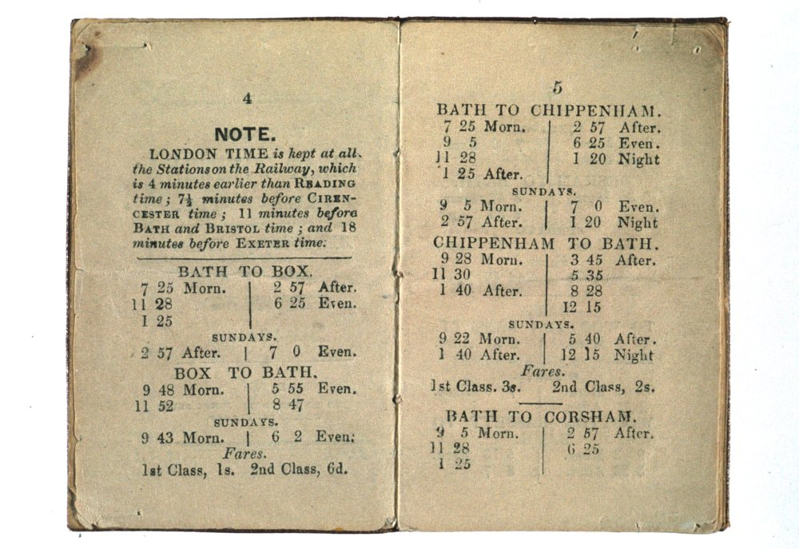

# Too Much Time

Once upon a time, there was *too much time*. Time was *everywhere*. Literally.

Time followed the sun.

Each place had its own time. Not just its own local village fete, its own market day or County Assizes, but its own time of day.

Noon was set by the sun dial in the village churchyard. The day started when the cock crowed, and the burning down of a candle marked it out after sunset.

And then the factories came, and with them the invention of *factory* time. A factory owner would know how many widgets he could make per hour, and how many per day. And that didn't really work with days that were 8 hours long in winter and 16 hours long in summer if you wanted to produce the same numbers of widgets per day *whatever* time of year it was.

And *then* came the railways, and faster than local time travel.

Now, the Sun travels across the Earth at about a thousand miles an hour: 24,000 miles or so round the Earth, 24 hours in a day, so a thousand miles an hour. Or about fifteen miles a minute.

If you're walking across the country, the sound of the church bells chiming sound out at pretty much the same time all around round. But there's actually a wave of chimes, ringing out from east to west, across the country, taking just a little bit less than half an hour from the furthest point east to the furthest point west.

Now that's a lot faster than walking pace. Or a horse. Or even a train.

But imagine though, for a minute, that you're working for the railway, the Great *Western* Railway, connecting London, with Bristol, then down to the West country, Devon, and Cornwall. You're putting together the timetables, and indulging in a little thought experiment. The early mail coaches may have travelled a little less than 10 miles an hour or so, and the first trains averaged 20-30 miles per or so, reaching 60-70 miles per hour in the 1840s. But you could probably *imagine* trains getting up to 100 miles an hour — I know that's unmimaginably fast nowadays, but back then, it looked like it could be a *real* posibility. But what if you could get *another* ten times improvement and go 1000 miles an hour? You'd leave London at midday, and head west. You'd get to Reading at... 12 o'clock. Then on to Swindon — twelve'o'clock — and Bristol, where you'd arrive at... 12 o'clock. It would take you, quite literally, *no time* to get there at all.



But that's not right, is it? It *does* take time, even on the fastest trains, and it takes *forever* on today's trains.

So you need to invent *railway* time, where you do the sums, you take the *actual* speed and the *actual* distance, and you work out how long it will *actually* take. And that's your timetable.

But for everyone else? Well: if it was midday in Oxford it was just after five *past* twelve in London (or 5 minutes and two seconds passed twelve to be precise). At the same time, it was five minutes *to* twelve in Bristol. So you'd have to have people all over the country figuring out their own local timetables — good work if you can get it, presumably — because if you miss a train by a minute, well, you're f*cked, aren't you, as you can try explaining to the people on the speed awareness courses, who try to explain that if you're speeding for an hour you still only get there a couple of minutes earlier and you say: yes, but boatwise, you don't live on a Island where a minute is a couple of hours if you miss it, do you?

Having your own time could lead to problems.

It had been a particularly stressful morning for the clerk of the magistrates court at the Dorchester Assizes, somewhen in 1858. There were a lot of cases on trial that day, and things needed to strat promptly. But when he'd got up that morning and gone to set his watch by the clock in the hall, the clock he set from the chiming of the Church clock, which in turn was set by the sundial in the church yard, his clock had stopped. He had only only just made the train on the new railway line into town, and had then set his watch by the clock in the station-master's office at Dorchester. And when he'd got to the court, he'd noticed that *that* clock appeared to be running particularly slowly, so he'd put it right.

The first hearing was set for 10 o'clock a.m. The case involved an action of ejectment, which is to say a property case. In those days, ownership of land could be transferred by ritual and custom as much as it was by legal document.

The medieval *livery of seisin*, which remained as valid in law until 1925, fewer than a hundred years ago, when my own grandparents were children, required the original landowner and whoever was being given the land, along with any witnesses to gather somewhere on the land; the owner would then pick up a handful of earth and hand it over, literally handing of the ownership of it.

If there was a land dispute, an "action of ejectment" could be brought by someone who argued that they had wrongfully been dispossessed of the land or had a better right to it.

*I don't know if the particular case involved the livery of seisin, but it makes for a more colourful story if it does!*

And so it was that on November 25th, at 10 am, the case of Curtis versus March, in the matter of an action of ejectment, was called.

"The plaintiff's counsel commenced his address to the jury, but as the defendant was not present and no one appeared for him, the learned Judge directed a verdict for the plaintiff. The defendant's counsel then entered the Court and claimed to have the cause tried, on the ground that it had been disposed of before 10 o'clock."

The Judge looked to the clock in the court, and it showed the time a little after 10. The defence had *not* been in court at the appointed time, had not been there to provide a defence, and so, because there was no defence, the case had gone against them.

The defence counsel perhaps coughed, and spluttered, pointing to the town clock that could be seen through the window of the court: it was still one and a half minutes *to* 10 o'clock.

If you look at where Dorchester is on a map of England, you find it just above, and to the right of Weymouth; if you look further up the map, higher in latitude but at the same *longitude*, you'll see it's just slightly to the right of Bristol...

...and as such, almost 10 minutes behind London time.

In Dorchester, the town clock was running on local time; the court clock was set to Greenwich mean time, to London time. The defence council, checking the time by the town clock, had arrived, or so he thought, in good time.

The case was taken to appeal in the Court of Exchequer, in London, also known as The Exchequer of Pleas, who considered the matter and made their decision: "[w]hen it is stated that a court will sit at a particular hour, that is understood by all persons as the time at the place where the court sits. We are as much bound to take judicial notice that a particular place lies east or west of Greenwich, and consequently has a different time from it, as we are to know the days of the year". 

The Exchequer of Pleas ruled in favour of the defendant, allowing them to have "an opportunity of trying the cause".

"A person hearing that the court would sit at 10 o'clock would naturally understand that to mean 10 o'clock by the time of the place , unless the contrary was expressed . In this case, looking to the difference of time (of which we are bound to take judicial notice), the defendant was in court before 10 o'clock."

If the trial is set in Dorchester, to be on Thursday at 10 in Dorchester, then the case will be heard, on Thursday, at 10, in Dorchester, using the local time of that place.

Such is the way of the law in Britain and Ireland, a *Common Law* approach, where judges rulings in the absence of statute, or interpretation of enacted laws and statutes, are the law, Curtis versus March defined "standard time" as used in the courts of Great Britain and Ireland.

Standard time as London time, as Greenwich mean time, GMT, did not enter the [statute book](http://statutes.org.uk/site/the-statutes/nineteenth-century/1880-43-44-victoria-c-9-definition-of-time-act/) until 1880, and the reign of Queen Victoria, in an August 1880 "Act to remove doubts as to the meaning of Expressions relative to Time occurring in Acts of Parliament, deeds, and other legal instruments".

Every evening at 9 o'clock "Oxford Time" (which is to say five *past* nine in London time), the bell at Christ Church College, Great Tom, rings out a hundred and one times, once for each of the college's original 101 students, calling the colleges to lock their gates. Thereupon, it remains silent until it resumes announcing the London hour, every hour from 8am the next morning. To this day the people of Oxford know their own time.

As they do in Bristol. If you're ever on the Big Island, and happen to visit Bristol, and if you find yourself stood in from of the old Corn Exchange, look up to the clock tower: as well as the rather unusual red painted numbers, you'll notice it has *two* minute hands. The red minute hand shows London time, Greenwich Mean Time; but a *second*, __black__ minute hand shows local Bristol time, 10 minutes behind.

So when people said "London is ahead of the times", that was true, in a certain sense: daylight gets there before many places in the UK. And if people say, "the folk in the West Country are so behind the times", that could also be true...

> WHEREAS it is expedient to remove certain doubts as to whether expressions of time occurring in Acts of Parliament, deeds, and other legal instruments relate in England and Scotland to Greenwich time, and in Ireland to Dublin time, or to the mean astronomical time in each locality:
> 
> Be it therefore enacted by the Queen's most Excellent Majesty, by and with the advice and consent of the Lords Spiritual and Temporal, and Commons, in this present Parliament assembled, and by the authority of the same, as follows; (that is to say,)
> 
> 1. Whenever any expression of time occurs in any Act of Parliament, deed, or other legal instrument, the time referred shall, unless it is otherwise specifically stated, be held in the case of Great Britain to be Greenwich mean time, and in the case of Ireland, Dublin mean time.
> 2. This Act may be cited as the Statutes (Definition of Time) Act, 1880.
  
A news report of the appeal can be found in the *Southern Times and Dorset County Herald* of Saturday, 27 November, 1858:

```{admonition} Puncutuality in Law Courts, November, 1858
:class: dropdown

https://britishnewspaperarchive.co.uk/viewer/bl/0002181/18581127/062/0008
Southern Times and Dorset County Herald - Saturday 27 November 1858

PUNCTUALITY IN LAW COURTS. In the Court of Queen's Bench yesterday, sitting in Banco, before the Lord Chief Baron, Mr. Baron Watson, and Mr. Baron Channell, there was a motion for a new trial in Curtis v. March, an ejectment entered for trial at the late Dorchester Assizes, before Mr. Baron Watson. On the moving of the trial when the cause was called on, the defendant and his counsel and witnesses were not in attendance, and the plaintiff, under the Common haw Procedure Act, claimed to have the verdict entered for him, which was assented to by the learned judge. A few minutes after ten by the court clock, the defendant, his counsel and witnesses, came into court, expressed his surprise, and asked to be allowed to have the cause again called on and tried, but the plaintiff objected to it, on the ground that there was no real defence to the action, and that the deleudant ought to have been punctual in his attendance at court. The defendant replied that he had good ground of defence, and that he was in court at ten o'clock, according to the town clock. The plaintiff refused to have the ease re-opened, and the result was an application to this court for a new trial.— Mr. Slade, Q.C., and Mr. Kingdon, now showed cause against the rule, and urged it was the duty of the defendant and his witnesses to have been punctual in their attendance at the court. The learned judges, the sheriff, the jury, and other persons were at the court by ten o'clock, according to the court clock, by which every person was bound. It was necessary there should be as much punctuality in judicial as military proceedings, so well known to the learned Judge who had to try the case. The plaintiff ought not to suffer for the defendant's neglect, who was very late in attendance that morning at court.—Lord Chief Baron: What do you call very late? —Mr. Slade: The defendant was one minute after ten o'clock. (Laughter.)—The Lord Chief Baron: That is certainly after ten o'clock. (Laughter.)—Mr. H. T. Cole (for the defendant): Our affidavit states two minutes. (Renewed laughter.)—Mr. Baron Watson: I have on my notes five minutes. (Laughter.) I thought at the time the plaintiff ought to have gone to trial, when the defendant appeared in court, and I imagined, from his objecting, that probably he had a bad case. The defendant being absent when the case was called on, I was bound to enter judgment for the plaintiff as prayed.—Lord Chief Baron: What is the difference between what is called mean time and true time at Dorchester? —Mr. Cole: Twelve minutes.— Mr. Slade urged, that as Greenwich time was kept at the Court, that was to be taken as true time, and ought to have been known to the defendant. There was no defence on the merits, and the plaintiff ought not to be called upon to try the case over again, unleas on payment of costs.—Mr. Cole said there was a good defence to the action can the merits. He objected to the defendant being called upon to pay costs.—Mr. Kingdon said, that at most of the railway stations Greenwich time was kept at the towns. At Exeter, by a resolution of the town council, the town clocks were regulated by Greenwich time.— Mr. Baron Watson considered the defendant ought to be allowed to have the case tried without payment of costs.— The Lord Chief Baron said ten o'clock must be considered ten o'clock according to the time of the place. I protest against parties altering their time by resolution, as instanced by the learned counsel, and say when a man should be born. In the case of Carlisle there are twenty minutes difference, and by such an alteration a man might be made to appear to have been born on one day, when in reality he was born on the following day. I think the defendant should be let in to try the case without costs, and that we ought to make the rule absollute.—The other learned Judges concurred . —Rule absolute.

```

Curtis vs March, Nov. 25, can be found in [vol. iii. of Hurlstone and Norman's `Exchequer Reports,' p. 866 (1858), https://www.google.co.uk/books/edition/The_Exchequer_Reports/edEsAQAAMAAJ?hl=en&gbpv=1]

```{admonition} CURTIS v. MARCH, Nov. 25, 1858
:class: dropdown

CURTIS v. MARCH. Nov. 25, 1858

*The time appointed for the sitting of a Court must be understood as the mean time at the place where the Court sits, and not Greenwich time, unless it be so expressed.*

This was an action of ejectment which was entered for trial before Watson, B., at the last Dorchester Assizes. The time appointed for the sitting of the Court was 10 o'clock A. M., and the learned Judge took his seat on the bench punctually at 10 by the clock in Court. The cause was then called on, and the plaintiff's counsel commenced his address to the jury, but as the defendant was not present and no one appeared for him, the learned Judge directed a verdict for the plaintiff. The defendant's counsel then entered the Court and claimed to have the cause tried, on the ground that it had been disposed of before 10 o'clock.

At that time it wanted one minute and a half to 10 by the town clock. The clock in Court was regulated by Greenwich time, which was some minutes before the true time at Dorchester. The learned Judge having refused the application, *Cole* had obtained a rule nisi for a new trial upon affidavits of the above facts, against which *Slade* and *Kingdon* showed cause. — The sitting of the court was properly regulated by Greenwich time.

[ POLLOCK, C. B. - When it is stated that a court will sit at a particular hour, that is understood by all persons as the time at the place where the court sits. We are as much bound to take judicial notice that a particular place lies east or west of Greenwich, and consequently has a different time from it, as we are to know the days of the year.] A judge may appoint the sittings of the court by Greenwich time.

[POLLOCK, C. B.- No doubt; but that was not done in this case. Suppose a question arises as to whether a person died at 12 o'clock on a particular day, is that to be determined by the time of the place or Greenwich time?] The time to be observed at any place is determined by a resolution of the authorities or general course of the parties at that place. Greenwich time is observed at most places in England through which railways pass, and in some the clocks have two sets of hands, the one showing Greenwich time the other the time of the place.

H. T. Cole appeared to support the rule, but was not called upon .

POLLOCK , C. B .--We are all of opinion that the defendant ought to have an opportunity of trying the cause. The rule will therefore be absolute without costs. It seems to me doubtful whether this application is in consequence of mistake on the part of the defendant or his counsel, for it may be that the Dorchester town clock pointed to Dorchester time, although that in court was regulated by Greenwich time, and that this circumstance was not generally known in Dorchester. I cannot assent to the argument that the town council of any place may by their resolution declare that Greenwich, or any other time, shall be the time of the place; for I cannot help seeing the consequences. The difference between Greenwich time and the real time at Carlisle is several minutes, and therefore if a town council might determine the time, they might make a man born on a different day from that on which he was really born . Or suppose that by act of parliament a person was bound to go out of office on a particular day, the town council by altering the time might put him out of office to-day instead of to-morrow. So, if a person is entitled to a bonus from an insurance office in the event of his living to a certain period, that must be decided, not by the town council adopting Greenwich time, but by the mean time of the place. Ten o'clock is 10 o'clock according to the time of the place, and the town council cannot say that it is not, but that it is 10 o'clock by Greenwich time. Neither can the time be altered by a rail way company whose railway passes through the place, nor by any person who regulates the clock in the town-hall. A person hearing that the court would sit at 10 o'clock would naturally understand that to mean 10 o'clock by the time of the place, unless the contrary was expressed. In this case, looking to the difference of time (of which we are bound to take judicial notice), the defendant was in court before 10 o'clock.

Watson, B. — On the day when the cause was tried, I came into court punctually at 10 by the clock in the judges' room, which was set at Greenwich time. I proceeded at once with the business. A few minutes afterwards Mr. Cole came in and stated that it was not yet 10, but I did not hear whether he meant by the mean time of the place or by Greenwich time. That is now explained by the affidavits, from which it appears that two times are kept, the clock in the court being regulated by Greenwich time.

CHANNELL, B., concurred . Rule absolute.
```
