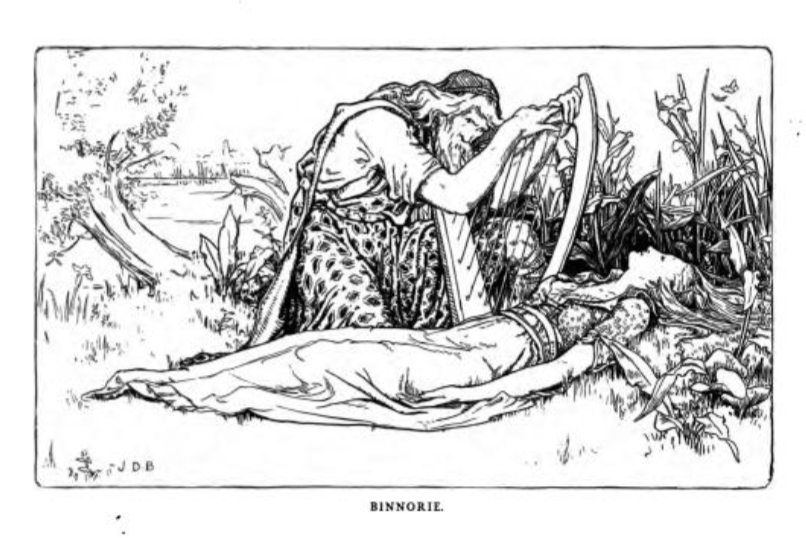

# Binnorie / Twa Sisters

I first came across *Binnorie*, also widely known as the *Twa Sisters*, as a traditional Sottish folk song used as the basis for a *cante fable* by Joseph Jacobs in his [English Fairy Tales](https://archive.org/details/englishfairytal00jacogoog/page/n66/mode/2up) collection of 1890;  several verses of the song are used to describe the closing elements of the story, which is otherwise presented in narrative form.

Many variants of the song from the Scottish, English, Scandinavian and Icelandic folk song traditions, and a comparative review of them, can be found in Francis Child's [The English and Scottish popular ballads](https://archive.org/details/englishscottishp11chilrich/page/118/mode/2up), 1882, Vol 1, part 1, pp.118-141, under the heading "the Twa Sisters".

Contemporary versions, as in the following example, are still being created, as for example this version by [Emily Smith](https://www.youtube.com/watch?v=tD3HR0D-Pmg).

Oral collections of the song also continued well into the 20th century, with [John Whyte singing a version](https://www.tobarandualchais.co.uk/track/33039?l=en) of 'The Twa Sisters' he heard from his mother, collected in 1976, "followed by a discussion about the motivation in the story told in this version and another version of the song". *I would embed a version here, but I've received take down notices in the past from the Tobar an Dualchais website publishers so am reluctant to do so for fear of attracting their ire again.*

The gist of the tale, combining elements from several versions of the ballad collated by Child, is as follows:

> Sir William came visiting to meet his friend Sir Hugh, and was much taken by Sir Hugh's elder sister, the dark haired and sultry Lady Helen. He wooed her, and gave her gifts, a penknife and a brooch. But as the days passed, he found his straying, to Lady Helen's younger sister, the fair and innocent Lady Isobel. Helen was not amused, and suggested to her sister they go down to the estuary see their fathers boats come on. The younger sister went towards the bank, but her sister hit her from behind, pushed her into the water. The younger sister reached out for help — "please, take my hand" but the response was curt — "I will not take the hand of one who took everything from me". "Please, please help me, you may have my half of our father's fortune. Please take my hand". "I will be heir to all his fortune when you are dead. And may the hand that took my lover from me." "Oh please take my hand, I will forsake sweet William, and never speak to another man." But Helen walked away, and the youger sister was carried downstream, now sinking, now floating. Down river,  a miller's daughter, dressed simply, was fetching water from the mill-stream, when she called out to her father - "Oh father, stop the mill wheel, there is a swan caught in the flow - not a swan, a mermaid.. oh, father, not a mermaid..." The wheel was stopped, hooked by her golden girdle, dragged out, and placed on the bank. With fair jewels in her hair and rich rings on her fingers, a dress of silk, her fair face, now pale and grey. A passing harper saw the sight, was taken by how beautiful she mush have been, but he had places to be, and left the miller and daughter to attend to the body. And attend to it they did...
>
> Some while later, the harper passed that way again, heading up-river to play at a wedding, the daughter of a local Lord. He noticed the mill-owner's daughter, dressed finely, as he passed, then, a little further up the way, a break in the hedgerow, a strip of fine cloth, from a riped golden girdle. He peered through the break — a pile of bones, long strands of golden hair.
>
> TO DO


```{admonition} In Joseph Jacobs, *English Fairy Tales*, 1890
:class: dropdown

Joseph Jacobs, [English Fairy Tales](https://archive.org/details/englishfairytal00jacogoog/page/n66/mode/2up), 1890, pp44-47.

Binnorie

ONCE upon a time there were two king's daughters lived in a bower near the bonny milldams of Binnorie. And Sir William came wooing the eldest and won her love and plighted troth with glove and with ring. 



But after a time he looked upon the youngest, with her cherry cheeks
and golden hair, and his love grew towards her till he cared no longer for the eldest one. So she hated her sister for taking away Sir William's love, and day by day her hate grew upon her, and she plotted and she planned how to get rid of her.

So one fine morning, fair and clear, she said to her sister, "Let us go and see our father's boats come in at the bonny mill-stream of Binnorie." So they went there hand in hand. And when they got to the river's bank the youngest got upon a stone to watch for the coming of the boats. And her sister, coming behind her, caught her round the waist and dashed her into the rushing mill-stream of Binnorie.

"O sister, sister, reach me your hand!" she cried, as she floated away, "and you shall have half of all I've got or shall get."

"No, sister, I'll reach you no hand of mine, for I am the heir to all your land. Shame on me if I touch the hand that has come 'twixt me and my own heart's love."

"O sister, O sister, then reach me your glove!" she cried, as she floated further away, "and you shall have your William again ."

"Sink on," cried the cruel princess, "no hand or glove of mine you'll touch. Sweet William will be all mine when you are sunk beneath the bonny mill-stream of Binnorie." And she turned and went home to the king's castle.

And the princess floated down the mill-stream, some times swimming and sometimes sinking, till she came near the mill. Now the miller's daughter was cooking that day,and needed water for her cooking. And as she went to draw it from the stream, she saw something floating towards the mill-dam, and she called out, "Father! father! draw your dam. There's something white - a merrymaid or a milk-white swan — coming down the stream ." So the miller hastened to the dam and stopped the heavy cruel mill-wheels. And then they took out the princess and laid her on the bank.

Fair and beautiful she looked as she lay there. In her golden hair were pearls and precious stones; you could not see her waist for her golden girdle, and the golden fringe of her white dress came down over her lily feet.

But she was drowned, drowned!

And as she lay there in her beauty a famous harper passed by the mill-dam of Binnorie, and saw her sweet pale face. And though he travelled on far away he never forgot that face, and after many days he came back to the bonny mill-stream of Binnorie. But then all he could find of her where they had put her to rest were her bones and her golden hair. So he made a harp out of her breast-bone and her hair, and travelled on up the hill from the mill-dam of Binnorie, till he came to the castle of the king her father.

That night they were all gathered in the castle hall to hear the great harper — king and queen, their daughter and son, Sir William and all their Court. And first the harper sang to his old harp, making them joy and be glad or sorrow and weep just as he liked. But while he sang he put the harp he had made that day on a stone in the hall. And presently it began to sing by itself, low and clear, and the harper stopped and all were hushed .

And this was what the harp sung:

"O yonder sits my father, the king,  
Binnorie, O Binnorie;  
And yonder sits my mother, the queen;  
By the bonny mill-dams o' Binnorie.  
"And yonder stands my brother Hugh,  
Binnorie, O Binnorie;  
And by him, my William, false and true;  
By the bonny mill-dams o' Binnorie."

Then they all wondered, and the harper told them how he had seen the princess lying drowned on the bank near the bonny mill-dams o' Binnorie, and how he had after wards made this harp out of her hair and breast-bone.

Just then the harp began singing again, and this was what it sang out loud and clear:

"And there sits my sister who drowned me  
By the bonny mill-dams o' Binnorie."

And the harp snapped and broke, and never sang more.

```

In Jacobs' notes, (p. 232), the source of the tale is given as follows:

> Source. — From the ballad of the "Twa Sisters o' Binnorie," I have used the longer version in Roberts's Legendary Ballads with one or two touches from Mr. Allingham's shorter and more powerful variant in The Ballad Book. A tale is the better for length, a ballad for its curtness.

Jacobs also identifies other parallel tales:

> Parallels. — The story is clearly that of Grimm's "Singing Bone" (No. 28), where one brother slays the other and buries him under a bush. Years after a shepherd passing by finds a bone under the bush, and, blowing through this, hears the bone denounce the murderer. For numerous variants in Ballads and Folk Tales, see Prof. Child's English and Scotch Ballads (ed. 1886), i. 125, 493; iii. 499.

In the version given by Roberts, collected from a "recitation of a lady in Fifeshire", we find the song elements used by Jacobs.

```{youtube} SlB_QPMUWmg
```

```{admonition} In Roberts, *Legendary Ballads*, 1868
:class: dropdown

John Storm Roberts, [The legendary ballads of England and Scotland](https://archive.org/details/cu31924073426326/page/516/mode/2up), 1868, pp. 517-520.

BINNORIE.

[The following is printed almost verbatim from Mr. Jamieson's version, which was taken down from the recitation of a lady in Fifeshire. The tale and ballad were popular in England before 1656. Pinkerton gives a version among his tragic ballads; and several parodies are well known, one of them is reprinted by Mr. Jamieson.]

There were twa sisters lived in a bower;  
Binnorie, O Binnorie;  
There cam a knight to be their wooer,  
By the bonnie mill-dams o' Binnorie.

He courted the eldest wi' glove and ring,  
Binnorie, O Binnorie;  
But he lo'ed the youngest abune a' thing,  
by the bonnie mill-dams o' Binnorie.

The eldest she was vexed sair,  
Binnorie, O Binnorie;  
And sair envied her sister fair,  
By the bonnie mill-dams o' Binnorie.

The eldest said to the youngest ane,  
Binnorie, O Binnorie,  
"Will ye see our father's ships come in?"  
By the bonnie mill-dams o' Binnorie.

She's ta'en her by the lily hand;  
Binnorie, O Binnorie;  
And led her down to the river strand,  
By the bonnie mill-dams o' Binnorie.

The youngest stood upon a stane;  
Binnorie, O Binnorie;  
The eldest cam and pushed her in,  
By the bonnie mill-dams o' Binnorie.

She took her by the middle sma;  
Binnorie, O Binnorie;  
And dashed her bonny back to the jaw,  
By the bonnie mill-dams o' Binnorie.

"O sister, sister, reach your hand,  
Binnorie, O Binnorie;  
And ye shall be heir o' half my land;'  
By the bonnie mill-dams o' Binnorie.

"O sister, I'll not reach my hand,  
Binnorie, O Binnorie;  
And I'll be the heir o' all your land;  
By the bonnie mill-dams o' Binnorie.

"Shame fa' the hand that I should take,  
Binnorie, O Binnorie;  
It has twined me and my world's make:"  
By the bonnie mill-dams o' Binnorie.

"O sister, sister, reach me your glove,  
Binnorie, O Binnorie;  
And sweet William shall be your love;"  
By the bonnie mill-dams o' Binnorie.

"Sink on, nor hope for hand or glove,  
Binnorie, O Binnorie;  
And sweet William shall better be my love,  
By the bonnie mill-dams o' Binnorie.

"Your cherry cheeks, and your yellow hair,  
Binnorie, O Binnorie;  
Had garr'd me gang maiden evermair,"
By the bonnie mill-dams o' Binnorie.

Sometimes she sank, and sometimes she swam,  
Binnorie, O Binnorie;  
Until she cam to the miller's dam;  
By the bonnie mill-dams o' Binnorie.

The miller's daughter was baking bread,  
Binnorie, O Binnorie;  
And gaed for water as she had need,  
By the bonnie mill-dams o' Binnorie.

"O father, father, draw your dam!  
Binnorie, O Binnorie;  
There's a mermaid or milk-white swan,  
By the bonnie mill-dams o' Binnorie."

The miller hasted and drew his dam,  
Binnorie, O Binnorie;  
And there he found a drown'd woman,  
By the bonnie mill-dams o' Binnorie.

Ye couldna see her yellow hair;  
Binnorie, O Binnorie;  
For gowd and pearls that were sae rare;  
By the bonnie mill-dams o' Binnorie.

Ye couldna see her middle sma',  
Binnorie, O Binnorie;  
Her gowden girdle was sae braw,  
By the bonnie mill-dams o' Binnorie.

Ye couldna see her lilie feet,  
Binnorie, O Binnorie;  
Her gowden fringes were sae deep,  
By the bonnie mill-dams o' Binnorie.

"Sair will they be, whae'er they be,  
Binnorie, O Binnorie;  
The hearts that live to weep for thee!"  
By the bonnie mill-dams o' Binnorie.

A famous harper passing by,  
Binnorie, O Binnorie;  
The sweet pale face he chanced to spy,  
By the bonnie mill-dams o' Binnorie.

And when he looked that lady on,  
Binnorie, O Binnorie;  
He sighed, and made a heavy moan,  
By the bonnie mill-dams o' Binnorie.

He made a harp o' her breast bone;  
Binnorie; O Binnorie;  
Whose sounds would melt a heart o' stone,  
By the bonnie mill-dams o' Binnorie.

The strings he formed o' her yellow hair;  
Binnorie, O Binnorie;  
Their notes made sad the listening ear  
By the bonnie mill-dams o' Binnorie.

He brought the harp to her father's hall;  
Binnorie, O Binnorie;  
And there was the court assembled all;  
By the bonnie mill-dams o' Binnorie,

He laid the harp upon a stane,  
Binnorie, O Binnorie;  
And straight it began to play alane,  
By the bonnie mill-dams o' Binnorie.

"O yonder sits my father, the king,  
Binnorie, O Binnorie;  
And yonder sits my mother, the queen;  
By the bonnie mill-dams o' Binnorie.

"And yonder stands my brother Hugh,  
Binnorie, O Binnorie;  
And by him my William sweet and true;"  
By the bonnie mill-dams o' Binnorie.

But the last tune that the harp played then,  
Binnorie, O Binnorie;  
Was, "Woe to my sister, false Helen!"  
By the bonnie mill-dams o' Binnorie.

```

```{admonition} In Allingham, *The Ballad Book*, 1965.
:class: dropdown
William Allingham, [The ballad book; a selection of the choicest British ballads](https://archive.org/details/balladbookselect00alliuoft/page/132/mode/2up), 1865, pp. 132-6

XXXIV

The Twa Sisters o' Binnorie.

1  
THERE were twa sisters sat in a bow'r;  
(Binnorie, O Binnorie! )  
A knight cam' there, a noble wooer,  
By the bonny mill-dams o' Binnorie.

2  
He courted the eldest wi' glove and ring,  
(Binnorie, O Binnorie!)  
But he lo'ed the youngest aboon a' thing,  
By the bonny mill-dams o' Binnorie.

3  
The eldest she was vexed sair,  
(Binnorie, O Binnorie!)  
And sair envied her sister fair,  
By the bonny mill-dams o' Binnorie.

4  
Upon a morning fair and clear,  
(Binnorie, O Binnorie!)  
She cried upon her sister dear,  
By the bonny mill-dams o' Binnorie.

5  
'O sister, sister, tak' my hand,'  
(Binnorie, O Binnorie!)  
'And let's go down to the river-strand,  
By the bonny mill-dams o' Binnorie.'

6  
She's ta'en her by the lily hand,  
(Binnorie, O Binnorie!)  
And down they went to the river-strand,  
By the bonny mill-dams o' Binnorie.

7  
The youngest stood upon a stane,  
(Binnorie, O Binnorie!)  
The eldest cam' and pushed her in,  
By the bonny mill-dams o' Binnorie.

8  
'O sister, sister, reach your hand!  
(Binnorie, O Binnorie!)  
'And ye sail be heir o' half my land' —  
By the bonny mill-dams o' Binnorie.

9  
'O sister, reach me but your glove!'  
(Binnorie, O Binnorie!)  
'And sweet William sail be your love'-  
By the bonny mill-dams o' Binnorie.

10  
Sometimes she sank, sometimes she swam,  
(Binnorie, O Binnorie!)  
Till she cam' to the mouth o' yon mill-dam,  
By the bonny mill-dams o' Binnorie.

11  
Out then cam' the miller's son  
(Binnorie, O Binnorie!)  
And saw the fair maid soummin' in,  
By the bonny mill-dams o' Binnorie.

12  
'O father, father, draw your dam!'  
(Binnorie, O Binnorie!)  
'There's either a mermaid or a swan,'  
By the bonny mill-dams o' Binnorie.

13  
The miller quickly drew the dam,  
(Binnorie, O Binnorie!)  
And there he found a drown'd womàn,   
By the bonny mill-dams o' Binnorie.

14  
Round about her middle sma'  
(Binnorie, O Binnorie!)  
There went a gouden girdle bra' `[' bra',' brave, rich.]`,  
By the bonny mill-dams o' Binnorie.

15  
All amang her yellow hair  
(Binnorie, O Binnorie!)  
A string o' pearls was twisted rare,  
By the bonny mill-dams o' Binnorie.

16  
On her fingers lily-white,  
(Binnorie, O Binnorie!)  
The jewel-rings were shining bright,  
By the bonny mill-dams o' Binnorie.

17 And by there cam' a harper fine,  
(Binnorie, O Binnorie!)  
Harped to nobles when they dine,  
By the bonny mill-dams o' Binnorie.

18  
And when he looked that lady on,  
(Binnorie, O Binnorie!)  
He sigh'd and made a heavy moan,  
By the bonny mill-dams o' Binnorie.

19  
He's ta'en three locks o' her yellow hair,  
(Binnorie, O Binnorie!)  
And wi' them strung his harp sae rare,  
By the bonny mill-dams o' Binnorie.

20  
He went into her father's hall,  
(Binnorie, O Binnorie!)  
And played his harp before them all,  
By the bonny mill-dams o'Binnorie.

21  
And sune the harp sang loud and clear  
(Binnorie, O Binnorie!)  
'Fareweel, my father and mither dear.'  
By the bonny mill-dams o'Binnorie.

22  
And neist when the harp began to sing,  
(Binnorie, O Binnorie!)  
'Twas 'Fareweel, sweetheart!' said the string,  
By the bonny mill-dams o' Binnorie.

23 And then as plain as plain could be,  
(Binnorie, O Binnorie!)  
'There sits my sister wha drowned me!'  
By the bonny mill-dams o' Binnorie.

```

Roberts suggests that the version he collected from the "lady in Fifeshire" is "almost verbatim from Mr. Jamieson's version":

```{admonition} In Jamieson, *Popular ballads and songs*, 1806
:class: dropdown

Robert Jamieson, [Popular ballads and songs, from tradition, manuscripts, and scarce editions](https://archive.org/details/popularballadsa06jamigoog/page/n86/mode/2up), 1806, pp. 50-58

THE TWA SISTERS.

There was twa sisters lived in a bower,  
(Binnorie, O Binnorie `[It may be necessary *euphonia gratia* to caution the English reader, that the burden is pronounced Binnōrie, and not Binnôrie, as it is accented in a beautiful little modem ballad bearing that name, which appeared in the Morning Chronicle some time ago.]`!)  
There came a knight to be their wooer,  
By the bonny mill-dams o' Binnorie.

He courted the eldest wi' glove and ring,  
(Binnorie, O Binnorie!)  
But he loved the youngest aboon a' thing.  
By the bonny mill-dams o' Binnorie.

He courted the eldest wi' broach and knife,  
(Binnorie, O Biimorie!)  
But he loved the youngest as his life,  
By the bonny mill-dams o' Binnorie.

The eldest she was vexed sair,  
(Binnorie, O Binnorie!)  
And sair envied her sister fair,  
By the bonny mill-dams o' Binnorie.

Intill her bower she coudna rest,  
(Binnorie, O Binnorie!)  
Wi' grief and spite she maistly brast,  
By the bonny mill-dams o' Binnorie.

Upon a morning fair and clear,  
(Binnorie, O Binnorie!)  
She cried upon her sister dear,  
By the bonny mill-dams o' Binnorie.

"O sister, come to yon sea strand,
(Binnorie, O Binnorie!)  
And see our father's ships come to land,  
By the bonny mill-dams o' Binnorie."

She's ta'en her by the milk-white hand,  
(Binnorie, O Binnorie!)  
And led her down to yon sea strand,  
By the bonny mill-dams o' Binnorie.

The youngest stood apon a stane,  
(Binnorie, O Binnorie!)  
The eldest came and threw her in,  
By the bonny mill-dams o' Binnorie.

She took her by the middle sma',
(Binnorie, O Binnorie!)  
And dashed her bonny back to the jaw,  
By the bonny mill-dams o' Binnorie.

"O sister, sister, tak my hand,  
(Binnorie, O Binnorie!)  
And I'se mak ye heir to a' my land,  
By the bonny mill-dams o' Binnorie.

"O sister, sister, tak my middle,  
(Binnorie, O Binnorie!)  
And ye's get my goud and my gouden girdle,  
By the bonny mill-dams o' Binnorie.

"O sister, sister, save my life,  
(Binnorie, O Binnorie!)  
And I swear I'se never be nae man's wife,  
By the bonny mill-dams o' Binnorie."

"Foul fa' the hand that I should tak,
(Binnorie, O Binnorie!)  
It twin'd me o' my wardles mak,  
By the bonny mill-dams o' Binnorie.

"Your cherry cheeks and yellow hair  
(Binnorie, O Binnorie!)  
Gars me gang maiden for evermair,  
By the bonny mill-dams o' Binnorie.

Sometimes she sank, sometimes she swam,  
(Binnorie, O Binnorie!)  
Till she came to the mouth o' yon mill-dam  
By the bonny mill-dams o' Binnorie.

O out it came the miller's son,  
(Binnorie, O Binnorie!)  
And saw the fair maid soummin in,  
By the bonny mill-dams o' Binnorie.

O father, father, draw your dam,  
(Binnorie, O Binnorie!)  
There's either a mermaid or a swan,  
3y the bonny mill-dams o' Binnorie.

[The miller quickly drew the dam,  
(Binnorie, O Binnorie!)  
And there he found a drown'd woman,  
By the bonny mill-dams o' Binnorie.]

[" Sair will they be, whae'er they be,  
(Binnorie, O Binnorie!)  
Their hearts that live to weep for thee,  
By the bonny mill-dams o' Binnorie.]

"' And sair and lang mat their teen last,  
(Binnorie, O Binnorie!)  
That wrought thee sic a dowie cast,  
By the bonny mill-dams o' Binnorie."

You coudna see her yellow hair  
(Binnorie, O Binnorie!)  
For goud and pearl that was sae rare,  
By the bonny mill-dams o' Binnorie.

You condna see her middle sma,  
(Binnorie, O Biimorie!)  
For gouden girdle that was sae braw,  
By the bonny mill-dams o' Binnorie.

You coudna see her fingers white  
(Binnorie, O Binnorie!)  
For gouden rings that were sae gryte,  
By the bonny mill-dams o' Binnorie.

And by there came a harper fine,  
(Binnorie, O Binnorie!)  
That harped to the king at dine,  
By the bonny mill«-dams o' Binnorie!

Whan he did look that lady upon,  
(Binnorie, O Binnorie!)  
He sigh'd and made a heavy moan,  
By the bonny mill-dams o' Binnorie.

[" O wha sail tell to thy father dear  
(Binnorie, O Binnorie!)  
The sad and waefu' sicht is here,  
By the bonny mill-dams o' Binnorie.]

[" And wha in thy mither's bower sall tell,  
(Binnorie, O Binmrie!)  
The weird her dearest bairn befell  
By the bonny mill-dams o' Binnorie.]

[" And wha to thy luckless love sail speak,  
(Binnorie, O Binnorie!)  
The tidings will do his heart to breaks  
By the bonny mill-dams o' Binnorie."]

He's ta'en three locks o' her yellow hair,  
(Binnorie, O Binnorie!)  
And wi' them strung his harp sae fair,  
By the bonny mill-dams o' Binnorie.

[And the harp untouched to the windis rang,  
(Binnorie, O Binnorie!)  
And heavy and dulefu' was the sang,  
By the bonny mill-dams o' Binnorie.]

The first tune it did play and sing,  
(Binnorie, O Binnorie!)  
Was, "Fareweel to my father the king,  
By the bonny mill-dams o' Binnorie."

The nexten tune that it play'd seen  
(Binnorie, O Bmnorie!)  
Was "Fareweel to my mither the queen,  
By the bonny mill-dams o' Binnorie."

The thirden tune that it playd then,  
(Binnorie, O Binnorie!)  
Was, "Wae to my sister, fair Ellen,  
By the bonny mill-dams o' Binnorie!"

[But the lasten tune it play'd sae sma'  
(Binnorie, O Binnorie!)  
Was saft, and sadly sweet o'er a',  
By the bonny mill-dams o' Binnorie.]

[The hardest heart wad bled to hear;  
(Binnorie, O Binnorie!)  
It maen'd wi' sic a dowie cheir,  
By the bonny mill-dams o' Binnorie.]

[" And fareweel, O fareweel to thee,  
(Binnorie, O Binnorie!)  
The dearest youth on life to me,  
By the bonny mill-dams o' Binnorie.]

[" Sin I maun bless thay heart nae mair,  
(Binnorie, O Binnorie!)  
May ruing Heaven mees thy care,  
By the bonny mill-dams o' Binnorie."]
```

The following Pinkerton version was also identified as an alternative by Roberts.

```{admonition} In Pinkerton, *Scottish tragic ballads*, 1781
:class: dropdown

John Pinkerton, [Scottish tragic ballads](https://archive.org/details/scottishtragicba00pinkiala/page/72/mode/2up), 1781, pp. 72-4.

XIII. BINNORIE.

From TRADITION.

*To preserve the tone, a well as the sense of this Ballad, the burden should be repeated through the whole, though it is here omitted for the sake of conciseness.*

There were twa sisters livd in a bouir;  
  "Binnorie, O Binnorie!  
Their father was a baron of pouir,  
  By the bonnie mildams of Binnorie.  
The youngest was meek, and fair as the May,  
Whan she springs in the east wi the gowden day:  
The eldest austerne as the winter cauld,  
Ferce was her saul, and her seiming was bauld.  
A gallant squire cam sweet Isabel to wooe;  
Her sister had naething to luve I trow;  
But filld was she wi dolour and ire,  
To dee that to her the comlie squire  
Preferd the debonair Isabel:  
Their hevin of luve of spyte was her hell.  
Till ae ein shie to her sister can say  
"Sweit sister cum let us wauk and play."  
They wauked up, and they wauked down,  
Sweit sang the birdis in the vallie loun!
Whan they cam to the roaring lin,  
She drave unweiting Isabel in.  
'O sister! sister! tak my hand,  
'And ye fall hae my silver fan;  
'O sister! sister! tak my middle  
'And ye fall hae my gowden girdle.'
Sumtimes she sank, sumtimes she swam,  
Till she cam to the miller's dam:  
The miller's dochter was out that ein  
And saw her rowing down the streim.  
"O father deir! in your mil dam  
"There is either a lady or a milk white swan!"  
Twa days were gane whan to her deir  
Her wraith at deid of nicht cold appeir:  
'My luve, my deir, how can ye sleip,  
'Whan your Isabel lyes in the deip?  
'My deir, how can ye sleip bot pain,  
'Whan she by her cruel sister is slain?'  
Up raise he sune in frichtru mude,  
'Bulk ye my meiny and seik the flude.'  
They socht her up, and they socht her doun,  
And spyd at last her glisterin gown:  
They rais'd her wi richt meikle care;  
Pale was her cheik, and grein was her hair!  
'Gae, saddle to me my swiftest steid,  
'Her fere, by my fae, for her dethe sall bleid.'  
A page cam rinning out owr the lie,  
"O heavie tydings I bring!" quoth he,  
"My luvely lady is far awa gane,  
"We weit the fairy hae her tane:  
"Her sister gaed wood wi dule and rage;  
"Nocht cold we do her mind to suage.  
"O Isabel! my sister!" she wold cry,  
'For thee will I weip, for thee will I die!'  
"Till late yestrene in an elric hour  
"She lap frae aft the hichest touir"———  
'Now sleip she in peace!' quoth the gallant Squire,  
Her dethe was the maist that I cold require:  
'But I'll main for thee my Isabel deir,  
  'Binnorie, O Binnorie!  
'Full mony a dreiry day, bot weir,  
  'By the bonnie raildams of Binnorie.'

```

In the [John Whyte version on *Tobar an Dualchais*](https://www.tobarandualchais.co.uk/track/33039?l=en), "[the motivation is] that the younger sister wants to take the elder sister's place as heir to her father's lands. [A] fiddle made from the dead sister's breastbone reveals what happened."

The "parody" version Jamieson refers to, which Allingham identifies from *Wit Restor'd* (1658) and considers to be a "burlesque version" ([p. xii](https://archive.org/details/balladbookselect00alliuoft/page/n15/mode/2up)) is a rather graphic ballad called *"The Miller and the King's Daughter"*. Many elements of it are in common with the version of *The Devil's Violin* that I tell, which draws heavily from Sarah Liisa Wilkinson's version of that tale, such as the use of the finger bones as fiddle pegs. The use of veins as strings is also notable...

*Allingham also notes, again a p. xii, "we believe that many of our best Old Ballads were old ballads in Shakspeare's time, and, considering the conservatism of the commonalty in such matters, that, for all the verbal variations, they are substantially not much altered since then".*

```{admonition} The Miller and the King's Daughter, in Jamieson, 1806
:class: dropdown

Robert Jamieson, [Popular ballads and songs, from tradition, manuscripts, and scarce editions](https://archive.org/details/popularballadsa06jamigoog/page/n350/mode/2up), 1806, pp. 315-318

THE MILLER AND THE KING'S DAUGHTER.

`[ From *Musarum Deliciae or the Muse's recreation, containing several pieces of Poetique Wit, the second edit, by sir J. M. and A. S. 1656." It is also found in "Wit Restored, by J.S. London, 1658;" and in Dryden's Miscellanies; and is said to be by Mr Smith.]`

There were two sisters, they weat a playing,  
With a hie downe, downe, a downe a;  
To see their father's ships sailing in,  
With a hie downe, downe, a downe a.

And when they came into the sea brim,  
With a hie downe, downe, a downe a,  
The elder did push the younger in,  
With a hie downe, downe, a downe a.

"O sister, sister, take me by the gown.,  
With a hie downe, downe, a downe a',  
And draw me up on the dry ground,  
With a hie downe, downe, a downe a'."

"O sister, O sister, that may not be,  
With a hie downe, downe, a downe a,  
Till salt and oatmeal grow both of a tree,  
With a hie downe, downe, a downe a."

Somtymes she sank, sometimes she swam,  
With a hie downe, downe, a downe a',  
Untill she came unto the milldam,  
With a hie downe, downe, a downe a.

The miller run hastily down the cliffe,  
With a hie downe, downe, a downe a,  
And up he betouk her withouten life,  
With a hie downe, downe, a downe a.

What did he doe with her brest bone,  
With a hie downe, downe, a downe a?
He made him a violl to play thereupon,  
With a hie downe, downe, a downe a.

What did he doe with her fingers so small,  
With a hie downe, downe a downe a'?  
He made him peggs to his viol withall,  
With a hie downe, downe, a downe a.

What did he doe with her nose-ridge,  
With a hie downe, downe, a downe a?
Unto his violl he made him a bridge,  
With a hie downe, downe, a downe a'.

What did he with her veynes so blew,  
With a hie downe, downe, a downe a?  
He made him strings to his viole thereto,  
With a hie downe, downe, a downe a.

What did he doe with her eyes so bright,  
With a hie downe, downe, a downe a?  
Upon his violl he play'd at first sight,  
With a hie downe, downe, a downe a'.

What did he doe with her tongue so rough,  
With a hie downe, downe, a downe a?  
Unto the violl it spoke, enough,  
With a hie downe, downe, a downe a.

What did he doe with her two shinnes,  
With a hie downe, downe, a downe a?
Unto the violl they danct Moll Syms,  
With a hie downe, downe, a downe a.

Then bespake the treble strings  
With a hie downe, downe, a downe a,
"O yonder is my father the king,  
With a hie downe, downe, a downe a."

Then bespake the second string,  
With a hie downe, downe, a downe a,  
"O yonder sits my mother the queen,  
With a hie downe, downe, a downe a."

And then bespake the Strings all three,  
With a hie downe, downe, a downe a,  
"O yonder is my sister that drowned mee,  
With a hie downe, downe, a downe a."

"Now pay the miller for his payne,  
With a hie downe, downe, a downe a;  
And let him begone in the devil's name,  
With a hie downe, downe, a downe a."

```

Several more variants of the ballad are collected in Francis James Child  [The English and Scottish popular ballads](https://archive.org/details/englishscottishp11chilrich/page/118/mode/2up), 1882, Vol 1, part 1, pp.118-141, under the heading "the Twa Sisters".

A. a. 'The Miller and the King's Daughter,' broadside of 1656, Notes and Queries, 1st S., v, 591. b. Wit Restor'd, 1658, "p. 51," in the reprint of 1817, p. 153. c. 'The Miller and the King's Daughters,' Wit and Drollery, ed. 1682, p. 87. d. 'The Miller and the King's Daughter,' Jamieson's Popular Ballads, I, 315.

```{admonition} Child, A. a
:class: dropdown

A. a. Broadside "printed for Francis Grove, 1656," reprinted in [Notes and Queries, Ist S., v, 591](https://archive.org/details/notesqueries05londuoft/notesqueries05londuoft/page/n597/mode/1up). b. Wit Restor'd, 1658, "p. 51," p. 153 of the reprint of 1817. c. [Wit and Drollery, ed. 1682, p. 87](https://archive.org/details/bim_early-english-books-1641-1700_wit-and-drollery-_1682/page/86/mode/2up), Dryden's Miscellany, Part 3, p. 316, ed. 1716. d. Jamieson's [Popular Ballads, i, 315](https://archive.org/details/popularballadsa06jamigoog/page/n350/mode/2up). 

1. There were two sisters, they went playing,  
With a hie downe downe a downe-a  
To see their father's ships come sayling in.  
With a hy downe downe a downe-a

2 And when they came unto the sea-bryn,  
The elder did push the younger in.

3 'O sister, O sister, take me by the gowne,  
And drawe me up upon the dry ground.'

4 'O sister, O sister, that may not bee,  
Till salt and oatmeale grow both of a tree.' 

6 Somtymes she sanke, somtymes she swam,  
Until she came unto the mill-dam.

6 The miller runne hastily downe the cliffe,  
And up he betook her withouten her life.

7 What did he doe with her brest-bone?  
He made him a violl to play thereupon.

8 What did he doe with her fingers so small?  
He made him peggs to his violl withall.

9 What did he doe with her nose-ridge?  
Unto his violl he made him a bridge.

10 What did he doe with her veynes so blew?  
He made him strings to his violl thereto.

11 What did he doe with her eyes so bright?  
Upon his violl he played at first sight.

12 What did he doe with her tongue so rough?  
Unto the violl it spake enough.

13 What did he doe with her two shinnes?  
Unto the violl they danc'd Moll Syms.

14 Then bespake the treble string,  
'O yonder is my father the king.'

15 Then bespake the second string,  
'O yonder sitts my mother the queen.'

16 And then bespake the strings all three,  
'O yonder is my sister that drowned mee.'

17 'Now pay the miller for his payne,  
And let him bee gone in the divel's name.'

```

```{admonition} Child, A, notes and variants.
:class: dropdown seealso

A. b. 1^1. went a-playing.  
*Burden*^2 a downe-o.

c. 1^. went a-playing.  
*Burden* ^1 ^2. With a hey down, down, a down, down-a.  
4^2. Till oat-meal and salt grow both on a tree.  
6^1. ran hastily down the clift.  
6^2. And up he took her without any life.  
13^2. Moll Symns.  
14^1, 15^1 Then he bespake.  
17^2. And let him go i the devil's name.  

d. 1^1. went a-playing. 1^2. ships sailing in.  
2^1 into.  
3^2. me up on.  
6^2 withouten life.  

```

B. a. 'The Twa Sisters,' Jamieson-Brown MS., fol. 39. b. 'The Cruel Sister,' Wm. Tytler's Brown MS., No 15. c. 'The Cruel Sister,' Abbotsford MS., "Scottish Songs," fol. 21. d. 'The Twa Sisters,' Jamieson's Popular Ballads, I, 48.

```{admonition} Child, B. a.
:class: dropdown

a. Jamieson-Brown MS., fol. 39. b. Wm. Tytler's Brown MS., No 15. c. Abbotsford MS., "Scottish Songs," fol. 21. d. Jamieson's Popular Ballads, I, 48. 

1 There was twa sisters in a bowr,  
  Edinburgh, Edinburgh  
There was twa sisters in a bowr,  
  Stirling for ay 
There was twa sisters in a bowr,  
There came a knight to be their wooer.  
  Bonny Saint Johnston stands upon Tay 

2 He courted the eldest wi glove an ring,  
But he lovd the youngest above a' thing.

3 He courted the eldest wi brotch an knife,  
But lovd the youngest as his life.

4 The eldest she was vexed sair,  
An much envi'd her sister fair.

5 Into her bowr she could not rest,  
Wi grief an spite she almos brast.

6 Upon a morning fair an clear,  
She cried upon her sister dear:

7 'O sister, come to yon sea stran,  
An see our father's ships come to lan.' 

8 She's taen her by the milk-white han,  
An led her down to yon sea stran.

9 The younges[t] stood upon a stane,  
The eldest came an threw her in.

10 She tooke her by the middle sma,  
An dashd her bonny back to the jaw.

11 'O sister, sister, tak my han.  
An Ise mack you heir to a' my lan.

12 'O sister, sister, tak my middle.  
An yes get my goud and my gouden girdle.

13 'O sister, sister, save my life,  
An I swear Ise never be nae man's wife.'

14 Foul fa the han that I should tacke,  
It twin'd me an my wardles make.

15 'Your cherry cheeks an yallow hair  
Gars me gae maiden for evermair.'

16 Sometimes she sank, an sometimes she swam,  
Till she came down yon bonny mill-dam.

17 O out it came the miller's son.  
An saw the fair maid swimmin in.

18 'O father, father, draw your dam,  
Here's either a mermaid or a swan.'

19 The miller quickly drew the dam,  
An there he found a drownd woman.

20 You coudna see her yallow hair  
For gold and pearle that were so rare.

21 You coudna see her middle sma  
For gouden girdle that was sae braw. 

22 You coudna see her fingers white,  
For gouden rings that was sae gryte.

23 An by there came a harper fine,  
That harped to the king at dine.

24 When he did look that lady upon,  
He sighd and made a heavy moan.

25 He's taen three locks o her yallow hair,  
An wi them strung his harp sae fair.

26 The first tune he did play and sing,  
Was, 'Farewell to my father the king.'

27 The nextin tune that he playd syne,  
Was, 'Farewell to my mother the queen.'

28 The lasten tune that he playd then,  
Was, 'Wae to my sister, fair Ellen.'

```

```{admonition} Child, B, notes and variants
:class: dropdown seealso

B. a. 26, 27, 28. An it has been written in as a conjectural emendation by Jamieson, *he did it play, it/he playd*; and it is adopted by Jamison in his printed copy: see below, d 26, 27, 28.

b. The first stanza only, agreeing with b.1, is given by Anderson, Nichols's Illustrations, VII, 178.

c. Evidently a copy of Mrs Brown's version, and in Scott's MS. it has the air, as all the Tytler-Brown ballads had. Still it has but twenty-three stanzas, whereas Dr Anderson gives fifty-eight lines as the extent of the Tytler-Brown copy of 'The Cruel Sister' (Nichols, nius. Lit. Hist., VII, 178). This, counting the first stanza, with the burden, as four lines, according to the arrangement in Scott's MS., would tally exactly with the Jamieson-Brown MS., B a.

It would seem that B c had been altered by somebody in order to remove the absurd combination of sea and mill-dam; the invitation to go see the ships come to land, B a 7, is omitted, and "the deep mill-dam" substituted, in 8, for "yon searstran." Stanza 17 of c, "They raisd her," etc., cited below, occurs in Pinkerton, N 20, and is more likely to be his than anybody's.

2^1. brooch and ring. 2^. abune a' thing.  
3^1. wooed . . . with glove and knife.  
3^2. looed the second.  
5^2. she well nigh brist.  
7. *wanting*.  
8^2. led her to the deep mill-dam.  
9^2. Her cruel sister pushd her in.  
11^2 And Ise mak ye.  
12. *wanting*.  
14^1. Shame fa the hand that I shall tak.  
15^1. gowden hair. 15^2. gar . . . maiden ever mair.  
16. *wanting*.  
17^1. Then out and cam. 17^2. swimming down.  
18^1. O father, haste and draw.  
19^1. his dam. 19^2. And then. (?)  
*Instead of 20-2.2:*  
They raisd her wi meikle dule and care,    
Pale was her cheek and green was her hair.  
24^1. that corpse upon.  
25^2. he's strung.  
26^1, 27^1, 28^1, for *tune*, *line*, if the copy be right.  
27^1. The next. 28^1. The last. 28^2. fause Ellen.  
"Note by Ritson. 'The fragment of a very different copy of this ballad has been communicated to J. R. by a friend at Dublin.'" [J. C. Walker, no doubt.]

d. Jamieson, Popular Ballads and Songs, I, 48, says that he gives his text verbatim as it was taken from the recitation of dhe lady in Fifeshire (Mrs Brown), to whom both he and Scott were so much indebted. That this is not to be understood with absolute strictness will appear from the variations which are subjoined. Jamieson adds that he had received another copy from Mrs Arrott of Aberbrothick, "but as it furnished no readings by which the text could have been materially improved," it 
was not used. Both Jamieson and Scott substitute the "Binnorie" burden, "the most common and popular," says Scott, for the one given by Mrs Brown, with which Mrs Arrott's agreed. It may be added that Jamieson' s interpolations are stanzas 20, 21, 27, etc., and not, as he says (i, 49), 19, 20, 27, etc. These interpolations also occur as such in the manuscript.  
1^1. sisters livd.  
2^2. aboon.  
3^2 he loved.  
4^1. and sair envied.  
5^1. Intill her bower she coudna.  
5^2. maistly brast.  
11^2 mak ye.  
14^2. me o.  
16^1. omits an.  
16^2. came to the mouth o yon mill-dam.  
18^2. There's. 
20^2. that was.  
22^2. that were.  
26^1. it did.  
27'. it playd seen.  
28^1. thirden tune that it.  
A copy in Motherwell's MS., p. 239, is derived from Jamieson's printed edition. It omits the interpolated stanzas, and makes a few very slight changes.

```

C. 'The Cruel Sister,' Scott's Minstrelsy, II, 143 (1802).

```{youtube} OyYzXh9RxBc
```

```{admonition} Child, C.
:class: dropdown

[Scott's Minstrelsy, 1802, II, 143](https://archive.org/details/minstrelsyof02scotiala/page/144/mode/2up). Compounded from B b and a fragment of fourteen stanzas transcribed from the recitation of an old woman by Miss Charlotte Brooke. 

1 There were two sisters sat in a bour;  
  Binnorie, O Binnorie  
There came a knight to be their wooer.  
  By the bonny mill-dams of Binnorie

2 He courted the eldest with glove and ring,  
But he loed the youngest aboon a' thing.

3 He courted the eldest with broach and knife,  
But he loed the youngest aboon his life.

4 The eldest she was vexed sair,  
And sore envied her sister fair.

5 The eldest said to the youngest ane,  
'Will ye go and see our father's ships come in?'

6 She's taen her by the lilly hand,  
And led her down to the river strand.

7 The youngest stude upon a stane,  
The eldest came and pushed her in. 

8 She took her by the middle sma,  
And dashed her bonnie back to the jaw. 

9 'O sister, sister, reach your hand,  
And ye shall be heir of half my land.'

10 'O sister, I'll not reach my hand,  
And I'll be heir of all your land.

11 'Shame fa the hand that I should take,  
It's twin'd me and my world's make.'

12 'O sister, reach me but your glove,  
And sweet William shall be your love.' 

13 'Sink on, nor hope for hand or glove,  
And sweet William shall better be my love.

14 'Your cherry cheeks and your yellow hair  
Garrd me gang maiden evermair.'

15 Sometimes she sunk, and sometimes she swam,  
Until she came to the miller's dam.

16 'O father, father, draw your dam,  
There's either a mermaid or a milk-white swan.'

17 The miller hasted and drew his dam,  
And there he found a drowned woman.

18 You could not see her yellow hair,  
For gowd and pearls that were sae rare.

19 You could na see her middle sma,  
Her gowden girdle was sae bra.

20 A famous harper passing by,  
The sweet pale face he chanced to spy. 

21 And when he looked that ladye on,  
He sighed and made a heavy moan. 

22 He made a harp of her breast-bone,  
Whose soimds would melt a heart of stone. 

23 The strings he framed of her yellow hair,  
Whose notes made sad the listening ear.

24 He brought it to her father's hall,  
And there was the court assembled all.

25 He laid this harp upon a stone,  
And straight it began to play alone. 

26 'O yonder sits my father, the king,  
And yonder sits my mother, the queen.

27 'And yonder stands my brother Hugh,  
And by him my William, sweet and true.'

28 But the last tune that the harp playd then,  
Was 'Woe to my sister, false Helen!' 

```

```{admonition} Child, C, notes and variants
:class: dropdown seealso

C. *Scott's account of his edition is as follows ,(II, 143, later ed., III, 287):* 

"It is compiled from a copy in Mrs Brown's MS., intermixed with a beautiful fragment, of fourteen verses, transmitted to the editor by J. C. Walker, Esq., the ingenious historian of the Irish bards. Mr Walker, at the same time, favored the editor with the following note: 'I am indebted to my departed friend, Miss Brooke, for the foregoing pathetic fragment. Her account of it was as follows: This song was transcribed, several years ago, from the memory of an old woman, who had no recollection of the concluding verses; probably the beginning may also be lost, as it seems to commence abruptly.' The first verse and burden of the fragment run thus:

"'O sister, sister, reach thy hand!  
  Hey ho, my Nanny, O  
And you shall be heir of all my land.  
  While the swan swims bonny, O'"

*Out of this stanza, or the corresponding one in Mrs Brown's copy, Scott seems to have made his 9, 10.*

```

D. 'The Bonnie Milldams of Binnorie,' Kinloch MSS, II, 49.

```{admonition} Child D, Kinloch's MSS
:class: dropdown

Kinloch's MSS, II, 49. From the recitation of Mrs Johnston, a North-country lady.

1 There lived three sisters in a bouer,  
  Edinbruch, Edinbruch  
There lived three sisters in a bouer,  
  Stirling for aye  
There lived three sisters in a bouer,  
The youngest was the sweetest flowr.  
  Bonnie St Johnston stands upon Tay

2 There cam a knicht to see them a',  
And on the youngest his love did fa.

3 He brought the eldest ring and glove,  
But the youngest was his ain true-love.

4 He brought the second sheath and knife,  
But the youngest was to be his wife.

5 The eldest sister said to the youngest ane,  
'Will ye go and see our father's ships come in?'

6 And as they walked by the linn,  
The eldest dang the youngest in.

7 'O sister, sister, tak my hand, 
And ye'll be heir to a' my land.'

8 'Foul fa the hand that I wad take,  
To twin me o my warld's make.'

9 'O sister, sister, tak my glove,  
And yese get Willie, my true-love.'

10 'Sister, sister, I'll na tak your glove,  
For I'll get Willie, your true-love.'

11 Aye she swittert, and aye she swam,  
Till she cam to yon bonnie mill-dam.

12 The miller's dochter cam out wi speed,  
It was for water, to bake her bread.

13 'O father, father, gae slack your dam;  
There's in 't a lady or a milk-white swan.'

* * * * * 

14 They could na see her coal-black eyes  
For her yellow locks hang oure her brees.

15 They could na see her weel-made middle  
For her braid gowden girdle.

* * * * * 

16 And by there cam an auld blind fiddler,  
And took three tets o her bonnie yellow hair.

* * * * * » 

17 The first spring that the bonnie fiddle playd,  
'Hang my cruel sister, Alison,' it said.

```

E. 'The Twa Sisters,' Sharpe's Ballad Book, No x, p. 30.

```{admonition} Child, E.
:class: dropdown

Sharpe's Ballad Book, No 10, p. 30. 

1 There livd twa sisters in a bower,  
  Hey Edinbruch, how Edinbruch!  
There lived twa sisters in a bower,  
  Stirling for aye!  
The youngest o them O she was a flower!  
  Bonny Sanct Johnstoune that stands upon Tay!

2 There cam a squire frae the west,  
He loed them baith, but the youngest best.

3 He gied the eldest a gay gold ring,  
But he loed the youngest aboon a' thing. 

4 'O sister, sister, will ye go to the sea?  
Our father's ships sail bonnilie.'

5 The youngest sat down upon a stane;  
The eldest shot the youngest in.

6 'O sister, sister, lend me your hand,  
And you shall hae my gouden fan.

7 * O sister, sister, save my life,  
And ye shall be the squire's wife.'

8 First she sank, and then she swam,  
Untill she cam to Tweed mill-dam.

9 The millar's daughter was baking bread,  
She went for water, as she had need.

10 'O father, father, in our mill-dam  
There's either a lady, or a milk-white swan.'

11 They could nae see her fingers small,  
Wi diamond rings they were coverd all.

12 They could nae see her yellow hair,  
Sae mony knots and platts were there.

13 They could nae see her lilly feet,  
Her gowden fringes war sae deep.

14 Bye there cam a fiddler fair,  
And he's taen three taits o her yellow hair.

```

```{admonition} Child, E, notes and variants
:class: dropdown seealso
"My mother used to sing this song." Sharpe's Ballad Book, ed. of 1880, note, p. 129.
```

F. 'The Bonny Bows o London,' Motherwell's MS., p. 883.

```{admonition} Child., F.
:class: dropdown

Motherwell's MS., p. 383. From the recitation of Agnes Lyle, Kilbarchan, 27th July, 1825. 

1 There was two ladies livd in a bower.  
  Hey with a gay and a grinding O  
The youngest o them was the fairest flower  
  About a' the bonny bows o London.

2 There was two ladies livd in a bower,  
An wooer unto the youngest did go.

3 The oldest one to the youngest did say,  
'Will ye take a walk with me today,  
And we'll view the bonny bows o London.

4 'Thou'll set thy foot whare I set mine,  
Thou'll set thy foot upon this stane.' 

5 'I'll set my foot where thou sets thine:'  
The old sister dang the youngest in,  
  At, etc. 

6 'O sister dear, come tak my hand,  
Take my life safe to dry land,'  
  At, etc. 

7 'It's neer by my hand thy hand sail come in,  
It's neer by my hand thy hand sall come in,  
  At, etc. 

8 'It's thy cherry cheeks and thy white briest bane  
Grars me set a maid owre lang at hame.'

9 She clasped her hand[8] about a brume rute,  
But her cruel sister she lowsed them out.

10 Sometimes she sank, and sometimes she swam,  
Till she cam to the miller's dam.

11 The miller's bairns has muckle need,  
They were bearing in water to bake some breid. 

12 Says, 'Father, dear father, in our mill-dam,  
It's either a fair maid or a milk-white swan.'

13 The miller he's spared nae his hose nor his shoon  
Till he brocht this lady till dry land.

14 I wad he saw na a bit o her feet,  
Her silver slippers were made so neat.

15 I wad he saw na a bit o her skin,  
For ribbons there was mony a ane.

16 He laid her on a brume buss to dry,  
To see wha was the first wad pass her by.

17 Her ain father's herd was the first man  
That by this lady gay did gang.

18 He's taen three links of her yellow hair,  
And made it a string to his fiddle there.

19 He's cut her fingers long and small  
To be fiddle-pins that neer might fail.

20 The very first spring that the fiddle did play,  
'Hang my auld sister,' I wad it did say.

21 'For she drowned me in yonder sea,  
God neer let her rest till she shall die,'
  At the bonny bows o London. 

```

```{admonition} Child, F, notes and variants
:class: dropdown seealso
2^2. An wooer.
```

G. Motherwell's MS., p. 104.

```{admonition} Child, G.
:class: dropdown

Motherwell's MS., p. 104. From Mrs King, Kilbarchan. 

1 There were three sisters lived in a bouir,  
  Hech, hey, my Nannie O  
And the youngest was the fairest flouir.  
  And the swan swims bonnie O 

2 'O sister, sister, gang down to yon sand,  
And see your father's ships coming to dry land.'

3 O they have gane down to yonder sand, 
To see their father's ships coming to dry land.

4 'Gae set your fit on yonder stane,  
Till I tye up your silken goun.'

5 She set her fit on yonder stane,  
And the auldest drave the youngest in.

6 'O sister, sister, tak me by the hand,  
And ye'll get a' my father's land.'

7 'O sister, sister, tak me by the gluve,  
An ye'll get Willy, my true luve.'

8 She had a switch into her hand,  
And ay she drave her frae the land.

9 O whiles she sunk, and whiles she swam,  
Until she swam to the miller's dam.

10 The miller's daughter gade doun to Tweed,  
To carry water to bake her bread.

11 'O father, O father, what's yon in the dam?  
It's either a maid or a milk-white swan.'

12 They have tane her out till yonder thorn,  
And she has lain till Monday mom. 

13 She hadna, hadna twa days lain,  
Till by there came a harper fine. 

14 He made a harp o her breast-bane,  
That he might play forever thereon. 

```

```{admonition} Child, G, notes and variants
:class: dropdown seealso
2^1. *strand*, with *sand* written above: *sand* in 3^1.
```

H. Motherwell's MS., p. 147.

```{admonition} Child, H.
:class: dropdown

Motherwell's MS., p. 147. From I. Goldie, March, 1825. 

1 There were three sisters lived in a hall,  
  Hey with the gay and the grandeur O  
And there came a lord to court them all.  
  At the bonnie bows o London town

2 He courted the eldest with a penknife,  
And he vowed that he would take her life.

3 He courted the youngest with a glove,  
And he said that he 'd be her true love.

4 'O sister, O sister, will you go and take a walk,  
And see our father's ships how they float?

5 'O lean your foot upon the stone,  
And wash your hand in that sea-foam.'

6 She leaned her foot upon the stone,  
But her eldest sister has tumbled her down.

7 'O sister, sister, give me your hand,  
And I'll make you lady of all my land.'

8 'O I'll not lend to you my hand,  
But I'll be lady of your land.'

9 'O sister, sister, give me your glove,  
And I'll make you lady of my true love.'

10 'It's I'll not lend to you my glove,  
But I'll be lady of your true love.'

11 Sometimes she sank, and sometimes she swam,  
Until she came to a miller's dam.

12 The miller's daughter was coming out wi speed,   
For water for to bake some bread.

13 'O father, father, stop the dam,  
For it's either a lady or a milk-white swan.'

14 He dragged her out unto the shore,  
And stripped her of all she wore.

15 By cam a fiddler, and he was fair,  
And he buskit his bow in her bonnie yellow hair.

16 By cam her father's harper, and he was fine,  
And he made a harp o her bonny breast-bone.

17 When they came to her father's court,  
The harp [and fiddle these words] spoke:

18 'O God bless my father the king,  
And I wish the same to my mother the queen.

19 'My sister Jane she tumbled me in,  

* * * * * 
```

I. 'Bonnie Milldams o Binnorie,' Kinloch MSS, v, 425.

```{admonition} Child, L.
:class: dropdown

Kinloch MSS, v, 425. From the recitation of M. Kinnear, 23d August, 1826. 

1 There war twa sisters lived in a bouer,  
  Binnorie and Binnorie 
There cam a squire to court them baith. 
  At the bonnie mill-streams o Binnorie

2 He courted the eldest with jewels and rings,  
But he lovd the youngest the best of all things.

3 He courted the eldest with a penknife,  
He lovd the youngest as dear as his life.

4 It fell ance upon a day  
That these twa sisters hae gane astray.

5 It was for to meet their father's ships that had come in.  
* * * * *

6 As they walked up the linn,  
The eldest dang the youngest in.

7 'O sister, sister, tak my hand,  
And ye'll hae Lud John and aw his land.'

8 With a silver wand she pushd her in,  
* * * * *

9 'O sister, sister, tak my glove,  
And ye sail hae my ain true love.'

10 The miller's dochter cam out wi speed,  
It was for a water to bake her bread.

11 'O father, father, gae slack your dam;  
There's either a white fish or a swan.'

* * * * * 

12 Bye cam a blind fiddler that way,  
And he took three tets o her bonnie yellow hair.

13 And the first spring that he playd,  
It said, 'It was my sister threw me in.'

```

```{admonition} Child, I, notes and variants
:class: dropdown seealso
1^2 var. in MS. *There was a knicht and he loved them bath.*   
7. The following stanza was subsequently written on an opposite blank page, — perhaps derived from D 8:  
*Fold fa the hand that I wad take.*  
*To twin me and my warld's make.*  
10^2. *a* was, perhaps, meant to be expunged, but is only a little blotted.  
11^2 var. a lady or a milk-white swan.  
12, 13 were written in later than the rest; at the same time, apparently, as the stanza above (7).

```

J. 'The Miller's Melody,' Notes and Queries, 4th S., V, 23.

```{admonition} Child, J.
:class: dropdown

Notes and Queries, 4th S., v, 23, from the north of Ireland. 

1 There were two ladies playing ball,  
  Hey, ho, my Nannie O  
A great lord came to court them all.  
  The swan she does swim bonnie O

2 He gave to the first a golden ring,  
He gave to the second a far better thing.

* * * * *

3 He made a harp of her breast-bone  
* * * * *

4 He set it down upon a stone,  
And it began to play its lone. 
```

K. 'Binnorie,' Kinloch's papers.

```{admonition} Child, K.
:class: dropdown

Mr G. R. Kinloch's papere, Kinloch MSS, ii, 59. From Mrs Lindores. 

1 'O SISTER, sister, gie me your hand,  
  Binnorie and Binnorie  
And I'll give the half of my fallow-land,   
By the bonnie mill-dams of Binnorie.'

* * * * *

2 The first time the bonnie fiddle played,  
'Hang my sister, Alison,' it said,  
'At the bonnie mill-dams of Binnorie.'

```

```{admonition} Child, K, notes and variants
:class: dropdown seealso
Found among Mr Kinloch's papers by Mr Macmath, and inserted by him as a note on 
p. 59, vol. II, of Kinloch's MSS. The order of the stanzas is there, wrongly, inverted.  
1^2. var. *I wad give you.*

```

L. a. 'The Miller's Melody,' Notes and Queries, 1st S., V, 316. b. 'The Drowned Lady,' The Scouring of the White Horse, p. 161.

```{admonition} Child, L.
:class: dropdown

a. From oral tradition, Notes and Queries, 1st S., v, 316.  
b. The Scouring of the White Horse, p. 161. From North Wales. 

1 O was it eke a pheasant cock,  
  Or eke a pheasant hen,  
Or was it the bodye of a fair ladye,  
  Come swimming down the stream?

2 O it was not a pheasant cock,  
  Nor eke a pheasant hen,  
But it was the bodye of a fair ladye  
Came swimming down the stream.

* * * * * 

3 And what did he do with her fair bodye?  
  Fal the lal the lal laral lody  
He made it a case for his melodye.  
  Fal, etc. 

4 And what did he do with her legs so strong?  
He made them a stand for his violon.

5 And what did he do with her hair so fine?  
He made of it strings for his violine.

6 And what did he do with her arms so long?  
He made them bows for his violon.

7 And what did he do with her nose so thin?  
He made it a bridge for his violin.

8 And what did he do with her eyes so bright?  
He made them spectacles to put to his sight.

9 And what did he do with her petty toes?  
He made them a nosegay to put to his nose. 

```

```{admonition} Child, L, notes and variants
:class: dropdown seealso
a. These fragments were communicated to Notes and Queries, April 3, 1852, by "G. A. C," who had heard 'The Miller's Melody' sung by an old lady in his childhood, and who represents himself as probably the last survivor of those who had enjoyed the privilege of listening to her ballads. We may, therefore, assign this version to the latter part of the 18th century. The two four-line stanzas were sung to "a slow, quaint strain." Two others which followed were not remembered, "but their purport was that the body 'topped hard by a miller's mill,' and that this 'miller chanced to come by' and took it out of the water 'to make a melodye.'" G. A. C. goes on to say: "My venerable friend's tune here became a more lively one, ana the time quicker; but I can only recollect a few of the couplets, and these not correctly nor in order of sequence, in which the transformation of the lady into a viol is described."

b. Some stanzas of this four-line version, with a ludicrous modem supplement, are given in 'The Scouring of the White Horse,' p. 161, as from the Welsh marshes. Five out of the first six verses are there said to be very old indeed, "the rest all patchwork by different hands." Mr Hughes has kindly informed me that he  derived the ballad from his father, who had originally learned it at Ruthyn when a boy. What is material here follows:

1 O it was not a pheasant cock,  
Nor yet a pheasant hen,  
But O it was a lady fair  
Came swimming down the stream.

2 An ancient harper passing by   
Found this poor lady's body,  
To which his pains he did apply  
To make a sweet melody.

3 To cat-gut dried he her inside,  
He drew out her back-bone,  
And made thereof a fiddle sweet  
All for to play upon.

4 And all her hair, so long and fair,  
That down her back did flow,  
0 he did lay it up with care,  
To string his fiddle bow.

5 And what did he with her fingers,  
Which were so straight and small?  
O he did cut them into pegs,  
To screw up his fiddoll.

6 Then forth went he, as it might he,  
Upon a summer's day,  
And met a goodly company,  
Who asked him in to play. 

7 Then from her bones he drew such tones  
As made their bones to ache,  
They sounded so like human groans  
Their hearts began to quake.

8 They ordered him in ale to swim, —  
For sorrow's mighty dry, —  
And he to share their wassail fare  
Essayd right willingly.

9 He laid his fiddle on a shelf  
In that old manor-hall,  
It played and simg all by itself,  
And thus sung this fiddoll:

10 'There sits the squire, my worthy sire,  
A-drinking.hisself drunk,' etc., etc.

```

M. 'Binorie, O an Binorie,' Murison MS., p. 79.

```{admonition} Child, M.
:class: dropdown

Taken down from recitation at Old Deir, 1876, by Mrs A. F. Murison. MS., p. 79. 

1 There lived twa sisters in yonder ha,  
  Binórie O an Binórie  
They hadna but ae lad atween' them twa,  
  He's the bonnie miller lad o Binórie.

2 It fell oot upon a day,  
The auldest ane to the youngest did say,  
  At the bonnie mill-dams o Binórie, 

3 'O sister, O sister, will ye go to the dams,  
To hear the blackbird thrashin oer his songs?  
  At the,' etc. 

4 'O sister, O sister, will ye go to the dams,  
To see oor father's fish-boats come safe to dry lan?  
  An the bonnie miller lad o Binorie.'

6 They hadna been an oor at the dams,  
Till they heard the blackbird thrashin oer his tune,  
  At the, etc.

6 They hadna been an oor at the dams  
Till they saw their father's fish-boats come safe to dry lan,  
  Bat they sawna the bonnie miller laddie.

7 They stood baith up upon a stane,  
An the eldest ane dang the youngest in,  
  I the, etc.

8 She swam up, an she swam doon,  
An she swam back to her sister again,  
  I the, etc.

9 'O sister, O sister, len me your han,  
An yes be heir to my true love,  
  He's the bonnie miller lad o Binorie.'

10 'It was not for that love at I dang you in,  
But ye was fair and I was din,  
  And yes droon i the dams o Binorie.'

11 The miller's daughter she cam oot,  
For water to wash her father's bans,  
  Frae the, etc.

12 'O father, O father, ye will fish your dams,  
An ye'll get a white fish or a swan,  
  I the,' etc.

13 They fished up and they fished doon,  
But they got nothing but a droonet woman,  
  I the, etc.

14 Some o them kent by her skin sae fair,  
But weel kent he by her bonnie yallow hair  
  She's the bonnie miller's lass o Binorie.

15 Some o them kent by her goons o silk,  
But weel kent he by her middle sae jimp,  
  She's the bonnie miller's lass o Binorie.

16 Mony ane was at her oot-takin,  
But mony ane mair at her green grave makin,  
  At the bonny mill-dams o Binorie.

```

N. 'Binnorie,' [Pinkerton's] Scottish Tragic Ballads, p. 72.

```{admonition} Child, N.
:class: dropdown

[Pinkerton's] Scottish Tragic Ballads, p. 72. 

1 There were twa sisters livd in a bouir,  
  Binnorie, O Binnorie 
Their father was a baron of pouir.  
  By the bonnie milldams of Binnorie

2 The youngest was meek, and fair as the may  
Whan she springs in the east wi the gowden day.

3 The eldest austerne as the winter cauld,  
Ferce was her saul, and her seiming was baold.

4 A gallant squire cam sweet Isabel to wooe;  
Her sister had naething to luve I trow.

5 But filld was she wi dolour and ire,  
To see that to her the comlie squire

6 Preferd the debonair Isabel:  
Their hevin of luve of spyte was her hell.

7 Till ae ein she to her sister can say,  
'Sweit sister, cum let us wauk and play.'

8 They wauked up, and they wauked down,  
Sweit sang the birdis in the vallie loun.

9 Whan they cam to the roaring lin,  
She drave unweiting Isabel in.

10 'O sister, sister, tak my hand,  
And ye sail hae my silver fan.

11 'O sister, sister, tak my middle,  
And ye sail hae my gowden girdle.'

12 Sumtimes she sank, sumtimes she swam,  
Till she cam to the miller's dam.

13 The miller's dochtor was out that ein,  
And saw her rowing down the streim.

14 'O father deir, in your mil-dam  
There is either a lady or a milk-white swan!'

15 Twa days were gane, whan to her deir  
Her wraith at deid of nicht cold appeir.

16 'My luve, my deir, how can ye sleip,  
Whan your Isabel lyes in the deip!

17 'My deir, how can ye sleip bot pain  
Whan she by her cruel sister is slain!'

18 Up raise he sune, in frichtfu mude:  
'Busk ye, my meiny, and seik the flude.'

19 They socht her up and they socht her doun,  
And spyd at last her glisterin gown.

20 They raisd her wi richt meikle care;  
Pale was her cheik and grein was her hair. 

```

```{admonition} Child, N, notes and variants
:class: dropdown seealso

Pinkerton tells us, in the Preface to his Ancient Scottish Poems, p. cxccxi, that "Binnorie is one half from tradition, one half by the editor." One fourth and three fourths would have been a more exact apportionment. The remainder of his text, which is wholly of his invention, is as follows:

'Gae saddle to me my swiftest steid;  
Her fere, by my fae, for her dethe sail bleid.'  
A page cam rinning out owr the lie:  
'O heavie tydings I bring,' quoth he.  
'My luvely lady is far awa gane;  
We weit the fairy hae her tane.  
Her sister gaed wood wi dnle and rage;  
Nocht cold we do her mind to suage.  
"O Isabel, my sister," she wold cry,  
"For thee will I weip, for thee will I die."  
Till late yestrene, in an elric hour,  
She lap frae aft the hichest touir.'  
'Now sleip she in peace,' quoth the gallant squire;  
'Her dethe was the maist that I cold require.  
But I'll main for the, my Isabel deir.  
Fall mony a dreiry day, bot weir.'

20. This stanza occurs also in B c (17), and was perhaps borrowed from Pinkerton by the reviser of that copy. 
```

```{admonition} Child, P, notes and variants
:class: dropdown seealso
b. This stanza only:  
There livd twa sisters in a bower,  
Hey my bonnie Annie O  
There cam a lover them to woo.   
And the swan swims bonnie O,  
And the swan swims bonnie O
```

O. 'The Bonny Bows o London.' a. Buchan's Ballads of the North of Scotland, II, 128. b. Christie's Traditional Ballad Airs, I, 42.

```{admonition} Child, O.
:class: dropdown

a. Buchan's Ballads of the North of Scotland, II, 128.  
b. Traditional Ballad Airs, edited by W. Christie, I, 42.

1 There were twa sisters in a bower,  
  Hey wi the gay and the grinding  
And ae king's son has courted them baith.  
  At the bonny bonny bows o London 

2 He courted the youngest wi broach and ring,  
He courted the eldest wi some other thing.

3 It fell ance upon a day  
The eldest to the youngest did say,


4 'Will ye gae to yon Tweed mill-dam,  
And see our father's ships come to land?'

6 They baith stood up upon a stane,  
The eldest dang the youngest in.

6 She swimmed up, sae did she down,  
Till she came to the Tweed mill-dam.

7 The miller's servant he came out,  
And saw the lady floating about.

8 'O master, master, set your mill,  
There is a fish, or a milk-white swan.'

9 They could not ken her yellow hair,  
[For] the scales o gowd that were laid there.

10 They could not ken her fingers sae white,  
The rings o gowd they were sae bright.

11 They could not ken her middle sae jimp,  
The stays o gowd were so well laced.

12 They could not ken her foot sae fair,  
The shoes o gowd they were so rare.

13 Her father's fiddler he came by,  
Upstarted her ghaist before his eye.

14 'Ye'll take a lock o my yellow hair,  
Ye'll make a string to your fiddle there.

15 'Ye'll take a lith o my little finger bane,  
And ye'll make a pin to your fiddle then.'

16 He's taen a lock o her yellow hair,  
And made a string to his fiddle there.

17 He's taen a lith o her little finger bane,  
And he's made a pin to his fiddle then.

18 The firstand spring the fiddle did play,  
Said, 'Ye'll drown my sister, as she's dune me.'

```

```{admonition} Child, O, notes and variants
:class: dropdown seealso
a. Buchan's note, ii, 320: "I have seen four or five different versions of this ballad, but none in this dress, nor with the same chorus... The old woman from whose recitation I took it down says she had heard another way of it, quite local, whose burden runs thus:  
'Ever into Buchanshire, vari vari O.'"  
1^2, has courted. 

b. Mr Christie has "epitomized" Buchan's copy (omitting stanzas 9-12), with these few slight alterations from the singing of a Banffshire woman, who died in 1860, at the age of nearly eighty:  
Burden: I*t's hey*, etc.  
2^2. *And he courted the eldest wi mony other thing.*  
3^1 But it fell.  
5^2. And the eldest.
```

P. a. 'The Twa Sisters,' Motherwell's MS., p. 245. b. 'The Swan swims bonnie O,' Motherwell's Minstrelsy, Appendix, p. xx.

```{admonition} Child, P.
:class: dropdown
a. Motherwell's MS.j p. 245. b. Motherwell's Minstrelsy, Appendix, p. xx, xx. 

1 There were twa ladies in a bower,  
  Hey my bonnie Nannie O 
The old was black and the young ane fair.  
  And the swan swims bonnie O

2 Once it happened on a day  
The auld ane to the young did say,

3 The auld ane to the young did say,  
'Will you gae to the green and play?'

4 'O sister, sister, I daurna gang,  
For fear I file my silver shoon.'

5 It was not to the green they gaed,  
But it was to the water of Tweed.

6 She bowed her back and she's taen her on,  
And she's tumbled her in Tweed mill-dam.

7 'O sister, O sister, O tak my hand,  
And I'll mak you heir of a' my land.'

8 'O sister, O sister, I'll no take your hand,  
And I'll be heir of a' your land.'

9 'O sister, O sister, O tak my thumb,  
And I'll give you my true-love John.'

10 'O sister, O sister, I'll no tak your thumb,  
And I will get your true-love John.'

11 Aye she swattered and aye she swam,  
Until she came to the mouth of the dam.

12 The miller's daughter went out to Tweed,  
To get some water to bake her bread.

13 In again she quickly ran:  
'Here's a lady or a swan in our mill-dam.'

14 Out went the miller and his man  
And took the lady out of the dam.

15 They laid her on the brae to dry;  
Her father's fiddler then rode by.

16 When he this lady did come near,  
Her ghost to him then did appear.

17 'When you go to my father the king,  
You'll tell him to burn my sister Jean.

18 'When you go to my father's gate,  
You'll play a spring for fair Ellen's sake.

19 'You'll tak three links of my yellow hair,  
And play a spring for evermair.'

```

Q. 'The Twa Sisters,' communicated by J. F. Campbell, Esq.

```{admonition} Child, Q.
:class: dropdown

Copied Oct. 26, 1861, by J. F. Campbell, Esq., from a collection made by Lady Caroline Murray; traced by her to an old nurse, and beyond the beginning of this century. 

1 There dwelt twa sisters in a bower,  
  Oh and ohone, and ohone and aree!  
And the youngest she was the fairest flower.  
  On the banks of the Banna, ohone and aree!

2 There cam a knight to court the twa,  
But on the youngest his love did fa.

3 He courted the eldest with ring and wi glove,  
But he gave the youngest all his love.

4 He courted the eldest with brooch and wi knife,  
But he loved the youngest as his life.

5 'O sister, O sister, will ye come to the stream,  
To see our father's ships come in?'

6 The youngest stood upon a stane,  
Her sister came and pusht her in.

7 'O sister, O sister, come reach me your hand,  
And ye shall hae all our father's land.

8 'O sister, O sister, come reach me your glove,  
And you shall hae William to be your true love.'

9 'I did not put you in with the design  
Just for to pull you out again.'

10 Some time she sank, some time she swam,  
Until she came to a miller's dam.

11 The miller's daughter dwelt on the Tweed,  
She went for water to bake her bread.

12 'O faither, faither, come drag me your dam,  
For there's aither a lady in 't, or a milk-white swan.'

13 The miller went, and he dragd his dam,  
And he brought her fair body to lan.

14 They couldna see her waist sae sma  
For the goud and silk about it a'.

15 They couldna see her yallow hair  
For the pearls and jewels that were there.

16 Then up and spak her ghaist sae green,  
'Do ye no ken the king's dochter Jean?

17 'Tak my respects to my father the king,  
And likewise to my mother the queen.

18 'Tak my respects to my true love William,  
Tell him I deid for the love of him.

19 'Carry him a lock of my yallow hair,  
To bind his heart for evermair.'

```

```{admonition} Child, Q, notes and variants
:class: dropdown seealso
The burden is given thus in Pop. Tales of the West Highlands, iv, 125:  
Oh ochone, ochone a rie.  
On the banks of the Banna, ochone a rie.
```

R. a. 'The Three Sisters,' Notes and Q., 1st S., vi, 102, b. 'Bodown,' communicated by J. F. Campbell, Esq. c. 'The Barkshire Tragedy,' The Scouring of the White Horse, p. 158.

```{admonition} Child, R.
:class: dropdown

a. Notes and Queries, Ist S., vi, 102, from Lancashire. b. Written down for J. F. Campbell, Esq., Nov. 7, 1861, at Wishaw House, Lancashire, by Lady Louisa Primrose, c. 'The Scouring of the White Horse,' p. 158, from Berkshire, as heard by Mr Hughes from his father.

1 There was a king of the north countree,  
  Bow down, bow down, bow down  
'There was a king of the north countree,  
And he had daughters one, two, three.  
  I'll be true to my love, and my love'll be true to me

2 To the eldest he gave a beaver hat,  
And the youngest she thought much of that.

3 To the youngest he gave a gay gold chain,  
And the eldest she thought much of the same.

4 These sisters were walking on the bryn,  
And the elder pushed the younger in.

5 'Oh sister, oh sister, oh lend me your hand,  
And I will give you both houses and land.'

6 'I'll neither give you my hand nor glove,  
Unless you give me your true love.'

7 Away she sank, away she swam,  
Until she came to a miller's dam.

8 The miller and daughter stood at the door,  
And watched her floating down the shore.

9 'Oh father, oh father, I see a white swan,  
Or else it is a fair woman.'

10 The miller he took up his long crook,  
And the maiden up from the stream he took.

11 'I'll give to thee this gay gold chain,  
If you'll take me back to my father again.' 

12 The miller he took the gay gold chain,  
And he pushed her into the water again.

13 The miller was hanged on his high gate  
For drowning our poor sister Kate.

14 The cat's behind the buttery shelf,  
If you want any more, you may sing it yourself. 

```

```{admonition} Child, R, notes and variants
:class: dropdown seealso
a. The title 'The Three Sisters,' and perhaps the first stanza, belongs rather to No 1 A, B, p. 3f.

b. 1. A farmer there lived in the north countree,  
  Bo down  
And he had daughters one, two, three.  
  And I'll be true unto my love, if he'll be true unto me 

(The burden is given as *Bo down, bo down, etc.*, in Popular Tales of the West Highlands, IV, 125.) 

Between 1 and 2 b has:

The eldest she had a lover come,  
And he fell in love with the younger one.

He bought the younger a ...  
The elder she thought ...

3. wanting.  
4^1. The sisters they walkt by the river brim.  
6^2. my true love.  
8. The miller's daughter was at the door,  
As sweet as any gillyflower.  
9. O father, O father, there swims a swain,  
And he looks like a gentleman.  
10. The miller he fetcht his line and hook,  
And he fisht the fair maiden out of the brook.  
11^1. O miller, I'll give you guineas ten.  
12. The miller he took her guineas ten, And then he popt her in again.  
13^1. . . . behind his back gate,  
^2. the farmer's daughter Kate.  
Instead of 14:  
The sister she sailed over the sea,  
And died an old maid of a hundred and three.  
The lover became a beggar man.  
And he drank, out of a rusty tin can.  

b 8, 11, 12, 14, 15 are cited in Popular Tales of the West Highlands, iv, 127.

c. 1. A varmer he lived in the west countree,  
  Hey-down, bow-down  
A varmer he lived in the west countree,  
And he had daughters one, two, and dree.  
  And I'll be true to my love,  
If my love'll be true to me.  
2, 3. wanting.  
4^1. As thay wur walking by the river's brim.  
5^1. pray gee me thy hand.  
7^1. So down she sank and away she swam.  
8. The miller's daughter stood by the door,  
As fair as any gilly-flower.  
9. ...... here swims a swan,  
Very much like a drownded gentlewoman.  
10. The miller he fot his pole and hook,  
And he fished the fair maid out of the brook.  
11^1. O miller, I'll gee thee guineas ten.  
12^2. pushed the fair maid in again.  
Between 12 and 13 c has,  
But the crowner he cum and the justice too.  
With a hue and a cry and a hullaballoo.  
They hanged the miller beside his own gate  
For drowning the varmer's daughter, Kate.
Instead of 14:  
The sister she fled beyond the seas,  
And died an old maid among black savagees.  
So I 've ended my tale of the west countree,  
And they calls it the Barkshire Tragedee.
```

S. Kinloch MSS, vi, 89.

```{admonition} Child, S.
:class: dropdown

Kinloch MSB, vi, 89, in Kinloch's hand.

* * * * *

1 'O FATHER, father, swims a swan,'  
  This story I'll vent to thee  
'O father, father, swims a swan,  
Unless it be some dead woman.' 
  I'll prove true to my true love,  
  If my love prove true to me 

2 The miller he held out his long fish hook,  
And hooked this fair maid from the brook.

3 She offered the miller a gold ring stane  
To throw her into the river again.

4 Down she sunk, and away she swam,  
Until she came to her father's brook.

6 The miller was hung at his mill-gate,  
For drowning of my sister Kate.

```

```{admonition} Child, S, notes and variants
:class: dropdown seealso
1^2 MS. Or less (?).
```

T. 'Sister, dear Sister,' Allingham's Ballad Book, p. xxxiii.

```{admonition} Child, T.
:class: dropdown

Allingham's Ballad Book, p. xxxiii. From Ireland.

'Sister, dear sister, where shall we go play?'  
  Cold blows the wind, and the wind blows low  
We shall go to the salt sea's brim.'  
  And the wind blows cheerily around us, high ho

```

```{admonition} Child, T, notes and variants
:class: dropdown seealso
"Sung to a peculiar and beautiful air." Allingham, p. xxxiii.
```

U. From Long Island, N. Y., communicated by Mr W. W. Newell.

```{admonition} Child, U.
:class: dropdown seealso

Communicated by Mr W. W. Newell, as repeated by an ignorant woman in her dotage, who learned it at Huntington, Long Island, N. Y.

1 There was a man lived in the mist,  
  Bow down, bow down  
He loved his youngest daughter best,  
  The bow is bent to me.  
So you be true to your own true love,  
  And I'll be true to thee. 

2 These two sisters went out to swim;  
The oldest pushed the youngest in.

3 First she sank and then she swam,  
First she sank and then she swam.

4 The miller, with his rake and hook,  
He caught her by the petticoat. 

* * * * *

```

Child's commentary comparing the various versions he collected, as well as other he references, is expansive.

```{admonition} Childs notes and commentary comparing variants, "The Twa Sisters
:class: dropdown
Francis James Child, [The English and Scottish popular ballads](https://archive.org/details/englishscottishp11chilrich/page/118/mode/2up), 1882, vol. 1, part 1, pp. 118-126

10 The Twa Sisters

This is one of the very few old ballads which are not extinct as tradition in the British Isles. Even drawing-room versions are spoken of as current, "generally traced to some old nurse, who sang them to the young ladies." `[Campbell's Popular Tales of the West Highlands, iv, 126, 1862.]` It has been found in England, Scotland, Wales, and Ireland, and was very early in print. Dr Rimbault possessed and published a broadside of the date 1656 `[Jamieson, in his Popular Ballads, II, 315, prints the ballad, with five inconsiderable variations from the broadside, as from Musarum Deliciae, 2d edition, 1656. The careful reprint of this book, and of the same edition, in "Facetiae," etc., 1817, does not contain this piece, and the first edition, of 1655, differed in no respect as to contents, according to the editor of "Facetiae." Still it is hardly credible that Jamieson has blundered, and we may suppose that copies, ostensibly of the same edition, varied as to contents, a thing common enough with old books.]` (A a), and the same copy is included in the miscellany called Wit Restor'd, 1658. Both of these name "Mr Smith" as the author; that is, Dr James Smith, a well-known writer of humorous verses, to whom the larger part of the pieces in Wit Restor'd has been attributed. If the ballad were ever in Smith's hands, he might possibly have inserted the three burlesque stanzas, 11-13; but similar verses are found in another copy (L a), and might easily be extemporized by any singer of sufficiently bad taste. Wit and Drollery, the edition of 1682, has an almost identical copy of the ballad, and this is repeated in Dryden's Miscellany, edition of 1716, Part III, p. 316. In 1781 Pinkerton inserted in his Tragic Ballads one with the title 'Binnorie,' purporting to be from Scottish tradition. Of twenty-eight couplets, barely seven are genuine. Scott printed in 1802 a copy (C) compounded from one "in Mrs Brown's MS." (B b) and a fragment of fourteen stanzas which had been transcribed from recitation by Miss Charlotte Brooke, adopting a burden found in neither. `[Cunningham has re-written Scott's version, Songs of Scotland, ii, 109, 'The Two Fair Sisters.' He says, "I was once deeply touched with the singing of this romantic and mournful song. ... I have ventured to print it in the manner I heard it sung." There is, to be sure, no reason why he should not have heard his own s(mg sung, once, and, still less why he should not have been deeply touched with his own pathos. Cunningham adds one genuine stanza, resembling the first of G, J, P: Two fair sisters lived in a bower, Hey ho my nonnie O, There came a knight to be their wooer. While the swan swims bonnie O ]` Jamieson followed, four years after, with a tolerably faithful, though not, as he says, verbatim, publication of his copy of Mrs Brown's ballad, somewhat marred, too, by acknowledged interpolations. This text of Mrs Brown's is now correctly given, with the whole or fragments of eleven others, hitherto unpublished.

The ballad is as popular with the Scandinavians as with their Saxon cousins. Grundtvig, 'Den talende Strengeleg,' No 95, gives nine Danish versions and one stanza of a tenth; seven, A-E, in II, 507 ff, the remainder, H-K, in III, 875 ff. One more, L, is added by Kristensen, No 96, i, 253. Of these, only E had been previously printed. All are from tradition of this century.

There are two Icelandic versions, A from the 17th, B from the 19th, century, printed in Islehzk Fornkvaeoi, No 13, 'Horpu kvaeoi.'

Of twelve Norwegian versions. A, by Moe, "is printed in Norske Universitets og Skole Annaler for 1850, p. 287," and in Moe's Samlede Skrifter, II, 118, 'Dae bur ein Mann hser utmae Aa;' B, by Lindeman, Annaler, as before, "p. 496," and in his Norske Fjeldmelodier, vol. I, Tekst-Bilag, p. 4, No 14, 'Dei tvae Systa;' C, by Landstad, 'Dei tvo systar,' No 53, p. 480; D-L are described by Professor Bugge in Grundtvig, in, 877 f; M "is printed in Illustreret Nyhedsblads Nytaarsgave for 1860, p. 77, Christiania."

Four Faroe versions are known: A, 'Horpurima,' "in Svabo's MS., No 16, i, 291," incorrectly printed by Afzelius, i, 86, and accurately, from a copy furnished by Grundtvig, in Bergstrom's edition of Afzelius, ii, 69; B, a compound of two versions taken down by Pastor Lyngbye and by Pastor Schroter, in Nyeste Skilderie af Kjobenhavn, 1821, col. 997 if; C, a transcript from recitation by Hammershaimb (Grundtvig); D, "in Fugloyjarbók. No 31."

Swedish versions are: A, 'Den underbara Harpan,' Afzelius, No 17, i, 81, new ed.. No 16, 1, I, 72: B, 'De tva Systrarne,' Afzelius, No 69, ni, 16, new ed., No 16, 2, i, 74: C, D, E, unprinted copies in Cavallius and Stephens's collection: P, 'De tva Systrarne,' Arwidsson. No 99, II, 139: G, 'Systermordet,' E. Wigstrom, Skanska Visor, p. 4, and the same, Foikdiktning, etc., No 7, p. 19: H., Rancken, Nâgra Prof af Folksâng, No 3, p. 10. Afzelius, moreover, gives variations from four other copies which he had collected, in, 20 ff, new ed., II, 74 ff; and Rancken from three others. Both of the editors of the new Afzelius have recently obtained excellent copies from singers. The ballad has also been found in Finnish, Bergstrom's Afzelius, II, 79,

There is a remarkable agreement between the Norse and English ballads till we approach the conclusion of the story, with a natural diversity as to some of the minuter details.

The sisters are king's daughters in English A, B, C, H, O (?), P, Q, R a, and in Swedish B and two others of Afzelius's versions. They are an earl's daughters in Swedish F, and sink to farmer's daughters in English R b, c, `[English M is confused on this point. The sisters live in a hall. The burden in st. 1 makes them love a miller-lad; but in 14, 15, calls the drowned girl "the bonnie miller's-lass o Binorie." ]` Swedish A, G, Norwegian C.

It is a thing made much of in most of the Norse ballads that the younger sister is fair and the older dark; the younger is bright as the sun, as white as ermine or as milk, the elder black as soot, black as the earth, Icelandic A, Swedish A, B, G, Danish A, D, etc.; and this difference is often made the ground for very unhandsome taunts, which qualify our compassion for the younger; such as Wash all day, and you will be no whiter than God made you. Wash as white as you please, you will never get a lover, Faroe A, B, Norwegian A, C, etc. This contrast may possibly be implied in "the youngest was the fairest flower," English F, G, Q [" sweetest," D], but is expressed only in M, "Ye was fair and I was din" (dun), and in P a, "The old was black and the young ane fair."

The scene of action is a seashore in Icelandic and Faroe A, B, Norwegian A, Swedish A, B, G, H, and in all the Danish complete copies: a seashore, or a place where ships come in, in English A, B a, D-I, Q, R a, T, but in all save the last of these (the last is only one stanza) we have the absurdity of a body drowned in navigable water being discovered floating down a mill-stream. `[The sisters, D, I, walk by, up, a linn; Q, go to a sand [strand]; Q, go to the stream; R a, walk on the bryn.]` B c has "the deep mill-dam;" C "the river-strand," perhaps one of Scott's changes; M, "the dams;" L, O, P, R b 0, a river, Tweed mill-dam, or the water of Tweed. Norwegian B has a river.

The pretence for the older sister's taking the younger down to the water is in English A-E, G, H, I, O, Q, to see their father's ships come in; in Icelandic B to wash their silks; `[Swedish H begins, "Dear sister, come follow me to the clapping-stone:" "Nay, I have no foul clothes." So F 6, 7, G 4, 5, Faroe A 6, nearly; and then follows the suggestion that they should wash themselves. Another of Rancken's copies begins, "Two sisters went to the bucking-stone, to back their clothes snow-white," H; and so Rancken's S nearly.]` in most of the Norse ballads to wash themselves, so that, as the elder says, "we may be alike white," Danish C-H, Norwegian A, C, Swedish F, G, Faroe A, B. Malice prepense is attributed to the elder in Swedish B, F, Norwegian C, Danish E, F, G: but in Faroe A, B, Norwegian A, B, and perhaps some other cases, a previous evil intent is not certain, and the provocations of the younger sister may excuse the elder so far.

The younger is pushed from a stone upon which she sits, stands, or steps, in English B, C, E-H, M, O, Q, Icelandic A, B, Faroe A, B, Norwegian A, B, C, Danish A-E, H, L, Swedish G, H, and Rancken's other copies.

The drowning scene is the same in all the ballads, except as to one point. The younger sister, to save her life, offers or consents to renounce her lover in the larger number, as English B-E, G, H, I, M, P, Q, Danish A-D, F, G, I, Swedish A-D, G, H; and in Icelandic B and "all the Faroe" ballads she finally yields, after first saying that her lover must dispose of himself. But Swedish F, with more spirit, makes the girl, after promising everything else, reply:

'Help then who can, help God above!  
But ne'er shalt thou get my dear true-love.'

In this refusal concur Icelandic A, Danish E, H, L, and all the Norwegian versions except L.

Swedish A, G, and Rancken's versions (or two of them) make the younger sister, when she sees that she must drown, send greetings to her father, mother, true-love [also brother, sister, Rancken], and add in each case that she is drinking, or dancing, her bridal in the flood, that her bridal-bed is made on the white-sand, etc.

The body of the drowned girl is discovered, in nearly all the English ballads, by some member of the miller's household, and is taken out of the water by the miller. In L b, which, however, is imperfect at the beginning, a harper finds the body. In the Icelandic ballads it is found on the seashore by the lover; in all the Norwegian but M by two fishermen, as also in Swedish D [fishermen in Swedish B]; in all the Faroe versions and Norwegian M by two "pilgrims;" `[There are, besides the two fishermen, in Norwegian A, two "twadders," i. e., landloupers, possibly (Bugge) a corruption of the word rendered pilgrims, Faroe vallarar, Swedish vallare. The vallarar in these ballads are perhaps more respectable than those whose acquaintance we shall make through the Norse versions of 'Babylon,' and may be allowed to be harmless vagrants, but scarcely better, seeing that they are ranked with "staff-carl" in Norges Gamle Love, cited by Cleasby and Vigf usson at 'vallari.']` in Danish A-F, L, and Swedish C by two musicians, Danish H,Swedish A, G, one. Danish G, which is corrupted at the close, has three musicians, but these simply witness and report the drowning.

According to all complete and uncorrupted forms of the ballad, either some part of the body of the drowned girl is taken to furnish a musical instrument, a harp or a viol, `[A harp in the Icelandic and Norwegian ballads, Faroe A, B, C, Swedish A, B, D, G, H; a harp in English B, C, G, J. A harp is not named in any of the Danish versions, but a fiddle is mentioned in C, E, H, is plainly meant in A, and may always be intended; or perhaps two fiddles in all but H (which has only one fiddler), and the corrupted G. D begins with two fiddlers, but concludes with only one. We have a fiddle in Swedish C, and in English A, D, E, F, I, J, K, L, O, P; both harp and fiddle in H.]` or the instrument is wholly made from the body. This is done in the Norse ballads by those who first find the body, save in Swedish B, where fishermen draw the body ashore, and a passing "speleman" makes the instrument. In English it is done by the miller, A; by a harper, B, C, G, L b (the *king*'s harper in B); by a fiddler, D, E, I, L a (?), O, P (the *king*'s fiddler, O (?), P); by both a fiddler and the king's harper, H; in P by the father's herdsman, who happens to be a fiddler.

Perhaps the original conception was the simple and beautiful one which we find in English B and both the Icelandic ballads, that the king's harper, or the girl's lover, takes three locks of her yellow hair to string his harp with. So we find three tets of hair in D, E, I, and three links in F, P, used, or directed to be used, to string the fiddle or the fiddle-bow, and the same, apparently, with Danish A. Infelicitous additions were, perhaps, successively made; as a harp-frame from the breast-bone in English C, and fiddle-pins formed of the finger-joints, English F, O, Danish B, C, E, P, L. Then we have all three: the frame of the instrument formed from the breast (or trunk), the screws from the finger-joints, the strings from the hair, Swedish A, B, G, Norwegian A, C, M. And so one thing and another is added, or substituted, as fiddle-bows of the arms or legs, Swedish C, D, Danish H, English L a; a harp-frame from the arms, Norwegian B, Faroe A; a fiddle-frame from the skull, Swedish C, or from the back-bone, English L b; a plectrum from the arm, Faroe B; strings from the veins, English A; a bridgefrom the nose, English A, L a; "h0rp0nota" from the teeth, Norwegian B; till we end with the buffoonery of English A and L a.

Swedish H has nothing about the finding of the body. Music is wanted for the bridal, and a man from another village, who undertakes to furnish it, looks three days for a proper tree to make a harp of. The singer of this version supplied the information, lost from the ballad, that the drowned sister had floated ashore and grown up into a linden, and that this was the very tree which was chosen for the harp. (See, further on, a Lithuanian, a Slovak, and an Esthonian ballad.)

All the Norse ballads make the harp or fiddle to be taken to a wedding, which chances to be that of the elder sister with the drowned girl's betrothed. `[Some of the unprinted Norwegian ballads are not completely described, but a departure from the rule of the major part would probably have been alluded to.]` Unfortunately, many of the English versions are so injured towards the close that the full story cannot be made out. There is no wedding-feast preserved in any of them. The instrument, in A, B, C, H, is taken into the king's presence. The viol in A and the harp in H are expressly said to speak. The harp is laid upon a stone in C, J, and plays "its lone;" the fiddle plays of itself in L b. `[The stanza, 9, in which this is said is no doubt as to its form entirely modern, bat not so the idea. I has "the first spring that he playd, it said," etc.]` B makes the harper play, and D, F, K, O, which say the fiddle played, probably mean that there was a fiddler, and so perhaps with all the Norse versions; but this is not very material, since in either case the instrument speaks "with most miraculous organ."

There are three strings made from the girl's hair in Icelandic A, B, English B [veins, English A], and the three tets or links in English D, E, P, I, P were no doubt taken to make three strings originally. Corresponding to this are three enunciations of the instrument in English A, B, C, Icelandic A, Faroe A,`[The fourth string is said to speak in Faroe A 30, but no utterance is recorded, and this is likely to be a mistake. In many of the versions, and in this, after the strings have spoken individually, they unite in a powerful but inarticulate concord.]` B, Swedish A, B, C, B, G, H, Danish A, D, F, I. These are reduced to two in Icelandic B, Danish B, C, H, L, Swedish D, and even to one in English D, F, I, K, O, but some of these have suffered injury towards the conclusion. The number is increased to four in Norwegian B, to five in Norwegian A, D, and even to six in Norwegian, C, K, M. The increase is, of course, a later exaggeration, and very detrimental to the; effect. In those English copies in which the instrument speaks but once, `[I has lost the terminal stanzas.]` D, F, K, O, and we may add P, it expresses a desire for vengeance: Hang my sister, D, F, K; Ye'll drown my sister, as she's dune me, O; Tell him to burn my sister, P. This is found in no Norse ballad, neither is it found in the earliest English versions. These, and the better forms of the Norse, reveal the awful secret, directly or indirectly, and, in the latter case, sometimes note the effect on the bride. Thus, in Icelandic B, the first string sounds The bride is our sister; the second, The bride is our murderer. In Danish B the first fiddle plays, The bride is my sister; the second. The bridegroom is my true-love; in C, H, the first strain is. The bride has drowned her sister, the second. Thy sister is driven [blown] to land. Faroe A, B, have: (1) The bride was my sister; (2) The bride was my murderer; (3) The bridegroom was my true-love. The bride then says that the harp disturbs her much, and that she lists to hear it no more. Most impressive of all, with its terse, short lines, is Icelandic A:

The first string made response:  
'The bride was my sister once.'

The bride on the bench, she spake:  
'The harp much trouble doth make.'

The second string answered the other:  
'She is parting me and my lover.'

Answered the bride, red as gore:  
'The harp is vexing us sore.'

The canny third string replied:  
'I owe my death to the bride.'

He made all the harp-strings clang;  
The bride's heart burst with the pang.

This is the wicked sister's end in both of the Icelandic ballads and in Faroe A, B. In Swedish A, G, at the first stroke on the harp she laughs; at the second she grows pale [has to be undressed]; upon the third she lay dead in her bed [falls dead on the floor]. She is burned in Danish A, B, C, F, G, Swedish B, Norwegian A, B, C, I, M. In Norwegian K, L, the younger sister (who is restored to life) begs that the elder may not be burned, but sent out of the country (cf. English R b o); nevertheless, she is buried alive in L, which is her fate also in E, and in other unprinted versions. A prose comment upon Danish I has her stabbed by the bridegroom.

Norwegian B 21 makes the bride, in her confusion at the revelations of the harp, ask the bridegroom to drive the fiddler out of the house. So far from complying, the bridegroom orders him mead and wine, and the bride to the pile. In Norwegian C the bride treads on the harper's foot, then orders the playing to stop; but the bridegroom springs from the table, and cries. Let the harp have its song out, pays no regard to the lady's alleging that she has so bad a head that she cannot bear it, and finally sends her to the pile. So, nearly, Norwegian A. In Danish A, C, D, H, L, vainly in the first two, the bride tries to hush the fiddler with a bribe. He endeavors to take back what he has said in D, L, declaring himself a drunken fool (the passage is borrowed from another ballad): still in L, though successful for the nonce, she comes to the stake and wheel some months after. In H the fiddler dashes the instrument against a stone, seemingly to earn his bribe, but this trait belongs to versions which take the turn of the Norwegian. In C 15 the bride springs from the table, and says, Give the fiddlers a trifle, and let them go. This explains the last stanza of English A (cf., Norwegian B 21):

Now pay the miller for his payne,  
And let him bee gone in the divel's name.

Swedish P has an entirely perverted and feeble conclusion. "A good man" takes the younger sister from the water, carries her to his house, revives her, and nurses her till the morrow, and then restores her to her father, who asks why she is so pale, and why she had not come back with her sister. She explains that she had been pushed into the water, "and we may thank this good man that I came home at all." The father tells the elder that she is a disgrace to her country, and condemns her to the "blue tower." But her sister intercedes, and a cheerful and handsome wedding follows.

Swedish C and nearly all the Norwegian ballads `[Not M, and apparently not D, which ends: When he kissed the harp upon the mouth, his heart broke.]` restore the drowned girl to life, but not by those processes of the Humane Society which are successfully adopted by the "arlig man" in Swedish F. The harp is dashed against a stone, or upon the floor, and the girl stands forth "as good as ever." As Landstad conceives the matter (484, note 7), the elder sister is a witch, and is in ,the end burned as such. The white body of the younger is made to take on the appearance of a crooked log, which the fishermen (who, by the way, are angels in C, E) innocently shape into a harp, and the music, vibrating from her hair "through all her limbs, marrow and bone," acts as a disenchantment. However this may be, the restoration of the younger sister, like all good endings foisted on tragedies, emasculates the story.

English F 9 has the peculiarity, not noticed elsewhere, that the drowning girl catches at a broom-root, and the elder sister forces her to let go her hold. `[So the traitor John pushes away Catherine's hands in 'Lady Isabel and the Elf Knight', Polish Q 25 (see p. 40). In the French versions A, C, E of the same, the knight catches at a branch to save himself, and the lady cuts it off with his sword.]` In Swedish G she is simply said to swim to an alder-root. In English G 8 the elder drives the younger from the land with a switch, in I 8 pushes her off with a silver wand.

English O introduces the ghost of the drowned sister as instructing her father's fiddler to make a string of her hair and a peg of her little finger bone, which done, the first spring the fiddle plays, it says,

'Ye'll drown my sister as she's dune me.'

P, which is disordered at the end, seems to have agreed with O. In Q the ghost sends, by the medium of the miller and his daughter, respects to father, mother, and true-love, adding a lock of yellow hair for the last. The ghost is found in N, Pinkerton's copy, as well, but there appears to the lover at dead of night, two days after the drowning. It informs him of the murder, and he makes search for the body. This is a wide departure from the original story, and plainly a modern perversion. Another variation, entirely wanting in ancient authority, appears in R, S. The girl is not dead when she has floated down to the mill-dam, and, being drawn out of the -water by the miller, offers him a handsome reward to take her back to her father [S, to throw her in again!]. The miller takes the reward, and pushes the girl in again, for which he is hanged. `[The miller begins to lose character in H: 14 He dragged her out unto the shore, And stripped her of all she wore.]`

Q has a burden partly Gaelic,

.... ohone and aree (alack and O Lord),  
On the banks of the Banna (White River),  
ohone and aree,

which may raise a question whether the Scotch burden Binnorie (pronounced Binnorie, as well as Binnorie) is corrupted from it, or the corruption is on the other side. Mr Campbell notices as quaint the reply in stanza. 9:

'I did not put you in with the design  
Just for to pull you out again.'

We have had a similar reply, made under like circumstances, in Polish versions of No 4; see p. 40, note.

All the Norse versions of this ballad are in two-line stanzas, and all the English, except L b and in part L a.

Some of the traits of the English and Norse story are presented by an Esthonian ballad, 'The Harp,' Neus, Ehstnische Volkslieder, No 13, p. 66. Another version is given in Rosenplanter's Beitrage zur genauern Kenntniss der ehstnischen Sprache, Heft 4, 142, and a third, says Neus, in Ch. H. J. Schlegel's Reisen in mehrere russische Gouvernements, V, 140.

A young woman, who tells her own story, is murdered by her sisters-in-law and buried in a moor. She comes up as a birch, from which, with the jaw-bone of a salmon, the teeth of a pike, and her own hair (the account is somewhat confused) a harp is made. The harp is taken to the hall by the murdered girl's brother, and responds to his playing with tones of sorrow like those of the bride who leaves father and mother for the house of a husband. `[Neus also refers to an Esthonian saga of Rogntaja's wife, and to 'Die Pfeiferin,' a tale, in Das Inland, 1846, No 48, Beilage, col. 1246 ff, 1851, No 14, col. 230 ff; and to a Slovenian ballad in Tielemann, Livona, ein historisch-poetisches Taschenbuch, 1812, p. 187.]`

A Slovak ballad often translated (Talvj, Historical View, etc., p. 392; Wenzig's Slawische Volkslieder, p. 110, Westslawischer Marchenschatz, 273, and Bibliothek Slavischer Poesien, p. 134; Lewestam, Polnische Volksagen und Marchen, p. 151) comes nearer in some respects. A daughter is cursed by her mother for not succeeding in drawing water in frosty weather. Her bucket turns to stone, but she to a maple. Two fiddlers come by, and, seeing a remarkably fine tree, propose to make of it fiddles and fiddle-sticks. When they cut into the tree, blood spirts out. The tree bids them go on, and when they have done, play before the mother's door, and sing. Here is your daughter, that you cursed to stone. At the first notes the mother runs to the window, and begs them to desist, for she has suffered much since she lost her daughter.

The soul of a dead girl speaks through a tree, again, in a Lithuanian ballad, Nesselmann, Littauische Volkslieder, No 378, p. 320. The girl is drowned while attempting to cross a stream, carried down to the sea, and finally thrown ashore, where she grows up a linden. Her brother makes a pipe from a branch, and the pipe gives out sweet, sad tones. The mother says. That tone comes not from the linden; it is thy sister's soul, that hovers over the water. A like idea is met with in another Lithuanian ballad, Rhesa, Dainos, ed. Kurschat. No 85, p. 231. A sister plucks a bud from a rose-bush growing over the grave of her brother, who had died from disappointed love. How fragrant! she exclaims. But her mother answers, with tears, It is not the rosebud, but the soul of the youth that died of grief.

Though the range of the ballad proper is somewhat limited, popular tales as equivalent as to the characteristic circumstances are very widely diffused.

A Polish popular tale, which is, indeed, half song, Wojcicki, Klechdy, ed. 1851, ii, 15 (Lewestam, p. 105), Kolberg, Pies'ni ludu Polskiego, p. 292, No 40 a, b, c, approaches very close to the English-Norse ballad. There were three sisters, all pretty, but the youngest far surpassing the others. A young man from the far-off Ukraine fell in with them while they were making garlands. The youngest pleased him best, and he chose her for his wife. This excited the jealousy of the eldest, and a few days after, when they were gathering berries in a wood, she killed the youngest, notwithstanding the resistance of the second sister, buried her, and gave out that she had been torn to pieces by wolves. When the youth came to ask after his love, the murderess told him this tale, and so won him by her devoted consolations that he offered her his hand. A willow grew out of the grave of the youngest, and a herdsman made a pipe from one of its boughs. Blow as he would, he could get no sound from the pipe but this:

'Blow on, herdsman, blow! God shall bless thee so.  
The eldest was my slayer, the second tried to stay her.'

The herdsman took the pipe to the house of the murdered girl. The mother, the father, and the second sister successively tried it, and the pipe always sang a like song. Blow, mother, blow, etc. The father then put the pipe into the eldest sister's hands. She had hardly touched it, when blood spattered her cheeks, and the pipe sang:

'Blow on, sister, blow: God shall wreak me now.  
Thou, sister, 't was didst slay me, the younger tried to stay thee,' etc. 

The murderess was torn by wild horses.

Professor Bugge reports a Norwegian tale, Grundtvig, III, 878, which resembles the ballad at the beginning. There were in a family two daughters and a son. One sister was wasteful, the other saving. The second complained of the first to her parents, and was killed and buried by the other. Foliage covered the grave, so that it could not be seen, but on the trees under which the body lay, there grew "strings." These the brother cut off and adapted to his fiddle, and when he played, the fiddle said, My sister is killed.

The father, having heard the fiddle's revelation, brought his daughter to confess her act.

There is a series of tales which represent a king, or other personage, as being afflicted with a severe malady, and as promising that whichever of his children, commonly three sons, should bring him something necessary for his cure or comfort should be his heir: (1) 'La Flor del Lilill,' Fernan Caballero, Lágrimas, cap. 4; (2) 'La cana del riu de arenas,' Mild, Observaciones sobre la poesia popular, p. 178, No 3; (3) 'Es kommt doch einmal an den Tag,' Miillenhof, Sagen, u. s. w., p. 495, No 49; (4) 'Vom singenden Dudelsack,' Gonzenbach, Sicilianische Marchen, I, 329, No 51. Or the inheritance is promised to whichever of the children finds something lost, or rich and rare, a griffin's feather, a golden branch, a flower: (5) 'Die Greifenfeder,' Schneller, Marchen und Sagen aus Walschtirol, p. 143, No 51; (6) 'La Flauuto,' Blad^, Contes et proverbes populaires recueillis en Armagnac, p. 3, No 1; (7) Wackernagel, in Haupt's Zeitschrift, ni, 35, No 3, 'Das Todtebeindli,' Colshorn, C. u. Th., Marchen u. Sagen, p. 193, No 71, = Sutermeister, Kinder-u.-Hausmarchen aus der Schweiz, p. 119, No 39. Or a king promises his daughter to the man who shall capture a dangerous wild beast, and the exploit is undertaken by three brothers [or two]: (8) 'Der singende Knochen,' Grimms, K. u. H. marchen, I, 149, No 28 (1857); (9) 'Die drei Briider,' Curtze, Volksiiberlieferungen aus dem Fiirstenthum Waldeck, p. 53, No 11; (10) 'Der Rohrstengel,' Haltrich, Deutsche Volksmarchen aus dem Sachsenlande, u. s. w., p. 225, No 42. With these we may group, though divergent in some respects, (11) 'Der goldene Apfel,' Toeppen, Aberglauben aus Masuren, p. 139. `[All these are cited in Eohler's note, Gonzenbach, ii, 235.]` In all these tales the young-est child is successful, and is killed, out of envy, by the eldest or by the two elder. [There are only two children in (6), (7), (8); in (4) the second is innocent, as in the Polish tale.] Reeds grow over the spot where the body is buried (1), (2), (10), (11), or an elder bush (3), out of which a herdsman makes a pipe or flute; or a white bone is found by a herdsman, and he makes a pipe or horn of it (5-9); or a bag-pipe is made of the bones and skin of the murdered youth (4). The instru-ment, whenever it is played, attests the murder.

Among the tales of the South African Bechuana, there is one of a younger brother, who has been killed by an older, immediately appearing as a bird, and announcing what has occurred. The bird is twice killed, and the last time burnt and its ashes scattered to the winds, but still reappears, and proclaims that his body lies by a spring in the desert. Grimms, K. u. H. m. Ill, 361. Liebrecht has noted that the fundamental idea is found in a Chinese drama, 'The Talking Dish,' said to be based on a popular tale. An innkeeper and his wife kill one of their guests for his money, and burn the body. The innkeeper collects the ashes and pounds the bones, and makes a sortof mortar and a dish. This dish speaks very distinctly, and denounces the murderers. Journal Asiatique, 1851, 4th Series, vol. 18, p. 523.

Danish A, B are translated by Prior, i, 381, 384. English B, with use of C, is translated by Grundtvig, Engelske og skotske Folkeviser, p. 104, No 15; C, by Afzelius, in, 22. C, by Talvj, Versuch, u. s. w., p. 532; by Schubart, p. 133; by Gerhard, p. 143; by Doenniges, p. 81; Arndt, p. 238. C, with use of Aytoun's compounded version, by R. Warrens, Schottische V. L. der Vorzeit, p. 65; Allingham's version by Knortz, Lieder u. Romanzen Alt-Englands, p. 180.

```

There is also a Ukrainian variant:

```{admonition} The Three Brothers, 1894
:class: dropdown

https://archive.org/details/cossackfairytal00bain/page/200/mode/2up
R. Nisbet Bain, *Cossack fairy tales and folk-tales*, 1894

pp. 201-205

THE THEEE BROTHERS.

THERE were once upon a time three brothers, and the third was a fool. And in their little garden grew golden apple trees with golden apples, and not far off lived a hog that had taken a fancy to these apples. So the father sent his sons into the garden to guard the trees. The eldest went first, and sat and sat and watched and watched till he was tired of watching, and fell asleep. Then the hog crept in, and dug and dug till he had digged up an apple tree, which he ate up, and then went his way. The father got up next morning and counted his apple trees, and one of them was gone. The next night the father sent the second S0n to watch. He waited and watclied till he also fell asleep, and the hog came again and dug up and ate another golden apple tree and made off. The next morning the father got up again and counted his trees, and another was gone. Then the fool said :

"Dad, let me go too!" But the father said:

"Oh, fool, fool, wherefore shouldst thou go? Thy wise bi'ethren have watched to no purpose, what canst thou do?"

"Hoity-toity!" said the fool; "give me a gun, and I'll go all the same." His father wouldn't give him a gun, so he took it and went to watch. He placed his gun across his knees and sat down. He sat and sat, but nothing came, nothing came ; he got drowsy, was nodding off, when his gun fell off his knees, and he awoke with a start and watched more warily. At last he heard something — and there stood the hog. It began to dig up another tree, when he pulled the trigger and — bang ! His brothers heard the sound, came running up, were quite amazed to see a ddftd boar lying there, and said:

"What will become of us now?"

"Let us kill him," said the eldest brother, "and bury him in that ditch, and say that we killed the hog." So they took and slew him, and buried him in the ditch, and took the hog to their father, and said:

"While we were watching this hog came up and began digging, so we killed him and have brought him to you."

One day a nobleman came by that way, and was surprised to see a beautiful alder bush growing out of the ditch ; so he went up to it, cut off a branch, made him a flute out of it, and began playing upon it. But the flute played of its own accord, and made this moan :

"Play, good master, play. But steal not my heart away! Me my brothers took and slew. In the ditch my body threw. For that hog shot down by me. That rooted up the tree!"

The nobleman then went on to the inn, and there he found the fool's father. "Such a funny thing has happened to me," said the nobleman. "I went and cut me out a flute from an alder bush, and lo! it plays of its own accord!" Then the father took and tried his hand at it, and it sang:

"Play, good daddy, play.  
But don't steal my heart away!  
Me my brothers took and slew,  
In the ditch my body threw.  
For that hog shot down by me.  
That rooted up the tree!"

The father was so astonished that he bought it, and took it home, and gave it to the mother for her to play upon it, and it sang:

"Play, good mammy, play,  
But don't steal my heart away!  
Me my brothers took and slew.  
In the ditch my body threw,  
For that hog shot down by me,  
That rooted up the tree!"

Then the father gave the flute to his brothers to play upon, but they wouldn't. "Nay, but you must!" said their father. Then the younger brother took and played upon it:

"Play, my brother, play.  
But don't steal my heart away  
Me my brothers took and slew,  
In the ditch my body threw;  
For the hog shot down by me.  
That rooted up the tree!"

Then the father gave the flute to the elder brother who had slain him, but he wouldn't take it. "Take it and play upon it!" roared his father at him. Then he took it and played:

"Play, my brother, play.  
But don't steal my heart away!  
'Twas thou who didst me slay.  
And stowed my corpse away.  
For the hog shot down by me,  
That rooted up the tree!"

"Then it was thou who didst slay him?" cried the father. What could the elder brother do but confess it! Then they dug the dead man up, and buried him in the cemetery; but they tied the elder brother to a wild horse, which scattered his bones about the endless steppe.

But I was there, and drank wine and mead till my beard was wet.

```
