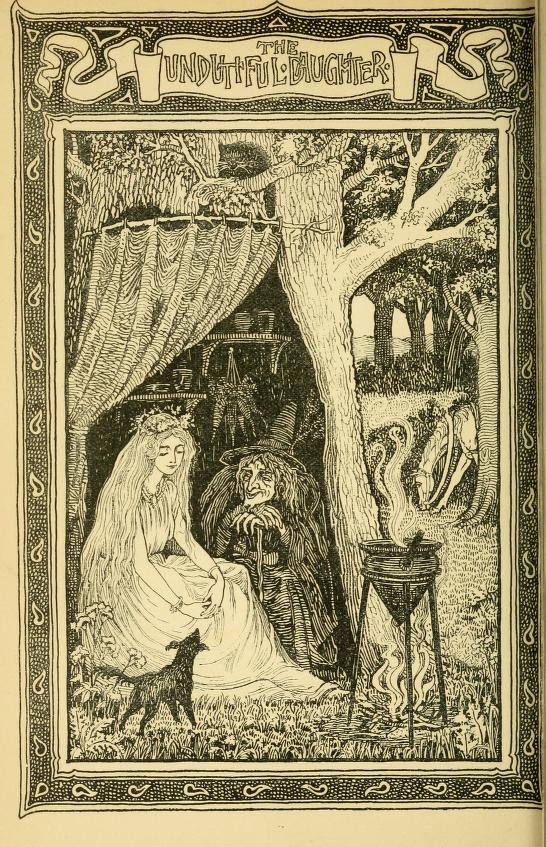

# The Undutiful Daughter

*Once there was a girl, a pretty little girl, and she was known, as: "Bonnie Annie"... She grew up to be quite beautiful... and didn't she know it...*

```{youtube}rV4yjHUBIw
```

I first came across this tale in Sabine Baring-Gould's *Old English Fairy Tales*. I've told it in the course of a sea-shanty evening, with the ending as Baring-Gould described it (the death of the female lead character), and which left the audience... slightly stunned. But the next item in the programme was a shanty band leading some singalong shanties, which brought the mood back up (as I expected it would...)

??first part feels as if it might have been repurposed from some other tale (the ballad starts off far more abruptly, with Captain presumably seducing the maiden)

sbg's version is not very satisfactory, so I have made a start on repairing it so that it works for me, and is perhaps more in keeping with the original ballad.

```{admonition} *The Undutiful Daughter*, 1895
Sabine Baring-Gould, *Old English fairy tales*, 1895, [p141-156](https://archive.org/details/oldenglishfairyt00bari/page/140/mode/2up).

VII

THE UNDUTIFUL DAUGHTER

There was a beautiful damsel who lived with her father and mother in a seaside place. They had a fine house and garden, and many servants.

This damsel was so vain that she cared for nothing but to look at her face in a glass.

Now, before her birthday, her father said to her, "Tell me what you most desire in all the world, and if possible, it shall be yours."

So she said, "Give me a room, all the walls of which are lined with mirrors, so that in it, wherever I look, I shall see myself."

He was sorrowful when he heard this, and he said to her, "My dear child, unless you think and care for something else except your own self, and your own beauty, I do not think that much good will attend you."

But she was headstrong and vain, and nothing would satisfy her but to have her looking-glass chamber. She answered her father and said,

What is there more beautiful to be seen than my face?"

He rejoined, "Surely there are sweet flowers, the rose and the lily, and the daffadowndilly."

"The rose," said she, "has thorns, the lily has no colour, and the daffadowndilly has no scent. I am more beautiful than all these flowers — I have no teasing thorns, I have blooming pink cheeks, and my breath is sweeter than the new-mown hay."

"Then," rejoined her father, "there are beauteous birds, the peacock and the nightingale."

"The peacock," she said, "has a hideous voice, and the nightingale has voice and no comeliness. Therefore I am better than they. I dress more gorgeously than the peacock, and I have the voice of a nightingale."

"Then," rejoined he, "consider the butterfly and the bee."

"The butterfly," she said, "has no honey, and the bee has a sting. I am better than they. I am joyous and bright as the butterfly, and I have store of gold and jewels and riches, treasure richer than the honey in the hive of the bee."

When her father heard her thus speak, he saw that her mind was fully eaten up with vanity. But as he had promised to give her what she desired, he was obliged to let her have the room lined with mirrors.

Therein the beautiful damsel was happy. She twirled and skipped, and looked at herself from every side, and in every posture, and was quite satisfied that never had there been anyone more beautiful than she, and that there was nothing else worth seeing except herself.

So time passed, and a new birthday drew near. Then her father said to her, "Tell me what you wish, and I will give it you."

She answered, "I wish to consult the Old Woman of Norwood as to whom I shall marry."

Her father rejoined, "That is not a wise thing to desire. When it pleases Heaven, the right man will come, one whom I and your mother will approve of, and you will love; and if he is a man of honour, and character, and family, then the marriage shall take place. You are our only child and our heir, and we do not intend you to be thrown away on anyone."

"Thrown away on anyone!" exclaimed the maiden. "I am not one who will allow of that. I am quite sure I will not marry anyone under a king."

"A king!" exclaimed her father. "You aim very high. I do not know where you will find one. Our king in England has a good queen — God grant him and her a long life!"

"I did not say that I would marry an English king. There are other kings, and one may come to me from over the sea. I will hear what the Old Woman of Norwood says to me."

"The Norwood gipsy may put strange fancies into your head. She can do you no good," said her father.

Nevertheless, as he had made the promise to let her have on her birthday what she asked, he was obliged to consent.

So she mounted her milkwhite horse, and she had bells of silver hung to the bridle, that they might tinkle, and cause people along the way to run out of their houses and look at her, the most beautiful damsel in all England.

When she reached Norwood, she found an old woman who lived in a hollow oak tree. A dog lay at her feet, a black cat sat on a branch above her head, and at the top of the tree was perched a raven, and above the tree-top hummed a gnat. Then she put a purse of gold into the old woman's hand, and said to her, "Tell me whom I shall marry, and what shall become of me."

Then the old woman said, "Little dog, little dog! what do you say?"

The dog stood up and barked, "Wow-wow-wow."

"Did you hear what my dog said?" asked the Old Woman of Norwood.

"I heard him say 'Wow-wow,' nothing more."

"He said in Dog-Latin, that you would marry a king."

"I knew it would be so," retorted the girl. "Tell me something more?"

"Little cat, little cat! what do you say?" called the gipsy woman.

Then the black pussy stood up on the branch, stretched itself, and said, "Mi-aw, mi-aw, mi-aw."

"Did you hear what the cat said?" asked the witch.

"I heard him say 'Mi-aw,' nothing more."

"He said in Cat-Greek, that you would sleep in a golden bed."

"Of course I shall, if I marry a king. Tell me something more."

"Little crow, little crow! what do you say?" screamed the old hag.

Then the raven flapped his wings, and answered, "Caw-caw-caw."

"Did you hear what the raven said?" asked the gipsy.

"I heard him say 'Caw,' nothing more."

"He said in Crow-Indian, that you would be attended by servants dressed in blue, who would rock you in your golden bed."

"That is nothing wonderful," said the maiden. "Tell me something further."

"Little gnat, little gnat! what do you say?" screamed the old woman.

Then the mosquito that was humming and fluttering above the tree-top, dropped within hearing of the girl's ear, and with a shrill pipe cried, "Pe-heep."

"Did you hear what the gnat said?" asked the witch.

"I heard him give a shrill little cry, like 'Pe-heep!'"

"That was Midge-Chinese. He said you would sleep under curtains of living green."

Well! the damsel was well pleased with what she had heard, but she wanted to know more.



The witch said, "I have no more creatures whom I can ask, except only a worm that burrows in the ground, and he cannot speak."

"Then what good is he?"

"He can crawl on a slate and write a message," answered the witch.

"Then summon the worm," ordered the girl.

The old hag took a piece of crooked iron, and scratched on the soil, and presently drew out a long red worm. This she placed on a bit of slate, and it began to crawl.

When it had crawled over the surface, the witch said —

"Do you see what he has written?"

"I see only some slimy wet marks."

"That is his writing, and he writes to say, that you will be carried away from home in a coach drawn by a thousand white horses, shaking their white manes."

"That will be a grand wedding," said the girl.

Then she returned home. And if she was a proud woman when she went forth to consult the Old Woman of Norwood, she was a prouder woman when she came home.

She went into her room lined with looking-glasses, and said, "I shall marry a king."

"Who told you that?" asked her mother.

"It was said by the dog when he uttered 'Wow- wow.'"

"I would not believe the bark of a dog," said her mother.

"And I shall sleep in a golden bed," continued the girl.

"Who said that?" asked her mother.

"That was said by the cat when he said 'Mi-aw.'"

"I would not put faith in the mi-aw of a cat," said her mother.

"And I shall be rocked to sleep by attendants dressed in gowns of blue," said the girl.

"Who said that?" asked her mother. 146

"That was told by the raven when he said 'Caw.'"

"If I were you, I would laugh at the caw of a crow," said her mother.

"And I shall have waving curtains of living green above me," continued the vain girl.

"Who told you that?" asked her mother.

"That was what the midge said that fluttered in the air."

"And what does a midge know about the future?" asked her mother.

"And I am to ride in a coach drawn by a thousand milkwhite horses," said the girl.

"Who put that nonsense into your head?" asked her mother.

"That was written by an earthworm on a bit of slate."

"And pray, who taught the worm to write?" asked her mother. "I can see farther off than can those stupid creatures, and I see that your vanity and folly will bring you to a bad end."

But the girl would give no heed to what her mother said. She believed the earthworm, but not her own mother.

Now drew near this damsel's birthday, when she would be eighteen. And one night she had a dream, and in that dream she saw the Old Woman of Nor- wood, who said to her, "I have appeared to tell you something. There is a feather on the tail of the gnat that flies above my oak tree, and the feather told the gnat, and the gnat told the raven, and the raven told the cat, and the cat told the dog, and the dog told the earthworm, and the earthworm

scribbled the message on a bit of an old crock, that you were to marry on your eighteenth birthday the promised king. You must say nothing to your father or mother. He is now in the harbour with his ship, and the sign of the ship is The Golden Apple. Ask your father to let you go down to see over the barque. The Golden Apple, and the captain is he who will be your husband. I have sent a hedge- priest to the town, and he will marry you on board ship. But mind this — if you say a word to your father or mother about this, all will fall through that has been promised you. I have appeared in dream to the sea-captain, and he will expect you. The priest you will see standing by the capstan. He has been unfrocked by the bishop, but what of that? A priest is always a priest."

The girl's father came to her and said, "Tomorrow is your birthday: ask what you wish, and I will do it for you."

Then she said, "There is a ship come lately into harbour, called The Golden Apple. I greatly desire to go over her."

Her father shook his head, and said, "This is a very unwise request. I hear no good account ol this vessel. Some say it is that of a notorious pirate; but, indeed, no one really knows any certainty about her, nor who her captain is; but some assert that the crew is made up of runagates, and has on board a hedge-priest lately unfrocked by his bishop for grave misconduct."

However, as he had promised to let her have her way, he was obliged to grant her request.

Accordingly, on the morrow morning, she and her father and mother went to the ship, and the captain received them very graciously, and invited them to go all over the vessel.

By the capstan was a man, all shaven and shorn, but with a hang-dog look, and the fair maid was sure this was the priest of whom the Old Woman of Norwood had spoken.

The captain invited them down into his cabin, and then all at once he whistled, and his sailors sprang on the father and mother, and bound their hands, and put something over their mouths that they could not cry out, and forthwith the sea-cap- tain gave his hand to the damsel, and led her up the companion ladder on deck, and the hedge-priest hastily married them over the capstan.

After that, the sea-captain said, "Make haste, go home and bring all the gold and silver and jewels in the house. I will not let your parents go till that is done.

Oh, take of your father his gold and his treasure, Oh, take of your mother her fee without measure."

"But," said she, "is it true that you are a king?"

"Yes," he answered; "call any of my men and ask them."

Then she summoned a little cabin-boy, and said, "Answer me truly — who is your master?"

He said at once, "He is a king."

Then she was satisfied that she had the right husband.

But she asked further, "Shall I be driven away in a carriage drawn by a thousand white horses?"

He answered, "Yes; call up any of my men, and" ask them."

So she summoned the mate, and said, "Is it so, that if I go with your master, I shall be carried away in a coach drawn by a thousand white horses?"

He answered, "Nay, you say too few. There will be ten thousand white horses shaking their milkwhite manes."

Then she was content.

She hasted on shore, and she filled baskets with all the jewels and gold she could find, the silver plate, the necklaces and chains of her mother, rings and goblets, and everything of value she could lay her hands on, and she made all her servants carry them down to the harbour, and they were taken on board by the sea-captain and his men.

Then he said, "Is all here?"

She said, "All but one gold bodkin with which my mother does her netting, and one silver spoon with which my father eats an egg."

He said, "Go and fetch them."

So she went back and brought the gold bodkin and the silver spoon, and then nothing was left in the house but pewter dishes and maplewood bowls, and a wooden spoon.

Now, when she had thus cleared her home, then the captain released her father and mother, and at once spread sail, and as there was a fine wind off

shore, the sail filled, and the ship flew away to sea like a gull.

Then said the damsel, "But where is the coach?" and where are the white horses?"

The captain laughed and answered, "This ship is the coach, and the waves shaking their white manes are the horses."

"But," said she, "you are a king. Where is your kingdom?"

"My kingdom is this ship," he answered, "and my name is Andrew King. Therefore it is true that you have wed A. King."

Then she saw that she had been deceived, and she cried out —

"O captain! O captain! here's fifty gfld crowns.  
I pray thee, I pray thee to turn the ship round.  
O captain! O captain, here's fifty gold pounds,  
If thou wilt but set me again on the ground."

But he would not hear of it.

Now before very long she found that her husband, the sea-captain, was indeed a great pirate, and robbed ships on the sea.

And when she had sailed to-day and to-morrow. She was wringing her hands, and bewailing in sorrow. And when she had sailed not many a mile, She knew she had been an undutiful child.

Now after a while a strange thing happened.

Although the sails were full spread, and the wind blew free, yet the vessel made no way in the sea. And this was the reason, I suppose. The father and the mother of the damsel had been so filled with grief that they had been plundered and deserted by their own daughter, whom they had loved so dearly, and had treated with such indulgence, that both died of a broken heart, and neither blessed the daughter before death closed their eyes and paralysed their tongues. And it is said that no ship will sail with one on board who has been the death of father and mother, and unforgiven by them.

And when she had sailed to-day and to-morrow, She was wring-'mg her hands, and bewailing- in sorrow. And when she had sailed, the days were not many, The sails were outspread, but of miles made not any.

Then the sailors saw they were in evil plight, and that there was something which prevented their getting forward with the ship. It is told that there is a little shell-fish, like a limpet, called the remora, and that when it attaches itself to the keel, it arrests a vessel in full sail.

The sailors dived and examined the ship's keel, and no remora was there. So they knew that the fault must be on board, and they resolved to draw lots, and discover who it was who held the ship fast in mid-seas.

They cast the black bullets as they sailed on the water, The black bullet fell on the undutiful daughter. "Oh, who in the ship must go over the side?" Oh, none save the maiden, the fair captain's bride.

When the damsel learned that the lot had fallen on her, and she was to be cast overboard, and that

unless she were drowned, the ship could not move on her way, then she said, weeping —

"Oh, get me a boat that is narrow and thin  
And set me, undutiful daughter, therein."

But they refused. They wanted the boat for themselves, and could not spare it for her. Then she said —

"Oh, take a white napkin, about my head bind it. Oh, take a white napkin, about my feet wind it. Alack that I must in the deep salten water, Alack! I must sink, an undutiful daug-hter."

To this they agreed. They bound a v/hite kerchief about her head, and they wrapped a sheet about her feet.

They took a white napkin, about her head bound it, They took a white napkin, about her feet wound it, They cast the fair pretty maid over, and she Did sink out of sight in cruel salt sea.

Then at once the beak of the vessel began to cut the waves, they foamed about her sides, and she sped along her course like a gull. That night there was no cloud in the sky, an east wind was blowing, and the moon was full. Then the man at the wheel saw something in the water: —

The moon it was shining, the tide it was flowing, Oh, what in the wake of the vessel was swimming?

"Oh, see, boys! oh, see! how she floats in the water!  
Oh, see, boys! oh, see! the undutiful daughter."

At the cry of the man at the helm all the crew ran on deck, and with them the captain, and they could see the dead woman following the ship.

Then the sea-captain spoke, standing in the bows —

"Why swim in the moonlight, upon the sea swaying-?  
Oh, what art thou seeking-? for what art thou praying?"  
"O captain! O captain! I float on the water,  
For the sea giveth up the undutiful daughter.

Oh, take of my father the gold and the treasure.  
Oh, take of my mother a fee without measure.  
Oh, make me a coffin of deepest gold `[In the original "deepest stole yellow": what stole means I do not know.]` yellow.  
And bury me under the banks of green willow."

The demand of the dead lady was not so readily granted.  

The captain did not like to take all the treasure that the maiden had carried off, and convert it into a coffin. But night and day the drowned woman followed the ship, and cried out for the restoration of all that of which she had despoiled her parents.

It was clear that she could not sink. The sea rejected her, because of her guilt.

After three days, the sailors became so alarmed at being thus followed by the dead woman, that they insisted on her demand being complied with. So she was again taken on board.

Now, all the gold was brought forth and melted up, and made into a golden coffin, and in that golden cofBn her body was laid; and they put in beside her all the jewels she had taken from her parents. Then they lowered the gold coffin into the sea again, and at once it began to float away, with the sun shining on it, and was lost to sight.

After three days, they were short of water, and so came ashore to fill their casks.

The sails they were spread, and the wind it was blowing—,  
The sea was so salt, and the tide it was flowing—.  
They steered for the land, and they reachèd the shore.  
But the lady in her coffin had got there before.

It was even so. The first thing they saw on coming to land was the gold coffin washed up on the beach. Then they heaved it farther up, to where hung some green willows, and they buried the undutiful daughter under their waving, living green boughs — and so were fulfilled all the words of prophecy told concerning her. She had married a king. She had been driven in a coach by white horses, even by the foaming waves. She had slept in a golden bed, — her coffin, — and been rocked by attendants in blue gowns, even the sea-waves; and she had now been laid under wavy curtains of living green, the branches of the willow.

```

```{admonition} Barine-Gould's notes, 1895
:class: dropdown seealso

Note.— The old ballad of "The Undutiful Daughter" is one that I have heard from half a dozen aged singers in the west of England. It is always sung to the melody to which "The Frog and the Crow" is set in Mr. W. Crane's The Bahys Opera. A similar ballad is found in Scotland, "Bonnie Annie"; it is given by Kinloch, but is more imperfect than the English form of the ballad. In the story I have based on it, all the first part is new; for obvious reasons I have been unable to follow the ballad exactly — that is to say, for reasons obvious to all who are acquainted with the ballad.

There is an old printed ballad entitled "The Faithless Captain; or, The Betrayed Virgin," which seems to be a comparatively modern recast of the older story. All the supernatural element has been eliminated from it. Instead of the damsel being cast over-board because the lot is thrown and falls to her, the ship is nearly wrecked, and she accidentally falls overboard. The body still follows the vessel, and, seeing his bride there in the water, the captain, who, after all, is not faithless, jumps overboard, and is drowned as well.

```

Several years earlier, Baring-Gould's collection of the ballad in Devon merited a note in Child's collection alongside "Bonnie Annie", which Baring-Gould also likened to the Cornish ballad he had heard:

```{admonition} As "Bonnie Annie", in Child's *The English and Scottish popular ballads*, 1882

Francis James Child, *The English and Scottish popular ballads*, 1882, [p452-3](https://archive.org/details/englishscottishp08chil/page/452/mode/1up).

[24.] Bonnie Annie.

P. 245 ff. The Rev. S. Baring-Gould has recently found this ballad in South Devon.

a. Taken down from a man of above eighty years at Bradstone. b. From a young man at Dartmoor, c. From an old man at Holne.

1 'Twas of a sea-captain came oer the salt billow,  
He courted a maiden down by the green willow:  
'O take of your father his gold and his treasure,  
O take of your mother her fee without measure.'

2 'I'll take of my father his gold and his treasure,  
I'll take of my mother her fee without measure:'  
She has come with the captain unto the seaside, O,  
"We 'll sail to lands foreign upon the blue tide, O!'

3 And when she had sailed today and tomorrow,  
She was beating her hands, she was crying in sorrow;  
And when she had sailed the days were not many,  
The sails were outspread, but of miles made not any.

4 And when she had sailed today and tomorrow.  
She was beating her hands, she was crying in sorrow;  
And when she had sailed not many a mile, O,  
The maid was delivered of a beautiful child, O.

5 . ...

6 'O take a white napkin, about my head bind it!  
O take a white napkin, about my feet wind it!  
Alack! I must sink, both me and my baby.  
Alack! I must sink in the deeji salten water.

7 'O captain, O captain, here 's fifty gold crown, O,  
I pray thee to bear me and turn the ship round, O;  
O captain, O captain, here 's fifty gold pound, O,
If thou wilt but set me upon the green ground, O.'

8 'O never, O never I the wind it blows stronger,  
O never, O never! the time it grows longer;  
And better it were that thy baby and thou, O.  
Should drown than the crew of the vessel, I vow, O.'

9 'O get me a boat that is narrow and thin, O,  
And set me and my little baby therein, O:'  
'O no, it were better that thy baby and thou, O,  
Should drown than the crew of the vessel, I vow, O.'

10 They got a white napkin, about her head bound it,  
They got a white napkin, about her feet wound it;  
They cast her then overboard, baby and she, O,  
Together to sink in the cruel salt sea, O.

11 The moon it was sliining, the tide it was running;  
O what in the wake of the vessel was swimming?  
'O see, boys! O see how she floats on the water!  
O see, boys! O see! the undutiful daughter!

12 'Why swim in the moonlight, upon the sea swaying?  
O what art thou seeking? for what art thou praying?'  
'O captain, O captain, I float on the water;  
For the sea giveth up the undutiful daughter.

13 'O take of my father the gold and the treasure,  
O take of my mother her fee without measure;  
O make me a coffin of gold that is yellow,  
And bmy me under the banks of green willow!'

14 'I will make thee a coffin of gold that is yellow,  
I 'll bury thee under the banks of green willow;  
I 'll bury thee there as becoraeth a lady,  
I 'll bury thee there, both thou and thy baby.'

15 The sails they were spread, and the wind it was blowing,  
The sea was so salt, and the tide it was flowing;  
They steered for the land, and they reachd the shore, O,  
But the corpse of the maiden had reachd there before, O.

b. 1, 1,2. There was a sea-captain came to the seaside, O,  
He courted a damsel and got her in trouble.

13, 3. coffin of the deepest stoll yellow.

15, 4. But the mother and baby had got there before, O.

c. 1 'T is of a sea-captain, down by the green willow,  
He courted a damsel and brought her in trouble;  
When gone her mother's good will and all her father's money,  
She fled across the wide sea along with her Johnny.

2 They had not been sailing the miles they were many  
Before she was delivered of a beautiful baby:  
'O tie up my head! O and tie it up easy,  
And throw me overboard, both me and my baby!'

3 She floated on the waves, and she floated so easy,  
That they took her on board again, both she and her baby.  

(The rest forgotten.)

```

```{admonition} *Bonnie Annie*, in *Ancient Scottish ballads*, 1927
:class: dropdown

George Ritchie Kinloch (ed.), *Ancient Scottish ballads, recoverd from tradition*, 1827, [pp123-6](https://archive.org/details/ancientscottishb00kin/page/123/mode/2up).

BONNIE ANNIE.

There was a rich lord, and he lived in Forfar,  
He had a fair lady, and one only dochter.  
O, she was fair, O dear! she was honnie,  
A ship's captain courted her to be his honey.

There cam a ship's captain out owre the sea sailing,  
He courted this young thing till he got her wi' bairn.—  
"Ye'll steal your father's gowd, and your mother's money.  
And I'll mak ye a lady in Ireland bonnie."

She's stown her father's gowd and her mother's money.  
But she was never a lady in Ireland bonnie.

"There's fey fowk `[Fey fowk — people on the verge of death.]` in our ship, she winna sail for me,  
There's fey fowk in our ship, she winna sail for me."  
They've casten black bullets twice six and forty,  
And ae the black bullet fell on bonnie Annie.

"Ye'll tak me in your arms twa, lo, lift me cannie,  
Throw me out owre board, your ain dear Annie."  
He has tane her in his arms twa, lo, lifted her cannie,  
He has laid her on a bed of down, his ain dear Annie.

"What can a woman do, love, I'll do for ye;"  
Muckle can a woman do, ye canna do for me." —  
"Lay about, steer about, lay our ship cannie.  
Do all ye can to save my dear Annie."

"I've laid about, steer'd about, laid about cannie.  
But all I can do, she winna sail for me.  
Ye'll tak her in your arms twa, lo, lift her cannie,  
And throw her out owre board, your ain dear Annie."

He has tane her in his arms twa, lo, lifted her cannie,  
He has thrown her out owre board, his ain dear Annie.  
As the ship sailed, bonnie Annie she swam,  
And she was at Ireland as soon as them.

He made his love a coffin off the Goats of Yerrow,  
And buried his bonnie love doun in a sea valley.

NOTES ON BONNIE ANNIE.

*There s fey foiok in our ship, she winna sail for me, —* p. 124, V. 3.

There is a prevalent belief among sea-faring people, that, if a person who has committed any heinous crime be on ship-board, the vessel, as if conscious of its guilty burden, becomes unmanageable, and will not sail till the offender be removed: to discover whom, they usually resort to the trial of those on board, by casting lots `[TH: the casting of the black bullets]`; and the individual upon whom the lot falls is declared the criminal, it being believed that Divine Providence interposes in this manner to point out the guilty person.

*He made his love a coffin off the Goats of Yerrow. —* p. 126, V. 8.

It would be difficult to ascertain where *Yerrow* is situated; it would seem, however, to be on the seacoast, as "*Goats*" signifies inlets where the sea enters.

```

Several variations of the ballad of *Bonnie Annie* also appear as *The Banks of the Green Willow* and have been collected as part of an extensive songbook on the [*Musical Traditions*](https://www.mustrad.org.uk/) website: [*The Banks of the Green Willow*](https://www.mustrad.org.uk/songbook/banks_gw.htm). The copyright notice seeks permission as well as attribution as paert of the reproduction rights, so... too much overhead for me. The content is only a click away...
